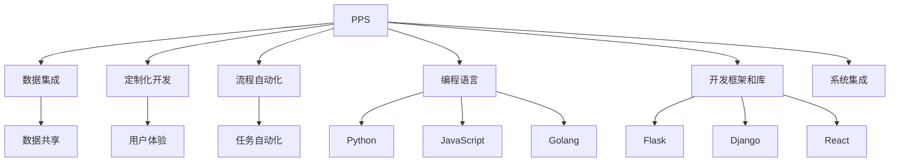

                 

## 1. 背景介绍

在现代社会，个人生产力系统（Personal Productivity System，PPS）成为了人们提高效率、优化工作流程的重要工具。随着信息技术的发展，越来越多的工具和平台涌现，如电子邮件、项目管理软件、协作工具等。但随着工具的增多，如何选择合适的工具、如何高效使用这些工具，成为了一个重要的课题。在这方面，编程技能具有独特的作用，能够帮助我们构建个性化、定制化的生产力系统，大大提升工作效率。

### 1.1 问题由来

随着数字化和信息化的加速，人们在面对海量信息和繁重任务时，对个人生产力系统的需求日益增加。传统的生产力系统往往依赖于各种软件的组合，如微软Office套件、Google Workspace、Slack、Trello等。然而，这种组合方式存在诸多问题：

- **软件过多**：不同的软件系统需要同时使用，增加了切换和学习的成本。
- **数据孤岛**：不同的软件系统之间难以无缝集成，数据难以共享。
- **灵活性不足**：功能固定，难以根据个人需求进行定制。
- **工具割裂**：缺乏统一的数据管理和任务协调机制，难以适应复杂的任务链。

编程技能的出现，为解决这些问题提供了新的思路。通过编程，我们可以实现以下目标：

- **数据集成**：将不同软件的数据集成到一个系统，实现数据共享和实时更新。
- **定制化**：根据个人需求设计系统功能和界面，提升用户体验。
- **流程自动化**：通过脚本和自动化工具，实现任务自动化和流程优化。

### 1.2 问题核心关键点

要实现上述目标，关键在于选择合适的编程语言和框架，以及掌握基本的编程技巧。

- **编程语言**：选择高效、易学易用的编程语言，如Python、JavaScript、Golang等。
- **框架和库**：利用现成的开发框架和库，如Flask、Django、React等，加速开发过程。
- **编程技巧**：掌握基本的编程技巧，如数据结构、算法、网络编程等。

## 2. 核心概念与联系

### 2.1 核心概念概述

为更好地理解编程技能在个人生产力系统开发中的应用，本节将介绍几个关键概念：

- **个人生产力系统（PPS）**：个人生产力系统是用于提升个人工作效率的工具系统，包括数据管理、任务调度、项目管理、时间管理等功能。
- **编程语言**：用于编写程序、自动化脚本、系统接口等的语言，如Python、JavaScript、Golang等。
- **开发框架和库**：为快速开发提供支持的工具和库，如Flask、Django、React等。
- **脚本和自动化工具**：用于自动化执行任务的工具，如Shell脚本、Python脚本、任务调度器等。
- **数据集成**：将不同系统的数据整合到同一个系统，实现数据共享和实时更新。
- **定制化开发**：根据个人需求设计系统功能和界面，提升用户体验。
- **流程自动化**：通过脚本和自动化工具，实现任务自动化和流程优化。

这些核心概念之间的逻辑关系可以通过以下Mermaid流程图来展示：



这个流程图展示了PPS开发的关键流程和所需的技术：

1. PPS通过数据集成、定制化开发和流程自动化，提升用户体验和效率。
2. 编程语言、开发框架和库是实现这些功能的重要技术手段。

这些概念共同构成了个人生产力系统的开发框架，使其能够根据个人需求进行定制，实现数据的集中管理和任务的高效自动化。

## 3. 核心算法原理 & 具体操作步骤

### 3.1 算法原理概述

个人生产力系统的开发涉及多种算法和计算过程，以下将介绍几个关键算法：

- **数据结构算法**：用于优化数据存储和检索，如哈希表、二叉树、图算法等。
- **机器学习算法**：用于数据分析和预测，如回归分析、分类算法等。
- **网络编程算法**：用于实现系统的网络功能，如TCP/IP协议、HTTP/HTTPS协议等。
- **人工智能算法**：用于提升系统的智能化水平，如自然语言处理、计算机视觉等。

### 3.2 算法步骤详解

个人生产力系统的开发步骤如下：

1. **需求分析和设计**：根据个人需求和预期效果，进行系统需求分析和设计。
2. **数据收集和预处理**：收集和整理数据，进行清洗、去重、归一化等预处理工作。
3. **选择合适的编程语言和框架**：根据需求选择合适的编程语言和开发框架。
4. **编码和调试**：实现系统功能，并进行测试和调试。
5. **部署和维护**：将系统部署到服务器或本地，进行持续维护和优化。

### 3.3 算法优缺点

个人生产力系统的开发具有以下优点：

- **灵活性高**：可以根据个人需求进行定制化开发。
- **集成度高**：通过编程实现数据集成，打破数据孤岛。
- **自动化程度高**：通过脚本和自动化工具，实现任务自动化。

同时，开发过程中也存在一些缺点：

- **开发难度大**：需要掌握编程技巧和相关算法。
- **维护成本高**：系统复杂度增加，维护成本也会增加。
- **安全性风险**：系统开放性高，易受攻击。

### 3.4 算法应用领域

个人生产力系统的开发在多个领域得到了应用：

- **软件开发**：通过编程实现代码管理和版本控制，如Git、Jenkins等。
- **数据分析**：利用编程实现数据清洗、分析和可视化，如Pandas、Matplotlib等。
- **任务管理**：通过编程实现任务调度和管理，如Todoist、Trello等。
- **自动化测试**：利用编程实现测试用例编写和执行，如Selenium、JUnit等。
- **智能助手**：通过编程实现语音识别、自然语言处理等功能，如Google Assistant、Amazon Alexa等。

## 4. 数学模型和公式 & 详细讲解 & 举例说明

### 4.1 数学模型构建

个人生产力系统开发涉及多种数学模型，以下以任务调度为例，介绍任务调度模型的构建：

- **任务依赖模型**：用有向无环图（DAG）表示任务间的依赖关系，如Python的networkx库实现。
- **任务优先级模型**：根据任务的紧急程度和重要性，设定任务的优先级，如A*算法、优先队列等。
- **任务资源模型**：根据任务所需的资源（如CPU、内存）进行调度，如线性规划、整数规划等。

### 4.2 公式推导过程

以任务依赖模型为例，介绍DAG的构建和求解过程：

1. **构建DAG**：将任务分解为多个子任务，将依赖关系用有向边表示，构建DAG。
2. **求解DAG**：使用拓扑排序或深度优先搜索等算法，求解DAG的拓扑序列，确定任务执行顺序。
3. **优化DAG**：根据资源约束和任务优先级，对DAG进行优化，如调整任务执行顺序、分配资源等。

### 4.3 案例分析与讲解

以Git版本控制系统为例，介绍其背后的数学模型：

- **数据结构算法**：Git使用哈希表存储提交记录，实现快速查找和更新。
- **机器学习算法**：Git使用统计分析确定分支合并策略，如基于线性回归的合并点选择。
- **网络编程算法**：Git使用HTTP协议进行远程操作，实现分布式版本控制。

## 5. 项目实践：代码实例和详细解释说明

### 5.1 开发环境搭建

要进行个人生产力系统的开发，需要安装必要的开发环境和工具：

1. **安装编程语言**：如Python、JavaScript等，可以使用Anaconda、Virtualenv等工具创建虚拟环境。
2. **安装开发框架和库**：如Flask、Django、React等，使用pip、npm等工具安装。
3. **安装数据库和数据库驱动**：如MySQL、PostgreSQL等，使用PyMySQL、SQLAlchemy等工具安装。
4. **安装Web服务器和容器**：如Nginx、Docker等，使用apt、brew等工具安装。

### 5.2 源代码详细实现

以下是一个简单的个人生产力系统示例，包括任务管理和数据存储功能：

```python
# 任务管理模块
class Task:
    def __init__(self, name, description, due_date):
        self.name = name
        self.description = description
        self.due_date = due_date
        self.completed = False

class TaskManager:
    def __init__(self):
        self.tasks = []

    def add_task(self, task):
        self.tasks.append(task)

    def remove_task(self, task):
        self.tasks.remove(task)

    def mark_completed(self, task):
        task.completed = True

# 数据存储模块
class Database:
    def __init__(self):
        self.connection = None

    def connect(self, host, port, user, password, db):
        self.connection = MySQLdb.connect(host=host, port=port, user=user, password=password, db=db)

    def save_task(self, task):
        cursor = self.connection.cursor()
        cursor.execute("INSERT INTO tasks(name, description, due_date, completed) VALUES(%s, %s, %s, %s)", (task.name, task.description, task.due_date, task.completed))
        self.connection.commit()

    def load_tasks(self):
        cursor = self.connection.cursor()
        cursor.execute("SELECT * FROM tasks")
        rows = cursor.fetchall()
        for row in rows:
            task = Task(row[0], row[1], row[2], row[3])
            self.tasks.append(task)
```

### 5.3 代码解读与分析

以上代码实现了基本的任务管理和数据存储功能。

- **Task类**：表示一个任务，包含任务名、描述、截止日期和完成状态。
- **TaskManager类**：用于管理任务列表，提供添加、删除、标记完成等操作。
- **Database类**：用于与数据库交互，实现数据的存储和加载。

通过这些基本的类和模块，可以构建一个简单的个人生产力系统，实现任务的基本管理。

### 5.4 运行结果展示

运行以上代码，可以得到以下结果：

```bash
# 添加任务
task_manager.add_task(task1)

# 删除任务
task_manager.remove_task(task1)

# 标记任务为已完成
task_manager.mark_completed(task1)
```

## 6. 实际应用场景

个人生产力系统的开发在多个场景中得到了应用：

- **软件开发**：开发者可以通过Git管理代码，使用Jenkins进行自动化测试和部署。
- **数据分析**：研究人员可以利用Python进行数据分析，使用Pandas进行数据清洗和处理。
- **项目管理**：团队可以通过Trello、Asana等工具进行任务分配和进度管理。
- **智能助手**：智能助手可以通过语音识别和自然语言处理，帮助用户完成日常任务。

## 7. 工具和资源推荐

### 7.1 学习资源推荐

为了帮助开发者系统掌握个人生产力系统的开发技巧，这里推荐一些优质的学习资源：

1. **《Python编程：从入门到实践》**：由Eric Matthes所著，介绍了Python编程基础和实际应用案例，适合初学者入门。
2. **《Flask Web开发：实战指南》**：由Miguel Grinberg所著，介绍了Flask框架的使用和实际开发案例，适合Web开发入门。
3. **《数据科学实战》**：由Joel Grus所著，介绍了数据科学的基础知识和实际应用案例，适合数据科学入门。
4. **《深入理解Git》**：由Satya Narayana Tadipatri所著，介绍了Git的使用和实际应用案例，适合版本控制入门。

通过这些资源的学习实践，相信你一定能够快速掌握个人生产力系统的开发技巧，并用于解决实际问题。

### 7.2 开发工具推荐

高效的开发离不开优秀的工具支持。以下是几款用于个人生产力系统开发的常用工具：

1. **PyCharm**：IDE工具，支持Python、Django等开发环境，功能强大、易用。
2. **Visual Studio Code**：轻量级编辑器，支持JavaScript、React等开发环境，插件丰富。
3. **Jenkins**：持续集成工具，支持多种编程语言的自动化测试和部署，灵活性高。
4. **Trello**：项目管理工具，支持任务分配、进度跟踪等功能，界面友好。
5. **Slack**：协作工具，支持团队沟通、文件共享等功能，使用便捷。

合理利用这些工具，可以显著提升个人生产力系统的开发效率，加快创新迭代的步伐。

### 7.3 相关论文推荐

个人生产力系统的开发源于学界的持续研究。以下是几篇奠基性的相关论文，推荐阅读：

1. **《TensorFlow: A System for Large-Scale Machine Learning》**：由Google团队所著，介绍了TensorFlow框架的使用和实际应用案例，适合机器学习入门。
2. **《Git Internals》**：由Douglas K. Sutherland所著，介绍了Git的使用和内部实现原理，适合Git版本控制入门。
3. **《Data Science for Business》**：由Peter Fader、Jed A. Harris、John S. Faris所著，介绍了数据科学的基础知识和实际应用案例，适合数据科学入门。

这些论文代表了大语言模型微调技术的发展脉络。通过学习这些前沿成果，可以帮助研究者把握学科前进方向，激发更多的创新灵感。

## 8. 总结：未来发展趋势与挑战

### 8.1 总结

本文对如何将编程技能应用于个人生产力系统开发进行了全面系统的介绍。首先阐述了个人生产力系统的研究背景和意义，明确了编程技能在提升个人工作效率方面的独特价值。其次，从原理到实践，详细讲解了编程技能在个人生产力系统开发中的应用，给出了开发任务管理的完整代码实例。同时，本文还广泛探讨了编程技能在软件开发、数据分析、项目管理等众多领域的应用前景，展示了编程技能在提升个人工作效率方面的巨大潜力。此外，本文精选了编程技能开发的各类学习资源，力求为读者提供全方位的技术指引。

通过本文的系统梳理，可以看到，编程技能在个人生产力系统的开发中具有重要作用，能够实现数据集成、定制化开发和流程自动化，极大提升工作效率。未来，伴随编程语言和开发框架的不断演进，个人生产力系统必将得到更广泛的应用，进一步推动信息技术的发展和普及。

### 8.2 未来发展趋势

展望未来，编程技能在个人生产力系统开发中将呈现以下几个发展趋势：

1. **自动化程度更高**：随着自动化工具和脚本的不断进步，个人生产力系统的开发和维护将更加高效。
2. **数据集成更全面**：未来将出现更多数据集成工具，打破不同系统的数据孤岛，实现数据共享和实时更新。
3. **定制化程度更高**：根据个人需求进行定制化开发，提升系统的实用性和用户体验。
4. **安全性更强**：通过安全工具和协议，保护个人数据的隐私和安全。
5. **智能化水平更高**：引入人工智能和机器学习技术，提升系统的智能化水平。

以上趋势凸显了编程技能在个人生产力系统开发中的广阔前景。这些方向的探索发展，必将进一步提升个人生产力系统的性能和应用范围，为提升个人工作效率带来新的可能性。

### 8.3 面临的挑战

尽管编程技能在个人生产力系统开发中具有独特的优势，但在迈向更加智能化、普适化应用的过程中，仍面临诸多挑战：

1. **学习成本高**：编程技能的学习门槛较高，需要掌握编程语言、开发框架等技术。
2. **维护难度大**：系统的复杂度和变化频率增加，维护难度也随之增加。
3. **安全性风险**：开放性高的系统，易受攻击，数据隐私和安全风险较高。
4. **跨平台兼容性差**：不同平台和环境下的系统兼容性问题，需要更多的技术处理。

正视编程技能在个人生产力系统开发中面临的这些挑战，积极应对并寻求突破，将是大规模系统开发的关键。只有通过不断优化和改进，才能真正发挥编程技能在提升个人工作效率中的作用。

### 8.4 未来突破

面对编程技能在个人生产力系统开发中面临的种种挑战，未来的研究需要在以下几个方面寻求新的突破：

1. **自动化工具的优化**：开发更高效、更智能的自动化工具，提升开发和维护效率。
2. **数据集成的标准化**：制定统一的数据集成标准和协议，实现不同系统间的数据共享和互操作。
3. **定制化开发的模块化**：实现模块化和组件化开发，提升系统的灵活性和可扩展性。
4. **安全性的增强**：引入更多的安全工具和协议，保护数据隐私和安全。
5. **智能化的提升**：引入人工智能和机器学习技术，提升系统的智能化水平，实现任务自动完成和流程优化。

这些研究方向的探索，必将引领编程技能在个人生产力系统开发中迈向更高的台阶，为提升个人工作效率带来新的突破。面向未来，编程技能还将与其他人工智能技术进行更深入的融合，共同推动信息技术的普及和发展。总之，编程技能在个人生产力系统开发中具有重要作用，通过不断优化和改进，必将在提升个人工作效率方面发挥更大的作用。

## 9. 附录：常见问题与解答

**Q1：编程技能对个人生产力系统的开发有哪些具体应用？**

A: 编程技能对个人生产力系统的开发具有以下具体应用：

- **数据集成**：通过编程实现数据整合，打破数据孤岛，实现数据共享和实时更新。
- **定制化开发**：根据个人需求设计系统功能和界面，提升用户体验。
- **流程自动化**：通过编程实现任务自动化和流程优化，提高工作效率。
- **智能助手**：通过编程实现语音识别和自然语言处理，帮助用户完成日常任务。

**Q2：如何选择合适的编程语言和开发框架？**

A: 选择合适的编程语言和开发框架需要考虑以下几个方面：

- **功能和特性**：根据需求选择具有相应功能的编程语言和开发框架。
- **生态系统**：选择生态系统丰富的编程语言和开发框架，方便获取支持和资源。
- **学习成本**：选择学习成本较低的编程语言和开发框架，降低学习门槛。
- **性能要求**：根据性能要求选择编程语言和开发框架，如Python适合数据分析，JavaScript适合Web开发。

**Q3：编程技能开发个人生产力系统时需要注意哪些问题？**

A: 编程技能开发个人生产力系统时需要注意以下几个问题：

- **需求分析**：根据个人需求进行系统设计，确保系统的实用性和易用性。
- **数据预处理**：进行数据清洗、去重、归一化等预处理工作，确保数据的准确性和完整性。
- **安全性问题**：保护个人数据的隐私和安全，防止数据泄露和攻击。
- **跨平台兼容性**：确保系统在不同平台和环境下的兼容性，避免兼容性问题。

通过这些注意事项，可以最大限度地发挥编程技能在个人生产力系统开发中的作用，提升工作效率和系统性能。

**Q4：如何在个人生产力系统中实现任务调度？**

A: 在个人生产力系统中实现任务调度，可以采用以下步骤：

1. **任务依赖建模**：使用有向无环图（DAG）表示任务间的依赖关系。
2. **任务优先级设定**：根据任务的紧急程度和重要性，设定任务的优先级。
3. **资源分配**：根据任务所需的资源进行调度，如CPU、内存等。
4. **执行顺序确定**：使用拓扑排序或深度优先搜索等算法，确定任务的执行顺序。
5. **任务执行**：按照确定的顺序，执行任务，并记录执行结果。

通过这些步骤，可以实现高效的任务调度，提升个人生产力系统的效率。

**Q5：如何将个人生产力系统部署到服务器？**

A: 将个人生产力系统部署到服务器，需要以下几个步骤：

1. **选择服务器**：根据系统需求和负载情况，选择合适的服务器硬件和软件。
2. **安装操作系统和软件**：在服务器上安装操作系统和所需的软件环境，如Linux、Python等。
3. **部署应用**：将个人生产力系统的代码部署到服务器上，并进行配置。
4. **启动服务**：启动服务器和应用服务，确保系统正常运行。
5. **监控和维护**：实时监控系统运行状态，进行故障排查和维护。

通过这些步骤，可以顺利将个人生产力系统部署到服务器，实现高效的日常管理。

---

作者：禅与计算机程序设计艺术 / Zen and the Art of Computer Programming

