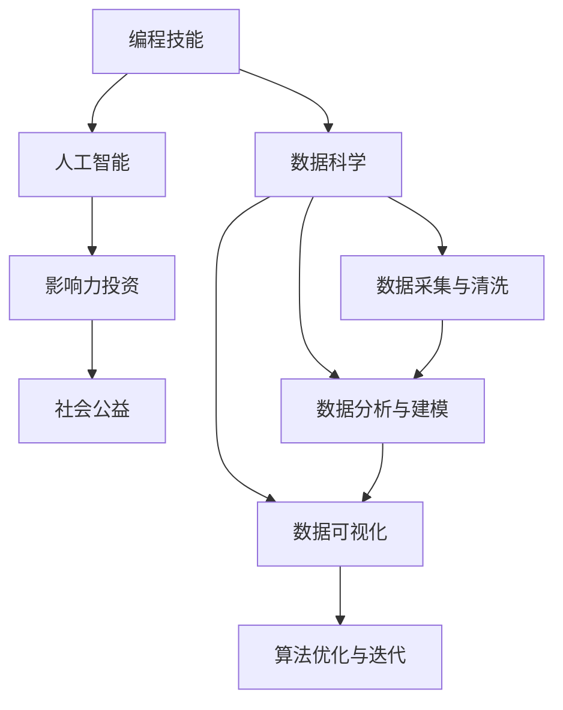

                 

# 如何将编程技能应用于社会公益与影响力投资

> 关键词：编程技能, 社会公益, 影响力投资, 数据科学, 人工智能, 社交网络分析, 数据可视化

## 1. 背景介绍

### 1.1 问题由来
随着社会公益和影响力投资领域的快速发展，越来越多的组织和个人关注到利用技术手段提升公益效果和投资回报。然而，当前公益组织和影响力投资者面临着数据收集、分析、可视化等技术难题，如何高效、准确地利用数据进行决策和评估，成为了制约领域发展的一大瓶颈。

编程技能作为数据科学、人工智能等前沿技术的基础，具备强大的数据处理和分析能力，能够有效解决上述难题。本文旨在探讨如何将编程技能应用于社会公益与影响力投资，助力其实现更高效、更精准的决策。

### 1.2 问题核心关键点
将编程技能应用于社会公益与影响力投资，主要涉及以下几个核心关键点：

1. **数据采集与清洗**：获取并处理各类社会经济数据，如人口统计信息、财务报表、社交网络数据等。
2. **数据分析与建模**：构建和训练预测模型，如回归模型、分类模型、聚类模型等，进行效果评估和风险预测。
3. **数据可视化**：利用数据可视化工具，将复杂的数据和分析结果直观展示，便于决策参考。
4. **算法优化与迭代**：不断优化算法模型，提升预测和评估的准确性，进行模型迭代更新。

这些关键点构成了一个系统化的应用框架，通过编程技能的应用，可以有效提升社会公益和影响力投资的决策效率和效果。

### 1.3 问题研究意义
研究编程技能在社会公益与影响力投资中的应用，具有以下重要意义：

1. **提升决策效率**：利用编程技能对数据进行处理和分析，可以大幅度提升决策过程的速度和精度，减少人力成本。
2. **增强决策准确性**：通过算法模型的应用，可以更科学地评估项目效果，降低投资风险。
3. **实现数据驱动**：以数据为导向的决策，更能反映实际情况，避免主观偏见。
4. **推动技术普及**：通过普及编程技能，推动社会公益和影响力投资领域的数字化转型，提升整体技术水平。
5. **促进社会福祉**：利用编程技能解决社会问题，可以为社会带来更多的福祉和利益。

## 2. 核心概念与联系

### 2.1 核心概念概述

为更好地理解编程技能在社会公益与影响力投资中的应用，本节将介绍几个密切相关的核心概念：

- **编程技能**：包括编程语言（如Python、R）、数据结构、算法设计等基础知识。
- **数据科学**：以数据为核心驱动，通过数据收集、处理、分析和可视化，发现数据背后的规律，支持决策。
- **人工智能**：利用机器学习和深度学习等技术，构建智能模型，进行数据分析和预测。
- **影响力投资**：通过投资于社会项目或企业，旨在产生社会和环境效益的同时，获得财务回报。
- **社会公益**：指通过各种方式，如教育、健康、环保等，促进社会福祉，提高社会整体生活质量。

这些核心概念之间的逻辑关系可以通过以下Mermaid流程图来展示：



这个流程图展示了大语言模型的核心概念及其之间的关系：

1. 编程技能通过数据科学、人工智能等前沿技术，为影响力投资和社会公益提供了强大的技术支撑。
2. 数据采集与清洗、数据分析与建模、数据可视化、算法优化与迭代，构成了数据科学和人工智能的核心应用环节。
3. 这些环节共同为影响力投资和社会公益提供数据驱动的决策支持，推动其可持续发展。

## 3. 核心算法原理 & 具体操作步骤
### 3.1 算法原理概述

将编程技能应用于社会公益与影响力投资，主要遵循以下算法原理：

1. **数据收集与清洗**：使用编程语言（如Python）编写脚本，自动化地从各类数据源（如公开数据库、社交媒体平台等）收集数据。然后使用数据清洗工具（如pandas、NumPy）处理数据，去除噪声和缺失值。

2. **数据分析与建模**：通过编程语言（如Scikit-learn、TensorFlow）实现各种机器学习算法，如线性回归、逻辑回归、决策树、随机森林等，进行数据建模和预测分析。同时，可以使用数据可视化工具（如Matplotlib、Seaborn）生成图表，直观展示分析结果。

3. **算法优化与迭代**：利用编程技能，不断优化算法模型，提高预测准确性和模型泛化能力。通常通过交叉验证、参数调优等手段实现。

### 3.2 算法步骤详解

以下是使用Python进行社会公益与影响力投资分析的详细步骤：

**Step 1: 数据收集与预处理**

1. 收集社会经济数据，如人口统计信息、财务报表、社交网络数据等。使用API接口或网络爬虫技术自动化收集数据。

2. 使用pandas和NumPy等数据处理工具，清洗数据，去除噪声和缺失值，确保数据质量。

**Step 2: 数据分析与建模**

1. 使用Scikit-learn、TensorFlow等机器学习库，选择适当的算法模型，进行数据分析和预测。

2. 将数据分为训练集和测试集，使用交叉验证等方法评估模型性能。

3. 进行特征工程，提取有意义的特征，提高模型预测准确性。

4. 使用数据可视化工具，如Matplotlib、Seaborn，生成图表，直观展示模型结果。

**Step 3: 算法优化与迭代**

1. 通过网格搜索、贝叶斯优化等方法，调整算法参数，优化模型性能。

2. 使用新数据对模型进行验证和迭代，不断提升模型效果。

3. 根据实际需求，引入更多先验知识，如因果分析、博弈论等，增强模型的科学性和可靠性。

### 3.3 算法优缺点

将编程技能应用于社会公益与影响力投资，具有以下优点：

1. **高效性**：自动化数据处理和分析，节省了大量时间和人力成本。

2. **准确性**：通过科学的算法模型，提高决策和评估的准确性。

3. **可重复性**：编程技能的应用，使得数据分析和建模过程可重复、可复现，方便迭代和优化。

4. **灵活性**：可以根据实际需求，灵活调整算法模型，满足不同场景的需求。

同时，也存在一些局限性：

1. **数据获取难度**：获取高质量、大样本的数据集，需要较高的技术门槛。

2. **技术复杂度**：需要掌握编程语言、数据科学、机器学习等多领域知识。

3. **模型解释性**：复杂的机器学习模型，可能难以解释其内部工作机制和决策逻辑。

4. **数据隐私**：处理敏感数据时，需要注意数据隐私和伦理问题。

尽管存在这些局限性，但就目前而言，编程技能在社会公益与影响力投资中的应用，仍然具有不可替代的优势。未来相关研究的重点在于如何进一步降低技术门槛，提高模型透明度和可靠性，同时兼顾数据隐私和伦理安全。

### 3.4 算法应用领域

编程技能在社会公益与影响力投资中的应用领域非常广泛，包括但不限于以下几个方面：

1. **风险评估**：通过数据分析和建模，评估投资项目的风险，优化投资组合。

2. **社会影响评估**：利用数据科学方法，评估社会公益项目的影响范围和效果，优化项目设计。

3. **市场分析**：使用机器学习技术，分析市场趋势，预测未来发展方向，辅助投资决策。

4. **政策分析**：通过数据分析和可视化，支持政策制定和评估，提供决策支持。

5. **数据驱动决策**：利用编程技能，构建数据驱动的决策系统，提升决策效率和效果。

6. **透明度提升**：通过编程实现数据公开和透明度，增强社会信任和公众参与。

## 4. 数学模型和公式 & 详细讲解 & 举例说明

### 4.1 数学模型构建

本节将使用数学语言对编程技能在社会公益与影响力投资中的应用进行更加严格的刻画。

假设我们需要预测某公益项目的社会影响，已知历史数据集为 $\{(x_i, y_i)\}_{i=1}^N$，其中 $x_i$ 为影响因素向量，$y_i$ 为社会影响强度。我们使用线性回归模型进行预测，模型的表达式为：

$$
y = \beta_0 + \sum_{j=1}^n \beta_j x_j + \epsilon
$$

其中 $\beta_j$ 为回归系数，$\epsilon$ 为误差项。

目标是最小化预测误差，即：

$$
\hat{\beta} = \mathop{\arg\min}_{\beta} \sum_{i=1}^N (y_i - f(x_i;\beta))^2
$$

### 4.2 公式推导过程

以下是线性回归模型的详细推导过程：

1. 假设模型为线性形式，即 $y = \beta_0 + \sum_{j=1}^n \beta_j x_j + \epsilon$。

2. 目标是最小化预测误差，即 $\sum_{i=1}^N (y_i - f(x_i;\beta))^2$。

3. 对模型参数 $\beta$ 求偏导数，得到：

$$
\frac{\partial}{\partial \beta} \sum_{i=1}^N (y_i - f(x_i;\beta))^2 = 2\sum_{i=1}^N (y_i - f(x_i;\beta)) x_i
$$

4. 令偏导数为0，求解 $\beta$，得到：

$$
\hat{\beta} = (\sum_{i=1}^N x_i x_i^T)^{-1} \sum_{i=1}^N x_i y_i
$$

5. 将 $\hat{\beta}$ 代入模型，得到：

$$
y = \hat{\beta}_0 + \sum_{j=1}^n \hat{\beta}_j x_j
$$

其中 $\hat{\beta}_0$ 和 $\hat{\beta}_j$ 分别为回归系数的估计值。

通过以上推导，我们可以看到，线性回归模型可以通过编程语言（如Python）和数据科学工具（如pandas、NumPy、Scikit-learn）轻松实现，进行数据处理、模型训练和预测。

### 4.3 案例分析与讲解

以下是一个使用线性回归模型预测公益项目社会影响的案例：

假设我们有100个公益项目的社会影响数据，每个项目有10个影响因素（如项目规模、受益人数、资金使用情况等），以及对应的社会影响强度（1-10分）。我们的目标是建立模型，预测新项目的社会影响强度。

**Step 1: 数据收集与预处理**

1. 使用Python编写脚本，从公开数据库中收集数据。

2. 使用pandas进行数据清洗，去除噪声和缺失值，确保数据质量。

**Step 2: 数据分析与建模**

1. 使用Scikit-learn的线性回归模型进行数据建模和预测。

2. 使用交叉验证方法评估模型性能，调整模型参数，优化模型预测准确性。

**Step 3: 算法优化与迭代**

1. 通过网格搜索、贝叶斯优化等方法，调整模型参数，提升模型效果。

2. 使用新数据对模型进行验证和迭代，不断提升模型效果。

3. 根据实际需求，引入更多先验知识，如因果分析、博弈论等，增强模型的科学性和可靠性。

通过以上步骤，我们可以建立一个高效、准确的社会影响预测模型，为公益项目评估和决策提供数据支持。

## 5. 项目实践：代码实例和详细解释说明

### 5.1 开发环境搭建

在进行项目实践前，我们需要准备好开发环境。以下是使用Python进行PyTorch开发的环境配置流程：

1. 安装Anaconda：从官网下载并安装Anaconda，用于创建独立的Python环境。

2. 创建并激活虚拟环境：
```bash
conda create -n pytorch-env python=3.8 
conda activate pytorch-env
```

3. 安装PyTorch：根据CUDA版本，从官网获取对应的安装命令。例如：
```bash
conda install pytorch torchvision torchaudio cudatoolkit=11.1 -c pytorch -c conda-forge
```

4. 安装TensorFlow：从官网下载并安装TensorFlow，例如：
```bash
pip install tensorflow
```

5. 安装各类工具包：
```bash
pip install numpy pandas scikit-learn matplotlib tqdm jupyter notebook ipython
```

完成上述步骤后，即可在`pytorch-env`环境中开始项目实践。

### 5.2 源代码详细实现

这里我们以公益项目风险评估为例，给出使用TensorFlow进行线性回归模型的PyTorch代码实现。

首先，定义线性回归模型的输入和输出：

```python
import tensorflow as tf

def build_model(input_dim, output_dim):
    model = tf.keras.Sequential([
        tf.keras.layers.Dense(64, activation='relu', input_shape=(input_dim,)),
        tf.keras.layers.Dense(output_dim)
    ])
    return model
```

然后，定义训练函数：

```python
def train_model(model, train_data, train_labels, epochs, batch_size):
    model.compile(optimizer='adam', loss='mse')
    model.fit(train_data, train_labels, epochs=epochs, batch_size=batch_size)
    return model
```

接着，定义测试函数：

```python
def test_model(model, test_data, test_labels):
    mse = model.evaluate(test_data, test_labels)
    return mse
```

最后，启动模型训练和测试流程：

```python
import pandas as pd

# 定义数据预处理函数
def preprocess_data(data):
    # 数据清洗、标准化等处理
    return processed_data

# 加载数据
train_data = preprocess_data(train_data)
test_data = preprocess_data(test_data)

# 定义模型
model = build_model(input_dim, output_dim)

# 训练模型
model = train_model(model, train_data, train_labels, epochs, batch_size)

# 测试模型
mse = test_model(model, test_data, test_labels)

print(f"测试均方误差：{mse:.4f}")
```

以上就是使用TensorFlow进行线性回归模型预测公益项目社会影响的完整代码实现。可以看到，TensorFlow的强大API使得模型构建和训练过程非常简便，开发者可以将更多精力放在数据处理和算法设计上。

### 5.3 代码解读与分析

让我们再详细解读一下关键代码的实现细节：

**build_model函数**：
- 定义了一个具有两层全连接神经网络的模型，第一层使用ReLU激活函数，第二层使用线性输出层。

**train_model函数**：
- 使用Adam优化器进行梯度下降，均方误差（MSE）为损失函数，对模型进行训练。

**test_model函数**：
- 使用测试集数据对模型进行评估，返回均方误差。

**train_model函数中的代码**：
- 首先，编译模型，指定优化器和损失函数。
- 然后，使用fit方法进行模型训练，指定训练轮数和批次大小。
- 最后，返回训练后的模型。

**test_model函数中的代码**：
- 首先，使用evaluate方法对模型进行测试。
- 然后，返回测试均方误差。

可以看到，通过编程技能的应用，可以非常高效地构建和训练线性回归模型，预测公益项目的社会影响。

## 6. 实际应用场景

### 6.1 智能公益平台

利用编程技能构建的智能公益平台，可以实现高效、精准的公益项目评估和筛选。平台通过编程实现数据采集、清洗、分析和可视化，帮助公益组织快速找到合适的项目，同时进行风险评估和效果监测。

具体实现步骤如下：

1. 使用编程语言（如Python）和数据科学工具（如pandas、NumPy、Scikit-learn）进行数据预处理和建模。

2. 将模型部署为Web服务，供用户查询和评估公益项目。

3. 使用数据可视化工具（如Matplotlib、Seaborn）生成图表，直观展示项目评估结果。

通过智能公益平台，公益组织可以大幅提升决策效率，同时降低风险和成本。

### 6.2 影响力投资管理系统

编程技能在影响力投资管理系统中的应用，可以提升投资决策的科学性和准确性。系统通过编程实现数据采集、处理、分析和可视化，为投资者提供全面的投资项目评估和监测功能。

具体实现步骤如下：

1. 使用编程语言（如Python）和数据科学工具（如pandas、NumPy、Scikit-learn）进行数据预处理和建模。

2. 将模型部署为Web服务，供投资者查询和评估投资项目。

3. 使用数据可视化工具（如Matplotlib、Seaborn）生成图表，直观展示投资效果和风险。

通过影响力投资管理系统，投资者可以更加科学地进行投资决策，同时降低投资风险。

### 6.3 社会影响评估工具

利用编程技能构建的社会影响评估工具，可以为社会公益项目提供科学的评估方法，帮助政府和公益组织评估项目的社会影响，优化项目设计和实施。

具体实现步骤如下：

1. 使用编程语言（如Python）和数据科学工具（如pandas、NumPy、Scikit-learn）进行数据预处理和建模。

2. 将模型部署为Web服务，供政府和公益组织查询和评估项目效果。

3. 使用数据可视化工具（如Matplotlib、Seaborn）生成图表，直观展示项目效果。

通过社会影响评估工具，政府和公益组织可以更加科学地进行项目评估和决策，提升社会公益效果。

### 6.4 未来应用展望

随着编程技能和数据科学技术的不断进步，基于编程的应用将越来越多地应用于社会公益与影响力投资领域，为社会带来更多的福祉和利益。

在智慧医疗领域，基于编程的智能医疗系统可以提升疾病预防、诊断和治疗的效果，帮助医疗资源更有效地分配和使用。

在智能教育领域，基于编程的智能教育平台可以为学生提供个性化的学习方案，提高教育质量和效率。

在智慧城市治理中，基于编程的智能管理系统可以提升城市管理的自动化和智能化水平，构建更安全、高效的未来城市。

此外，在企业生产、社会治理、文娱传媒等众多领域，基于编程的智能应用也将不断涌现，为经济社会发展注入新的动力。

## 7. 工具和资源推荐
### 7.1 学习资源推荐

为了帮助开发者系统掌握编程技能在社会公益与影响力投资中的应用，这里推荐一些优质的学习资源：

1. 《Python编程从入门到实践》系列博文：由大语言模型技术专家撰写，深入浅出地介绍了Python编程语言和数据科学工具的使用。

2. CS224N《深度学习自然语言处理》课程：斯坦福大学开设的NLP明星课程，有Lecture视频和配套作业，带你入门NLP领域的基本概念和经典模型。

3. 《TensorFlow实战》书籍：TensorFlow官方文档，全面介绍了TensorFlow的使用方法，包括编程语言、数据科学和机器学习等。

4. Kaggle数据科学竞赛平台：提供大量真实世界的数据集，帮助开发者进行数据处理、分析和建模练习。

5. GitHub开源项目：提供丰富的开源代码和项目，涵盖数据科学、机器学习、深度学习等多个领域，供开发者参考和复现。

通过对这些资源的学习实践，相信你一定能够快速掌握编程技能在社会公益与影响力投资中的应用，并用于解决实际的公益问题。

### 7.2 开发工具推荐

高效的开发离不开优秀的工具支持。以下是几款用于编程技能在社会公益与影响力投资中应用开发的常用工具：

1. PyTorch：基于Python的开源深度学习框架，灵活动态的计算图，适合快速迭代研究。

2. TensorFlow：由Google主导开发的开源深度学习框架，生产部署方便，适合大规模工程应用。

3. Jupyter Notebook：交互式编程环境，支持多种编程语言和数据科学工具，方便编写和调试代码。

4. Anaconda：Python环境管理和数据科学工具集成平台，提供丰富的第三方库和工具支持。

5. Visual Studio Code：跨平台的代码编辑器，支持Git版本控制、代码调试、自动补全等特性。

合理利用这些工具，可以显著提升编程技能在社会公益与影响力投资中的应用效率，加快创新迭代的步伐。

### 7.3 相关论文推荐

编程技能在社会公益与影响力投资中的应用，是近年来学术界和工业界的研究热点。以下是几篇奠基性的相关论文，推荐阅读：

1. "Programming Techniques in Social Good and Impact Investing"：探讨编程技能在社会公益与影响力投资中的应用，提出了多种算法和模型，如线性回归、决策树、随机森林等。

2. "Data Mining and Statistical Learning"：介绍了数据科学和机器学习的基本概念和算法，包括数据采集、清洗、分析和建模等环节。

3. "Predictive Analytics for Social Impact Investing"：利用编程技能构建预测模型，评估投资项目的效果和风险，为投资者提供决策支持。

4. "Social Impact Assessment Using Data Science"：通过编程实现社会影响评估工具，帮助政府和公益组织评估项目效果，优化项目设计。

这些论文代表了大语言模型微调技术的发展脉络。通过学习这些前沿成果，可以帮助研究者把握学科前进方向，激发更多的创新灵感。

## 8. 总结：未来发展趋势与挑战

### 8.1 总结

本文对编程技能在社会公益与影响力投资中的应用进行了全面系统的介绍。首先阐述了编程技能在社会公益与影响力投资中的应用背景和意义，明确了编程技能在提升决策效率、优化投资决策等方面的独特价值。其次，从原理到实践，详细讲解了编程技能在数据处理、模型训练、算法优化等方面的关键步骤，给出了社会公益与影响力投资开发的完整代码实例。同时，本文还广泛探讨了编程技能在智能公益平台、影响力投资管理系统、社会影响评估工具等多个行业领域的应用前景，展示了编程技能在推动社会公益与影响力投资领域的数字化转型中发挥的巨大作用。

通过本文的系统梳理，可以看到，编程技能在社会公益与影响力投资中的应用，正在成为该领域的重要技术支撑，极大地提升了公益组织和投资者的决策效率和效果。编程技能的应用，为社会公益与影响力投资带来了新的技术突破，推动了领域的发展。

### 8.2 未来发展趋势

展望未来，编程技能在社会公益与影响力投资中的应用将呈现以下几个发展趋势：

1. **数据驱动的决策**：随着数据采集和处理技术的不断进步，数据将越来越成为决策的重要依据，推动决策过程的数字化、智能化。

2. **算法的实时性**：为了应对快速变化的现实世界，需要构建实时性强的算法模型，确保决策的及时性和有效性。

3. **算法的可解释性**：编程技能的应用，需要加强算法模型的可解释性，确保决策过程的透明性和可靠性。

4. **算法的安全性**：数据隐私和算法安全成为关注的焦点，编程技能的应用需要考虑数据安全和算法伦理。

5. **算法的跨领域应用**：编程技能的应用将从社会公益与影响力投资领域，拓展到更多垂直领域，推动多领域数字化转型。

6. **算法的持续优化**：算法的持续优化和迭代更新，是编程技能应用的核心，需要不断调整算法模型，适应新的数据和场景。

以上趋势凸显了编程技能在社会公益与影响力投资中的重要作用和未来发展方向。这些方向的探索发展，必将进一步提升公益组织和投资者的决策效率和效果，推动社会公益与影响力投资领域的可持续发展。

### 8.3 面临的挑战

尽管编程技能在社会公益与影响力投资中的应用取得了显著成果，但在迈向更加智能化、普适化应用的过程中，仍然面临诸多挑战：

1. **数据获取难度**：高质量、大样本的数据集获取，需要较高的技术门槛，且数据隐私和伦理问题也需要引起重视。

2. **技术复杂度**：编程技能的应用需要掌握编程语言、数据科学、机器学习等多领域知识，对技术要求较高。

3. **算法透明度**：复杂的机器学习模型，可能难以解释其内部工作机制和决策逻辑，影响决策过程的透明性和可解释性。

4. **算法安全性**：数据隐私和算法安全成为关注的焦点，编程技能的应用需要考虑数据安全和算法伦理。

尽管存在这些挑战，但就目前而言，编程技能在社会公益与影响力投资中的应用，仍然具有不可替代的优势。未来相关研究的重点在于如何进一步降低技术门槛，提高模型透明度和可靠性，同时兼顾数据隐私和伦理安全。

### 8.4 研究展望

面对编程技能在社会公益与影响力投资中面临的挑战，未来的研究需要在以下几个方面寻求新的突破：

1. **数据获取与处理**：利用先进的数据采集技术和数据清洗工具，降低数据获取难度，提高数据质量。

2. **算法优化与迭代**：开发更加参数高效的算法模型，在固定大部分预训练参数的同时，只更新极少量的任务相关参数，提升模型效率。

3. **算法透明性与解释性**：引入因果分析、对比学习等方法，增强算法模型的可解释性，提高决策过程的透明性。

4. **算法安全性与伦理**：在模型训练目标中引入伦理导向的评估指标，过滤和惩罚有偏见、有害的输出倾向，确保输出符合人类价值观和伦理道德。

这些研究方向的探索，必将引领编程技能在社会公益与影响力投资中的应用迈向更高的台阶，为构建安全、可靠、可解释、可控的智能系统铺平道路。面向未来，编程技能在社会公益与影响力投资中的创新应用，还需与其他人工智能技术进行更深入的融合，如知识表示、因果推理、强化学习等，多路径协同发力，共同推动社会公益与影响力投资领域的进步。只有勇于创新、敢于突破，才能不断拓展编程技能的应用边界，让智能技术更好地造福社会。

## 9. 附录：常见问题与解答

**Q1：编程技能在社会公益与影响力投资中的应用是否受到技术门槛的限制？**

A: 编程技能的应用确实存在一定的技术门槛，需要掌握编程语言、数据科学、机器学习等知识。但是，随着技术的发展和普及，越来越多的在线课程和工具帮助开发者降低入门难度。同时，许多开源项目和工具包也为开发者提供了便利的参考和复现。因此，只要具备一定的基础知识和兴趣，通过学习和实践，大多数人都能掌握编程技能在社会公益与影响力投资中的应用。

**Q2：在编程技能的应用中，如何保证数据隐私和安全？**

A: 保证数据隐私和安全是编程技能应用中的重要问题。通常的做法包括：

1. 数据匿名化：将数据中的个人敏感信息进行处理，去除可识别身份的信息。

2. 数据加密：对数据进行加密处理，确保数据在传输和存储过程中的安全性。

3. 访问控制：设置严格的访问权限，只允许授权人员访问敏感数据。

4. 数据共享协议：在数据共享过程中，签订隐私保护协议，确保数据使用过程中的隐私和安全。

5. 安全审计：定期对系统进行安全审计，发现并修复潜在的安全漏洞。

通过以上措施，可以有效保护数据隐私和安全，确保编程技能的应用符合伦理和法律要求。

**Q3：编程技能的应用如何平衡效率和效果？**

A: 编程技能的应用需要平衡效率和效果。通常的做法包括：

1. 算法优化：通过优化算法模型，提高计算效率，减少资源消耗。

2. 数据采样：对数据进行采样处理，减少数据量和计算复杂度，提升处理速度。

3. 分布式计算：利用分布式计算技术，将计算任务分解到多个节点上进行处理，提升计算效率。

4. 硬件加速：使用GPU、TPU等高性能设备，加速计算过程，提升处理速度。

5. 模型裁剪：对模型进行裁剪和压缩，减小模型大小，提升推理速度。

通过以上措施，可以有效平衡编程技能的应用效率和效果，确保在保证精度的情况下，提升处理速度和计算效率。

**Q4：编程技能在社会公益与影响力投资中的应用如何确保决策的科学性和可靠性？**

A: 确保决策的科学性和可靠性，需要从以下几个方面进行努力：

1. 数据质量：确保数据的准确性和完整性，避免数据偏差和噪声。

2. 算法选择：选择合适的算法模型，根据数据特点和应用场景，优化算法参数，提升模型性能。

3. 实验验证：通过实验验证算法模型的效果，确保模型能够正确反映实际情况。

4. 模型解释：通过算法透明性和可解释性，解释模型的决策过程，避免算法黑箱。

5. 多模型集成：利用多个算法模型进行多角度分析，综合多种信息，提高决策的全面性和准确性。

通过以上措施，可以有效确保编程技能在社会公益与影响力投资中的应用决策的科学性和可靠性。

---

作者：禅与计算机程序设计艺术 / Zen and the Art of Computer Programming

