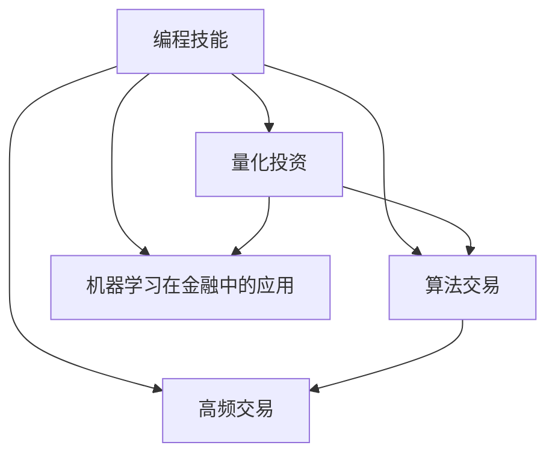

                 

# 如何将编程技能应用于自动化投资

在数字化和智能化的时代背景下，编程技能已成为各种自动化技术应用的基础。尤其是当其被应用于金融投资领域，自动化投资策略的开发和优化变得更加重要和复杂。本文将深入探讨如何将编程技能应用于自动化投资，涵盖从基础算法到实际应用的全过程，旨在帮助读者理解这一前沿领域。

## 1. 背景介绍

### 1.1 问题由来

金融市场以其复杂性和不确定性著称，传统的投资策略往往依赖人工分析和经验判断，耗时耗力且难以应对市场波动。自动化投资策略通过编程实现算法自动化决策，能在大数据分析和模型训练的基础上，实时响应市场变化，提高投资收益和风险控制。这一技术的应用日益广泛，从个人理财到大型基金，从现货交易到衍生品投资，都见到了其身影。

### 1.2 问题核心关键点

自动化投资的核心在于通过编程实现投资决策的自动化，具体关键点包括：
- 算法开发：设计并实现投资策略算法，如技术分析、统计套利、机器学习等。
- 数据处理：收集、清洗、处理各类市场数据，提取关键特征。
- 模型训练：在历史数据上训练投资模型，优化策略参数。
- 回测验证：在回测环境中模拟历史数据，评估模型表现。
- 实时交易：将模型应用于真实市场，进行自动化交易。

### 1.3 问题研究意义

自动化投资策略的发展，极大提升了投资效率和收益，降低了市场波动带来的风险。其研究意义包括：
- 提高投资收益：通过算法自动化决策，减小人为失误，提高投资回报率。
- 降低交易成本：自动化策略可以大规模快速交易，降低交易摩擦成本。
- 实时风险控制：自动化策略能实时监测市场变化，迅速调整投资组合，保护资金安全。
- 推动金融创新：编程技能在金融领域的广泛应用，推动了量化投资、高频交易等金融创新。
- 优化资源配置：自动化投资技术能够优化资源配置，提升整个金融市场效率。

## 2. 核心概念与联系

### 2.1 核心概念概述

为更好地理解如何将编程技能应用于自动化投资，本节将介绍几个核心概念：

- **编程技能**：指的是掌握编程语言（如Python、C++、Java等）和开发工具（如Jupyter Notebook、IDE等），能够进行系统设计和算法实现的综合能力。
- **量化投资**：基于数学模型和计算机程序，通过大量历史数据和计算仿真，进行投资组合优化和交易策略的自动化决策。
- **算法交易**：利用计算机算法来执行交易决策，以提高交易效率和收益。
- **机器学习在金融中的应用**：通过训练机器学习模型，对市场数据进行预测和分类，实现自动化决策。
- **高频交易**：利用计算机程序实现高频次的买卖操作，追求微小的价格波动带来的收益。

这些核心概念之间的逻辑关系可以通过以下Mermaid流程图来展示：



这个流程图展示了一体化的自动化投资系统：

1. 编程技能是基础，涵盖了算法设计、数据处理、模型训练、回测验证等环节。
2. 量化投资将编程技能与数学建模相结合，通过算法自动化决策进行投资。
3. 算法交易和机器学习在金融中的应用，都是量化投资的一部分。
4. 高频交易是算法交易的一种形式，追求高频次的交易决策。

这些核心概念共同构成了自动化投资的技术框架，为构建自动化投资策略提供了必要的技术支持。

## 3. 核心算法原理 & 具体操作步骤
### 3.1 算法原理概述

自动化投资的核心在于通过编程实现算法自动化决策。通常，这一过程包括以下几个步骤：

1. **数据获取**：通过API接口或爬虫技术，收集各类市场数据，如股票价格、交易量、基本面数据等。
2. **特征工程**：利用编程技能进行数据预处理和特征提取，构建可用于建模的数据集。
3. **模型设计**：选择合适的算法模型，如回归分析、统计套利、机器学习等，进行策略设计。
4. **模型训练**：在历史数据上训练模型，优化策略参数，构建自动化投资策略。
5. **回测验证**：在回测环境中模拟历史数据，评估模型性能和风险。
6. **实时交易**：将模型应用于真实市场，执行自动化交易，实时调整投资组合。

### 3.2 算法步骤详解

以下以机器学习在金融中的应用为例，详细讲解自动化投资的基本流程：

**Step 1: 数据获取与预处理**
- 通过Python的Pandas库，使用API接口或爬虫技术，收集历史市场数据，如股票价格、交易量、基本面数据等。
- 使用Pandas进行数据清洗和预处理，如缺失值处理、异常值检测、数据转换等。

**Step 2: 特征工程**
- 使用编程技能提取数据中的关键特征，如均值、标准差、趋势、技术指标等。
- 利用机器学习库（如Scikit-learn、TensorFlow）进行特征选择和降维处理。

**Step 3: 模型设计**
- 选择适合的市场预测模型，如线性回归、决策树、随机森林、神经网络等。
- 使用编程语言（如Python）和库（如TensorFlow、PyTorch）实现模型代码。

**Step 4: 模型训练**
- 使用历史数据集进行模型训练，优化参数，如学习率、正则化系数、迭代次数等。
- 使用编程工具（如Jupyter Notebook）可视化训练过程，监控模型表现。

**Step 5: 回测验证**
- 使用编程技能构建回测框架，模拟历史数据，执行交易策略。
- 使用Pandas库记录交易历史和收益情况，评估模型效果。

**Step 6: 实时交易**
- 在实际市场环境下，使用编程工具实现自动化交易。
- 实时监控市场变化，调整投资组合，确保策略有效执行。

### 3.3 算法优缺点

基于编程的自动化投资策略有以下优点：
1. **效率高**：自动化策略可以快速执行大量交易，提高市场响应速度。
2. **准确性好**：通过编程实现精确计算，减少人为失误，提高策略精度。
3. **可扩展性**：算法策略可轻松扩展到不同市场和资产，适用性广。
4. **实时调整**：自动化策略可实时根据市场变化调整投资组合，优化风险控制。

同时，该方法也存在一些局限：
1. **依赖数据质量**：投资决策依赖于高质量的市场数据，数据噪声或异常值可能影响模型表现。
2. **模型复杂性**：复杂的投资模型需要更高的计算资源和更长的训练时间。
3. **需要编程技能**：构建和维护自动化策略需要一定的编程基础和经验。
4. **过度拟合风险**：模型可能过度拟合历史数据，导致在未知数据上表现不佳。

### 3.4 算法应用领域

基于编程的自动化投资策略在金融领域得到了广泛应用，主要涵盖以下几个领域：

1. **量化基金管理**：使用编程技术开发量化基金策略，通过计算机算法进行资产配置和组合优化，提高基金收益。
2. **高频交易**：利用编程实现高频交易策略，通过高频次的买卖操作，追求微小的价格波动带来的收益。
3. **股票和商品投资**：使用编程技术进行股票和商品市场的量化交易，优化投资组合。
4. **衍生品交易**：通过编程实现衍生品市场的自动化交易策略，如期权、期货等。
5. **风险管理**：使用编程技术进行风险评估和控制，构建自动化风险管理策略。

此外，自动化投资策略还在个人理财、企业投融资决策等领域有应用，逐步成为金融投资的重要工具。

## 4. 数学模型和公式 & 详细讲解  
### 4.1 数学模型构建

本节将使用数学语言对基于编程的自动化投资策略进行更加严格的刻画。

记市场数据集为 $D=\{(x_i,y_i)\}_{i=1}^N$，其中 $x_i$ 为特征向量， $y_i$ 为真实标签。假设使用的投资策略模型为 $f(x;\theta)$，其中 $\theta$ 为模型参数。

定义模型的损失函数为：

$$
\mathcal{L}(\theta) = \frac{1}{N}\sum_{i=1}^N \ell(f(x_i;\theta),y_i)
$$

其中 $\ell$ 为用于衡量预测值与真实值差异的损失函数，如均方误差、交叉熵等。

模型的优化目标是最小化经验风险，即找到最优参数：

$$
\theta^* = \mathop{\arg\min}_{\theta} \mathcal{L}(\theta)
$$

在实践中，我们通常使用基于梯度的优化算法（如SGD、Adam等）来近似求解上述最优化问题。设 $\eta$ 为学习率，则参数的更新公式为：

$$
\theta \leftarrow \theta - \eta \nabla_{\theta}\mathcal{L}(\theta)
$$

其中 $\nabla_{\theta}\mathcal{L}(\theta)$ 为损失函数对参数 $\theta$ 的梯度，可通过反向传播算法高效计算。

### 4.2 公式推导过程

以线性回归模型为例，推导损失函数及其梯度的计算公式。

假设市场数据集为 $D=\{(x_i,y_i)\}_{i=1}^N$，其中 $x_i \in \mathbb{R}^d$ 为特征向量， $y_i \in \mathbb{R}$ 为真实标签。假设使用的线性回归模型为 $f(x;\theta)=\theta_0+\theta_1x_1+\cdots+\theta_dx_d$，其中 $\theta=(\theta_0,\theta_1,\cdots,\theta_d)$ 为模型参数。

定义损失函数为均方误差损失：

$$
\ell(f(x_i;\theta),y_i) = \frac{1}{2}(f(x_i;\theta)-y_i)^2
$$

将其代入经验风险公式，得：

$$
\mathcal{L}(\theta) = \frac{1}{N}\sum_{i=1}^N (y_i-f(x_i;\theta))^2
$$

根据链式法则，损失函数对参数 $\theta_k$ 的梯度为：

$$
\frac{\partial \mathcal{L}(\theta)}{\partial \theta_k} = \frac{1}{N}\sum_{i=1}^N (f(x_i;\theta)-y_i)(-2x_{ik})
$$

其中 $x_{ik}$ 为特征向量 $x_i$ 的第 $k$ 个元素。

在得到损失函数的梯度后，即可带入参数更新公式，完成模型的迭代优化。重复上述过程直至收敛，最终得到适应市场的最优模型参数 $\theta^*$。

## 5. 项目实践：代码实例和详细解释说明
### 5.1 开发环境搭建

在进行自动化投资策略开发前，我们需要准备好开发环境。以下是使用Python进行PyTorch开发的环境配置流程：

1. 安装Anaconda：从官网下载并安装Anaconda，用于创建独立的Python环境。

2. 创建并激活虚拟环境：
```bash
conda create -n pytorch-env python=3.8 
conda activate pytorch-env
```

3. 安装PyTorch：根据CUDA版本，从官网获取对应的安装命令。例如：
```bash
conda install pytorch torchvision torchaudio cudatoolkit=11.1 -c pytorch -c conda-forge
```

4. 安装各类工具包：
```bash
pip install numpy pandas scikit-learn matplotlib tqdm jupyter notebook ipython
```

完成上述步骤后，即可在`pytorch-env`环境中开始开发实践。

### 5.2 源代码详细实现

下面我们以线性回归模型应用于股市预测为例，给出使用PyTorch进行自动化投资策略开发的PyTorch代码实现。

首先，定义线性回归模型：

```python
import torch
from torch import nn

class LinearRegression(nn.Module):
    def __init__(self, input_size, output_size):
        super(LinearRegression, self).__init__()
        self.linear = nn.Linear(input_size, output_size)
    
    def forward(self, x):
        y_pred = self.linear(x)
        return y_pred
```

然后，定义训练函数：

```python
from torch.optim import SGD

def train_model(model, train_dataset, validation_dataset, epochs, batch_size, learning_rate):
    device = torch.device("cuda" if torch.cuda.is_available() else "cpu")
    model.to(device)
    
    optimizer = SGD(model.parameters(), lr=learning_rate, momentum=0.9)
    
    for epoch in range(epochs):
        model.train()
        train_loss = 0
        for data, target in train_dataset:
            data, target = data.to(device), target.to(device)
            optimizer.zero_grad()
            output = model(data)
            loss = torch.nn.MSELoss()(output, target)
            loss.backward()
            optimizer.step()
            train_loss += loss.item()
        
        model.eval()
        with torch.no_grad():
            validation_loss = 0
            for data, target in validation_dataset:
                data, target = data.to(device), target.to(device)
                output = model(data)
                loss = torch.nn.MSELoss()(output, target)
                validation_loss += loss.item()
        
        print(f"Epoch: {epoch+1}, Train Loss: {train_loss/len(train_dataset)}, Validation Loss: {validation_loss/len(validation_dataset)}")
```

最后，启动训练流程：

```python
from torch.utils.data import TensorDataset, DataLoader

# 创建数据集
train_data = torch.tensor([1, 2, 3, 4, 5], dtype=torch.float32)
train_target = torch.tensor([5, 7, 9, 11, 13], dtype=torch.float32)
train_dataset = TensorDataset(train_data, train_target)

validation_data = torch.tensor([6, 7, 8, 9, 10], dtype=torch.float32)
validation_target = torch.tensor([6, 7, 8, 9, 10], dtype=torch.float32)
validation_dataset = TensorDataset(validation_data, validation_target)

# 训练模型
train_model(LinearRegression(5, 1), train_dataset, validation_dataset, epochs=100, batch_size=4, learning_rate=0.001)
```

以上就是使用PyTorch进行线性回归模型训练的完整代码实现。可以看到，通过编程实现投资策略，可以灵活设计模型、定义损失函数、设置优化器等，极大地提升了策略开发的灵活性和可扩展性。

### 5.3 代码解读与分析

让我们再详细解读一下关键代码的实现细节：

**LinearRegression类**：
- `__init__`方法：定义模型结构，初始化线性层。
- `forward`方法：前向传播，将输入数据传入模型，计算预测输出。

**train_model函数**：
- 定义训练环境，将模型移至GPU上。
- 初始化优化器，设置学习率。
- 在每个epoch中，将模型置于训练状态，进行前向传播、反向传播和参数更新。
- 在验证集上计算验证损失，评估模型表现。
- 每epoch结束时，打印训练和验证损失，帮助监控训练过程。

**TensorDataset类**：
- 定义训练集和验证集，将输入和目标数据封装成TensorDataset对象。

**训练流程**：
- 创建训练集和验证集，定义输入和目标数据。
- 调用训练函数，执行模型训练，并输出训练和验证损失。

可以看到，通过编程实现投资策略，可以灵活设计模型结构、优化器参数、数据集划分等，极大地提升了策略开发的灵活性和可扩展性。开发者可以根据具体需求，进一步优化代码实现，提升投资策略的效果。

## 6. 实际应用场景
### 6.1 智能投顾系统

基于自动化投资策略的智能投顾系统，可以为用户提供个性化投资建议。通过编程实现的量化投资模型，结合用户的风险偏好和资产配置需求，实时提供最优的投资组合方案，帮助用户实现资产增值。

智能投顾系统通常包含以下模块：
1. **用户界面**：用户输入风险偏好和投资目标，选择模型推荐。
2. **数据接口**：实时获取市场数据，如股票价格、交易量等。
3. **模型优化**：利用编程技术优化投资模型，构建个性化推荐策略。
4. **交易执行**：根据用户指令和市场变化，执行自动交易。
5. **风险控制**：通过编程实现的风险管理模型，监控投资组合风险。

智能投顾系统能够大幅提升投资效率和收益，降低投资风险，深受投资者欢迎。

### 6.2 算法交易平台

算法交易平台使用编程实现的自动化交易策略，进行高频次的买卖操作，追求微小的价格波动带来的收益。通过编程技术实现的量化交易策略，可以实时监控市场变化，迅速调整交易决策，最大化收益。

算法交易平台通常具备以下特点：
1. **高频交易**：利用编程实现高频次的买卖操作，追求微小的价格波动带来的收益。
2. **自动化决策**：通过编程实现自动化交易决策，减少人为干预，提高交易效率。
3. **策略回测**：使用编程技术进行策略回测，评估交易效果。
4. **风险管理**：通过编程实现的风险管理模型，监控交易风险。
5. **交易执行**：利用编程技术实现实时交易，执行自动化交易。

算法交易平台在股票、期货、外汇等市场均有广泛应用，已成为量化交易的重要工具。

### 6.3 股票量化投资

基于编程的自动化投资策略在股票量化投资中得到了广泛应用。通过编程实现的量化投资模型，利用历史数据和市场分析，构建自动化交易策略，优化投资组合。

股票量化投资通常包括以下步骤：
1. **数据收集**：使用编程技术收集历史市场数据，如股票价格、交易量、基本面数据等。
2. **特征工程**：利用编程技术提取数据中的关键特征，如均值、标准差、趋势、技术指标等。
3. **模型设计**：选择合适的市场预测模型，如线性回归、统计套利、机器学习等。
4. **模型训练**：在历史数据上训练模型，优化参数。
5. **回测验证**：使用编程技术构建回测框架，模拟历史数据，评估模型效果。
6. **实时交易**：在实际市场环境下，执行自动化交易，实时调整投资组合。

股票量化投资在A股市场已有广泛应用，成为机构投资者重要的投资手段。

### 6.4 未来应用展望

随着自动化投资策略的发展，基于编程的应用场景将更加多样，未来有望在以下领域得到进一步拓展：

1. **跨市场套利**：利用编程实现的多市场交易策略，实时监控不同市场的价格差异，进行跨市场套利。
2. **资产配置优化**：通过编程实现的量化模型，优化不同资产之间的配置比例，实现资产组合的最大化收益和最小化风险。
3. **衍生品投资**：使用编程技术进行期权、期货等衍生品的自动化交易，提高交易效率和收益。
4. **智能投融资决策**：基于编程的量化模型，辅助企业进行投融资决策，优化资源配置。
5. **智能风险管理**：利用编程技术构建风险管理模型，实时监控和控制投资组合风险。
6. **市场情绪分析**：通过编程实现的市场情绪分析模型，实时捕捉市场情绪变化，优化交易决策。

未来，随着编程技术的进一步发展，自动化投资策略的应用范围将不断扩大，为金融市场带来更多的创新和变革。

## 7. 工具和资源推荐
### 7.1 学习资源推荐

为了帮助开发者系统掌握编程技能在自动化投资中的应用，这里推荐一些优质的学习资源：

1. **《Python数据科学手册》**：全面介绍了Python在数据科学和自动化投资中的应用，适合初学者和进阶者。
2. **《量化投资实战》**：系统讲解了量化投资的基本概念和实际案例，适合量化投资爱好者。
3. **《量化金融》**：详细介绍了量化金融的理论与实践，适合金融专业学生。
4. **《金融工程与计算方法》**：讲解了金融工程中的计算方法，适合金融工程师。
5. **Coursera《金融工程与风险管理》课程**：由耶鲁大学开设的在线课程，深入讲解了金融工程和风险管理的理论和方法。
6. **Kaggle量化投资竞赛**：参加量化投资竞赛，通过实际项目提升编程技能和投资策略设计能力。

通过对这些资源的学习实践，相信你一定能够快速掌握编程技能在自动化投资中的应用，并用于解决实际的投资问题。

### 7.2 开发工具推荐

高效的开发离不开优秀的工具支持。以下是几款用于自动化投资开发的常用工具：

1. **Jupyter Notebook**：Python编程的流行IDE，支持代码执行和数据可视化，适合编程和数据分析。
2. **PyTorch**：基于Python的深度学习框架，适合构建自动化投资模型。
3. **Pandas**：Python数据处理库，适合数据清洗、处理和分析。
4. **Matplotlib**：Python绘图库，适合数据可视化。
5. **Scikit-learn**：Python机器学习库，适合构建市场预测模型。
6. **TensorFlow**：Google开源的深度学习框架，适合构建复杂的多市场投资模型。

合理利用这些工具，可以显著提升自动化投资开发的效率，加快创新迭代的步伐。

### 7.3 相关论文推荐

自动化投资策略的发展离不开学术界的不断研究。以下是几篇奠基性的相关论文，推荐阅读：

1. **《高维时间序列分析》**：讲解了高维时间序列分析的理论和方法，适合自动化投资模型的构建。
2. **《机器学习在金融中的应用》**：系统介绍了机器学习在金融领域的应用，适合量化投资爱好者。
3. **《高频交易策略》**：详细讲解了高频交易的理论和实践，适合高频交易开发者。
4. **《量化投资模型构建》**：讲解了量化投资模型的构建和优化，适合量化投资研究者。

这些论文代表了大规模量化投资的发展脉络。通过学习这些前沿成果，可以帮助研究者把握学科前进方向，激发更多的创新灵感。

## 8. 总结：未来发展趋势与挑战
### 8.1 研究成果总结

本文对编程技能在自动化投资中的应用进行了全面系统的介绍。首先阐述了自动化投资的核心在于通过编程实现算法自动化决策，涵盖数据获取、特征工程、模型设计、模型训练、回测验证和实时交易等全过程。其次，从原理到实践，详细讲解了量化投资和算法交易的基本流程，提供了详细的代码实现，展示了编程技能在自动化投资中的应用。同时，本文还探讨了自动化投资在金融领域的应用场景，包括智能投顾系统、算法交易平台、股票量化投资等，展示了其广阔的应用前景。

通过本文的系统梳理，可以看到，编程技能在自动化投资中的应用已经成为金融领域的重要工具。编程技术使得投资决策更加科学、高效和灵活，为金融市场的稳健发展提供了新的动力。

### 8.2 未来发展趋势

展望未来，编程技能在自动化投资中的应用将呈现以下几个发展趋势：

1. **智能化的提升**：随着深度学习、自然语言处理等技术的进步，编程技能将进一步提升自动化投资的智能化水平，构建更加精准和灵活的模型。
2. **跨市场的协同**：通过编程技术实现的多市场协同投资策略，将进一步提升投资收益和风险控制。
3. **高频交易的普及**：高频交易技术将进一步普及，利用编程技术实现的高频交易策略将实现更加精确和实时的交易决策。
4. **数据驱动的决策**：编程技能将进一步提升数据处理和分析能力，数据驱动的投资决策将更加精准和可靠。
5. **隐私和安全的保护**：编程技术将进一步提升数据安全和隐私保护，确保投资数据的安全和合规。

以上趋势凸显了编程技能在自动化投资中的重要作用。这些方向的探索发展，必将进一步提升自动化投资的性能和应用范围，为金融市场带来更多的创新和变革。

### 8.3 面临的挑战

尽管编程技能在自动化投资中的应用已经取得了显著成果，但在迈向更加智能化、普适化应用的过程中，仍面临诸多挑战：

1. **数据获取的难度**：高质量的市场数据获取难度大，数据噪声和异常值可能影响模型性能。
2. **模型的复杂性**：复杂的多市场协同投资策略需要更高的计算资源和更长的训练时间。
3. **编程技能的门槛**：编程技能和数据处理能力的提升需要时间和实践经验的积累。
4. **模型的鲁棒性**：自动化投资模型可能面临市场波动和异常情况，鲁棒性不足会影响模型表现。
5. **隐私和安全的保护**：投资数据的保护和隐私安全是一个重要问题，需要技术手段和法规约束的共同保障。

正视编程技能在自动化投资中面临的这些挑战，积极应对并寻求突破，将是大规模自动化投资技术走向成熟的必由之路。相信随着学界和产业界的共同努力，这些挑战终将一一被克服，编程技能在自动化投资中的应用将更加广泛和深入。

### 8.4 研究展望

面对编程技能在自动化投资中面临的种种挑战，未来的研究需要在以下几个方面寻求新的突破：

1. **数据获取的智能化**：利用编程技术实现的数据挖掘和自动化数据标注，提高数据获取效率和数据质量。
2. **模型的轻量化**：开发更加轻量化的投资模型，降低计算资源消耗，提高模型训练和推理效率。
3. **编程技能的普及**：通过编程教育和在线课程，普及编程技能，提高从业人员的编程水平和数据处理能力。
4. **模型的鲁棒性增强**：研究鲁棒性强的投资模型，提高模型应对市场波动和异常情况的能力。
5. **隐私和安全的保护**：开发隐私保护和数据安全的算法和技术，确保投资数据的隐私和安全。

这些研究方向将进一步提升编程技能在自动化投资中的应用水平，推动金融市场的创新和可持续发展。

## 9. 附录：常见问题与解答

**Q1：编程技能在自动化投资中如何处理数据？**

A: 编程技能在自动化投资中的应用，首先需要对市场数据进行收集、清洗和预处理。这通常包括：
1. 数据获取：使用API接口或爬虫技术，从市场数据源获取历史数据。
2. 数据清洗：处理缺失值、异常值，去除噪声数据，进行数据标准化和归一化。
3. 特征提取：利用编程技能提取数据中的关键特征，如均值、标准差、趋势、技术指标等。
4. 数据集划分：将数据划分为训练集、验证集和测试集，用于模型训练、验证和测试。

**Q2：如何选择合适的投资模型？**

A: 选择合适的投资模型需要综合考虑市场特性、数据特点、模型复杂度等因素。一般来说，有以下几种常见的模型：
1. **线性回归**：适用于线性关系明显的市场预测，简单易懂，计算高效。
2. **统计套利**：利用市场异构性进行套利，需要较高的数学和统计知识。
3. **机器学习模型**：如决策树、随机森林、神经网络等，适用于非线性关系明显的市场预测，计算复杂度较高。
4. **深度学习模型**：如卷积神经网络、循环神经网络等，适用于复杂市场数据的建模，计算资源需求大。

根据具体市场和数据特点，选择合适的投资模型，并在编程技术下进行模型设计和实现。

**Q3：自动化投资策略有哪些风险？**

A: 自动化投资策略的风险主要包括：
1. **数据风险**：数据噪声和异常值可能影响模型性能，数据缺失或不完整可能影响策略效果。
2. **模型风险**：复杂的投资模型可能存在过拟合或欠拟合，模型鲁棒性不足可能影响策略在未知数据上的表现。
3. **市场风险**：市场波动和异常情况可能使策略失效，需要风险控制模型和策略优化。
4. **技术风险**：编程技能和数据处理能力的不足可能影响策略的实施效果，需要持续学习和技术提升。

投资者需要充分了解自动化投资策略的风险，并采取相应的风险控制措施，确保策略的稳健性。

**Q4：如何评估自动化投资策略的效果？**

A: 评估自动化投资策略的效果需要多方面的考量：
1. **历史回测**：在历史数据上执行策略，评估模型预测准确率和收益情况。
2. **风险评估**：评估策略的风险收益比，计算夏普比率、最大回撤等指标。
3. **实时验证**：在实际市场环境下执行策略，评估策略的实际表现和风险控制效果。
4. **用户反馈**：收集用户的反馈，了解策略的实际应用效果和用户体验。

通过全面的评估，可以更好地了解自动化投资策略的效果和改进方向。

**Q5：自动化投资策略在实际应用中有哪些挑战？**

A: 自动化投资策略在实际应用中面临以下挑战：
1. **数据获取难度大**：高质量的市场数据获取难度大，数据噪声和异常值可能影响模型性能。
2. **计算资源需求高**：复杂的投资模型需要更高的计算资源和更长的训练时间。
3. **编程技能门槛高**：编程技能和数据处理能力的提升需要时间和实践经验的积累。
4. **模型鲁棒性不足**：自动化投资模型可能面临市场波动和异常情况，鲁棒性不足会影响模型表现。
5. **隐私和数据安全**：投资数据的保护和隐私安全是一个重要问题，需要技术手段和法规约束的共同保障。

投资者需要充分了解这些挑战，并采取相应的措施应对，确保策略的稳健性。

---

作者：禅与计算机程序设计艺术 / Zen and the Art of Computer Programming

