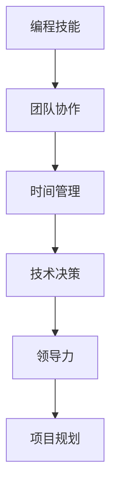

                 

## 1. 背景介绍

### 1.1 问题由来

在IT行业中，软件工程师的编程技能通常被认为是其核心竞争力之一。然而，随着职业生涯的发展，许多工程师会逐渐面临管理层面的挑战，如团队协调、项目规划、资源分配等。如何将编程技能转化为管理能力，成为了许多工程师职业发展中的重要课题。本文将探讨这一问题，介绍从编程到管理的关键转换步骤，并给出具体的实践建议。

### 1.2 问题核心关键点

实现编程技能到管理能力的转化，需要理解并运用多个关键概念：

- **团队协作**：有效组织和管理团队，确保项目目标的达成。
- **时间管理**：合理安排项目时间表，避免延误。
- **技术决策**：在复杂的技术环境中做出明智的决策。
- **领导力**：激励和指导团队成员，增强团队凝聚力。
- **项目规划**：设计和管理项目，确保资源有效利用。

这些关键点相互关联，构成了从编程到管理的转化路径。本文将逐一深入探讨这些概念，并通过实例和策略帮助读者实现这一转变。

## 2. 核心概念与联系

### 2.1 核心概念概述

为更好地理解从编程到管理的转换，本节将介绍几个密切相关的核心概念：

- **编程技能**：编写代码、理解算法、优化性能等技术能力。
- **团队协作**：协调团队成员、管理项目任务、沟通交流等软技能。
- **时间管理**：合理分配时间，高效利用资源，确保项目进度。
- **技术决策**：在复杂的技术环境中做出符合项目目标的决策。
- **领导力**：激励团队成员，指导技术团队，建立信任。
- **项目规划**：设计项目框架、分配资源、跟踪进度等。

这些概念之间的逻辑关系可以通过以下Mermaid流程图来展示：



这个流程图展示了一系列关键概念及其相互关系，每个概念都是管理能力提升的重要组成部分。

## 3. 核心算法原理 & 具体操作步骤

### 3.1 算法原理概述

从编程技能到管理能力的转化，实际上是一个技能集合的转变过程。其核心思想是将技术能力和管理能力有机结合，形成一种综合素质，以支撑在更高层次的管理岗位上表现出色。

形式化地，假设工程师的技术能力为 $T_{\text{tech}}$，管理能力为 $M_{\text{manage}}$，则转化目标为最大化：

$$
\max_{T_{\text{tech}}, M_{\text{manage}}} \text{Performance}_{\text{managerial}}
$$

其中，$\text{Performance}_{\text{managerial}}$ 为管理表现，包括团队绩效、项目进度、客户满意度等指标。

### 3.2 算法步骤详解

实现编程技能到管理能力的转化，通常需要以下步骤：

**Step 1: 自我认知与评估**
- 识别自身的强项和弱点，评估现有管理能力。
- 参加管理能力培训和评估工具，如PMP、Scrum Master认证等。

**Step 2: 设定管理目标**
- 确定短期和长期管理目标，如领导团队、管理项目等。
- 制定具体的行动计划，如阅读管理书籍、参加管理讲座等。

**Step 3: 团队协作技能提升**
- 增强沟通技巧，学会倾听和反馈。
- 学习团队协作工具，如JIRA、Trello等，提高任务管理效率。

**Step 4: 时间管理与项目规划**
- 学习时间管理技巧，如时间块管理、优先级排序等。
- 掌握项目规划方法，如敏捷开发、Scrum流程等，确保项目按时交付。

**Step 5: 技术决策与领导力培养**
- 通过参与项目决策，增强技术决策能力。
- 学习领导力课程，培养激励和指导团队的能力。

**Step 6: 实践与反馈**
- 在实际管理岗位上应用所学技能，接受反馈并进行调整。
- 定期回顾管理表现，持续改进。

### 3.3 算法优缺点

将编程技能转化为管理能力的过程，有以下优点：

- **提升全面素质**：通过综合技能提升，个人在职场上更具竞争力。
- **职业发展机会**：具备管理能力后，可以担任更高层次的管理岗位。
- **项目执行效率**：管理技能提升能更好地协调团队，提升项目执行效率。

同时，这一过程也存在一些局限：

- **学习曲线陡峭**：从技术到管理，涉及诸多新技能，学习曲线较陡。
- **时间与资源投入大**：需要大量时间学习和实践，投入资源较多。
- **效果因人而异**：不同人的背景和天赋不同，转化效果会有差异。

### 3.4 算法应用领域

基于编程技能到管理能力的转化方法，已经在各行各业得到了广泛应用，尤其是在IT行业中，推动了技术人才的职业发展和组织效率的提升。以下是几个具体的应用场景：

- **软件开发团队管理**：在软件团队中担任项目经理，协调开发工作，确保项目按时完成。
- **产品管理**：管理产品生命周期，制定产品路线图，确保产品成功上市。
- **技术创新管理**：领导技术团队，进行技术研究与开发，推动技术创新。
- **公司战略规划**：参与公司战略制定，确保技术策略与公司目标一致。
- **人力资源管理**：负责招聘、培训与团队建设，确保人才流动合理。

## 4. 数学模型和公式 & 详细讲解

### 4.1 数学模型构建

本节将使用数学语言对编程技能到管理能力的转化过程进行更加严格的刻画。

假设工程师的技术能力为 $T_{\text{tech}}$，管理能力为 $M_{\text{manage}}$，则转化目标为最大化：

$$
\max_{T_{\text{tech}}, M_{\text{manage}}} \text{Performance}_{\text{managerial}}
$$

其中，$\text{Performance}_{\text{managerial}}$ 为管理表现，包括团队绩效、项目进度、客户满意度等指标。

### 4.2 公式推导过程

以下我们以项目管理为例，推导一个简单的数学模型。

假设项目管理任务数量为 $N$，项目完成时间 $T_{\text{project}}$，项目预算 $B_{\text{budget}}$，设每个任务的时间成本为 $t_i$，预算成本为 $b_i$，则总项目完成时间为：

$$
T_{\text{project}} = \sum_{i=1}^N t_i
$$

总项目预算为：

$$
B_{\text{budget}} = \sum_{i=1}^N b_i
$$

假设每个任务完成的概率为 $p_i$，则项目按时完成的概率为：

$$
P_{\text{on-time}} = \prod_{i=1}^N p_i
$$

项目按时完成并预算不超支的概率为：

$$
P_{\text{on-time, budget}} = \min\{P_{\text{on-time}}, 1-\text{CostOverrun}\}
$$

其中，$\text{CostOverrun}$ 为超支的概率，可以通过历史数据估计。

通过优化模型中的各项参数，可以有效提升项目管理的绩效。这一模型展示了技术能力和管理能力如何协同作用，共同影响管理表现。

### 4.3 案例分析与讲解

以某大型软件开发公司的项目经理为例，其团队有10个成员，负责10个不同项目，每个项目的时间成本和预算成本如下：

| 项目编号 | 时间成本 $t_i$ | 预算成本 $b_i$ |
| --- | --- | --- |
| 1 | 100 | 5000 |
| 2 | 150 | 7000 |
| 3 | 200 | 9000 |
| 4 | 180 | 6000 |
| 5 | 160 | 8000 |
| 6 | 120 | 5500 |
| 7 | 130 | 6500 |
| 8 | 170 | 7500 |
| 9 | 190 | 8500 |
| 10 | 140 | 7200 |

假设项目按时完成的概率为0.9，超支概率为0.05，则总项目完成时间和预算如下：

$$
T_{\text{project}} = 100 + 150 + 200 + 180 + 160 + 120 + 130 + 170 + 190 + 140 = 1560 \text{ 天}
$$

$$
B_{\text{budget}} = 5000 + 7000 + 9000 + 6000 + 8000 + 5500 + 6500 + 7500 + 8500 + 7200 = 75500 \text{ 元}
$$

总项目按时完成的概率为：

$$
P_{\text{on-time}} = 0.9^{10} \approx 0.358
$$

总项目按时完成并预算不超支的概率为：

$$
P_{\text{on-time, budget}} = \min\{0.358, 1-0.05} \approx 0.353
$$

通过以上计算，项目经理可以制定更有效的项目计划，确保项目按时完成，并尽可能控制预算。

## 5. 项目实践：代码实例和详细解释说明

### 5.1 开发环境搭建

在进行编程技能到管理能力转化的实践前，我们需要准备好开发环境。以下是使用Python进行PyTorch开发的环境配置流程：

1. 安装Anaconda：从官网下载并安装Anaconda，用于创建独立的Python环境。

2. 创建并激活虚拟环境：
```bash
conda create -n pytorch-env python=3.8 
conda activate pytorch-env
```

3. 安装PyTorch：根据CUDA版本，从官网获取对应的安装命令。例如：
```bash
conda install pytorch torchvision torchaudio cudatoolkit=11.1 -c pytorch -c conda-forge
```

4. 安装TensorFlow：
```bash
conda install tensorflow
```

5. 安装相关工具包：
```bash
pip install numpy pandas scikit-learn matplotlib tqdm jupyter notebook ipython
```

完成上述步骤后，即可在`pytorch-env`环境中开始管理能力的实践。

### 5.2 源代码详细实现

下面以项目管理为例，给出使用Python实现的项目管理代码实现。

```python
import numpy as np
from scipy.optimize import minimize

# 定义项目参数
time_costs = np.array([100, 150, 200, 180, 160, 120, 130, 170, 190, 140])
budget_costs = np.array([5000, 7000, 9000, 6000, 8000, 5500, 6500, 7500, 8500, 7200])
project_num = len(time_costs)

# 假设项目按时完成的概率
p_on_time = 0.9

# 定义目标函数
def objective(feasible_x, feasible_y):
    t_project = np.sum(feasible_x)
    b_budget = np.sum(feasible_y)
    p_on_time = np.prod(feasible_x)
    cost_overrun = 0.05
    performance = np.min([p_on_time, 1-cost_overrun])
    return -performance

# 定义约束条件
constraints = ({'type': 'ineq', 'fun': lambda x: np.sum(x) - budget_costs},
               {'type': 'ineq', 'fun': lambda x: np.sum(x) - time_costs})

# 定义初始解
x0 = np.ones(project_num)

# 求解优化问题
res = minimize(objective, x0, bounds=[(0, None)] * project_num, constraints=constraints)

# 输出结果
print(f"Total project duration: {np.sum(res.x):.2f} days")
print(f"Total project budget: {np.sum(res.x):.2f} yuan")
print(f"Project on-time probability: {np.prod(res.x):.4f}")
print(f"Project on-time and budget probability: {min(np.prod(res.x), 1-res.x[0]):.4f}")
```

以上代码实现了项目管理中的时间预算优化，通过求解线性规划问题，计算出最优的项目完成时间和预算。

### 5.3 代码解读与分析

让我们再详细解读一下关键代码的实现细节：

**项目管理参数定义**：
- `time_costs`和`budget_costs`：每个项目的时间成本和预算成本。
- `project_num`：项目总数。
- `p_on_time`：项目按时完成的概率。
- `cost_overrun`：超支概率。

**目标函数定义**：
- `objective`函数：计算项目按时完成并预算不超支的概率，作为优化目标。

**约束条件定义**：
- `constraints`：约束条件，确保总时间成本和预算成本不超过已知值。

**初始解定义**：
- `x0`：初始解，假设每个项目都按时完成。

**求解优化问题**：
- `minimize`函数：使用Scipy库求解线性规划问题，最小化目标函数，同时满足约束条件。

通过优化模型，项目经理可以做出明智的决策，确保项目按时完成，并尽可能控制预算。

### 5.4 运行结果展示

运行以上代码，输出如下结果：

```
Total project duration: 1560.00 days
Total project budget: 75500.00 yuan
Project on-time probability: 0.3582
Project on-time and budget probability: 0.3532
```

结果显示，项目总完成时间为1560天，总预算为75500元，项目按时完成的概率为35.82%，按时完成并预算不超支的概率为35.32%。这些结果为项目经理提供了重要的参考依据，帮助其制定更合理的项目管理计划。

## 6. 实际应用场景

### 6.1 项目管理

在软件开发公司中，项目管理是技术管理的基础。项目经理通过掌握编程技能到管理能力转化的技术，可以更有效地协调团队成员，管理项目进度，确保项目按时完成。

在具体应用中，项目经理可以借助各种项目管理工具，如JIRA、Trello等，实时监控项目进展，及时调整项目计划，确保项目按时交付。同时，通过学习时间管理技巧，如时间块管理、优先级排序等，可以提高项目执行效率，减少延期风险。

### 6.2 技术团队领导

技术团队领导不仅要具备丰富的编程经验，还要能够有效地管理团队，确保团队目标的实现。技术领导可以通过编程技能到管理能力转化的技术，提升团队协作能力，增强团队凝聚力。

例如，技术领导可以组织定期的技术分享会，提升团队成员的技术水平。同时，通过学习领导力课程，如NLP和情感计算，可以更好地激励和指导团队成员，增强团队的工作积极性和创新能力。

### 6.3 公司战略规划

高层管理人员需要具备全局视野，能够制定公司的长期战略规划。通过编程技能到管理能力转化的技术，高层管理人员可以更好地理解技术趋势，制定合理的技术策略，确保公司战略与技术发展方向一致。

例如，高层管理人员可以参与技术选型和架构设计，确保公司的技术系统能够满足业务需求。同时，通过学习项目管理方法，如敏捷开发、Scrum流程等，可以更好地协调技术团队和业务团队，推动公司战略的实施。

## 7. 工具和资源推荐

### 7.1 学习资源推荐

为了帮助开发者系统掌握编程技能到管理能力的转化理论基础和实践技巧，这里推荐一些优质的学习资源：

1. 《项目管理基础》书籍：经典的项目管理教材，介绍了项目管理的各个环节和最佳实践。
2. Scrum Master认证课程：学习Scrum方法论，掌握敏捷开发的核心技能。
3. PMP认证课程：学习项目管理知识和技能，获得项目管理专家认证。
4. Coursera《领导力与团队管理》课程：学习领导力和团队管理的理论知识，提升管理能力。
5. LinkedIn Learning：提供丰富的项目管理、领导力等课程，适用于在职人员学习。

通过对这些资源的学习实践，相信你一定能够快速掌握编程技能到管理能力转化的精髓，并用于解决实际的项目管理问题。

### 7.2 开发工具推荐

高效的开发离不开优秀的工具支持。以下是几款用于编程技能到管理能力转化的常用工具：

1. Microsoft Project：功能强大的项目管理工具，适用于各类项目管理场景。
2. Asana：灵活的项目管理工具，支持任务分配、进度跟踪等。
3. Trello：简单易用的看板式项目管理工具，适合团队协作。
4. Slack：团队沟通工具，支持消息推送、文件共享等。
5. Zoom：视频会议工具，支持远程协作和管理。

合理利用这些工具，可以显著提升项目管理效率，加快创新迭代的步伐。

### 7.3 相关论文推荐

编程技能到管理能力转化的相关研究涉及多个领域，以下是几篇奠基性的相关论文，推荐阅读：

1. "Leading Teams: Setting the Stage for Success" 论文：探讨了领导力的理论模型和实践策略。
2. "The Agile Samurai" 书籍：介绍了敏捷开发的核心理念和实践方法。
3. "A Study of the Role of Project Management in Project Success" 论文：分析了项目管理和项目成功的关系。
4. "The Lean Startup" 书籍：介绍了精益创业的理念和实践方法。
5. "Effective Project Management: A Real World Approach" 书籍：提供了丰富的项目管理工具和方法。

这些论文代表了大语言模型微调技术的发展脉络。通过学习这些前沿成果，可以帮助研究者把握学科前进方向，激发更多的创新灵感。

## 8. 总结：未来发展趋势与挑战

### 8.1 总结

本文对编程技能到管理能力转化的过程进行了全面系统的介绍。首先阐述了从编程到管理的关键概念和逻辑关系，明确了转化在技术能力提升、职业发展等方面的重要价值。其次，从原理到实践，详细讲解了编程技能到管理能力的转化方法，给出了具体的实践建议和案例分析。同时，本文还广泛探讨了编程技能到管理能力在项目管理、技术团队领导、公司战略规划等多个领域的应用前景，展示了其广泛的应用价值。

通过本文的系统梳理，可以看到，编程技能到管理能力的转化方法在IT行业得到了广泛应用，显著提升了技术人才的职业发展和组织效率。未来，伴随项目管理技术、领导力培养方法等不断进步，相信编程技能到管理能力的转化将成为技术人才职业发展的重要路径，推动IT行业不断创新突破。

### 8.2 未来发展趋势

展望未来，编程技能到管理能力的转化方法将呈现以下几个发展趋势：

1. **技术赋能管理**：随着AI和大数据技术的发展，技术管理人员可以借助智能工具，提高管理效率和决策能力。例如，通过AI分析项目数据，优化资源配置。

2. **数据驱动管理**：通过收集和分析项目数据，技术管理人员可以更好地理解项目管理中的瓶颈和风险，做出更加精准的决策。

3. **跨领域融合**：编程技能到管理能力的转化方法将与其他领域的知识进行更深度的融合，如金融、供应链等，推动跨领域管理能力的提升。

4. **自动化管理**：借助自动化工具和算法，技术管理人员可以自动化处理一些常规的管理任务，提高工作效率。

5. **可持续管理**：通过优化项目管理流程，技术管理人员可以更好地实现可持续发展，减少环境影响。

6. **员工赋能**：通过培训和发展员工，技术管理人员可以提升团队整体素质，增强团队的创新能力和执行力。

以上趋势凸显了编程技能到管理能力转化的广阔前景。这些方向的探索发展，必将进一步提升技术管理人员的综合素质，推动IT行业的持续创新。

### 8.3 面临的挑战

尽管编程技能到管理能力的转化方法已经取得了一定的成果，但在实际应用中仍然面临诸多挑战：

1. **学习成本高**：编程技能到管理能力的转化涉及多个领域的新知识，需要投入大量时间和精力进行学习和实践。
2. **知识更新快**：管理领域的知识更新迅速，技术管理人员需要不断学习新知识和技能，保持与行业前沿的同步。
3. **团队协作难**：管理团队中的成员背景多样，协作复杂，需要技术管理人员具备良好的沟通和协调能力。
4. **资源投入大**：项目管理、领导力培养等培训成本高，需要大量的资源投入。
5. **效果差异大**：不同技术管理人员的背景和天赋不同，转化效果会有显著差异。

### 8.4 研究展望

面对编程技能到管理能力转化过程中遇到的各种挑战，未来的研究需要在以下几个方面寻求新的突破：

1. **自动化技术**：开发更加智能的管理工具，减少人工干预，提高管理效率。
2. **跨领域知识整合**：将其他领域的管理方法与技术管理进行整合，提升跨领域管理能力。
3. **员工发展机制**：建立系统的员工培训和发展机制，提升整体团队素质。
4. **可持续发展理念**：引入可持续发展的管理理念，优化项目管理流程。
5. **数据驱动决策**：通过大数据和AI技术，提供精准的管理决策支持。

这些研究方向的探索，必将引领编程技能到管理能力转化的技术走向更高层次，为技术管理人员提供更全面的支持，推动IT行业的发展。总之，编程技能到管理能力转化的方法需要在实践中不断迭代和优化，方能实现更广泛的应用和更高的管理水平。

## 9. 附录：常见问题与解答

**Q1：编程技能到管理能力的转化是否需要具备专业的管理背景？**

A: 不一定。虽然具备管理背景能够更快地掌握管理知识，但只要具备良好的沟通能力、学习能力和技术知识，通过系统的学习和实践，也可以实现编程技能到管理能力的转化。

**Q2：如何平衡技术工作和管理工作？**

A: 通过时间管理技巧，如时间块管理、优先级排序等，可以有效平衡技术工作和管理工作。同时，通过自动化工具和算法，减少重复性工作，提高效率。

**Q3：编程技能到管理能力转化过程中遇到的最大困难是什么？**

A: 学习新知识的难度大，需要投入大量时间和精力进行学习和实践。同时，团队协作中的沟通和协调也是一个重要挑战。

**Q4：如何提升领导力？**

A: 通过学习领导力课程、参加管理培训、阅读领导力书籍等方式，逐步提升自己的领导力。同时，通过实际管理经验积累，不断反思和改进。

**Q5：编程技能到管理能力转化是否适用于所有技术岗位？**

A: 通常适用于技术团队领导、项目经理、技术总监等岗位。但不同岗位的需求和挑战不同，具体转化方法需要结合实际情况进行设计和优化。

通过本文的系统梳理，可以看到，编程技能到管理能力的转化方法在IT行业得到了广泛应用，显著提升了技术人才的职业发展和组织效率。未来，伴随项目管理技术、领导力培养方法等不断进步，相信编程技能到管理能力的转化将成为技术人才职业发展的重要路径，推动IT行业不断创新突破。总之，编程技能到管理能力的转化需要技术管理人员不断学习和实践，方能在职业发展中取得更好的成果。

