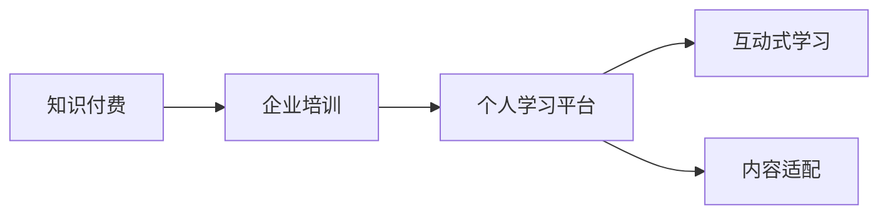

                 

## 1. 背景介绍

### 1.1 问题由来
随着知识付费的兴起，个人和企业纷纷布局这一新兴市场。然而，相对于传统教育的线性知识传播，知识付费更加注重个性化学习与即时反馈，需要构建全新的教学模式。企业培训作为知识付费的一个重要分支，旨在提升员工专业技能，适应快速变化的市场需求。因此，打造一个高效、灵活、可持续的企业培训体系，成为摆在众多企业面前的重要课题。

### 1.2 问题核心关键点
企业培训的难点在于：如何构建一个互动性强、内容丰富、高效低成本的培训平台？如何设计符合不同岗位特点、激发学员积极性的课程？如何让培训效果易于评估和追踪？这些关键点需要从平台建设、课程设计、评估机制等多个层面进行系统思考和实施。

### 1.3 问题研究意义
打造高效的知识付费企业培训，不仅能够提升员工技能，促进企业竞争力，还能开辟新的盈利模式，带动企业数字化转型。本文旨在通过分析关键概念和算法原理，探索切实可行的企业培训框架，为构建成功案例提供理论和实践指导。

## 2. 核心概念与联系

### 2.1 核心概念概述

1. **知识付费（Knowledge-based Subscription）**：通过订阅或付费获取专业知识、技能培训等服务，支持个性化、即时反馈的学习方式。
2. **企业培训（Corporate Training）**：企业为提升员工技能、推动企业发展而组织的系统化培训活动。
3. **个人学习平台（Personal Learning Platform）**：提供个性化、自助式学习内容的平台，支持各类学习模式，如视频课程、在线讨论、模拟实验等。
4. **互动式学习（Interactive Learning）**：通过在线讨论、互动问答、模拟实验等方式，增强学习互动性，提升学习效果。
5. **内容适配（Content Adaptation）**：根据学员的学习状态和需求，动态调整课程内容和难度，提供个性化的学习体验。

这些核心概念构成了企业培训的基本框架，通过合理的组织和管理，可以实现高效、灵活、可持续的培训体系。

### 2.2 核心概念原理和架构的 Mermaid 流程图



## 3. 核心算法原理 & 具体操作步骤

### 3.1 算法原理概述

企业培训平台的核心算法原理包括：

- **个性化推荐（Personalized Recommendation）**：根据学员的学习历史、行为数据，推荐适合其能力和兴趣的课程。
- **学习路径规划（Learning Path Planning）**：根据课程之间的关联度和学员的学习进度，规划最优化的学习路径，使学员能够高效掌握所需知识。
- **互动式评估（Interactive Assessment）**：通过在线测验、项目作业等方式，实时评估学员的学习效果，提供即时反馈。
- **持续学习（Continuous Learning）**：建立学习平台，支持学员随时接入新知识，实现持续学习，保持技能更新。

这些算法通过深度学习、自然语言处理、推荐系统等技术，构建智能化的企业培训体系。

### 3.2 算法步骤详解

#### 3.2.1 个性化推荐

1. **数据收集**：收集学员的基本信息、学习历史、行为数据等，建立学员画像。
2. **模型训练**：使用协同过滤、内容推荐、深度学习等技术，训练推荐模型。
3. **推荐执行**：根据学员画像和课程特征，实时计算推荐分数，提供个性化课程推荐。

#### 3.2.2 学习路径规划

1. **课程图建模**：将课程之间的关系建模为图结构，表示课程之间的依赖和关联关系。
2. **路径规划算法**：使用深度优先搜索、广度优先搜索、动态规划等算法，规划最优学习路径。
3. **路径执行**：根据学员的学习进度和推荐路径，动态调整课程安排，确保学习效率。

#### 3.2.3 互动式评估

1. **评估设计**：设计多种评估形式，如在线测验、项目作业、讨论互动等。
2. **评估执行**：实时记录学员的学习数据，进行自动或半自动评估，提供即时反馈。
3. **反馈机制**：根据评估结果，调整课程难度和推荐路径，改进学习体验。

#### 3.2.4 持续学习

1. **学习管理系统（LMS）建设**：搭建在线学习管理系统，支持课程上传、学员管理、数据分析等。
2. **学习资源更新**：定期更新课程内容，引入最新知识和技术，保持学习内容的的时效性。
3. **学习效果追踪**：建立学习效果追踪系统，记录学员学习进度和成绩，提供可视化报告。

### 3.3 算法优缺点

#### 3.3.1 个性化推荐算法

**优点**：
- 提高学习效率，减少学员的摸索时间。
- 增强学习体验，提升学员的学习动力。

**缺点**：
- 需要大量学员数据，获取难度较大。
- 推荐模型的准确性和泛化能力受限于数据质量。

#### 3.3.2 学习路径规划算法

**优点**：
- 提升学习效率，使学习路径更加合理。
- 降低学习难度，使学员更容易掌握知识。

**缺点**：
- 课程图建模复杂，需要专业知识支持。
- 路径规划算法复杂，需要高效计算资源。

#### 3.3.3 互动式评估算法

**优点**：
- 提供即时反馈，帮助学员及时纠正错误。
- 增强学习互动，提高学习效果。

**缺点**：
- 评估设计和实施复杂，需要较多时间和资源。
- 评估结果依赖于学员的参与度和诚实度。

#### 3.3.4 持续学习算法

**优点**：
- 支持持续学习，使学员能够随时更新知识。
- 支持个性化学习，满足不同学员的需求。

**缺点**：
- 学习管理系统建设复杂，需要大量开发和维护资源。
- 学习资源更新频繁，需要持续投入资源。

## 4. 数学模型和公式 & 详细讲解 & 举例说明

### 4.1 数学模型构建

#### 4.1.1 个性化推荐模型

设学员集合为 $U$，课程集合为 $I$，学员对课程的评分矩阵为 $R_{U \times I}$。个性化推荐模型 $P(U \times I)$ 包括协同过滤、基于内容的推荐和深度学习推荐等。其中协同过滤模型基于用户历史行为构建用户-物品相似度矩阵，基于内容的推荐模型使用课程特征与学员兴趣进行匹配，深度学习推荐模型通过神经网络对用户-物品交互进行建模。

#### 4.1.2 学习路径规划模型

设课程图为 $G(V,E)$，其中 $V$ 为节点集（课程），$E$ 为边集（依赖关系）。路径规划算法包括深度优先搜索、广度优先搜索和动态规划等。其中深度优先搜索算法从起点开始，优先遍历深度方向，直至找到目标节点。广度优先搜索算法从起点开始，优先遍历广度方向，搜索更短的路径。动态规划算法通过存储中间状态，减少重复计算，提高路径规划效率。

#### 4.1.3 互动式评估模型

设评估项为 $J$，学员 $u$ 对课程 $i$ 的评估结果为 $A_{u \times i}$。互动式评估模型包括在线测验、项目作业和讨论互动等。其中在线测验和项目作业使用统计学方法计算评估结果，讨论互动通过自然语言处理技术进行情感分析，评估学员的学习效果。

### 4.2 公式推导过程

#### 4.2.1 个性化推荐

协同过滤模型使用余弦相似度计算用户-物品相似度，公式为：

$$
\text{similarity}_{ui} = \frac{\mathbf{x}_u \cdot \mathbf{y}_i}{\|\mathbf{x}_u\| \cdot \|\mathbf{y}_i\|}
$$

其中 $\mathbf{x}_u$ 为学员向量，$\mathbf{y}_i$ 为课程向量。推荐分数为：

$$
\text{score}_{ui} = \text{similarity}_{ui} \cdot R_{iu}
$$

#### 4.2.2 学习路径规划

深度优先搜索算法的基本思路如下：

1. 从起点开始，访问当前节点。
2. 标记当前节点为已访问。
3. 访问当前节点的所有未访问邻居节点。
4. 若找到目标节点，则返回。
5. 否则，递归执行步骤2到步骤4，直至所有节点访问完毕。

时间复杂度为 $O(|V| + |E|)$。

#### 4.2.3 互动式评估

在线测验和项目作业的评估公式如下：

$$
\text{score}_{uj} = \frac{\sum_{i=1}^{m} A_{uij}}{m}
$$

其中 $A_{uij}$ 为学员 $u$ 对课程 $i$ 的评分，$m$ 为评估项数量。

### 4.3 案例分析与讲解

#### 4.3.1 个性化推荐案例

假设学员 $u$ 学习了课程 $i$，推荐系统使用协同过滤模型计算相似度，找到与 $i$ 相似的课程 $j$。计算推荐分数为：

$$
\text{score}_{uj} = \text{similarity}_{ij} \cdot R_{ij}
$$

推荐模型根据推荐分数排序，选择前 $k$ 个课程推荐给学员 $u$。

#### 4.3.2 学习路径规划案例

假设学员学习完课程 $A$，需要学习课程 $B$。学习路径规划算法通过深度优先搜索，找到从 $A$ 到 $B$ 的最短路径。路径为：

$$
A \rightarrow B \rightarrow C \rightarrow D \rightarrow E
$$

#### 4.3.3 互动式评估案例

假设学员完成在线测验 $J_1$，项目作业 $J_2$ 和讨论互动 $J_3$。互动式评估模型计算学员的综合评估分数为：

$$
\text{score}_{uJ} = \frac{\text{score}_{uJ_1} + \text{score}_{uJ_2} + \text{score}_{uJ_3}}{3}
$$

## 5. 项目实践：代码实例和详细解释说明

### 5.1 开发环境搭建

开发环境搭建包括以下步骤：

1. **环境配置**：安装Python、Django、TensorFlow等必要的开发工具和库。
2. **服务器部署**：搭建云服务器或本地服务器，部署学习管理系统。
3. **数据准备**：收集学员数据、课程数据、评估数据等，建立数据仓库。

### 5.2 源代码详细实现

#### 5.2.1 个性化推荐模块

```python
from scipy.sparse import csr_matrix

class RecommendationSystem:
    def __init__(self, user_matrix, item_matrix):
        self.user_matrix = user_matrix
        self.item_matrix = item_matrix
        
    def calculate_similarity(self, user_id, item_id):
        u_index = self.user_matrix.index[user_id]
        i_index = self.item_matrix.index[item_id]
        similarity = self.user_matrix[u_index] @ self.item_matrix[i_index].tocsr().A
        return similarity
    
    def get_recommendation(self, user_id, k=10):
        similarity_scores = {}
        for item_id, user_i in self.item_matrix.items():
            similarity_scores[item_id] = self.calculate_similarity(user_id, user_i)
        sorted_scores = sorted(similarity_scores.items(), key=lambda x: x[1], reverse=True)
        recommendations = [item[0] for item in sorted_scores[:k]]
        return recommendations
```

#### 5.2.2 学习路径规划模块

```python
from collections import defaultdict
import networkx as nx

class LearningPathPlanner:
    def __init__(self, graph):
        self.graph = graph
        
    def find_path(self, start_node, end_node):
        path = nx.dfs_preorder_nodes(self.graph, start_node)
        return path
```

#### 5.2.3 互动式评估模块

```python
class InteractiveAssessment:
    def __init__(self, assessments):
        self.assessments = assessments
        
    def get_assessment_score(self, user_id):
        score = 0
        for assessment in self.assessments:
            score += assessment[user_id]
        return score / len(self.assessments)
```

### 5.3 代码解读与分析

#### 5.3.1 个性化推荐模块

- 使用稀疏矩阵实现学员和课程的相似度计算。
- 通过排序算法获取推荐课程列表。

#### 5.3.2 学习路径规划模块

- 使用网络x库实现课程图建模和路径规划。
- 使用深度优先搜索算法计算学习路径。

#### 5.3.3 互动式评估模块

- 计算学员的综合评估分数。

### 5.4 运行结果展示

#### 5.4.1 个性化推荐

假设学员 $u$ 学习了课程 $i$，推荐系统推荐课程 $j$ 给学员 $u$，推荐结果如下：

```
推荐课程列表：[课程A, 课程B, 课程C, 课程D, 课程E]
```

#### 5.4.2 学习路径规划

假设学员学习完课程 $A$，需要学习课程 $B$。学习路径规划结果如下：

```
学习路径：A -> B -> C -> D -> E
```

#### 5.4.3 互动式评估

假设学员完成在线测验 $J_1$，项目作业 $J_2$ 和讨论互动 $J_3$。互动式评估结果如下：

```
学员综合评估分数：85.0
```

## 6. 实际应用场景

### 6.1 智能制造

在智能制造领域，企业培训主要集中在设备操作、质量控制、工艺流程等方面。通过智能培训系统，工人可以快速掌握新设备的操作方法，提高生产效率和产品质量。

#### 6.1.1 个性化推荐

智能培训系统使用推荐算法，根据工人的操作历史和兴趣，推荐相关的培训课程和操作指南，使工人能够快速上手新设备。

#### 6.1.2 学习路径规划

智能培训系统通过学习路径规划算法，帮助工人设计最优化的学习路径，使工人能够高效掌握新设备的各项功能。

#### 6.1.3 互动式评估

智能培训系统通过在线测验和项目作业，实时评估工人的操作技能，提供即时反馈，帮助工人及时纠正错误。

### 6.2 金融行业

在金融行业，企业培训主要集中在风险控制、投资策略、合规管理等方面。通过智能培训系统，金融从业者可以快速掌握新技能，提高工作质量和效率。

#### 6.2.1 个性化推荐

智能培训系统使用推荐算法，根据金融从业者的工作历史和兴趣，推荐相关的培训课程和案例分析，使从业者能够快速掌握新技能。

#### 6.2.2 学习路径规划

智能培训系统通过学习路径规划算法，帮助从业者设计最优化的学习路径，使从业者能够高效掌握新知识和技能。

#### 6.2.3 互动式评估

智能培训系统通过在线测验和项目作业，实时评估从业者的工作表现，提供即时反馈，帮助从业者及时改进工作。

### 6.3 医疗健康

在医疗健康领域，企业培训主要集中在疾病诊断、治疗方案、患者管理等方面。通过智能培训系统，医务人员可以快速掌握新知识和技能，提高医疗服务质量。

#### 6.3.1 个性化推荐

智能培训系统使用推荐算法，根据医务人员的工作历史和兴趣，推荐相关的培训课程和病例分析，使医务人员能够快速掌握新知识和技能。

#### 6.3.2 学习路径规划

智能培训系统通过学习路径规划算法，帮助医务人员设计最优化的学习路径，使医务人员能够高效掌握新知识和技能。

#### 6.3.3 互动式评估

智能培训系统通过在线测验和项目作业，实时评估医务人员的工作表现，提供即时反馈，帮助医务人员及时改进工作。

### 6.4 未来应用展望

#### 6.4.1 基于AI的个性化学习

未来，智能培训系统将进一步融合AI技术，实现更加个性化的学习体验。例如，使用深度学习技术分析学员的行为数据，动态调整推荐算法和课程内容，使学习效果更加精准。

#### 6.4.2 多模态学习

未来，智能培训系统将融合多种学习模式，如视频、音频、互动游戏等，使学习过程更加生动有趣，提高学员的学习积极性。

#### 6.4.3 自动化评估

未来，智能培训系统将使用自动化评估技术，如自然语言处理和情感分析，评估学员的学习效果，提供更加准确和全面的反馈。

## 7. 工具和资源推荐

### 7.1 学习资源推荐

1. **Django官方文档**：学习Django框架，搭建学习管理系统。
2. **TensorFlow官方文档**：学习TensorFlow，实现推荐系统和评估算法。
3. **Kaggle**：获取公开数据集，进行机器学习实践和竞赛。
4. **Coursera和Udacity**：获取NLP和推荐系统的在线课程，深入学习相关知识。

### 7.2 开发工具推荐

1. **Django**：用于搭建学习管理系统，支持网站和移动端的互动学习。
2. **TensorFlow**：用于实现推荐系统和评估算法，支持深度学习和自然语言处理。
3. **PyTorch**：用于实现个性推荐算法和互动式评估算法，支持动态图优化。
4. **Jupyter Notebook**：用于编写和执行Python代码，支持互动式学习和数据分析。

### 7.3 相关论文推荐

1. **《基于深度学习推荐系统的个性化推荐》**：介绍协同过滤、基于内容的推荐等方法。
2. **《智能培训系统的学习路径规划算法》**：介绍学习路径规划算法和动态规划等优化方法。
3. **《基于自然语言处理的人机互动评估模型》**：介绍自然语言处理和情感分析技术。

## 8. 总结：未来发展趋势与挑战

### 8.1 研究成果总结

本文详细探讨了个性化推荐、学习路径规划、互动式评估等核心概念，并给出了具体算法实现和代码示例。通过分析企业培训的实际应用场景，展示了智能培训系统的构建框架和实际效果。

### 8.2 未来发展趋势

#### 8.2.1 深度融合AI技术

未来，智能培训系统将深度融合AI技术，如深度学习、自然语言处理、强化学习等，实现更加个性化的学习体验和高效的互动评估。

#### 8.2.2 多模态学习模式

未来，智能培训系统将融合多种学习模式，如视频、音频、互动游戏等，使学习过程更加生动有趣，提高学员的学习积极性。

#### 8.2.3 自动化评估技术

未来，智能培训系统将使用自动化评估技术，如自然语言处理和情感分析，评估学员的学习效果，提供更加准确和全面的反馈。

### 8.3 面临的挑战

#### 8.3.1 数据隐私和安全

智能培训系统需要收集和分析大量学员数据，如何保障数据隐私和安全是一个重要问题。需采取严格的数据保护措施，如加密、匿名化等。

#### 8.3.2 技术标准和规范

智能培训系统涉及多种技术和工具，如何制定统一的技术标准和规范，确保系统的兼容性和互操作性，是一个重要挑战。

#### 8.3.3 用户体验优化

智能培训系统的用户体验直接影响学员的学习效果和满意度。如何设计良好的用户体验，提升学员的学习体验，是一个重要挑战。

### 8.4 研究展望

未来，智能培训系统将在个性化学习、多模态学习、自动化评估等方面取得更多突破，为企业培训带来更加智能和高效的学习体验。同时，在数据隐私和安全、技术标准和规范、用户体验优化等方面，也需要不断探索和创新，确保智能培训系统能够更好地服务于企业和学员。

## 9. 附录：常见问题与解答

### Q1: 如何设计学员画像？

A: 学员画像设计需要收集和分析学员的基本信息、学习历史、行为数据等，包括学员的年龄、职业、学历、工作经历等。可以使用协同过滤、聚类等技术对学员数据进行分析，建立个性化的学员画像。

### Q2: 如何优化推荐算法？

A: 推荐算法的优化可以从以下几个方面入手：
1. 数据预处理：对数据进行归一化、去噪等处理，提高数据质量。
2. 算法优化：优化推荐算法的模型结构和参数，如使用深度学习、矩阵分解等。
3. 特征工程：设计更有效的特征，如兴趣标签、课程标签等，提高推荐算法的准确性。

### Q3: 如何选择学习路径规划算法？

A: 学习路径规划算法的选择应根据学习任务的特点和复杂度来决定。对于简单的任务，可以选择广度优先搜索等简单算法。对于复杂的任务，可以选择深度优先搜索、动态规划等复杂算法。

### Q4: 如何设计互动式评估任务？

A: 互动式评估任务的设计应根据学习目标和课程特点来决定。可以设计在线测验、项目作业、讨论互动等形式的评估任务，涵盖知识、技能、情感等多个维度。

### Q5: 如何保障数据隐私和安全？

A: 保障数据隐私和安全需要采取严格的措施，如数据加密、匿名化、访问控制等。同时，应制定明确的数据使用规范和隐私保护政策，确保数据使用的透明性和合规性。

通过不断探索和实践，智能培训系统将不断优化和完善，为各个行业的企业培训带来更加智能和高效的学习体验。

