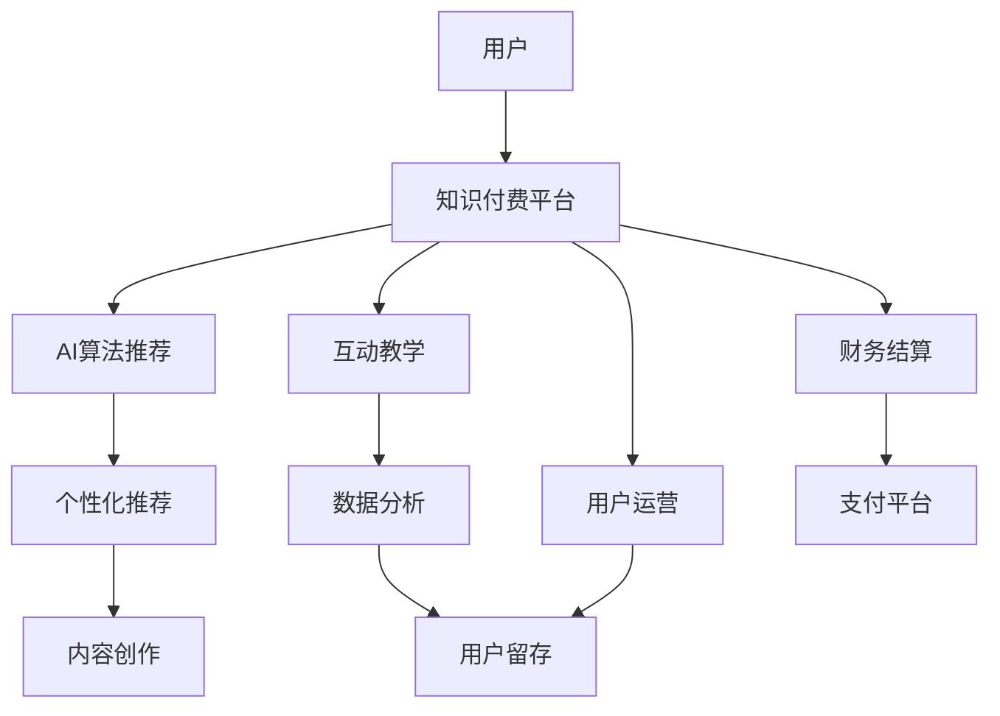

                 

# 如何打造个人知识付费咨询服务

> 关键词：个人知识付费服务, 知识付费, 在线教育, 咨询服务, 人工智能, 编程, 数据分析, 财务规划

## 1. 背景介绍

### 1.1 问题由来

随着互联网技术的不断发展和普及，在线教育和知识付费市场正在快速成长，为个人提供专业知识和咨询服务已成为一种新兴的商业模式。然而，由于传统教育体系和咨询服务流程的限制，许多人仍然面临获取高质量知识与咨询服务的高门槛。

特别是近年来，人工智能技术的飞速发展，使得个人知识付费咨询服务的质量和效率有了显著提升。基于人工智能技术的在线教育平台和知识服务系统，通过智能算法推荐和个性化定制，极大地提升了学习体验和咨询服务的专业性。

### 1.2 问题核心关键点

个人知识付费咨询服务成功的关键在于以下几点：

- **专业性**：咨询师或讲师需具备深厚的专业知识基础，能够提供有价值的专业建议。
- **互动性**：通过AI技术，平台能够实现更高效的师生互动，提高用户的学习和咨询体验。
- **个性化**：通过数据分析，平台能够根据用户的学习进度和偏好，提供个性化的课程和咨询服务。
- **经济性**：平台需要提供性价比高的服务，通过规模化运营降低成本，以吸引更多的用户。
- **可扩展性**：平台应具备良好的技术架构，能够快速响应市场变化和用户需求，保证服务持续稳定。

### 1.3 问题研究意义

个人知识付费咨询服务的成功将极大地提升教育质量和效率，推动知识传播和应用。它不仅为个人提供了获取知识与咨询的便捷渠道，还为教育机构和咨询服务提供者带来了新的商业机会。

1. **提升教育质量**：通过高效、个性化的教学和学习，提升学生的学习效果和满意度。
2. **降低教育门槛**：通过在线平台，使更多人能够获得高质量的教育资源和咨询服务。
3. **创造经济价值**：通过知识付费模式，为教育者和知识服务者创造新的收入来源，推动教育产业的经济增长。
4. **促进技术创新**：推动人工智能、大数据等前沿技术的实际应用，促进教育技术的发展。

## 2. 核心概念与联系

### 2.1 核心概念概述

为更好地理解个人知识付费咨询服务的构建，本节将介绍几个核心概念：

- **个人知识付费服务**：指个人通过在线平台获取专业知识和咨询服务的服务模式。用户通过支付费用，获得个性化、高效、专业的服务。
- **在线教育**：指通过互联网技术，用户可以随时随地获取在线课程和资源，进行自主学习和互动。
- **知识服务**：指通过在线平台提供的各类咨询服务，如编程辅导、数据分析、财务规划等。
- **人工智能**：指利用机器学习和深度学习等技术，实现智能推荐、自动化处理等智能化服务。
- **平台搭建**：指构建个人知识付费咨询服务的在线平台，包括前端和后端技术。
- **内容创作**：指教育者和知识服务者为平台提供课程和咨询服务。
- **用户运营**：指通过数据分析和营销手段，提升平台的用户留存率和活跃度。

这些概念之间的逻辑关系可以通过以下Mermaid流程图来展示：



这个流程图展示了个人知识付费咨询服务的基本流程：

1. 用户通过平台获取知识和咨询服务。
2. AI算法根据用户的历史行为和偏好，推荐个性化内容。
3. 教育者和知识服务者为平台提供内容。
4. 平台通过互动教学和数据分析，提升用户的学习和咨询体验。
5. 用户运营团队提升用户留存率和活跃度。
6. 财务结算平台保障支付和收费的顺畅进行。

## 3. 核心算法原理 & 具体操作步骤
### 3.1 算法原理概述

个人知识付费咨询服务的核心算法涉及推荐系统、个性化学习、内容生成等多个领域。以下以推荐系统为例，概述其基本原理和操作步骤。

推荐系统的主要目标是预测用户对不同内容（如课程、咨询服务）的兴趣，并根据这些兴趣进行个性化推荐。推荐算法通常基于协同过滤、内容推荐、深度学习等多种技术。

### 3.2 算法步骤详解

**Step 1: 数据收集与预处理**
- 收集用户的浏览、点击、评分等行为数据。
- 对数据进行清洗和去重，处理缺失值和异常值。
- 对用户进行特征工程，提取用户兴趣、偏好等关键特征。

**Step 2: 构建推荐模型**
- 选择合适的推荐算法，如协同过滤、基于内容的推荐、矩阵分解等。
- 使用历史数据训练推荐模型，得到用户的兴趣向量。
- 对新内容进行特征工程，提取关键词、作者、时长等特征。

**Step 3: 实时推荐**
- 根据用户的历史行为和当前兴趣，实时计算推荐结果。
- 根据实时计算结果，动态更新推荐页面，提供即时推荐。
- 使用A/B测试和用户反馈，不断优化推荐模型和策略。

### 3.3 算法优缺点

推荐算法具有以下优点：

1. **个性化推荐**：能够根据用户的历史行为和兴趣，提供个性化推荐，提升用户体验。
2. **高效匹配**：能够快速匹配用户和内容，减少用户搜索时间和决策成本。
3. **多样性保证**：能够平衡推荐内容的多样性和相关性，避免内容单一化。

同时，推荐算法也存在以下缺点：

1. **数据隐私问题**：收集和处理用户数据时，需要严格遵守数据隐私法规，保护用户隐私。
2. **冷启动问题**：新用户或新内容刚上线时，推荐效果可能不佳，需要进一步优化算法。
3. **公平性问题**：推荐算法可能存在一定的偏见，导致某些内容或用户被忽视。
4. **计算复杂度高**：大规模推荐系统的计算复杂度较高，需要高效的计算资源支持。

### 3.4 算法应用领域

推荐算法在个人知识付费咨询服务的多个领域中均有广泛应用，例如：

- **课程推荐**：根据用户的学习历史和偏好，推荐最适合的课程内容。
- **咨询服务推荐**：根据用户的查询记录和评价，推荐最合适的咨询师或服务内容。
- **学习路径推荐**：根据用户的学习进度和目标，推荐合理的学习路径和进阶内容。

此外，推荐算法还广泛应用于内容分发、广告投放、产品推荐等多个领域，成为现代互联网应用中不可或缺的核心技术。

## 4. 数学模型和公式 & 详细讲解 & 举例说明

### 4.1 数学模型构建

推荐系统的一般数学模型可以表示为：

$$
\hat{y}_{ui} = f(x_i, u)
$$

其中，$x_i$ 表示第 $i$ 个内容特征向量，$u$ 表示用户特征向量，$\hat{y}_{ui}$ 表示用户 $u$ 对内容 $i$ 的预测评分。

### 4.2 公式推导过程

以协同过滤推荐算法为例，其基本思想是通过用户和内容之间的相似度，预测用户对内容的评分。协同过滤算法包括基于用户的协同过滤和基于内容的协同过滤。

**基于用户的协同过滤**：

1. 计算用户之间的相似度：

$$
sim(u_1, u_2) = \frac{\sum_{i\in S} x_{i1}x_{i2}}{\sqrt{\sum_{i\in S} x_{i1}^2}\sqrt{\sum_{i\in S} x_{i2}^2}}
$$

其中，$S$ 表示用户 $u_1$ 和 $u_2$ 共同评分过的内容集合。

2. 计算用户对内容的预测评分：

$$
\hat{y}_{ui} = \sum_{j \in N(u)} \frac{x_{ij}sim(u_j, u)}{\sum_{k \in N(u)}sim(u_k, u)}
$$

其中，$N(u)$ 表示与用户 $u$ 相似的所有用户集合。

**基于内容的协同过滤**：

1. 计算内容之间的相似度：

$$
sim(i_1, i_2) = \frac{\sum_{j\in S} x_{ij_1}x_{ij_2}}{\sqrt{\sum_{j\in S} x_{ij_1}^2}\sqrt{\sum_{j\in S} x_{ij_2}^2}}
$$

其中，$S$ 表示内容 $i_1$ 和 $i_2$ 共同评分过的用户集合。

2. 计算用户对内容的预测评分：

$$
\hat{y}_{ui} = \sum_{j \in N(i)} \frac{x_{ji}sim(i_j, u)}{\sum_{k \in N(i)}sim(i_k, u)}
$$

其中，$N(i)$ 表示与内容 $i$ 相似的所有内容集合。

### 4.3 案例分析与讲解

以Coursera平台为例，分析其推荐算法的应用：

1. 用户首次访问平台时，系统会通过用户注册信息（如年龄、职业、兴趣等）和历史行为数据，初步建立用户画像。
2. 当用户选择课程时，系统会实时计算用户的兴趣向量，并根据课程的特征向量，计算推荐评分。
3. 系统会按照推荐评分排序，展示最相关的课程列表，并提供简要介绍和课程预览。
4. 用户完成学习后，系统会记录学习进度和评分，进一步优化用户画像和推荐模型。
5. 系统会定期收集用户反馈和互动数据，不断优化推荐算法和推荐策略，提升用户满意度。

通过Coursera平台的推荐系统，用户可以高效地发现感兴趣和适合自身需求的课程，减少了选课的时间和精力。

## 5. 项目实践：代码实例和详细解释说明
### 5.1 开发环境搭建

在进行知识付费咨询服务项目实践前，我们需要准备好开发环境。以下是使用Python进行Flask开发的环境配置流程：

1. 安装Anaconda：从官网下载并安装Anaconda，用于创建独立的Python环境。

2. 创建并激活虚拟环境：
```bash
conda create -n flask-env python=3.8 
conda activate flask-env
```

3. 安装Flask：
```bash
pip install flask
```

4. 安装Flask-RESTful：
```bash
pip install flask-restful
```

5. 安装Flask-SQLAlchemy：
```bash
pip install flask-sqlalchemy
```

6. 安装Flask-WTF：
```bash
pip install flask-wtf
```

7. 安装Flask-Uploads：
```bash
pip install Flask-Uploads
```

完成上述步骤后，即可在`flask-env`环境中开始项目实践。

### 5.2 源代码详细实现

下面以一个简单的课程推荐系统为例，给出使用Flask框架进行知识付费咨询服务开发的PyTorch代码实现。

首先，定义Flask应用程序：

```python
from flask import Flask, request, jsonify
from flask_sqlalchemy import SQLAlchemy
from flask_restful import Api, Resource

app = Flask(__name__)
api = Api(app)
app.config['SQLALCHEMY_DATABASE_URI'] = 'sqlite:////tmp/test.db'
db = SQLAlchemy(app)
```

然后，定义数据库模型：

```python
class User(db.Model):
    id = db.Column(db.Integer, primary_key=True)
    name = db.Column(db.String(80), nullable=False)
    age = db.Column(db.Integer, nullable=False)
    interests = db.Column(db.String(120), nullable=False)

class Course(db.Model):
    id = db.Column(db.Integer, primary_key=True)
    name = db.Column(db.String(80), nullable=False)
    duration = db.Column(db.Integer, nullable=False)
    content = db.Column(db.String(120), nullable=False)
```

接着，定义推荐算法：

```python
from sklearn.metrics.pairwise import cosine_similarity
from sklearn.preprocessing import LabelEncoder

def similarity(user1, user2):
    user1_interests = user1.interests.split(',')
    user2_interests = user2.interests.split(',')
    return cosine_similarity([user1_interests], [user2_interests])[0][0]

def recommend(user_id):
    user = User.query.get(user_id)
    similar_users = User.query.filter(User.id != user_id).all()
    similar_user_ids = [user.id for user in similar_users]
    user_vector = LabelEncoder().fit_transform(user.interests.split(','))
    user_vector = user_vector.astype('float64')
    similar_user_vectors = [LabelEncoder().fit_transform(user.interests.split(',')).astype('float64') for user in similar_users]
    similarity_scores = [similarity(user, similar_user) for similar_user in similar_user_vectors]
    recommendations = {}
    for i, similar_user in enumerate(similar_user_ids):
        recommendations[similar_user] = similarity_scores[i]
    sorted_recommendations = sorted(recommendations.items(), key=lambda x: x[1], reverse=True)
    return sorted_recommendations
```

最后，定义API接口：

```python
class Recommendation(Resource):
    def get(self, user_id):
        recommendations = recommend(user_id)
        return jsonify({user.id: recommendations[user.id] for user in recommendations})

api.add_resource(Recommendation, '/recommend', '/recommend/<int:user_id>')

if __name__ == '__main__':
    app.run(debug=True)
```

运行以上代码，即可启动Flask应用程序，进行课程推荐系统的测试。

### 5.3 代码解读与分析

让我们再详细解读一下关键代码的实现细节：

**Flask应用程序**：
- `Flask` 框架用于构建Web应用程序。
- `SQLAlchemy` 用于与数据库进行交互。
- `Flask-RESTful` 用于构建RESTful风格的API接口。

**数据库模型**：
- `User` 模型表示用户，包含用户ID、姓名、年龄和兴趣。
- `Course` 模型表示课程，包含课程ID、名称、时长和内容。

**推荐算法**：
- `similarity` 函数计算用户之间的相似度，使用余弦相似度计算兴趣向量的相似度。
- `recommend` 函数根据用户ID，获取与该用户兴趣相似的其他用户，计算相似度得分，并返回排序后的推荐列表。

**API接口**：
- `/recommend` 接口返回所有课程的推荐列表。
- `/recommend/<int:user_id>` 接口返回指定用户ID的推荐列表。

通过Flask框架和SQLAlchemy库，我们实现了简单的推荐系统，并通过RESTful API接口提供推荐服务。

### 5.4 运行结果展示

运行Flask应用程序后，可以通过浏览器访问 `http://localhost:5000/recommend` 或 `http://localhost:5000/recommend/1`，查看推荐课程列表。如果用户ID为1，则返回与用户ID为1兴趣相似的所有课程推荐。

## 6. 实际应用场景

### 6.1 智能培训课程

智能培训课程是一个典型的个人知识付费咨询服务的场景。传统的培训课程往往是固定的课程内容和固定的教学时间，无法满足个性化学习的需求。

通过智能推荐系统，用户可以根据自己的学习进度和兴趣，选择最适合的培训课程。系统通过分析用户的过往学习记录和评分，推荐最合适的课程，并提供个性化的学习计划和进度跟踪。

### 6.2 在线医疗咨询

在线医疗咨询是个人知识付费咨询服务的另一个重要应用场景。患者可以通过智能推荐系统，找到最合适的医生进行在线咨询。

系统通过分析患者的病情描述、过往病历和历史咨询记录，推荐最合适的医生和最相关的诊断信息。医生可以通过系统提供的功能，进行远程诊断和治疗方案的制定，大大提升了医疗服务的效率和质量。

### 6.3 职业规划咨询

职业规划咨询也是个人知识付费服务的重要方向。求职者和企业可以通过智能推荐系统，找到最适合的职业规划师进行咨询服务。

系统通过分析求职者的过往工作经验、技能和求职目标，推荐最合适的职业规划师和职业发展建议。职业规划师可以通过系统提供的功能，进行职业咨询和就业指导，帮助求职者更好地规划职业发展路径。

### 6.4 未来应用展望

随着人工智能技术的不断进步，个人知识付费咨询服务的未来将更加广泛和智能化。

1. **跨领域知识整合**：未来的推荐系统将能够整合多种领域的数据，提供更加全面和深入的推荐服务。如将金融、健康、教育等领域的知识进行融合，为用户提供一站式的知识服务。

2. **多模态交互**：未来的服务将不仅限于文字和视频，还将涵盖语音、图像、虚拟现实等多种模态的交互。用户可以通过语音、手势等方式与系统进行互动，提升用户体验。

3. **个性化学习路径**：未来的学习系统将更加智能化，能够根据用户的实时反馈和学习进度，动态调整学习内容和进度，提供个性化的学习路径。

4. **隐私保护**：未来的推荐系统将更加注重用户隐私保护，通过匿名化处理和隐私计算等技术，保障用户数据的安全和隐私。

5. **社区化学习**：未来的学习系统将更加注重社区化学习，通过智能推荐系统将用户聚集在一起，形成学习社区，共同探讨和学习。

## 7. 工具和资源推荐
### 7.1 学习资源推荐

为了帮助开发者系统掌握知识付费咨询服务的理论基础和实践技巧，这里推荐一些优质的学习资源：

1. **《深度学习与人工智能》课程**：斯坦福大学的深度学习课程，涵盖深度学习的基本概念和前沿技术。
2. **《推荐系统》书籍**：推荐系统领域的经典书籍，涵盖协同过滤、矩阵分解等多种推荐算法。
3. **《Python网络爬虫开发实战》书籍**：介绍Python爬虫技术，帮助开发者获取和处理大数据。
4. **Kaggle竞赛**：参与Kaggle数据竞赛，实践推荐系统和个性化学习算法。
5. **Coursera平台**：提供多种在线课程，涵盖课程推荐、学习路径规划等多个方面。

通过对这些资源的学习实践，相信你一定能够快速掌握知识付费咨询服务的精髓，并用于解决实际的NLP问题。

### 7.2 开发工具推荐

高效的开发离不开优秀的工具支持。以下是几款用于知识付费咨询服务开发的常用工具：

1. **Flask**：轻量级的Web框架，简单易用，适合快速开发API接口。
2. **SQLAlchemy**：Python的ORM框架，支持多种数据库，便于与数据库进行交互。
3. **TensorFlow**：开源深度学习框架，支持复杂的深度学习模型和分布式训练。
4. **PyTorch**：动态计算图框架，适合快速迭代研究，支持多种深度学习模型。
5. **Kaggle平台**：数据竞赛平台，提供丰富的数据集和算法库，便于数据实践和算法测试。

合理利用这些工具，可以显著提升知识付费咨询服务项目的开发效率，加快创新迭代的步伐。

### 7.3 相关论文推荐

知识付费咨询服务的成功离不开学界的持续研究。以下是几篇奠基性的相关论文，推荐阅读：

1. **《深度学习在推荐系统中的应用》**：介绍深度学习在推荐系统中的多种应用，如协同过滤、内容推荐等。
2. **《基于用户画像的个性化推荐系统》**：分析用户画像在推荐系统中的应用，提升推荐效果。
3. **《动态推荐系统》**：研究动态推荐系统的设计和优化，提升用户体验和系统性能。
4. **《基于深度学习的知识推荐系统》**：通过深度学习技术，提升推荐系统的准确性和多样性。
5. **《基于多模态数据的推荐系统》**：研究多模态数据的融合和推荐，提升推荐系统的智能化和精准性。

这些论文代表了大语言模型微调技术的发展脉络。通过学习这些前沿成果，可以帮助研究者把握学科前进方向，激发更多的创新灵感。

## 8. 总结：未来发展趋势与挑战
### 8.1 总结

本文对基于人工智能技术的个人知识付费咨询服务进行了全面系统的介绍。首先阐述了知识付费服务的核心概念和关键点，明确了知识付费服务在提升教育质量、降低教育门槛、创造经济价值等方面的重要意义。其次，从原理到实践，详细讲解了推荐系统的数学模型和操作步骤，给出了知识付费咨询服务的完整代码实例。同时，本文还探讨了知识付费咨询服务的多个应用场景，展示了其广阔的发展前景。此外，本文精选了知识付费咨询服务的各类学习资源，力求为读者提供全方位的技术指引。

通过本文的系统梳理，可以看到，基于人工智能技术的个人知识付费咨询服务正在成为教育领域的重要范式，极大地提升了教育质量和效率，推动了知识传播和应用。未来，伴随技术不断进步，知识付费咨询服务将更加智能化、多样化，为教育事业带来更大的变革和创新。

### 8.2 未来发展趋势

展望未来，个人知识付费咨询服务的未来将呈现以下几个发展趋势：

1. **技术融合**：未来的知识付费服务将更加注重技术与教育内容的融合，通过智能推荐、个性化学习等技术，提升教育效果。
2. **社区化学习**：未来的学习系统将更加注重社区化学习，通过智能推荐系统将用户聚集在一起，形成学习社区，共同探讨和学习。
3. **跨领域应用**：未来的知识付费服务将涵盖更多领域，如医疗、金融、职业规划等，提供一站式的知识服务。
4. **隐私保护**：未来的推荐系统将更加注重用户隐私保护，通过匿名化处理和隐私计算等技术，保障用户数据的安全和隐私。
5. **智能化升级**：未来的知识付费服务将更加智能化，能够根据用户的实时反馈和学习进度，动态调整学习内容和进度，提供个性化的学习路径。

这些趋势凸显了知识付费服务的广阔前景。这些方向的探索发展，必将进一步提升知识付费服务的质量和效果，为教育事业带来更大的变革和创新。

### 8.3 面临的挑战

尽管个人知识付费咨询服务已经取得了瞩目成就，但在迈向更加智能化、普适化应用的过程中，它仍面临着诸多挑战：

1. **数据隐私问题**：收集和处理用户数据时，需要严格遵守数据隐私法规，保护用户隐私。
2. **技术复杂性**：推荐系统等技术实现复杂，需要具备一定的技术背景和经验。
3. **成本控制**：知识付费服务需要持续投入技术研发和内容创作，成本较高。
4. **用户体验**：如何在保持高精度的同时，提供良好的用户体验，需要进一步优化推荐算法和系统架构。
5. **市场竞争**：知识付费市场竞争激烈，如何突出自身优势，吸引更多用户，需要持续创新和优化。

这些挑战需要在技术、市场、用户体验等多个方面协同解决，才能实现知识付费服务的可持续发展。

### 8.4 研究展望

面对知识付费服务面临的挑战，未来的研究需要在以下几个方面寻求新的突破：

1. **高效推荐算法**：开发更加高效、精确的推荐算法，提升用户体验和学习效果。
2. **隐私保护技术**：研究隐私保护技术，保障用户数据的安全和隐私。
3. **多模态学习**：研究多模态数据的融合和推荐，提升推荐系统的智能化和精准性。
4. **个性化学习路径**：研究个性化学习路径的设计和优化，提供更加个性化的学习体验。
5. **智能化服务**：研究智能服务的实现，提升系统的自动化和智能化水平。

这些研究方向的探索，必将引领知识付费服务迈向更高的台阶，为教育事业带来更大的变革和创新。面向未来，知识付费服务还需要与其他人工智能技术进行更深入的融合，如知识表示、因果推理、强化学习等，多路径协同发力，共同推动教育技术的进步。只有勇于创新、敢于突破，才能不断拓展知识付费服务的边界，让智能技术更好地服务于教育事业。

## 9. 附录：常见问题与解答

**Q1：知识付费服务如何保证内容的真实性和专业性？**

A: 知识付费服务的核心是内容的质量和专业性。为了保证内容的真实性和专业性，需要从以下几个方面入手：

1. **内容审查机制**：建立严格的内容审查机制，确保所有内容符合平台规定和法律法规。
2. **专家评审机制**：邀请领域内的专家对内容进行评审，确保内容的准确性和专业性。
3. **用户反馈机制**：建立用户反馈机制，及时收集用户对内容的评价和建议，不断优化内容质量。
4. **资质认证机制**：对讲师和专家进行资质认证，确保其具备相应的专业知识和教学经验。

通过这些措施，可以有效地保障知识付费服务的内容真实性和专业性，提升用户的学习体验和满意度。

**Q2：知识付费服务如何实现个性化推荐？**

A: 实现个性化推荐需要以下几个步骤：

1. **用户画像构建**：通过用户的行为数据、兴趣、评价等，构建用户画像。
2. **内容标签化**：对内容进行标签化，提取关键词、作者、时长等特征。
3. **推荐算法选择**：选择合适的推荐算法，如协同过滤、内容推荐、深度学习等。
4. **模型训练和优化**：使用历史数据训练推荐模型，不断优化模型参数和策略。
5. **实时推荐**：根据用户的历史行为和当前兴趣，实时计算推荐结果，动态更新推荐页面。

通过这些步骤，可以实现高效、个性化的推荐，提升用户的学习体验和满意度。

**Q3：知识付费服务如何实现互动教学？**

A: 实现互动教学需要以下几个关键点：

1. **视频直播**：通过视频直播技术，实现讲师和用户的实时互动。
2. **即时反馈**：在直播过程中，用户可以通过文本、语音等方式进行即时反馈，讲师可以及时回答问题和解决问题。
3. **实时互动**：通过聊天室、讨论区等工具，实现用户与用户之间的互动和交流。
4. **内容分享**：用户可以分享自己的学习笔记、作业等，与讲师和同学共同探讨和学习。

通过这些措施，可以显著提升互动教学的效果和用户体验，增强用户的参与感和成就感。

**Q4：知识付费服务如何提升用户留存率和活跃度？**

A: 提升用户留存率和活跃度需要以下几个关键点：

1. **优质内容**：提供高质量、有价值的内容，满足用户的学习需求。
2. **多样化服务**：提供多种形式的服务，如视频、音频、图文等，满足用户的不同偏好。
3. **个性化推荐**：根据用户的历史行为和兴趣，提供个性化的推荐和内容定制。
4. **互动体验**：通过视频直播、即时反馈等互动工具，提升用户的学习体验。
5. **社群建设**：建立用户社群，促进用户之间的互动和交流，增强用户的归属感和粘性。

通过这些措施，可以显著提升用户留存率和活跃度，增强平台的生命力和竞争力。

**Q5：知识付费服务如何实现经济效益？**

A: 实现经济效益需要以下几个关键点：

1. **定价策略**：合理定价，确保内容和服务的价值和用户的支付意愿相匹配。
2. **营销推广**：通过营销推广，吸引更多用户，提高平台的知名度和影响力。
3. **用户付费**：通过用户订阅、课程购买等方式，实现收入的持续增长。
4. **增值服务**：提供增值服务，如专家咨询、个性化指导等，提升用户的支付意愿和价值。
5. **数据变现**：通过数据挖掘和分析，提供市场和用户洞察，帮助企业做出决策，实现数据变现。

通过这些措施，可以实现知识付费服务的经济效益，推动平台的发展和创新。

---

作者：禅与计算机程序设计艺术 / Zen and the Art of Computer Programming

