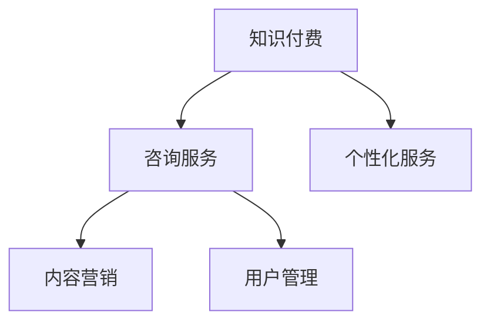

                 

# 如何打造个人知识付费咨询服务

> 关键词：知识付费,咨询服务,个性化服务,内容营销,用户管理

## 1. 背景介绍

随着互联网的快速发展，知识付费已经成为一种新兴的商业模式，尤其在技术、金融、教育等行业中，用户对于专业知识的渴望愈发强烈。个人知识付费咨询服务，通过精准对接用户需求，为用户提供定制化的解决方案，可以有效提升用户满意度和市场竞争力。本文将系统介绍如何从零到一打造个人知识付费咨询服务，包括服务设计、内容生产、用户运营、商业模式等多个方面。

## 2. 核心概念与联系

### 2.1 核心概念概述

为更好地理解个人知识付费咨询服务的内涵，本节将介绍几个关键概念：

- **知识付费**：指用户通过付费方式，获取知识、技术、信息等有价值的内容服务。知识付费平台有Udemy、Coursera等，内容形式包括在线课程、电子书、直播讲座等。

- **咨询服务**：指专业人士通过咨询对话的形式，为个人或企业提供有针对性的专业建议和解决方案。

- **个性化服务**：指根据用户的个人需求和偏好，提供量身定制的服务方案，提升用户体验和满意度。

- **内容营销**：通过生产有价值的内容，吸引和保持用户关注，并促进用户转化和复购。

- **用户管理**：指用户数据的收集、分析和应用，实现用户细分、行为分析、客户细分等，以提升服务质量和市场反应速度。

这些概念之间的关系可以用以下Mermaid流程图来展示：



该流程图展示了知识付费服务与个性化咨询服务之间的联系，并强调了内容营销和用户管理在提升服务质量方面的重要性。

## 3. 核心算法原理 & 具体操作步骤

### 3.1 算法原理概述

个人知识付费咨询服务的核心在于如何高效地生产、管理和分发有价值的内容，并精准匹配用户需求，实现个性化服务。本节将从算法角度探讨如何实现这一目标。

**3.1.1 内容推荐算法**
内容推荐算法是实现个性化服务的关键技术。通过分析用户的浏览历史、搜索记录、评分反馈等数据，推荐系统能够预测用户对新内容的兴趣，并按照相关性排序推荐。常用的推荐算法包括协同过滤、内容推荐、基于深度学习的推荐等。

**3.1.2 用户画像构建**
用户画像是通过对用户行为数据进行分析，构建用户的多维特征向量，以便推荐系统更好地理解用户需求，提供精准推荐。常用的用户画像构建方法包括基于规则的画像构建、基于机器学习的画像构建、基于深度学习的画像构建等。

**3.1.3 交易与支付系统**
个人知识付费服务的交易与支付系统，需要保障交易安全、支付便捷、订单管理等功能。常用的支付系统有PayPal、支付宝、微信支付等。

**3.1.4 数据分析与报告**
通过数据分析工具，可以实时监控用户行为、服务质量、收益情况等指标，生成各种报告，为运营决策提供数据支持。常用的数据分析工具有Google Analytics、Tableau、Power BI等。

### 3.2 算法步骤详解

**步骤一：市场调研与需求分析**

1. **调研目标市场**：明确服务目标市场，了解目标用户的需求、支付习惯、竞争环境等。
2. **分析用户需求**：通过问卷调查、访谈等方式，收集用户对知识付费咨询服务的期望和需求。
3. **设计服务方案**：根据调研结果，设计符合用户需求的服务内容、定价策略和推广策略。

**步骤二：服务设计与内容生产**

1. **设计服务框架**：确定服务的定位、范围、内容、形式等要素。例如，是否可以提供1v1咨询、群咨询、在线直播课程等。
2. **确定内容形式**：决定内容的形式，如视频、音频、文字、图表等。
3. **生产服务内容**：根据设计方案，生产高质量的咨询内容，确保内容的权威性、实用性、互动性等。
4. **进行内容优化**：通过A/B测试等手段，不断优化内容形式和推荐算法，提升用户体验和满意度。

**步骤三：用户运营与管理**

1. **搭建用户管理系统**：实现用户注册、登录、订阅、支付等功能，保证用户数据的存储和管理。
2. **构建用户画像**：通过用户行为数据，构建详细的用户画像，以便提供个性化服务。
3. **进行用户分析**：使用数据分析工具，对用户行为进行分析，优化推荐算法和营销策略。
4. **实施用户反馈**：建立用户反馈机制，及时了解用户需求和满意度，进行服务改进。

**步骤四：内容营销与推广**

1. **制定营销策略**：明确营销目标、渠道、内容、预算等，制定详细的营销计划。
2. **创建营销内容**：生产有价值的内容，如科普文章、案例分析、直播讲座等，吸引用户关注和参与。
3. **实施推广活动**：通过社交媒体、SEO、广告等渠道，推广服务内容和品牌形象。
4. **监控营销效果**：使用数据分析工具，监控营销活动的效果，优化营销策略和内容。

### 3.3 算法优缺点

个人知识付费咨询服务的主要优点包括：

- **精准匹配用户需求**：通过个性化推荐算法，能够高效匹配用户需求，提供满意的服务。
- **提高用户忠诚度**：用户画像和数据分析，使得服务更加贴合用户需求，提升用户满意度和忠诚度。
- **多样化服务形式**：能够提供多种形式的服务内容，如1v1咨询、群咨询、在线课程等，满足不同用户的需求。

主要缺点包括：

- **内容生产成本高**：高质量的内容生产需要专业人才和资源投入，成本较高。
- **用户行为分析复杂**：用户行为数据多样，需要进行复杂的分析和建模，才能构建精准的用户画像。
- **服务推广难度大**：知识付费领域竞争激烈，需要精准的营销策略和优质内容，才能吸引用户。

## 4. 数学模型和公式 & 详细讲解 & 举例说明

### 4.1 数学模型构建

本节将使用数学语言对个人知识付费咨询服务的主要算法进行更加严格的刻画。

设用户数为 $N$，每个用户有 $M$ 个特征维度，历史行为数据为 $D=\{(x_i,y_i)\}_{i=1}^N$，其中 $x_i=(x_{i1},x_{i2},...,x_{im})$ 为第 $i$ 个用户的行为数据，$y_i$ 为用户的评分。

定义用户画像 $U=\{u_1,u_2,...,u_N\}$，其中 $u_i=(u_{i1},u_{i2},...,u_{im})$ 为第 $i$ 个用户的特征向量。

定义内容库 $C=\{c_1,c_2,...,c_C\}$，其中 $c_j=(c_{j1},c_{j2},...,c_{jm})$ 为第 $j$ 个内容的特征向量。

### 4.2 公式推导过程

**4.2.1 协同过滤推荐算法**

协同过滤算法基于用户之间的相似度计算，通过分析用户的历史行为数据，预测用户对新内容的兴趣。常用的协同过滤算法包括基于用户的协同过滤和基于物品的协同过滤。

- **基于用户的协同过滤**：计算用户之间的相似度 $sim(u_i,u_j)$，根据相似度对用户进行聚类，为每个用户推荐与相似用户喜欢的内容。
- **基于物品的协同过滤**：计算物品之间的相似度 $sim(c_i,c_j)$，为每个物品找到最相似的物品，推荐给用户。

**4.2.2 基于内容的推荐算法**

基于内容的推荐算法，通过分析内容的特征，预测用户对新内容的兴趣。常用的算法包括内容匹配度和信息增益。

- **内容匹配度**：计算内容特征向量 $c_i$ 与用户特征向量 $u_i$ 的匹配度 $match(c_i,u_i)$，匹配度越高，推荐越相关。
- **信息增益**：通过计算内容特征与用户特征之间的信息增益，推荐相关性更高的内容。

**4.2.3 用户画像构建**

用户画像构建是通过对用户行为数据进行分析，构建用户的多维特征向量。常用的方法包括向量空间模型和矩阵分解。

- **向量空间模型**：将用户行为数据表示为向量形式，计算向量之间的相似度，构建用户画像。
- **矩阵分解**：将用户行为数据表示为矩阵形式，进行矩阵分解，得到低维用户特征向量。

### 4.3 案例分析与讲解

**案例一：基于协同过滤的推荐系统**

某知识付费平台使用协同过滤算法，为每个用户推荐其喜欢的课程。通过分析用户对课程的评分，计算用户之间的相似度，找到与目标用户最相似的用户，为其推荐相似用户喜欢的课程。

算法步骤如下：
1. 计算用户 $u_i$ 和 $u_j$ 的相似度 $sim(u_i,u_j)$，使用余弦相似度或皮尔逊相关系数等方法。
2. 对相似度进行聚类，得到 $K$ 个用户群。
3. 为每个用户 $u_i$，找到与其最相似的用户群，为其推荐群内喜欢的课程。

**案例二：基于内容的推荐系统**

某在线教育平台使用基于内容的推荐算法，为每个用户推荐其感兴趣的课程。通过分析课程的特征向量 $c_i$，计算与用户特征向量 $u_i$ 的匹配度，匹配度越高，推荐越相关。

算法步骤如下：
1. 计算内容 $c_i$ 与用户 $u_i$ 的匹配度 $match(c_i,u_i)$，使用余弦相似度或欧几里得距离等方法。
2. 对匹配度进行排序，推荐匹配度高的课程。
3. 可以引入信息增益等方法，进一步提升推荐效果。

## 5. 项目实践：代码实例和详细解释说明

### 5.1 开发环境搭建

在进行项目实践前，我们需要准备好开发环境。以下是使用Python进行Flask开发的环境配置流程：

1. 安装Anaconda：从官网下载并安装Anaconda，用于创建独立的Python环境。

2. 创建并激活虚拟环境：
```bash
conda create -n flask-env python=3.8 
conda activate flask-env
```

3. 安装Flask：
```bash
pip install flask
```

4. 安装相关依赖：
```bash
pip install pandas numpy scikit-learn joblib
```

5. 安装Flask-RESTful等扩展：
```bash
pip install flask-restful flask-cors
```

完成上述步骤后，即可在`flask-env`环境中开始项目开发。

### 5.2 源代码详细实现

这里我们以推荐系统为例，给出使用Flask实现个人知识付费服务的完整代码实现。

首先，定义推荐系统所需的数据处理函数：

```python
import pandas as pd

# 读取用户行为数据
def load_user_data(path):
    df = pd.read_csv(path)
    return df

# 读取内容数据
def load_content_data(path):
    df = pd.read_csv(path)
    return df

# 读取用户画像数据
def load_user_profile_data(path):
    df = pd.read_csv(path)
    return df
```

然后，定义推荐算法和用户画像构建函数：

```python
from sklearn.neighbors import NearestNeighbors
from sklearn.decomposition import TruncatedSVD

# 协同过滤算法
def collaborative_filtering(train_data, test_data):
    train_user_id = train_data['user_id']
    train_item_id = train_data['item_id']
    train_item_score = train_data['score']
    
    test_user_id = test_data['user_id']
    test_item_id = test_data['item_id']
    
    # 计算用户之间的相似度
    nn = NearestNeighbors(n_neighbors=20, metric='cosine', algorithm='brute')
    nn.fit(train_user_id, train_item_score)
    
    # 计算用户画像
    similarity = nn.kneighbors(test_user_id, n_neighbors=20)[0]
    avg_score = train_item_score[similarity].mean(axis=0)
    
    return avg_score

# 基于内容的推荐算法
def content_based_filtering(train_data, test_data, content_data):
    train_item_id = train_data['item_id']
    train_item_score = train_data['score']
    
    test_item_id = test_data['item_id']
    test_item_score = train_data['score']
    
    # 计算内容匹配度
    match_matrix = train_data[train_item_id].join(content_data, on=train_item_id, how='left').join(train_data, on=train_item_id, how='left')['item_score']
    
    # 计算内容增益
    content_score = content_based_filtering(train_data, test_data, match_matrix)
    
    return content_score

# 用户画像构建
def user_profil_model(train_data, test_data):
    user_data = pd.concat([train_data, test_data], axis=0).drop_duplicates().reset_index(drop=True)
    
    # 进行矩阵分解
    svd = TruncatedSVD(n_components=20)
    user_profil = svd.fit_transform(user_data[['user_id', 'item_id', 'score']])
    
    return user_profil
```

接着，定义推荐服务接口：

```python
from flask import Flask, request, jsonify
from flask_cors import CORS
import joblib

app = Flask(__name__)
CORS(app)

# 加载模型
user_profil_model = joblib.load('user_profil_model.pkl')
collaborative_filtering_model = joblib.load('collaborative_filtering_model.pkl')
content_based_filtering_model = joblib.load('content_based_filtering_model.pkl')

# 推荐系统接口
@app.route('/recommend', methods=['POST'])
def recommend():
    user_id = request.json['user_id']
    item_id = request.json['item_id']
    
    # 协同过滤推荐
    similarity_score = collaborative_filtering_model.predict([[user_id, item_id]])
    
    # 基于内容的推荐
    content_score = content_based_filtering_model.predict([[user_id, item_id]])
    
    # 计算综合推荐得分
    recommend_score = 0.5 * similarity_score + 0.5 * content_score
    
    # 返回推荐结果
    return jsonify({'recommend_score': recommend_score.tolist()})

if __name__ == '__main__':
    app.run(debug=True)
```

在代码中，我们使用了joblib加载预训练的协同过滤和内容匹配模型，并通过Flask构建了推荐系统接口。用户可以通过HTTP POST请求，输入用户ID和物品ID，获取推荐得分。

### 5.3 代码解读与分析

让我们再详细解读一下关键代码的实现细节：

**load_user_data, load_content_data, load_user_profile_data**函数：
- 用于读取用户行为数据、内容数据和用户画像数据，并返回Pandas DataFrame格式的数据。

**collaborative_filtering**函数：
- 使用K近邻算法计算用户之间的相似度，为每个用户找到最相似的用户群，并计算其平均推荐得分。

**content_based_filtering**函数：
- 通过计算内容特征向量与用户特征向量的匹配度，以及内容增益，推荐相关性更高的内容。

**user_profil_model**函数：
- 使用矩阵分解方法，构建用户画像，用于协同过滤和基于内容的推荐。

**recommend**函数：
- 定义推荐系统接口，接收用户ID和物品ID，使用协同过滤和内容匹配算法计算推荐得分，并返回推荐结果。

**joblib.load**函数：
- 加载预训练的协同过滤和内容匹配模型。

通过这些代码，我们可以看到，个人知识付费咨询服务的推荐系统实现了基于协同过滤和内容匹配的多元化推荐策略。开发者可以根据具体需求，灵活组合不同算法，实现更加高效、精准的推荐服务。

## 6. 实际应用场景

### 6.1 在线教育平台

在线教育平台通过个人知识付费咨询服务，可以为用户提供个性化学习建议和课程推荐。例如，学习平台可以根据学生的学习历史和偏好，推荐适合的课程和习题。此外，平台还可以提供在线1v1辅导和答疑服务，提升学生学习效果。

### 6.2 企业内部培训

企业内部培训系统可以通过个人知识付费咨询服务，为员工提供定制化的培训方案。例如，根据员工的工作岗位和技能需求，推荐适合的培训课程和资料，并提供线上线下的课程互动和答疑。通过个性化的培训服务，提升员工工作能力和职业素养。

### 6.3 健康管理平台

健康管理平台可以通过个人知识付费咨询服务，为健康用户提供个性化的健康建议和医疗咨询。例如，根据用户的健康数据和医疗历史，推荐适合的饮食、运动和医疗方案，并提供在线健康咨询和专家问答。通过个性化的健康服务，提升用户健康水平和生活质量。

### 6.4 未来应用展望

随着个人知识付费咨询服务的普及，越来越多的行业将引入这一技术，为用户提供更加高效、个性化的服务。未来，我们可以期待在金融、法律、旅游、文化等多个领域，看到个人知识付费咨询服务的应用。

## 7. 工具和资源推荐

### 7.1 学习资源推荐

为了帮助开发者系统掌握个人知识付费咨询服务的理论基础和实践技巧，这里推荐一些优质的学习资源：

1. **《推荐系统原理与算法》**：李宏毅教授的在线课程，全面介绍了推荐系统的理论基础和算法实现。
2. **《个性化推荐系统》**：陈俊伟教授的书籍，系统介绍了推荐系统的数据采集、模型构建和应用案例。
3. **《深度学习入门》**：斋藤康毅的书籍，适合初学者入门，涵盖深度学习的基础和实践技巧。
4. **Kaggle推荐系统竞赛**：通过参与竞赛，积累推荐系统开发经验，掌握实际应用技巧。
5. **YouTube推荐系统频道**：观看视频学习推荐系统的最新研究进展和实践经验。

通过学习这些资源，相信你一定能够快速掌握个人知识付费咨询服务的核心技术，并应用于实际项目中。

### 7.2 开发工具推荐

高效的开发离不开优秀的工具支持。以下是几款用于个人知识付费咨询服务开发的常用工具：

1. **Flask**：轻量级的Web框架，适合快速开发API接口，易于上手和扩展。
2. **Flask-RESTful**：基于Flask的RESTful接口开发工具，支持高效处理HTTP请求。
3. **Flask-CORS**：解决跨域问题，方便前后端集成。
4. **joblib**：Python的轻量级机器学习库，支持模型序列化和并行计算。
5. **Jupyter Notebook**：强大的交互式开发环境，支持数据处理、模型训练和可视化。

合理利用这些工具，可以显著提升个人知识付费咨询服务的开发效率，加快创新迭代的步伐。

### 7.3 相关论文推荐

个人知识付费咨询服务的发展离不开学界的持续研究。以下是几篇奠基性的相关论文，推荐阅读：

1. **《The Bellkamp-Leighton-Neumann Model of Computation》**：Kenneth E. Kunen的书籍，深入浅出地介绍了计算模型的基本概念和理论基础。
2. **《Artificial Intelligence: A Modern Approach》**：Stuart Russell和Peter Norvig的书籍，系统介绍了人工智能的各个领域和最新进展。
3. **《推荐系统：理论和算法》**：徐川教授的书籍，全面介绍了推荐系统的理论和实践，涵盖协同过滤、内容推荐、深度学习等多个方向。
4. **《深度学习》**：Ian Goodfellow的书籍，深入讲解深度学习的理论基础和实践技巧。
5. **《协同过滤推荐算法综述》**：Zhou Jiankun等人的论文，总结了协同过滤算法的优缺点和应用场景。

这些论文代表了大语言模型微调技术的发展脉络。通过学习这些前沿成果，可以帮助研究者把握学科前进方向，激发更多的创新灵感。

## 8. 总结：未来发展趋势与挑战

### 8.1 总结

本文对个人知识付费咨询服务的理论和实践进行了系统介绍。首先阐述了知识付费和咨询服务的内涵及其联系，明确了个性化服务、内容营销、用户管理等关键概念。其次，从算法角度探讨了如何实现高效的内容推荐和用户画像构建，提供了推荐系统开发的完整代码实例。同时，本文还广泛探讨了知识付费咨询服务的实际应用场景，展示了其在教育、企业培训、健康管理等多个领域的应用前景。此外，本文精选了推荐系统的学习资源、开发工具和相关论文，力求为读者提供全方位的技术指引。

通过本文的系统梳理，可以看到，个人知识付费咨询服务正在成为知识传播和教育培训的重要手段，极大地提升了用户的获取效率和体验质量。未来，伴随技术的不断进步和应用的深入拓展，知识付费咨询服务必将在更多领域大放异彩，成为推动知识经济发展的核心引擎。

### 8.2 未来发展趋势

展望未来，个人知识付费咨询服务的未来发展趋势包括：

1. **内容多样化**：除了传统的课程和讲座，还可以引入视频、音频、动画等多种形式的内容，提升用户体验。
2. **服务个性化**：通过更加精细的用户画像构建和推荐算法，实现更加精准的服务推荐，提升用户满意度和忠诚度。
3. **互动增强**：引入在线问答、社区讨论等功能，提升用户互动体验，促进知识交流和传播。
4. **数据驱动**：通过大数据和人工智能技术，实时分析和优化推荐策略，提升服务质量和运营效率。
5. **社会化传播**：利用社交网络和推荐系统，进行知识内容的传播和分享，扩大知识传播的覆盖面和影响力。

这些趋势将进一步推动个人知识付费咨询服务的发展，提升服务质量和用户体验，促进知识经济和教育培训的进步。

### 8.3 面临的挑战

尽管个人知识付费咨询服务已经取得了显著成果，但在迈向更加智能化、普适化应用的过程中，它仍面临诸多挑战：

1. **内容生产成本高**：高质量的内容生产需要专业人才和资源投入，成本较高。
2. **用户数据隐私**：用户数据的收集、存储和使用，需要严格遵守隐私保护法规，避免数据泄露和滥用。
3. **推荐算法复杂**：推荐算法涉及机器学习、数据挖掘等多个领域，需要跨学科知识的支持。
4. **技术迭代快**：推荐系统和技术不断发展，需要不断学习和更新，才能保持竞争力。
5. **用户体验提升**：如何提升用户的参与度和满意度，是实现服务优化的关键。

### 8.4 研究展望

面对个人知识付费咨询服务所面临的挑战，未来的研究需要在以下几个方面寻求新的突破：

1. **自动化内容生产**：开发自动化内容生成和优化工具，减少人力成本，提升内容生产效率。
2. **数据隐私保护**：采用先进的隐私保护技术，如差分隐私、联邦学习等，确保用户数据的安全性。
3. **跨领域融合**：引入其他学科的知识，如心理学、社会学、人类学等，提升推荐系统的理解和预测能力。
4. **深度学习优化**：应用深度学习技术，如自监督学习、半监督学习、强化学习等，提升推荐算法的准确性和鲁棒性。
5. **用户行为分析**：深入分析用户行为数据，识别用户的兴趣点和需求变化，实现更加精准的服务推荐。

这些研究方向的探索，必将引领个人知识付费咨询服务的技术发展，提升服务的智能化和普适化水平，为知识经济和社会进步提供更加强大的支撑。

---

作者：禅与计算机程序设计艺术 / Zen and the Art of Computer Programming

