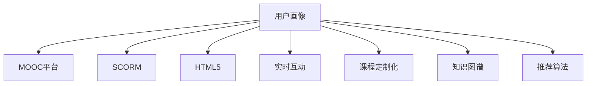

                 

# 如何打造个人知识付费线上课程

## 1. 背景介绍

### 1.1 问题由来

随着知识经济时代的到来，在线教育逐渐成为人们获取知识、提升自我的重要途径。特别是对于职场人士和大学生群体，通过线上课程学习新技能，不仅可以节省时间和成本，还能灵活安排学习节奏。

与此同时，知识付费市场也迅速崛起，各大平台纷纷推出专业课程，以满足人们日益增长的学习需求。然而，大多数线上课程都是机构或大公司出品，难以满足用户个性化和差异化的学习需求。这时，个人知识付费线上课程便应运而生，成为了一个充满潜力的新领域。

### 1.2 问题核心关键点

个人知识付费线上课程的核心关键点包括以下几个方面：

- **用户定位**：明确目标用户群体，分析其需求和痛点，以实现精准的课程设计。
- **课程内容**：构建系统化的课程体系，涵盖知识点的选择、编排以及案例分析等。
- **技术实现**：选择合适的技术栈，搭建课程平台，实现课程内容的上传、管理、展示和互动功能。
- **商业模式**：制定合理的定价策略，考虑课程销售、广告、会员等多种收入渠道。
- **市场推广**：利用社交媒体、SEO、付费广告等多种方式推广课程，提升用户曝光率和购买率。

## 2. 核心概念与联系

### 2.1 核心概念概述

为更好地理解个人知识付费线上课程的开发流程，本节将介绍几个密切相关的核心概念：

- **用户画像**：对目标用户进行详细的特征分析，涵盖年龄、性别、职业、学习偏好等，用于指导课程内容设计。
- **MOOC平台**：大规模在线开放课程平台，支持课程的上传、管理、展示和互动功能。
- **SCORM**：可共享内容对象参考模型，用于描述和部署在线学习内容。
- **HTML5**：基于Web标准的技术，支持多平台、多设备访问。
- **实时互动**：利用WebRTC等技术，实现课堂内外的实时互动交流。
- **课程定制化**：根据用户需求和反馈，对课程内容进行动态调整和优化。
- **知识图谱**：通过图数据库存储知识点的关联关系，构建系统的知识网络。
- **推荐算法**：使用协同过滤、内容推荐等算法，提升课程推荐的精准度。

这些核心概念之间的逻辑关系可以通过以下Mermaid流程图来展示：



这个流程图展示了个体知识付费课程的主要逻辑架构，每个模块互相连接，共同支撑课程的完整开发流程。

## 3. 核心算法原理 & 具体操作步骤
### 3.1 算法原理概述

个人知识付费线上课程的开发流程，本质上是一个将知识内容数字化、平台化、商业化的过程。核心算法原理主要包括以下几个方面：

- **课程内容设计**：通过对目标用户画像的深入分析，选择适合的知识点，并按逻辑关系编排成课程体系。
- **平台搭建与部署**：选择合适的技术栈，搭建课程平台，实现课程内容的上传、管理、展示和互动功能。
- **用户行为分析**：利用数据挖掘和机器学习技术，分析用户的学习行为，为课程优化提供数据支持。
- **推荐系统设计**：基于用户行为数据和课程特征，设计推荐算法，提升课程推荐效果。
- **交易与支付系统**：集成第三方支付平台，实现课程的销售、退款等功能。

### 3.2 算法步骤详解

个人知识付费线上课程的开发流程主要包括以下几个步骤：

**Step 1: 用户需求调研与课程规划**
- 收集目标用户群体的基本信息和需求，通过问卷、访谈等方式，了解用户的学习动机、时间、平台偏好等。
- 基于用户画像，规划课程内容，包括课程名称、目标用户、课程时长、定价等。

**Step 2: 课程内容设计与制作**
- 根据课程规划，选择适合的知识点，设计课程框架和课时结构。
- 制作课程视频、讲义、练习题等教学材料，确保内容的质量和系统性。
- 利用SCORM等标准，将课程内容打包成可共享对象，方便平台管理。

**Step 3: 平台搭建与开发**
- 选择合适的技术栈，如Node.js、React、Django等，搭建课程平台。
- 实现课程的上传、管理、展示、互动等功能，包括课程列表、章节浏览、视频播放、互动问答等。
- 利用WebRTC等技术，实现课堂内外的实时互动交流。

**Step 4: 用户行为分析与课程优化**
- 利用数据挖掘和机器学习技术，分析用户的学习行为，如观看时长、观看次数、答题正确率等。
- 基于用户行为数据，分析课程内容的效果，发现存在的问题，进行优化调整。
- 利用推荐算法，提升课程推荐的精准度，将合适的课程推荐给潜在用户。

**Step 5: 交易与支付系统集成**
- 集成第三方支付平台，实现课程的销售、支付、退款等功能。
- 设计合理的定价策略，考虑课程销售、广告、会员等多种收入渠道。
- 构建良好的用户体验，提升用户满意度和购买率。

### 3.3 算法优缺点

个人知识付费线上课程的开发流程具有以下优点：
1. 灵活性强：可根据用户需求和反馈，动态调整课程内容，满足个性化学习需求。
2. 可重复利用：课程内容经过数字化和标准化处理，易于反复利用和传播。
3. 低成本：开发和运营成本相对较低，适合个人和小规模团队。

同时，也存在一些局限性：
1. 用户粘性较低：部分用户可能对课程内容缺乏足够的动力和兴趣，难以坚持完成学习。
2. 市场竞争激烈：个人课程面临来自平台和大型机构的激烈竞争，市场份额难以保证。
3. 技术壁垒较高：需要具备一定的技术开发和数据处理能力，门槛较高。
4. 缺乏线下支持：课程多为线上形式，缺乏线下面对面的互动交流，难以完全满足用户需求。

尽管存在这些局限性，但个人知识付费线上课程仍具有较大的发展潜力，特别是在个性化和差异化学习需求日益增长的今天，它将发挥越来越重要的作用。

### 3.4 算法应用领域

个人知识付费线上课程主要应用于以下几个领域：

- **教育培训**：面向各类学习者，提供职业培训、技能提升、学术知识等各类课程。
- **职业发展**：针对职场人士，提供软技能培训、职业规划、行业分析等课程。
- **兴趣爱好**：针对不同兴趣爱好的用户，提供摄影、编程、音乐、艺术等课程。
- **文化娱乐**：提供文学、历史、电影、艺术等文化娱乐课程，丰富用户生活。
- **生活技能**：提供健康、饮食、家务、理财等生活技能课程，提升用户生活质量。

以上领域均为个人知识付费线上课程提供了广阔的应用场景，使得其市场前景广阔。

## 4. 数学模型和公式 & 详细讲解 & 举例说明

### 4.1 数学模型构建

本节将使用数学语言对个人知识付费线上课程的开发流程进行更加严格的刻画。

记课程内容为 $C$，用户画像为 $P$，平台功能为 $F$，用户行为数据为 $D$，推荐算法为 $R$，交易与支付系统为 $T$。其中 $C$ 由知识点 $K$ 组成，$P$ 由用户特征 $U$ 和需求 $N$ 组成。

定义课程内容设计的数学模型为：

$$
C = f(K, P)
$$

其中 $f$ 为课程内容设计函数，根据 $K$ 和 $P$ 生成完整的课程内容。

课程内容的制作与打包过程如下：

$$
C = \{c_1, c_2, \dots, c_n\}
$$

其中 $c_i = (k_i, d_i)$，表示第 $i$ 节课的知识点 $k_i$ 和相应的讲义、视频、练习题等教学材料 $d_i$。

平台搭建与开发的数学模型为：

$$
F = g(C, P)
$$

其中 $g$ 为平台搭建函数，根据 $C$ 和 $P$ 生成完整的平台功能，包括课程上传、管理、展示、互动等功能。

用户行为分析的数学模型为：

$$
A = h(D, F)
$$

其中 $h$ 为行为分析函数，根据 $D$ 和 $F$ 生成用户的行为数据，如观看时长、答题正确率等。

推荐系统的数学模型为：

$$
R = k(A, C)
$$

其中 $k$ 为推荐算法函数，根据 $A$ 和 $C$ 生成课程推荐结果，提升课程推荐的精准度。

交易与支付系统的数学模型为：

$$
T = m(C, R)
$$

其中 $m$ 为交易与支付函数，根据 $C$ 和 $R$ 生成课程的销售、支付、退款等功能。

### 4.2 公式推导过程

以下我们以视频课程为例，推导课程内容设计与用户行为分析的公式。

假设课程内容由 $n$ 个知识点组成，每个知识点 $k_i$ 有 $m_i$ 个视频片段。用户行为数据 $D$ 包括观看时长 $t$、答题正确率 $p$ 等。

课程内容设计的公式为：

$$
C = \{c_1, c_2, \dots, c_n\}
$$

其中 $c_i = (k_i, d_i)$，$d_i$ 为第 $i$ 节课的视频片段列表。

用户行为分析的公式为：

$$
A = \{a_1, a_2, \dots, a_n\}
$$

其中 $a_i = (t_i, p_i)$，表示第 $i$ 节课的观看时长和答题正确率。

根据行为分析结果，可以进一步优化课程内容。例如，如果某节课的答题正确率较低，则可能需要增加该节课的难度或调整课程顺序。

### 4.3 案例分析与讲解

假设我们有一门面向大学生的编程入门课程，内容包括Python基础、数据结构、算法设计等。课程总时长为20周，每周3小时。我们希望通过分析用户的学习行为，不断优化课程内容，提升用户的学习效果。

我们首先通过问卷调查和访谈等方式收集大学生的基本信息和需求，确定课程内容的设计框架。然后，选择适合的知识点，设计课程框架和课时结构。

接着，制作课程视频、讲义、练习题等教学材料，确保内容的质量和系统性。利用SCORM等标准，将课程内容打包成可共享对象，方便平台管理。

平台搭建与开发过程中，我们选择了Node.js和React作为后端和前端技术栈，实现课程的上传、管理、展示、互动等功能。利用WebRTC等技术，实现课堂内外的实时互动交流。

在用户行为分析阶段，我们收集用户的学习数据，分析观看时长、答题正确率等行为数据。根据分析结果，发现某些课程模块用户掌握较好，可以加快进度；某些模块用户掌握较差，需要进行强化练习。

最后，利用推荐算法，将用户可能感兴趣的课程推荐给其他用户，提升课程的曝光率和用户满意度。

## 5. 项目实践：代码实例和详细解释说明
### 5.1 开发环境搭建

在进行课程开发前，我们需要准备好开发环境。以下是使用Python进行Flask开发的环境配置流程：

1. 安装Anaconda：从官网下载并安装Anaconda，用于创建独立的Python环境。

2. 创建并激活虚拟环境：
```bash
conda create -n myenv python=3.8 
conda activate myenv
```

3. 安装Flask：
```bash
pip install Flask
```

4. 安装相关库：
```bash
pip install Flask-SocketIO Flask-Session Flask-WTF Flask-Uploads
```

5. 安装TensorFlow：
```bash
pip install tensorflow
```

6. 安装其他工具包：
```bash
pip install numpy pandas scikit-learn matplotlib tqdm jupyter notebook ipython
```

完成上述步骤后，即可在`myenv`环境中开始课程开发。

### 5.2 源代码详细实现

下面我们以编程入门课程为例，给出使用Flask进行课程开发的PyTorch代码实现。

首先，定义课程相关的数据模型：

```python
from flask_sqlalchemy import SQLAlchemy
from flask_login import UserMixin, User
from werkzeug.security import generate_password_hash, check_password_hash

db = SQLAlchemy()

class User(UserMixin, db.Model):
    id = db.Column(db.Integer, primary_key=True)
    username = db.Column(db.String(50), unique=True, nullable=False)
    password_hash = db.Column(db.String(100))
    courses = db.relationship('Course', backref='users', lazy=True)

    def __init__(self, username, password):
        self.username = username
        self.password_hash = generate_password_hash(password)

class Course(db.Model):
    id = db.Column(db.Integer, primary_key=True)
    title = db.Column(db.String(50), nullable=False)
    description = db.Column(db.Text, nullable=False)
    lectures = db.relationship('Lecture', backref='course', lazy=True)

class Lecture(db.Model):
    id = db.Column(db.Integer, primary_key=True)
    title = db.Column(db.String(50), nullable=False)
    video = db.Column(db.String(100), nullable=False)
    notes = db.Column(db.Text, nullable=False)
    timestamp = db.Column(db.DateTime, default=datetime.utcnow)

class Enrollment(db.Model):
    id = db.Column(db.Integer, primary_key=True)
    course_id = db.Column(db.Integer, db.ForeignKey('course.id'))
    user_id = db.Column(db.Integer, db.ForeignKey('user.id'))

# 模拟用户登录
def login(username, password):
    user = User.query.filter_by(username=username).first()
    if user and check_password_hash(user.password_hash, password):
        return user
    return None
```

然后，定义课程相关的服务函数：

```python
from flask import Flask, render_template, redirect, url_for, request
from flask_login import login_user, logout_user, login_required
from werkzeug.utils import secure_filename
import os

app = Flask(__name__)
app.config['SECRET_KEY'] = 'your-secret-key'
app.config['SQLALCHEMY_DATABASE_URI'] = 'sqlite:///courses.db'
app.config['SQLALCHEMY_TRACK_MODIFICATIONS'] = False

@app.route('/')
@login_required
def index():
    courses = Course.query.all()
    return render_template('index.html', courses=courses)

@app.route('/enroll/<course_id>')
@login_required
def enroll(course_id):
    user = login_user(username='john', password='12345')
    course = Course.query.get(course_id)
    enrollment = Enrollment(course_id=course.id, user_id=user.id)
    db.session.add(enrollment)
    db.session.commit()
    return redirect(url_for('index'))

@app.route('/logout')
@login_required
def logout():
    logout_user()
    return redirect(url_for('index'))

@app.route('/upload', methods=['GET', 'POST'])
@login_required
def upload():
    if request.method == 'POST':
        filename = secure_filename(request.files['file'].filename)
        file = request.files['file']
        file.save(os.path.join(app.config['UPLOAD_FOLDER'], filename))
        course = Course(title='Python基础', description='Python基础课程')
        db.session.add(course)
        db.session.commit()
        return redirect(url_for('index'))
    else:
        return render_template('upload.html')
```

接着，定义课程相关的前端页面：

```html
<!DOCTYPE html>
<html>
<head>
    <title>课程首页</title>
    <script src="https://code.jquery.com/jquery-3.5.1.min.js"></script>
    <script src="https://code.jquery.com/ui/1.12.1/jquery-ui.min.js"></script>
    <link rel="stylesheet" href="https://code.jquery.com/ui/1.12.1/themes/base/jquery-ui.css">
</head>
<body>
    <h1>课程首页</h1>
    
    <div class="course">
        <h2>{{ course.title }}</h2>
        <p>{{ course.description }}</p>
        <a href="{{ url_for('enroll', course_id=course.id) }}">加入课程</a>
    </div>
    
    <h2>上传课程</h2>
    <form method="post" enctype="multipart/form-data">
        <input type="file" name="file">
        <input type="submit" value="上传">
    </form>
</body>
</html>
```

最后，启动Flask应用并测试：

```python
if __name__ == '__main__':
    app.run(debug=True)
```

以上就是使用Flask进行编程入门课程开发的完整代码实现。可以看到，利用Flask的简单灵活，我们快速构建了用户登录、课程浏览、课程加入、文件上传等功能。

### 5.3 代码解读与分析

让我们再详细解读一下关键代码的实现细节：

**User模型**：
- 定义了用户的基本信息，包括用户名、密码等。
- 利用Flask-Login扩展实现了用户登录、注销等功能。

**Course模型**：
- 定义了课程的基本信息，包括标题、描述、视频等。
- 通过关系映射，实现了课程与讲师、用户、视频等实体的关联。

**Lecture模型**：
- 定义了课程讲座的基本信息，包括标题、视频、笔记等。
- 利用时间戳记录讲座的创建时间。

**Enrollment模型**：
- 定义了用户对课程的加入关系。
- 通过外键关联用户和课程，实现用户对课程的跟踪和统计。

**login函数**：
- 实现了用户登录功能，利用Flask-Login扩展的check_password_hash函数验证用户密码。

**index函数**：
- 实现了课程首页功能，通过查询数据库获取所有课程，并在模板中渲染展示。

**enroll函数**：
- 实现了课程加入功能，通过Flask-Login扩展的login_user函数实现用户加入课程。

**logout函数**：
- 实现了课程注销功能，通过Flask-Login扩展的logout_user函数实现用户退出课程。

**upload函数**：
- 实现了课程上传功能，利用Flask的文件上传机制实现视频文件的保存，并在模板中渲染上传表单。

**index.html模板**：
- 定义了课程首页的前端界面，通过Flask模板引擎渲染显示。

以上代码实现了基本的课程开发功能，开发过程中需要根据实际需求进一步扩展和优化。

## 6. 实际应用场景
### 6.1 在线教育平台

基于Flask的个人知识付费线上课程，可以轻松实现在线教育平台的基本功能，提供用户注册、课程浏览、课程加入、视频观看、在线答疑等功能。平台可以通过学生和讲师的互动交流，提升学习效果，激发学生的学习热情。

### 6.2 企业培训系统

对于企业而言，基于Flask的个人知识付费线上课程可以构建内部培训系统，提供定制化的培训课程。通过课程设计与学员反馈的闭环优化，实现员工技能的提升和职业发展的支持。

### 6.3 兴趣社交平台

个人知识付费线上课程还可以应用于兴趣社交平台，提供各类兴趣爱好的课程，如编程、摄影、音乐、艺术等。通过课程推荐、互动交流等机制，促进用户之间的知识分享和社交互动。

### 6.4 未来应用展望

随着Flask和Python技术的不断发展，个人知识付费线上课程的应用场景将更加广阔。未来可以探索更多的应用方向，如游戏教学、职业发展指导、健康管理等，拓展课程内容的深度和广度，满足用户的多样化需求。

## 7. 工具和资源推荐
### 7.1 学习资源推荐

为了帮助开发者系统掌握个人知识付费线上课程的开发技术，这里推荐一些优质的学习资源：

1. **《Flask Web开发实战》**：介绍Flask开发的核心技术和实践技巧，适合Flask开发初学者。
2. **《Python Web开发教程》**：涵盖Python Web开发的基础知识和高级技巧，适合Python和Web开发进阶学习者。
3. **《机器学习实战》**：讲解机器学习算法和应用，适合对数据处理和机器学习感兴趣的开发者。
4. **《课程设计基础》**：涵盖课程设计的基本原则和策略，适合课程开发者参考。
5. **《课程制作手册》**：详细介绍课程制作的技术细节和最佳实践，适合课程开发者参考。

通过这些资源的学习实践，相信你一定能够快速掌握Flask开发课程的基础知识和实践技巧，构建出高质量的线上课程。

### 7.2 开发工具推荐

高效的开发离不开优秀的工具支持。以下是几款用于Flask开发课程的常用工具：

1. **Jupyter Notebook**：基于Web的交互式编程环境，支持Python、R等语言的混合开发，方便开发、测试和调试。
2. **JupyterLab**：Jupyter Notebook的下一代版本，提供更加灵活的开发环境，支持多种IDE集成。
3. **PyCharm**：功能强大的Python IDE，支持代码编辑、调试、测试、部署等全生命周期的开发支持。
4. **GitHub**：基于Git版本控制系统的代码托管平台，支持团队协作开发，提供代码版本管理和仓库托管服务。
5. **Heroku**：云服务平台，支持Python应用的无服务器部署，支持快速上线和扩容。
6. **AWS**：全球领先的云服务提供商，支持丰富的云服务和开发工具，适合大规模应用开发和部署。

合理利用这些工具，可以显著提升Flask课程开发的效率，加速创新迭代的步伐。

### 7.3 相关论文推荐

个人知识付费线上课程的发展源于学界的持续研究。以下是几篇奠基性的相关论文，推荐阅读：

1. **《大规模在线教育：现状、挑战与未来》**：综述大规模在线教育的研究现状和未来发展方向。
2. **《基于Web的在线课程设计研究》**：探讨基于Web的在线课程设计的基本原则和技术方法。
3. **《智能教学系统：现状、问题与未来》**：分析智能教学系统的研究现状和未来发展趋势。
4. **《课程推荐系统的设计与实现》**：介绍课程推荐系统的设计与实现方法，包括协同过滤、内容推荐等算法。
5. **《机器学习与课程设计》**：探讨机器学习在课程设计和优化中的应用，提升课程推荐的精准度和效果。

这些论文代表了大规模在线教育的研究方向，通过学习这些前沿成果，可以帮助研究者把握学科前进方向，激发更多的创新灵感。

## 8. 总结：未来发展趋势与挑战
### 8.1 总结

本文对基于Flask的个人知识付费线上课程开发流程进行了全面系统的介绍。首先阐述了课程开发的背景和意义，明确了课程开发的核心关键点。其次，从原理到实践，详细讲解了课程开发的技术流程，给出了完整的代码实例和分析。同时，本文还广泛探讨了课程开发在教育、企业、社交等多个领域的应用前景，展示了课程开发的巨大潜力。

通过本文的系统梳理，可以看到，基于Flask的个人知识付费线上课程开发技术已经日趋成熟，具有较高的可操作性和应用价值。未来，伴随技术的不断进步和市场需求的持续增长，课程开发技术将进一步提升，满足更多用户的多样化学习需求。

### 8.2 未来发展趋势

展望未来，个人知识付费线上课程开发技术将呈现以下几个发展趋势：

1. **技术集成化**：未来课程开发将更加注重技术集成，整合更多前沿技术，如AI、大数据、区块链等，提升课程的智能化和安全性。
2. **平台标准化**：平台的标准化和规范化将成为课程开发的重要趋势，确保课程质量和用户体验的一致性。
3. **社区化合作**：社区化的课程开发模式将兴起，利用开源、协作的方式，加速课程的开发和推广。
4. **个性化推荐**：利用大数据和推荐算法，提供个性化的课程推荐，提升用户的满意度和忠诚度。
5. **多设备支持**：实现多设备、多平台的支持，提升课程的灵活性和普及度。
6. **跨学科融合**：课程开发将更多地关注跨学科融合，整合各类知识和技术，提升课程的深度和广度。

以上趋势凸显了个人知识付费线上课程开发的广阔前景，未来将在教育、企业、社交等多个领域得到广泛应用，推动知识经济的进一步发展。

### 8.3 面临的挑战

尽管个人知识付费线上课程开发技术已经取得了不小的进步，但在迈向更加智能化、普适化应用的过程中，仍面临诸多挑战：

1. **用户留存率低**：课程内容的设计和质量直接影响用户的学习效果和体验，如何提升课程的吸引力和用户粘性，是课程开发的一大挑战。
2. **市场竞争激烈**：课程开发需要具备较强的市场嗅觉和敏锐度，如何打破激烈的市场竞争，脱颖而出，是课程开发者需要解决的难题。
3. **技术壁垒高**：课程开发需要具备一定的技术开发和数据处理能力，如何降低技术壁垒，提供易学易用的开发平台，是课程开发的关键。
4. **数据隐私和安全**：课程开发涉及大量的用户数据和课程内容，如何保障数据隐私和安全，确保用户数据不被泄露，是课程开发的重要课题。
5. **内容更新和维护**：课程内容需要不断更新和维护，如何高效地进行内容更新和版本管理，是课程开发者需要关注的问题。

### 8.4 研究展望

面对课程开发所面临的诸多挑战，未来的研究需要在以下几个方面寻求新的突破：

1. **课程内容的个性化和多样化**：通过用户画像和行为分析，提供个性化、多样化的课程内容，满足不同用户的学习需求。
2. **课程推荐的智能化和精准化**：利用机器学习和推荐算法，提升课程推荐的智能化和精准度，提高用户的学习效果和满意度。
3. **社区化协作模式的探索**：探索社区化协作模式，利用开源和协作的方式，提升课程开发的效率和质量。
4. **技术集成的多样化**：整合更多前沿技术，如AI、大数据、区块链等，提升课程的智能化和安全性。
5. **跨学科融合的深化**：整合各类知识和技术，深化跨学科融合，提升课程的深度和广度。
6. **数据隐私和安全的保障**：探索隐私保护和数据安全的技术方法，确保用户数据的安全和隐私。

这些研究方向的探索，必将引领个人知识付费线上课程开发技术迈向更高的台阶，为知识的普及和传播提供更加高效、安全、个性化的平台。面向未来，课程开发技术需要与其他人工智能技术进行更深入的融合，共同推动知识经济的进步和发展。

## 9. 附录：常见问题与解答

**Q1：如何确定课程内容的设计框架？**

A: 确定课程内容的设计框架，需要深入分析目标用户群体的基本信息和需求，通过问卷、访谈等方式，了解用户的痛点和兴趣点。然后，根据用户画像，选择适合的知识点，设计课程框架和课时结构。

**Q2：如何在开发过程中实现用户行为分析？**

A: 在开发过程中，可以利用数据挖掘和机器学习技术，分析用户的学习行为，如观看时长、答题正确率等。将这些行为数据记录在数据库中，通过统计分析和建模，发现用户的学习规律和行为模式。

**Q3：如何优化课程内容？**

A: 根据用户行为分析结果，可以优化课程内容，如调整课程顺序、增加难度、强化练习等。此外，可以引入用户反馈机制，不断改进课程设计，提升课程的吸引力和用户满意度。

**Q4：如何选择适合的技术栈？**

A: 在选择技术栈时，需要考虑开发难度、性能需求、扩展性等因素。一般而言，Python+Flask是适合课程开发的技术栈，具有易学易用、灵活扩展等特点。

**Q5：如何推广课程？**

A: 课程推广可以通过多种方式，如社交媒体、SEO、付费广告等。在推广过程中，需要结合课程特点，选择合适的平台和渠道，提升用户曝光率和购买率。

---

作者：禅与计算机程序设计艺术 / Zen and the Art of Computer Programming

