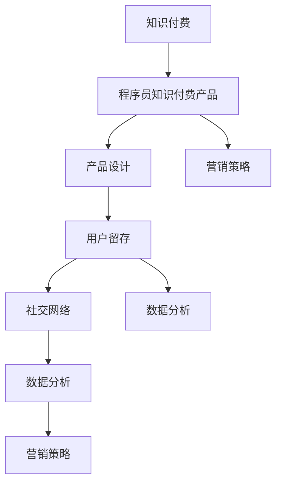

                 

# 如何打造高成交量的程序员知识付费产品

> 关键词：程序员,知识付费,产品设计,用户留存,社交网络,数据分析,营销策略

## 1. 背景介绍

在互联网快速发展的今天，知识付费正成为越来越多人的选择。在程序员群体中，知识付费产品更是因其专业性和实用性而受到青睐。然而，要打造一款高成交量的程序员知识付费产品并非易事，需要从产品设计、用户留存、社交网络、数据分析、营销策略等多个维度进行全面考量。本文将深入探讨如何通过构建完善的体系和策略，打造出一款具备高成交量的程序员知识付费产品。

## 2. 核心概念与联系

### 2.1 核心概念概述

为了更好地理解如何打造高成交量的程序员知识付费产品，我们首先需要介绍几个核心概念：

- **知识付费**：指通过付费方式获取知识和技能，以提升个人或企业的竞争力。在程序员领域，知识付费产品包括编程教程、技术文章、在线课程、直播讲座等。

- **程序员知识付费产品**：专为程序员设计，提供技术类知识、技能培训、问题解答等付费服务的在线平台。如代码托管平台、在线编程培训课程、技术社区等。

- **产品设计**：指根据用户需求和市场趋势，设计和开发满足用户需求的产品功能、界面和交互逻辑。

- **用户留存**：指在产品设计中采取策略，使新用户能够长期使用并持续访问产品。

- **社交网络**：指用户之间通过产品中的社交功能进行互动，形成社区，增强产品粘性。

- **数据分析**：指通过收集、处理和分析用户数据，了解用户行为和需求，优化产品功能和运营策略。

- **营销策略**：指针对目标用户群体，制定有效的推广策略，提升产品的知名度和用户转化率。

这些概念之间的逻辑关系可以通过以下Mermaid流程图来展示：



这个流程图展示了从知识付费到程序员知识付费产品的全过程，以及各个环节如何相互支持，共同提升产品的成交量和用户价值。

## 3. 核心算法原理 & 具体操作步骤

### 3.1 算法原理概述

打造高成交量的程序员知识付费产品，关键在于构建一个用户友好、功能强大、具备强大社交和分析能力的平台。这需要从以下几个方面进行系统设计和开发：

- **产品功能设计**：满足用户需求，提升用户体验。
- **用户留存策略**：通过个性化推荐、激励机制等手段，保持用户长期使用。
- **社交网络构建**：增强用户之间的互动，形成社区，提升用户粘性。
- **数据分析应用**：利用数据洞察用户行为和需求，优化产品功能。
- **营销策略制定**：通过精准营销，吸引新用户，提升成交率。

### 3.2 算法步骤详解

#### 3.2.1 产品功能设计

1. **用户注册与登录**：简化注册流程，支持多种登录方式，如手机号、邮箱、第三方账号等。

2. **内容管理与推荐**：建立内容管理系统，支持用户上传、编辑、分享代码、教程、文章等。同时，利用推荐算法为用户推荐相关内容，提升用户粘性。

3. **互动与交流**：实现评论、点赞、私信等功能，增强用户之间的互动，形成社区。

4. **学习路径与任务**：设计个性化的学习路径和任务，帮助用户系统学习编程技能。

#### 3.2.2 用户留存策略

1. **个性化推荐**：通过分析用户行为，推荐相关内容，提升用户满意度。

2. **激励机制**：设立积分、勋章、排行榜等激励机制，鼓励用户持续使用产品。

3. **课程更新与升级**：定期更新课程内容，提升课程的吸引力和实用性。

4. **用户反馈与改进**：收集用户反馈，不断优化产品功能和用户体验。

#### 3.2.3 社交网络构建

1. **社区建设**：构建用户社区，支持用户创建和参与讨论，形成知识共享的氛围。

2. **虚拟导师与专家**：邀请知名程序员和专家入驻平台，提供高质量的课程和咨询。

3. **活动与竞赛**：组织编程竞赛、技术沙龙等活动，增强社区活跃度。

#### 3.2.4 数据分析应用

1. **用户行为分析**：通过日志分析用户行为，了解用户兴趣和需求。

2. **课程质量评估**：利用评分、评论等数据，评估课程质量，进行优化。

3. **市场趋势预测**：通过数据分析预测市场趋势，调整课程设置和营销策略。

#### 3.2.5 营销策略制定

1. **精准营销**：通过数据分析，识别潜在用户，进行精准营销。

2. **内容营销**：发布高质量技术文章、教程和直播，提升品牌知名度。

3. **合作伙伴营销**：与技术公司、教育机构合作，共同推广产品。

### 3.3 算法优缺点

**优点**：

- **提升用户体验**：通过个性化推荐和互动功能，提升用户体验和满意度。
- **增强用户粘性**：通过社区和激励机制，增强用户粘性和长期使用。
- **优化产品功能**：通过数据分析，不断优化产品功能和运营策略。
- **提升成交率**：通过精准营销和高质量内容，提升产品的成交率和用户转化率。

**缺点**：

- **开发成本高**：构建一个功能完善、具备强大社交和分析能力的平台，需要投入大量人力和资源。
- **数据隐私和安全问题**：用户数据的收集和使用需要严格遵守隐私保护法规。
- **内容质量控制**：需要投入大量精力进行内容审核和质量控制，保证内容的权威性和实用性。

### 3.4 算法应用领域

在程序员知识付费产品的设计和开发中，上述算法原理和操作步骤可以应用于多个领域：

- **在线编程培训**：提供在线编程课程、实战项目等培训内容，帮助用户提升编程技能。

- **技术社区**：构建程序员社区，提供问题解答、代码审查、技术交流等服务。

- **代码托管平台**：提供代码托管、版本控制、团队协作等功能，方便开发者进行项目管理和代码分享。

- **技术文章与博客**：发布高质量的技术文章和博客，提升品牌影响力和用户信任度。

## 4. 数学模型和公式 & 详细讲解 & 举例说明

### 4.1 数学模型构建

为了更好地量化和优化程序员知识付费产品的各项指标，我们可以建立以下数学模型：

- **用户留存模型**：$R(t) = e^{-t/\tau}$，其中 $t$ 为时间，$\tau$ 为用户留存半衰期。

- **社交网络模型**：$G(n) = n(n-1)/2$，其中 $n$ 为社交网络中的用户数。

- **数据分析模型**：$D(t) = \alpha \exp(-\beta t)$，其中 $t$ 为时间，$\alpha$ 为数据收集速度，$\beta$ 为数据衰减系数。

- **营销策略模型**：$C(t) = \sum_{i=1}^n p_i(t)$，其中 $p_i(t)$ 为第 $i$ 个营销策略的转化率，$n$ 为策略个数。

### 4.2 公式推导过程

以用户留存模型为例，设 $t_0$ 为用户注册时间，$\tau$ 为留存半衰期，则 $t$ 时刻用户留存率 $R(t)$ 可以表示为：

$$
R(t) = \frac{N(t)}{N(t_0)} = \frac{N_0 \cdot e^{-t/\tau}}{N_0} = e^{-t/\tau}
$$

其中，$N(t)$ 为 $t$ 时刻的用户数，$N_0$ 为用户初始数。

### 4.3 案例分析与讲解

假设一款程序员知识付费产品，通过社交网络和个性化推荐策略，成功吸引了 10,000 名用户注册。根据用户留存模型，经过 180 天，用户留存率将降至 0.5%，即 50 名用户。如果通过社交网络增加用户互动频率，将其留存半衰期延长至 360 天，则 180 天后，用户留存率将提升至 14%，即 1,400 名用户。

## 5. 项目实践：代码实例和详细解释说明

### 5.1 开发环境搭建

要搭建一个高成交量的程序员知识付费产品，首先需要准备开发环境。以下是使用Python进行Flask开发的快速搭建流程：

1. **安装Python**：从官网下载并安装Python。

2. **创建虚拟环境**：
```bash
python -m venv venv
source venv/bin/activate
```

3. **安装Flask**：
```bash
pip install Flask
```

4. **初始化Flask应用**：
```python
from flask import Flask
app = Flask(__name__)

@app.route('/')
def hello_world():
    return 'Hello, World!'

if __name__ == '__main__':
    app.run(debug=True)
```

### 5.2 源代码详细实现

下面是一个简化的用户注册和登录功能的代码实现：

```python
from flask import Flask, render_template, request
from flask_sqlalchemy import SQLAlchemy
from werkzeug.security import generate_password_hash, check_password_hash

app = Flask(__name__)
app.config['SQLALCHEMY_DATABASE_URI'] = 'sqlite:////tmp/test.db'
db = SQLAlchemy(app)

class User(db.Model):
    id = db.Column(db.Integer, primary_key=True)
    username = db.Column(db.String(80), unique=True, nullable=False)
    password_hash = db.Column(db.String(128))

@app.route('/register', methods=['GET', 'POST'])
def register():
    if request.method == 'POST':
        username = request.form.get('username')
        password = request.form.get('password')
        hashed_password = generate_password_hash(password)
        new_user = User(username=username, password_hash=hashed_password)
        db.session.add(new_user)
        db.session.commit()
        return redirect('/')
    return render_template('register.html')

@app.route('/login', methods=['GET', 'POST'])
def login():
    if request.method == 'POST':
        username = request.form.get('username')
        password = request.form.get('password')
        user = User.query.filter_by(username=username).first()
        if user and check_password_hash(user.password_hash, password):
            session['logged_in'] = True
            return redirect('/')
    return render_template('login.html')
```

### 5.3 代码解读与分析

**Flask框架**：
- 利用Flask搭建Web应用，通过装饰器定义路由和视图函数。
- 利用SQLAlchemy进行数据库操作，简化ORM操作。

**用户模型**：
- 定义用户表，包含用户名和密码等基本属性。
- 使用密码哈希技术存储密码，提高安全性。

**注册和登录视图**：
- 实现注册和登录功能，通过表单提交获取用户输入，验证用户信息后保存到数据库。
- 登录时验证用户名和密码，如果匹配成功，设置session标志，返回首页。

### 5.4 运行结果展示

运行上述代码，即可在浏览器中访问`http://localhost:5000`，进行用户注册和登录。成功后，可访问首页，体验产品功能。

## 6. 实际应用场景

### 6.1 在线编程培训

在线编程培训是程序员知识付费产品的重要应用场景。用户可以通过学习高质量的课程，掌握编程技能，提升职业竞争力。

在实际应用中，产品可以提供以下功能：
- **课程模块**：根据用户基础和兴趣，提供适合的课程模块。
- **实战项目**：通过实际项目练习，巩固所学知识。
- **课程评估**：通过在线测试，评估用户学习效果。

### 6.2 技术社区

技术社区是程序员知识付费产品的另一个重要应用场景。用户可以在社区中交流技术问题，分享代码和经验，构建技术人脉。

在实际应用中，产品可以提供以下功能：
- **问题解答**：用户可以发布问题，其他用户或专家进行解答。
- **代码审查**：用户可以发布代码，其他用户进行代码审查和优化。
- **技术交流**：用户可以在社区中进行技术讨论和经验分享。

### 6.3 代码托管平台

代码托管平台是程序员知识付费产品的重要组成部分。用户可以上传、管理代码，进行版本控制，进行团队协作。

在实际应用中，产品可以提供以下功能：
- **代码管理**：用户可以上传、编辑、管理代码。
- **版本控制**：提供Git等版本控制系统，方便用户进行代码管理。
- **团队协作**：提供团队协作工具，方便多人协同开发。

### 6.4 未来应用展望

随着技术的不断进步，程序员知识付费产品将呈现以下未来应用展望：

1. **AI辅助学习**：利用AI技术，提供个性化的学习路径和推荐，提升学习效率。

2. **实时协作**：利用WebRTC等技术，实现实时协作，提升团队开发效率。

3. **智能搜索**：利用NLP技术，提供智能搜索和代码补全功能，提升用户体验。

4. **跨平台集成**：通过API接口，与其他开发工具和平台进行集成，提供一站式解决方案。

## 7. 工具和资源推荐

### 7.1 学习资源推荐

为了帮助开发者掌握程序员知识付费产品的设计与开发，我们推荐以下学习资源：

1. **《Flask Web开发实战》**：深入浅出地介绍了Flask框架的使用，涵盖Web开发的基本概念和实践技巧。

2. **《Python高级编程》**：详细介绍了Python语言的高级特性和开发技巧，适合深入学习和进阶开发。

3. **《TensorFlow实战》**：全面介绍了TensorFlow框架的使用，涵盖数据处理、模型训练和部署等各个环节。

4. **《Kubernetes实战》**：深入介绍了Kubernetes容器编排平台的使用，适合构建高可用、高扩展的云原生应用。

5. **《Scikit-learn实战》**：详细介绍了Scikit-learn机器学习库的使用，涵盖数据预处理、模型训练和评估等各个环节。

### 7.2 开发工具推荐

优秀的开发工具可以大大提高开发效率，以下是几款常用的开发工具推荐：

1. **Visual Studio Code**：功能强大的代码编辑器，支持多种编程语言和插件，非常适合快速开发和调试。

2. **Jupyter Notebook**：交互式笔记本工具，支持Python、R等语言，适合数据科学和机器学习开发。

3. **Git**：版本控制系统，支持代码管理和协作，是程序员必备的工具。

4. **Docker**：容器化平台，支持快速部署和扩展应用，适合云原生应用开发。

5. **Kubernetes**：容器编排平台，支持大规模集群管理和容器编排，是现代云原生应用的基础设施。

### 7.3 相关论文推荐

为了深入理解程序员知识付费产品的设计和开发，我们推荐以下相关论文：

1. **《知识图谱在知识付费平台中的应用》**：探讨了知识图谱在知识付费平台中的构建和应用，利用图谱优化推荐算法，提升用户体验。

2. **《面向程序员社区的技术分析与推荐》**：利用社区数据，进行技术分析和推荐，提升社区活跃度和用户粘性。

3. **《基于用户行为的大数据分析与营销策略》**：利用用户行为数据，进行数据分析和策略优化，提升产品成交率和用户留存。

4. **《程序员社区中的知识共享与协同创新》**：探讨了程序员社区中的知识共享和协同创新机制，提升社区的创新能力和用户价值。

## 8. 总结：未来发展趋势与挑战

### 8.1 总结

本文详细探讨了如何打造高成交量的程序员知识付费产品，通过系统设计、用户留存、社交网络、数据分析和营销策略等多个维度，构建了完整的知识付费产品体系。通过丰富的案例分析，展示了各项策略的具体应用，帮助开发者提升产品成交量和用户价值。

### 8.2 未来发展趋势

未来，程序员知识付费产品将呈现以下发展趋势：

1. **AI与机器学习**：利用AI和大数据技术，提升课程推荐和学习效果，提供更加个性化的学习体验。

2. **跨平台集成**：通过API接口，与其他开发工具和平台进行集成，提供一站式解决方案。

3. **实时协作**：利用WebRTC等技术，实现实时协作，提升团队开发效率。

4. **智能搜索**：利用NLP技术，提供智能搜索和代码补全功能，提升用户体验。

### 8.3 面临的挑战

在开发和推广程序员知识付费产品时，仍面临以下挑战：

1. **用户粘性不足**：如何通过个性化的推荐和互动功能，提高用户粘性和长期使用。

2. **内容质量控制**：如何保证课程和内容的权威性和实用性，避免误导用户。

3. **数据隐私和安全**：如何保护用户数据，避免数据泄露和滥用。

### 8.4 研究展望

为了应对这些挑战，未来需要在以下几个方面进行进一步研究：

1. **个性化推荐算法**：利用深度学习和大数据技术，提升推荐算法的效果，提高用户满意度。

2. **数据隐私保护**：采用数据加密、访问控制等技术，保护用户隐私和数据安全。

3. **社区治理机制**：建立社区治理机制，规范社区行为，提升社区质量和用户信任度。

通过不断创新和改进，相信程序员知识付费产品将迎来更加广阔的市场和用户认可，为程序员群体带来更多知识和技能，助力他们的职业发展。

## 9. 附录：常见问题与解答

**Q1：程序员知识付费产品的核心竞争力是什么？**

A: 程序员知识付费产品的核心竞争力在于提供高质量的课程内容、个性化的学习体验和强大的社区支持。通过系统设计和运营优化，提升用户满意度和留存率，最终实现高成交量和良好的口碑。

**Q2：如何提高程序员知识付费产品的用户留存率？**

A: 提高用户留存率的关键在于提供优质的内容和良好的用户体验。具体措施包括：
- **个性化推荐**：通过数据分析，提供个性化的课程和内容推荐。
- **激励机制**：设立积分、勋章、排行榜等激励机制，鼓励用户持续使用。
- **课程更新与升级**：定期更新课程内容，提升课程的吸引力和实用性。

**Q3：如何构建一个高效的程序员社区？**

A: 构建高效的程序员社区需要注重以下几个方面：
- **内容质量控制**：严格审核社区内容，保证内容的权威性和实用性。
- **用户互动**：提供评论、点赞、私信等功能，增强用户之间的互动。
- **专家入驻**：邀请知名程序员和专家入驻平台，提供高质量的课程和咨询。
- **社区活动**：组织编程竞赛、技术沙龙等活动，增强社区活跃度。

**Q4：如何利用数据分析提升程序员知识付费产品的成交率？**

A: 利用数据分析提升成交率的关键在于精准营销和个性化推荐。具体措施包括：
- **精准营销**：通过数据分析，识别潜在用户，进行精准营销。
- **内容营销**：发布高质量技术文章、教程和直播，提升品牌知名度。
- **用户行为分析**：通过日志分析用户行为，了解用户兴趣和需求，优化产品功能和运营策略。

通过这些策略，相信程序员知识付费产品将能够吸引更多用户，提升成交率和用户价值，最终实现商业成功。

---

作者：禅与计算机程序设计艺术 / Zen and the Art of Computer Programming

