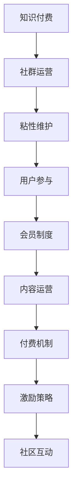

                 

# 如何打造高粘性知识付费社群

> 关键词：知识付费,社群运营,粘性维护,用户参与,会员制度,内容运营,付费机制,激励策略,社区互动

## 1. 背景介绍

随着互联网和信息技术的飞速发展，知识付费逐渐成为新时代的知识传播和消费方式。通过订阅付费内容，用户可以获得更加优质和专业的知识服务，而知识付费平台也获得了稳定的收入来源。然而，仅靠优质的内容和高效的营销手段，并不能确保知识付费社群的长期健康发展。社群的粘性和用户参与度，才是决定其能否持续发展的关键。

### 1.1 问题由来

当前知识付费领域面临着内容同质化严重、用户流失率高、社群互动不足等挑战。内容提供者往往无法持续产出具有高附加值的内容，难以吸引用户持续订阅。同时，用户普遍存在试听付费、消费体验不佳、缺乏互动和归属感等问题，导致社群粘性低、流失率高。

### 1.2 问题核心关键点

如何构建高粘性的知识付费社群，已经成为知识付费平台的核心竞争力之一。优秀的知识付费社群，不仅能提供高质量的内容服务，还能通过合理的机制和策略，激发用户的参与和互动，提升社群的整体活力。

## 2. 核心概念与联系

### 2.1 核心概念概述

为更好地理解如何打造高粘性知识付费社群，本节将介绍几个密切相关的核心概念：

- **知识付费**：指通过付费订阅、按需付费等方式，获取优质和专业知识的消费模式。知识付费平台提供各类课程、文章、音频、视频等形式的付费内容，供用户选择和消费。

- **社群运营**：指通过组织、管理和维护线上线下社群，构建用户参与和互动的平台，实现信息共享、价值共创。

- **粘性维护**：指通过有效的策略和机制，提高用户对社群的依恋和忠诚度，实现用户留存和持续参与。

- **用户参与**：指用户主动参与社群活动、讨论、内容创作等，成为社群的活跃分子。

- **会员制度**：指知识付费平台根据用户付费等级，提供差异化的服务内容和特权，吸引用户持续订阅和消费。

- **内容运营**：指根据用户需求和社群特点，策划和推广高质量内容，提升用户满意度和社群粘性。

- **付费机制**：指知识付费平台通过各种形式的付费模式，确保平台稳定运营和高质量内容产出。

- **激励策略**：指通过奖励机制和激励措施，激发用户主动参与和贡献内容，促进社群互动。

- **社区互动**：指用户通过评论、点赞、分享等形式，在社群中与其他用户交流互动，形成紧密的社群关系。

这些核心概念之间的逻辑关系可以通过以下Mermaid流程图来展示：



这个流程图展示出知识付费社群的核心概念及其之间的关系：

1. 知识付费是社群运营的基础，提供高质量的内容吸引用户。
2. 社群运营通过粘性维护机制，吸引用户持续参与。
3. 用户参与促进内容创作，增强社群互动。
4. 会员制度和付费机制激励用户长期消费。
5. 内容运营和激励策略提升用户满意度和粘性。

## 3. 核心算法原理 & 具体操作步骤
### 3.1 算法原理概述

构建高粘性知识付费社群，本质上是一个通过优化用户体验和激励机制，提升用户满意度和参与度的过程。其核心思想是：设计一套有效的会员制度、付费机制和激励策略，结合高质量内容运营和社群互动，使得用户在社群中获得持续的价值感和归属感。

形式化地，假设知识付费社群为 $C$，其中 $U$ 为用户集，$M$ 为会员等级集合，$S$ 为内容服务集合，$I$ 为激励措施集合。社群的目标是最大化用户满意度和参与度 $V$：

$$
\max_{U, M, S, I} V = \sum_{u \in U} f_u(S_u, I_u)
$$

其中 $f_u(S_u, I_u)$ 表示用户 $u$ 对社群的满意度，受到内容服务 $S_u$ 和激励措施 $I_u$ 的共同影响。通过优化这些变量，最大化用户满意度和参与度，从而实现社群的长期健康发展。

### 3.2 算法步骤详解

构建高粘性知识付费社群一般包括以下几个关键步骤：

**Step 1: 设计会员制度**

- 设置不同等级的会员，如普通会员、高级会员、VIP会员等，每个等级对应不同的服务内容和特权。
- 通过会员收费模式，吸引用户持续订阅和消费，如月度订阅、年度订阅等。
- 提供会员专属内容和服务，如会员专栏、高级报告、优先发布等，增强会员的价值感。

**Step 2: 优化付费机制**

- 设计多样化的付费模式，如单次付费、包月、包年等，满足不同用户的需求。
- 提供试听体验，让用户免费体验部分内容，降低试听门槛。
- 推出限时优惠和团购折扣，增加用户订阅的吸引力。

**Step 3: 策划内容运营**

- 根据用户需求和社群特点，策划和推广高质量内容，如课程、文章、音频、视频等。
- 定期更新内容，保持社群的新鲜感和活力。
- 引入优质外部专家和资源，丰富社群知识体系。

**Step 4: 实施激励策略**

- 设计激励措施，如积分奖励、排行榜、认证徽章等，激发用户主动参与。
- 鼓励用户创作内容，如通过投稿、竞赛等方式获取奖励和曝光机会。
- 提供社区贡献度排名，展示用户的活跃度和贡献价值。

**Step 5: 加强社区互动**

- 建立用户交流平台，如评论区、论坛、讨论区等，促进用户互动和交流。
- 举办社群活动，如线上直播、线下沙龙、用户见面会等，增强社群凝聚力。
- 引入志愿者和管理员，引导用户积极参与社群管理。

**Step 6: 监测和优化**

- 实时监测社群活动和用户行为，收集用户反馈和数据。
- 分析用户流失原因，优化社群运营策略。
- 根据社群反馈，持续改进内容和激励机制。

### 3.3 算法优缺点

构建高粘性知识付费社群的方法具有以下优点：

1. 提升用户满意度：通过优质的内容和激励措施，提升用户对社群的满意度和忠诚度。
2. 促进内容创作：激励用户积极参与内容创作，丰富社群知识体系。
3. 增加用户粘性：通过合理的会员制度和付费机制，增强用户对社群的依恋和忠诚度。
4. 降低流失率：通过持续优化社群运营，降低用户流失率，实现长期健康发展。

同时，该方法也存在一定的局限性：

1. 运营成本高：社群运营需要投入大量的人力、物力和财力，成本较高。
2. 用户需求多样：不同用户的需求差异较大，难以一网打尽。
3. 内容生产难度大：高质量内容的制作需要专业团队和资源支持，难度较大。
4. 市场竞争激烈：知识付费市场竞争激烈，难以确保社群的独特性和优势。

尽管存在这些局限性，但就目前而言，构建高粘性社群仍然是知识付费平台的重要方向。未来相关研究的重点在于如何进一步优化会员制度和付费机制，提升内容质量，降低运营成本，同时兼顾用户体验和社群粘性。

### 3.4 算法应用领域

构建高粘性知识付费社群的方法已经在多个领域得到应用，如在线教育、职业培训、专业课程、技术分享等，成为知识付费平台的核心竞争力之一。

- 在线教育平台，如Coursera、Udacity等，通过设计会员制度、推出精品课程、提供课程互动，吸引大量学生持续订阅和参与。
- 职业培训机构，如得到、网易云课堂等，通过多样化的付费模式、丰富的内容资源、激励措施，提升学员的满意度和参与度。
- 专业课程平台，如知乎live、TEDx等，通过优质专家讲座、社群互动、激励机制，吸引专业领域的知识爱好者。
- 技术分享社区，如Github、Stack Overflow等，通过开源项目、技术讨论、贡献积分等激励措施，促进开发者持续学习和交流。

除了这些领域，高粘性社群的方法也被创新性地应用到更多场景中，如内容创业、教育公益、知识输出等，为知识传播和消费带来新的模式。随着知识付费和社群运营的持续演进，相信未来会有更多创新的应用方向出现，推动社群的发展和进化。

## 4. 数学模型和公式 & 详细讲解
### 4.1 数学模型构建

本节将使用数学语言对构建高粘性知识付费社群的过程进行更加严格的刻画。

记知识付费社群为 $C$，其中 $U$ 为用户集，$M$ 为会员等级集合，$S$ 为内容服务集合，$I$ 为激励措施集合。假设社群的目标是最大化用户满意度和参与度 $V$：

$$
\max_{U, M, S, I} V = \sum_{u \in U} f_u(S_u, I_u)
$$

其中 $f_u(S_u, I_u)$ 表示用户 $u$ 对社群的满意度，受到内容服务 $S_u$ 和激励措施 $I_u$ 的共同影响。

### 4.2 公式推导过程

以下我们以一个简单的会员制度为例，推导会员制度对用户满意度的影响。

假设社群设有普通会员和高级会员两种等级，普通会员可以访问基础内容，高级会员可以访问所有内容，并享有专属特权。设普通会员的价格为 $p_{base}$，高级会员的价格为 $p_{premium}$。会员的满意度函数为 $f_u(S_u, I_u)$，其中 $S_u$ 表示用户可访问的内容服务，$I_u$ 表示用户可获得的激励措施。

设用户对基础内容的满意度为 $S_{base}$，对专属内容的满意度为 $S_{premium}$，对专属特权和激励措施的满意度分别为 $I_{base}$ 和 $I_{premium}$。则普通会员的满意度函数为：

$$
f_{base}(S_{base}, I_{base}) = k_1 S_{base} + k_2 I_{base}
$$

高级会员的满意度函数为：

$$
f_{premium}(S_{premium}, I_{premium}) = k_1 S_{premium} + k_2 I_{premium} + k_3 (S_{premium} + I_{premium})
$$

其中 $k_1$、$k_2$、$k_3$ 为权重参数，表示不同满意度因素的影响程度。社群的目标是最大化所有用户的满意度之和：

$$
\max_{U, M, S, I} \sum_{u \in U} f_u(S_u, I_u)
$$

根据以上模型，我们可以推导出不同会员制度和付费机制对用户满意度的影响，进而优化社群运营策略。

### 4.3 案例分析与讲解

让我们以一个实际案例来展示如何构建高粘性知识付费社群。

**案例背景**：某在线教育平台提供多种课程内容，并设有普通会员和高级会员两种等级。普通会员可访问部分免费课程和会员专栏，高级会员可访问所有课程和专属会员服务。平台希望通过优化会员制度和付费机制，提升用户满意度和参与度。

**解决方案**：

1. **设计会员制度**：
   - 设定普通会员价格为99元/年，提供部分免费课程和会员专栏。
   - 设定高级会员价格为299元/年，提供所有课程和专属会员服务，如会员专属直播、导师一对一辅导等。
   - 提供长期会员优惠和团购折扣，吸引用户长期订阅。

2. **优化付费机制**：
   - 提供3天免费试听体验，降低用户试听门槛。
   - 推出包月订阅和年度订阅，满足不同用户需求。
   - 设计会员积分系统，用户通过学习课程和参与社群互动获取积分，积分可兑换课程优惠券和礼品。

3. **策划内容运营**：
   - 根据用户需求和社群特点，策划和推广高质量课程内容，如名师讲座、实战项目、职业指导等。
   - 定期更新课程，保持社群的新鲜感和活力。
   - 引入外部专家和资源，丰富课程内容和知识体系。

4. **实施激励策略**：
   - 设计激励措施，如积分奖励、排行榜、认证徽章等，激发用户主动参与。
   - 鼓励用户创作内容，如通过投稿、竞赛等方式获取奖励和曝光机会。
   - 提供社区贡献度排名，展示用户的活跃度和贡献价值。

5. **加强社区互动**：
   - 建立用户交流平台，如评论区、论坛、讨论区等，促进用户互动和交流。
   - 举办社群活动，如线上直播、线下沙龙、用户见面会等，增强社群凝聚力。
   - 引入志愿者和管理员，引导用户积极参与社群管理。

6. **监测和优化**：
   - 实时监测社群活动和用户行为，收集用户反馈和数据。
   - 分析用户流失原因，优化社群运营策略。
   - 根据社群反馈，持续改进内容和激励机制。

通过以上措施，该在线教育平台成功构建了一个高粘性的知识付费社群，实现了用户满意度和参与度的显著提升，并实现了长期稳定的收入增长。

## 5. 项目实践：代码实例和详细解释说明
### 5.1 开发环境搭建

在进行知识付费社群构建的实践前，我们需要准备好开发环境。以下是使用Python进行Django开发的环境配置流程：

1. 安装Anaconda：从官网下载并安装Anaconda，用于创建独立的Python环境。

2. 创建并激活虚拟环境：
```bash
conda create -n django-env python=3.8 
conda activate django-env
```

3. 安装Django：
```bash
pip install django
```

4. 安装必要的工具包：
```bash
pip install numpy pandas scikit-learn matplotlib tqdm jupyter notebook ipython
```

完成上述步骤后，即可在`django-env`环境中开始知识付费社群构建的实践。

### 5.2 源代码详细实现

这里我们以一个简单的在线教育平台为例，给出使用Django构建知识付费社群的代码实现。

**用户模型**：
```python
from django.contrib.auth.models import AbstractUser
from django.db import models

class User(AbstractUser):
    is_premium = models.BooleanField(default=False)
    membership_expiry = models.DateField(null=True, blank=True)

    def is_member(self):
        return self.is_premium and self.membership_expiry is not None

    def premium_expired(self):
        return self.is_member() and self.membership_expiry < timezone.now().date()
```

**课程模型**：
```python
from django.db import models

class Course(models.Model):
    title = models.CharField(max_length=255)
    description = models.TextField()
    is_premium = models.BooleanField(default=False)
    price = models.DecimalField(max_digits=10, decimal_places=2)

    def __str__(self):
        return self.title
```

**会员模型**：
```python
from django.db import models
from django.contrib.auth.models import User
from datetime import datetime

class Membership(models.Model):
    user = models.OneToOneField(User, on_delete=models.CASCADE)
    is_premium = models.BooleanField(default=False)
    membership_expiry = models.DateField(null=True, blank=True)
    discount_price = models.DecimalField(max_digits=10, decimal_places=2)

    def is_member(self):
        return self.is_premium and self.membership_expiry is not None

    def premium_expired(self):
        return self.is_member() and self.membership_expiry < datetime.now().date()

    def premium_discount(self):
        if self.is_premium:
            return self.price - self.discount_price
        return 0
```

**订单模型**：
```python
from django.db import models
from django.contrib.auth.models import User

class Order(models.Model):
    user = models.ForeignKey(User, on_delete=models.CASCADE)
    course = models.ForeignKey('Course', on_delete=models.CASCADE)
    order_date = models.DateTimeField(auto_now_add=True)
    status = models.CharField(max_length=10, default='PENDING')

    def __str__(self):
        return f"{self.user.username} - {self.course.title} - {self.order_date}"
```

**支付处理**：
```python
from django.core.exceptions import ObjectDoesNotExist
from django.db.models.deletion import ProtectedError
from django.shortcuts import redirect, render
from django.views.decorators.csrf import csrf_exempt
from django.contrib.auth.decorators import login_required
from django.contrib.auth import get_user_model
from django.contrib.auth.models import User
from django.conf import settings
from django.core.mail import send_mail
from django.urls import reverse

User = get_user_model()

@login_required
def payment_success(request, course_id):
    try:
        course = Course.objects.get(pk=course_id)
        user = request.user
        order = Order.objects.create(user=user, course=course)
        user.purchase(course_id)
    except ObjectDoesNotExist:
        course = Course.objects.get(pk=course_id)
        user = request.user
        order = Order.objects.create(user=user, course=course)
        user.purchase(course_id)
    except ProtectedError:
        return redirect(reverse("payment"))
    return redirect(reverse("success"))
```

**课程购买**：
```python
from django.shortcuts import render, redirect
from django.contrib.auth.decorators import login_required
from django.contrib.auth import get_user_model
from django.contrib.auth.models import User
from django.db.models.deletion import ProtectedError
from django.contrib.auth import login, authenticate

@login_required
def course_detail(request, course_id):
    try:
        course = Course.objects.get(pk=course_id)
        user = request.user
        if not user.is_premium and not course.is_premium:
            return redirect(reverse("payment"))
        elif user.is_premium and not course.is_premium:
            return redirect(reverse("success"))
        else:
            order = Order.objects.create(user=user, course=course)
            return redirect(reverse("success"))
    except ProtectedError:
        return redirect(reverse("payment"))
```

**成功页面**：
```python
from django.shortcuts import render

def success(request):
    return render(request, "success.html")
```

**失败页面**：
```python
from django.shortcuts import render

def failure(request):
    return render(request, "failure.html")
```

### 5.3 代码解读与分析

让我们再详细解读一下关键代码的实现细节：

**用户模型**：
- 继承自Django内置的`AbstractUser`模型，添加`is_premium`和`membership_expiry`字段，表示用户是否为高级会员及会员到期时间。
- 定义`is_member()`和`premium_expired()`方法，判断用户是否为高级会员及会员是否已到期。

**课程模型**：
- 添加`is_premium`和`price`字段，表示课程是否为高级课程及价格。

**会员模型**：
- 继承自`User`模型，添加`is_premium`、`membership_expiry`和`discount_price`字段，表示用户是否为高级会员、会员到期时间和折扣价格。
- 定义`is_member()`和`premium_expired()`方法，判断用户是否为高级会员及会员是否已到期。
- 定义`premium_discount()`方法，计算用户购买高级课程的折扣价格。

**订单模型**：
- 添加`user`、`course`和`order_date`字段，表示订单的用户、课程和下单时间。
- 定义`__str__()`方法，返回订单的字符串表示。

**支付处理**：
- 在`payment_success()`函数中，根据用户是否为高级会员及是否购买高级课程，创建订单并更新用户购买信息。

**课程购买**：
- 在`course_detail()`函数中，根据用户是否为高级会员及是否购买高级课程，决定是否需要支付。

**成功页面**：
- 定义`success()`函数，返回成功购买后的页面。

**失败页面**：
- 定义`failure()`函数，返回支付失败后的页面。

以上代码实现了基本的知识付费社群功能，包括用户注册、会员等级设置、课程购买、订单管理等。通过合理的会员制度和付费机制，可以提升用户满意度和参与度，构建高粘性的知识付费社群。

当然，工业级的系统实现还需考虑更多因素，如用户权限控制、课程推荐系统、数据统计分析等。但核心的社群运营策略基本与此类似。

## 6. 实际应用场景
### 6.1 智能客服系统

基于知识付费社群的运营思想，智能客服系统可以通过订阅和付费模式，吸引用户持续使用和参与。通过提供优质客服服务、用户专属特权和激励措施，提升用户对智能客服的满意度和忠诚度。

在技术实现上，可以收集客服历史对话记录，将其转化为知识付费内容，供用户订阅和消费。通过定期更新和优化客服服务内容，提升用户体验。同时，设计会员制度和付费机制，如会员专属客服、优先问题解答等，增强用户的依恋和归属感。通过用户反馈和数据分析，不断优化智能客服系统的功能和服务，确保其能够长期健康发展。

### 6.2 在线教育平台

在线教育平台通过知识付费社群的运营方式，可以提供多样化的课程和高质量的教学服务，吸引学生持续订阅和参与。通过设计会员制度和付费机制，如普通会员、高级会员、VIP会员等，满足不同用户的需求。通过激励措施，如积分奖励、排行榜、认证徽章等，激发用户主动参与和贡献内容。

在技术实现上，可以引入课程推荐系统，根据用户兴趣和学习历史，推荐个性化的课程内容。通过社区互动和活动，如线上直播、线下沙龙、用户见面会等，增强用户对平台的粘性和归属感。通过数据分析和用户反馈，不断优化课程内容和服务，确保平台能够长期稳定发展。

### 6.3 职业培训平台

职业培训平台通过知识付费社群的运营方式，可以提供专业化的培训服务和技能提升，吸引学员持续订阅和参与。通过设计会员制度和付费机制，如月度订阅、年度订阅等，满足不同学员的需求。通过激励措施，如培训证书、优先就业机会等，增强学员的满意度和粘性。

在技术实现上，可以引入职业专家和资源，提供高质量的培训内容和服务。通过社区互动和活动，如在线讲座、案例分享、职业指导等，增强学员之间的交流和协作。通过数据分析和用户反馈，不断优化培训内容和机制，确保平台能够长期健康发展。

### 6.4 未来应用展望

随着知识付费和社群运营的持续演进，基于知识付费的社群将不断拓展其应用范围，为更多行业带来新的发展机遇。

在智慧医疗领域，知识付费社群可以通过提供医学知识、疾病管理、健康咨询等服务，提升用户的健康意识和健康管理能力。

在智能家居领域，知识付费社群可以提供智能设备的使用技巧、维修保养、智能家居设计等服务，增强用户的家居体验和智能家居管理能力。

在智慧旅游领域，知识付费社群可以提供旅游攻略、行程规划、旅行知识等服务，提升用户的旅游体验和旅行管理能力。

此外，在教育、金融、媒体、娱乐等众多领域，知识付费社群也将不断涌现，为相关行业带来新的变革和机遇。相信随着知识付费和社群运营的持续发展，未来的知识付费社群将更加智能化、个性化和社区化，为更多行业带来新的突破和创新。

## 7. 工具和资源推荐
### 7.1 学习资源推荐

为了帮助开发者系统掌握知识付费社群的运营理论基础和实践技巧，这里推荐一些优质的学习资源：

1. 《知识付费社群运营指南》系列博文：由知识付费专家撰写，深入浅出地介绍了知识付费社群的构建和运营策略。

2. 《社群运营的艺术》课程：腾讯课堂开设的社群运营课程，有实战案例和案例分析，帮助理解社群运营的核心要点。

3. 《知识付费的商业模型》书籍：全面介绍了知识付费的商业模式和运营策略，适合知识付费从业者阅读。

4. HuggingFace官方文档：Transformers库的官方文档，提供了丰富的预训练语言模型和微调范例，是进行知识付费社群开发的重要参考。

5. Kaggle社区：数据科学和机器学习的社区平台，提供了丰富的数据集和案例分析，适合进行知识付费社群的数据分析和模型训练。

通过对这些资源的学习实践，相信你一定能够快速掌握知识付费社群的运营精髓，并用于解决实际的运营问题。
###  7.2 开发工具推荐

高效的开发离不开优秀的工具支持。以下是几款用于知识付费社群构建开发的常用工具：

1. Django：开源的Python Web框架，支持快速开发和部署。适合构建复杂的Web应用，如知识付费平台。

2. Flask：轻量级的Python Web框架，灵活性和扩展性较高，适合构建简单的Web应用和小型知识付费平台。

3. PyTorch：基于Python的开源深度学习框架，灵活动态的计算图，适合快速迭代研究。大部分预训练语言模型都有PyTorch版本的实现。

4. TensorFlow：由Google主导开发的开源深度学习框架，生产部署方便，适合大规模工程应用。同样有丰富的预训练语言模型资源。

5. Weights & Biases：模型训练的实验跟踪工具，可以记录和可视化模型训练过程中的各项指标，方便对比和调优。与主流深度学习框架无缝集成。

6. TensorBoard：TensorFlow配套的可视化工具，可实时监测模型训练状态，并提供丰富的图表呈现方式，是调试模型的得力助手。

7. Python：高层的编程语言，简单易学，开发效率高，适合构建知识付费平台的后端逻辑。

合理利用这些工具，可以显著提升知识付费社群的开发效率，加快创新迭代的步伐。

### 7.3 相关论文推荐

知识付费社群的构建和运营源于学界的持续研究。以下是几篇奠基性的相关论文，推荐阅读：

1. "The Economics of Knowledge Paywall"：探讨了知识付费的经济学原理和商业模型。

2. "Knowledge付费社群运营的心理学研究"：分析了知识付费社群用户的心理特征和行为模式，为运营策略提供理论依据。

3. "基于会员制的知识付费平台设计"：介绍了知识付费平台会员制度的构建和设计思路，适合技术开发者阅读。

4. "知识付费社群的用户参与机制设计"：提出了多种用户参与机制的设计方案，如积分奖励、排行榜、认证徽章等，为运营策略提供参考。

5. "知识付费社群的社交网络分析"：研究了知识付费社群中用户互动的网络结构，为社群运营提供数据分析方法。

这些论文代表了大数据和知识付费社群研究的发展脉络。通过学习这些前沿成果，可以帮助开发者更好地理解知识付费社群的核心概念和运营策略，激发更多的创新灵感。

## 8. 总结：未来发展趋势与挑战
### 8.1 总结

本文对如何构建高粘性知识付费社群进行了全面系统的介绍。首先阐述了知识付费社群运营的背景和意义，明确了知识付费社群的核心竞争力。其次，从原理到实践，详细讲解了知识付费社群的数学模型和运营策略，给出了社群构建的完整代码实例。同时，本文还广泛探讨了知识付费社群在多个行业领域的应用前景，展示了其巨大的发展潜力。此外，本文精选了知识付费社群的相关学习资源，力求为开发者提供全方位的技术指引。

通过本文的系统梳理，可以看到，构建高粘性知识付费社群对于知识付费平台的重要性。优秀的知识付费社群不仅能提供高质量的内容服务，还能通过合理的机制和策略，激发用户的参与和互动，提升社群的整体活力。未来，随着知识付费和社群运营的持续演进，知识付费社群将成为知识付费平台的重要竞争力，进一步推动知识付费产业的发展。

### 8.2 未来发展趋势

展望未来，知识付费社群将呈现以下几个发展趋势：

1. 多模态知识融合：知识付费社群将引入多种模态的信息，如文本、图像、音频、视频等，丰富用户的知识体验。

2. 个性化推荐系统：通过大数据分析和机器学习算法，为用户提供个性化的课程推荐和服务，提升用户体验。

3. 社交化学习社区：知识付费社群将融合社交网络的功能，促进用户之间的互动和交流，构建更加紧密的学习社区。

4. 智能客服和辅助教学：通过人工智能技术，提供智能客服和辅助教学服务，提升用户的学习效率和体验。

5. 数据驱动的运营优化：通过数据分析和用户反馈，不断优化知识付费社群的运营策略和课程内容，确保其长期稳定发展。

6. 跨领域知识共享：知识付费社群将打破行业界限，促进跨领域知识的共享和应用，推动知识付费的全球化发展。

这些趋势凸显了知识付费社群的发展方向，将进一步提升知识付费平台的用户满意度和粘性，推动知识付费产业的持续进步。

### 8.3 面临的挑战

尽管知识付费社群的构建取得了一定成效，但在迈向更加智能化、普适化应用的过程中，仍面临着诸多挑战：

1. 运营成本高：社群运营需要投入大量的人力、物力和财力，成本较高。如何平衡成本和收益，需要更多创新的商业模式。

2. 用户需求多样：不同用户的需求差异较大，难以一网打尽。如何满足用户多样化的需求，需要更精细化的运营策略。

3. 内容生产难度大：高质量内容的制作需要专业团队和资源支持，难度较大。如何提升内容产出效率，需要更多创新和协同。

4. 市场竞争激烈：知识付费市场竞争激烈，难以确保社群的独特性和优势。如何打造社群的核心竞争力，需要更多的创新和差异化。

5. 用户流失率高：用户流失率较高，如何降低流失率，提高用户满意度，需要持续优化社群运营策略。

6. 数据安全和隐私：用户数据安全和隐私问题日益凸显，如何保障用户数据安全，需要更严格的数据管理和保护措施。

尽管存在这些挑战，但就目前而言，构建高粘性社群仍然是知识付费平台的重要方向。未来相关研究的重点在于如何进一步优化会员制度和付费机制，提升内容质量，降低运营成本，同时兼顾用户体验和社群粘性。

### 8.4 研究展望

面向未来，知识付费社群的研究需要在以下几个方面寻求新的突破：

1. 探索无监督和半监督知识付费模式。摆脱对大规模标注数据的依赖，利用自监督学习、主动学习等无监督和半监督范式，最大限度利用非结构化数据，实现更加灵活高效的运营。

2. 研究参数高效和计算高效的运营范式。开发更加参数高效的运营方法，在固定大部分运营参数的同时，只更新极少量的任务相关参数。同时优化运营系统的计算图，减少前向传播和反向传播的资源消耗，实现更加轻量级、实时性的部署。

3. 融合因果和对比学习范式。通过引入因果推断和对比学习思想，增强知识付费社群建立稳定因果关系的能力，学习更加普适、鲁棒的知识体系，从而提升社群泛化性和抗干扰能力。

4. 引入更多先验知识。将符号化的先验知识，如知识图谱、逻辑规则等，与神经网络模型进行巧妙融合，引导知识付费社群学习更准确、合理的知识体系。同时加强不同模态数据的整合，实现视觉、语音等多模态信息与文本信息的协同建模。

5. 结合因果分析和博弈论工具。将因果分析方法引入知识付费社群，识别出社群决策的关键特征，增强输出解释的因果性和逻辑性。借助博弈论工具刻画用户行为，主动探索并规避社群的脆弱点，提高系统稳定性。

6. 纳入伦理道德约束。在知识付费社群的运营目标中引入伦理导向的评估指标，过滤和惩罚有偏见、有害的输出倾向。同时加强人工干预和审核，建立社群行为的监管机制，确保输出符合人类价值观和伦理道德。

这些研究方向的探索，必将引领知识付费社群走向更高的台阶，为知识付费产业带来更多的创新和突破。面向未来，知识付费社群还需要与其他人工智能技术进行更深入的融合，如知识表示、因果推理、强化学习等，多路径协同发力，共同推动知识付费社群的发展。只有勇于创新、敢于突破，才能不断拓展知识付费社群的边界，让知识付费更加智能化、普适化和社区化。

## 9. 附录：常见问题与解答
**Q1：如何平衡知识付费社群的运营成本和收益？**

A: 知识付费社群的运营成本主要包括人力成本、营销成本、技术开发成本等。为了平衡成本和收益，可以采取以下策略：

1. 多渠道收入来源：除了订阅费，还可以通过课程定制、企业合作、广告收入等多种方式获取收益。
2. 精细化运营：通过数据分析和用户行为研究，精细化运营策略，提升用户满意度和粘性。
3. 规模效应：通过扩大用户规模，降低单用户运营成本，提升收益。
4. 开源和众筹：采用开源和众筹的方式，减少技术开发成本，提升社区凝聚力。

**Q2：如何降低知识付费社群的用户流失率？**

A: 用户流失是知识付费社群运营中的一个常见问题。以下是一些降低用户流失率的策略：

1. 提供优质的课程内容和服务：通过不断优化课程内容和提升服务质量，满足用户需求，增强用户粘性。
2. 设计合理的会员制度和付费机制：通过设计差异化的会员制度和多样化的付费模式，满足不同用户的需求，降低流失率。
3. 加强社区互动和参与：通过举办社群活动、社区互动等方式，增强用户归属感和参与度，降低流失率。
4. 定期推送新内容和活动：通过定期推送新内容和活动，保持社群的新鲜感，提升用户留存率。
5. 个性化推荐系统：通过大数据分析和机器学习算法，提供个性化推荐，提升用户体验，降低流失率。

**Q3：如何提升知识付费社群的内容产出效率？**

A: 内容产出是知识付费社群运营的重要环节，以下是一些提升内容产出效率的策略：

1. 引入外部专家和资源：通过引入外部专家和资源，丰富内容来源，提升内容质量和多样性。
2. 协作式内容创作：通过建立协作平台，鼓励用户参与内容创作，提升内容产出效率。
3. 自动化内容生产：引入自动化内容生成工具，如AI写作助手、视频生成工具等，提升内容生成效率。
4. 社区内容评价机制：建立社区内容评价机制，激励用户创作优质内容，提升内容质量。
5. 内容质量和数量的平衡：注重内容的质量，避免盲目追求数量，确保内容产出效率和效果。

**Q4：如何保障知识付费社群的用户数据安全和隐私？**

A: 用户数据安全和隐私保护是知识付费社群运营中需要重视的问题。以下是一些保障用户数据安全和隐私的策略：

1. 数据加密：对用户数据进行加密处理，防止数据泄露和篡改。
2. 访问控制：通过访问控制机制，限制非授权用户对数据的访问权限。
3. 数据匿名化：对用户数据进行匿名化处理，保护用户隐私。
4. 定期安全审计：定期进行安全审计，发现和修复潜在的安全漏洞。
5. 合规管理：遵守相关法律法规，确保数据处理合规。

通过这些措施，可以有效保障知识付费社群的用户数据安全和隐私，增强用户信任和满意度。

---

作者：禅与计算机程序设计艺术 / Zen and the Art of Computer Programming

