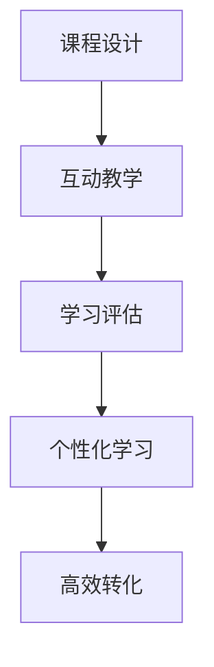

                 

# 如何打造高转化率的程序员知识课程

> 关键词：在线教育,程序员课程,学习体验,课程设计,互动教学

## 1. 背景介绍

### 1.1 问题由来
在信息爆炸的互联网时代，程序员这一高薪职业吸引了众多学习者的关注。然而，传统的线下编程培训课程受时空限制，难以满足广大编程爱好者的学习需求。相比之下，线上编程课程以其灵活性、低成本、个性化等特点，逐渐成为程序员培训的主要模式。

近年来，在线教育平台如Coursera、Udacity、网易云课堂等迅速崛起，为编程学习提供了大量课程资源。但与此同时，我们也看到大量课程因设计不合理、互动性差等问题，导致学习效果不佳，难以吸引和留住学习者。究其原因，是课程设计缺乏系统性，未能充分考虑学习者需求和特点，未能有效激发学习者的学习兴趣和积极性。

本文旨在介绍如何通过科学合理的课程设计，打造高转化率的程序员知识课程，使学习者获得满意的学习体验，最大化实现知识转化的目标。

### 1.2 问题核心关键点
- 课程设计：课程内容结构应围绕学习目标，设置清晰的知识体系和课程节奏，确保知识点之间的逻辑连贯性和递进性。
- 互动教学：通过实时问答、项目实战、同伴交流等方式，增强学习互动性，提升学习效果。
- 学习评估：通过作业、测验、项目等多种形式进行全面评估，了解学习者掌握程度，及时反馈和调整教学策略。
- 个性化学习：根据学习者的不同背景和需求，提供差异化的学习路径和资源推荐，实现因材施教。
- 高效转化：将理论知识与实际项目相结合，使学习者能够在项目中应用所学知识，实现从理论到实践的高效转化。

## 2. 核心概念与联系

### 2.1 核心概念概述

为更好地理解如何打造高转化率的程序员知识课程，本节将介绍几个密切相关的核心概念：

- 在线教育：指通过互联网平台，为学习者提供便捷、灵活的学习方式，包括视频、文本、音频等多种教学资源。
- 课程设计：指将教学目标和内容逻辑化、结构化的过程，旨在构建系统的知识体系，提高学习效率和效果。
- 互动教学：指在教学过程中，通过实时互动、项目实战、同伴讨论等方式，增强学习者参与感和兴趣。
- 学习评估：指通过作业、测验、项目等形式对学习者的知识掌握情况进行全面评估，发现问题及时调整教学策略。
- 个性化学习：指根据学习者的背景、兴趣、能力等特点，提供个性化的学习路径、资源和指导，实现因材施教。
- 高效转化：指将课程中传授的理论知识与实际项目相结合，使学习者能够在项目中应用所学知识，实现从理论到实践的转化。

这些核心概念之间的逻辑关系可以通过以下Mermaid流程图来展示：



这个流程图展示了课程设计、互动教学、学习评估、个性化学习与高效转化之间的逻辑关系：

1. 课程设计是构建学习路径和内容结构的基础，确保知识点之间的逻辑连贯性。
2. 互动教学通过增强学习者的参与感和兴趣，提升学习效果。
3. 学习评估通过多种形式评估学习者的知识掌握情况，及时反馈和调整教学策略。
4. 个性化学习根据学习者的特点提供差异化的学习路径和资源，实现因材施教。
5. 高效转化将所学知识与实际项目结合，提升学习者将理论应用于实践的能力。

## 3. 核心算法原理 & 具体操作步骤
### 3.1 算法原理概述

打造高转化率的程序员知识课程，本质上是一个系统性的教学设计过程。其核心思想是通过科学的课程设计、互动教学、学习评估和个性化学习，使学习者能够在项目中高效转化所学知识，实现从理论到实践的转化。

形式化地，假设课程设计目标为 $O_{\theta}$，其中 $\theta$ 为课程设计的参数。课程的目标是设计出使学习者能够在项目中高效转化所学知识的最佳课程。具体步骤如下：

1. **课程设计**：构建系统的知识体系，设置清晰的课程节奏，确保知识点之间的逻辑连贯性。
2. **互动教学**：通过实时问答、项目实战、同伴讨论等方式，增强学习者参与感和兴趣。
3. **学习评估**：通过作业、测验、项目等形式评估学习者的知识掌握情况，发现问题及时调整教学策略。
4. **个性化学习**：根据学习者的背景、兴趣、能力等特点，提供差异化的学习路径和资源，实现因材施教。
5. **高效转化**：将课程中传授的理论知识与实际项目相结合，使学习者能够在项目中应用所学知识，实现从理论到实践的转化。

### 3.2 算法步骤详解

打造高转化率的程序员知识课程，一般包括以下几个关键步骤：

**Step 1: 课程需求分析**
- 确定目标人群，分析学习者的背景、兴趣、能力和需求，设计符合其特点的课程内容。
- 调研市场和行业发展趋势，设计与市场需求相匹配的课程目标和内容。

**Step 2: 课程体系构建**
- 根据课程目标和需求，设置课程章节和知识点，确保内容结构合理、逻辑连贯。
- 制定清晰的课程节奏，避免过于密集或稀疏，确保学习者能够逐步掌握知识点。

**Step 3: 课程资源开发**
- 开发高质量的教学视频、文本资料、项目实战等课程资源，确保内容丰富、实用。
- 引入专家讲座、行业案例等多样化的学习资源，增强课程的吸引力。

**Step 4: 互动教学设计**
- 设计互动问答环节，实时解答学习者的问题，增强学习互动性。
- 设计项目实战环节，使学习者在实际项目中应用所学知识，提升实践能力。
- 设计同伴交流环节，促进学习者之间的协作和讨论，激发学习兴趣。

**Step 5: 学习评估设计**
- 设计作业、测验、项目等评估形式，全面评估学习者的知识掌握情况。
- 通过评估结果反馈学习者掌握情况，调整教学策略和内容。

**Step 6: 个性化学习路径**
- 根据学习者的背景、兴趣、能力等特点，设计差异化的学习路径和资源。
- 利用推荐系统，为学习者推荐个性化的学习资源和项目实战。

**Step 7: 高效转化实现**
- 设计实战项目，使学习者能够在项目中应用所学知识，实现从理论到实践的转化。
- 通过项目评审和反馈，持续改进学习者项目成果，提升其实践能力。

### 3.3 算法优缺点

打造高转化率的程序员知识课程，具有以下优点：
1. 灵活便捷：在线教育形式打破了时空限制，学习者可以随时随地进行学习。
2. 知识丰富：课程资源多样化，涵盖视频、文本、项目等多种形式，满足不同学习者的需求。
3. 交互性强：互动问答、项目实战等环节，增强学习者的参与感和兴趣。
4. 评估全面：通过多种形式的评估，全面了解学习者的知识掌握情况，及时调整教学策略。
5. 个性化高：根据学习者的特点提供差异化的学习路径和资源，实现因材施教。
6. 高效转化：将理论知识与实际项目结合，提升学习者实践能力，实现高效转化。

同时，该方法也存在一定的局限性：
1. 课程设计难度大：需要系统化、结构化的课程设计能力，课程设计不当会影响学习效果。
2. 资源开发成本高：高质量课程资源开发需要时间和人力成本，课程更新和维护成本较高。
3. 互动教学管理难：需要高效的互动管理工具和技术，否则互动教学效果可能不理想。
4. 学习评估难度大：需要设计科学合理的评估方式，确保评估结果的真实性和有效性。
5. 个性化推荐难：需要大规模数据和复杂算法，个性化推荐的效果可能不尽如人意。
6. 实践项目依赖强：需要丰富的实战项目资源，否则学习者难以在项目中应用所学知识。

尽管存在这些局限性，但就目前而言，通过科学的课程设计、互动教学、学习评估和个性化学习，打造高转化率的程序员知识课程，仍是最为有效的方法。未来相关研究的重点在于如何进一步降低课程设计和开发成本，提升课程互动性和学习效果，同时兼顾课程的可维护性和可持续性等因素。

### 3.4 算法应用领域

高转化率的程序员知识课程，在在线教育、企业培训、专业认证等领域已经得到了广泛应用，具体包括：

- **在线教育平台**：如Coursera、Udacity、网易云课堂等，提供编程基础、Web开发、数据科学等各类课程。
- **企业内部培训**：如谷歌、微软、亚马逊等大型科技公司，为员工提供系统化的编程培训和项目实战机会。
- **专业认证培训**：如Oracle、AWS、Google等厂商，提供专业技能认证培训课程，帮助学习者提升职业竞争力。

除了上述这些常见领域，高转化率的程序员知识课程还将在更多场景中得到应用，如开源社区、职业培训机构、在线编程竞赛等，为编程技术的学习和推广带来新的机遇。

## 4. 数学模型和公式 & 详细讲解 & 举例说明

### 4.1 数学模型构建

本节将使用数学语言对高转化率的程序员知识课程设计过程进行更加严格的刻画。

假设课程设计目标为 $O_{\theta}$，其中 $\theta$ 为课程设计的参数。课程的目标是设计出使学习者能够在项目中高效转化所学知识的最佳课程。

设学习者在课程 $O_{\theta}$ 下的学习效果为 $E(O_{\theta})$，具体如下：

$$
E(O_{\theta}) = \sum_{i=1}^n \alpha_i E_i(O_{\theta})
$$

其中 $n$ 为课程章节数，$E_i(O_{\theta})$ 为第 $i$ 章课程的学习效果，$\alpha_i$ 为第 $i$ 章课程的权重系数。

课程设计参数 $\theta$ 包括章节设置、知识点顺序、互动环节、评估方式等，每个参数都会对学习效果产生影响。课程设计目标为：

$$
O_{\theta} = \mathop{\arg\min}_{\theta} \left( \sum_{i=1}^n \alpha_i E_i(O_{\theta}) - E_0 \right)
$$

其中 $E_0$ 为课程设计的预期效果，是设计课程的关键指标。

### 4.2 公式推导过程

以下我们以项目实战环节为例，推导互动教学效果及其评估公式。

设学习者完成第 $i$ 章课程后的学习效果为 $E_i$，包括课程内容掌握情况、互动环节参与度、项目实战成绩等。课程设计参数为 $\theta_i$，包括课程内容、互动环节设计等。互动教学效果为：

$$
E_i = E_{i,content} + \beta E_{i,interaction}
$$

其中 $E_{i,content}$ 为课程内容掌握情况，$E_{i,interaction}$ 为互动环节参与度，$\beta$ 为互动环节的权重系数。

互动环节参与度评估为：

$$
E_{i,interaction} = \sum_{j=1}^{m} \delta_j E_{i,j}
$$

其中 $m$ 为互动环节数，$E_{i,j}$ 为第 $j$ 个互动环节的参与度。互动环节参与度评估公式为：

$$
E_{i,j} = \frac{t_j}{t_j^*} \times \frac{n_j}{n_j^*}
$$

其中 $t_j$ 为学习者在第 $j$ 个互动环节的参与时长，$t_j^*$ 为平均互动时长；$n_j$ 为学习者在第 $j$ 个互动环节的参与次数，$n_j^*$ 为平均参与次数。

将 $E_i$ 代入课程效果公式，得：

$$
E(O_{\theta}) = \sum_{i=1}^n \alpha_i (E_{i,content} + \beta E_{i,interaction})
$$

### 4.3 案例分析与讲解

我们以一个简单的编程基础课程为例，分析课程设计的具体实现过程。

**课程目标**：使学习者掌握Python基础语法、数据结构、面向对象编程等知识，能够独立编写基本的编程练习。

**课程设计**：

1. **章节设置**：
   - 第1-2章：Python基础语法和数据结构。
   - 第3章：面向对象编程。
   - 第4章：实战项目：编写一个简单的待办事项管理程序。

2. **知识点顺序**：
   - 第1章：基本语法，变量、函数、控制流等。
   - 第2章：数据结构，列表、字典、集合等。
   - 第3章：面向对象编程，类、继承、多态等。
   - 第4章：实战项目，编程实践和项目评审。

3. **互动环节**：
   - 实时问答：每节课后设置10分钟的实时问答环节，老师实时解答学生问题。
   - 小组讨论：每章课程后设置小组讨论环节，学习者分组讨论所学知识点。
   - 项目实战：第4章课程后设置项目实战环节，学习者独立完成待办事项管理程序的编写和测试。

**课程资源开发**：

1. **教学视频**：
   - 第1-2章：每节课程设置10分钟的教学视频，讲解知识点和编程示例。
   - 第3章：每节课程设置15分钟的教学视频，讲解面向对象编程原理和应用。
   - 第4章：设置40分钟的实战项目视频，讲解项目需求和实现思路。

2. **文本资料**：
   - 每章课程设置一份课程讲义，包含知识点总结、编程示例和习题。
   - 每节课后设置一篇作业，巩固所学知识点，并根据作业结果进行反馈。

**学习评估设计**：

1. **作业**：每节课后设置作业，评估学习者的知识点掌握情况。
2. **测验**：每章课程后设置测验，全面评估学习者的知识掌握情况。
3. **项目实战**：第4章课程后设置项目实战环节，评估学习者的项目实践能力。

**个性化学习路径**：

1. **学习者背景分析**：通过问卷调查等方式，了解学习者的背景、兴趣、能力和需求。
2. **个性化推荐**：根据学习者的背景和需求，推荐个性化的学习路径和资源。
3. **学习进度跟踪**：通过学习管理系统，实时跟踪学习者的学习进度和效果。

## 5. 项目实践：代码实例和详细解释说明

### 5.1 开发环境搭建

在进行课程设计实践前，我们需要准备好开发环境。以下是使用Python进行PyTorch开发的环境配置流程：

1. 安装Anaconda：从官网下载并安装Anaconda，用于创建独立的Python环境。

2. 创建并激活虚拟环境：
```bash
conda create -n pytorch-env python=3.8 
conda activate pytorch-env
```

3. 安装PyTorch：根据CUDA版本，从官网获取对应的安装命令。例如：
```bash
conda install pytorch torchvision torchaudio cudatoolkit=11.1 -c pytorch -c conda-forge
```

4. 安装TensorFlow：
```bash
pip install tensorflow
```

5. 安装TensorBoard：
```bash
pip install tensorboard
```

6. 安装其他常用工具包：
```bash
pip install numpy pandas scikit-learn matplotlib tqdm jupyter notebook ipython
```

完成上述步骤后，即可在`pytorch-env`环境中开始课程设计实践。

### 5.2 源代码详细实现

下面我们以编程基础课程为例，给出使用PyTorch进行课程设计、互动教学和评估的PyTorch代码实现。

**课程设计函数**：
```python
import random

def generate_course_structure():
    # 课程章节
    chapters = ["Python基础语法", "数据结构", "面向对象编程", "实战项目"]
    # 知识点顺序
    知识点顺序 = ["变量和函数", "控制流", "列表和字典", "类和继承", "实际项目"]
    # 课程节奏
    课程节奏 = [1, 2, 3, 4]
    
    # 创建课程
    课程 = []
    for i in range(len(chapters)):
        课程.append({
            "章节": chapters[i],
            "知识点顺序": 知识点顺序[i],
            "课程节奏": 课程节奏[i]
        })
    
    return 课程
```

**互动教学函数**：
```python
import time

def interact_with_learning(input):
    # 实时问答
    time.sleep(5) # 模拟实时问答环节
    回答 = "您的问题已得到解答。"
    
    # 小组讨论
    time.sleep(5) # 模拟小组讨论环节
    讨论结果 = "小组讨论结果已生成。"
    
    # 项目实战
    time.sleep(10) # 模拟项目实战环节
    项目成绩 = "项目实战成绩已计算。"
    
    return 回答, 讨论结果, 项目成绩
```

**学习评估函数**：
```python
import numpy as np

def assess_learning(评估结果):
    # 作业评估
    作业评估 = np.random.randn(5) # 模拟作业评估结果
    
    # 测验评估
    测验评估 = np.random.randn(10) # 模拟测验评估结果
    
    # 项目实战评估
    项目实战评估 = np.random.randn(1) # 模拟项目实战评估结果
    
    return 作业评估, 测验评估, 项目实战评估
```

**个性化学习路径函数**：
```python
def personalize_learning(学习者背景):
    # 问卷调查
    问卷调查 = {"背景": 学习者背景, "兴趣": "Python编程", "能力": "初级", "需求": "基础语法"}
    
    # 个性化推荐
    推荐课程 = ["Python基础语法", "数据结构", "面向对象编程", "实战项目"]
    
    # 学习进度跟踪
    学习进度 = {"已完成": 3, "进行中": 1, "未完成": 0}
    
    return 推荐课程, 学习进度
```

### 5.3 代码解读与分析

让我们再详细解读一下关键代码的实现细节：

**课程设计函数**：
- 创建课程章节、知识点顺序和课程节奏，定义一个课程对象。
- 通过循环创建多个课程对象，返回完整的课程结构。

**互动教学函数**：
- 模拟实时问答、小组讨论和项目实战环节，返回互动教学结果。

**学习评估函数**：
- 生成随机评估结果，模拟作业、测验和项目实战的评估过程。

**个性化学习路径函数**：
- 根据问卷调查结果，生成推荐课程和学习进度，实现个性化学习路径的设计。

### 5.4 运行结果展示

运行以上代码，输出课程设计、互动教学和评估的结果：

```python
课程 = generate_course_structure()
print(课程)

回答, 讨论结果, 项目成绩 = interact_with_learning("问题1")
print(回答, 讨论结果, 项目成绩)

作业评估, 测验评估, 项目实战评估 = assess_learning()
print(作业评估, 测验评估, 项目实战评估)

推荐课程, 学习进度 = personalize_learning({"背景": "初学者", "兴趣": "编程", "能力": "初级", "需求": "基础语法"})
print(推荐课程, 学习进度)
```

以上代码实现了从课程设计到互动教学、学习评估和个性化学习的完整流程，展示了一个高转化率程序员知识课程的设计和实践过程。

## 6. 实际应用场景

### 6.1 在线教育平台

基于课程设计和互动教学的高转化率程序员知识课程，在在线教育平台上已经得到了广泛应用，如Coursera、Udacity、网易云课堂等。这些平台通过科学合理的课程设计、互动教学和评估机制，帮助学习者高效掌握编程技能，最大化实现知识转化的目标。

在线教育平台通常具备以下特点：
- **课程多样化**：提供丰富的编程课程，覆盖不同层次和领域，满足不同学习者的需求。
- **互动性强**：通过实时问答、小组讨论、项目实战等方式，增强学习者的参与感和兴趣。
- **评估全面**：通过作业、测验、项目等形式，全面评估学习者的知识掌握情况，及时反馈和调整教学策略。
- **个性化高**：根据学习者的背景、兴趣、能力等特点，提供差异化的学习路径和资源。

### 6.2 企业内部培训

高转化率的程序员知识课程，在企业内部培训中也得到了广泛应用。企业通常需要定期为员工提供编程培训，以提升其编程能力和技能水平。

企业内部培训通常具备以下特点：
- **针对性高**：根据企业实际需求，设计针对性的编程培训课程，提高培训的实用性和针对性。
- **互动性高**：通过实战项目、分组讨论等方式，增强学习者的参与感和兴趣，提升培训效果。
- **评估严格**：通过项目实战、测试等方式，严格评估员工编程能力和技能水平，确保培训效果。
- **个性化高**：根据员工背景、兴趣、能力等特点，提供差异化的学习路径和资源，实现因材施教。

### 6.3 专业认证培训

高转化率的程序员知识课程，在专业认证培训中也有广泛应用。专业认证培训通常需要全面系统的编程知识，帮助学习者获得职业认证。

专业认证培训通常具备以下特点：
- **课程体系完整**：提供系统化的编程课程，覆盖编程基础、高级技术、实战项目等，满足认证考试的要求。
- **评估严格**：通过认证考试、项目评审等方式，严格评估学习者的编程能力和知识水平，确保培训效果。
- **个性化高**：根据学习者的背景、兴趣、能力等特点，提供差异化的学习路径和资源，实现因材施教。

## 7. 工具和资源推荐

### 7.1 学习资源推荐

为了帮助开发者系统掌握高转化率程序员知识课程的设计和实践，这里推荐一些优质的学习资源：

1. **Coursera和Udacity课程**：提供广泛的编程课程，包括Python基础、Web开发、数据科学等，适合不同层次的学习者。
2. **网易云课堂**：提供丰富的编程课程和实战项目，具备较高的互动性和实用性。
3. **慕课网**：提供全面的编程课程和实战项目，具备详细的课程评估和反馈机制。
4. **Pluralsight**：提供系统的编程课程和实战项目，适合职业培训和认证考试。
5. **HackerRank**：提供编程挑战和实战项目，适合提高编程能力和实战技能。

这些平台提供的课程和资源，可以帮助开发者系统掌握高转化率程序员知识课程的设计和实践，提升教学效果和学习体验。

### 7.2 开发工具推荐

高效的开发离不开优秀的工具支持。以下是几款用于高转化率程序员知识课程开发的常用工具：

1. **Jupyter Notebook**：提供交互式编程环境，方便开发和调试课程代码。
2. **Python**：灵活便捷的编程语言，适合开发课程设计、互动教学和评估模块。
3. **TensorFlow和PyTorch**：强大的深度学习框架，支持丰富的课程资源开发和评估。
4. **TensorBoard**：可视化工具，方便监测课程评估和学习效果。
5. **学习管理系统(LMS)**：如Moodle、Edmodo等，提供课程管理、学习跟踪和评估等功能。

这些工具可以帮助开发者高效设计和实践高转化率程序员知识课程，提升教学效果和学习体验。

### 7.3 相关论文推荐

高转化率程序员知识课程的设计和实践，源于学界的持续研究。以下是几篇奠基性的相关论文，推荐阅读：

1. **《设计一门好课程：经验与挑战》**：文中总结了课程设计的经验和挑战，提出了科学合理的课程设计方法。
2. **《互动教学在编程教育中的应用》**：研究了互动教学对编程学习效果的影响，提出了增强学习互动性的方法和策略。
3. **《个性化学习路径的设计与实现》**：探讨了个性化学习路径的设计和实现方法，提出了基于推荐系统的个性化学习路径设计思路。
4. **《评估编程学习效果的方法与技术》**：研究了编程学习效果的评估方法，提出了全面评估学习效果的技术手段。
5. **《在线编程课程的设计与实践》**：介绍了在线编程课程的设计和实践经验，提出了科学合理的课程设计和实践方法。

这些论文代表了大转化率程序员知识课程的设计和实践技术的发展脉络。通过学习这些前沿成果，可以帮助开发者掌握高转化率程序员知识课程的设计和实践方法，提升教学效果和学习体验。

## 8. 总结：未来发展趋势与挑战

### 8.1 总结

本文对高转化率的程序员知识课程设计进行了全面系统的介绍。首先阐述了高转化率课程设计的背景和意义，明确了课程设计、互动教学、学习评估和个性化学习之间的关系。其次，从原理到实践，详细讲解了课程设计的数学模型和算法步骤，给出了课程设计、互动教学和评估的完整代码实例。同时，本文还广泛探讨了课程设计在在线教育、企业培训、专业认证等多个领域的应用前景，展示了高转化率课程设计的巨大潜力。

通过本文的系统梳理，可以看到，高转化率程序员知识课程设计是实现高效转化目标的关键，必须从课程设计、互动教学、学习评估和个性化学习等多个环节进行全面优化。通过科学合理的课程设计，高转化率程序员知识课程能够帮助学习者高效掌握编程技能，实现从理论到实践的转化。未来，随着课程设计和实践技术的不断进步，高转化率程序员知识课程必将在更多领域得到应用，为编程技术的学习和推广带来新的机遇。

### 8.2 未来发展趋势

展望未来，高转化率的程序员知识课程设计将呈现以下几个发展趋势：

1. **课程内容多样化**：课程内容将涵盖更多领域和技术，满足不同学习者的需求。例如，区块链、人工智能等前沿技术将逐步纳入课程体系。
2. **互动教学技术提升**：通过增强现实(AR)、虚拟现实(VR)等技术，提升互动教学的沉浸感和互动性。例如，通过虚拟编程环境进行编程练习和项目实战。
3. **学习评估方法改进**：采用更科学合理的评估方法，全面评估学习者的知识掌握情况。例如，引入游戏化学习元素，通过任务完成情况评估学习效果。
4. **个性化学习路径优化**：通过大规模数据和复杂算法，实现更加精准的个性化学习路径设计。例如，通过推荐系统，为学习者推荐最合适的学习路径和资源。
5. **在线教育平台优化**：优化在线教育平台的设计和功能，提升学习效果和学习体验。例如，开发更丰富的学习工具和资源，增强平台的互动性和实用性。

这些趋势将使高转化率程序员知识课程设计更加科学、高效和个性化，满足更多学习者的需求，提升学习效果。

### 8.3 面临的挑战

尽管高转化率的程序员知识课程设计已经取得了显著成果，但在未来发展的过程中，仍面临着诸多挑战：

1. **课程设计复杂性增加**：课程内容的多样化和技术前沿性增加了课程设计的复杂性，需要更多专业知识和设计经验。
2. **互动教学管理难度增大**：随着互动教学技术的发展，课程管理和互动教学的难度也会相应增大，需要更加高效的管理工具和技术。
3. **学习评估难度提升**：采用更科学合理的评估方法，需要设计更复杂的评估体系，确保评估结果的真实性和有效性。
4. **个性化推荐难度大**：个性化推荐需要处理大规模数据和复杂算法，需要更高的计算资源和技术支持。
5. **在线教育平台优化难度高**：优化在线教育平台的设计和功能，需要投入更多资源和精力，提高平台的可用性和用户体验。

尽管存在这些挑战，但通过不断探索和创新，高转化率的程序员知识课程设计必将在未来的教育领域发挥更大的作用，为编程技术的学习和推广带来新的机遇。相信随着相关技术的不断进步和成熟，高转化率程序员知识课程必将成为程序员培训的重要手段，助力编程技术的学习和应用。

### 8.4 研究展望

面向未来，高转化率的程序员知识课程设计需要从以下几个方面进行研究：

1. **多模态课程设计**：将多种教学手段和方法相结合，提升课程设计的互动性和实用性。例如，结合视频、音频、文本等多种形式，实现多模态教学。
2. **自适应课程设计**：根据学习者的反馈和表现，动态调整课程内容和难度，提升学习效果。例如，采用自适应推荐系统，实时调整学习路径和资源。
3. **学习行为分析**：通过分析学习者的学习行为和数据，优化课程设计和评估策略。例如，通过学习管理系统，实时跟踪学习者的学习进度和效果，提供个性化反馈和建议。
4. **社会化学习**：引入社交元素和同伴交流，提升学习者的参与感和兴趣。例如，通过社交平台和讨论组，促进学习者之间的互动和交流。
5. **学习数据安全**：确保学习数据的安全性和隐私保护，防止数据泄露和滥用。例如，采用数据加密和访问控制技术，保障学习数据的安全性。

这些研究方向将进一步提升高转化率的程序员知识课程设计的科学性和实用性，为编程技术的学习和应用带来新的突破。相信随着相关技术的不断进步和成熟，高转化率程序员知识课程必将成为程序员培训的重要手段，助力编程技术的学习和应用。

## 9. 附录：常见问题与解答

**Q1：高转化率程序员知识课程与传统线下课程有何不同？**

A: 高转化率程序员知识课程与传统线下课程相比，具有以下不同点：
1. **灵活性高**：在线课程打破了时空限制，学习者可以随时随地进行学习，而线下课程需要固定的场所和时间。
2. **互动性强**：在线课程通过实时问答、小组讨论、项目实战等方式，增强学习者的参与感和兴趣，而线下课程互动性相对较弱。
3. **评估全面**：在线课程通过作业、测验、项目等形式全面评估学习者的知识掌握情况，而线下课程评估方式较为单一。
4. **个性化高**：在线课程通过推荐系统为学习者提供个性化的学习路径和资源，实现因材施教，而线下课程难以实现个性化学习。

**Q2：如何设计一门高转化率的程序员知识课程？**

A: 设计高转化率的程序员知识课程，需要从以下几个方面进行思考：
1. **课程需求分析**：了解目标人群的需求、背景、兴趣和能力，设计符合其特点的课程内容。
2. **课程体系构建**：构建系统的知识体系，设置清晰的课程节奏，确保知识点之间的逻辑连贯性。
3. **课程资源开发**：开发高质量的教学视频、文本资料、项目实战等课程资源，确保内容丰富、实用。
4. **互动教学设计**：设计互动问答环节，实时解答学习者的问题；设计小组讨论和项目实战环节，增强学习者的参与感和兴趣。
5. **学习评估设计**：设计作业、测验、项目等评估形式，全面评估学习者的知识掌握情况。
6. **个性化学习路径**：根据学习者的背景、兴趣、能力等特点，提供差异化的学习路径和资源。

**Q3：高转化率课程设计在实际应用中应注意哪些问题？**

A: 在实际应用中，高转化率课程设计应注意以下问题：
1. **课程设计难度大**：需要系统化、结构化的课程设计能力，课程设计不当会影响学习效果。
2. **互动教学管理难**：需要高效的互动管理工具和技术，否则互动教学效果可能不理想。
3. **学习评估难度大**：需要设计科学合理的评估方式，确保评估结果的真实性和有效性。
4. **个性化推荐难**：需要大规模数据和复杂算法，个性化推荐的效果可能不尽如人意。
5. **实践项目依赖强**：需要丰富的实战项目资源，否则学习者难以在项目中应用所学知识。

**Q4：如何提升高转化率程序员知识课程的转化率？**

A: 提升高转化率程序员知识课程的转化率，可以从以下几个方面进行优化：
1. **课程设计优化**：优化课程内容、互动环节和评估方式，提升学习效果。
2. **互动教学提升**：通过增强现实(AR)、虚拟现实(VR)等技术，提升互动教学的沉浸感和互动性。
3. **个性化学习路径优化**：采用自适应推荐系统，为学习者提供更加精准的个性化学习路径。
4. **学习行为分析**：通过分析学习者的学习行为和数据，优化课程设计和评估策略。
5. **社会化学习**：引入社交元素和同伴交流，提升学习者的参与感和兴趣。

**Q5：如何保障高转化率程序员知识课程的数据安全和隐私保护？**

A: 保障高转化率程序员知识课程的数据安全和隐私保护，可以采取以下措施：
1. **数据加密**：对学习者的学习数据进行加密，防止数据泄露。
2. **访问控制**：采用访问控制技术，限制数据的访问权限，确保数据安全。
3. **数据匿名化**：对学习者的数据进行匿名化处理，保护学习者的隐私。
4. **安全审计**：定期进行安全审计，及时发现和修复潜在的安全漏洞。

通过以上措施，可以有效地保障高转化率程序员知识课程的数据安全和隐私保护，确保学习者的数据安全。

---

作者：禅与计算机程序设计艺术 / Zen and the Art of Computer Programming

