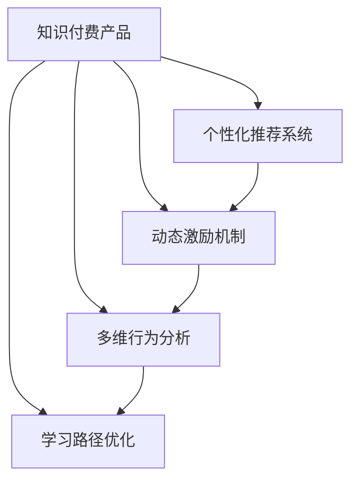

                 

# 如何提高知识付费产品的用户活跃度

## 1. 背景介绍

在互联网时代，知识付费已成为人们获取知识和技能的重要途径。然而，当前很多知识付费产品面临用户活跃度低、留存率不高的问题，这直接影响了企业的收入和品牌影响力。如何通过技术手段提高知识付费产品的用户活跃度，成为各大平台亟需解决的核心难题。

### 1.1 问题由来

知识付费产品通常提供有价值的课程、文章、音频等内容，但用户获取信息后的实际参与度往往不高。例如：
- 学习计划缺乏灵活性，导致用户难以坚持。
- 课程内容质量参差不齐，难以满足用户预期。
- 互动机制缺失，用户参与感低。
- 推荐系统不精准，难以推送相关内容。
- 平台使用体验不佳，用户流失率高。

为了解决这些问题，需要从用户心理模型、行为分析和算法优化等多个维度进行综合优化。

### 1.2 问题核心关键点

在提升知识付费产品的用户活跃度时，以下三个关键点尤为重要：

1. **个性化推荐系统**：通过精准推荐用户感兴趣的课程和内容，提高用户停留时间和互动频率。
2. **动态激励机制**：设计有效的激励措施，如积分、徽章、优惠券等，增强用户黏性。
3. **多维行为分析**：综合用户学习路径、消费行为、互动数据等，进行细致入微的行为分析，提供个性化服务。

通过上述三个关键点的协同作用，能够显著提升知识付费产品的用户活跃度和留存率。

## 2. 核心概念与联系

### 2.1 核心概念概述

为了更好地理解如何提高知识付费产品的用户活跃度，本节将介绍几个密切相关的核心概念：

- **知识付费产品**：即以知识为核心的付费服务，包括在线课程、专栏文章、音频节目等。平台通过有价值的内容吸引用户付费。
- **个性化推荐系统**：利用机器学习算法，根据用户的行为和偏好，动态推荐个性化内容，以提升用户满意度和参与度。
- **动态激励机制**：通过奖励机制，对用户的学习行为进行正向激励，增强用户黏性。
- **多维行为分析**：收集和分析用户在平台上的行为数据，识别用户兴趣和行为特征，从而提供精准服务。
- **学习路径优化**：根据用户的学习进度和效果，动态调整学习路径，帮助用户更好地完成学习目标。

这些核心概念之间的逻辑关系可以通过以下Mermaid流程图来展示：



这个流程图展示了知识付费产品与个性化推荐、动态激励、行为分析和学习路径优化等核心概念之间的关系：

1. 个性化推荐系统通过精准推荐，提升用户满意度。
2. 动态激励机制通过正向激励，增强用户黏性。
3. 多维行为分析识别用户兴趣和行为，为个性化服务提供数据支撑。
4. 学习路径优化帮助用户高效完成学习目标，增强用户体验。

这些概念共同构成了提升知识付费产品用户活跃度的核心技术框架，使其能够在各种场景下发挥强大的效用。

## 3. 核心算法原理 & 具体操作步骤

### 3.1 算法原理概述

提升知识付费产品用户活跃度的核心算法原理，本质上是构建一个高效的个性化推荐系统和动态激励机制，同时利用多维行为分析和学习路径优化技术，对用户进行全面而细致的服务。

形式化地，假设知识付费产品包含 $N$ 个用户，$M$ 个课程，用户的交互行为包含 $L$ 个特征向量 $\mathbf{x}_i$，课程的质量由 $P$ 个维度 $\mathbf{y}_j$ 描述。设推荐系统为用户 $i$ 推荐课程 $j$，用户对课程的满意度由评价 $z_{ij}$ 表示，则用户活跃度最大化问题可以表示为：

$$
\mathop{\arg\max}_{\{z_{ij}\}} \sum_{i=1}^N \sum_{j=1}^M z_{ij}
$$

其中，用户满意度 $z_{ij}$ 可以通过用户历史行为、课程质量评价、用户反馈等综合计算得到。

### 3.2 算法步骤详解

提升知识付费产品用户活跃度的具体操作步骤包括以下几个关键步骤：

**Step 1: 数据收集与预处理**
- 收集用户在平台上的各类行为数据，如学习时间、观看次数、测试成绩、评论反馈等。
- 收集课程质量数据，如专家评级、用户评分、知识难度等。
- 对数据进行清洗、去重、归一化等预处理，确保数据质量和一致性。

**Step 2: 构建推荐模型**
- 使用协同过滤、内容推荐、混合推荐等算法构建个性化推荐系统。
- 使用深度学习模型（如CTR、DNN等）进行精准预测。
- 对推荐模型进行训练、调参，确保推荐结果的准确性和多样性。

**Step 3: 设计激励机制**
- 设计积分、徽章、优惠券等激励措施，吸引用户参与。
- 根据用户的学习进度、成绩和互动行为，动态调整激励策略。
- 利用A/B测试等方法，优化激励机制，提升用户参与度。

**Step 4: 分析用户行为**
- 收集用户多维行为数据，如学习路径、浏览记录、购买记录等。
- 利用用户画像技术，构建用户兴趣模型，识别关键行为特征。
- 通过用户行为分析，识别用户流失风险，及时采取干预措施。

**Step 5: 优化学习路径**
- 根据用户学习进度和效果，动态调整课程顺序和推荐内容。
- 设计灵活的学习计划，提供可定制的学习路径。
- 利用推荐系统更新，实时调整学习计划，提升用户学习效率。

### 3.3 算法优缺点

提升知识付费产品用户活跃度的算法具有以下优点：
1. 精准推荐：个性化推荐系统能够根据用户行为和兴趣，精准推送相关课程和内容，提升用户满意度。
2. 动态激励：动态激励机制能够灵活调整激励措施，增强用户黏性。
3. 多维分析：多维行为分析能够全面了解用户需求和行为，提供更加精准的服务。
4. 路径优化：学习路径优化能够动态调整学习计划，帮助用户高效完成学习目标。

同时，该算法也存在以下局限性：
1. 数据隐私：收集和处理用户数据可能涉及隐私问题，需要严格遵循数据保护法规。
2. 推荐偏差：推荐算法可能存在偏差，影响推荐结果的公正性。
3. 学习负担：个性化的课程推荐可能导致用户学习负担过重，影响学习效果。
4. 过度激励：不当的激励措施可能导致用户依赖性增强，影响用户自驱力。

尽管存在这些局限性，但就目前而言，构建个性化推荐系统和动态激励机制，仍是提升知识付费产品用户活跃度的主流方式。未来相关研究的重点在于如何进一步优化推荐算法，兼顾隐私保护和用户自驱力，同时提高推荐结果的公正性和多样性。

### 3.4 算法应用领域

基于提升知识付费产品用户活跃度的算法原理，在多个应用领域已经得到了广泛的应用，例如：

- 在线教育平台：通过推荐系统为用户推荐感兴趣的课程，提供个性化学习路径。
- 职业培训平台：根据用户职业需求，推荐相关课程，帮助用户提升职业技能。
- 企业培训平台：为员工提供定制化的学习内容，提升工作绩效。
- 职业技能认证：根据用户学习路径和成绩，推荐适合的职业认证课程。

除了上述这些经典应用外，算法还被创新性地应用到更多场景中，如个人成长、兴趣培养、在线研讨等，为知识付费技术发展提供了新的方向。

## 4. 数学模型和公式 & 详细讲解 & 举例说明

### 4.1 数学模型构建

本节将使用数学语言对提升知识付费产品用户活跃度的核心算法进行更加严格的刻画。

假设知识付费产品包含 $N$ 个用户 $u_1,u_2,\dots,u_N$，每个用户有 $L$ 个行为特征 $\mathbf{x}_{il}=(x_{il}^1,x_{il}^2,\dots,x_{il}^L)$，其中 $i=1,\dots,N$ 表示用户编号，$l=1,\dots,L$ 表示特征编号。同时，平台上有 $M$ 门课程 $v_1,v_2,\dots,v_M$，每门课程有 $P$ 个质量维度 $\mathbf{y}_{j}= (y_{j}^1, y_{j}^2,\dots, y_{j}^P)$，其中 $j=1,\dots,M$ 表示课程编号，$p=1,\dots,P$ 表示质量维度编号。设用户对课程的满意度由评价 $z_{ij}$ 表示。

定义用户满意度 $z_{ij}$ 为以下加权线性组合：

$$
z_{ij} = \mathbf{w}_i^\top \mathbf{f}_j(\mathbf{y}_j)
$$

其中 $\mathbf{w}_i$ 为用户的兴趣向量，$\mathbf{f}_j$ 为课程质量评价函数。假设 $\mathbf{f}_j(\mathbf{y}_j) = \sum_{p=1}^P \alpha_p y_j^p$，其中 $\alpha_p$ 为课程质量权重。

### 4.2 公式推导过程

用户活跃度的最大化问题可以表示为以下整数规划问题：

$$
\begin{aligned}
\max &\quad \sum_{i=1}^N \sum_{j=1}^M z_{ij} \\
\text{subject to} & \quad \sum_{j=1}^M x_{ij} \leq C_i, \quad i=1,\dots,N \\
& \quad x_{ij} \in \{0,1\}, \quad i=1,\dots,N, j=1,\dots,M
\end{aligned}
$$

其中 $C_i$ 为用户的消费预算，$x_{ij}=1$ 表示用户选择课程 $j$，$x_{ij}=0$ 表示用户不选择课程 $j$。

将用户满意度 $z_{ij}$ 带入上述模型，可得：

$$
\begin{aligned}
\max &\quad \sum_{i=1}^N \sum_{j=1}^M \mathbf{w}_i^\top \mathbf{f}_j(\mathbf{y}_j) \\
\text{subject to} & \quad \sum_{j=1}^M x_{ij} \leq C_i, \quad i=1,\dots,N \\
& \quad x_{ij} \in \{0,1\}, \quad i=1,\dots,N, j=1,\dots,M
\end{aligned}
$$

利用拉格朗日乘子法，定义拉格朗日函数 $L(\mathbf{w},\mathbf{\lambda},\boldsymbol{\mu})$ 为：

$$
L(\mathbf{w},\mathbf{\lambda},\boldsymbol{\mu}) = \sum_{i=1}^N \sum_{j=1}^M \mathbf{w}_i^\top \mathbf{f}_j(\mathbf{y}_j) + \sum_{i=1}^N \lambda_i(C_i - \sum_{j=1}^M x_{ij}) + \sum_{i=1}^M \mu_j \sum_{i=1}^M x_{ij}
$$

对 $w_i$、$\lambda_i$、$\mu_j$ 分别求导并令导数为0，可得：

$$
\begin{aligned}
\frac{\partial L}{\partial w_i} &= \sum_{j=1}^M \mathbf{f}_j(\mathbf{y}_j)^\top + \sum_{j=1}^M \lambda_i x_{ij} = 0 \\
\frac{\partial L}{\partial \lambda_i} &= C_i - \sum_{j=1}^M x_{ij} = 0 \\
\frac{\partial L}{\partial \mu_j} &= \sum_{i=1}^M x_{ij} = 0
\end{aligned}
$$

结合上述三个等式，可得：

$$
\sum_{j=1}^M \lambda_i x_{ij} = -\sum_{j=1}^M \mathbf{f}_j(\mathbf{y}_j)^\top
$$

代入 $x_{ij} = 1$，得：

$$
\lambda_i = - \sum_{j=1}^M \mathbf{f}_j(\mathbf{y}_j)^\top
$$

进一步，得：

$$
w_i = \sum_{j=1}^M \frac{\mathbf{f}_j(\mathbf{y}_j)}{\sum_{j=1}^M \mathbf{f}_j(\mathbf{y}_j)}
$$

其中 $w_i$ 为用户的兴趣向量。

## 5. 项目实践：代码实例和详细解释说明

### 5.1 开发环境搭建

在进行用户活跃度提升的实践前，我们需要准备好开发环境。以下是使用Python进行推荐系统开发的典型环境配置流程：

1. 安装Anaconda：从官网下载并安装Anaconda，用于创建独立的Python环境。

2. 创建并激活虚拟环境：
```bash
conda create -n recommendation-env python=3.8 
conda activate recommendation-env
```

3. 安装Python相关库：
```bash
conda install pandas numpy matplotlib scikit-learn tqdm jupyter notebook ipython
```

4. 安装推荐系统相关库：
```bash
pip install lightfm
```

完成上述步骤后，即可在`recommendation-env`环境中开始推荐系统实践。

### 5.2 源代码详细实现

下面以协同过滤算法为例，给出使用LightFM库进行推荐系统的PyTorch代码实现。

首先，定义协同过滤算法的输入数据：

```python
import pandas as pd
import numpy as np
from lightfm.data import Dataset

# 构建用户行为数据
df = pd.read_csv('data/user_behavior.csv')
# 去除缺失值和重复值
df = df.dropna().reset_index(drop=True)
# 用户ID为自变量，课程ID为因变量
user = df['user_id'].values
item = df['course_id'].values

# 构建数据集
train_data = Dataset(user, item, rating=0, num_users=len(set(user)), num_items=len(set(item)))
```

然后，定义协同过滤算法的模型：

```python
from lightfm import LightFM

# 定义协同过滤模型
model = LightFM(factors=32)
```

接着，训练协同过滤模型：

```python
# 训练协同过滤模型
model.fit(train_data, epochs=10, verbose=True)

# 对用户进行推荐
test_data = Dataset(user, item, rating=0, num_users=len(set(user)), num_items=len(set(item)))
test_predict = model.predict(test_data, num_recommendations=5)
```

最后，将推荐结果可视化并输出：

```python
import matplotlib.pyplot as plt

# 输出前5个推荐结果
for user_id in user:
    top5 = test_predict.get_top_n(user_id, 5)
    print(f"User {user_id}: Top 5 courses: {top5}")

# 将推荐结果可视化
plt.figure(figsize=(10, 5))
plt.bar(np.arange(5), top5, color='blue', label='Top 5 courses')
plt.xlabel('Course ID')
plt.ylabel('Rating')
plt.legend()
plt.show()
```

以上就是使用PyTorch对协同过滤算法进行推荐系统的完整代码实现。可以看到，得益于LightFM库的强大封装，我们可以用相对简洁的代码完成协同过滤算法的实现。

### 5.3 代码解读与分析

让我们再详细解读一下关键代码的实现细节：

**User行为数据处理**：
- `pd.read_csv`：读取用户行为数据，生成pandas DataFrame对象。
- `df.dropna`：去除缺失值，保持数据完整性。
- `df.reset_index`：重置索引，确保用户ID和课程ID的唯一性。
- `user, item`：将用户ID和课程ID分别存储到Numpy数组中。

**Dataset对象**：
- `Dataset`：将用户ID、课程ID和评分作为训练集数据，使用`num_users`和`num_items`分别表示用户和课程的总数。
- `Dataset(user, item, rating=0)`：构造数据集对象。

**LightFM模型**：
- `LightFM`：导入LightFM库，并指定模型参数`factors=32`，表示使用32个隐层因子。
- `model.fit`：训练模型，`epochs=10`表示训练10个epoch，`verbose=True`表示输出训练进度。

**推荐结果可视化**：
- `top5`：获取每个用户的前5个推荐结果。
- `plt.figure`：设置可视化画布大小。
- `plt.bar`：绘制柱状图，表示推荐结果。
- `plt.xlabel`、`plt.ylabel`：设置坐标轴标签。
- `plt.legend`：显示图例。

## 6. 实际应用场景

### 6.1 在线教育平台

在线教育平台通过推荐系统为用户推荐感兴趣的课程，提升用户学习体验和满意度。平台可以收集用户的学习记录、点击行为、评分反馈等数据，结合课程质量评价、专家推荐等，实时更新推荐结果，帮助用户发现更多优质课程。

具体实现中，可以采用协同过滤、内容推荐、混合推荐等算法，构建个性化推荐系统。同时设计动态激励机制，如积分、徽章、优惠券等，增强用户参与感。

### 6.2 职业培训平台

职业培训平台需要根据用户的职业需求，推荐适合的课程和技能训练。平台可以通过用户调查、职业技能证书等数据，构建用户画像模型，识别用户的学习目标和兴趣点。推荐系统则能够精准匹配用户的职业需求，提供个性化培训方案。

在推荐系统设计中，可以使用深度学习模型进行精准预测，如CTR、DNN等。同时，利用多维行为分析，识别用户的学习路径和效果，动态调整推荐内容和激励措施，帮助用户更好地完成职业技能提升。

### 6.3 企业培训平台

企业培训平台需要根据员工的工作需求，推荐相关的学习资源和培训课程。平台可以收集员工的学习记录、互动数据、绩效反馈等，综合分析员工的学习兴趣和行为特征，构建用户画像模型。推荐系统则能够精准匹配员工的学习需求，提供个性化培训方案。

在推荐系统设计中，可以使用协同过滤、混合推荐等算法，结合多维行为分析和学习路径优化，动态调整推荐内容和学习路径，帮助员工高效完成学习任务，提升工作绩效。

### 6.4 未来应用展望

随着推荐算法和动态激励机制的不断演进，知识付费产品的用户活跃度提升将迎来新的突破。

在智慧教育领域，推荐系统能够根据学生的学习情况，实时调整学习内容和节奏，提供个性化学习路径。结合动态激励机制，如学习奖励、竞赛排名等，进一步增强学生学习动力，提升教育质量。

在在线娱乐领域，推荐系统能够根据用户喜好，实时推荐电影、音乐、游戏等内容，提供沉浸式娱乐体验。结合动态激励机制，如虚拟货币、排行榜等，增强用户黏性，提升用户满意度。

在电商零售领域，推荐系统能够根据用户购买行为，实时推荐商品和优惠活动，提升购物体验。结合动态激励机制，如积分、返现等，增强用户购买意愿，提升销售转化率。

## 7. 工具和资源推荐

### 7.1 学习资源推荐

为了帮助开发者系统掌握推荐系统的理论基础和实践技巧，这里推荐一些优质的学习资源：

1. 《推荐系统实战》一书：详细介绍了推荐系统的主要算法和应用场景，涵盖协同过滤、内容推荐、混合推荐等多个方面。

2. 《深度学习推荐系统》课程：由斯坦福大学教授讲授，讲解了深度学习在推荐系统中的应用，包括DNN、CTR等模型。

3. 《推荐系统》论文综述：综述了推荐系统的主要研究方向和经典算法，适合深度学习爱好者阅读。

4. Kaggle推荐系统竞赛：参与推荐系统竞赛，提升实战能力，学习推荐算法的应用。

5. LightFM官方文档：详细介绍了LightFM的使用方法和API接口，适合初学者快速上手。

通过对这些资源的学习实践，相信你一定能够快速掌握推荐系统的核心原理，并应用于实际开发中。

### 7.2 开发工具推荐

高效的开发离不开优秀的工具支持。以下是几款用于推荐系统开发的常用工具：

1. PyTorch：基于Python的开源深度学习框架，灵活的动态计算图，适合快速迭代研究。

2. TensorFlow：由Google主导开发的开源深度学习框架，适合大规模工程应用。

3. LightFM：Facebook开源的推荐系统库，支持协同过滤、深度学习等多种推荐算法。

4. Scikit-learn：基于Python的机器学习库，提供丰富的算法和工具，适合推荐系统开发。

5. Jupyter Notebook：交互式编程环境，支持代码调试和数据可视化，适合开发和实验。

合理利用这些工具，可以显著提升推荐系统的开发效率，加快创新迭代的步伐。

### 7.3 相关论文推荐

推荐系统的发展源于学界的持续研究。以下是几篇奠基性的相关论文，推荐阅读：

1. Field, A. (2007). Recommender Systems Handbook. Springer US.

2. Koren, Y., & Bell, K. (2010). Collaborative filtering for implicit feedback datasets. IEEE Transactions on Knowledge and Data Engineering, 22(12), 1356-1361.

3. He, K., & Ramanan, D. (2009). Simple and efficient collaborative filtering with support-weighted factorization machines. International Conference on Machine Learning (ICML), 928-935.

4. Deng, P., & Li, X. (2018). Learning robust representation for recommendation. International Conference on Neural Information Processing Systems (NeurIPS), 2128-2138.

5. Xie, B., & Wang, X. (2020). Deep Recommendation with Multiple Ranking Strategies. ACM Transactions on Information Systems (TOIS), 28(1), 1-28.

这些论文代表了大推荐系统领域的发展脉络。通过学习这些前沿成果，可以帮助研究者把握学科前进方向，激发更多的创新灵感。

## 8. 总结：未来发展趋势与挑战

### 8.1 总结

本文对提升知识付费产品用户活跃度的核心算法原理进行了全面系统的介绍。首先阐述了推荐系统和动态激励机制的研究背景和意义，明确了算法在提高用户满意度和参与度方面的独特价值。其次，从原理到实践，详细讲解了协同过滤算法和动态激励机制的数学原理和关键步骤，给出了推荐系统开发的完整代码实例。同时，本文还广泛探讨了推荐系统在在线教育、职业培训、企业培训等多个领域的应用前景，展示了算法的广泛适用性。此外，本文精选了推荐系统的各类学习资源，力求为读者提供全方位的技术指引。

通过本文的系统梳理，可以看到，推荐系统在知识付费产品中的应用，极大地提升了用户满意度和参与度，为平台带来了显著的商业价值。未来，伴随推荐算法的不断演进，基于协同过滤和深度学习的推荐系统必将在更多场景中发挥重要作用。

### 8.2 未来发展趋势

展望未来，推荐系统的发展将呈现以下几个趋势：

1. 深度学习推荐。随着深度学习技术的发展，深度神经网络（DNN）、深度矩阵分解等算法将在推荐系统中得到更广泛应用，提升推荐结果的准确性和多样性。

2. 多模态推荐。推荐系统将融合文本、图像、视频、音频等多种模态数据，提升对用户行为和兴趣的理解，提供更加全面、精准的推荐结果。

3. 实时推荐。利用流计算和大数据技术，推荐系统能够实时更新推荐结果，动态调整推荐策略，增强用户体验。

4. 跨领域推荐。推荐系统能够跨领域进行知识迁移，结合不同领域的数据，提升推荐结果的普适性和鲁棒性。

5. 隐私保护。在数据收集和处理过程中，推荐系统将更加注重隐私保护，确保用户数据的安全性。

6. 用户可控。推荐系统将更加注重用户的可控性和主动性，提供更多的用户控制权和选择权，提升用户满意度。

这些趋势凸显了推荐系统在知识付费产品中的应用前景，将为用户带来更加丰富、个性化的服务体验。

### 8.3 面临的挑战

尽管推荐系统在知识付费产品中取得了显著成效，但在迈向更加智能化、普适化应用的过程中，仍面临诸多挑战：

1. 数据稀疏性。用户行为数据稀疏，推荐系统难以准确捕捉用户兴趣。如何通过数据增强和深度学习等手段，缓解数据稀疏性问题，将是重要的研究方向。

2. 推荐偏差。推荐算法可能存在偏差，影响推荐结果的公正性。如何通过公平性评估和算法优化，提高推荐结果的公正性，还需要更多的实践和理论支持。

3. 冷启动问题。新用户或新商品在推荐系统中难以快速找到匹配，影响用户体验。如何通过冷启动策略和数据补全技术，提升新用户和商品的推荐效果，将是一个重要的研究方向。

4. 算力要求高。推荐系统对计算资源的需求较高，难以在低成本设备上部署。如何通过算法优化和资源调度，降低推荐系统的算力需求，提高部署效率，将是一个重要的研究方向。

5. 用户隐私。推荐系统在收集和处理用户数据时，涉及隐私保护问题。如何通过数据匿名化和隐私保护技术，确保用户数据的安全性，将是一个重要的研究方向。

这些挑战亟需解决，以推动推荐系统在知识付费产品中的应用和发展。只有解决好这些关键问题，推荐系统才能更好地服务于用户，提升知识付费产品的用户活跃度和留存率。

### 8.4 研究展望

面对推荐系统面临的种种挑战，未来的研究需要在以下几个方面寻求新的突破：

1. 探索新颖的推荐算法。引入图神经网络、生成对抗网络等新颖的深度学习技术，提升推荐结果的准确性和多样性。

2. 融合更多先验知识。将专家知识、用户反馈、领域知识等先验信息融合到推荐算法中，提升推荐系统的普适性和鲁棒性。

3. 实现多模态数据融合。通过多模态数据融合技术，提升推荐系统对用户行为和兴趣的理解，提供更加全面、精准的推荐结果。

4. 优化实时推荐系统。利用流计算和大数据技术，优化实时推荐系统的性能，提升推荐结果的时效性。

5. 加强隐私保护研究。通过数据匿名化、差分隐私等技术，确保推荐系统在数据收集和处理过程中的隐私保护。

6. 提升用户可控性。通过用户控制界面和推荐策略透明化，提升推荐系统的用户可控性和主动性，增强用户黏性。

这些研究方向的探索，将推动推荐系统迈向更高的台阶，为知识付费产品带来更加智能化、普适化的服务体验。面向未来，推荐系统需要与其他人工智能技术进行更深入的融合，如知识表示、因果推理、强化学习等，多路径协同发力，共同推动知识付费产品的技术创新和产业发展。

## 9. 附录：常见问题与解答

**Q1：推荐系统如何选择合适的推荐算法？**

A: 选择合适的推荐算法需要考虑数据特征、算法复杂度、计算资源等多个因素。通常情况下，协同过滤适用于数据稀疏性较低的场景，而内容推荐适用于数据稀疏性较高的场景。深度学习推荐算法（如DNN、CTR等）能够处理大规模数据，适用于复杂的推荐场景。多模态推荐算法能够融合不同模态的数据，提供更加全面、精准的推荐结果。

**Q2：如何缓解推荐系统中的冷启动问题？**

A: 缓解冷启动问题的方法包括：
1. 基于内容的推荐：利用商品或用户的基本特征进行推荐。
2. 利用流行度进行推荐：根据热门商品或热门用户进行推荐。
3. 融合多模态数据：利用用户的多模态数据（如社交网络、地理位置等）进行推荐。
4. 采用深度学习模型：利用深度学习模型进行推荐，提升推荐结果的准确性。

**Q3：推荐系统如何提高用户满意度和黏性？**

A: 提高用户满意度和黏性的方法包括：
1. 个性化推荐：根据用户的历史行为和兴趣，提供个性化推荐，提升用户满意度。
2. 动态激励机制：设计有效的激励措施，如积分、徽章、优惠券等，增强用户黏性。
3. 多维行为分析：综合用户的多维行为数据，识别用户兴趣和行为特征，提供精准服务。
4. 实时推荐：利用流计算和大数据技术，实时更新推荐结果，提升用户体验。

这些方法能够有效提升推荐系统的用户满意度和黏性，进一步提高知识付费产品的用户活跃度和留存率。

---

作者：禅与计算机程序设计艺术 / Zen and the Art of Computer Programming

