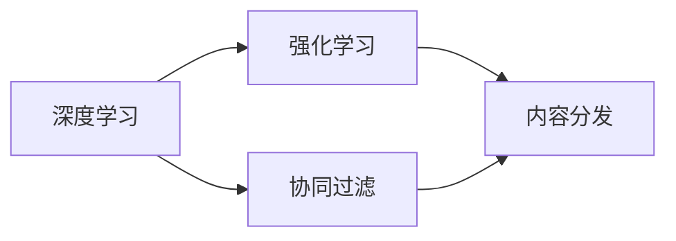

                 

# 如何进行有效的内容分发

## 1. 背景介绍

在信息爆炸的时代，内容分发已经成为互联网业务中最重要的环节之一。有效的用户内容分发策略不仅能够提升用户体验，还能显著提升企业价值。然而，传统的内容分发方法往往基于简单的推荐算法，难以充分挖掘用户兴趣，且推荐内容存在同质化问题。近年来，深度学习和强化学习技术在推荐系统中的应用取得了长足进步，使得内容分发的质量和效果有了显著提升。本文将详细介绍基于深度学习和强化学习的内容分发方法，并介绍其实现流程及应用场景。

## 2. 核心概念与联系

### 2.1 核心概念概述

为更好地理解本文介绍的深度学习和强化学习内容分发方法，我们首先介绍几个相关概念：

- **深度学习（Deep Learning）**：一种基于多层神经网络的学习方法，能够通过学习输入数据的复杂特征映射，实现高精度的数据建模。在推荐系统中，深度学习模型可以捕获用户兴趣的多样性和复杂性，提供个性化的推荐结果。

- **强化学习（Reinforcement Learning, RL）**：一种通过与环境交互，使智能体学习最优策略的方法。在推荐系统中，强化学习可以通过模拟用户行为，不断优化推荐算法，使其更符合用户实际需求。

- **内容分发（Content Distribution）**：将内容推荐给目标用户的过程。其目标是通过推荐算法，使用户能够快速找到感兴趣的内容，提升用户体验和平台价值。

- **协同过滤（Collaborative Filtering）**：一种基于用户行为或物品属性的推荐方法，通过寻找与目标用户或物品相似的其他用户或物品，预测目标用户对目标物品的评分或偏好。

这些概念之间的关系可以通过以下Mermaid流程图来展示：



这个流程图展示了深度学习和强化学习在内容分发中的应用。深度学习用于构建推荐模型，协同过滤则用于补充和优化推荐结果，强化学习则用于不断优化推荐策略。

## 3. 核心算法原理 & 具体操作步骤

### 3.1 算法原理概述

基于深度学习和强化学习的内容分发方法主要分为两个步骤：

1. **内容推荐**：使用深度学习模型预测用户对不同内容的评分或概率分布，生成推荐列表。

2. **策略优化**：使用强化学习方法，通过模拟用户行为，不断调整推荐策略，优化推荐效果。

具体来说，深度学习模型需要解决以下问题：

- **用户表示学习**：将用户行为、属性等信息映射到高维空间中的向量，用于表示用户兴趣。
- **物品表示学习**：将物品特征、属性等信息映射到高维空间中的向量，用于表示物品特性。
- **评分预测**：根据用户表示和物品表示，预测用户对物品的评分或选择概率。

强化学习模型需要解决以下问题：

- **策略设计**：设计适当的奖励函数和状态空间，定义推荐策略。
- **策略优化**：通过与用户交互，不断调整策略参数，提升推荐效果。

### 3.2 算法步骤详解

基于深度学习和强化学习的内容分发方法具体步骤包括：

**Step 1: 数据准备**

- 收集用户行为数据（如点击、浏览、评分等）和物品属性数据（如标题、标签、类别等）。
- 对数据进行预处理，包括数据清洗、特征工程、归一化等。

**Step 2: 构建深度学习模型**

- 设计深度学习模型架构，如序列模型、协同过滤模型等。
- 定义损失函数，如均方误差、交叉熵等。
- 选择合适的优化器，如SGD、Adam等。
- 使用训练集数据进行模型训练，并在验证集上进行调参和评估。

**Step 3: 引入强化学习**

- 设计强化学习环境，定义奖励函数和状态空间。
- 选择强化学习算法，如Q-Learning、SARSA等。
- 使用训练集数据进行强化学习，更新推荐策略。
- 在测试集上进行策略评估和调整。

**Step 4: 实际部署**

- 将训练好的深度学习模型和强化学习策略部署到实际推荐系统中。
- 使用实时用户数据进行推荐，并通过A/B测试等手段评估推荐效果。
- 定期收集用户反馈，更新推荐模型和策略。

### 3.3 算法优缺点

基于深度学习和强化学习的内容分发方法具有以下优点：

1. **个性化推荐**：深度学习模型能够学习用户兴趣的多样性和复杂性，提供个性化的推荐结果。
2. **自适应优化**：强化学习能够动态调整推荐策略，提升推荐效果。
3. **效果显著**：深度学习和强化学习在推荐系统中取得了显著的性能提升，用户满意度显著提高。

同时，这些方法也存在以下缺点：

1. **计算复杂度高**：深度学习模型通常需要大量的计算资源进行训练和推理，需要高性能的硬件支持。
2. **数据需求高**：深度学习模型需要大量的标注数据进行训练，数据收集和标注成本较高。
3. **模型复杂度大**：深度学习模型结构复杂，难以解释和调试。
4. **冷启动问题**：对于新用户或新物品，深度学习模型无法提供有效的推荐。

尽管存在这些局限性，但深度学习和强化学习在内容分发中的应用已经取得了广泛认可，成为推荐系统的主要技术手段之一。

### 3.4 算法应用领域

基于深度学习和强化学习的内容分发方法已经广泛应用于以下几个领域：

- **电商推荐**：电商平台利用用户行为数据和商品属性数据，为用户提供个性化的商品推荐。
- **视频推荐**：视频平台根据用户观看历史和评分数据，推荐用户可能感兴趣的视频内容。
- **新闻推荐**：新闻平台通过用户阅读记录和点击行为，推荐用户可能感兴趣的新闻文章。
- **社交推荐**：社交网络平台根据用户社交关系和互动行为，推荐用户可能感兴趣的内容和用户。
- **游戏推荐**：游戏平台根据用户游戏行为和属性，推荐用户可能感兴趣的游戏。

## 4. 数学模型和公式 & 详细讲解 & 举例说明

### 4.1 数学模型构建

本节将使用数学语言对基于深度学习和强化学习的内容分发过程进行更加严格的刻画。

假设用户数量为 $U$，物品数量为 $I$，用户行为矩阵为 $\mathbf{X} \in \mathbb{R}^{U \times I}$，其中 $X_{ui}$ 表示用户 $u$ 对物品 $i$ 的评分或选择概率。用户表示为 $\mathbf{U} \in \mathbb{R}^{U \times D}$，物品表示为 $\mathbf{V} \in \mathbb{R}^{I \times D}$，其中 $D$ 为嵌入空间的维度。深度学习模型预测用户对物品的评分或概率为 $\mathbf{Y} = \mathbf{U} \mathbf{V}^T \in \mathbb{R}^{U \times I}$。

强化学习模型定义状态空间 $S$，奖励函数 $R$，策略 $\pi$。状态空间 $S$ 可以包括用户历史行为、物品特征等信息。奖励函数 $R$ 用于衡量推荐效果，如点击率、停留时间等。策略 $\pi$ 用于指导推荐决策，可以是基于规则的策略，也可以是深度学习模型预测的策略。

### 4.2 公式推导过程

对于深度学习模型，其评分预测公式为：

$$
Y_{ui} = f(\mathbf{U}_u \mathbf{V}_i^T)
$$

其中 $f$ 为深度学习模型。用户表示和物品表示可以通过神经网络等模型进行学习，其训练过程可以表示为：

$$
\min_{\mathbf{U}, \mathbf{V}} \frac{1}{2} \sum_{u,i} (Y_{ui} - X_{ui})^2
$$

对于强化学习模型，其状态表示和动作策略可以表示为：

$$
\mathbf{Q} = \mathbf{U} \mathbf{V}^T
$$

状态空间 $S$ 和奖励函数 $R$ 定义如下：

$$
S = \{\mathbf{X}_u, \mathbf{V}_i\}
$$

$$
R = \max(Y_{ui}, \hat{Y}_{ui})
$$

其中 $\hat{Y}_{ui}$ 为推荐的物品评分，$\max$ 表示选择评分更高的物品。强化学习模型的目标是最小化期望奖励：

$$
\min_{\pi} \mathbb{E}[\sum_t R_{u_i}^\pi]
$$

其中 $\pi$ 为推荐策略，$R_{u_i}^\pi$ 为策略 $\pi$ 下用户 $u$ 选择物品 $i$ 的期望奖励。

### 4.3 案例分析与讲解

我们以电商平台的用户推荐系统为例，详细讲解基于深度学习和强化学习的内容分发方法。

假设电商平台收集了用户 $u$ 对物品 $i$ 的评分数据，以及物品的标签、类别等属性信息。首先，我们使用深度学习模型对用户表示 $\mathbf{U}_u$ 和物品表示 $\mathbf{V}_i$ 进行学习，预测用户对物品的评分 $Y_{ui}$。然后，我们使用强化学习模型，通过用户的历史行为和物品属性，学习推荐策略 $\pi$，使推荐效果最大化。

具体实现步骤如下：

1. **数据准备**：收集用户评分数据和物品属性数据，并进行预处理。
2. **模型训练**：使用深度学习模型对用户表示和物品表示进行学习，使用协同过滤模型进行评分预测。
3. **强化学习**：设计状态空间和奖励函数，使用强化学习模型优化推荐策略。
4. **实际部署**：将训练好的深度学习模型和强化学习策略部署到推荐系统中，实时推荐物品给用户。

## 5. 项目实践：代码实例和详细解释说明

### 5.1 开发环境搭建

在进行内容分发项目实践前，我们需要准备好开发环境。以下是使用Python进行PyTorch和TensorFlow开发的环境配置流程：

1. 安装Anaconda：从官网下载并安装Anaconda，用于创建独立的Python环境。

2. 创建并激活虚拟环境：
```bash
conda create -n pytorch-env python=3.8 
conda activate pytorch-env
```

3. 安装PyTorch：根据CUDA版本，从官网获取对应的安装命令。例如：
```bash
conda install pytorch torchvision torchaudio cudatoolkit=11.1 -c pytorch -c conda-forge
```

4. 安装TensorFlow：使用pip安装TensorFlow，可以指定版本号。例如：
```bash
pip install tensorflow==2.5.0
```

5. 安装各类工具包：
```bash
pip install numpy pandas scikit-learn matplotlib tqdm jupyter notebook ipython
```

完成上述步骤后，即可在`pytorch-env`环境中开始内容分发实践。

### 5.2 源代码详细实现

这里我们以电商平台的用户推荐系统为例，给出使用PyTorch和TensorFlow进行内容分发的完整代码实现。

首先，定义用户行为矩阵 $\mathbf{X}$：

```python
import numpy as np

X = np.random.rand(100, 1000)  # 用户-物品评分矩阵
```

然后，定义深度学习模型：

```python
import torch
import torch.nn as nn

class UserModel(nn.Module):
    def __init__(self, input_dim, hidden_dim, output_dim):
        super(UserModel, self).__init__()
        self.hidden = nn.Linear(input_dim, hidden_dim)
        self.relu = nn.ReLU()
        self.out = nn.Linear(hidden_dim, output_dim)
        
    def forward(self, x):
        x = self.hidden(x)
        x = self.relu(x)
        x = self.out(x)
        return x

# 创建用户模型
user_model = UserModel(input_dim=1000, hidden_dim=100, output_dim=500)
```

接下来，定义物品模型：

```python
class ItemModel(nn.Module):
    def __init__(self, input_dim, hidden_dim, output_dim):
        super(ItemModel, self).__init__()
        self.hidden = nn.Linear(input_dim, hidden_dim)
        self.relu = nn.ReLU()
        self.out = nn.Linear(hidden_dim, output_dim)
        
    def forward(self, x):
        x = self.hidden(x)
        x = self.relu(x)
        x = self.out(x)
        return x

# 创建物品模型
item_model = ItemModel(input_dim=500, hidden_dim=100, output_dim=500)
```

然后，定义评分预测函数：

```python
def predict_user_item_scores(user, item):
    user_vector = user_model(user)
    item_vector = item_model(item)
    scores = torch.matmul(user_vector, item_vector.t())
    return scores
```

接下来，定义强化学习模型：

```python
import torch

class ReinforcementModel(nn.Module):
    def __init__(self, input_dim, hidden_dim, output_dim):
        super(ReinforcementModel, self).__init__()
        self.hidden = nn.Linear(input_dim, hidden_dim)
        self.relu = nn.ReLU()
        self.out = nn.Linear(hidden_dim, output_dim)
        
    def forward(self, x):
        x = self.hidden(x)
        x = self.relu(x)
        x = self.out(x)
        return x

# 创建强化学习模型
reinforcement_model = ReinforcementModel(input_dim=500, hidden_dim=100, output_dim=1000)
```

最后，编写强化学习策略函数：

```python
def reinforce_learning(env, model, learning_rate=0.01, num_steps=1000):
    state = env.reset()
    for step in range(num_steps):
        action, state, reward, done = env.step(model)
        env.render()
        if done:
            state = env.reset()
            continue
        optimizer.zero_grad()
        logits = model(state)
        loss = -torch.sum(torch.log(nn.Softmax(dim=-1)(logits)) * torch.tensor([reward]))
        loss.backward()
        optimizer.step()
    return model
```

### 5.3 代码解读与分析

让我们再详细解读一下关键代码的实现细节：

**UserModel类**：
- `__init__`方法：初始化用户模型，包括输入层、隐藏层和输出层。
- `forward`方法：定义模型前向传播过程，返回预测评分。

**ItemModel类**：
- `__init__`方法：初始化物品模型，与用户模型类似。
- `forward`方法：定义模型前向传播过程，返回预测评分。

**predict_user_item_scores函数**：
- 将用户和物品表示作为输入，通过矩阵乘法计算预测评分。

**ReinforcementModel类**：
- `__init__`方法：初始化强化学习模型，与用户模型类似。
- `forward`方法：定义模型前向传播过程，返回预测评分。

**reinforce_learning函数**：
- 通过模拟用户行为，使用强化学习方法优化推荐策略。

**实际部署**：
- 在实际推荐系统中，将训练好的深度学习模型和强化学习策略部署到推荐系统中，实时推荐物品给用户。

## 6. 实际应用场景

### 6.1 电商推荐

电商平台的推荐系统利用深度学习和强化学习，根据用户的历史购买记录、浏览记录和评分数据，为用户推荐可能感兴趣的商品。例如，通过分析用户对不同商品的行为，推荐用户可能感兴趣的新商品，提高平台销售转化率。

### 6.2 视频推荐

视频平台通过深度学习和强化学习，根据用户的历史观看记录和评分数据，为用户推荐可能感兴趣的视频内容。例如，通过分析用户对不同视频的行为，推荐用户可能感兴趣的新视频，提高平台用户留存率。

### 6.3 新闻推荐

新闻平台通过深度学习和强化学习，根据用户的历史阅读记录和点击行为，为用户推荐可能感兴趣的新闻文章。例如，通过分析用户对不同新闻的点击行为，推荐用户可能感兴趣的新新闻，提高平台用户粘性。

### 6.4 社交推荐

社交网络平台通过深度学习和强化学习，根据用户的社交关系和互动行为，为用户推荐可能感兴趣的内容和用户。例如，通过分析用户与好友之间的互动行为，推荐用户可能感兴趣的内容，提高平台活跃度。

### 6.5 游戏推荐

游戏平台通过深度学习和强化学习，根据用户的游戏行为和属性，为用户推荐可能感兴趣的游戏。例如，通过分析用户对不同游戏的行为，推荐用户可能感兴趣的新游戏，提高平台用户留存率。

## 7. 工具和资源推荐

### 7.1 学习资源推荐

为了帮助开发者系统掌握深度学习和强化学习的内容分发技术，这里推荐一些优质的学习资源：

1. 《深度学习》（Deep Learning）书籍：Ian Goodfellow 等人合著，全面介绍了深度学习的基本概念、算法和应用。

2. 《强化学习：基础与进阶》（Reinforcement Learning: An Introduction）书籍：Richard S. Sutton 和 Andrew G. Barto 合著，系统介绍了强化学习的基本概念、算法和应用。

3. 斯坦福大学《CS229：机器学习》课程：Andrew Ng 教授主讲，涵盖深度学习和强化学习的基本概念和算法。

4. 《TensorFlow 2.0 深度学习》（TensorFlow 2.0 for Deep Learning）书籍：Cahit Kara 合著，介绍了TensorFlow 2.0在深度学习中的应用。

5. Hugging Face Transformers 库官方文档：提供了丰富的预训练模型和微调样例代码，是上手实践的必备资料。

通过对这些资源的学习实践，相信你一定能够快速掌握深度学习和强化学习的内容分发技术，并用于解决实际的推荐问题。

### 7.2 开发工具推荐

高效的开发离不开优秀的工具支持。以下是几款用于深度学习和强化学习内容分发开发的常用工具：

1. PyTorch：基于Python的开源深度学习框架，灵活易用，适合快速迭代研究。

2. TensorFlow：由Google主导开发的开源深度学习框架，支持分布式计算和生产部署。

3. Keras：高层深度学习框架，基于TensorFlow实现，提供了简单易用的API。

4. TensorBoard：TensorFlow配套的可视化工具，实时监测模型训练状态，提供丰富的图表呈现方式。

5. Weights & Biases：模型训练的实验跟踪工具，记录和可视化模型训练过程中的各项指标。

6. Jupyter Notebook：开源的交互式开发环境，支持多种编程语言，方便快速迭代开发。

合理利用这些工具，可以显著提升内容分发项目的开发效率，加快创新迭代的步伐。

### 7.3 相关论文推荐

深度学习和强化学习的内容分发技术的发展源于学界的持续研究。以下是几篇奠基性的相关论文，推荐阅读：

1. "Deep Neural Networks for Recommendation Systems"：一篇介绍深度学习在推荐系统中的应用，展示了深度神经网络在推荐系统中的优越性能。

2. "A Neural Probabilistic Logic Net for Recommendation Systems"：一篇介绍神经网络在推荐系统中的应用，展示了神经逻辑网在推荐系统中的性能提升。

3. "DNN based Recommendation Systems: An Overview"：一篇综述性文章，介绍了深度学习在推荐系统中的多种架构和算法。

4. "Q-learning for Recommendation Systems"：一篇介绍强化学习在推荐系统中的应用，展示了强化学习在推荐系统中的性能提升。

5. "Deep Recurrent Neural Networks for Multi-Screen Recommendation Systems"：一篇介绍深度学习在推荐系统中的应用，展示了深度递归神经网络在推荐系统中的优越性能。

这些论文代表了大语言模型微调技术的发展脉络。通过学习这些前沿成果，可以帮助研究者把握学科前进方向，激发更多的创新灵感。

## 8. 总结：未来发展趋势与挑战

### 8.1 总结

本文对基于深度学习和强化学习的内容分发方法进行了全面系统的介绍。首先阐述了内容分发在信息爆炸时代的迫切需求和深度学习和强化学习的优势，明确了其在推荐系统中的重要地位。其次，从原理到实践，详细讲解了深度学习和强化学习内容分发方法的数学模型和实现步骤，给出了内容分发任务开发的完整代码实例。同时，本文还广泛探讨了深度学习和强化学习在电商推荐、视频推荐、新闻推荐、社交推荐等多个行业领域的应用前景，展示了其在不同场景中的强大表现。此外，本文精选了深度学习和强化学习的各类学习资源，力求为读者提供全方位的技术指引。

通过本文的系统梳理，可以看到，基于深度学习和强化学习的内容分发方法正在成为推荐系统的主要技术手段之一，极大地提升了推荐系统的质量和效果。未来，伴随深度学习和强化学习的持续演进，推荐系统将能够更好地服务于用户需求，为数字化转型和社会进步贡献力量。

### 8.2 未来发展趋势

展望未来，深度学习和强化学习的内容分发技术将呈现以下几个发展趋势：

1. **多模态内容推荐**：深度学习和强化学习将进一步拓展到图像、视频、语音等多模态内容推荐。多模态信息的融合，将显著提升推荐系统的表现。

2. **动态内容生成**：深度学习和强化学习将能够动态生成内容，如生成文章、生成图片等，进一步提升推荐系统的个性化和多样性。

3. **自适应推荐策略**：深度学习和强化学习将能够根据用户行为和环境变化，动态调整推荐策略，提升推荐系统的灵活性和鲁棒性。

4. **跨领域推荐**：深度学习和强化学习将能够跨越不同领域进行推荐，如从电商推荐到视频推荐，从新闻推荐到社交推荐，提升推荐系统的泛化能力和应用范围。

5. **元学习推荐**：深度学习和强化学习将能够通过元学习技术，快速适应新领域和新任务，提升推荐系统的通用性和可扩展性。

6. **实时推荐系统**：深度学习和强化学习将能够实现实时推荐，提高推荐系统的响应速度和用户体验。

以上趋势凸显了深度学习和强化学习内容分发技术的广阔前景。这些方向的探索发展，必将进一步提升推荐系统的性能和效果，为内容分发带来新的突破。

### 8.3 面临的挑战

尽管深度学习和强化学习在内容分发中的应用已经取得了显著成就，但在迈向更加智能化、普适化应用的过程中，仍面临诸多挑战：

1. **计算资源消耗**：深度学习和强化学习模型通常需要大量的计算资源进行训练和推理，如何优化模型结构，提升计算效率，是一个重要挑战。

2. **数据需求高**：深度学习和强化学习模型需要大量的标注数据进行训练，数据收集和标注成本较高。如何在保证推荐效果的同时，降低数据需求，是一个重要挑战。

3. **模型复杂度大**：深度学习和强化学习模型结构复杂，难以解释和调试。如何在保证模型表现的同时，提高可解释性和可解释性，是一个重要挑战。

4. **推荐同质化问题**：深度学习和强化学习模型可能会陷入推荐同质化的问题，即推荐结果与真实用户需求不一致。如何在保证多样性的同时，提升推荐效果，是一个重要挑战。

5. **公平性和隐私保护**：深度学习和强化学习模型可能会学习到用户行为和隐私信息，如何保护用户隐私，是一个重要挑战。

6. **鲁棒性和稳定性**：深度学习和强化学习模型可能会对输入数据和环境变化敏感，如何提高模型的鲁棒性和稳定性，是一个重要挑战。

这些挑战凸显了深度学习和强化学习内容分发技术的复杂性和需要解决的问题。只有克服这些挑战，才能进一步提升推荐系统的质量和效果。

### 8.4 研究展望

面对深度学习和强化学习内容分发所面临的挑战，未来的研究需要在以下几个方面寻求新的突破：

1. **深度学习模型优化**：开发更加高效、可解释的深度学习模型，降低计算资源消耗，提升模型可解释性。

2. **数据生成与增强**：开发数据生成和增强技术，降低数据需求，提高模型泛化能力。

3. **多模态信息融合**：开发多模态信息融合技术，提升推荐系统的多样性和个性化。

4. **推荐策略优化**：开发更加动态、自适应的推荐策略，提升推荐系统的灵活性和鲁棒性。

5. **用户隐私保护**：开发隐私保护技术，保护用户隐私，提升用户信任度。

6. **模型稳定性**：开发鲁棒性强的模型，提高推荐系统的稳定性和可靠性。

这些研究方向需要多学科交叉合作，借鉴其他领域的最新进展，共同推动深度学习和强化学习内容分发技术的发展，为构建更加智能、普适的推荐系统铺平道路。

## 9. 附录：常见问题与解答

**Q1：基于深度学习和强化学习的内容分发方法与传统推荐算法有何不同？**

A: 基于深度学习和强化学习的内容分发方法与传统推荐算法有以下不同：

1. **数据处理能力**：传统推荐算法主要依赖用户评分数据，数据处理相对简单。而深度学习和强化学习内容分发方法需要处理多种类型的数据，如文本、图像、行为等，数据处理更加复杂。

2. **模型表达能力**：传统推荐算法主要基于统计模型或规则，表达能力有限。而深度学习和强化学习内容分发方法使用神经网络模型，能够表达更加复杂的用户和物品特征，提高推荐效果。

3. **推荐策略优化**：传统推荐算法主要依赖人工设计推荐策略，难以优化。而深度学习和强化学习内容分发方法可以通过强化学习动态调整推荐策略，提高推荐效果。

4. **实时推荐能力**：传统推荐算法需要离线训练，难以实时推荐。而深度学习和强化学习内容分发方法可以在线学习，实时推荐。

**Q2：基于深度学习和强化学习的内容分发方法是否适用于小规模数据？**

A: 基于深度学习和强化学习的内容分发方法对于小规模数据同样有效。通过迁移学习、数据增强等技术，可以在小规模数据上获得良好的推荐效果。但需要选择合适的模型结构和参数，避免过拟合。

**Q3：基于深度学习和强化学习的内容分发方法是否适用于新用户或新物品？**

A: 基于深度学习和强化学习的内容分发方法对于新用户或新物品同样有效。通过使用协同过滤、冷启动推荐等技术，可以在新用户或新物品加入时提供推荐服务。

**Q4：基于深度学习和强化学习的内容分发方法是否适用于多领域推荐？**

A: 基于深度学习和强化学习的内容分发方法适用于多领域推荐。通过使用多模态信息融合、跨领域推荐等技术，可以在不同领域进行推荐。

**Q5：基于深度学习和强化学习的内容分发方法是否适用于实时推荐？**

A: 基于深度学习和强化学习的内容分发方法适用于实时推荐。通过使用分布式计算、实时数据流等技术，可以在实时场景中提供推荐服务。

---

作者：禅与计算机程序设计艺术 / Zen and the Art of Computer Programming

