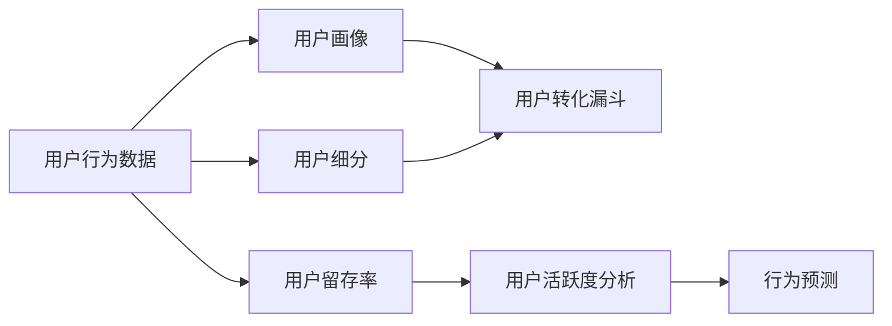

                 

# 如何进行有效的用户行为分析

## 1. 背景介绍

在当今数字化时代，理解用户行为对于产品开发和营销至关重要。通过分析用户行为，企业可以发现用户的需求、偏好和痛点，优化产品功能和用户体验，从而提升客户满意度和忠诚度，增加商业收益。然而，随着用户行为数据的激增，如何有效地进行用户行为分析成为了一项复杂而繁琐的任务。

本博客将全面介绍用户行为分析的原理与方法，从核心概念到具体技术实现，再到应用场景，旨在帮助读者深入理解用户行为分析的流程和细节，掌握实战技巧，应用到实际工作中。

## 2. 核心概念与联系

### 2.1 核心概念概述

用户行为分析旨在通过数据收集和分析，揭示用户与产品或服务互动的方式和模式。以下是几个核心概念：

- **用户行为数据**：包括用户在网站、应用、社交媒体等平台上的行为记录，如点击、浏览、购买、评论等。
- **用户画像**：基于用户行为数据生成的用户特征描述，用于描绘用户的基本特征和行为倾向。
- **用户细分**：根据不同维度（如地理位置、年龄、性别等）将用户划分为不同群组，便于深入分析和精细化运营。
- **用户转化漏斗**：用户从访问到转化过程中各个阶段的成功率和失败率，用于评估产品或服务的转化效果。
- **用户留存率**：用户在一段时间内继续使用产品或服务的比例，用于衡量产品黏性和用户忠诚度。

### 2.2 核心概念原理和架构的 Mermaid 流程图



以上流程图展示了用户行为分析的主要流程和技术架构：从数据收集到用户画像生成，再到用户细分和转化漏斗分析，最后进行用户留存率和活跃度分析，以及行为预测。

## 3. 核心算法原理 & 具体操作步骤

### 3.1 算法原理概述

用户行为分析涉及多种算法和模型，主要包括数据预处理、特征工程、模型选择和评估等环节。以下是一个简化版的流程概述：

1. **数据预处理**：清洗、去重、格式转换等。
2. **特征工程**：提取、选择、构建用户行为特征。
3. **模型选择**：选择合适的算法（如决策树、随机森林、神经网络等）。
4. **模型训练**：在训练集上训练模型。
5. **模型评估**：在测试集上评估模型性能。
6. **模型优化**：通过调参和交叉验证优化模型。
7. **结果应用**：将模型应用于实际业务场景，提升用户转化和留存。

### 3.2 算法步骤详解

#### 3.2.1 数据预处理

**步骤1：数据清洗**

数据清洗是用户行为分析的第一步。主要任务包括：
- **去重**：删除重复数据，避免影响分析结果。
- **缺失值处理**：填补缺失值或删除含有缺失值的数据记录。
- **异常值检测**：识别并处理异常值，避免对模型产生误导。

**步骤2：数据格式转换**

不同来源的数据格式各异，需要转换为统一的格式以便后续分析。常见格式转换包括：
- **日期时间格式统一**：将日期时间转换为标准格式。
- **数值类型统一**：将不同来源的数值类型转换为一致的数据类型。

#### 3.2.2 特征工程

**步骤1：特征提取**

特征提取是构建用户行为特征的关键步骤。常见的特征包括：
- **基本信息特征**：如用户ID、年龄、性别、地域等。
- **行为特征**：如点击次数、浏览时间、购买金额等。
- **时间特征**：如访问时间、购买时间、活跃时间等。

**步骤2：特征选择**

特征选择用于筛选出对用户行为分析有帮助的特征，避免过拟合。常用的特征选择方法包括：
- **相关系数分析**：评估特征与目标变量之间的相关性。
- **特征重要性排序**：使用随机森林、GBDT等模型评估特征重要性。

**步骤3：特征构建**

特征构建是指通过已有特征生成新的有意义的特征，如计算用户的平均访问时长、最近访问时间等。

#### 3.2.3 模型选择

**步骤1：算法选择**

根据用户行为分析的具体任务选择合适的算法。例如，预测用户转化率可使用逻辑回归、随机森林等；分类用户群体可使用K-means聚类、层次聚类等。

**步骤2：模型训练**

使用训练集对模型进行训练。常用的机器学习框架包括Scikit-learn、TensorFlow、PyTorch等。

**步骤3：模型评估**

在测试集上评估模型性能。常用的评估指标包括准确率、召回率、F1值、AUC等。

#### 3.2.4 模型优化

**步骤1：调参**

通过网格搜索、随机搜索等方法调整模型超参数，如学习率、正则化系数、树深度等。

**步骤2：交叉验证**

使用交叉验证评估模型在不同数据集上的泛化能力，避免过拟合。

**步骤3：模型融合**

通过集成多个模型提升性能，如使用Bagging、Boosting等方法。

### 3.3 算法优缺点

#### 3.3.1 优点

- **高效性**：自动化的数据处理和模型训练大大提高了分析效率。
- **灵活性**：能够处理多种类型的数据，适用于不同业务场景。
- **可解释性**：模型输出结果可解释性强，便于业务人员理解。

#### 3.3.2 缺点

- **数据质量依赖性强**：数据清洗和预处理的质量直接影响分析结果。
- **特征工程复杂**：需要丰富的特征工程经验。
- **模型选择难度大**：不同算法适用于不同任务，需要根据具体情况选择。

### 3.4 算法应用领域

用户行为分析广泛应用于以下几个领域：

1. **电商领域**：通过分析用户购买行为，优化商品推荐和定价策略，提升用户满意度和购买转化率。
2. **金融领域**：分析用户投资行为，预测风险和收益，优化资产配置和投资策略。
3. **广告领域**：通过用户点击和浏览行为预测广告效果，优化广告投放策略，提高广告ROI。
4. **社交媒体**：分析用户互动行为，优化内容推荐和用户增长策略，提高用户活跃度和留存率。
5. **移动应用**：分析用户使用行为，优化产品功能，提升用户粘性和满意度。

## 4. 数学模型和公式 & 详细讲解 & 举例说明

### 4.1 数学模型构建

用户行为分析的数学模型可以简单分为以下几类：

- **回归模型**：用于预测数值型变量，如用户消费金额。
- **分类模型**：用于分类用户群体，如高价值客户、流失客户等。
- **聚类模型**：用于将用户划分为不同的群体，便于细分和个性化运营。

### 4.2 公式推导过程

以用户转化漏斗分析为例，假设有一个二分类问题 $y \in \{0,1\}$，其中 $y=1$ 表示用户成功转化，$y=0$ 表示未转化。已知用户行为特征 $X$，转化率为 $p(y|X)$。

假设模型为逻辑回归，其对数似然函数为：

$$
\log L(\theta) = \sum_{i=1}^N [y_i \log(\sigma(X_i \theta)) + (1-y_i) \log(1-\sigma(X_i \theta))]
$$

其中，$\sigma(z) = \frac{1}{1+e^{-z}}$ 为sigmoid函数。

为了简化问题，假设数据集中 $y$ 只取 $0$ 和 $1$，则对数似然函数可以简化为：

$$
\log L(\theta) = \sum_{i=1}^N [y_i \log(\sigma(X_i \theta)) + (1-y_i) \log(1-\sigma(X_i \theta))]
$$

### 4.3 案例分析与讲解

**案例分析：电商用户购买行为预测**

- **数据预处理**：清洗数据，处理缺失值和异常值，将数据格式转换为一致的日期时间格式。
- **特征工程**：提取基本信息特征（如用户ID、年龄、地域等）、行为特征（如浏览次数、购买金额等）和时间特征（如访问时间、购买时间等）。
- **模型选择**：选择逻辑回归模型。
- **模型训练**：使用训练集训练模型，调整超参数，如学习率和正则化系数。
- **模型评估**：在测试集上评估模型性能，如准确率和召回率。

## 5. 项目实践：代码实例和详细解释说明

### 5.1 开发环境搭建

**步骤1：安装Python**

在搭建环境前，需要安装Python。常用的版本为3.6及以上。

**步骤2：安装机器学习库**

使用pip安装常用的机器学习库，如Scikit-learn、Pandas、NumPy等。

**步骤3：安装数据可视化工具**

安装Matplotlib、Seaborn等数据可视化工具，用于图表展示分析结果。

**步骤4：准备数据集**

准备用户行为数据集，并进行清洗和预处理。

### 5.2 源代码详细实现

以下是一个简单的用户购买行为预测模型的实现示例：

```python
import pandas as pd
from sklearn.model_selection import train_test_split
from sklearn.linear_model import LogisticRegression
from sklearn.metrics import accuracy_score

# 读取数据集
data = pd.read_csv('user_behavior.csv')

# 数据清洗和预处理
# 省略数据清洗和预处理代码

# 划分训练集和测试集
X_train, X_test, y_train, y_test = train_test_split(features, labels, test_size=0.2, random_state=42)

# 训练逻辑回归模型
model = LogisticRegression()
model.fit(X_train, y_train)

# 在测试集上评估模型性能
y_pred = model.predict(X_test)
accuracy = accuracy_score(y_test, y_pred)
print(f'Accuracy: {accuracy:.2f}')
```

### 5.3 代码解读与分析

上述代码实现了一个简单的逻辑回归模型，用于预测用户购买行为。

- **数据预处理**：省略部分代码，具体实现包括数据清洗、去重、缺失值处理和特征工程。
- **模型训练**：使用LogisticRegression模型训练模型，调整超参数。
- **模型评估**：在测试集上评估模型性能，使用准确率作为指标。

### 5.4 运行结果展示

运行上述代码，可以得到模型在测试集上的准确率。例如，如果输出为`Accuracy: 0.85`，则表示模型准确率为85%。

## 6. 实际应用场景

### 6.1 电商领域

电商用户购买行为分析可以优化商品推荐和定价策略。例如，通过分析用户购买记录，发现某类产品的购买转化率低，可以调整推荐算法和价格策略，提升用户购买意愿。

### 6.2 金融领域

金融领域可以分析用户投资行为，预测风险和收益，优化资产配置和投资策略。例如，通过分析用户的历史投资记录，预测其未来投资偏好，优化资产组合，提高投资收益。

### 6.3 广告领域

广告领域可以分析用户点击和浏览行为，预测广告效果，优化广告投放策略，提高广告ROI。例如，通过分析用户的浏览行为，预测其对不同广告的响应，优化广告投放位置和内容，提升广告效果。

### 6.4 未来应用展望

未来，用户行为分析技术将进一步提升。随着人工智能和机器学习技术的不断发展，用户行为分析将变得更加智能化和自动化。例如，利用深度学习模型进行用户行为预测，结合推荐系统优化推荐算法，提高用户体验和转化率。

## 7. 工具和资源推荐

### 7.1 学习资源推荐

- **《机器学习实战》**：这是一本经典的机器学习入门书籍，适合初学者学习用户行为分析的基本概念和算法。
- **Kaggle竞赛**：参与Kaggle竞赛，实战练习用户行为分析，提升数据分析能力。
- **Coursera课程**：Coursera提供了许多数据分析和机器学习课程，如斯坦福大学的机器学习课程，可以帮助用户系统掌握用户行为分析的技术。

### 7.2 开发工具推荐

- **Jupyter Notebook**：这是一个免费的交互式开发环境，适合快速实验和开发数据模型。
- **TensorBoard**：这是一个可视化工具，可以实时监测模型训练状态，提供详细的图表展示。
- **Scikit-learn**：这是一个常用的机器学习库，提供了丰富的数据预处理和模型训练功能。

### 7.3 相关论文推荐

- **User Behavior Prediction with Multi-dimensional Deep Neural Networks**：探讨如何使用深度神经网络预测用户行为，提高预测准确率。
- **Leveraging User Behavior Data for Personalization**：介绍如何利用用户行为数据进行个性化推荐，提升用户体验。
- **Anomaly Detection in User Behavior Analysis**：探讨如何检测用户行为中的异常行为，预测用户流失风险。

## 8. 总结：未来发展趋势与挑战

### 8.1 研究成果总结

用户行为分析技术已经在电商、金融、广告等多个领域取得了显著成效，显著提升了业务效率和用户满意度。未来，随着人工智能和机器学习技术的不断发展，用户行为分析将变得更加智能化和自动化。

### 8.2 未来发展趋势

- **深度学习应用**：深度学习模型在用户行为分析中的应用将越来越广泛，提升预测准确率。
- **多模态数据融合**：结合用户的多模态数据（如文本、图像、音频等），提升分析结果的全面性和准确性。
- **实时分析**：实时分析用户行为，及时发现和解决问题，提升用户满意度和留存率。

### 8.3 面临的挑战

- **数据隐私保护**：用户行为分析需要大量的个人数据，如何保护用户隐私成为重要问题。
- **数据质量问题**：数据质量直接影响分析结果，如何保证数据的质量和完整性是一个挑战。
- **计算资源消耗**：深度学习模型在分析大量用户数据时，需要大量的计算资源。

### 8.4 研究展望

未来，用户行为分析技术需要在数据隐私保护、数据质量提升和计算资源优化等方面进行深入研究，才能更好地服务于业务需求，提升用户体验和公司收益。

## 9. 附录：常见问题与解答

**Q1：用户行为数据如何收集？**

A: 用户行为数据可以通过网站、应用、社交媒体等多种渠道收集，包括点击、浏览、购买、评论等行为记录。

**Q2：用户行为分析需要哪些技术？**

A: 用户行为分析需要数据预处理、特征工程、模型选择和评估等技术。

**Q3：用户行为分析模型如何优化？**

A: 用户行为分析模型可以通过调参、交叉验证等方法进行优化。

**Q4：用户行为分析的案例有哪些？**

A: 用户行为分析在电商、金融、广告等领域都有广泛应用。

**Q5：用户行为分析的挑战有哪些？**

A: 用户行为分析面临数据隐私保护、数据质量问题和计算资源消耗等挑战。

---

作者：禅与计算机程序设计艺术 / Zen and the Art of Computer Programming

