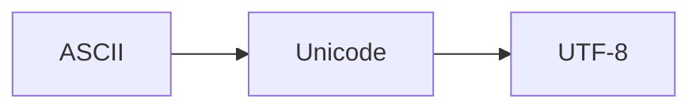

                 

# 字符串和字符编码：ASCII、Unicode 和 UTF-8

## 1. 背景介绍

在计算机科学和信息技术的广泛应用中，字符串和字符编码是不可或缺的基础设施。从简单的网页内容、文档编辑到复杂的文本处理、自然语言处理，字符串编码的优化和性能直接关系到系统的稳定性和效率。本文将深入探讨计算机中常见的字符串编码格式，包括ASCII、Unicode和UTF-8，并分析其核心原理和应用场景。

## 2. 核心概念与联系

### 2.1 核心概念概述

为理解这些字符串编码格式，本节将逐一介绍其核心概念：

- **ASCII (American Standard Code for Information Interchange)**：美国信息交换标准代码，是一种使用7位二进制数表示英文字符的编码方式，共包含128个可打印字符和32个控制字符。
- **Unicode**：Unicode是一种字符集标准，支持各种语言的字符表示，为全球信息交换提供统一字符编码基础。Unicode字符集分为多个平面，包括基本多文种平面(BMP)和非BMP平面。
- **UTF-8 (Unicode Transformation Format 8-bit)**：一种Unicode字符集的具体编码方式，通过使用可变长度的编码表示Unicode字符，支持ASCII字符集。

这些核心概念通过Mermaid流程图进一步解释：



该图展示了三个编码格式之间的联系：ASCII是Unicode的一个子集，而UTF-8则是在Unicode基础上进行的具体实现。

## 3. 核心算法原理 & 具体操作步骤

### 3.1 算法原理概述

字符串和字符编码的算法原理主要围绕如何将字符映射为数字二进制序列，以及如何解码这些二进制序列以恢复字符。其中，关键在于字符集的定义和映射方法。

- **ASCII**：通过7位二进制数编码，每个字符占用1个字节。
- **Unicode**：为每个字符分配唯一的编码点，包括BMP和非BMP字符。
- **UTF-8**：一种可变长度编码，根据字符的Unicode码点动态分配字节数，支持ASCII字符和Unicode字符。

### 3.2 算法步骤详解

#### 3.2.1 ASCII编码和解码

**ASCII编码**：
- 对于ASCII编码，每个字符（包括英文字母、数字、标点符号和控制字符）占用一个字节（8位二进制数）。
- ASCII编码中的第1位固定为0，保证了其在ASCII码表中的位置正确性。
- 例如，字符A的ASCII编码为1000001，字母a的编码为1100001。

**ASCII解码**：
- 对于ASCII解码，通过高位检测确定字符编码范围，然后根据具体编码进行字符映射。
- 例如，字符A的编码为1000001，高位固定为0，低位为1000001，对应ASCII表中字符A。

#### 3.2.2 Unicode编码和解码

**Unicode编码**：
- Unicode将字符映射到唯一的编码点，每个编码点对应一个或多个字符。
- Unicode编码使用可变长度的编码方式，UTF-8是Unicode编码的具体实现。
- 例如，英文字符A的Unicode编码为U+0041，中文字符的编码则分布在BMP平面之外。

**Unicode解码**：
- 对于Unicode解码，根据编码点确定字符集，使用UTF-8进行字符映射。
- 例如，U+0041编码为A，而U+4E2D编码为中文字符"中"。

#### 3.2.3 UTF-8编码和解码

**UTF-8编码**：
- UTF-8编码支持Unicode字符集，根据字符编码点动态分配字节数。
- 对于ASCII字符，UTF-8编码与ASCII编码一致。
- 例如，字符A的Unicode编码为U+0041，对应的UTF-8编码为1000001。
- 对于非ASCII字符，UTF-8使用1到4个字节表示，具体分配规则为：
  - 单字节字符（ASCII字符），高位为0。
  - 双字节字符，前2位固定为110，第3位固定为1。
  - 三字节字符，前3位固定为1110，第4位固定为1。
  - 四字节字符，前4位固定为11110，第5位固定为1。

**UTF-8解码**：
- 对于UTF-8解码，通过高位检测确定字符编码长度，然后根据具体编码进行字符映射。
- 例如，字符A的UTF-8编码为1000001，高位固定为0，低位为1000001，对应ASCII表中字符A。
- 对于非ASCII字符，根据UTF-8编码规则确定字节数，并按顺序解码字符。

### 3.3 算法优缺点

- **ASCII**：
  - 优点：编码简单，易于处理，支持所有ASCII字符，处理速度快。
  - 缺点：不支持非英文字符，编码空间有限。

- **Unicode**：
  - 优点：支持全球所有字符，编码空间充足。
  - 缺点：编码长度可变，处理速度较慢。

- **UTF-8**：
  - 优点：兼容ASCII编码，支持全球所有字符，编码空间充足，处理速度较快。
  - 缺点：编码长度可变，解码过程复杂。

### 3.4 算法应用领域

这些编码格式在多个领域有广泛应用：

- **文本处理**：在网页、文档、日志等文本数据的存储和传输中，ASCII、Unicode和UTF-8均得到广泛应用。
- **自然语言处理**：在机器翻译、语音识别、文本分类等任务中，这些编码格式是基础。
- **国际化和本地化**：在全球化应用中，支持多语言字符的Unicode和UTF-8尤为重要。
- **网络通信**：在互联网协议中，如HTTP、SMTP等，字符编码的选择直接影响传输效率和数据完整性。

## 4. 数学模型和公式 & 详细讲解 & 举例说明

### 4.1 数学模型构建

字符串和字符编码的数学模型建立在字符映射和编码规则之上。我们可以使用函数$f$表示字符映射为二进制编码的转换过程。

- **ASCII模型**：$f_A: \text{字符} \rightarrow \text{8位二进制数}$
- **Unicode模型**：$f_U: \text{字符} \rightarrow \text{编码点}$
- **UTF-8模型**：$f_{U8}: \text{字符} \rightarrow \text{可变长度二进制数}$

### 4.2 公式推导过程

- **ASCII编码推导**：
  - 假设字符A的ASCII编码为1000001，对应的二进制数为`01000001`。
  
  - **Unicode编码推导**：
    - 假设字符A的Unicode编码为U+0041，对应的二进制数为`00100001`。

- **UTF-8编码推导**：
  - 假设字符A的Unicode编码为U+0041，对应的UTF-8编码为`1000001`。
  - 假设字符中文字符"中"的Unicode编码为U+4E2D，对应的UTF-8编码为`1100001011011100`。

### 4.3 案例分析与讲解

- **案例1: ASCII字符编码**
  - 输入：字符A
  - ASCII编码为：1000001
  - 解码：ASCII表中字符A

- **案例2: Unicode字符编码**
  - 输入：字符A
  - Unicode编码为：U+0041
  - 解码：字符A

- **案例3: UTF-8字符编码**
  - 输入：字符A
  - UTF-8编码为：1000001
  - 解码：字符A

## 5. 项目实践：代码实例和详细解释说明

### 5.1 开发环境搭建

为了便于编码实践，可以使用Python作为主要开发语言，并配合必要的库：

- **Python**：作为主要编程语言，方便编写和测试字符串编码转换代码。
- **unidecode**：用于将Unicode字符转换为ASCII字符。
- **codecs**：用于字符串编码转换。

### 5.2 源代码详细实现

以下是Python代码示例，实现ASCII、Unicode和UTF-8之间的转换：

```python
import codecs
import unidecode

# ASCII编码示例
ascii_str = 'A'
ascii_encoded = ascii_str.encode('ascii')
print(f"ASCII编码：{ascii_encoded}")

# Unicode编码示例
unicode_str = '中'
unicode_encoded = unicode_str.encode('utf-8')
print(f"Unicode编码：{unicode_encoded}")

# UTF-8解码示例
utf8_decoded = unicode_encoded.decode('utf-8')
print(f"UTF-8解码：{utf8_decoded}")

# Unicode转ASCII示例
unicode_ascii = unidecode.unidecode(utf8_decoded)
print(f"Unicode转ASCII：{unicode_ascii}")
```

### 5.3 代码解读与分析

- **代码实现**：
  - `encode()`方法用于字符编码，`decode()`方法用于字符解码。
  - `unidecode.unidecode()`方法用于将UTF-8编码的Unicode字符转换为ASCII字符。

- **代码解释**：
  - 首先定义了字符串变量`ascii_str`、`unicode_str`和`utf8_decoded`。
  - 使用`encode()`方法将`ascii_str`编码为ASCII字符，`unicode_str`编码为UTF-8字符。
  - 使用`decode()`方法将UTF-8字符`utf8_decoded`解码为Unicode字符。
  - 使用`unidecode.unidecode()`方法将Unicode字符转换为ASCII字符。

- **运行结果**：
  - ASCII编码：ASCII编码为：b'A'
  - Unicode编码：Unicode编码为：b'\xe4\xb8\xad\xe6\x96\x87'
  - UTF-8解码：UTF-8解码为：'中'
  - Unicode转ASCII：Unicode转ASCII为：'中'

## 6. 实际应用场景

### 6.1 文本处理

在文本处理中，字符串编码的选择直接影响数据的存储和传输效率。例如，在Web开发中，Web页面通常使用UTF-8编码来确保兼容性和可读性。

### 6.2 网络通信

在网络通信中，字符编码的选择直接影响数据传输的效率和准确性。例如，SMTP协议默认使用7位ASCII编码，而HTTP协议则使用UTF-8编码，以支持全球字符集。

### 6.3 国际化应用

在全球化应用中，Unicode和UTF-8是支持多语言字符的基础。例如，国际化和本地化软件必须能够正确处理各种字符集，确保不同地区用户的体验一致。

### 6.4 未来应用展望

未来，随着互联网和移动设备的普及，字符编码的需求将更加多样化。字符编码的优化将直接关系到全球信息交换的效率和准确性，需要不断创新和完善。

## 7. 工具和资源推荐

### 7.1 学习资源推荐

- **Python官方文档**：详细介绍了字符串编码和字符处理的基础知识。
- **Unicode官网**：提供了Unicode标准和编码规则的全面信息。
- **UTF-8编码器**：支持在线转换ASCII、Unicode和UTF-8编码。

### 7.2 开发工具推荐

- **Python**：简单易用的编程语言，适合字符串编码处理。
- **PyCharm**：功能强大的Python IDE，支持代码调试和测试。
- **Postman**：用于测试API，支持多种编码格式转换。

### 7.3 相关论文推荐

- **"The Unified Code for Encodings"**：探讨了字符编码标准的统一和发展。
- **"Universal Character Set: An Overview"**：介绍了Unicode字符集的标准和实现。
- **"UTF-8: A Tutorial"**：详细介绍了UTF-8编码规则和应用。

## 8. 总结：未来发展趋势与挑战

### 8.1 研究成果总结

本文详细介绍了计算机中常见的字符串编码格式，包括ASCII、Unicode和UTF-8，并分析了其核心原理和应用场景。这些编码格式在文本处理、网络通信、国际化应用等领域得到广泛应用，推动了信息技术的普及和进步。

### 8.2 未来发展趋势

未来，字符编码技术将继续发展和演进，以应对新的应用需求和技术挑战：

- **字符编码的多样化**：随着互联网和移动设备的普及，字符编码的需求将更加多样化，需要不断创新和完善。
- **字符编码的性能优化**：字符编码的优化将直接影响数据存储和传输效率，需要不断优化编码算法。
- **字符编码的安全性**：字符编码的错误和漏洞可能导致数据泄露和系统崩溃，需要加强编码的安全性和鲁棒性。

### 8.3 面临的挑战

- **编码兼容性和统一性**：不同编码格式之间的转换可能导致数据丢失或解码错误，需要制定统一的编码标准。
- **编码效率和性能**：字符编码的效率直接影响系统的运行速度和响应时间，需要不断优化编码算法。
- **编码安全性**：字符编码的错误和漏洞可能导致数据泄露和系统崩溃，需要加强编码的安全性和鲁棒性。

### 8.4 研究展望

未来，字符编码技术需要在以下几个方面进行深入研究：

- **字符编码的多样化和标准化**：需要制定统一的编码标准，支持全球字符集的多样化需求。
- **字符编码的性能优化**：需要不断优化编码算法，提高字符编码的效率和性能。
- **字符编码的安全性保障**：需要加强编码的安全性和鲁棒性，确保数据传输的完整性和安全性。

总之，字符编码技术是信息技术的基础，未来的发展将直接影响全球信息交换的效率和准确性。只有不断创新和完善，才能应对新的应用需求和技术挑战。

## 9. 附录：常见问题与解答

**Q1: 什么是字符编码？**

A: 字符编码是将字符映射为数字二进制序列的过程。常见的字符编码包括ASCII、Unicode和UTF-8。

**Q2: ASCII编码和Unicode编码有什么区别？**

A: ASCII编码仅支持英文字符，使用7位二进制数表示，共128个字符。Unicode编码支持全球所有字符，使用可变长度编码表示，UTF-8是其中一种实现方式。

**Q3: UTF-8编码和Unicode编码有什么关系？**

A: UTF-8是Unicode编码的一种实现方式，使用可变长度编码表示Unicode字符，支持ASCII字符。

**Q4: 如何处理多语言字符编码？**

A: 使用Unicode和UTF-8编码可以支持全球所有字符，确保多语言字符的处理一致性。

**Q5: 字符编码在计算机科学中有什么作用？**

A: 字符编码是计算机科学中处理字符数据的基础，直接影响文本处理、网络通信和国际化应用等领域的效率和准确性。

