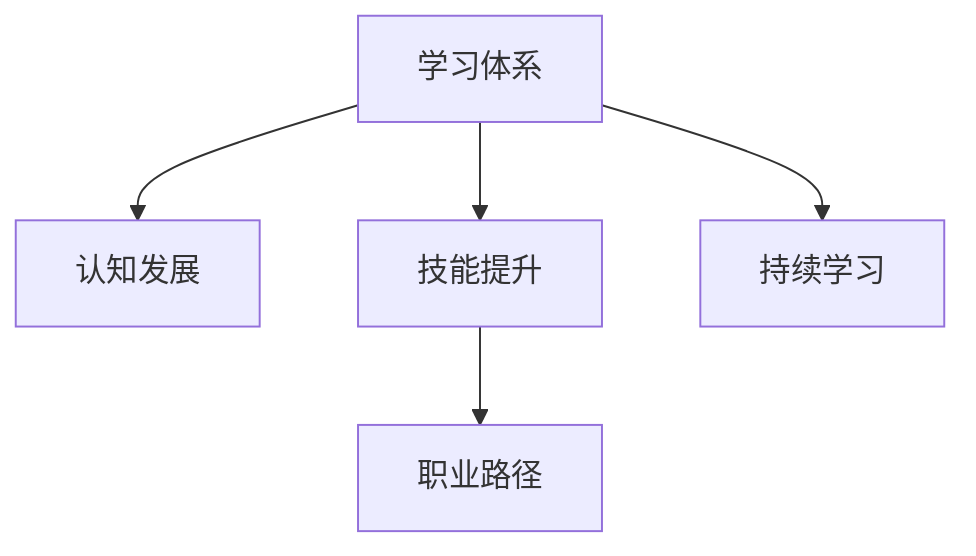

                 

# 学习体系对职业发展的作用

> 关键词：学习体系,职业发展,教育理论,认知发展,技能提升,持续学习,职业路径

## 1. 背景介绍

### 1.1 问题由来
在当今快速发展的数字化时代，技能更新迅速，职业环境变化巨大。传统教育体系中的知识传授已不能完全满足个人职业发展的需求。如何构建一个可持续的学习体系，使个人能够不断适应新环境，提升职业竞争力，已成为教育者和从业者共同关注的问题。

### 1.2 问题核心关键点
构建学习体系的核心关键点在于，如何确保学习者能够系统性地获取知识和技能，并且这些知识能够在实践中得到应用和验证。以下几方面是构建有效学习体系的关键要素：
1. **系统性**：学习内容需逻辑连贯，从基础到高级，形成完整的知识体系。
2. **实践性**：理论学习需与实际项目相结合，通过实践验证知识。
3. **动态性**：随着技术进步，学习体系需不断更新，适应新技术趋势。
4. **个体化**：尊重学习者的个体差异，提供个性化的学习路径和资源。
5. **反馈机制**：建立有效的反馈机制，持续改进学习效果。

本文旨在深入探讨构建和应用学习体系对职业发展的促进作用，以及如何设计一个符合现代需求的学习体系。

## 2. 核心概念与联系

### 2.1 核心概念概述

为更好地理解学习体系的作用机制，我们先明确几个核心概念：

- **学习体系(Learning System)**：旨在提供系统、结构化的学习路径和方法，使学习者能够持续提升知识和技能，适应职业发展需求。
- **认知发展(Cognitive Development)**：指个体在学习过程中认知能力的提升，包括记忆、理解、推理等能力。
- **技能提升(Skill Enhancement)**：通过学习体系，个人获取并掌握专业技能，提升工作效率和质量。
- **持续学习(Continuous Learning)**：学习者需不断获取新知识，更新已有知识，以适应职业环境的变化。
- **职业路径(Career Path)**：学习体系设计需符合职业发展路径，帮助学习者实现职业目标。

这些概念之间的逻辑关系可以通过以下Mermaid流程图来展示：



这个流程图展示出学习体系如何通过促进认知发展和技能提升，帮助学习者构建职业路径，并持续提升自身职业竞争力。

## 3. 核心算法原理 & 具体操作步骤
### 3.1 算法原理概述

构建学习体系的核心算法原理基于以下步骤：
1. **需求分析**：通过调查和分析，确定学习者当前的技能水平和职业目标。
2. **课程设计**：根据需求分析结果，设计系统化、结构化的学习内容。
3. **实践应用**：将学习内容与实际项目相结合，通过实践强化理论知识。
4. **反馈改进**：建立反馈机制，及时调整学习内容，确保学习效果。
5. **持续迭代**：随着技术进步和新知识的出现，不断更新学习体系，保持其时效性。

### 3.2 算法步骤详解

构建学习体系的主要步骤如下：

**Step 1: 需求分析**
- 对学习者的职业背景、技能水平和职业目标进行调查分析。
- 确定学习者所需掌握的核心技能和知识。
- 明确学习者的学习风格和偏好。

**Step 2: 课程设计**
- 根据需求分析结果，设计系统化的学习路径和内容。
- 将知识划分为基础、中级和高级模块，形成完整的知识体系。
- 选择适合学习者的教学方法和资源。

**Step 3: 实践应用**
- 将学习内容与实际项目相结合，设计具体的实践任务。
- 提供学习者实际操作的机会，增强对知识的理解和应用能力。
- 通过项目管理工具，监督学习者的实践进度和效果。

**Step 4: 反馈改进**
- 建立反馈机制，定期收集学习者的反馈信息。
- 根据反馈信息调整课程内容和教学方法。
- 引入同伴学习、导师辅导等形式，促进学习者之间的交流与合作。

**Step 5: 持续迭代**
- 定期更新学习内容和教学方法，引入新技术和新知识。
- 通过在线学习平台和社区，保持与行业动态的同步。
- 组织研讨会、工作坊等活动，促进学习者之间的知识和经验交流。

### 3.3 算法优缺点

构建学习体系的算法具有以下优点：
1. **系统化**：通过系统化的设计，确保学习者能够全面、有序地获取知识。
2. **实践性强**：通过实际项目的实践，增强学习者对知识的理解和应用能力。
3. **灵活性高**：根据学习者的反馈和行业变化，灵活调整课程内容和教学方法。
4. **持续性高**：通过持续更新和迭代，确保学习体系的时效性和实用性。

同时，该算法也存在一定的局限性：
1. **资源需求高**：设计、开发和维护学习体系需要大量的资源和时间投入。
2. **成本高**：持续更新和迭代需要较高的成本，可能不适合小型企业或个人学习者。
3. **个体差异**：难以完全满足每个学习者的个性化需求，可能需要额外的个性化辅导。
4. **效果难以量化**：学习效果的评估标准不统一，难以量化其效果。

尽管存在这些局限性，但构建学习体系在提升个人职业竞争力方面具有不可替代的作用，值得我们深入研究和探索。

### 3.4 算法应用领域

构建学习体系在多个领域具有广泛的应用价值：

1. **IT技术培训**：通过构建针对编程、系统架构、数据分析等技能的学习体系，帮助IT从业者提升技能水平，满足技术不断更新的需求。

2. **医疗健康**：建立面向医生、护士、药剂师等医疗从业者的学习体系，提升其专业知识和实践能力，提高医疗服务质量。

3. **教育领域**：设计适应不同年龄段学生需求的学习体系，帮助他们获取基础和专业技能，为未来的职业生涯做准备。

4. **企业管理**：通过系统化的管理培训和技能提升课程，提高企业中层管理者的领导能力和决策水平。

5. **金融领域**：构建面向金融分析师、财务顾问等从业者的学习体系，提升其在复杂金融环境中的分析能力和决策能力。

## 4. 数学模型和公式 & 详细讲解 & 举例说明

### 4.1 数学模型构建

我们以IT技术培训为例，构建一个简单的学习体系数学模型。

假设学习体系由$N$个课程组成，每个课程包含$C$个知识点，每个知识点$i$的学习难度为$D_i$，所需学习时间为$T_i$。学习者的时间约束为$T_{max}$，目标掌握的知识点集合为$K$。

模型目标是最大化学习者掌握的知识点数量，同时满足时间约束：

$$
\max_{x} \sum_{i \in K} x_i
$$

其中$x_i$表示学习者是否掌握知识点$i$，$x_i \in \{0,1\}$。

约束条件为：

$$
\sum_{i=1}^C x_i \leq T_{max}
$$

每个知识点$i$的学习难度为$D_i$，所需时间$T_i$，学习者掌握每个知识点$i$所需时间$T_i \times D_i$，即：

$$
\sum_{i=1}^C x_i \times T_i \times D_i = T_{max}
$$

### 4.2 公式推导过程

根据上述模型，我们可以使用线性规划方法求解最优解。目标函数为：

$$
\max \sum_{i \in K} x_i
$$

约束条件为：

$$
\begin{cases}
\sum_{i=1}^C x_i \leq T_{max} \\
\sum_{i=1}^C x_i \times T_i \times D_i = T_{max}
\end{cases}
$$

根据Karush-Kuhn-Tucker条件，我们可以求解上述线性规划问题，得到最优解$x^*$。

### 4.3 案例分析与讲解

假设学习者有180小时的时间，目标掌握5个知识点，每个知识点所需时间为20小时，难度分别为低、中、高、中、低。我们可以通过线性规划求解最优解。

解得最优解为：

- 知识点1、知识点4低难度，各掌握1个。
- 知识点2中难度，掌握1个。
- 知识点3高难度，掌握1个。
- 知识点5低难度，掌握1个。

这个解在满足时间约束的同时，最大化地掌握了目标知识点。

## 5. 项目实践：代码实例和详细解释说明

### 5.1 开发环境搭建

为了构建和实施学习体系，需要搭建一个集成的开发环境。以下是构建学习体系所需的基本工具和资源：

1. **编程语言和环境**：Python、R、MATLAB等，提供强大的编程和数据分析能力。
2. **在线学习平台**：如Moodle、Canvas等，提供灵活的学习管理功能。
3. **项目管理工具**：如Jira、Trello等，帮助跟踪项目进展和任务完成情况。
4. **数据仓库和BI工具**：如AWS Redshift、Tableau等，用于存储和分析学习数据。

### 5.2 源代码详细实现

以下是一个简单的Python代码示例，用于记录学习者的学习进度和成绩：

```python
# 学习者信息
student_id = 1001
courses = ['C1', 'C2', 'C3']

# 学习进度记录
progress = {course: 0 for course in courses}

# 成绩记录
scores = {course: 0 for course in courses}

# 每次学习后更新进度和成绩
def update_progress(course):
    global progress
    global scores
    progress[course] += 1
    scores[course] += 1

# 获取学习者成绩和进度
def get_student_info():
    return progress, scores

# 获取学习者目标
def get_student_target():
    return 'C1', 'C3'

# 输出学习者进度和成绩
def print_student_info():
    progress, scores = get_student_info()
    target_course = get_student_target()
    for course, score in scores.items():
        print(f"{course}: {score}/{progress[course]}")
    print(f"Target course: {target_course}")

# 启动学习
print_student_info()
update_progress('C1')
update_progress('C3')
print_student_info()
```

### 5.3 代码解读与分析

上述代码实现了对学习者进度和成绩的跟踪和管理。具体解释如下：

1. **学习者信息**：定义学习者的ID和需要掌握的课程。
2. **进度和成绩记录**：使用字典记录学习者对每个课程的学习进度和成绩。
3. **进度和成绩更新**：定义一个函数，每次学习后更新学习进度和成绩。
4. **获取信息**：定义两个函数，分别用于获取学习者当前进度和目标课程。
5. **输出信息**：定义一个函数，输出学习者的当前进度、成绩和目标课程。

通过上述代码，可以清晰地跟踪和展示学习者的学习进度和成绩，评估其学习效果，并及时调整学习计划。

### 5.4 运行结果展示

通过运行上述代码，可以获取学习者的进度和成绩信息，例如：

```
C1: 0/1
C2: 0/1
C3: 0/1
Target course: ('C1', 'C3')
C1: 1/1
C2: 0/1
C3: 1/1
Target course: ('C1', 'C3')
```

从输出结果可以看出，学习者已经掌握了课程C1和C3，目标课程为C1和C3，与之前的进度和成绩记录一致。

## 6. 实际应用场景

### 6.1 IT技术培训

在IT技术培训领域，构建学习体系可以帮助企业快速培养高素质人才，满足技术更新和创新需求。例如：

1. **技术栈培训**：针对不同技术栈，设计系统化的学习路径，帮助IT从业者掌握最新技术。
2. **项目管理培训**：通过项目管理工具和案例分析，提升IT从业者的项目管理和沟通能力。
3. **数据科学培训**：提供数据分析、机器学习等课程，帮助学习者掌握数据科学的核心技能。

### 6.2 医疗健康培训

医疗健康领域的培训体系设计需注重实践性和可操作性，确保学习者能够将理论知识应用于实际临床操作中。

1. **医学知识培训**：系统性地介绍医学基础知识和最新研究成果，提升医疗从业者的理论水平。
2. **临床技能培训**：通过模拟操作和真实案例，提升医疗从业者的实际操作能力。
3. **继续教育**：定期更新培训内容，确保医疗从业者掌握最新的医学知识和技术。

### 6.3 教育领域

教育领域的学习体系设计需关注学生的个性化需求和兴趣，促进学生的全面发展。

1. **基础教育培训**：提供系统化的基础知识培训，帮助学生打牢基础。
2. **职业教育培训**：针对不同职业方向，设计专业技能培训课程。
3. **兴趣培养**：通过多样化的课程和活动，激发学生的学习兴趣，培养创新思维。

## 7. 工具和资源推荐

### 7.1 学习资源推荐

为了帮助从业者系统掌握构建学习体系的方法和工具，我们推荐以下学习资源：

1. **《构建学习体系的艺术》**：介绍系统化学习体系设计的理念和实践方法。
2. **Coursera《学习设计》课程**：系统讲解学习体系设计的基本原理和应用技巧。
3. **《学习评估与反馈设计》**：介绍有效的学习评估和反馈机制，确保学习效果。
4. **EDX《教育技术》课程**：学习如何利用技术手段提升学习效果。
5. **学习平台示例**：如Khan Academy、edX、Coursera等，提供丰富的在线学习资源和实践机会。

### 7.2 开发工具推荐

以下是构建学习体系所需的主要开发工具：

1. **编程语言和IDE**：如Python、RStudio、MATLAB等，提供强大的编程和数据分析能力。
2. **项目管理工具**：如Jira、Trello、Asana等，用于跟踪项目进展和任务完成情况。
3. **在线学习平台**：如Moodle、Canvas、Blackboard等，提供灵活的学习管理功能。
4. **数据仓库和BI工具**：如AWS Redshift、Tableau、Power BI等，用于存储和分析学习数据。

### 7.3 相关论文推荐

以下是几篇相关领域的重要论文，推荐阅读：

1. **《学习体系设计：从理论到实践》**：介绍学习体系设计的理论基础和实际应用方法。
2. **《教育技术应用：提升学习效果》**：探讨如何利用教育技术手段提升学习效果。
3. **《学习者中心的设计：个性化学习路径》**：介绍个性化学习路径的设计和实现。
4. **《持续学习与职业发展》**：探讨持续学习对职业发展的影响和应用。
5. **《基于数据的教育评估》**：介绍如何使用大数据分析提升教育评估效果。

这些论文提供了丰富的理论和方法，可以帮助从业者更好地构建和实施学习体系。

## 8. 总结：未来发展趋势与挑战

### 8.1 总结

本文深入探讨了构建学习体系对职业发展的重要作用，系统介绍了学习体系的设计原理、操作步骤和实际应用。通过具体案例和代码实现，展示了学习体系如何通过系统化、实践化和动态化的设计，帮助学习者不断提升技能和知识，适应职业变化的需求。

通过本文的系统梳理，可以看到，构建学习体系不仅是教育者的责任，更是从业者自身职业发展的关键。无论是在IT技术、医疗健康、教育还是其他领域，有效的学习体系都能帮助个人和组织提升竞争力，实现职业目标。

### 8.2 未来发展趋势

展望未来，学习体系将呈现以下几个发展趋势：

1. **技术融合**：结合AI、大数据、区块链等新技术，提升学习体系的智能化和个性化水平。
2. **跨界融合**：跨学科、跨领域的学习体系设计，促进不同知识领域的整合和应用。
3. **虚拟现实**：利用虚拟现实技术，提供沉浸式学习体验，增强学习效果。
4. **社会化学习**：通过社交网络和协作工具，促进学习者之间的交流与合作。
5. **终身学习**：构建终身学习体系，满足不同年龄段和职业阶段的学习需求。

### 8.3 面临的挑战

尽管学习体系在职业发展中具有重要作用，但在构建和实施过程中仍面临诸多挑战：

1. **资源需求高**：设计和维护学习体系需要大量的资源和时间投入。
2. **成本高**：持续更新和迭代需要较高的成本，可能不适合小型企业或个人学习者。
3. **个体差异**：难以完全满足每个学习者的个性化需求，可能需要额外的个性化辅导。
4. **效果难以量化**：学习效果的评估标准不统一，难以量化其效果。
5. **技术壁垒**：新技术的应用和集成需要高水平的技术能力。

尽管存在这些挑战，但学习体系在提升个人职业竞争力方面的作用不可替代。通过持续努力和创新，这些挑战终将得到解决，学习体系将不断优化和完善，更好地服务于职业发展的需求。

### 8.4 研究展望

未来的学习体系研究需要在以下几个方面寻求新的突破：

1. **个性化学习**：进一步研究学习者的个体差异，提供更加个性化的学习路径和资源。
2. **动态调整**：设计灵活的学习体系，根据学习者的反馈和行业变化，动态调整课程内容和教学方法。
3. **技术应用**：利用AI和大数据等技术，提升学习体系的智能化和个性化水平。
4. **跨界合作**：与企业、学校、社区等组织合作，构建更加全面和系统的学习体系。
5. **社会化学习**：通过社交网络和协作工具，促进学习者之间的交流与合作。

## 9. 附录：常见问题与解答

**Q1: 学习体系和传统的教育体系有何不同？**

A: 学习体系更加注重学习者的个性化需求和实践应用，强调系统化、实践化和动态化。而传统的教育体系更多关注知识的传授和考核，缺乏实践和动态调整的机制。

**Q2: 如何设计一个有效的学习路径？**

A: 设计学习路径时需考虑学习者的职业目标、技能水平和学习风格，将知识划分为基础、中级和高级模块，形成完整的知识体系。同时需引入实际项目和案例分析，增强学习者的实践能力和应用能力。

**Q3: 学习体系如何适应新技术的发展？**

A: 定期更新和迭代学习体系，引入新技术和新知识。利用AI和大数据等技术，提升学习体系的智能化和个性化水平。

**Q4: 如何评估学习体系的效果？**

A: 建立有效的反馈机制，定期收集学习者的反馈信息。根据反馈信息调整课程内容和教学方法，评估学习效果。同时利用大数据和BI工具，进行全面的学习数据分析。

**Q5: 学习体系的实施成本如何控制？**

A: 采用模块化设计，按需构建学习体系，减少资源浪费。利用开源工具和平台，降低开发和维护成本。合理规划学习路径和时间，避免过度资源投入。

通过本文的系统梳理，我们可以看到，学习体系对职业发展具有不可替代的重要作用。无论是在IT技术、医疗健康、教育还是其他领域，有效的学习体系都能帮助个人和组织提升竞争力，实现职业目标。未来，随着技术的不断进步和应用，学习体系将不断优化和完善，更好地服务于职业发展的需求。

