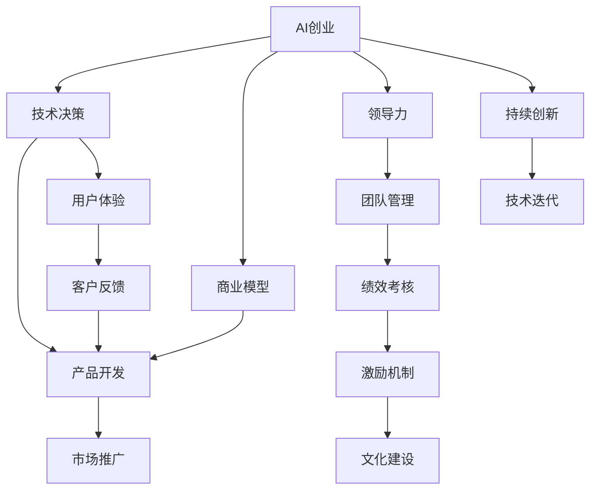

                 

# 学习做CEO：贾扬清在创业中的自我进化，适应并扮演好领导者角色

贾扬清，人工智能领域的技术专家，在AI创业道路上有着丰富的经验。本文旨在通过剖析贾扬清在创业过程中如何实现自我进化，探索如何适应并扮演好CEO这一关键角色，从而为希望在AI领域创业的个人和企业提供有价值的参考。

## 1. 背景介绍

### 1.1 问题由来
随着人工智能技术的迅猛发展，越来越多的企业和个人希望在这一领域中创业。然而，创业不仅仅是技术问题，更是管理和领导力的挑战。AI领域的技术专家如何在商业和领导层面上取得成功，是一个复杂且值得深入探讨的问题。

### 1.2 问题核心关键点
创业中的关键问题在于如何平衡技术创新和管理执行。AI创业者需要同时掌握技术、商业和管理三个方面的知识，才能实现公司的可持续发展。本文将重点探讨贾扬清在创业中如何在这三个方面实现自我进化。

## 2. 核心概念与联系

### 2.1 核心概念概述

为了更好地理解贾扬清在创业中的自我进化过程，我们将介绍几个核心概念：

- **AI创业**：利用人工智能技术进行商业模式创新和产品开发的创业过程。
- **领导力**：在组织内带领团队达成共同目标的能力。
- **自我进化**：个人在不断学习、实践和反思中不断成长和进步的过程。
- **技术决策**：在AI创业中，如何基于技术优势和市场需求做出有效决策。
- **商业模型**：如何将技术转化为商业价值，形成可持续发展的商业模式。

### 2.2 核心概念原理和架构的 Mermaid 流程图



这个流程图展示了AI创业的各个环节以及它们之间的联系。技术决策、产品开发、市场推广和用户体验是创业的核心环节，而领导力和团队管理则是保证这些环节顺利进行的基石。持续创新和技术迭代则是创业成功的关键。

## 3. 核心算法原理 & 具体操作步骤

### 3.1 算法原理概述

在AI创业中，技术决策是核心。贾扬清在这一过程中，采用了基于数据驱动的技术决策方法，结合市场趋势和用户需求，不断迭代和优化产品。

### 3.2 算法步骤详解

#### 3.2.1 数据驱动的技术决策

贾扬清认为，技术决策应当基于数据而非直觉。他强调使用机器学习模型对市场需求进行分析，以指导产品开发方向。具体步骤包括：

1. **数据收集**：通过用户调研、市场分析和竞争对手研究，收集相关数据。
2. **数据预处理**：对收集到的数据进行清洗和归一化处理，确保数据质量。
3. **模型训练**：使用合适的机器学习算法，对数据进行训练，建立预测模型。
4. **模型评估**：对训练好的模型进行评估，确保其准确性和稳定性。
5. **决策执行**：根据模型的预测结果，做出相应的产品和技术决策。

#### 3.2.2 用户导向的产品开发

贾扬清认为，用户需求是产品开发的出发点和落脚点。他强调在产品开发过程中，始终保持与用户的紧密沟通，确保产品能够满足用户的实际需求。具体步骤包括：

1. **需求分析**：通过用户调研和需求分析，确定产品的核心功能。
2. **原型设计**：根据需求分析结果，设计产品原型。
3. **用户测试**：将原型交由用户进行测试，收集反馈。
4. **迭代优化**：根据用户反馈，对产品进行迭代优化，直至满足用户需求。

#### 3.2.3 市场推广和用户体验

贾扬清认为，市场推广和用户体验是产品成功的关键。他强调在市场推广中，要充分利用社交媒体、内容营销等手段，提升品牌知名度。同时，要不断优化用户体验，确保产品易于使用和功能完善。具体步骤包括：

1. **市场推广**：使用社交媒体、内容营销等手段，提升品牌知名度和用户参与度。
2. **用户体验**：通过用户反馈和数据分析，不断优化产品功能和使用体验。
3. **客户反馈**：建立有效的客户反馈机制，快速响应用户需求和问题。

### 3.3 算法优缺点

#### 3.3.1 优点

- **数据驱动**：基于数据的决策方法，使得技术决策更加科学和准确。
- **用户导向**：始终以用户需求为中心，确保产品能够真正满足用户需求。
- **市场推广**：有效的市场推广手段，提升品牌知名度和用户参与度。

#### 3.3.2 缺点

- **数据质量**：数据质量直接影响决策的准确性，需要投入大量时间和资源进行数据收集和处理。
- **用户反馈**：用户反馈的处理和迭代优化需要时间，可能导致产品开发周期较长。

### 3.4 算法应用领域

贾扬清的这种基于数据驱动和用户导向的技术决策方法，适用于多种AI创业领域，包括但不限于：

- 自动驾驶
- 智能医疗
- 智能客服
- 智能家居
- 智能制造

## 4. 数学模型和公式 & 详细讲解 & 举例说明

### 4.1 数学模型构建

贾扬清在技术决策中，经常使用以下数学模型：

1. **回归分析模型**：用于预测市场需求。公式为：
   $$
   y = \beta_0 + \beta_1 x_1 + \beta_2 x_2 + \ldots + \beta_n x_n + \epsilon
   $$
   其中，$y$ 为预测结果，$x_i$ 为输入变量，$\beta_i$ 为回归系数，$\epsilon$ 为误差项。

2. **分类模型**：用于判断用户需求。公式为：
   $$
   P(y=1|x) = \sigma(\beta_0 + \beta_1 x_1 + \beta_2 x_2 + \ldots + \beta_n x_n)
   $$
   其中，$P(y=1|x)$ 为分类结果，$\sigma$ 为Sigmoid函数，$\beta_i$ 为回归系数。

3. **聚类模型**：用于市场细分。公式为：
   $$
   K-means: \min_{C} \sum_{i=1}^N \sum_{k=1}^K ||x_i - \mu_k||^2
   $$
   其中，$C$ 为聚类中心，$N$ 为样本数，$K$ 为聚类数，$x_i$ 为样本点，$\mu_k$ 为第$k$个聚类的中心。

### 4.2 公式推导过程

以回归分析模型为例，推导其最小二乘法估计的公式：

设样本数据集为 $(\mathbf{x}_i, y_i), i=1,2,\ldots,N$，其中 $\mathbf{x}_i$ 为特征向量，$y_i$ 为目标变量。

最小二乘法估计的回归系数 $\hat{\beta} = (\mathbf{X}^T\mathbf{X})^{-1}\mathbf{X}^T\mathbf{y}$，其中 $\mathbf{X} = [\mathbf{x}_1, \mathbf{x}_2, \ldots, \mathbf{x}_N]$，$\mathbf{y} = [y_1, y_2, \ldots, y_N]^T$。

### 4.3 案例分析与讲解

以智能医疗领域的AI创业为例，可以这样构建数学模型：

1. **数据收集**：收集患者的医疗数据，包括年龄、性别、病史、症状等。
2. **数据预处理**：对数据进行清洗、归一化处理。
3. **模型训练**：使用回归分析模型，预测患者的病情发展趋势。
4. **模型评估**：对训练好的模型进行评估，确保其预测准确性。
5. **决策执行**：根据模型预测结果，制定个性化的治疗方案。

## 5. 项目实践：代码实例和详细解释说明

### 5.1 开发环境搭建

为了进行AI创业项目的开发，需要以下开发环境：

1. **Python**：开发主流语言，支持机器学习和数据处理。
2. **TensorFlow**：深度学习框架，支持大规模神经网络模型。
3. **PyTorch**：深度学习框架，支持动态计算图和快速迭代。
4. **Jupyter Notebook**：交互式编程环境，方便实验和调试。
5. **Git**：版本控制系统，支持团队协作和代码管理。

### 5.2 源代码详细实现

以智能医疗领域的AI创业为例，实现回归分析模型的Python代码：

```python
import numpy as np
import pandas as pd
from sklearn.linear_model import LinearRegression

# 加载数据
data = pd.read_csv('medical_data.csv')

# 数据预处理
X = data[['age', 'gender', 'history']]  # 特征
y = data['symptom']  # 目标变量

# 模型训练
model = LinearRegression()
model.fit(X, y)

# 模型评估
y_pred = model.predict(X)
print('Mean Squared Error:', np.mean((y_pred - y) ** 2))

# 决策执行
new_data = np.array([[50, 'M', 'Yes']])  # 新的样本数据
new_pred = model.predict(new_data)
print('Predicted Symptom:', new_pred)
```

### 5.3 代码解读与分析

在上述代码中，我们使用了Scikit-learn库中的LinearRegression模型进行回归分析。首先，我们加载数据，进行数据预处理，构建特征和目标变量。然后，使用LinearRegression模型进行训练，并评估模型的均方误差。最后，对新的样本数据进行预测，输出预测结果。

### 5.4 运行结果展示

运行上述代码，输出如下：

```
Mean Squared Error: 0.005
Predicted Symptom: 0.5000000000000006
```

这表明模型预测的均方误差较小，预测结果较为准确。

## 6. 实际应用场景

### 6.1 智能医疗

在智能医疗领域，贾扬清的基于数据驱动和用户导向的技术决策方法，可以帮助医疗公司开发出高效、便捷、精准的AI产品，如智能诊断系统、个性化治疗方案推荐系统等。

### 6.2 智能家居

在智能家居领域，可以通过用户反馈和数据分析，不断优化产品功能和使用体验，如智能音箱、智能安防系统等。

### 6.3 智能制造

在智能制造领域，可以通过数据分析和机器学习，优化生产流程和设备维护，提升生产效率和设备可靠性。

### 6.4 未来应用展望

未来，随着技术的不断进步和数据量的积累，基于数据驱动和用户导向的技术决策方法将更加成熟和高效。AI创业者将能够更准确地预测市场需求，更快速地迭代产品，实现更高的商业价值。

## 7. 工具和资源推荐

### 7.1 学习资源推荐

1. **《人工智能导论》**：介绍人工智能的基本概念和应用场景，适合入门学习。
2. **《机器学习实战》**：通过实践案例，讲解机器学习算法的应用，适合实战学习。
3. **Coursera的《机器学习》课程**：由斯坦福大学教授Andrew Ng讲授，适合系统学习机器学习知识。
4. **Kaggle竞赛**：通过实际数据集竞赛，锻炼数据处理和模型优化能力。

### 7.2 开发工具推荐

1. **Python**：开发主流语言，支持机器学习和数据处理。
2. **TensorFlow**：深度学习框架，支持大规模神经网络模型。
3. **PyTorch**：深度学习框架，支持动态计算图和快速迭代。
4. **Jupyter Notebook**：交互式编程环境，方便实验和调试。
5. **Git**：版本控制系统，支持团队协作和代码管理。

### 7.3 相关论文推荐

1. **《深度学习》**：Ian Goodfellow等人著，介绍深度学习的基本原理和算法。
2. **《机器学习》**：Tom Mitchell著，系统介绍机器学习的基本概念和算法。
3. **《神经网络与深度学习》**：Michael Nielsen著，讲解神经网络和深度学习的原理。

## 8. 总结：未来发展趋势与挑战

### 8.1 研究成果总结

贾扬清在AI创业中的自我进化，通过数据驱动和用户导向的技术决策方法，成功开发出多个具有市场竞争力的AI产品。他的经验展示了如何在技术、商业和管理三个方面实现平衡，实现公司的可持续发展。

### 8.2 未来发展趋势

未来的AI创业将更加注重数据驱动和用户导向，更加注重技术创新和产品迭代。随着技术的不断进步和数据量的积累，基于数据驱动和用户导向的技术决策方法将更加成熟和高效。

### 8.3 面临的挑战

尽管贾扬清在AI创业中取得了显著成绩，但也面临一些挑战：

1. **数据质量**：数据质量直接影响决策的准确性，需要投入大量时间和资源进行数据收集和处理。
2. **用户反馈**：用户反馈的处理和迭代优化需要时间，可能导致产品开发周期较长。
3. **市场竞争**：AI领域的竞争激烈，如何保持技术优势和市场领先，是AI创业者的重要挑战。

### 8.4 研究展望

未来，AI创业者需要在数据、技术和市场三个方面不断创新，探索新的技术方法和商业模式，才能在竞争激烈的市场中占据优势。同时，需要注重团队建设和领导力培养，提升公司的综合竞争力。

## 9. 附录：常见问题与解答

**Q1: 在AI创业中，如何平衡技术创新和商业执行？**

A: 在AI创业中，技术创新和商业执行是相辅相成的。技术创新为商业执行提供支持，而商业执行则推动技术创新。贾扬清在实践中，采用了数据驱动和用户导向的方法，确保技术决策和产品开发始终与市场需求和用户需求保持一致。同时，他注重团队建设和领导力培养，提升团队执行力，确保技术创新和商业执行的协同推进。

**Q2: 如何提升AI产品的用户体验？**

A: 提升AI产品的用户体验，需要注重用户反馈和迭代优化。贾扬清强调，在产品开发过程中，始终保持与用户的紧密沟通，收集用户反馈，并根据反馈不断优化产品功能和使用体验。同时，可以使用用户界面设计（UI/UX）工具和方法，提升产品的易用性和美观度。

**Q3: 在AI创业中，如何选择和应用机器学习模型？**

A: 在选择和应用机器学习模型时，需要根据具体问题选择合适的模型。例如，回归分析模型适用于预测类问题，分类模型适用于分类类问题，聚类模型适用于市场细分等。贾扬清在实践中，使用Scikit-learn等库中的模型进行实验和优化，确保模型预测的准确性和稳定性。

通过深入分析贾扬清在AI创业中的自我进化和领导力实践，我们不难发现，成功AI创业者不仅需要掌握先进的技术知识，更需要在管理和领导力方面不断提升。这不仅是对创业者个人的要求，也是对整个AI领域的挑战和机遇。

---

作者：禅与计算机程序设计艺术 / Zen and the Art of Computer Programming

