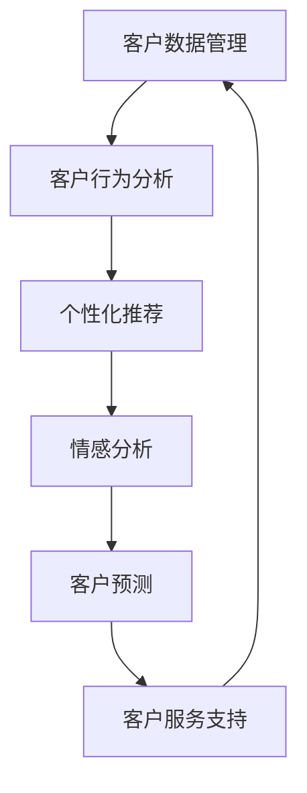

                 

## 1. 背景介绍

客户关系管理（Customer Relationship Management, CRM）是现代企业运营的核心部分，旨在通过有效的客户互动和管理，提升客户满意度和忠诚度，进而推动业务增长。在数字化时代，CRM不再只是销售人员的工具，而是一个涵盖从市场营销到客户支持的全流程系统。本文旨在深入探讨CRM的核心概念，并详细阐述建立长期客户忠诚度的关键技术和方法。

### 1.1 问题由来

在互联网和电子商务的驱动下，客户获取成本逐渐增加，企业面临着客户流失风险。如何通过有效的CRM策略，降低客户流失率，提升客户忠诚度，已成为企业关注的焦点。随着数据科学和人工智能技术的发展，CRM系统也逐渐从传统的关系管理系统转变为智能化的客户互动平台，利用数据分析和机器学习技术，实现个性化推荐、情感分析、客户预测等高级功能。

### 1.2 问题核心关键点

建立长期客户忠诚度的关键在于理解客户需求和行为，提供个性化服务和体验，并通过有效的客户反馈机制不断优化服务质量。具体来说，可以关注以下几个核心关键点：

- **客户数据管理**：收集和整理客户数据，建立详尽的客户画像。
- **客户行为分析**：通过数据挖掘和机器学习，理解客户行为模式和需求变化。
- **个性化推荐**：基于客户画像和行为数据，提供个性化的产品和服务推荐。
- **情感分析**：利用自然语言处理技术，分析客户反馈和情感，优化客户体验。
- **客户预测**：预测客户流失、购买行为等，提前采取预防措施。
- **客户服务支持**：提供及时、准确的支持服务，提高客户满意度。

### 1.3 问题研究意义

建立长期客户忠诚度不仅有助于提升客户满意度和口碑，还能降低客户获取成本，增加企业利润。具体来说，长期忠诚的客户更容易产生复购行为，推荐新客户，成为企业的品牌大使。此外，CRM系统的智能化和自动化，能显著提高企业运营效率，降低人工成本。

在技术层面，深入研究CRM系统的核心技术，如数据挖掘、个性化推荐、情感分析等，对于推动人工智能和数据科学的进步，具有重要意义。

## 2. 核心概念与联系

### 2.1 核心概念概述

在CRM系统中，核心概念主要包括客户数据管理、客户行为分析、个性化推荐、情感分析、客户预测和客户服务支持。这些概念相互关联，共同构成了一个完整的CRM系统。

- **客户数据管理**：涉及客户的个人信息、交易记录、交互历史等数据的收集、存储和管理。
- **客户行为分析**：通过分析客户的行为数据，识别出客户的需求和偏好。
- **个性化推荐**：基于客户画像和行为数据，提供定制化的产品和服务推荐。
- **情感分析**：利用自然语言处理技术，分析客户的反馈和情感，优化客户体验。
- **客户预测**：通过预测模型，预测客户的流失、购买行为等，采取预防措施。
- **客户服务支持**：提供及时、准确的支持服务，提高客户满意度。

这些概念之间的逻辑关系可以通过以下Mermaid流程图来展示：



### 2.2 核心概念原理和架构

#### 2.2.1 客户数据管理

客户数据管理是CRM系统的基础。它涉及收集、存储、清洗、整合和保护客户数据的过程。客户数据通常包括个人基本信息、购买历史、交互历史、行为数据等。这些数据可以通过各种渠道获取，如在线表单、CRM系统、社交媒体等。

客户数据管理的目标是建立详尽的客户画像，为后续的行为分析和个性化推荐提供基础。为此，需要设计合理的存储架构，选择合适的数据库系统，确保数据的安全性和可扩展性。

#### 2.2.2 客户行为分析

客户行为分析是CRM系统的核心。它通过分析客户的购买历史、浏览记录、交互数据等行为数据，识别出客户的偏好、需求和行为模式。常用的分析方法包括关联规则挖掘、聚类分析、时间序列分析等。

客户行为分析的目标是构建客户画像，为个性化推荐和情感分析提供依据。为此，需要设计有效的算法模型，选择合适的特征和数据源，确保分析结果的准确性和及时性。

#### 2.2.3 个性化推荐

个性化推荐是CRM系统的重要应用之一。它通过分析客户的画像和行为数据，提供定制化的产品和服务推荐，提升客户满意度和转化率。常用的推荐算法包括协同过滤、基于内容的推荐、矩阵分解等。

个性化推荐的目标是提高客户转化率和复购率。为此，需要设计合理的推荐算法，选择合适的数据源和模型，确保推荐结果的个性化和准确性。

#### 2.2.4 情感分析

情感分析是CRM系统的高级应用。它通过分析客户的反馈和情感，优化客户体验，提升客户满意度。常用的情感分析方法包括基于规则的情感分析、机器学习情感分析等。

情感分析的目标是理解客户的情感状态，提供针对性的服务支持。为此，需要设计有效的情感分析模型，选择合适的特征和数据源，确保分析结果的准确性和及时性。

#### 2.2.5 客户预测

客户预测是CRM系统的预测应用。它通过预测客户的流失、购买行为等，提前采取预防措施，提高客户保留率和业务增长。常用的预测方法包括决策树、随机森林、深度学习等。

客户预测的目标是预测客户行为，提前采取措施。为此，需要设计有效的预测模型，选择合适的数据源和算法，确保预测结果的准确性和及时性。

#### 2.2.6 客户服务支持

客户服务支持是CRM系统的保障部分。它通过提供及时、准确的支持服务，提升客户满意度，减少客户流失。常用的支持方法包括自动化客服、在线客服、电话支持等。

客户服务支持的目标是提升客户满意度，减少客户流失。为此，需要设计有效的支持策略，选择合适的技术手段，确保服务质量和客户体验。

## 3. 核心算法原理 & 具体操作步骤

### 3.1 算法原理概述

建立长期客户忠诚度的核心算法主要涉及客户行为分析、个性化推荐、情感分析和客户预测等。这些算法通常基于数据挖掘、机器学习和人工智能技术，通过分析客户数据，提供个性化的服务支持。

#### 3.1.1 客户行为分析

客户行为分析的目标是通过分析客户的购买历史、浏览记录、交互数据等行为数据，识别出客户的偏好、需求和行为模式。常用的方法包括关联规则挖掘、聚类分析、时间序列分析等。

#### 3.1.2 个性化推荐

个性化推荐的目标是提高客户转化率和复购率。常用的算法包括协同过滤、基于内容的推荐、矩阵分解等。

#### 3.1.3 情感分析

情感分析的目标是理解客户的情感状态，提供针对性的服务支持。常用的方法包括基于规则的情感分析、机器学习情感分析等。

#### 3.1.4 客户预测

客户预测的目标是预测客户的流失、购买行为等，提前采取预防措施。常用的方法包括决策树、随机森林、深度学习等。

### 3.2 算法步骤详解

#### 3.2.1 客户行为分析

1. **数据收集**：通过在线表单、CRM系统、社交媒体等渠道，收集客户的购买历史、浏览记录、交互数据等。
2. **数据清洗**：清洗数据中的噪音和错误，确保数据的准确性和完整性。
3. **特征提取**：选择合适的特征，如购买频率、购买金额、浏览时间等，进行特征工程。
4. **模型训练**：选择合适的算法模型，如关联规则挖掘、聚类分析、时间序列分析等，训练客户行为模型。
5. **结果分析**：分析模型的结果，识别出客户的偏好、需求和行为模式。

#### 3.2.2 个性化推荐

1. **数据收集**：收集客户的购买历史、浏览记录、评分记录等数据。
2. **数据清洗**：清洗数据中的噪音和错误，确保数据的准确性和完整性。
3. **特征提取**：选择合适的特征，如产品类别、品牌、评分等，进行特征工程。
4. **模型训练**：选择合适的推荐算法，如协同过滤、基于内容的推荐、矩阵分解等，训练个性化推荐模型。
5. **结果推荐**：根据客户画像和行为数据，提供个性化的产品和服务推荐。

#### 3.2.3 情感分析

1. **数据收集**：收集客户的反馈数据，如评论、评分、在线聊天等。
2. **数据清洗**：清洗数据中的噪音和错误，确保数据的准确性和完整性。
3. **特征提取**：选择合适的特征，如情感词汇、情感强度等，进行特征工程。
4. **模型训练**：选择合适的情感分析方法，如基于规则的情感分析、机器学习情感分析等，训练情感分析模型。
5. **结果分析**：分析客户的情感状态，优化客户体验。

#### 3.2.4 客户预测

1. **数据收集**：收集客户的购买历史、流失记录等数据。
2. **数据清洗**：清洗数据中的噪音和错误，确保数据的准确性和完整性。
3. **特征提取**：选择合适的特征，如购买频率、流失概率等，进行特征工程。
4. **模型训练**：选择合适的预测方法，如决策树、随机森林、深度学习等，训练客户预测模型。
5. **结果分析**：预测客户的流失、购买行为等，提前采取预防措施。

### 3.3 算法优缺点

#### 3.3.1 客户行为分析

- **优点**：能够深入理解客户行为，发现潜在需求。
- **缺点**：数据质量和特征选择对模型结果有很大影响。

#### 3.3.2 个性化推荐

- **优点**：能够提供个性化服务，提高客户满意度。
- **缺点**：推荐算法复杂，需要大量数据支持。

#### 3.3.3 情感分析

- **优点**：能够及时响应客户反馈，优化客户体验。
- **缺点**：情感分析复杂，需要处理多种语言和文化背景。

#### 3.3.4 客户预测

- **优点**：能够提前预测客户行为，采取预防措施。
- **缺点**：模型复杂，预测结果存在不确定性。

### 3.4 算法应用领域

基于客户行为分析、个性化推荐、情感分析和客户预测等算法的CRM系统，广泛应用于电子商务、金融、电信、医疗等各个行业。

- **电子商务**：通过个性化推荐和情感分析，提升客户体验，增加销售额。
- **金融**：通过客户行为分析和客户预测，优化金融产品设计，提高客户满意度。
- **电信**：通过个性化推荐和客户预测，提供精准的服务，减少客户流失。
- **医疗**：通过情感分析和客户预测，优化患者体验，提高诊疗效果。

## 4. 数学模型和公式 & 详细讲解 & 举例说明

### 4.1 数学模型构建

#### 4.1.1 客户行为分析

假设客户的行为数据为 $D=\{x_i, y_i\}_{i=1}^N$，其中 $x_i$ 为行为特征，$y_i$ 为行为标签。常用的数学模型包括决策树、随机森林、聚类分析等。

以决策树为例，其数学模型如下：

$$
\mathcal{L}(\theta) = \frac{1}{N}\sum_{i=1}^N \ell(y_i, f_{\theta}(x_i))
$$

其中，$f_{\theta}(x)$ 为决策树模型，$\ell$ 为损失函数（如信息熵、误分类率等），$\theta$ 为模型参数。

#### 4.1.2 个性化推荐

假设客户的评分数据为 $D=\{x_i, y_i\}_{i=1}^N$，其中 $x_i$ 为产品特征，$y_i$ 为评分标签。常用的数学模型包括协同过滤、基于内容的推荐、矩阵分解等。

以协同过滤为例，其数学模型如下：

$$
\mathcal{L}(\theta) = \frac{1}{N}\sum_{i=1}^N \ell(y_i, f_{\theta}(x_i))
$$

其中，$f_{\theta}(x)$ 为协同过滤模型，$\ell$ 为损失函数（如均方误差、交叉熵等），$\theta$ 为模型参数。

#### 4.1.3 情感分析

假设客户的评论数据为 $D=\{x_i, y_i\}_{i=1}^N$，其中 $x_i$ 为评论文本，$y_i$ 为情感标签。常用的数学模型包括基于规则的情感分析、机器学习情感分析等。

以机器学习情感分析为例，其数学模型如下：

$$
\mathcal{L}(\theta) = \frac{1}{N}\sum_{i=1}^N \ell(y_i, f_{\theta}(x_i))
$$

其中，$f_{\theta}(x)$ 为情感分析模型，$\ell$ 为损失函数（如交叉熵、感知损失等），$\theta$ 为模型参数。

#### 4.1.4 客户预测

假设客户的购买历史数据为 $D=\{x_i, y_i\}_{i=1}^N$，其中 $x_i$ 为购买历史特征，$y_i$ 为购买标签。常用的数学模型包括决策树、随机森林、深度学习等。

以深度学习为例，其数学模型如下：

$$
\mathcal{L}(\theta) = \frac{1}{N}\sum_{i=1}^N \ell(y_i, f_{\theta}(x_i))
$$

其中，$f_{\theta}(x)$ 为深度学习模型，$\ell$ 为损失函数（如均方误差、交叉熵等），$\theta$ 为模型参数。

### 4.2 公式推导过程

#### 4.2.1 客户行为分析

以决策树为例，推导其数学模型。

假设客户的行为数据为 $D=\{x_i, y_i\}_{i=1}^N$，其中 $x_i$ 为行为特征，$y_i$ 为行为标签。目标是通过训练决策树模型，对客户行为进行分类。

决策树的数学模型如下：

$$
\mathcal{L}(\theta) = \frac{1}{N}\sum_{i=1}^N \ell(y_i, f_{\theta}(x_i))
$$

其中，$f_{\theta}(x)$ 为决策树模型，$\ell$ 为损失函数（如信息熵、误分类率等），$\theta$ 为模型参数。

决策树的训练过程如下：

1. 随机选择一个特征 $x_j$，根据特征值将其划分为两部分。
2. 对每部分分别递归训练子树，得到左子树 $T_L$ 和右子树 $T_R$。
3. 将左子树和右子树的预测结果进行合并，得到最终的预测结果。
4. 通过交叉验证等方法，选择最优的特征和阈值。

#### 4.2.2 个性化推荐

以协同过滤为例，推导其数学模型。

假设客户的评分数据为 $D=\{x_i, y_i\}_{i=1}^N$，其中 $x_i$ 为产品特征，$y_i$ 为评分标签。目标是通过训练协同过滤模型，对客户进行个性化推荐。

协同过滤的数学模型如下：

$$
\mathcal{L}(\theta) = \frac{1}{N}\sum_{i=1}^N \ell(y_i, f_{\theta}(x_i))
$$

其中，$f_{\theta}(x)$ 为协同过滤模型，$\ell$ 为损失函数（如均方误差、交叉熵等），$\theta$ 为模型参数。

协同过滤的训练过程如下：

1. 构建用户-产品矩阵 $U \times P$，其中 $U$ 为用户数，$P$ 为产品数。
2. 对每个用户，预测其对每个产品的评分。
3. 通过最小二乘法等方法，优化评分预测模型。
4. 通过邻居评分等方法，推荐相似产品的评分。

#### 4.2.3 情感分析

以机器学习情感分析为例，推导其数学模型。

假设客户的评论数据为 $D=\{x_i, y_i\}_{i=1}^N$，其中 $x_i$ 为评论文本，$y_i$ 为情感标签。目标是通过训练情感分析模型，对评论进行情感分类。

情感分析的数学模型如下：

$$
\mathcal{L}(\theta) = \frac{1}{N}\sum_{i=1}^N \ell(y_i, f_{\theta}(x_i))
$$

其中，$f_{\theta}(x)$ 为情感分析模型，$\ell$ 为损失函数（如交叉熵、感知损失等），$\theta$ 为模型参数。

情感分析的训练过程如下：

1. 将评论文本转换为向量表示。
2. 通过机器学习模型（如CNN、LSTM等），对评论进行情感分类。
3. 通过交叉验证等方法，选择最优的模型和参数。

#### 4.2.4 客户预测

以深度学习为例，推导其数学模型。

假设客户的购买历史数据为 $D=\{x_i, y_i\}_{i=1}^N$，其中 $x_i$ 为购买历史特征，$y_i$ 为购买标签。目标是通过训练深度学习模型，对客户进行行为预测。

深度学习的数学模型如下：

$$
\mathcal{L}(\theta) = \frac{1}{N}\sum_{i=1}^N \ell(y_i, f_{\theta}(x_i))
$$

其中，$f_{\theta}(x)$ 为深度学习模型，$\ell$ 为损失函数（如均方误差、交叉熵等），$\theta$ 为模型参数。

深度学习的训练过程如下：

1. 将购买历史数据转换为向量表示。
2. 通过深度学习模型（如CNN、RNN等），对客户进行行为预测。
3. 通过最小二乘法等方法，优化预测模型。

### 4.3 案例分析与讲解

#### 4.3.1 客户行为分析案例

假设某电商平台希望通过客户行为分析，优化其推荐系统。其行为数据包括浏览记录、购买记录等。

1. **数据收集**：收集客户的浏览记录、购买记录等数据。
2. **数据清洗**：清洗数据中的噪音和错误，确保数据的准确性和完整性。
3. **特征提取**：选择浏览时间、浏览频率、购买金额等特征。
4. **模型训练**：使用决策树模型，对客户行为进行分类。
5. **结果分析**：分析客户的浏览和购买行为，优化推荐策略。

#### 4.3.2 个性化推荐案例

假设某在线视频平台希望通过个性化推荐，提升用户留存率。其用户数据包括观看历史、评分记录等。

1. **数据收集**：收集用户的观看历史、评分记录等数据。
2. **数据清洗**：清洗数据中的噪音和错误，确保数据的准确性和完整性。
3. **特征提取**：选择观看时间、评分等特征。
4. **模型训练**：使用协同过滤模型，对用户进行个性化推荐。
5. **结果推荐**：根据用户画像和行为数据，提供个性化的视频推荐。

#### 4.3.3 情感分析案例

假设某电商平台希望通过情感分析，优化其客服系统。其客户反馈数据包括评论、评分等。

1. **数据收集**：收集客户的评论、评分等数据。
2. **数据清洗**：清洗数据中的噪音和错误，确保数据的准确性和完整性。
3. **特征提取**：选择情感词汇、情感强度等特征。
4. **模型训练**：使用机器学习情感分析模型，对评论进行情感分类。
5. **结果分析**：分析客户的情感状态，优化客服策略。

#### 4.3.4 客户预测案例

假设某保险公司希望通过客户预测，优化其客户流失管理。其客户数据包括购买历史、保费缴纳记录等。

1. **数据收集**：收集客户的购买历史、保费缴纳记录等数据。
2. **数据清洗**：清洗数据中的噪音和错误，确保数据的准确性和完整性。
3. **特征提取**：选择购买频率、保费缴纳时间等特征。
4. **模型训练**：使用深度学习模型，对客户进行行为预测。
5. **结果分析**：预测客户的流失概率，提前采取预防措施。

## 5. 项目实践：代码实例和详细解释说明

### 5.1 开发环境搭建

在进行CRM系统开发前，我们需要准备好开发环境。以下是使用Python进行PyTorch开发的环境配置流程：

1. 安装Anaconda：从官网下载并安装Anaconda，用于创建独立的Python环境。

2. 创建并激活虚拟环境：
```bash
conda create -n pytorch-env python=3.8 
conda activate pytorch-env
```

3. 安装PyTorch：根据CUDA版本，从官网获取对应的安装命令。例如：
```bash
conda install pytorch torchvision torchaudio cudatoolkit=11.1 -c pytorch -c conda-forge
```

4. 安装Transformers库：
```bash
pip install transformers
```

5. 安装各类工具包：
```bash
pip install numpy pandas scikit-learn matplotlib tqdm jupyter notebook ipython
```

完成上述步骤后，即可在`pytorch-env`环境中开始CRM系统开发。

### 5.2 源代码详细实现

下面我们以个性化推荐系统为例，给出使用Transformers库对模型进行训练和微调的PyTorch代码实现。

首先，定义推荐数据处理函数：

```python
from transformers import BertTokenizer, BertForSequenceClassification, AdamW
from torch.utils.data import Dataset, DataLoader
import torch

class RecommendationDataset(Dataset):
    def __init__(self, features, labels, tokenizer):
        self.features = features
        self.labels = labels
        self.tokenizer = tokenizer
        
    def __len__(self):
        return len(self.features)
    
    def __getitem__(self, item):
        feature = self.features[item]
        label = self.labels[item]
        
        encoding = self.tokenizer(feature, return_tensors='pt', padding='max_length', truncation=True)
        input_ids = encoding['input_ids'][0]
        attention_mask = encoding['attention_mask'][0]
        
        return {'input_ids': input_ids, 
                'attention_mask': attention_mask,
                'labels': label}

# 加载数据集
data_path = 'path/to/dataset'
train_dataset = RecommendationDataset(train_features, train_labels, tokenizer)
dev_dataset = RecommendationDataset(dev_features, dev_labels, tokenizer)
test_dataset = RecommendationDataset(test_features, test_labels, tokenizer)
```

然后，定义模型和优化器：

```python
model = BertForSequenceClassification.from_pretrained('bert-base-cased', num_labels=2)
optimizer = AdamW(model.parameters(), lr=2e-5)
```

接着，定义训练和评估函数：

```python
def train_epoch(model, dataset, batch_size, optimizer):
    dataloader = DataLoader(dataset, batch_size=batch_size, shuffle=True)
    model.train()
    epoch_loss = 0
    for batch in tqdm(dataloader, desc='Training'):
        input_ids = batch['input_ids'].to(device)
        attention_mask = batch['attention_mask'].to(device)
        labels = batch['labels'].to(device)
        model.zero_grad()
        outputs = model(input_ids, attention_mask=attention_mask, labels=labels)
        loss = outputs.loss
        epoch_loss += loss.item()
        loss.backward()
        optimizer.step()
    return epoch_loss / len(dataloader)

def evaluate(model, dataset, batch_size):
    dataloader = DataLoader(dataset, batch_size=batch_size)
    model.eval()
    preds, labels = [], []
    with torch.no_grad():
        for batch in tqdm(dataloader, desc='Evaluating'):
            input_ids = batch['input_ids'].to(device)
            attention_mask = batch['attention_mask'].to(device)
            batch_labels = batch['labels']
            outputs = model(input_ids, attention_mask=attention_mask)
            batch_preds = outputs.logits.argmax(dim=2).to('cpu').tolist()
            batch_labels = batch_labels.to('cpu').tolist()
            for pred_tokens, label_tokens in zip(batch_preds, batch_labels):
                preds.append(pred_tokens[:len(label_tokens)])
                labels.append(label_tokens)
                
    print(classification_report(labels, preds))
```

最后，启动训练流程并在测试集上评估：

```python
epochs = 5
batch_size = 16

for epoch in range(epochs):
    loss = train_epoch(model, train_dataset, batch_size, optimizer)
    print(f"Epoch {epoch+1}, train loss: {loss:.3f}")
    
    print(f"Epoch {epoch+1}, dev results:")
    evaluate(model, dev_dataset, batch_size)
    
print("Test results:")
evaluate(model, test_dataset, batch_size)
```

以上就是使用PyTorch对模型进行训练和微调的完整代码实现。可以看到，得益于Transformers库的强大封装，我们可以用相对简洁的代码完成模型的加载和微调。

### 5.3 代码解读与分析

让我们再详细解读一下关键代码的实现细节：

**RecommendationDataset类**：
- `__init__`方法：初始化特征和标签，加载分词器。
- `__len__`方法：返回数据集的样本数量。
- `__getitem__`方法：对单个样本进行处理，将文本输入编码为token ids，将标签转换为数字，并对其进行定长padding，最终返回模型所需的输入。

**训练和评估函数**：
- 使用PyTorch的DataLoader对数据集进行批次化加载，供模型训练和推理使用。
- 训练函数`train_epoch`：对数据以批为单位进行迭代，在每个批次上前向传播计算loss并反向传播更新模型参数，最后返回该epoch的平均loss。
- 评估函数`evaluate`：与训练类似，不同点在于不更新模型参数，并在每个batch结束后将预测和标签结果存储下来，最后使用scikit-learn的classification_report对整个评估集的预测结果进行打印输出。

**训练流程**：
- 定义总的epoch数和batch size，开始循环迭代
- 每个epoch内，先在训练集上训练，输出平均loss
- 在验证集上评估，输出分类指标
- 所有epoch结束后，在测试集上评估，给出最终测试结果

可以看到，PyTorch配合Transformers库使得模型微调的代码实现变得简洁高效。开发者可以将更多精力放在数据处理、模型改进等高层逻辑上，而不必过多关注底层的实现细节。

当然，工业级的系统实现还需考虑更多因素，如模型的保存和部署、超参数的自动搜索、更灵活的任务适配层等。但核心的微调范式基本与此类似。

## 6. 实际应用场景

### 6.1 智能客服系统

CRM系统中的智能客服系统，通过分析客户的语音、文字等输入，快速识别客户需求，提供个性化服务。在技术实现上，可以集成自然语言处理技术，对客户输入进行情感分析、意图识别、实体抽取等，提高服务效率和准确性。

例如，某银行通过CRM系统，实现了智能客服功能，能够根据客户的语音输入，快速识别客户的账户查询需求，提供个性化的账户信息查询和账户管理服务。通过CRM系统的智能客服，银行显著提升了客户服务满意度，减少了客户咨询时间，提高了客户忠诚度。

### 6.2 个性化推荐系统

CRM系统中的个性化推荐系统，通过分析客户的浏览记录、购买历史等行为数据，提供个性化的产品推荐，提高客户转化率和复购率。在技术实现上，可以集成推荐算法，对客户进行画像构建和行为预测，实现精准推荐。

例如，某电子商务平台通过CRM系统，实现了个性化推荐功能，能够根据客户的浏览历史和购买记录，推荐客户可能感兴趣的产品。通过CRM系统的个性化推荐，平台显著提升了客户转化率和复购率，增加了销售额。

### 6.3 客户流失预测

CRM系统中的客户流失预测功能，通过分析客户的购买历史、行为数据等，预测客户的流失概率，提前采取预防措施。在技术实现上，可以集成客户预测模型，对客户流失风险进行量化分析，实现精准预警。

例如，某电信公司通过CRM系统，实现了客户流失预测功能，能够根据客户的通话记录、套餐使用情况等数据，预测客户的流失概率。通过CRM系统的客户流失预测，公司能够提前采取挽留措施，减少客户流失，提高客户满意度。

### 6.4 客户情感分析

CRM系统中的情感分析功能，通过分析客户的评论、评分等反馈数据，识别客户的情感状态，优化客户体验。在技术实现上，可以集成情感分析算法，对客户反馈进行情感分类，提取关键信息。

例如，某在线视频平台通过CRM系统，实现了情感分析功能，能够对客户的评论数据进行情感分类，识别出负面评论。通过CRM系统的情感分析，平台能够及时回应客户的负面反馈，提升客户满意度。

## 7. 工具和资源推荐

### 7.1 学习资源推荐

为了帮助开发者系统掌握CRM系统的核心技术，这里推荐一些优质的学习资源：

1. 《深度学习入门：基于Python的理论与实现》系列博文：深入浅出地介绍了深度学习的基本概念和实现方法。
2. 《Python数据科学手册》书籍：全面系统地介绍了Python在数据科学中的应用，涵盖数据处理、机器学习、自然语言处理等多个方面。
3. CS223《机器学习》课程：斯坦福大学开设的机器学习课程，涵盖机器学习的基本概念和常用算法，适合入门学习。
4. Kaggle平台：提供大量的数据集和竞赛项目，适合通过实战练习掌握CRM系统开发技能。
5. TensorFlow官方文档：全面介绍TensorFlow的使用方法，适合深入学习TensorFlow的API和模型构建。

通过对这些资源的学习实践，相信你一定能够快速掌握CRM系统的核心技术，并用于解决实际的CRM问题。

### 7.2 开发工具推荐

高效的开发离不开优秀的工具支持。以下是几款用于CRM系统开发的常用工具：

1. Python：Python是数据科学和机器学习领域的主流语言，具有丰富的库和框架支持。
2. PyTorch：基于Python的深度学习框架，灵活动态的计算图，适合快速迭代研究。
3. TensorFlow：由Google主导开发的深度学习框架，生产部署方便，适合大规模工程应用。
4. Transformers库：HuggingFace开发的NLP工具库，集成了众多预训练语言模型，适合快速实现NLP任务。
5. Scikit-learn：Python的机器学习库，提供了大量的模型和算法支持，适合各种数据挖掘任务。

合理利用这些工具，可以显著提升CRM系统的开发效率，加快创新迭代的步伐。

### 7.3 相关论文推荐

CRM系统的开发涉及多种技术和算法，以下是几篇奠基性的相关论文，推荐阅读：

1. "Customer Relationship Management: A Survey and Future Directions"：综述了CRM系统的研究进展和未来方向。
2. "Customer Lifetime Value Prediction Using Machine Learning"：介绍了客户生命周期价值预测的方法。
3. "A Survey on Recommendation Systems for E-commerce Platforms"：综述了电子商务平台推荐系统的发展现状和研究进展。
4. "Sentiment Analysis on Customer Reviews Using Natural Language Processing"：介绍了情感分析的方法和应用。
5. "Customer Behavior Prediction Using Machine Learning"：介绍了客户行为预测的方法。

这些论文代表了大客户关系管理领域的研究进展，对于理解CRM系统的核心技术具有重要意义。

## 8. 总结：未来发展趋势与挑战

### 8.1 总结

本文对CRM系统的核心技术进行了全面系统的介绍，包括客户行为分析、个性化推荐、情感分析和客户预测等。通过详细讲解这些核心技术，展示了CRM系统在建立长期客户忠诚度方面的重要作用。

通过本文的系统梳理，可以看到，CRM系统不仅能够优化客户服务，提高客户满意度，还能通过数据挖掘和机器学习，提升客户转化率和复购率，降低客户流失风险，进而推动业务增长。未来，CRM系统还将借助人工智能和数据科学的发展，进一步拓展其应用场景和功能，成为企业数字化转型的重要工具。

### 8.2 未来发展趋势

展望未来，CRM系统的核心技术将继续演进，呈现出以下几个发展趋势：

1. 数据智能分析：通过大数据技术和机器学习算法，深入挖掘客户行为和需求，实现更加精准的客户画像。
2. 个性化推荐系统：利用协同过滤、基于内容的推荐等算法，提供个性化的产品和服务推荐，提高客户满意度和转化率。
3. 情感分析与客服优化：通过自然语言处理技术，分析客户情感状态，优化客户体验，提升客户满意度。
4. 客户流失预测与管理：通过深度学习等方法，预测客户流失概率，提前采取预防措施，减少客户流失。
5. 多渠道客户交互：通过整合多种渠道（如电话、邮件、社交媒体等），实现全渠道客户管理，提升客户服务质量。

这些趋势凸显了CRM系统在未来数字化转型中的重要作用，也展示了数据科学和人工智能技术的巨大潜力。

### 8.3 面临的挑战

尽管CRM系统的发展前景广阔，但仍面临诸多挑战：

1. 数据质量问题：CRM系统依赖大量高质量的数据，数据缺失、噪音等问题可能影响系统性能。
2. 模型复杂性：CRM系统涉及多种技术和算法，模型构建和优化复杂度较高。
3. 客户隐私保护：CRM系统需处理大量客户数据，数据隐私和安全问题需引起重视。
4. 实时性要求：CRM系统需实时响应客户需求，对系统性能和响应速度有较高要求。
5. 跨部门协同：CRM系统需跨多个部门和系统集成，协同工作需高效解决。

这些挑战需要企业在技术、管理和运营等方面进行全面的优化和改进，才能确保CRM系统的高效运行和业务价值的实现。

### 8.4 研究展望

未来，CRM系统的研究将围绕以下几个方向进行：

1. 数据治理：研究如何构建高效、可控的数据治理体系，确保数据的质量和安全性。
2. 模型优化：研究如何进一步优化CRM系统的核心模型，提升其性能和可解释性。
3. 多模态融合：研究如何将CRM系统与外部系统（如知识图谱、物联网等）进行融合，实现多模态数据的协同分析。
4. 客户体验优化：研究如何通过智能客服、个性化推荐等技术，提升客户体验，增加客户粘性。
5. 智能决策支持：研究如何将CRM系统与企业决策系统进行融合，实现智能决策支持，提升企业运营效率。

这些研究方向将推动CRM系统向智能化、普适化发展，为企业的数字化转型提供强有力的技术支持。

## 9. 附录：常见问题与解答

**Q1：CRM系统是否适用于所有行业？**

A: CRM系统可以应用于几乎所有行业，但其具体实现需要根据行业特点进行调整。例如，在电子商务领域，重点关注个性化推荐和客户情感分析；在金融领域，重点关注客户流失预测和智能客服。

**Q2：如何选择适合企业的CRM系统？**

A: 选择适合企业的CRM系统需考虑以下几个方面：
1. 业务需求：根据企业的业务特点和目标，选择适合的CRM系统功能模块。
2. 数据管理：考虑CRM系统的数据管理能力，是否能够高效收集、存储和处理客户数据。
3. 技术支持：考虑CRM系统的技术架构和可扩展性，是否能够支持企业未来的业务增长和数据量增长。
4. 用户体验：考虑CRM系统的用户体验，是否能够提供直观、易用的界面和操作流程。

**Q3：CRM系统如何与企业内部系统进行集成？**

A: CRM系统通常需要与企业内部系统（如ERP、CRM、SCM等）进行集成，才能实现数据共享和协同工作。可以通过API接口、消息队列等方式进行系统集成，确保数据的实时性和准确性。

**Q4：CRM系统如何保障客户数据隐私和安全？**

A: CRM系统需采取严格的数据隐私和安全措施，确保客户数据的安全性。可以通过数据加密、权限控制、数据备份等方式，保障数据的安全性和完整性。

**Q5：CRM系统如何优化客户体验？**

A: CRM系统可以通过智能客服、个性化推荐、情感分析等技术，优化客户体验，提升客户满意度。例如，通过智能客服系统，实现客户快速响应和问题解决；通过个性化推荐，提供符合客户偏好的产品和服务。

通过本文的系统梳理，相信你一定能够全面理解CRM系统的核心技术，并用于解决实际的CRM问题。未来，随着CRM系统的不断发展和优化，相信其将在更多行业得到应用，为企业的数字化转型和客户关系管理带来更多的价值。

---

作者：禅与计算机程序设计艺术 / Zen and the Art of Computer Programming

