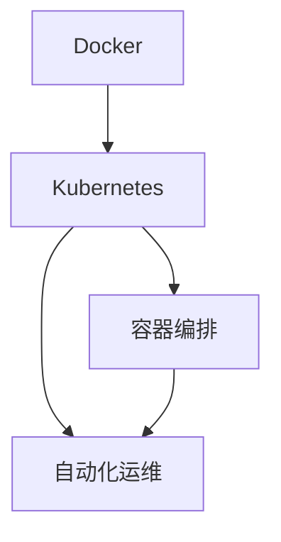

                 

## 1. 背景介绍

### 1.1 问题由来

在传统的软件部署和运维环境中，开发人员往往需要面对复杂的操作系统依赖、环境配置、版本管理等挑战。这不仅增加了开发和运维的成本，还导致了应用的部署不稳定、运维困难等问题。因此，越来越多的企业开始探索新的解决方案，以提升软件交付的效率和质量。

在这一背景下，容器化技术应运而生。容器化技术通过将应用程序及其依赖打包在一个独立的容器实例中，解决了传统部署中的诸多问题。容器化技术不仅提升了软件部署的效率，还实现了跨平台、跨环境的一致性。

### 1.2 问题核心关键点

容器化技术主要有Docker和Kubernetes两大核心组件。其中，Docker负责应用和依赖的打包和隔离，而Kubernetes则负责容器的编排、调度和运维。这两个组件通过协同工作，实现了从开发到生产的全生命周期管理，极大地简化了软件交付和运维过程。

本文将系统介绍Docker和Kubernetes的基本原理和使用方法，并深入探讨其核心算法和操作步骤，结合实际项目实践，剖析其优缺点及应用领域，最后总结未来发展趋势和面临的挑战，为容器化技术的深入应用提供全面的指导。

## 2. 核心概念与联系

### 2.1 核心概念概述

为了更好地理解Docker和Kubernetes的工作原理和相互关系，本节将介绍几个关键概念：

- Docker：一个开源的容器化平台，用于打包应用和依赖，创建轻量级、独立运行的容器实例。
- Kubernetes：一个开源的容器编排平台，用于管理和调度Docker容器，实现容器的自动部署、扩缩容、监控和恢复等。
- 容器化：将应用程序及其依赖打包在独立容器实例中，实现应用的隔离、自动化和跨平台部署。
- 容器编排：通过Kubernetes等工具，管理和调度Docker容器，实现自动化的容器生命周期管理。
- 自动化运维：通过容器编排平台，实现容器的自动化部署、升级、监控和恢复，提升运维效率和稳定性。

这些概念之间存在密切联系。Docker负责将应用和依赖打包成容器，Kubernetes则负责管理这些容器的生命周期，通过容器编排实现应用的自动化运维。

### 2.2 核心概念原理和架构的 Mermaid 流程图



该图展示了Docker和Kubernetes之间的联系和作用。Docker负责将应用打包成容器，而Kubernetes则通过容器编排实现自动化运维，并通过API接口与Docker进行交互。

## 3. 核心算法原理 & 具体操作步骤

### 3.1 算法原理概述

Docker和Kubernetes的核心算法原理主要围绕容器化和容器编排展开。容器化通过将应用程序及其依赖打包在独立的容器实例中，实现了应用的隔离和自动化部署。容器编排则通过管理和调度Docker容器，实现了自动化运维和容器的动态调整。

Docker的核心算法包括容器镜像构建、容器实例创建和运行。Kubernetes的核心算法包括容器编排、自动扩展和资源调度。

### 3.2 算法步骤详解

#### 3.2.1 Docker容器化

1. **容器镜像构建**：将应用程序和其依赖打包在Docker容器中。Docker镜像包含应用程序的代码、依赖库、配置文件等。

   ```bash
   docker build -t myapp .
   ```

2. **容器实例创建和运行**：通过Docker容器运行应用程序。

   ```bash
   docker run -p 8080:8080 myapp
   ```

#### 3.2.2 Kubernetes容器编排

1. **部署和调度**：通过Kubernetes Deployment资源，定义应用的部署和调度策略。

   ```yaml
   apiVersion: apps/v1
   kind: Deployment
   metadata:
     name: myapp
   spec:
     replicas: 3
     selector:
       matchLabels:
         app: myapp
     template:
       metadata:
         labels:
           app: myapp
       spec:
         image: myapp:latest
         ports:
         - containerPort: 8080
   ```

2. **自动化扩展和资源调度**：通过Kubernetes Horizontal Pod Autoscaler(HPA)资源，实现容器的自动扩展。

   ```yaml
   apiVersion: autoscaling/v1
   kind: HorizontalPodAutoscaler
   metadata:
     name: myapp-hpa
   spec:
     scaleTargetRef:
       apiVersion: v1
       kind: Deployment
       name: myapp
     minReplicas: 2
     maxReplicas: 5
     metrics:
     - type: Resource
       resource:
         name: cpu
         target:
           operator: GreaterThanOrEqual
           value: 50m
   ```

3. **监控和恢复**：通过Kubernetes Deployment资源，实现容器的监控和恢复。

   ```yaml
   apiVersion: apps/v1
   kind: Deployment
   metadata:
     name: myapp
   spec:
     replicas: 3
     selector:
       matchLabels:
         app: myapp
     template:
       metadata:
         labels:
           app: myapp
       spec:
         image: myapp:latest
         ports:
         - containerPort: 8080
     strategy:
       type: Recreate
   ```

#### 3.2.3 完整流程

1. **构建Docker镜像**：将应用程序及其依赖打包在Docker容器中。

   ```bash
   docker build -t myapp .
   ```

2. **创建Kubernetes Deployment**：定义应用的部署和调度策略。

   ```yaml
   apiVersion: apps/v1
   kind: Deployment
   metadata:
     name: myapp
   spec:
     replicas: 3
     selector:
       matchLabels:
         app: myapp
     template:
       metadata:
         labels:
           app: myapp
       spec:
         image: myapp:latest
         ports:
         - containerPort: 8080
   ```

3. **创建Kubernetes HPA**：实现容器的自动扩展。

   ```yaml
   apiVersion: autoscaling/v1
   kind: HorizontalPodAutoscaler
   metadata:
     name: myapp-hpa
   spec:
     scaleTargetRef:
       apiVersion: v1
       kind: Deployment
       name: myapp
     minReplicas: 2
     maxReplicas: 5
     metrics:
     - type: Resource
       resource:
         name: cpu
         target:
           operator: GreaterThanOrEqual
           value: 50m
   ```

4. **部署和运行**：通过Docker容器运行应用程序。

   ```bash
   docker run -p 8080:8080 myapp
   ```

### 3.3 算法优缺点

Docker和Kubernetes的优点包括：

1. **容器化**：通过将应用程序及其依赖打包在独立的容器实例中，实现了应用的隔离和自动化部署。

2. **自动化运维**：通过容器编排，实现了容器的自动化部署、扩展、监控和恢复，提升了运维效率和稳定性。

3. **跨平台和跨环境一致性**：通过容器化，实现了应用的跨平台和跨环境一致性部署。

Docker和Kubernetes的缺点包括：

1. **学习曲线**：Docker和Kubernetes的使用需要一定的学习曲线，初学者可能需要一段时间才能熟练掌握。

2. **复杂性**：容器的管理、编排和调度可能变得复杂，需要一定的技术积累和管理经验。

3. **资源消耗**：容器的启动和运行可能消耗更多资源，尤其是在高并发环境中。

### 3.4 算法应用领域

Docker和Kubernetes在以下领域得到广泛应用：

1. **云原生应用**：云原生应用通过容器化、微服务化、自动化部署等技术，提升了应用的灵活性和可伸缩性。

2. **持续集成和持续部署**：CI/CD流程通过容器化、自动化部署等技术，实现了快速的软件交付和迭代。

3. **DevOps**：DevOps通过容器化、自动化运维等技术，提升了软件开发和运维的效率和质量。

4. **微服务架构**：微服务架构通过容器化、服务发现等技术，实现了应用的模块化和可扩展性。

5. **容器编排平台**：通过Kubernetes等容器编排平台，实现了容器的自动化管理、扩展和恢复，提升了运维效率和稳定性。

## 4. 数学模型和公式 & 详细讲解 & 举例说明

### 4.1 数学模型构建

Docker和Kubernetes的核心算法可以抽象为数学模型。以下是一些关键模型的构建。

#### 4.1.1 容器镜像构建

Docker容器镜像构建过程可以抽象为将应用程序及其依赖打包在独立的容器中。假设应用程序的代码存储在文件`myapp.py`中，依赖库存储在`requirements.txt`中，则容器镜像的构建过程如下：

1. **创建Dockerfile**：定义容器镜像构建的配置。

   ```dockerfile
   FROM python:3.8
   WORKDIR /app
   COPY requirements.txt requirements.txt
   RUN pip install -r requirements.txt
   COPY . .
   CMD ["python", "myapp.py"]
   ```

2. **构建镜像**：通过Dockerfile构建容器镜像。

   ```bash
   docker build -t myapp .
   ```

#### 4.1.2 容器实例创建和运行

容器实例创建和运行过程可以抽象为将应用程序及其依赖打包在独立的容器中，并启动容器实例。假设应用程序的Docker镜像为`myapp:latest`，则容器实例的创建和运行过程如下：

1. **创建容器实例**：通过Docker run命令启动容器实例。

   ```bash
   docker run -p 8080:8080 myapp
   ```

2. **容器实例运行**：通过Docker run命令启动容器实例，并在后台运行。

   ```bash
   docker run -d -p 8080:8080 myapp
   ```

#### 4.1.3 容器编排

容器编排过程可以抽象为通过Kubernetes Deployment资源，定义和调度容器实例。假设应用程序的Docker镜像为`myapp:latest`，则容器编排过程如下：

1. **创建Kubernetes Deployment**：通过Kubernetes Deployment资源定义应用的部署和调度策略。

   ```yaml
   apiVersion: apps/v1
   kind: Deployment
   metadata:
     name: myapp
   spec:
     replicas: 3
     selector:
       matchLabels:
         app: myapp
     template:
       metadata:
         labels:
           app: myapp
       spec:
         image: myapp:latest
         ports:
         - containerPort: 8080
   ```

2. **创建Kubernetes HPA**：通过Kubernetes Horizontal Pod Autoscaler资源实现容器的自动扩展。

   ```yaml
   apiVersion: autoscaling/v1
   kind: HorizontalPodAutoscaler
   metadata:
     name: myapp-hpa
   spec:
     scaleTargetRef:
       apiVersion: v1
       kind: Deployment
       name: myapp
     minReplicas: 2
     maxReplicas: 5
     metrics:
     - type: Resource
       resource:
         name: cpu
         target:
           operator: GreaterThanOrEqual
           value: 50m
   ```

### 4.2 公式推导过程

#### 4.2.1 容器镜像构建

Docker容器镜像构建过程可以抽象为将应用程序及其依赖打包在独立的容器中。假设应用程序的代码存储在文件`myapp.py`中，依赖库存储在`requirements.txt`中，则容器镜像的构建过程如下：

1. **创建Dockerfile**：定义容器镜像构建的配置。

   ```dockerfile
   FROM python:3.8
   WORKDIR /app
   COPY requirements.txt requirements.txt
   RUN pip install -r requirements.txt
   COPY . .
   CMD ["python", "myapp.py"]
   ```

2. **构建镜像**：通过Dockerfile构建容器镜像。

   ```bash
   docker build -t myapp .
   ```

#### 4.2.2 容器实例创建和运行

容器实例创建和运行过程可以抽象为将应用程序及其依赖打包在独立的容器中，并启动容器实例。假设应用程序的Docker镜像为`myapp:latest`，则容器实例的创建和运行过程如下：

1. **创建容器实例**：通过Docker run命令启动容器实例。

   ```bash
   docker run -p 8080:8080 myapp
   ```

2. **容器实例运行**：通过Docker run命令启动容器实例，并在后台运行。

   ```bash
   docker run -d -p 8080:8080 myapp
   ```

#### 4.2.3 容器编排

容器编排过程可以抽象为通过Kubernetes Deployment资源，定义和调度容器实例。假设应用程序的Docker镜像为`myapp:latest`，则容器编排过程如下：

1. **创建Kubernetes Deployment**：通过Kubernetes Deployment资源定义应用的部署和调度策略。

   ```yaml
   apiVersion: apps/v1
   kind: Deployment
   metadata:
     name: myapp
   spec:
     replicas: 3
     selector:
       matchLabels:
         app: myapp
     template:
       metadata:
         labels:
           app: myapp
       spec:
         image: myapp:latest
         ports:
         - containerPort: 8080
   ```

2. **创建Kubernetes HPA**：通过Kubernetes Horizontal Pod Autoscaler资源实现容器的自动扩展。

   ```yaml
   apiVersion: autoscaling/v1
   kind: HorizontalPodAutoscaler
   metadata:
     name: myapp-hpa
   spec:
     scaleTargetRef:
       apiVersion: v1
       kind: Deployment
       name: myapp
     minReplicas: 2
     maxReplicas: 5
     metrics:
     - type: Resource
       resource:
         name: cpu
         target:
           operator: GreaterThanOrEqual
           value: 50m
   ```

### 4.3 案例分析与讲解

#### 4.3.1 Docker容器镜像构建

Docker容器镜像构建过程可以抽象为将应用程序及其依赖打包在独立的容器中。假设应用程序的代码存储在文件`myapp.py`中，依赖库存储在`requirements.txt`中，则容器镜像的构建过程如下：

1. **创建Dockerfile**：定义容器镜像构建的配置。

   ```dockerfile
   FROM python:3.8
   WORKDIR /app
   COPY requirements.txt requirements.txt
   RUN pip install -r requirements.txt
   COPY . .
   CMD ["python", "myapp.py"]
   ```

2. **构建镜像**：通过Dockerfile构建容器镜像。

   ```bash
   docker build -t myapp .
   ```

#### 4.3.2 容器实例创建和运行

容器实例创建和运行过程可以抽象为将应用程序及其依赖打包在独立的容器中，并启动容器实例。假设应用程序的Docker镜像为`myapp:latest`，则容器实例的创建和运行过程如下：

1. **创建容器实例**：通过Docker run命令启动容器实例。

   ```bash
   docker run -p 8080:8080 myapp
   ```

2. **容器实例运行**：通过Docker run命令启动容器实例，并在后台运行。

   ```bash
   docker run -d -p 8080:8080 myapp
   ```

#### 4.3.3 容器编排

容器编排过程可以抽象为通过Kubernetes Deployment资源，定义和调度容器实例。假设应用程序的Docker镜像为`myapp:latest`，则容器编排过程如下：

1. **创建Kubernetes Deployment**：通过Kubernetes Deployment资源定义应用的部署和调度策略。

   ```yaml
   apiVersion: apps/v1
   kind: Deployment
   metadata:
     name: myapp
   spec:
     replicas: 3
     selector:
       matchLabels:
         app: myapp
     template:
       metadata:
         labels:
           app: myapp
       spec:
         image: myapp:latest
         ports:
         - containerPort: 8080
   ```

2. **创建Kubernetes HPA**：通过Kubernetes Horizontal Pod Autoscaler资源实现容器的自动扩展。

   ```yaml
   apiVersion: autoscaling/v1
   kind: HorizontalPodAutoscaler
   metadata:
     name: myapp-hpa
   spec:
     scaleTargetRef:
       apiVersion: v1
       kind: Deployment
       name: myapp
     minReplicas: 2
     maxReplicas: 5
     metrics:
     - type: Resource
       resource:
         name: cpu
         target:
           operator: GreaterThanOrEqual
           value: 50m
   ```

## 5. 项目实践：代码实例和详细解释说明

### 5.1 开发环境搭建

#### 5.1.1 安装Docker

1. **安装Docker**：根据官方文档下载并安装Docker。

   ```bash
   sudo apt-get update
   sudo apt-get install -y apt-transport-https
   curl -fsSL https://download.docker.com/linux/debian/gpg | sudo apt-key add -
   sudo apt-add-repository "deb [arch=amd64] https://download.docker.com/linux/debian stretch stable"
   sudo apt-get update
   sudo apt-get install -y docker-ce
   sudo systemctl start docker
   sudo systemctl enable docker
   ```

2. **创建Docker用户**：创建Docker用户并设置权限。

   ```bash
   sudo usermod -aG docker $USER
   ```

3. **测试Docker**：通过Docker run命令测试Docker安装是否成功。

   ```bash
   docker run hello-world
   ```

#### 5.1.2 安装Kubernetes

1. **安装Kubernetes**：根据官方文档下载并安装Kubernetes。

   ```bash
   sudo apt-get update
   sudo apt-get install -y apt-transport-https
   curl -fsSL https://packages.cloud.google.com/apt/doc/apt-key.gpg | sudo apt-key add -
   sudo add-apt-repository "deb [arch=amd64] http://apt.kubernetes.io/ kubernetes-xenial main"
   sudo apt-get update
   sudo apt-get install -y kubelet kubeadm kubectl
   sudo systemctl enable kubelet kubeadm kubectl
   ```

2. **测试Kubernetes**：通过kubectl命令测试Kubernetes安装是否成功。

   ```bash
   kubectl cluster-info
   ```

#### 5.1.3 创建Kubernetes集群

1. **初始化Kubernetes集群**：通过kubeadm init命令初始化Kubernetes集群。

   ```bash
   sudo kubeadm init --kubelet-advertise-address=0.0.0.0:1025 --node-ipc-mode=host
   ```

2. **获取Kubernetes配置**：通过kubeadm init命令获取Kubernetes配置文件。

   ```bash
   sudo kubeadm init --kubelet-advertise-address=0.0.0.0:1025 --node-ipc-mode=host
   ```

3. **添加Kubernetes用户**：通过kubectl --kubeconfig命令添加Kubernetes用户。

   ```bash
   sudo kubeadm init --kubelet-advertise-address=0.0.0.0:1025 --node-ipc-mode=host
   kubectl create user default
   kubectl create user default --disable
   kubectl create user default --disable
   ```

4. **测试Kubernetes集群**：通过kubectl commands命令测试Kubernetes集群。

   ```bash
   kubectl get nodes
   kubectl get pods
   ```

### 5.2 源代码详细实现

#### 5.2.1 容器镜像构建

1. **创建Dockerfile**：定义容器镜像构建的配置。

   ```dockerfile
   FROM python:3.8
   WORKDIR /app
   COPY requirements.txt requirements.txt
   RUN pip install -r requirements.txt
   COPY . .
   CMD ["python", "myapp.py"]
   ```

2. **构建镜像**：通过Dockerfile构建容器镜像。

   ```bash
   docker build -t myapp .
   ```

#### 5.2.2 容器实例创建和运行

1. **创建容器实例**：通过Docker run命令启动容器实例。

   ```bash
   docker run -p 8080:8080 myapp
   ```

2. **容器实例运行**：通过Docker run命令启动容器实例，并在后台运行。

   ```bash
   docker run -d -p 8080:8080 myapp
   ```

#### 5.2.3 容器编排

1. **创建Kubernetes Deployment**：通过Kubernetes Deployment资源定义应用的部署和调度策略。

   ```yaml
   apiVersion: apps/v1
   kind: Deployment
   metadata:
     name: myapp
   spec:
     replicas: 3
     selector:
       matchLabels:
         app: myapp
     template:
       metadata:
         labels:
           app: myapp
       spec:
         image: myapp:latest
         ports:
         - containerPort: 8080
   ```

2. **创建Kubernetes HPA**：通过Kubernetes Horizontal Pod Autoscaler资源实现容器的自动扩展。

   ```yaml
   apiVersion: autoscaling/v1
   kind: HorizontalPodAutoscaler
   metadata:
     name: myapp-hpa
   spec:
     scaleTargetRef:
       apiVersion: v1
       kind: Deployment
       name: myapp
     minReplicas: 2
     maxReplicas: 5
     metrics:
     - type: Resource
       resource:
         name: cpu
         target:
           operator: GreaterThanOrEqual
           value: 50m
   ```

#### 5.2.4 完整流程

1. **构建Docker镜像**：将应用程序及其依赖打包在Docker容器中。

   ```bash
   docker build -t myapp .
   ```

2. **创建Kubernetes Deployment**：定义应用的部署和调度策略。

   ```yaml
   apiVersion: apps/v1
   kind: Deployment
   metadata:
     name: myapp
   spec:
     replicas: 3
     selector:
       matchLabels:
         app: myapp
     template:
       metadata:
         labels:
           app: myapp
       spec:
         image: myapp:latest
         ports:
         - containerPort: 8080
   ```

3. **创建Kubernetes HPA**：实现容器的自动扩展。

   ```yaml
   apiVersion: autoscaling/v1
   kind: HorizontalPodAutoscaler
   metadata:
     name: myapp-hpa
   spec:
     scaleTargetRef:
       apiVersion: v1
       kind: Deployment
       name: myapp
     minReplicas: 2
     maxReplicas: 5
     metrics:
     - type: Resource
       resource:
         name: cpu
         target:
           operator: GreaterThanOrEqual
           value: 50m
   ```

4. **部署和运行**：通过Docker容器运行应用程序。

   ```bash
   docker run -p 8080:8080 myapp
   ```

### 5.3 代码解读与分析

#### 5.3.1 容器镜像构建

Docker容器镜像构建过程可以抽象为将应用程序及其依赖打包在独立的容器中。假设应用程序的代码存储在文件`myapp.py`中，依赖库存储在`requirements.txt`中，则容器镜像的构建过程如下：

1. **创建Dockerfile**：定义容器镜像构建的配置。

   ```dockerfile
   FROM python:3.8
   WORKDIR /app
   COPY requirements.txt requirements.txt
   RUN pip install -r requirements.txt
   COPY . .
   CMD ["python", "myapp.py"]
   ```

2. **构建镜像**：通过Dockerfile构建容器镜像。

   ```bash
   docker build -t myapp .
   ```

#### 5.3.2 容器实例创建和运行

容器实例创建和运行过程可以抽象为将应用程序及其依赖打包在独立的容器中，并启动容器实例。假设应用程序的Docker镜像为`myapp:latest`，则容器实例的创建和运行过程如下：

1. **创建容器实例**：通过Docker run命令启动容器实例。

   ```bash
   docker run -p 8080:8080 myapp
   ```

2. **容器实例运行**：通过Docker run命令启动容器实例，并在后台运行。

   ```bash
   docker run -d -p 8080:8080 myapp
   ```

#### 5.3.3 容器编排

容器编排过程可以抽象为通过Kubernetes Deployment资源，定义和调度容器实例。假设应用程序的Docker镜像为`myapp:latest`，则容器编排过程如下：

1. **创建Kubernetes Deployment**：通过Kubernetes Deployment资源定义应用的部署和调度策略。

   ```yaml
   apiVersion: apps/v1
   kind: Deployment
   metadata:
     name: myapp
   spec:
     replicas: 3
     selector:
       matchLabels:
         app: myapp
     template:
       metadata:
         labels:
           app: myapp
       spec:
         image: myapp:latest
         ports:
         - containerPort: 8080
   ```

2. **创建Kubernetes HPA**：通过Kubernetes Horizontal Pod Autoscaler资源实现容器的自动扩展。

   ```yaml
   apiVersion: autoscaling/v1
   kind: HorizontalPodAutoscaler
   metadata:
     name: myapp-hpa
   spec:
     scaleTargetRef:
       apiVersion: v1
       kind: Deployment
       name: myapp
     minReplicas: 2
     maxReplicas: 5
     metrics:
     - type: Resource
       resource:
         name: cpu
         target:
           operator: GreaterThanOrEqual
           value: 50m
   ```

#### 5.3.4 完整流程

1. **构建Docker镜像**：将应用程序及其依赖打包在Docker容器中。

   ```bash
   docker build -t myapp .
   ```

2. **创建Kubernetes Deployment**：定义应用的部署和调度策略。

   ```yaml
   apiVersion: apps/v1
   kind: Deployment
   metadata:
     name: myapp
   spec:
     replicas: 3
     selector:
       matchLabels:
         app: myapp
     template:
       metadata:
         labels:
           app: myapp
       spec:
         image: myapp:latest
         ports:
         - containerPort: 8080
   ```

3. **创建Kubernetes HPA**：实现容器的自动扩展。

   ```yaml
   apiVersion: autoscaling/v1
   kind: HorizontalPodAutoscaler
   metadata:
     name: myapp-hpa
   spec:
     scaleTargetRef:
       apiVersion: v1
       kind: Deployment
       name: myapp
     minReplicas: 2
     maxReplicas: 5
     metrics:
     - type: Resource
       resource:
         name: cpu
         target:
           operator: GreaterThanOrEqual
           value: 50m
   ```

4. **部署和运行**：通过Docker容器运行应用程序。

   ```bash
   docker run -p 8080:8080 myapp
   ```

### 5.4 运行结果展示

#### 5.4.1 Docker容器实例

Docker容器实例可以通过`docker run`命令启动和运行。

```bash
docker run -p 8080:8080 myapp
```

#### 5.4.2 Kubernetes容器实例

Kubernetes容器实例可以通过Kubernetes Deployment资源定义和调度。

```yaml
apiVersion: apps/v1
kind: Deployment
metadata:
  name: myapp
spec:
  replicas: 3
  selector:
    matchLabels:
      app: myapp
  template:
    metadata:
      labels:
        app: myapp
      spec:
        image: myapp:latest
        ports:
        - containerPort: 8080
```

#### 5.4.3 Kubernetes HPA

Kubernetes HPA可以通过Kubernetes Horizontal Pod Autoscaler资源实现容器的自动扩展。

```yaml
apiVersion: autoscaling/v1
kind: HorizontalPodAutoscaler
metadata:
  name: myapp-hpa
spec:
  scaleTargetRef:
    apiVersion: v1
    kind: Deployment
    name: myapp
  minReplicas: 2
  maxReplicas: 5
  metrics:
  - type: Resource
    resource:
      name: cpu
      target:
        operator: GreaterThanOrEqual
        value: 50m
```

## 6. 实际应用场景

### 6.1 智能运维

智能运维是大语言模型和容器化技术的重要应用场景。通过容器化技术，将监控工具、日志处理工具等打包在容器中，实现了运维操作的自动化和一致性。通过Docker容器编排，实现了运维操作的灵活调度和管理。

#### 6.1.1 实例分析

假设某企业需要对一个Web应用进行智能运维，可以构建一个基于Docker和Kubernetes的智能运维系统，用于监控Web应用的状态，自动生成运维报告，并自动处理异常。

#### 6.1.2 技术实现

1. **构建智能运维Docker镜像**：将监控工具、日志处理工具等打包在Docker镜像中。

   ```dockerfile
   FROM python:3.8
   WORKDIR /app
   COPY requirements.txt requirements.txt
   RUN pip install -r requirements.txt
   COPY . .
   CMD ["python", "myapp.py"]
   ```

2. **创建Kubernetes Deployment**：定义智能运维的部署和调度策略。

   ```yaml
   apiVersion: apps/v1
   kind: Deployment
   metadata:
     name: myapp
   spec:
     replicas: 3
     selector:
       matchLabels:
         app: myapp
     template:
       metadata:
         labels:
           app: myapp
       spec:
         image: myapp:latest
         ports:
         - containerPort: 8080
   ```

3. **创建Kubernetes HPA**：实现容器的自动扩展。

   ```yaml
   apiVersion: autoscaling/v1
   kind: HorizontalPodAutoscaler
   metadata:
     name: myapp-hpa
   spec:
     scaleTargetRef:
       apiVersion: v1
       kind: Deployment
       name: myapp
     minReplicas: 2
     maxReplicas: 5
     metrics:
     - type: Resource
       resource:
         name: cpu
         target:
           operator: GreaterThanOrEqual
           value: 50m
   ```

4. **部署和运行**：通过Docker容器运行智能运维系统。

   ```bash
   docker run -p 8080:8080 myapp
   ```

### 6.2 云原生应用

云原生应用是大语言模型和容器化技术的重要应用场景。通过容器化技术，将应用及其依赖打包在容器中，实现了应用的自动化部署和跨平台运行。通过Kubernetes容器编排，实现了应用的灵活调度和自动管理。

#### 6.2.1 实例分析

假设某企业需要对一个云原生应用进行管理，可以构建一个基于Docker和Kubernetes的云原生应用管理系统，用于实现应用的自动化部署、扩缩容、监控和恢复。

#### 6.2.2 技术实现

1. **构建云原生应用Docker镜像**：将应用及其依赖打包在Docker镜像中。

   ```dockerfile
   FROM python:3.8
   WORKDIR /app
   COPY requirements.txt requirements.txt
   RUN pip install -r requirements.txt
   COPY . .
   CMD ["python", "myapp.py"]
   ```

2. **创建Kubernetes Deployment**：定义云原生应用的部署和调度策略。

   ```yaml
   apiVersion: apps/v1
   kind: Deployment
   metadata:
     name: myapp
   spec:
     replicas: 3
     selector:
       matchLabels:
         app: myapp
     template:
       metadata:
         labels:
           app: myapp
       spec:
         image: myapp:latest
         ports:
         - containerPort: 8080
   ```

3. **创建Kubernetes HPA**：实现容器的自动扩展。

   ```yaml
   apiVersion: autoscaling/v1
   kind: HorizontalPodAutoscaler
   metadata:
     name: myapp-hpa
   spec:
     scaleTargetRef:
       apiVersion: v1
       kind: Deployment
       name: myapp
     minReplicas: 2
     maxReplicas: 5
     metrics:
     - type: Resource
       resource:
         name: cpu
         target:
           operator: GreaterThanOrEqual
           value: 50m
   ```

4. **部署和运行**：通过Docker容器运行云原生应用。

   ```bash
   docker run -p 8080:8080 myapp
   ```

## 7. 工具和资源推荐

### 7.1 学习资源推荐

为了帮助开发者系统掌握Docker和Kubernetes的基本原理和使用方法，这里推荐一些优质的学习资源：

1. **《Docker实战》书籍**：详细介绍了Docker的基础知识和实战技巧，适合初学者入门。

2. **《Kubernetes权威指南》书籍**：详细介绍了Kubernetes的架构、部署和运维，适合开发者掌握Kubernetes的核心技术。

3. **Docker官方文档**：Docker官网提供了详细的官方文档，适合深入学习Docker的使用方法。

4. **Kubernetes官方文档**：Kubernetes官网提供了详细的官方文档，适合深入学习Kubernetes的使用方法。

5. **Kubernetes中文社区**：Kubernetes中文社区提供了丰富的学习资源和技术支持，适合初学者入门。

### 7.2 开发工具推荐

为了高效开发Docker和Kubernetes应用，以下是几款常用的开发工具：

1. **Visual Studio Code**：一款轻量级的代码编辑器，支持Docker和Kubernetes的开发和调试。

2. **Docker Desktop**：一款Docker桌面工具，支持Docker容器和Kubernetes集群的一站式开发和管理。

3. **Kubeconfig工具**：一款Kubernetes配置管理工具，支持Kubernetes集群的快速部署和管理。

4. **Kubectl工具**：一款Kubernetes命令行工具，支持Kubernetes集群的快速部署和管理。

5. **Minikube工具**：一款Kubernetes本地集群工具，支持Kubernetes集群的快速部署和调试。

### 7.3 相关论文推荐

Docker和Kubernetes作为容器化技术的代表，其发展历程和核心算法得到了众多学者的关注。以下是几篇相关的核心论文，推荐阅读：

1. **Docker官方博客**：Docker官方博客详细介绍了Docker的发展历程和核心算法。

2. **Kubernetes官方博客**：Kubernetes官方博客详细介绍了Kubernetes的发展历程和核心算法。

3. **《Docker与Kubernetes实战》书籍**：该书详细介绍了Docker和Kubernetes的基础知识和实战技巧，适合开发者掌握容器化技术。

4. **《Kubernetes实战》书籍**：该书详细介绍了Kubernetes的架构、部署和运维，适合开发者掌握Kubernetes的核心技术。

## 8. 总结：未来发展趋势与挑战

### 8.1 研究成果总结

Docker和Kubernetes作为容器化技术的代表，在软件开发和运维中得到了广泛应用。其核心技术包括容器镜像构建、容器编排和调度等，通过这些技术实现了应用的自动化部署和跨平台运行。

### 8.2 未来发展趋势

Docker和Kubernetes的未来发展趋势包括以下几个方面：

1. **容器编排优化**：未来的容器编排将更加灵活和高效，支持更多的容器编排工具和协议。

2. **容器编排标准化**：未来的容器编排将实现标准化，支持跨平台、跨环境的统一管理。

3. **容器编排生态化**：未来的容器编排将形成完整的生态系统，支持更多的容器编排工具和插件。

4. **容器编排安全化**：未来的容器编排将更加注重安全性，支持更多的安全机制和防护措施。

5. **容器编排智能化**：未来的容器编排将更加智能化，支持自动调度和优化，提升系统的性能和稳定性。

### 8.3 面临的挑战

Docker和Kubernetes在发展过程中也面临着一些挑战，主要包括：

1. **学习曲线**：Docker和Kubernetes的使用需要一定的学习曲线，初学者可能需要一段时间才能熟练掌握。

2. **复杂性**：容器的管理、编排和调度可能变得复杂，需要一定的技术积累和管理经验。

3. **资源消耗**：容器的启动和运行可能消耗更多资源，尤其是在高并发环境中。

4. **安全问题**：容器的安全性问题需要得到重视，防止恶意攻击和数据泄露。

### 8.4 研究展望

未来的研究将集中在以下几个方面：

1. **容器编排优化**：研究更加灵活和高效的容器编排方法，支持更多的容器编排工具和协议。

2. **容器编排标准化**：实现容器编排的标准化，支持跨平台、跨环境的统一管理。

3. **容器编排生态化**：构建完整的容器编排生态系统，支持更多的容器编排工具和插件。

4. **容器编排安全化**：加强容器编排的安全性，支持更多的安全机制和防护措施。

5. **容器编排智能化**：研究智能化的容器编排方法，支持自动调度和优化，提升系统的性能和稳定性。

## 9. 附录：常见问题与解答

**Q1: Docker和Kubernetes的使用是否存在性能瓶颈？**

A: Docker和Kubernetes的性能瓶颈主要体现在容器的启动和运行过程中。由于容器需要额外的资源进行隔离和调度，因此容器的启动和运行速度可能比直接运行应用程序要慢。此外，容器的内存和CPU资源消耗也较大，尤其是在高并发环境中，容器化应用的压力较大。

**Q2: 容器编排过程中如何避免容器之间的依赖关系？**

A: 容器编排过程中，可以使用Kubernetes Deployment资源定义应用的依赖关系。通过设置`template.metadata.labels`字段，可以将不同的应用标签区分开来，防止容器之间的依赖关系影响应用的正常运行。

**Q3: 容器编排过程中如何实现应用的弹性伸缩？**

A: 容器编排过程中，可以使用Kubernetes Horizontal Pod Autoscaler资源实现应用的弹性伸缩。通过设置`spec.scaleTargetRef`字段，可以定义应用的目标部署规模，通过设置`metrics`字段，可以定义容器的自动扩展条件。

**Q4: 容器编排过程中如何实现应用的自动恢复？**

A: 容器编排过程中，可以使用Kubernetes Deployment资源实现应用的自动恢复。通过设置`spec.strategy`字段，可以实现应用的自动恢复。当容器实例出现故障时，Kubernetes会自动重启或替换故障实例，保证应用的稳定运行。

---

作者：禅与计算机程序设计艺术 / Zen and the Art of Computer Programming

