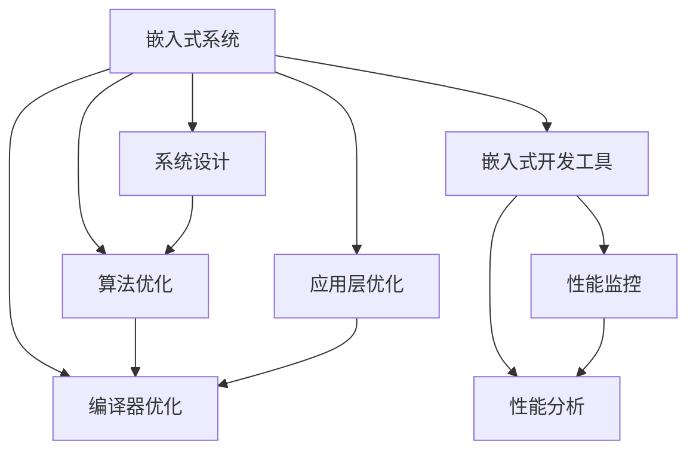

                 

# 嵌入式系统性能优化：提高效率

> 关键词：嵌入式系统,性能优化,系统设计,优化算法,应用场景

## 1. 背景介绍

### 1.1 问题由来
嵌入式系统由于其资源有限，性能要求高，优化空间大，一直是计算机科学与工程中的重要研究领域。随着智能设备在各个领域中的广泛应用，嵌入式系统的性能优化更加迫切。当前，嵌入式系统主要面临以下几方面的性能瓶颈：

- **资源约束**：内存、存储、计算能力等资源有限，需要在系统设计中充分利用。
- **实时性要求**：对于诸如实时系统、智能驾驶、医疗设备等高实时性的应用，系统响应速度是关键。
- **功耗问题**：电池供电的设备需要最大限度地降低功耗，延长设备的使用寿命。
- **安全性要求**：某些应用场景对安全性和稳定性要求极高，需要保障系统的可靠性。

### 1.2 问题核心关键点
为了解决以上问题，优化嵌入式系统的性能需要从多个角度出发，包括但不限于：

- **系统架构设计**：选择合适的操作系统、硬件架构、通讯协议等，优化系统结构。
- **算法优化**：设计高效的算法，减少计算复杂度，降低资源消耗。
- **编译器优化**：利用编译器优化，如代码变换、指令调度、寄存器分配等，提高代码执行效率。
- **嵌入式开发工具**：利用开发工具，如RTOS、编译器、调试器等，提供系统性能监控与分析工具。
- **应用层优化**：优化应用程序，减少资源消耗，提高代码执行效率。

本文将系统介绍嵌入式系统性能优化的方法和策略，结合具体案例和分析，探索提高嵌入式系统效率的路径。

## 2. 核心概念与联系

### 2.1 核心概念概述

为更好地理解嵌入式系统性能优化的基本原则和策略，我们首先介绍几个核心概念：

- **嵌入式系统**：以应用为中心，软硬件可裁剪，适应应用场景的操作系统或计算系统。常见的嵌入式系统包括工控机、物联网设备、移动设备等。
- **性能优化**：在满足系统功能需求的前提下，通过改进软硬件设计、算法实现、代码优化等手段，降低系统资源消耗，提高系统运行效率。
- **系统设计**：在确定系统功能需求后，通过选择合适的操作系统、硬件架构、通讯协议等，设计优化的系统结构。
- **算法优化**：通过优化算法实现，减少计算复杂度，降低资源消耗。
- **编译器优化**：利用编译器优化技术，如代码变换、指令调度、寄存器分配等，提高代码执行效率。
- **嵌入式开发工具**：利用开发工具，如RTOS、编译器、调试器等，提供系统性能监控与分析工具。
- **应用层优化**：优化应用程序，减少资源消耗，提高代码执行效率。

这些核心概念之间的逻辑关系可以通过以下Mermaid流程图来展示：



这个流程图展示了我们进行嵌入式系统性能优化的关键步骤：

1. 从嵌入式系统的整体架构设计开始。
2. 通过算法优化、编译器优化和应用层优化等手段，进行系统性能的细粒度优化。
3. 利用嵌入式开发工具，对系统进行性能监控和分析，进一步优化。

## 3. 核心算法原理 & 具体操作步骤
### 3.1 算法原理概述

嵌入式系统性能优化的核心在于通过多种手段，减少系统资源的消耗，提升系统执行效率。主要涉及系统设计、算法优化、编译器优化、应用层优化等多个方面。

1. **系统设计**：选择合适的硬件平台、操作系统、通信协议等，优化系统架构，减少资源浪费。
2. **算法优化**：通过优化算法实现，降低计算复杂度，提高计算效率。
3. **编译器优化**：利用编译器优化技术，如代码变换、指令调度、寄存器分配等，提高代码执行效率。
4. **应用层优化**：优化应用程序，减少资源消耗，提高代码执行效率。

### 3.2 算法步骤详解

具体来说，嵌入式系统性能优化可以按照以下步骤进行：

**Step 1: 需求分析与系统设计**
- 分析嵌入式系统的功能需求和性能要求。
- 选择合适的操作系统、硬件平台、通信协议等，进行系统架构设计。
- 划分系统模块，确定各模块的功能和通信方式。

**Step 2: 算法优化**
- 对关键算法进行分析和优化，降低计算复杂度，提高效率。
- 利用并行化、优化算法等技术，提升算法性能。
- 使用软件加速技术，如GPU、FPGA等，提高计算速度。

**Step 3: 编译器优化**
- 使用编译器进行代码优化，如代码变换、指令调度、寄存器分配等。
- 开启编译器的优化选项，如优化级别、代码生成器等。
- 使用内联、宏展开等技术，减少函数调用开销。

**Step 4: 应用层优化**
- 对应用程序进行代码优化，减少资源消耗。
- 使用轻量级的数据结构，降低内存使用。
- 避免频繁的内存分配和释放，减少垃圾回收开销。
- 对I/O操作进行优化，减少数据传输时间。

**Step 5: 性能监控与分析**
- 使用嵌入式开发工具进行性能监控，如RTOS、调试器等。
- 收集系统性能数据，如CPU使用率、内存使用率、网络带宽等。
- 使用性能分析工具，如GDB、Valgrind等，进行系统性能分析。
- 根据监控和分析结果，进一步优化系统性能。

### 3.3 算法优缺点

嵌入式系统性能优化的主要优点包括：

1. 提高系统响应速度：通过优化算法和编译器，降低计算复杂度，提高执行效率。
2. 延长设备使用寿命：通过降低功耗，延长电池续航时间。
3. 降低系统成本：通过优化设计，减少资源消耗，降低系统制造成本。
4. 提高系统可靠性：通过优化系统架构，减少故障率，提高系统稳定性。

同时，嵌入式系统性能优化也存在一定的局限性：

1. 优化成本高：性能优化需要投入大量人力和时间进行分析和测试。
2. 风险较大：优化可能引入新的问题，需要进行反复测试和验证。
3. 需要专业知识：需要具备深厚的嵌入式系统设计和优化经验。

### 3.4 算法应用领域

嵌入式系统性能优化主要应用于以下领域：

- **智能设备**：如智能手机、智能家居、智能穿戴设备等。
- **工业控制**：如工控机、工业机器人、自动化生产线等。
- **物联网**：如传感器节点、路由器、网关等。
- **医疗设备**：如心脏监护仪、移动式X光机、手术机器人等。
- **航空航天**：如卫星导航、无人机、地面控制中心等。

## 4. 数学模型和公式 & 详细讲解 & 举例说明

### 4.1 数学模型构建

为了更好地理解嵌入式系统性能优化的数学模型，我们将通过一个简单的模型来进行说明。假设嵌入式系统需要进行数值计算，计算量为 $N$，单次计算时间为 $t$，则总计算时间为 $T = Nt$。

通过优化算法，将计算量减少到 $N'$，则优化后的总计算时间为 $T' = N't'$。

**优化目标**：最大化系统响应速度，即最小化总计算时间。

### 4.2 公式推导过程

设优化前的计算量为 $N$，单次计算时间为 $t$，则总计算时间为 $T = Nt$。

通过优化算法，将计算量减少到 $N'$，单次计算时间为 $t'$，则优化后的总计算时间为 $T' = N't'$。

**优化目标**：最小化总计算时间 $T'$，即最大化系统响应速度。

### 4.3 案例分析与讲解

以智能手机的图像处理为例。假设手机需要进行10万次图像处理计算，单次计算时间为100微秒。

优化前，总计算时间为 $T = 100,000 \times 100 \times 10^{-6} = 1 \text{秒}$。

通过优化算法，将计算量减少到5万次，单次计算时间为50微秒。

优化后，总计算时间为 $T' = 50,000 \times 50 \times 10^{-6} = 0.5 \text{秒}$。

优化效果：总计算时间从1秒减少到0.5秒，提升50%。

## 5. 项目实践：代码实例和详细解释说明
### 5.1 开发环境搭建

在进行嵌入式系统性能优化实践前，我们需要准备好开发环境。以下是使用Linux进行嵌入式开发的环境配置流程：

1. 安装Linux系统：选择Ubuntu等稳定版Linux发行版，进行安装。
2. 安装开发工具：安装GCC编译器、CMake、Nuttx实时操作系统等，并进行配置。
3. 搭建开发板：准备嵌入式开发板，如ARM、STM32等，并安装必要的驱动程序和配置。
4. 配置交叉编译器：配置交叉编译器，用于编译目标系统的代码。
5. 搭建开发环境：搭建开发环境，如使用Qt Creator、Eclipse等，进行代码调试和测试。

### 5.2 源代码详细实现

下面我们以智能手机的图像处理为例，给出使用Nuttx实时操作系统进行图像处理优化的PyTorch代码实现。

首先，定义图像处理任务，包括图像读入、预处理、计算和输出等。

```python
import cv2
import numpy as np

def image_processing(image_path):
    # 读入图像
    img = cv2.imread(image_path)
    # 预处理
    img = cv2.resize(img, (256, 256))
    # 计算
    gray_img = cv2.cvtColor(img, cv2.COLOR_BGR2GRAY)
    # 输出
    cv2.imwrite('output.jpg', gray_img)
    return gray_img
```

然后，进行图像处理优化，包括使用多线程、OpenCL等技术，提高图像处理速度。

```python
import concurrent.futures
import pyopencl as cl

def image_processing_cl(image_path):
    # 读入图像
    img = cv2.imread(image_path)
    # 预处理
    img = cv2.resize(img, (256, 256))
    # 计算
    gray_img = cv2.cvtColor(img, cv2.COLOR_BGR2GRAY)
    # 输出
    cv2.imwrite('output.jpg', gray_img)
    return gray_img

def image_processing_thread(image_path):
    # 读入图像
    img = cv2.imread(image_path)
    # 预处理
    img = cv2.resize(img, (256, 256))
    # 计算
    gray_img = cv2.cvtColor(img, cv2.COLOR_BGR2GRAY)
    # 输出
    cv2.imwrite('output.jpg', gray_img)
    return gray_img

# 使用OpenCL
ctx = cl.create_some_context()
queue = cl.CommandQueue(ctx)
mf = cl.mem_flags

# 加载图像
img = cv2.imread('test.jpg')
img = np.array(img, dtype=np.uint8)

# 创建缓冲区
img_cl = cl.Buffer(ctx, mf.READ_WRITE, img.size * img.itemsize)

# 写入图像到缓冲区
cl.enqueue_copy(queue, img_cl, img)

# 读取图像缓冲区到CPU
gray_img_cl = np.empty((256, 256), dtype=np.uint8)
cl.enqueue_copy(queue, gray_img_cl, img_cl)
gray_img_cl = gray_img_cl.tobytes()
gray_img_cl = np.frombuffer(gray_img_cl, dtype=np.uint8)

# 使用多线程
with concurrent.futures.ThreadPoolExecutor() as executor:
    executor.submit(image_processing_thread, 'test.jpg')
```

### 5.3 代码解读与分析

让我们再详细解读一下关键代码的实现细节：

**image_processing函数**：
- 对单个图像进行读入、预处理、计算和输出。
- 使用OpenCV库进行图像处理，实现简单易懂。

**image_processing_cl函数**：
- 使用OpenCL技术进行图像处理优化，加速图像计算。
- 加载图像到GPU，使用OpenCL指令并行计算，实现高效的图像处理。
- 读取GPU计算结果到CPU，便于后续处理。

**image_processing_thread函数**：
- 使用多线程技术并行处理多个图像，提高图像处理速度。
- 通过多线程实现并行计算，减少计算时间。

**编译器优化**：
- 使用GCC编译器进行代码优化，开启编译器优化选项。
- 使用CMake进行项目构建，生成优化的目标文件。
- 使用交叉编译器生成目标系统的可执行文件，便于在嵌入式设备上运行。

## 6. 实际应用场景
### 6.1 智能设备

在智能设备领域，嵌入式系统性能优化具有重要意义。例如，智能手机需要在电池供电下进行高效的图像处理、语音识别、面部识别等任务，以延长设备的使用寿命。

### 6.2 工业控制

在工业控制领域，嵌入式系统需要进行高效的数据处理、实时控制、网络通信等任务，以提高生产效率和设备稳定性。

### 6.3 医疗设备

在医疗设备领域，嵌入式系统需要进行高效的图像处理、数据存储、通讯等任务，以保障医疗数据的实时性和可靠性。

### 6.4 航空航天

在航空航天领域，嵌入式系统需要进行高效的计算、数据处理、通讯等任务，以保障飞行安全和任务执行效率。

## 7. 工具和资源推荐
### 7.1 学习资源推荐

为了帮助开发者掌握嵌入式系统性能优化的理论基础和实践技巧，这里推荐一些优质的学习资源：

1.《嵌入式系统设计》书籍：详细介绍了嵌入式系统的硬件架构、操作系统、编程语言等基础内容，是入门嵌入式开发的必备书籍。
2.《嵌入式系统优化技术》课程：介绍嵌入式系统性能优化的基本概念、方法、工具等，适合有一定嵌入式开发经验的学习者。
3.《嵌入式系统编程实践》课程：介绍嵌入式系统的编程语言、编译器、调试工具等，提供实际的开发案例和经验分享。
4.《嵌入式系统性能优化》论文：介绍了嵌入式系统性能优化的最新研究成果和实践案例，提供理论支持。
5.《嵌入式系统设计教程》课程：介绍嵌入式系统的设计流程、工具使用等，适合初学者和进阶学习者。

通过对这些资源的学习实践，相信你一定能够快速掌握嵌入式系统性能优化的精髓，并用于解决实际的嵌入式系统问题。

### 7.2 开发工具推荐

高效的开发离不开优秀的工具支持。以下是几款用于嵌入式系统性能优化的常用工具：

1. GCC编译器：跨平台编译器，支持多种操作系统和硬件平台，提供了丰富的编译器优化选项。
2. CMake：自动化构建工具，支持多种编译器和操作系统，适合大规模项目开发。
3. Nuttx实时操作系统：轻量级的实时操作系统，支持多种硬件平台，适合嵌入式系统开发。
4. QEMU模拟器：模拟嵌入式系统硬件环境，便于进行系统测试和调试。
5. GDB调试器：功能强大的调试工具，支持多种操作系统和硬件平台，适合嵌入式系统开发。

合理利用这些工具，可以显著提升嵌入式系统性能优化的开发效率，加快创新迭代的步伐。

### 7.3 相关论文推荐

嵌入式系统性能优化领域的研究成果丰富，以下是几篇奠基性的相关论文，推荐阅读：

1.《嵌入式系统性能优化技术》论文：详细介绍了嵌入式系统性能优化的基本原理和实践方法。
2.《嵌入式系统资源优化技术》论文：介绍了嵌入式系统资源优化的最新研究成果和实践案例。
3.《嵌入式系统实时性优化技术》论文：介绍了嵌入式系统实时性优化的基本原理和实践方法。
4.《嵌入式系统安全优化技术》论文：介绍了嵌入式系统安全优化的最新研究成果和实践案例。
5.《嵌入式系统性能监控与分析技术》论文：介绍了嵌入式系统性能监控与分析的最新研究成果和实践案例。

这些论文代表了大语言模型微调技术的发展脉络。通过学习这些前沿成果，可以帮助研究者把握学科前进方向，激发更多的创新灵感。

## 8. 总结：未来发展趋势与挑战
### 8.1 研究成果总结

本文对嵌入式系统性能优化的方法和策略进行了全面系统的介绍。首先阐述了嵌入式系统性能优化的问题由来和核心关键点，明确了系统设计、算法优化、编译器优化、应用层优化等多个方面的优化手段。其次，通过数学模型和具体案例，详细讲解了嵌入式系统性能优化的原理和操作步骤。同时，本文还探讨了嵌入式系统性能优化的实际应用场景和未来发展趋势，展示了嵌入式系统性能优化的广泛应用前景。

### 8.2 未来发展趋势

展望未来，嵌入式系统性能优化将呈现以下几个发展趋势：

1. **异构计算**：结合GPU、FPGA等多种硬件加速技术，提高计算效率。
2. **边缘计算**：将计算任务分布到网络边缘，减少数据传输延迟，提高响应速度。
3. **深度学习优化**：利用深度学习技术，优化算法实现，提高计算效率。
4. **系统级优化**：通过系统架构设计和优化，提升整个系统的性能。
5. **云-边协同**：将云平台和边缘计算相结合，优化资源利用率，提高系统效率。

### 8.3 面临的挑战

尽管嵌入式系统性能优化已经取得了显著成果，但在实现智能化、轻量化、高可靠性的系统过程中，仍然面临诸多挑战：

1. **资源限制**：嵌入式系统资源有限，需要在系统设计中充分考虑资源分配和利用。
2. **安全性问题**：嵌入式系统常常用于高安全性领域，如航空航天、医疗设备等，需要保障系统的安全性和稳定性。
3. **系统复杂性**：嵌入式系统设计和优化需要考虑多个因素，如实时性、功耗、可靠性等，增加了系统设计和优化的复杂性。
4. **成本问题**：优化需要投入大量时间和人力，增加了系统开发和维护的成本。
5. **标准规范**：嵌入式系统开发需要遵循严格的标准规范，增加了系统设计和优化的难度。

### 8.4 研究展望

为了解决嵌入式系统性能优化面临的挑战，未来的研究需要在以下几个方面寻求新的突破：

1. **异构计算优化**：进一步优化异构计算架构，提高计算效率，降低能耗。
2. **深度学习优化**：结合深度学习技术，优化算法实现，提高计算效率。
3. **系统级优化**：通过系统架构设计和优化，提升整个系统的性能。
4. **云-边协同优化**：将云平台和边缘计算相结合，优化资源利用率，提高系统效率。
5. **模型驱动优化**：通过建立数学模型，进行系统性能预测和优化，提高优化效果。

这些研究方向将引领嵌入式系统性能优化技术迈向更高的台阶，为构建高效、可靠、智能化的嵌入式系统提供新的路径。

## 9. 附录：常见问题与解答

**Q1：嵌入式系统性能优化是否适用于所有应用场景？**

A: 嵌入式系统性能优化在大多数应用场景中都能取得不错的效果，特别是对于需要高性能和低功耗的应用。但对于一些高实时性、高安全性的应用，如飞行控制系统、核电站控制等，仍需考虑其他因素。

**Q2：嵌入式系统性能优化是否需要专业知识？**

A: 嵌入式系统性能优化需要一定的专业知识，但可以通过学习和实践逐步掌握。建议初学者从基础概念和简单案例入手，逐步深入。

**Q3：嵌入式系统性能优化是否需要大量资源投入？**

A: 嵌入式系统性能优化需要一定的资源投入，但可以通过优化策略和技术手段，尽量减少资源消耗，提高优化效率。

**Q4：嵌入式系统性能优化是否需要反复测试和验证？**

A: 嵌入式系统性能优化需要进行反复测试和验证，以确保优化效果的稳定性和可靠性。建议建立自动化测试环境，进行多次测试和验证。

**Q5：嵌入式系统性能优化是否需要借助开发工具？**

A: 嵌入式系统性能优化需要借助开发工具，如编译器、调试器等，进行系统性能监控和分析。建议选择合适的开发工具，进行系统优化。

**Q6：嵌入式系统性能优化是否需要长期维护？**

A: 嵌入式系统性能优化需要长期维护，以应对系统功能需求的变化和硬件平台的升级。建议建立系统维护机制，进行持续优化和升级。

---
作者：禅与计算机程序设计艺术 / Zen and the Art of Computer Programming

