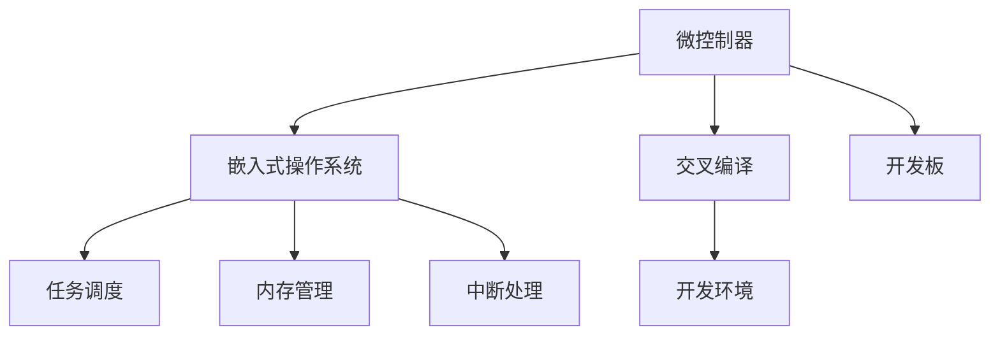

                 

# 嵌入式系统编程入门：微控制器上的创新项目

## 1. 背景介绍

### 1.1 问题由来
随着物联网和智能硬件的兴起，嵌入式系统在各个领域的应用日益广泛。无论是智能家居、可穿戴设备，还是工业自动化、医疗健康，嵌入式系统的开发都是关键环节。然而，嵌入式系统的开发环境与传统的PC和服务器环境有很大差异，这对开发者的技术要求也更高。因此，本文将详细介绍嵌入式系统编程的基础知识、常用工具和开发流程，帮助读者快速入门并掌握嵌入式系统开发技能。

### 1.2 问题核心关键点
嵌入式系统编程的核心关键点包括以下几个方面：

1. 选择合适的微控制器：根据应用需求，选择适合的微控制器，考虑其性能、功耗、价格等因素。
2. 掌握C语言基础：嵌入式开发主要使用C语言，掌握C语言的基础语法和数据结构是必备技能。
3. 理解嵌入式操作系统：了解常见嵌入式操作系统的特点和使用，如μC/OS、FreeRTOS等。
4. 熟悉硬件接口：掌握常见的硬件接口如I/O、串口、SPI、USB等，能进行硬件驱动开发。
5. 熟悉开发工具和环境：了解使用开发工具如Keil uVision、GCC等，能进行交叉编译、调试和测试。

通过掌握上述关键点，读者将能够初步构建嵌入式系统，实现简单的应用功能。

### 1.3 问题研究意义
嵌入式系统编程是连接硬件和软件的桥梁，涉及硬件电路设计、嵌入式操作系统、应用软件开发等多个领域。掌握嵌入式系统编程技术，不仅能够实现多种智能硬件的开发，还能提升自身编程能力和综合素质。同时，嵌入式系统编程在各行各业都有着广泛的应用前景，如智能家居、工业控制、医疗健康等，具有广阔的发展空间。

## 2. 核心概念与联系

### 2.1 核心概念概述

为更好地理解嵌入式系统编程，本节将介绍几个密切相关的核心概念：

- 微控制器(Microcontroller Unit, MCU)：一种集成有CPU、内存和I/O接口的芯片，广泛应用于嵌入式系统中。
- 嵌入式操作系统(Embedded Operating System, OS)：专门为嵌入式系统设计的轻量级操作系统，提供任务调度、内存管理、中断处理等功能。
- 交叉编译(Cross-Compilation)：在PC或服务器上使用编译器编译嵌入式系统目标代码的过程。
- 开发板(Development Board)：一种带有调试工具和连接器的PCB板，用于连接MCU进行编程调试。
- 实时操作系统(Real-Time Operating System, RTOS)：对时间要求严格的系统，如自动化控制、航空航天等领域。

这些核心概念之间的逻辑关系可以通过以下Mermaid流程图来展示：



这个流程图展示了一个典型的嵌入式系统构建过程：

1. 微控制器作为硬件基础，提供计算和通信功能。
2. 嵌入式操作系统提供系统管理功能，支持多任务并发和资源调度。
3. 交叉编译工具用于编译目标代码，确保与MCU平台兼容。
4. 开发板用于连接MCU进行编程调试。
5. 任务调度、内存管理和中断处理是嵌入式操作系统的核心功能。

## 3. 核心算法原理 & 具体操作步骤
### 3.1 算法原理概述

嵌入式系统编程的基本原理是将算法的逻辑实现到MCU上，通过操作硬件资源实现特定的应用功能。嵌入式系统编程包括硬件驱动开发、应用软件开发和系统集成三个主要步骤。

1. **硬件驱动开发**：实现硬件接口的驱动程序，提供与MCU的通信和数据交互。
2. **应用软件开发**：开发应用层软件，实现具体的应用功能。
3. **系统集成**：将硬件驱动和应用软件整合，形成完整的嵌入式系统。

### 3.2 算法步骤详解

嵌入式系统编程的核心步骤包括以下几个方面：

**Step 1: 选择合适的微控制器**
- 根据应用需求选择合适的微控制器，考虑其性能、功耗、价格等因素。
- 了解MCU的特性，如CPU架构、存储器类型、I/O接口等。

**Step 2: 准备开发环境**
- 安装交叉编译工具，如Keil uVision、GCC等。
- 配置开发板连接，进行硬件调试。
- 连接电脑和开发板，配置调试环境。

**Step 3: 编写和调试驱动程序**
- 使用C语言编写驱动程序，实现硬件接口功能。
- 进行调试，确保驱动程序的正确性。
- 添加中断处理和错误处理机制。

**Step 4: 开发应用层软件**
- 使用C语言编写应用层代码，实现特定的应用功能。
- 集成硬件驱动，进行系统集成调试。
- 使用调试工具，监控应用层代码运行状态。

**Step 5: 系统集成和优化**
- 将硬件驱动和应用层代码整合，进行系统集成测试。
- 优化系统性能，如内存管理、代码优化等。
- 使用测试工具，确保系统的稳定性和可靠性。

### 3.3 算法优缺点

嵌入式系统编程具有以下优点：

1. **可扩展性强**：嵌入式系统支持各种传感器、通信接口和外设，可以实现多种功能。
2. **低功耗**：MCU的功耗较低，适用于电池供电的便携式设备。
3. **硬件资源丰富**：MCU集成了CPU、存储器和I/O接口，功能强大。
4. **实时响应**：嵌入式系统具有较高的实时性，适用于需要快速响应的应用场景。

同时，嵌入式系统编程也存在一些缺点：

1. **调试难度高**：嵌入式系统硬件资源有限，调试环境复杂。
2. **开发周期长**：嵌入式系统涉及硬件和软件两个方面，开发周期较长。
3. **学习成本高**：需要掌握硬件电路设计、操作系统、应用软件开发等多方面的知识。

尽管存在这些挑战，但嵌入式系统编程的应用前景广阔，在各个领域都有着重要应用。

### 3.4 算法应用领域

嵌入式系统编程在多个领域都有着广泛的应用，例如：

- 工业控制：如自动化生产线、机器人控制系统等。
- 医疗健康：如健康监测设备、智能医疗设备等。
- 消费电子：如智能家居设备、可穿戴设备等。
- 交通出行：如智能交通信号灯、自动驾驶等。
- 农业自动化：如智能农业设备、环境监测等。

除了上述这些经典应用外，嵌入式系统编程还被创新性地应用于更多场景中，如智能仓储、智能物流、智能制造等，为各行各业带来了新的突破。

## 4. 数学模型和公式 & 详细讲解  
### 4.1 数学模型构建

嵌入式系统编程中，涉及许多数学模型和公式。这里以实时系统调度的数学模型为例，进行详细讲解。

假设有一个实时任务，其执行时间 $T_{task}$ 和周期 $P_{task}$ 已知，需要在周期 $T_{sys}$ 内完成执行。任务调度器需要在每个周期内将任务安排到合适的执行单元上。

定义任务调度算法为 $A$，每个周期内任务 $i$ 被执行的概率为 $p_i$。设周期 $T_{sys}$ 内任务 $i$ 执行 $k_i$ 次，则任务调度的平均延迟为：

$$
D = \frac{\sum_i T_{task} \times (1-p_i)^{k_i-1} \times (1-p_i)^{k_i}}{T_{sys}}
$$

在实际应用中，任务调度的优化目标是尽量减少任务的平均延迟 $D$，同时保证任务的可靠性和实时性。

### 4.2 公式推导过程

以最简单的时间片轮转调度算法为例，推导其平均延迟公式。

设系统周期 $T_{sys}=1$ 秒，任务周期 $P_{task}=0.2$ 秒，任务执行时间 $T_{task}=0.1$ 秒。

定义时间片大小为 $T_{slice}=0.5$ 秒，任务在一个周期内可能被执行的频次为 $k_i$。在理想情况下，任务在一个周期内只执行一次，即 $k_i=1$。

根据上述公式，平均延迟 $D$ 为：

$$
D = \frac{T_{task} \times (1-p_i)^{k_i-1} \times (1-p_i)^{k_i}}{T_{sys}} = \frac{0.1 \times (1-0)^0 \times (1-0)^1}{1} = 0.1
$$

可见，时间片轮转调度算法在理想情况下的平均延迟为 $0.1$ 秒。

### 4.3 案例分析与讲解

以一个智能家居控制系统为例，分析嵌入式系统编程的实际应用。

假设系统由一个MCU、一个嵌入式操作系统、一个应用程序和一个传感器模块组成。传感器模块用于采集环境温度和湿度数据，应用程序通过MCU控制电加热器和风扇的工作状态。

**Step 1: 硬件设计**
- 设计传感器模块电路，包括传感器接口和MCU接口。
- 设计MCU的引脚功能，包括输入输出、串口等。

**Step 2: 嵌入式系统配置**
- 选择适当的MCU，考虑其功耗、速度和存储器容量。
- 安装嵌入式操作系统，进行系统配置。
- 添加中断处理和实时任务调度机制。

**Step 3: 驱动程序开发**
- 编写传感器模块驱动程序，实现数据的采集和读取。
- 编写MCU的I/O驱动程序，实现电加热器和风扇的控制。
- 进行驱动程序调试，确保硬件正常工作。

**Step 4: 应用软件开发**
- 编写应用程序，实现温度和湿度的数据采集和处理。
- 集成传感器驱动程序和MCU驱动，进行系统集成测试。
- 使用调试工具，监控应用程序运行状态。

**Step 5: 系统优化**
- 优化应用程序的性能，减少响应时间。
- 优化嵌入式操作系统的资源管理，减少内存泄漏。
- 优化MCU的运行频率，降低功耗。

通过以上步骤，可以实现一个稳定的智能家居控制系统，为用户提供舒适的居住环境。

## 5. 项目实践：代码实例和详细解释说明
### 5.1 开发环境搭建

在进行嵌入式系统编程之前，需要搭建好开发环境。以下是使用Keil uVision进行嵌入式编程的开发环境配置流程：

1. 安装Keil uVision IDE：从官网下载并安装Keil uVision IDE。
2. 安装MDK软件包：从官网下载安装MDK软件包，支持MCU编程和调试。
3. 连接开发板：将开发板连接至计算机，使用USB调试线进行调试。
4. 设置IDE：配置Keil uVision IDE的MCU型号、开发板信息等。
5. 设置调试环境：配置调试器，进行编译、下载和调试。

完成上述步骤后，即可在Keil uVision中进行嵌入式编程。

### 5.2 源代码详细实现

下面以STM32系列MCU为例，给出使用C语言编写的嵌入式驱动程序和应用软件的实现。

**驱动程序实现**

```c
#include "stm32_gpio.h"
#include "stm32_rcc.h"
#include "sysconfig.h"

#define GPIO_PIN (GPIO2_GPIO_PIN|GPIO2_GPIO_PIN)
#define GPIO_CLK_EN  RCC_APB1ENR_GPIO2EN

void init_gpio(void) {
    // 配置GPIO时钟
    RCC_APB1PeriphClockCmd(GPIO_CLK_EN, ENABLE);
    // 配置GPIO引脚
    GPIO_InitTypeDef GPIO_InitStructure;
    GPIO_InitStructure.GPIO_Pin = GPIO_PIN;
    GPIO_InitStructure.GPIO_Mode = GPIO_Mode_IN_PP;
    GPIO_InitStructure.GPIO_Speed = GPIO_Speed_50MHz;
    GPIO_InitStructure.GPIO_Owenr = GPIO_Owenr_Reset;
    GPIO_Init(GPIOB, &GPIO_InitStructure);
}

void read_gpio(void) {
    u8 data = GPIO_ReadInputDataBit(GPIOB, GPIO_PIN);
    // 处理GPIO输入数据
}

int main(void) {
    // 初始化GPIO
    init_gpio();
    // 读取GPIO数据
    while (1) {
        read_gpio();
    }
    return 0;
}
```

**应用软件实现**

```c
#include "lib_sensor.h"
#include "lib加热器.h"
#include "lib风扇.h"
#include "lib_temperature.h"
#include "lib_humidity.h"
#include "lib_user.h"

void main(void) {
    // 初始化传感器
    lib_sensor_init();
    // 初始化加热器和风扇
    lib加热器_init();
    lib风扇_init();
    // 初始化温度和湿度传感器
    lib_temperature_init();
    lib_humidity_init();
    // 获取环境数据
    float temperature = lib_temperature_get();
    float humidity = lib_humidity_get();
    // 控制加热器和风扇
    lib加热器_set_temperature(temperature);
    lib风扇_set_humidity(humidity);
    // 处理用户输入
    lib_user_input();
}
```

### 5.3 代码解读与分析

让我们再详细解读一下关键代码的实现细节：

**init_gpio函数**：
- 配置GPIO时钟，打开GPIO2时钟。
- 配置GPIO引脚，设置输入模式。
- 设置GPIO输出模式，复位GPIO2引脚。

**read_gpio函数**：
- 读取GPIO输入数据。
- 处理GPIO输入数据。

**main函数**：
- 初始化GPIO引脚。
- 循环读取GPIO数据。
- 根据数据控制加热器和风扇。

**lib传感器类**：
- 定义传感器初始化函数。
- 定义传感器读取函数。
- 定义传感器设置函数。

通过以上代码，可以完成MCU上的GPIO驱动和应用软件的开发。

## 6. 实际应用场景
### 6.1 智能家居系统

嵌入式系统编程在智能家居系统中有着广泛应用。通过嵌入式系统，可以实现智能照明、智能温控、智能安防等多种功能。

以智能温控系统为例，用户可以通过手机APP控制电加热器和风扇的工作状态，实现室内温度的自动调节。系统通过传感器模块采集环境温度和湿度数据，应用程序根据用户需求和环境参数进行决策，控制加热器和风扇的运行状态，达到舒适宜人的居住环境。

### 6.2 工业控制系统

嵌入式系统在工业控制系统中也发挥着重要作用。通过嵌入式系统，可以实现自动化生产线、机器人控制系统等多种功能。

以工业机器人为例，机器人控制系统由嵌入式MCU、嵌入式操作系统和应用软件组成。应用程序通过传感器模块采集机器人位置和环境数据，根据实时数据控制机器人的动作，完成自动化操作。系统还支持远程监控和故障诊断，提高生产线的自动化水平和维护效率。

### 6.3 医疗健康系统

嵌入式系统在医疗健康系统中也有着广泛应用。通过嵌入式系统，可以实现健康监测设备、智能医疗设备等多种功能。

以智能医疗设备为例，设备由嵌入式MCU、嵌入式操作系统和应用软件组成。应用程序通过传感器模块采集健康数据，如心率、血压、血糖等，进行数据分析和处理。设备还可以实现远程监控和告警功能，及时发现异常情况并通知医生，提升医疗服务的水平和效率。

### 6.4 未来应用展望

随着嵌入式系统技术的不断发展，未来将会有更多创新应用涌现。嵌入式系统编程也将不断进步，涉及更多的新技术和新领域。

未来嵌入式系统编程的发展趋势包括：

1. **边缘计算**：嵌入式系统将更多地应用于边缘计算领域，实现本地数据处理和分析，降低通信成本和时延。
2. **物联网**：嵌入式系统与物联网技术结合，实现智能家居、智慧城市等多种应用场景。
3. **人工智能**：嵌入式系统结合人工智能技术，实现智能决策和自主控制，提升系统智能化水平。
4. **安全性**：嵌入式系统将更加注重安全性，保护数据和系统的稳定运行。
5. **集成化**：嵌入式系统将向集成化方向发展，实现硬件和软件的一体化设计，提高系统可靠性。

以上趋势表明，嵌入式系统编程具有广阔的发展前景，将在更多领域发挥重要作用。

## 7. 工具和资源推荐
### 7.1 学习资源推荐

为了帮助开发者系统掌握嵌入式系统编程的理论基础和实践技巧，这里推荐一些优质的学习资源：

1. 《嵌入式系统编程入门》系列博文：由大模型技术专家撰写，深入浅出地介绍了嵌入式系统编程的基本概念和实践技巧。

2. 《嵌入式系统设计》课程：多所大学开设的嵌入式系统设计课程，涵盖硬件设计、软件开发、系统集成等多个方面。

3. 《嵌入式系统编程与设计》书籍：全面介绍嵌入式系统编程和设计的基础知识和实践技巧，适合初学者和进阶开发者。

4. ARM和MIPS官方文档：ARM和MIPS等主流MCU平台官方文档，提供详细的硬件和软件接口说明，是嵌入式开发必备参考资料。

5. Embedded.com：嵌入式技术社区，提供丰富的技术文章、论坛讨论和开源项目，是嵌入式开发者的交流平台。

通过对这些资源的学习实践，相信你一定能够快速掌握嵌入式系统编程的精髓，并用于解决实际的嵌入式问题。

### 7.2 开发工具推荐

高效的开发离不开优秀的工具支持。以下是几款用于嵌入式系统编程的常用工具：

1. Keil uVision：Keil公司开发的嵌入式开发工具，支持多种MCU平台和操作系统。
2. GCC交叉编译器：GNU编译器集合，支持多种MCU平台的编译和优化。
3. IAR Embedded：IAR公司开发的嵌入式开发工具，支持多种MCU平台和操作系统。
4. Eclipse IDE：开源的IDE工具，支持多种MCU平台和操作系统，适合进行复杂的嵌入式开发项目。
5. Simulink：MATLAB的嵌入式系统仿真工具，支持模型化设计，便于调试和验证。

合理利用这些工具，可以显著提升嵌入式系统编程的开发效率，加快创新迭代的步伐。

### 7.3 相关论文推荐

嵌入式系统编程的发展离不开学界的持续研究。以下是几篇奠基性的相关论文，推荐阅读：

1. ARM微控制器技术详解（ARM Cortex系列）：详细介绍ARM Cortex系列微控制器的原理和应用。
2. 嵌入式系统设计原理与实践：详细介绍嵌入式系统设计和开发的流程和方法。
3. 嵌入式操作系统：详细介绍常见嵌入式操作系统的原理和应用。
4. 嵌入式系统安全技术：介绍嵌入式系统安全设计、检测和防护的方法和策略。
5. 嵌入式系统自适应优化：介绍嵌入式系统自适应优化的方法和策略。

这些论文代表了大模型微调技术的发展脉络。通过学习这些前沿成果，可以帮助研究者把握学科前进方向，激发更多的创新灵感。

## 8. 总结：未来发展趋势与挑战
### 8.1 总结

本文对嵌入式系统编程的基本原理和实践方法进行了全面系统的介绍。首先阐述了嵌入式系统编程的背景和意义，明确了嵌入式系统编程在各个领域的应用价值。其次，从原理到实践，详细讲解了嵌入式系统编程的数学模型和关键步骤，给出了嵌入式系统编程的完整代码实例。同时，本文还广泛探讨了嵌入式系统编程在智能家居、工业控制、医疗健康等多个行业领域的应用前景，展示了嵌入式系统编程的广阔前景。

通过本文的系统梳理，可以看到，嵌入式系统编程作为连接硬件和软件的桥梁，在各个领域都有着重要应用。掌握嵌入式系统编程技术，不仅能够实现多种智能硬件的开发，还能提升自身编程能力和综合素质。嵌入式系统编程的实际应用前景广阔，将在多个领域发挥重要作用。

### 8.2 未来发展趋势

展望未来，嵌入式系统编程将呈现以下几个发展趋势：

1. **边缘计算**：嵌入式系统将更多地应用于边缘计算领域，实现本地数据处理和分析，降低通信成本和时延。
2. **物联网**：嵌入式系统与物联网技术结合，实现智能家居、智慧城市等多种应用场景。
3. **人工智能**：嵌入式系统结合人工智能技术，实现智能决策和自主控制，提升系统智能化水平。
4. **安全性**：嵌入式系统将更加注重安全性，保护数据和系统的稳定运行。
5. **集成化**：嵌入式系统将向集成化方向发展，实现硬件和软件的一体化设计，提高系统可靠性。

以上趋势表明，嵌入式系统编程具有广阔的发展前景，将在更多领域发挥重要作用。

### 8.3 面临的挑战

尽管嵌入式系统编程已经取得了瞩目成就，但在迈向更加智能化、普适化应用的过程中，它仍面临着诸多挑战：

1. **硬件资源限制**：嵌入式系统的硬件资源有限，需要高效利用资源，优化算法和代码。
2. **实时性要求高**：嵌入式系统对实时性要求严格，需要优化调度算法和硬件设计。
3. **学习成本高**：嵌入式系统编程涉及硬件电路设计、操作系统、应用软件开发等多方面的知识，学习成本较高。
4. **调试难度大**：嵌入式系统的调试环境复杂，需要具备丰富的调试经验和技巧。

尽管存在这些挑战，但嵌入式系统编程的应用前景广阔，在各个领域都有着重要应用。

### 8.4 研究展望

未来嵌入式系统编程的研究方向包括以下几个方面：

1. **硬件加速**：利用硬件加速器，如FPGA、ASIC等，提升嵌入式系统的处理速度和性能。
2. **软件优化**：优化嵌入式系统软件的代码和算法，提高系统效率和稳定性。
3. **安全设计**：加强嵌入式系统的安全性设计，保护数据和系统的稳定运行。
4. **系统集成**：集成多种嵌入式系统，实现复杂系统的协同工作。
5. **跨平台开发**：实现嵌入式系统跨平台开发，提高开发效率和系统兼容性。

这些研究方向将推动嵌入式系统编程技术的不断进步，为嵌入式系统在更多领域的应用提供支持。通过多路径协同发力，嵌入式系统编程将迈向更高的台阶，实现更加智能化、普适化的应用。

## 9. 附录：常见问题与解答

**Q1：嵌入式系统编程和PC编程有哪些不同？**

A: 嵌入式系统编程与PC编程在硬件环境、开发工具、调试方式等方面都有所不同。嵌入式系统编程通常需要在硬件平台上进行交叉编译、调试和测试，需要具备硬件电路设计和嵌入式操作系统等专业知识。

**Q2：嵌入式系统编程的调试环境如何搭建？**

A: 嵌入式系统编程的调试环境通常包括开发板、交叉编译工具、调试器等。首先需要将开发板连接至计算机，通过USB调试线进行调试。然后使用交叉编译工具编译目标代码，最后在调试器中进行调试。

**Q3：嵌入式系统编程的硬件资源有限，如何进行优化？**

A: 嵌入式系统编程的硬件资源有限，需要进行高效利用和优化。可以通过硬件加速器、软件优化、资源管理等手段进行优化。同时需要设计高效的算法和数据结构，减少系统负担。

**Q4：嵌入式系统编程的实时性要求高，如何进行优化？**

A: 嵌入式系统编程的实时性要求高，需要进行优化调度算法和硬件设计。可以使用实时操作系统、任务调度机制、中断处理等手段提升系统的实时性。同时需要优化硬件设计，提高MCU的运行频率和时钟频率。

**Q5：嵌入式系统编程的学习成本高，如何进行快速入门？**

A: 嵌入式系统编程的学习成本高，可以通过系统的学习资源、在线课程和实践项目进行快速入门。可以参考《嵌入式系统编程入门》系列博文，了解嵌入式系统编程的基本概念和实践技巧。同时需要进行大量的实践项目，积累开发经验。

总之，嵌入式系统编程需要掌握硬件电路设计、嵌入式操作系统、应用软件开发等多方面的知识。通过系统的学习和实践，可以快速掌握嵌入式系统编程的技术，实现各种智能硬件的开发。

---

作者：禅与计算机程序设计艺术 / Zen and the Art of Computer Programming

