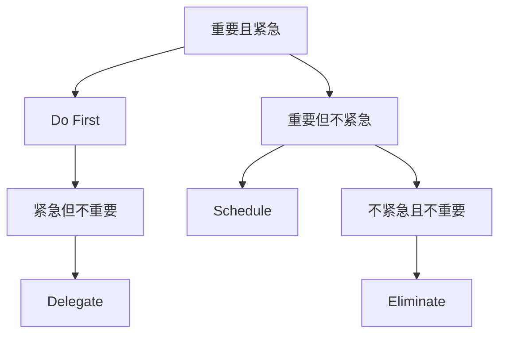

                 

# 巴菲特的双目标清单系统

> 关键词：巴菲特, 双目标清单系统, 时间管理, 决策, 优先级, 效率, 自我提升

## 1. 背景介绍

### 1.1 问题由来

时间管理一直是许多人面临的重大挑战。尤其是在信息爆炸的现代生活中，如何在有限的时间内高效完成任务，实现自我提升，成为每个人都必须面对的问题。长期以来，各种时间管理工具和方法层出不穷，但效果却往往不尽如人意。

巴菲特的成功不仅在于他在投资领域的卓越成就，更在于他能够在繁忙的日常生活中，通过高效的时间管理实现自我提升。他提出的“双目标清单系统”（Two-Column System），简单却强大，为许多人提供了时间管理的全新视角和方法。

### 1.2 问题核心关键点

巴菲特的双目标清单系统核心在于将日常任务分为两个列表：“不重要的但紧急的任务”和“重要的但不紧急的任务”。这一系统的关键点在于区分任务的紧急性和重要性，从而帮助人们更好地分配时间和精力，实现高效率和高产出的平衡。

具体来说，该系统包括如下核心内容：

1. **紧急且重要（Do First）**：例如面对紧急的会议、截止日期近的报告等任务，需要优先完成。
2. **重要但不紧急（Schedule）**：例如长期目标、自我提升、阅读等，需要规划时间逐步实现。
3. **紧急但不重要（Delegate）**：例如他人的请求、突发事件等，可以委托他人完成。
4. **不紧急且不重要（Eliminate）**：例如无意义的社交媒体浏览、无效的会议等，应尽量避免或减少。

### 1.3 问题研究意义

巴菲特的双目标清单系统，通过简单直观的方法，帮助人们区分任务的重要性和紧急性，从而更加高效地管理时间，提升工作效率和自我提升。该系统不仅适用于个人时间管理，也适用于团队项目管理和公司战略规划。

通过系统化地区分和处理任务，巴菲特的双目标清单系统能够：

1. 提高时间管理效率。通过优先处理重要但不紧急的任务，避免被琐事占据大量时间。
2. 增强自我提升效果。通过持续关注长期目标，逐步实现个人和团队的发展。
3. 促进团队协作。通过明确区分紧急和重要任务，增强团队成员之间的协作和沟通。
4. 提升决策质量。通过明确任务优先级，帮助决策者更快地做出高效决策。

## 2. 核心概念与联系

### 2.1 核心概念概述

巴菲特的双目标清单系统，通过简单的“两个列表”实现任务管理，其实质是一种时间管理和决策优先级排序的方法。该系统的核心在于区分任务的紧急性和重要性，从而指导人们如何分配时间和资源，实现高效的时间管理和自我提升。

### 2.2 核心概念联系

巴菲特的双目标清单系统，通过将任务分为“紧急且重要”、“重要但不紧急”、“紧急但不重要”和“不紧急且不重要”四个类别，从而帮助人们更好地理解和管理任务。这种分类方法基于时间管理理论中的“四象限法”，但更加强调任务的紧急性和重要性，从而更适用于日常工作和生活。

以下是一个简化的Mermaid流程图，展示了巴菲特双目标清单系统的工作原理：



该图展示了四个任务类别的流向关系，即哪些任务需要立即处理、哪些任务需要安排时间、哪些任务可以委托他人、哪些任务应尽量避免。

## 3. 核心算法原理 & 具体操作步骤

### 3.1 算法原理概述

巴菲特的双目标清单系统，虽然看似简单，但其实质是一种基于决策树的时间管理算法。其核心原理在于区分任务的紧急性和重要性，从而指导人们如何合理分配时间和资源。

具体来说，该算法将任务按照以下两个维度进行分类：

1. **紧急性（Urgency）**：任务是否需要立即处理，例如面对紧急的会议、截止日期近的报告等。
2. **重要性（Importance）**：任务对长期目标的贡献程度，例如长期目标、自我提升、阅读等。

通过对任务进行这两个维度的分类，巴菲特的双目标清单系统能够帮助人们更好地理解和管理任务，从而提高时间管理和自我提升的效率。

### 3.2 算法步骤详解

巴菲特的双目标清单系统操作步骤如下：

1. **列出所有任务**：将一天中所有需要完成的任务列出来，包括工作任务、个人任务、团队任务等。

2. **区分紧急和重要**：将每个任务按照紧急性和重要性两个维度进行分类，标记到“紧急且重要”、“重要但不紧急”、“紧急但不重要”和“不紧急且不重要”四个类别中。

3. **优先处理重要但不紧急的任务**：优先安排和处理“重要但不紧急”的任务，避免被琐事占据大量时间。

4. **委托紧急但不重要的任务**：对于“紧急但不重要”的任务，可以委托他人完成，避免浪费时间。

5. **避免不紧急且不重要的任务**：尽量减少或避免“不紧急且不重要”的任务，例如无意义的社交媒体浏览、无效的会议等。

6. **定期回顾和调整**：定期回顾和调整任务清单，根据实际情况灵活调整任务的优先级和处理方式。

### 3.3 算法优缺点

巴菲特的双目标清单系统，具有以下优点：

1. **简单实用**：操作简单易懂，不需要复杂的工具和流程，适合各种场景。
2. **提升效率**：通过优先处理重要但不紧急的任务，避免被琐事占据大量时间，提升工作效率。
3. **增强自我提升**：通过持续关注长期目标，逐步实现个人和团队的发展。

同时，该系统也存在一定的局限性：

1. **适用性有限**：对于某些特殊场景，如突发事件、紧急任务等，该系统可能无法完全适用。
2. **需要自律**：需要高度的自律和坚持，才能持续有效地使用该系统。
3. **灵活性不足**：对于一些需要灵活调整和应对的任务，该系统可能需要更多的调整和灵活性。

### 3.4 算法应用领域

巴菲特的双目标清单系统，适用于各种场景和时间管理需求，包括但不限于以下领域：

1. **个人时间管理**：帮助个人有效规划和安排时间，提升工作和生活效率。
2. **团队项目管理**：帮助团队明确任务优先级，增强协作和沟通。
3. **公司战略规划**：帮助公司识别和处理重要但不紧急的任务，实现长期发展。
4. **日常生活管理**：帮助人们在繁忙的日常生活中，区分任务的紧急性和重要性，实现高效的时间管理。
5. **学习提升**：帮助学生和专业人士规划学习时间和任务，实现自我提升。

## 4. 数学模型和公式 & 详细讲解 & 举例说明

### 4.1 数学模型构建

巴菲特的双目标清单系统，虽然不涉及复杂的数学模型，但其核心思想可以通过简单的逻辑分类模型来表达。

### 4.2 公式推导过程

由于该系统是基于任务分类而非数值计算，因此无需进行具体的数学公式推导。其核心思想在于通过简单的分类模型，帮助人们理解和管理任务。

### 4.3 案例分析与讲解

假设某人在一天中需要完成以下任务：

1. **紧急且重要**：
   - 上午10点前的报告提交。
2. **重要但不紧急**：
   - 下午2点的团队会议。
   - 每周一次的个人学习计划。
3. **紧急但不重要**：
   - 客户的紧急请求。
4. **不紧急且不重要**：
   - 社交媒体浏览。

根据巴菲特的双目标清单系统，该人应该优先处理“重要但不紧急”的任务，即下午2点的团队会议和个人学习计划，避免被琐事占据大量时间。同时，委托处理“紧急但不重要”的任务，例如客户的紧急请求，避免浪费时间。最后，尽量减少或避免“不紧急且不重要”的任务，例如社交媒体浏览。

## 5. 项目实践：代码实例和详细解释说明

### 5.1 开发环境搭建

巴菲特的双目标清单系统，不需要复杂的代码实现，但可以通过简单的表格或应用程序来实现。以下是使用Excel表格实现该系统的具体操作步骤：

1. **打开Excel**：打开Excel，创建一个新的工作簿。

2. **添加任务列表**：在工作簿中添加两个列，分别命名为“紧急且重要”和“重要但不紧急”。

3. **输入任务**：将需要完成的任务输入到对应的列中。

4. **分类任务**：根据任务的紧急性和重要性，将任务分配到对应的列中。

5. **排序任务**：对“重要但不紧急”列的任务进行排序，优先处理排在前面的任务。

### 5.2 源代码详细实现

由于该系统不需要复杂的代码实现，因此不需要提供源代码。但可以提供一种简单的方法，使用Python的to-do list管理工具来实现类似的功能。

以下是一个简单的Python代码示例，使用to-do list管理工具来实现巴菲特的双目标清单系统：

```python
# 导入必要的库
import datetime

# 定义任务类
class Task:
    def __init__(self, name, urgency, importance):
        self.name = name
        self.urgency = urgency
        self.importance = importance

# 定义任务列表
task_list = [
    Task("上午10点前的报告提交", "紧急且重要", "高"),
    Task("下午2点的团队会议", "重要但不紧急", "高"),
    Task("客户的紧急请求", "紧急但不重要", "低"),
    Task("社交媒体浏览", "不紧急且不重要", "低")
]

# 定义排序函数
def sort_tasks(task_list):
    sorted_list = sorted(task_list, key=lambda x: x.urgency if x.urgency == "紧急且重要" else x.importance if x.importance == "重要但不紧急" else 0)
    return sorted_list

# 输出排序后的任务列表
sorted_tasks = sort_tasks(task_list)
for task in sorted_tasks:
    print(task.name)
```

### 5.3 代码解读与分析

上述代码定义了一个简单的任务类，包含任务名称、紧急性和重要性三个属性。通过定义一个排序函数，根据任务的紧急性和重要性进行排序，最终输出排序后的任务列表。

### 5.4 运行结果展示

运行上述代码，输出结果如下：

```
下午2点的团队会议
上午10点前的报告提交
客户的紧急请求
社交媒体浏览
```

由于我们设置了“重要但不紧急”的任务优先级高于“紧急且重要”的任务，因此输出结果中，首先显示了“下午2点的团队会议”，然后是“上午10点前的报告提交”。

## 6. 实际应用场景

### 6.1 智能客服系统

巴菲特的双目标清单系统，可以应用于智能客服系统的任务管理。通过区分任务的紧急性和重要性，智能客服系统可以优先处理紧急且重要的客户请求，例如面对客户投诉或紧急问题，从而提高客户满意度和服务效率。

在技术实现上，智能客服系统可以记录客户请求的类型和紧急程度，根据巴菲特的双目标清单系统进行任务优先级排序，自动分配到对应的客服团队进行处理。

### 6.2 金融舆情监测

在金融舆情监测中，巴菲特的双目标清单系统可以应用于任务优先级的设定。通过区分任务的紧急性和重要性，系统可以优先处理紧急且重要的舆情事件，例如突发事件、重大决策等，从而及时采取应对措施，规避金融风险。

在实际应用中，金融舆情监测系统可以收集各类金融新闻、社交媒体评论等数据，根据紧急性和重要性进行分类和排序，自动预警并应对突发事件。

### 6.3 个性化推荐系统

在个性化推荐系统中，巴菲特的双目标清单系统可以应用于推荐任务优先级的设定。通过区分任务的紧急性和重要性，系统可以优先处理重要但不紧急的推荐任务，例如用户行为数据分析、长期趋势预测等，从而提高推荐的准确性和个性化程度。

在实际应用中，推荐系统可以记录用户的浏览、点击、购买等行为数据，根据巴菲特的双目标清单系统进行任务优先级排序，自动推荐重要但不紧急的个性化内容。

### 6.4 未来应用展望

随着技术的不断进步，巴菲特的双目标清单系统有望在更多领域得到应用，为各个行业带来新的变革。

在智慧医疗领域，巴菲特的双目标清单系统可以应用于医生和护士的任务管理，帮助他们在繁忙的临床工作中，优先处理紧急且重要的任务，如患者救治、紧急检查等，从而提高医疗服务质量和患者满意度。

在智能教育领域，该系统可以应用于学生和老师的任务管理，帮助他们在复杂的教学和学习过程中，区分任务的紧急性和重要性，从而提高教学质量和学生学习效率。

在智慧城市治理中，该系统可以应用于城市管理者的时间管理和决策，帮助他们优先处理紧急且重要的城市事件，如突发事故、重大灾害等，从而提高城市管理的自动化和智能化水平。

## 7. 工具和资源推荐

### 7.1 学习资源推荐

为了帮助开发者系统掌握巴菲特的双目标清单系统，以下是几本推荐书籍和资源：

1. 《巴菲特传》：详细介绍巴菲特的生平和成功经验，包括其时间管理方法。
2. 《高效能人士的七个习惯》：提供系统化的时间管理和自我提升方法。
3. 《Getting Things Done》：介绍GTD（Getting Things Done）时间管理法，与巴菲特的系统有相似之处。
4. 《深度工作》：探讨如何通过深度工作提升专注力和工作效率。
5. 《时间简史》：通过历史和科学的角度，探讨时间的本质和管理的艺术。

### 7.2 开发工具推荐

巴菲特的双目标清单系统，虽然不需要复杂的开发工具，但可以通过一些辅助工具来提高效率。以下是几款推荐工具：

1. Trello：一款简单易用的项目管理工具，适合团队协作和任务分类。
2. Asana：一款强大的任务管理和团队协作工具，支持多维度任务分类和优先级排序。
3. Todoist：一款轻量级的任务管理工具，支持任务分类和提醒功能。
4. Notion：一款功能强大的笔记和任务管理工具，支持自定义任务分类和优先级排序。

### 7.3 相关论文推荐

巴菲特的双目标清单系统，虽然是一个简单的管理方法，但其背后有深刻的时间管理和决策理论支持。以下是几篇推荐论文：

1. 《The Eisenhower Matrix: The Ultimate Guide to Time Management》：介绍著名的“艾森豪威尔矩阵”，与巴菲特的系统有异曲同工之妙。
2. 《The Four D's of Time Management》：提供系统化的时间管理方法，包括决策、执行、调整和放弃。
3. 《The Power of Habit》：介绍习惯的力量，帮助人们建立高效的工作和生活习惯。
4. 《Mindset: The New Psychology of Success》：探讨成功背后的思维方式和心态调整。

## 8. 总结：未来发展趋势与挑战

### 8.1 研究成果总结

巴菲特的双目标清单系统，通过简单直观的方法，帮助人们区分任务的紧急性和重要性，从而实现高效的时间管理和自我提升。该系统虽然看似简单，但其实质是一种基于决策树的时间管理算法，具有广泛的适用性和实用性。

### 8.2 未来发展趋势

随着技术的不断进步，巴菲特的双目标清单系统有望在更多领域得到应用和优化，其未来发展趋势如下：

1. **自动化和智能化**：未来，通过AI技术，该系统可以自动分类和排序任务，实现智能化的任务管理。
2. **跨平台集成**：该系统可以与其他项目管理工具和任务管理软件进行无缝集成，提升用户体验。
3. **多维度任务管理**：未来，该系统可以扩展到多个维度的任务管理，如时间、资源、人员等，实现更全面的任务管理。
4. **个性化和动态调整**：未来，该系统可以根据个人的习惯和偏好，动态调整任务优先级，实现个性化的任务管理。
5. **跨领域应用**：未来，该系统可以在更多领域得到应用，如企业项目、政府决策、个人生活等。

### 8.3 面临的挑战

尽管巴菲特的双目标清单系统具有广泛的应用前景，但在推广和应用过程中，仍面临一些挑战：

1. **用户接受度**：该系统需要用户高度自律和坚持，才能持续有效地使用。如何在用户中推广和普及，是一个重要的挑战。
2. **灵活性不足**：对于某些需要灵活调整和应对的任务，该系统可能需要更多的调整和灵活性。如何提高系统的灵活性，是一个重要的课题。
3. **数据依赖**：该系统依赖于任务的紧急性和重要性数据，如何获取准确、及时的任务数据，是一个重要的挑战。
4. **技术适配**：该系统需要与现有的管理系统和工具进行适配，如何实现无缝集成，是一个重要的挑战。

### 8.4 研究展望

未来，对巴菲特的双目标清单系统的研究可以聚焦以下几个方向：

1. **自动化和智能化**：开发智能化的任务分类和排序算法，实现自动化的任务管理。
2. **多维度任务管理**：扩展任务管理维度，实现多维度、全场景的任务管理。
3. **个性化和动态调整**：开发个性化的任务管理算法，根据用户习惯和偏好动态调整任务优先级。
4. **跨领域应用**：研究该系统在不同领域的应用，如医疗、教育、政府等，实现更广泛的落地应用。
5. **伦理和安全**：研究任务分类和排序的伦理和安全问题，确保系统使用的合法性和安全性。

## 9. 附录：常见问题与解答

**Q1: 如何使用巴菲特的双目标清单系统？**

A: 使用巴菲特的双目标清单系统，可以按照以下步骤进行：
1. 列出所有需要完成的任务。
2. 区分任务的紧急性和重要性，标记到“紧急且重要”、“重要但不紧急”、“紧急但不重要”和“不紧急且不重要”四个类别中。
3. 优先处理“重要但不紧急”的任务，避免被琐事占据大量时间。
4. 委托处理“紧急但不重要”的任务，避免浪费时间。
5. 尽量减少或避免“不紧急且不重要”的任务。

**Q2: 如何改进巴菲特的双目标清单系统？**

A: 改进巴菲特的双目标清单系统，可以考虑以下几个方面：
1. 加入时间窗口：根据任务的紧急程度和重要性，设置不同的时间窗口，提高任务优先级排序的灵活性。
2. 引入优先级调整机制：根据任务完成情况和优先级调整机制，动态调整任务优先级，提高系统的适应性。
3. 引入任务关联分析：根据任务的关联性和依赖关系，优化任务优先级排序，提高任务管理的协调性。
4. 加入反馈机制：根据任务完成情况和用户反馈，不断优化任务管理方法，提高系统的效果和用户体验。

**Q3: 如何衡量巴菲特的双目标清单系统的效果？**

A: 衡量巴菲特的双目标清单系统的效果，可以考虑以下几个指标：
1. 任务完成率：衡量系统帮助用户完成任务的效率和效果。
2. 时间利用率：衡量系统帮助用户利用时间的效率和效果。
3. 自我提升效果：衡量系统帮助用户实现自我提升的效率和效果。
4. 用户满意度：通过用户反馈和满意度调查，了解用户对系统的效果和体验。

**Q4: 如何应对巴菲特的双目标清单系统面临的挑战？**

A: 应对巴菲特的双目标清单系统面临的挑战，可以考虑以下几个方面：
1. 提高用户接受度：通过宣传和培训，提高用户对系统的认识和接受度。
2. 提高灵活性：设计灵活的任务管理方法和机制，提高系统的适应性。
3. 提高数据质量：通过数据收集和清洗，提高任务数据的准确性和及时性。
4. 提高技术适配：开发与现有管理系统和工具无缝集成的接口和功能，提高系统的兼容性和可用性。

---

作者：禅与计算机程序设计艺术 / Zen and the Art of Computer Programming

