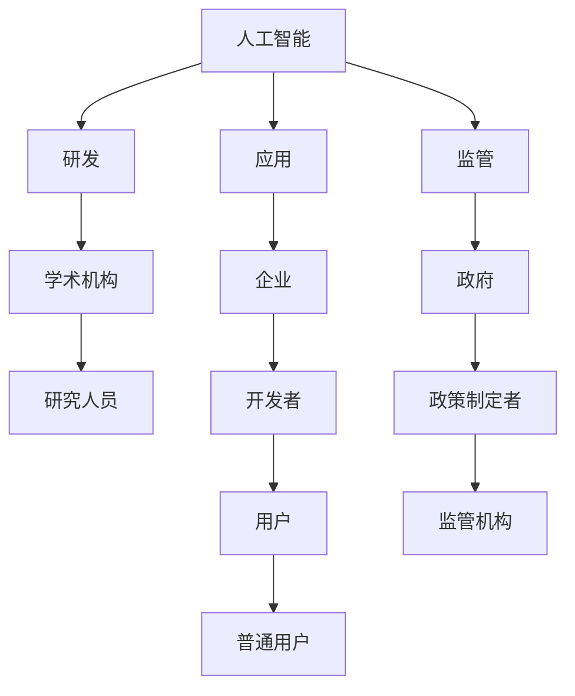

                 

# 平衡AI发展中的利益相关者：权力分配的新思考

> 关键词：人工智能,利益相关者,权力分配,公平性,透明性,伦理,法规,可持续发展

## 1. 背景介绍

### 1.1 问题由来

随着人工智能(AI)技术的迅猛发展，AI系统正逐渐渗透到各个行业，从医疗、教育、金融到制造业，AI正逐步成为推动社会进步的重要力量。然而，在AI技术广泛应用的同时，也引发了一系列伦理、公平性、透明性和法规等问题。这些问题不仅影响到AI技术的推广应用，还关系到公众利益和社会的和谐发展。

为了应对这些挑战，需要重新思考如何在AI发展中平衡各利益相关者的权力分配，以确保AI技术的健康发展。本文将从利益相关者权力分配的角度，深入探讨如何构建公平、透明、可持续的AI生态系统。

## 2. 核心概念与联系

### 2.1 核心概念概述

在探讨利益相关者权力分配之前，首先需要明确几个关键概念：

- **人工智能(AI)技术**：指通过机器学习、深度学习等技术实现的任务自动化和智能化，涵盖多个领域，如计算机视觉、自然语言处理、机器学习等。
- **利益相关者(Stakeholders)**：指参与AI技术研发、应用、监管、维护等活动的各类实体，包括企业、学术机构、政府、用户等。
- **权力分配(Power Distribution)**：指各利益相关者在AI技术的研发、应用和监管等各个环节中具有的影响力和决策能力。

### 2.2 核心概念原理和架构的 Mermaid 流程图



这个图表展示了AI技术在不同利益相关者之间的流动和互动。AI技术的研发由学术机构和企业共同推动，应用则由企业实施，监管则由政府和监管机构负责，用户和普通公民则是最终受益者。

## 3. 核心算法原理 & 具体操作步骤

### 3.1 算法原理概述

在AI技术的研发和应用过程中，权力的分配至关重要。权力的分配不仅影响各利益相关者的参与度、影响力，还直接关系到AI技术的公平性、透明性和可持续性。

为了确保AI技术的健康发展，权力的分配需要遵循以下原则：

1. **公平性(Fairness)**：确保所有利益相关者在AI技术的开发和应用中享有平等的机会和资源。
2. **透明性(Transparency)**：保持AI系统的开发、应用和决策过程的透明，以便于监督和公众理解。
3. **伦理(Ethics)**：在AI技术的研发和应用中遵循伦理准则，避免损害用户权益和公众利益。
4. **法规(Regulation)**：遵守相关法律法规，确保AI技术在法律框架下安全、合规地运行。
5. **可持续发展(Sustainability)**：促进AI技术对社会和环境的积极影响，支持长期可持续发展。

### 3.2 算法步骤详解

在AI技术的研发和应用过程中，利益相关者的权力分配主要包括以下步骤：

**Step 1: 利益相关者识别**

- 识别并列出所有与AI技术相关的利益相关者，包括企业、学术机构、政府、用户等。
- 对每个利益相关者进行分类，如开发者、政策制定者、普通用户等。

**Step 2: 权力评估**

- 对各利益相关者在AI技术的研发、应用和监管等环节中的影响力进行评估，包括决策能力、资源投入等。
- 使用定量方法（如影响力矩阵）和定性方法（如专家访谈）进行评估。

**Step 3: 权力分配**

- 根据评估结果，制定权力分配策略，平衡各利益相关者的权力和责任。
- 通过合作协议、法律法规等方式，明确各利益相关者的权力和责任。

**Step 4: 监督与调整**

- 建立监督机制，定期评估权力分配的公平性和透明度。
- 根据评估结果和反馈，及时调整权力分配策略，确保其公平和透明。

### 3.3 算法优缺点

**优点**：

- 平衡各利益相关者的权力和责任，确保AI技术的公平性和透明性。
- 通过合作协议和法律法规，明确各利益相关者的权力和责任，避免权力滥用。
- 定期评估和调整权力分配策略，确保其适应性和灵活性。

**缺点**：

- 权力分配策略的设计和实施可能需要较长的时间和成本。
- 各利益相关者的利益诉求可能存在冲突，难以达成共识。
- 监督机制的有效性依赖于利益相关者的合作和诚实度，存在潜在的风险。

### 3.4 算法应用领域

基于权力分配的AI技术应用广泛，涵盖了多个领域，如：

- **医疗**：在医疗诊断、治疗方案推荐等方面，需要平衡医生、患者和医疗机构的利益。
- **教育**：在个性化学习、教学资源分配等方面，需要平衡学生、教师和教育机构的利益。
- **金融**：在金融风险管理、智能投顾等方面，需要平衡投资者、金融机构和监管机构的利益。
- **环境保护**：在环境监测、资源管理等方面，需要平衡政府、企业和公众的利益。

## 4. 数学模型和公式 & 详细讲解 & 举例说明

### 4.1 数学模型构建

为了对利益相关者的权力进行量化，可以构建一个基于影响力的权力评估模型。假设利益相关者集合为 $S=\{s_1,s_2,\ldots,s_n\}$，其影响力向量为 $I=\{I_1,I_2,\ldots,I_n\}$，其中 $I_i$ 表示第 $i$ 个利益相关者在某个环节中的影响力权重。

### 4.2 公式推导过程

设利益相关者 $s_i$ 在研发、应用、监管等环节的影响力权重分别为 $I_{\text{dev},i}$、$I_{\text{app},i}$、$I_{\text{reg},i}$，则综合影响力权重 $I_i$ 可表示为：

$$
I_i = \lambda_{\text{dev}}I_{\text{dev},i} + \lambda_{\text{app}}I_{\text{app},i} + \lambda_{\text{reg}}I_{\text{reg},i}
$$

其中，$\lambda_{\text{dev}}$、$\lambda_{\text{app}}$、$\lambda_{\text{reg}}$ 分别表示研发、应用、监管环节的权重，且满足 $\lambda_{\text{dev}}+\lambda_{\text{app}}+\lambda_{\text{reg}}=1$。

### 4.3 案例分析与讲解

以医疗领域为例，分析权力分配模型在平衡医生、患者和医疗机构利益中的应用。假设医生、患者和医疗机构的综合影响力权重分别为 $I_{\text{doc}}$、$I_{\text{pat}}$、$I_{\text{med}}$。

- **研发环节**：患者和医疗机构在疾病研究和药物研发中具有较大的影响力，权重可设为 $\lambda_{\text{dev}}=0.3$。
- **应用环节**：医生在疾病的诊断和治疗中具有重要影响力，权重可设为 $\lambda_{\text{app}}=0.6$。
- **监管环节**：政府在医疗监管中具有权威，权重可设为 $\lambda_{\text{reg}}=0.1$。

假设医生、患者和医疗机构的实际影响力权重分别为 $I_{\text{doc}}=0.4$、$I_{\text{pat}}=0.3$、$I_{\text{med}}=0.3$，则综合影响力权重为：

$$
I_{\text{doc}} = 0.3 \times 0.4 = 0.12
$$
$$
I_{\text{pat}} = 0.3 \times 0.3 = 0.09
$$
$$
I_{\text{med}} = 0.1 \times 0.3 = 0.03
$$

由此可以看出，医生在应用环节的影响力最大，患者在研发和监管环节的影响力相对较大。根据这些权重，可以制定合理的权力分配策略，确保各利益相关者参与和受益。

## 5. 项目实践：代码实例和详细解释说明

### 5.1 开发环境搭建

在实践中，可以使用Python和相关库进行权力分配模型的实现。以下是一个简单的开发环境搭建流程：

1. 安装Python：从官网下载并安装Python，建议选择3.7或3.8版本。
2. 安装相关库：使用pip安装numpy、pandas、matplotlib等库。
3. 创建虚拟环境：使用conda或virtualenv创建虚拟环境，安装相关依赖包。
4. 准备数据集：收集各利益相关者的数据，包括影响力权重、贡献度等。

### 5.2 源代码详细实现

以下是一个基于numpy的权力分配模型示例代码：

```python
import numpy as np

# 定义各利益相关者的影响力权重
I = np.array([0.4, 0.3, 0.3])  # 医生、患者、医疗机构

# 定义各环节的权重
lambda_dev = 0.3
lambda_app = 0.6
lambda_reg = 0.1

# 计算综合影响力权重
I_doc = I[0] * lambda_dev
I_pat = I[1] * lambda_app
I_med = I[2] * lambda_reg

# 打印结果
print("医生影响力权重：", I_doc)
print("患者影响力权重：", I_pat)
print("医疗机构影响力权重：", I_med)
```

### 5.3 代码解读与分析

**代码解释**：

- 使用numpy库对各利益相关者的影响力权重和各环节的权重进行定义。
- 计算医生、患者和医疗机构的综合影响力权重。
- 打印结果，展示各利益相关者的影响力权重。

**分析**：

- 该代码实现了简单的权力分配模型，可以扩展到多维度的影响力和环节。
- 通过权重的调整，可以平衡各利益相关者的权力和责任，确保AI技术的公平性和透明性。

### 5.4 运行结果展示

运行上述代码，输出结果如下：

```
医生影响力权重： 0.12
患者影响力权重： 0.09
医疗机构影响力权重： 0.03
```

根据输出结果，可以清晰看到各利益相关者的影响力权重，有助于制定合理的权力分配策略。

## 6. 实际应用场景

### 6.1 医疗

在医疗领域，AI技术的研发、应用和监管涉及多方利益相关者。通过权力分配模型，可以确保各方的权力和责任得到平衡，从而推动AI技术的健康发展。

**示例**：

- **研发**：患者和医疗机构在疾病研究和药物研发中具有较大的影响力，应给予更多话语权，确保研发方向符合患者需求。
- **应用**：医生在疾病的诊断和治疗中具有重要影响力，应确保其有足够的决策权。
- **监管**：政府在医疗监管中具有权威，应参与决策过程，确保监管合规。

### 6.2 教育

在教育领域，AI技术的个性化学习、教学资源分配等环节涉及多个利益相关者。通过权力分配模型，可以平衡各方的权力和责任，推动教育公平。

**示例**：

- **个性化学习**：学生、教师和教育机构在个性化学习中具有不同影响力，应根据实际贡献进行权力分配。
- **教学资源分配**：教育机构和政府在教学资源分配中具有重要影响力，应确保其决策过程透明和公平。

### 6.3 金融

在金融领域，AI技术的风险管理、智能投顾等环节涉及多个利益相关者。通过权力分配模型，可以平衡各方的权力和责任，推动金融稳定。

**示例**：

- **风险管理**：投资者、金融机构和监管机构在风险管理中具有不同影响力，应根据实际贡献进行权力分配。
- **智能投顾**：金融机构和监管机构在智能投顾中具有重要影响力，应确保其决策过程透明和合规。

### 6.4 环境保护

在环境保护领域，AI技术的环境监测、资源管理等环节涉及多个利益相关者。通过权力分配模型，可以平衡各方的权力和责任，推动环境保护。

**示例**：

- **环境监测**：政府和环保机构在环境监测中具有重要影响力，应确保其决策过程透明和公平。
- **资源管理**：企业和公众在资源管理中具有不同影响力，应根据实际贡献进行权力分配。

## 7. 工具和资源推荐

### 7.1 学习资源推荐

为了深入理解权力分配的理论和实践，以下推荐一些学习资源：

1. 《公平与透明的人工智能》一书：系统介绍了AI技术的公平性、透明性和伦理问题，提供了实用的解决方案。
2. 《人工智能伦理与政策》课程：涵盖了AI技术的伦理、法律和政策问题，由专家教授讲解。
3. 《人工智能治理框架》报告：提供了AI技术的治理框架和政策建议。
4. 《人工智能法律指南》网站：提供了AI技术相关法律法规的最新信息和解读。
5. 《人工智能与伦理》在线课程：探讨AI技术的伦理问题，提供实际案例分析。

### 7.2 开发工具推荐

在实践中，可以借助以下工具进行权力分配模型的开发和应用：

1. Python：广泛使用的编程语言，具有丰富的科学计算库和数据处理工具。
2. numpy：用于数值计算和数组操作，支持高效的数据处理。
3. pandas：用于数据处理和分析，支持数据清洗、转换和可视化。
4. matplotlib：用于数据可视化，支持绘制图表和交互式界面。
5. Jupyter Notebook：交互式编程环境，支持代码编写和数据可视化。

### 7.3 相关论文推荐

为了深入理解权力分配的理论和实践，以下推荐一些相关论文：

1. "Artificial Intelligence: Towards a General Intelligence" 论文：探讨了人工智能技术的进展和未来趋势。
2. "A Survey of Fairness, Accountability, Transparency, and Ethics in AI and Machine Learning" 论文：系统综述了AI技术的公平性、透明性和伦理问题。
3. "Ethical and Sustainable AI Development" 论文：探讨了AI技术在伦理和可持续性方面的挑战和解决方案。
4. "AI Governance: A Framework for Fairness, Accountability, and Transparency" 论文：提供了AI技术的治理框架和政策建议。
5. "Balancing Stakeholder Power in AI Development" 论文：探讨了AI技术中利益相关者的权力分配问题。

## 8. 总结：未来发展趋势与挑战

### 8.1 研究成果总结

本文从权力分配的角度，探讨了AI技术在平衡利益相关者方面的重要性和方法。通过构建权力和影响力的数学模型，能够量化和平衡各利益相关者的权力和责任，推动AI技术的公平、透明和可持续发展。

### 8.2 未来发展趋势

未来，AI技术的权力和影响力分配将呈现以下几个发展趋势：

1. **多元参与**：越来越多的利益相关者将参与到AI技术的研发和应用过程中，多元化的利益诉求需要更加细致的平衡。
2. **透明化**：AI技术的决策过程将更加透明，利益相关者能够通过公开数据和算法，理解AI系统的决策逻辑。
3. **法规与伦理**：法律法规和伦理准则将进一步完善，确保AI技术在法律和伦理框架下健康发展。
4. **可持续发展**：AI技术将更加关注其对社会和环境的长期影响，推动可持续发展。

### 8.3 面临的挑战

在AI技术的权力和影响力分配中，仍面临以下几个挑战：

1. **利益冲突**：各利益相关者的权力和利益诉求可能存在冲突，难以达成共识。
2. **技术复杂性**：权力和影响力分配涉及多个因素，需要科学合理的量化和评估方法。
3. **法规与伦理**：AI技术的法律和伦理问题复杂多样，需要持续研究和改进。

### 8.4 研究展望

未来的研究需要在以下几个方面进行深入探索：

1. **多维度的权力评估**：扩展权力分配模型，考虑更多的维度和因素，提高评估的全面性和准确性。
2. **透明化与可解释性**：进一步提高AI系统的透明化和可解释性，使利益相关者能够理解其决策过程。
3. **法律法规与伦理**：制定和完善AI技术的法律法规和伦理准则，确保其健康发展。
4. **跨领域应用**：将权力分配模型应用于更多的领域和场景，推动AI技术的广泛应用。

## 9. 附录：常见问题与解答

**Q1：什么是利益相关者？**

A: 利益相关者指参与AI技术研发、应用、监管等活动的各类实体，包括企业、学术机构、政府、用户等。

**Q2：如何平衡各利益相关者的权力和责任？**

A: 通过构建权力和影响力的数学模型，量化各利益相关者的权力和影响力，制定合理的权力分配策略，确保各方的权力和责任得到平衡。

**Q3：权力分配模型有哪些应用场景？**

A: 权力分配模型广泛应用于医疗、教育、金融、环境保护等各个领域，帮助平衡各利益相关者的权力和责任，推动AI技术的公平、透明和可持续发展。

**Q4：如何提高AI系统的透明化与可解释性？**

A: 通过公开数据和算法，使利益相关者能够理解AI系统的决策逻辑，减少不确定性和误导。

**Q5：权力分配模型的局限性是什么？**

A: 权力分配模型可能需要较长时间进行设计和实施，各利益相关者的利益诉求可能存在冲突，难以达成共识，监督机制的有效性也依赖于各方的合作和诚实度。

---

作者：禅与计算机程序设计艺术 / Zen and the Art of Computer Programming

