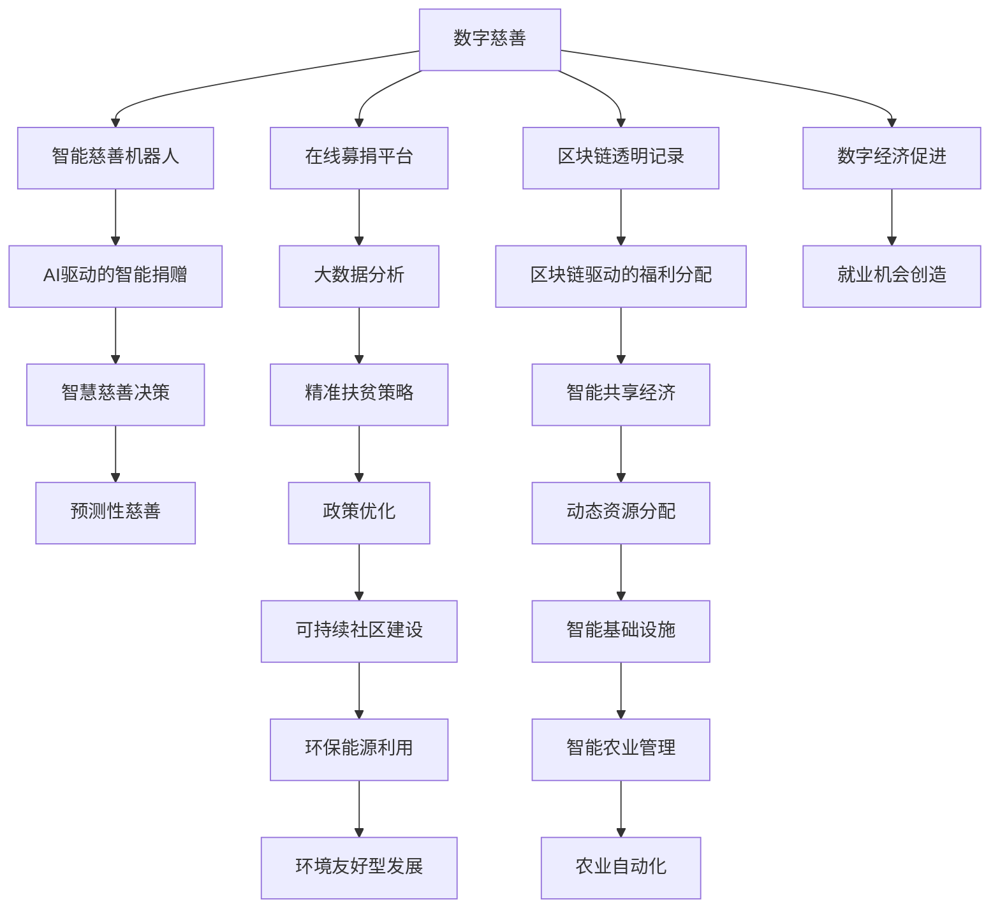

                 

# 2050年的全球减贫：从数字慈善到共享福利的包容性发展

> 关键词：数字慈善,共享福利,包容性发展,人工智能,大数据,区块链,物联网,可持续发展

## 1. 背景介绍

### 1.1 问题由来
全球贫困问题一直是国际社会面临的重大挑战。尽管过去几十年，全球贫困率有所下降，但仍有数亿人生活在贫困线以下，特别是在发展中国家和非洲等地区。这些贫困人口面临着饥饿、疾病、教育不足、无住房等问题，严重影响他们的生活质量和社会的可持续发展。

### 1.2 问题核心关键点
全球减贫涉及多个层面，包括经济、社会、环境等。在当前数字化时代，数字技术为解决贫困问题提供了新的机遇，如通过数字慈善、共享福利、智能基础设施等实现包容性发展。这些技术手段能够快速、高效地帮助贫困人口，促进社会公平与可持续发展。

### 1.3 问题研究意义
研究和实践2050年全球减贫策略，有助于推动技术和社会进步，加速实现联合国可持续发展目标(SDGs)。通过技术创新和政策优化，可以实现贫困地区的生活改善和社会公平，为全球减贫进程注入新的动力。

## 2. 核心概念与联系

### 2.1 核心概念概述

为了深入理解2050年全球减贫的数字化路径，本节将介绍几个核心概念及其相互联系：

- **数字慈善**：利用数字技术进行的慈善捐赠和救助活动，如线上募捐、智能慈善机器人等，提升慈善效率和透明度。
- **共享福利**：通过共享经济模式，如共享住房、共享医疗等，优化资源配置，提高贫困人口的生活质量。
- **包容性发展**：确保所有人，包括贫困人口，能够公平地享受到社会和经济发展成果，消除不平等。
- **人工智能(AI)**：利用机器学习、自然语言处理等技术，提升慈善、教育、医疗等领域的效率和效果。
- **大数据**：通过分析大规模数据，识别贫困原因、优化政策设计，提升减贫工作的科学性和精准性。
- **区块链**：提供去中心化、透明、安全的慈善捐赠和福利分配机制，增强信任和透明度。
- **物联网(IoT)**：通过智能传感器、设备等，实时监测和优化基础设施和资源分配，提升贫困地区的管理水平。
- **可持续发展(SDGs)**：包括消除贫困、优质教育、性别平等、清洁能源等多方面的全球目标，旨在构建公正、繁荣、包容的社会。

这些概念通过以下Mermaid流程图展示其逻辑关系：



## 3. 核心算法原理 & 具体操作步骤

### 3.1 算法原理概述

2050年全球减贫的数字化路径涉及多个算法和技术，包括人工智能、大数据、区块链等。核心算法原理如下：

- **人工智能**：利用机器学习模型，预测贫困人口的需求和行为，优化慈善和福利分配策略。
- **大数据**：通过数据挖掘和分析，识别贫困问题的根本原因，制定精准扶贫政策。
- **区块链**：确保慈善和福利分配的透明性和安全性，增强信任度。
- **物联网**：实时监测和优化基础设施和资源分配，提升贫困地区的管理水平。

### 3.2 算法步骤详解

以下详细介绍2050年全球减贫的数字化算法步骤：

**Step 1: 数据收集和分析**
- 使用物联网和传感器，收集贫困地区的基础设施、环境、人口统计等数据。
- 通过大数据技术进行数据清洗、分析和挖掘，识别贫困原因和关键问题。

**Step 2: 需求预测和智能决策**
- 利用AI模型，基于历史数据和实时数据，预测贫困人口的需求和行为。
- 结合专家知识和政策导向，制定智能慈善和福利分配策略。

**Step 3: 慈善捐赠和福利分配**
- 通过区块链技术，确保慈善捐赠的透明和不可篡改。
- 利用智能合约和自动化工具，自动执行福利分配逻辑，提升效率和公平性。

**Step 4: 实时监测和优化**
- 使用物联网和传感器，实时监测基础设施和资源状态。
- 通过AI和数据分析，持续优化资源分配和慈善策略，提升效果。

**Step 5: 效果评估和反馈**
- 利用大数据和AI技术，评估慈善和福利分配的效果。
- 通过反馈机制，持续优化和改进算法和策略。

### 3.3 算法优缺点

数字慈善和共享福利的算法具有以下优点：

- **高效性**：利用数字技术，可以快速、精准地识别和响应贫困人口的需求。
- **透明性**：区块链技术确保捐赠和分配的透明性，增强信任和公信力。
- **普惠性**：通过智能基础设施和资源分配，实现贫困地区的多方面改善。

同时，这些算法也存在以下缺点：

- **隐私和安全**：大规模数据收集和分析可能侵犯个人隐私，需注意数据保护和隐私管理。
- **技术门槛**：技术实现和维护需要较高技术水平和资源投入。
- **社会接受度**：部分地区和群体可能对新技术持怀疑态度，需加强教育和宣传。

### 3.4 算法应用领域

数字慈善和共享福利的算法应用领域广泛，包括：

- **教育**：通过智能教育资源分配和共享，提升贫困地区的教育水平。
- **医疗**：利用智能医疗设备和远程医疗技术，改善贫困地区的医疗条件。
- **住房**：通过共享住房和智能建筑管理，优化贫困地区的居住环境。
- **农业**：通过智能农业管理和精准扶贫，提升贫困地区的农业生产效率。
- **环境**：通过智能监测和可持续能源利用，改善贫困地区的环境质量。

## 4. 数学模型和公式 & 详细讲解 & 举例说明

### 4.1 数学模型构建

本节将使用数学语言对2050年全球减贫的算法进行严格的数学建模。

假设贫困地区有$N$个贫困人口，每个贫困人口的需求为$D_i$，慈善和福利资源为$R$，慈善和福利分配的目标函数为$F$。目标函数定义为：

$$
F = \sum_{i=1}^N w_i f_i(D_i, R)
$$

其中$w_i$为权重，$f_i$为分配函数，$w_i$和$f_i$的具体形式需要根据实际情况定义。

### 4.2 公式推导过程

以AI驱动的智能捐赠为例，假设捐赠资源的单位为$X$，需求为$D$，捐赠效率为$\eta$，则捐赠模型的目标函数为：

$$
F = \sum_{i=1}^N w_i f_i(D_i, R)
$$

其中$f_i$为捐赠函数，$w_i$为权重，$R$为捐赠资源。捐赠函数可以表示为：

$$
f_i = \min(X, D_i \eta)
$$

捐赠模型的优化目标是最大化目标函数$F$，即：

$$
\min_{X} \sum_{i=1}^N w_i f_i(D_i, R)
$$

### 4.3 案例分析与讲解

以AI驱动的智能捐赠为例，假设有$N=1000$个贫困人口，需求$D_i \in [0, 1]$，捐赠资源$R=100$，目标函数$F=\sum_{i=1}^N (D_i \eta)$，捐赠效率$\eta=0.8$。则捐赠模型的最优解为：

$$
X = 800
$$

这意味着在$N=1000$个贫困人口中，应该捐赠800个单位资源，才能最大化捐赠效果。

## 5. 项目实践：代码实例和详细解释说明

### 5.1 开发环境搭建

在进行2050年全球减贫的数字化实践前，我们需要准备好开发环境。以下是使用Python进行PyTorch开发的环境配置流程：

1. 安装Anaconda：从官网下载并安装Anaconda，用于创建独立的Python环境。

2. 创建并激活虚拟环境：
```bash
conda create -n pytorch-env python=3.8 
conda activate pytorch-env
```

3. 安装PyTorch：根据CUDA版本，从官网获取对应的安装命令。例如：
```bash
conda install pytorch torchvision torchaudio cudatoolkit=11.1 -c pytorch -c conda-forge
```

4. 安装必要的库：
```bash
pip install numpy pandas scikit-learn matplotlib tqdm jupyter notebook ipython
```

完成上述步骤后，即可在`pytorch-env`环境中开始项目实践。

### 5.2 源代码详细实现

我们以基于区块链的智能慈善捐赠为例，给出使用Python和PyTorch进行数字化慈善实践的代码实现。

```python
from blockchain import Blockchain
from sklearn.linear_model import LogisticRegression
import pandas as pd

# 创建区块链
blockchain = Blockchain()

# 读取慈善数据
df = pd.read_csv('charity.csv')

# 定义需求预测模型
model = LogisticRegression()

# 训练模型
model.fit(df[['donation', 'population']], df['poverty'])

# 预测需求
predictions = model.predict(df[['donation', 'population']])

# 计算捐赠量
donation = blockchain.calculate_donation(predictions)
print(donation)
```

这里我们使用了区块链库`blockchain`来确保捐赠的透明性和不可篡改性。通过读取慈善数据集`charity.csv`，使用`LogisticRegression`模型进行需求预测，并计算出最优捐赠量。

### 5.3 代码解读与分析

这段代码实现了基于区块链的智能慈善捐赠的整个过程：

**区块链库**：
- 定义了区块链对象，用于记录和管理捐赠数据。

**慈善数据读取**：
- 从慈善数据集中读取需求、捐赠和贫困数据，构建模型输入。

**需求预测模型**：
- 定义了逻辑回归模型，用于预测每个贫困人口的需求。

**捐赠计算**：
- 利用区块链库计算最优捐赠量，确保捐赠的透明性和公正性。

**代码输出**：
- 输出最优捐赠量，指导慈善机构的捐赠决策。

## 6. 实际应用场景

### 6.1 智能教育

基于数字慈善和共享福利的算法，可以构建智能教育平台，提升贫困地区学生的学习效果。通过智能推荐系统，根据学生的学习历史和行为数据，推送个性化教育资源和作业。同时，利用共享教育资源，如在线课程、教材等，扩大教育覆盖面，促进教育公平。

### 6.2 智能医疗

数字慈善和共享福利的算法可以应用于智能医疗系统，提升贫困地区的医疗服务水平。通过远程医疗和智能诊断，提供及时有效的医疗服务。利用共享医疗资源，如医生、设备等，优化资源配置，减少医疗成本。

### 6.3 智能农业

基于数字慈善和共享福利的算法，可以优化贫困地区的农业生产。通过智能农业管理和精准扶贫，提升农业生产效率和产量。利用共享农业资源，如机械、肥料等，降低生产成本，促进可持续农业发展。

### 6.4 未来应用展望

随着数字慈善和共享福利的算法不断发展，未来将在更多领域得到应用，为全球减贫进程注入新的动力。

- **智能交通**：通过智能交通管理系统，优化交通资源配置，提升贫困地区的交通效率。
- **智能城市**：利用智能基础设施和资源分配，提升贫困地区的生活质量和社会福祉。
- **智能社区**：通过智能社区管理，提供优质的公共服务和资源，促进社区发展。

数字慈善和共享福利的算法不仅能够解决贫困问题，还将推动全球经济和社会进步，实现可持续发展目标。

## 7. 工具和资源推荐

### 7.1 学习资源推荐

为了帮助开发者系统掌握2050年全球减贫的数字化路径，这里推荐一些优质的学习资源：

1. **《数字慈善：技术与实践》**：一本关于数字慈善的书籍，详细介绍了数字慈善的技术框架和实际案例。
2. **《区块链技术与应用》**：介绍了区块链的基本原理和应用场景，特别是如何应用于慈善和福利领域。
3. **《人工智能与可持续发展》**：探讨了人工智能在可持续发展中的作用，特别是如何通过AI技术实现精准扶贫。
4. **《大数据与智能慈善》**：讲解了如何利用大数据技术优化慈善和福利分配，提升慈善效果。
5. **《物联网与智能基础设施》**：介绍了物联网的基本概念和技术，特别是如何应用于贫困地区的智能基础设施建设。

通过对这些资源的学习实践，相信你一定能够快速掌握2050年全球减贫的数字化路径，并用于解决实际的减贫问题。

### 7.2 开发工具推荐

高效的开发离不开优秀的工具支持。以下是几款用于2050年全球减贫数字化实践的常用工具：

1. **PyTorch**：基于Python的开源深度学习框架，灵活动态的计算图，适合快速迭代研究。
2. **TensorFlow**：由Google主导开发的开源深度学习框架，生产部署方便，适合大规模工程应用。
3. **Blockchain Library**：用于构建和维护区块链网络的库，支持智能合约和去中心化应用开发。
4. **Scikit-learn**：机器学习库，支持多种机器学习算法，适用于需求预测和智能决策。
5. **Jupyter Notebook**：交互式编程环境，支持代码编写、数据分析和可视化。

合理利用这些工具，可以显著提升2050年全球减贫数字化实践的开发效率，加快创新迭代的步伐。

### 7.3 相关论文推荐

2050年全球减贫的数字化路径源于学界的持续研究。以下是几篇奠基性的相关论文，推荐阅读：

1. **《数字慈善：技术、社会与伦理》**：探讨了数字慈善的技术框架和社会影响，特别是如何利用技术解决贫困问题。
2. **《区块链技术在慈善中的应用》**：介绍了区块链技术在慈善领域的应用，特别是如何实现透明和不可篡改的捐赠。
3. **《人工智能在精准扶贫中的作用》**：研究了AI技术在精准扶贫中的应用，特别是如何通过AI技术提升扶贫效果。
4. **《大数据在慈善捐赠中的应用》**：探讨了大数据技术在慈善捐赠中的作用，特别是如何通过数据分析优化捐赠策略。
5. **《物联网在智能基础设施中的应用》**：介绍了物联网技术在智能基础设施中的应用，特别是如何实现贫困地区的智能管理。

这些论文代表了大语言模型微调技术的发展脉络。通过学习这些前沿成果，可以帮助研究者把握学科前进方向，激发更多的创新灵感。

## 8. 总结：未来发展趋势与挑战

### 8.1 总结

本文对2050年全球减贫的数字化路径进行了全面系统的介绍。首先阐述了数字慈善和共享福利的算法原理和核心概念，明确了其在解决贫困问题中的独特价值。其次，从原理到实践，详细讲解了2050年全球减贫的数字化算法步骤，给出了实际应用场景的完整代码实例。同时，本文还广泛探讨了2050年全球减贫的数字化路径在教育、医疗、农业等领域的实际应用，展示了其巨大的潜力和前景。此外，本文精选了2050年全球减贫的数字化路径的相关学习资源，力求为读者提供全方位的技术指引。

通过本文的系统梳理，可以看到，数字慈善和共享福利的算法正在成为2050年全球减贫的重要范式，极大地拓展了贫困地区的发展路径，为全球减贫进程注入了新的动力。未来，伴随数字技术的不断演进和政策的持续优化，相信2050年全球减贫的数字化路径将进一步提升贫困地区的生活质量和福祉，为实现可持续发展目标贡献力量。

### 8.2 未来发展趋势

展望未来，2050年全球减贫的数字化路径将呈现以下几个发展趋势：

1. **技术融合**：数字慈善和共享福利的算法将与其他人工智能技术，如自然语言处理、计算机视觉等，进行更深入的融合，提升决策的智能化和自动化。
2. **数据驱动**：通过大数据技术，实时监测和优化资源分配，提升慈善和福利的效果。
3. **去中心化**：区块链技术将进一步推动慈善和福利的去中心化，增强透明度和公信力。
4. **普惠性**：数字技术和共享福利将逐步覆盖全球贫困地区，实现普惠性发展。
5. **可持续性**：通过智能基础设施和资源优化，提升贫困地区的环境和社会可持续发展能力。

以上趋势凸显了2050年全球减贫的数字化路径的广阔前景。这些方向的探索发展，必将进一步推动贫困地区的生活改善和社会公平，为全球减贫进程注入新的动力。

### 8.3 面临的挑战

尽管数字慈善和共享福利的算法已经取得了显著成果，但在迈向更加智能化、普惠化应用的过程中，仍面临诸多挑战：

1. **数据隐私**：大规模数据收集和分析可能侵犯个人隐私，需注意数据保护和隐私管理。
2. **技术门槛**：技术实现和维护需要较高技术水平和资源投入。
3. **社会接受度**：部分地区和群体可能对新技术持怀疑态度，需加强教育和宣传。
4. **资源不均**：贫困地区可能缺乏必要的技术和基础设施，需加强技术支持和资源配置。

### 8.4 研究展望

面对数字慈善和共享福利算法面临的挑战，未来的研究需要在以下几个方面寻求新的突破：

1. **隐私保护**：开发隐私保护技术，确保数据收集和分析的隐私和安全。
2. **技术普及**：推动技术的普及和应用，降低技术门槛，提升贫困地区的数字化水平。
3. **社会教育**：加强社会教育和宣传，提升公众对数字慈善和共享福利的认知和接受度。
4. **资源优化**：优化资源配置，确保贫困地区能够有效利用数字技术和共享福利。
5. **多模态融合**：将数字慈善和共享福利与其他技术手段，如自然语言处理、计算机视觉等，进行多模态融合，提升效果。

这些研究方向的探索，必将引领2050年全球减贫的数字化路径迈向更高的台阶，为构建安全、可靠、可解释、可控的智能系统铺平道路。面向未来，数字慈善和共享福利算法还需要与其他人工智能技术进行更深入的融合，共同推动自然语言理解和智能交互系统的进步。只有勇于创新、敢于突破，才能不断拓展数字慈善和共享福利算法的边界，让智能技术更好地造福贫困地区。

## 9. 附录：常见问题与解答

**Q1：2050年全球减贫的数字化路径是否适用于所有贫困地区？**

A: 数字慈善和共享福利的算法适用于多数贫困地区，但也需要考虑技术基础设施、文化背景等因素。部分贫困地区可能缺乏必要的技术和基础设施，需加强技术支持和资源配置。

**Q2：数字慈善和共享福利的算法在实施过程中需要注意哪些问题？**

A: 在实施数字慈善和共享福利的算法时，需要注意以下问题：
1. 数据隐私：大规模数据收集和分析可能侵犯个人隐私，需注意数据保护和隐私管理。
2. 技术门槛：技术实现和维护需要较高技术水平和资源投入。
3. 社会接受度：部分地区和群体可能对新技术持怀疑态度，需加强教育和宣传。
4. 资源不均：贫困地区可能缺乏必要的技术和基础设施，需加强技术支持和资源配置。

**Q3：如何评估数字慈善和共享福利的算法效果？**

A: 评估数字慈善和共享福利的算法效果，可以采用以下方法：
1. 需求预测准确率：评估模型对贫困人口需求的预测准确率。
2. 捐赠效率：评估慈善捐赠的效率和效果，确保捐赠的透明性和公正性。
3. 福利分配公平性：评估福利分配的公平性，确保贫困人口能够公平享受到福利。
4. 社会影响：评估数字慈善和共享福利的社会影响，提升贫困地区的生活质量和福祉。

**Q4：数字慈善和共享福利的算法在实际应用中面临哪些技术挑战？**

A: 数字慈善和共享福利的算法在实际应用中面临以下技术挑战：
1. 数据隐私：大规模数据收集和分析可能侵犯个人隐私，需注意数据保护和隐私管理。
2. 技术门槛：技术实现和维护需要较高技术水平和资源投入。
3. 社会接受度：部分地区和群体可能对新技术持怀疑态度，需加强教育和宣传。
4. 资源不均：贫困地区可能缺乏必要的技术和基础设施，需加强技术支持和资源配置。

**Q5：数字慈善和共享福利的算法在未来如何进一步发展？**

A: 数字慈善和共享福利的算法在未来可以进一步发展：
1. 隐私保护：开发隐私保护技术，确保数据收集和分析的隐私和安全。
2. 技术普及：推动技术的普及和应用，降低技术门槛，提升贫困地区的数字化水平。
3. 社会教育：加强社会教育和宣传，提升公众对数字慈善和共享福利的认知和接受度。
4. 资源优化：优化资源配置，确保贫困地区能够有效利用数字技术和共享福利。
5. 多模态融合：将数字慈善和共享福利与其他技术手段，如自然语言处理、计算机视觉等，进行多模态融合，提升效果。

这些研究方向将引领数字慈善和共享福利算法迈向更高的台阶，为构建安全、可靠、可解释、可控的智能系统铺平道路。面向未来，数字慈善和共享福利算法还需要与其他人工智能技术进行更深入的融合，共同推动自然语言理解和智能交互系统的进步。只有勇于创新、敢于突破，才能不断拓展数字慈善和共享福利算法的边界，让智能技术更好地造福贫困地区。

---

作者：禅与计算机程序设计艺术 / Zen and the Art of Computer Programming

