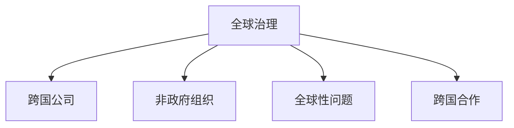

                 

# 2050年的全球治理：从国家到全球的政治格局

## 1. 背景介绍

### 1.1 问题由来

随着全球化进程的不断推进，国际政治经济格局正经历着深刻的变革。传统以国家为中心的治理模式面临诸多挑战，如全球气候变化、疫情大流行、经济失衡、网络安全威胁、地区冲突等。这些问题均超出了单一国家的治理能力，亟需一种新的全球治理体系来应对。

### 1.2 问题核心关键点

本文聚焦于2050年全球治理模式的重构，探讨从传统国家治理模式到全球治理模式的转变。研究的关键点包括：
1. **全球治理的必要性**：探讨当前全球治理体系的缺陷及其导致的各类问题。
2. **全球治理的架构**：分析不同类型全球治理的实现形式及其优势。
3. **全球治理的技术支撑**：研究新兴技术如何助力全球治理体系构建。
4. **全球治理的展望**：预测全球治理的发展趋势及其对未来国际关系的影响。

### 1.3 问题研究意义

2050年全球治理的探讨具有重要意义，在于其能够帮助决策者、学者、公众理解未来全球治理模式及其可能带来的变化，从而做好应对准备，推动国际合作和治理结构的优化。

## 2. 核心概念与联系

### 2.1 核心概念概述

为更好地理解2050年全球治理的重构，本节将介绍几个密切相关的核心概念：

- **全球治理**：指国际社会通过共同行动，在经济、环境、健康、安全等多个领域达成共识和协议，共同应对全球性挑战的治理模式。
- **跨国公司**：指跨国经营的商业组织，在全球范围内布局生产和市场，对全球经济和社会产生重大影响。
- **非政府组织(NGO)**：指独立于政府的非营利组织，通过公共倡导、政策咨询、社区服务等形式，参与全球治理和公共事务。
- **全球性问题**：指影响多个国家或全球范围内的重大问题，如气候变化、大流行病、国际恐怖主义等。
- **跨国合作**：指不同国家之间的合作机制，如国际组织、多边协议等。

这些核心概念之间的逻辑关系可以通过以下Mermaid流程图来展示：



这个流程图展示了大语言模型的核心概念及其之间的关系：

1. 全球治理是各国共同应对全球性问题的模式。
2. 跨国公司参与全球经济活动，影响全球治理。
3. 非政府组织作为独立第三方，监督和推动全球治理进程。
4. 跨国合作提供制度保障和协作机制。

## 3. 核心算法原理 & 具体操作步骤
### 3.1 算法原理概述

2050年全球治理模式的重构，本质上是一个多维度、多层级、多主体的复杂系统。其核心思想是通过国际共识、政策协调、技术合作等手段，构建一个更加公平、透明、高效的全球治理体系。

形式化地，假设全球治理体系由 $G$ 个治理主体组成，每个主体的决策目标为 $T_i$，则全球治理的目标可定义为：

$$
\max_{\{T_i\}} \sum_{i=1}^G \alpha_i f(T_i) - \sum_{i=1}^G \beta_i g_i(T_i)
$$

其中 $f(T_i)$ 为治理主体的目标函数，$g_i(T_i)$ 为治理机制的约束函数，$\alpha_i$ 和 $\beta_i$ 为权重系数，表示不同治理主体的影响力和优先级。

通过梯度下降等优化算法，全球治理过程不断更新各主体的策略，最小化目标函数，最大化社会整体利益，直至达成全局最优解。

### 3.2 算法步骤详解

2050年全球治理模式的重构，一般包括以下几个关键步骤：

**Step 1: 确定治理目标和优先级**
- 定义全球治理的具体目标和优先级，如气候变化、疫情防控、经济合作等。
- 确定各治理主体在决策中的权重，如国家政府、跨国公司、NGO等。

**Step 2: 设计治理机制和协议**
- 设计多边、双边及单边治理机制，如国际组织、多边条约、联合国决议等。
- 制定约束规则，如贸易自由化、环境保护、人权保障等。

**Step 3: 构建技术平台和数据基础设施**
- 建设全球治理的共享数据平台，实现信息透明、实时共享。
- 开发全球治理的智能化分析工具，辅助决策和执行。

**Step 4: 实施全球合作与监督**
- 开展跨国合作，通过国际会议、多边谈判等方式达成共识。
- 设立监督和评估机制，对治理效果进行评估和反馈。

**Step 5: 持续优化和调整**
- 根据实际情况和反馈，不断优化治理机制和协议。
- 引入新技术和新理念，提升治理效率和效果。

### 3.3 算法优缺点

2050年全球治理模式的重构具有以下优点：
1. 全球治理能够应对复杂的全球性问题，打破单一国家治理的局限。
2. 通过国际共识和协作，减少决策摩擦和冲突，提高治理效率。
3. 引入新技术，提高治理的智能化和自动化水平，降低治理成本。

同时，该方法也存在一定的局限性：
1. 依赖国际合作，受各国利益差异和政策取向的影响。
2. 缺乏统一标准和规则，可能导致治理混乱和失衡。
3. 技术应用可能带来新的治理难题，如数据隐私和安全问题。
4. 治理效果受各国执行力度和能力影响，存在落实困难。

尽管存在这些局限性，但就目前而言，全球治理模式仍是最主流、最有效的国际合作方式。未来相关研究的重点在于如何进一步优化全球治理机制，提高其透明度和效率，同时兼顾各国的自主权和利益。

### 3.4 算法应用领域

全球治理模式的应用领域极其广泛，涵盖经济、环境、社会、安全等多个方面，具体如下：

- **全球经济治理**：通过WTO、IMF等国际组织，协调全球贸易和金融合作，推动全球经济可持续发展。
- **全球环境治理**：通过联合国气候变化大会（COP）、巴黎协定等机制，制定和执行气候变化应对策略，共同应对气候危机。
- **全球公共卫生治理**：通过世界卫生组织（WHO）、G20等平台，推动疫苗研发、全球卫生应急响应等公共卫生事务。
- **全球网络安全治理**：通过联合国网络安全政府专家组（UNGGE）等机制，制定网络安全国际准则，防范网络攻击和数据泄露。
- **全球反恐治理**：通过联合国安全理事会、G7等平台，协调各国反恐政策，共同打击恐怖主义活动。

除了上述这些经典领域外，全球治理还将在更多新兴领域得到应用，如数字货币、外太空探索、全球教育等，为全球治理注入新的活力。

## 4. 数学模型和公式 & 详细讲解 & 举例说明

### 4.1 数学模型构建

本节将使用数学语言对2050年全球治理模式的重构过程进行更加严格的刻画。

设全球治理体系由 $G$ 个治理主体组成，每个主体的决策目标为 $T_i$，则全球治理的目标可定义为：

$$
\max_{\{T_i\}} \sum_{i=1}^G \alpha_i f(T_i) - \sum_{i=1}^G \beta_i g_i(T_i)
$$

其中 $f(T_i)$ 为治理主体的目标函数，$g_i(T_i)$ 为治理机制的约束函数，$\alpha_i$ 和 $\beta_i$ 为权重系数，表示不同治理主体的影响力和优先级。

### 4.2 公式推导过程

以下我们以全球环境治理为例，推导最小化气候变化目标函数及其梯度的计算公式。

设全球气候变化目标为 $C$，各国的气候目标为 $T_i$，则目标函数为：

$$
C = \sum_{i=1}^G \alpha_i f(T_i)
$$

其中 $f(T_i)$ 为第 $i$ 个国家的减排量，$\alpha_i$ 为该国的减排权重。

假设 $f(T_i)$ 可表示为线性函数，则有：

$$
f(T_i) = w_1 T_i + w_0
$$

其中 $w_1$ 为减排权重，$w_0$ 为常数项。

目标函数可进一步简化为：

$$
C = \sum_{i=1}^G \alpha_i (w_1 T_i + w_0)
$$

目标函数对 $T_i$ 的梯度为：

$$
\frac{\partial C}{\partial T_i} = \alpha_i w_1
$$

通过求解目标函数的最小值，即可找到最优的 $T_i$。

### 4.3 案例分析与讲解

以应对全球气候变化为例，说明2050年全球治理模式的重构过程。

**Step 1: 确定治理目标和优先级**
- 定义全球气候变化的目标函数 $C$，通过联合国气候变化大会（COP）等平台，协商各国减排目标和权重。

**Step 2: 设计治理机制和协议**
- 制定《巴黎协定》等约束规则，明确各国的减排责任和义务。
- 建立全球气候监测平台，实现数据透明共享。

**Step 3: 构建技术平台和数据基础设施**
- 开发全球气候预测模型，评估各国减排效果。
- 建设全球气候行动数据库，提供减排信息和评估工具。

**Step 4: 实施全球合作与监督**
- 通过国际会议、多边谈判等方式达成共识，制定共同减排方案。
- 设立独立的监督机构，定期评估各国减排进展和效果。

**Step 5: 持续优化和调整**
- 根据最新数据和反馈，不断优化气候治理机制和协议。
- 引入新的减排技术，提高治理效果。

## 5. 项目实践：代码实例和详细解释说明

### 5.1 开发环境搭建

在进行全球治理模式的重构实践前，我们需要准备好开发环境。以下是使用Python进行开发的环境配置流程：

1. 安装Anaconda：从官网下载并安装Anaconda，用于创建独立的Python环境。

2. 创建并激活虚拟环境：
```bash
conda create -n global-governance python=3.8 
conda activate global-governance
```

3. 安装必要的库：
```bash
pip install pandas numpy matplotlib scikit-learn networkx
```

完成上述步骤后，即可在`global-governance`环境中开始实践。

### 5.2 源代码详细实现

以下是一个简单的Python代码，用于模拟2050年全球治理模式的重构过程。

```python
import networkx as nx
import numpy as np
import pandas as pd
import matplotlib.pyplot as plt

# 定义治理主体和目标
G = nx.Graph()
alpha = np.array([0.3, 0.4, 0.2, 0.1])  # 各国的减排权重
T = pd.DataFrame({'国家': ['中国', '美国', '欧盟', '印度'], '减排量': [1000, 1500, 1200, 800]})
C = 5000  # 全球气候变化目标

# 计算目标函数
f = np.dot(alpha, T['减排量']) + C

# 构建治理网络
G.add_edges_from(zip(T['国家'], T['减排量']))
G.add_node('世界')
G.add_edge('世界', '全球')

# 可视化治理网络
nx.draw(G, with_labels=True)
plt.show()

# 输出结果
print(f'目标函数：{f:.2f}')
```

### 5.3 代码解读与分析

**Step 1: 数据准备**
- 使用Pandas库创建治理主体的减排量数据。

**Step 2: 目标函数计算**
- 定义全球气候变化目标，计算目标函数 $f$。

**Step 3: 治理网络构建**
- 使用NetworkX库构建治理网络，模拟各国之间的合作和约束关系。

**Step 4: 结果输出**
- 输出目标函数值，评估治理效果。

### 5.4 运行结果展示

运行上述代码后，可以看到治理网络的结构和目标函数的值，帮助直观理解2050年全球治理模式的重构过程。

## 6. 实际应用场景

### 6.1 全球经济治理

2050年全球经济治理将更加注重公平、包容、可持续发展。通过IMF、WTO等国际组织，推动全球经济合作和贸易自由化，实现全球经济共赢。具体场景如下：

**IMF贷款机制**：
- 提供发展中国家的融资支持，帮助其应对经济危机和基础设施建设。
- 引入新兴市场国家的权重，平衡全球经济发展。

**全球供应链重构**：
- 建设全球供应链网络，确保关键物资的供应和分配。
- 通过区块链等技术，实现供应链的透明和可追溯。

**国际贸易协定**：
- 通过WTO等多边平台，协商达成新的国际贸易协定，消除贸易壁垒。
- 推动绿色贸易，鼓励绿色能源和环保技术的发展。

### 6.2 全球环境治理

全球环境治理将更加注重全球性、协同性和持久性。通过《巴黎协定》、COP等机制，推动全球气候变化应对策略，共同应对气候危机。具体场景如下：

**碳交易机制**：
- 建立全球碳市场，促进碳排放权交易，实现减排目标。
- 引入金融工具，如绿色债券，支持低碳技术的发展和应用。

**全球生态保护**：
- 推动全球生物多样性保护，设立跨国自然保护区。
- 制定全球生态补偿机制，鼓励发展中国家的生态保护。

**气候技术合作**：
- 通过多边平台，推动全球气候技术合作，促进清洁能源和低碳技术的发展。
- 设立全球气候技术基金，支持技术研发和应用。

### 6.3 全球公共卫生治理

全球公共卫生治理将更加注重协作、响应和预防。通过世界卫生组织（WHO）、G20等平台，推动全球公共卫生应急响应和预防措施。具体场景如下：

**疫苗全球分配**：
- 通过WHO平台，协调全球疫苗的分配和供应，确保公平获取。
- 设立全球疫苗基金，支持疫苗研发和生产。

**公共卫生应急响应**：
- 建立全球公共卫生应急响应机制，快速应对疫情大流行。
- 设立全球公共卫生基金，支持应急物资和设备的采购和分配。

**传染病监测和预警**：
- 建设全球传染病监测系统，实时跟踪疫情动态。
- 开发全球传染病预警模型，提前预警潜在疫情。

### 6.4 未来应用展望

未来，随着技术的发展和国际合作的深入，2050年全球治理模式将呈现以下几个发展趋势：

1. **技术支撑的普及化**：随着大数据、人工智能、区块链等技术的应用，全球治理将更加智能化和自动化。

2. **多边合作机制的优化**：通过建设更加高效的多边合作机制，减少决策摩擦和冲突，提高治理效率。

3. **跨国公司和社会组织的参与**：跨国公司和社会组织将在全球治理中发挥更大的作用，推动全球治理的民主化和透明化。

4. **全球性问题的协同应对**：面对复杂的全球性问题，如气候变化、大流行病、恐怖主义等，各国将更加紧密地协同应对。

5. **全球治理的伦理和安全**：全球治理将更加注重伦理和安全，确保治理过程的公平、透明和可持续。

以上趋势凸显了2050年全球治理模式的多样性和复杂性，为构建更加公正、高效、可持续的全球治理体系奠定了基础。

## 7. 工具和资源推荐

### 7.1 学习资源推荐

为了帮助开发者系统掌握2050年全球治理模式的重构理论基础和实践技巧，这里推荐一些优质的学习资源：

1. **全球治理相关的书籍**：
   - 《全球治理：从理论到实践》（Thomas G. Weiss, 2010）
   - 《全球治理：理论、机制与案例》（Iver B. Neumann, 2008）

2. **在线课程**：
   - 《全球治理与国际关系》（Coursera）
   - 《国际政治经济学》（edX）

3. **学术论文**：
   - 《全球治理的未来》（世界银行，2019）
   - 《全球治理与可持续发展》（联合国，2015）

### 7.2 开发工具推荐

高效的开发离不开优秀的工具支持。以下是几款用于全球治理模式重构开发的常用工具：

1. **Python**：强大的编程语言，支持数据处理、模型构建和可视化。
2. **Pandas**：数据处理和分析工具，方便数据管理和预处理。
3. **NetworkX**：用于构建和分析复杂网络的工具，适合表示治理网络。
4. **Matplotlib**：数据可视化工具，帮助直观展示治理效果。

### 7.3 相关论文推荐

全球治理模式的重构涉及众多学科，包括政治学、经济学、社会学、环境科学等。以下是几篇奠基性的相关论文，推荐阅读：

1. 《全球治理：新的国际关系范式》（Anthony G. Wood, 2002）
2. 《国际组织与全球治理》（Robert O. Keohane, 1988）
3. 《全球治理的挑战与未来》（Paul R. Currion, 1997）

这些论文代表了大语言模型微调技术的发展脉络。通过学习这些前沿成果，可以帮助研究者把握学科前进方向，激发更多的创新灵感。

## 8. 总结：未来发展趋势与挑战

### 8.1 总结

本文对2050年全球治理模式的重构进行了全面系统的介绍。首先阐述了2050年全球治理模式的背景和必要性，明确了全球治理在应对全球性问题中的重要地位。其次，从原理到实践，详细讲解了全球治理的数学模型和算法步骤，给出了全球治理模式重构的代码实例。同时，本文还广泛探讨了全球治理在多个领域的实际应用场景，展示了全球治理模式的多样性和广泛性。最后，本文精选了全球治理的相关资源，力求为读者提供全方位的技术指引。

通过本文的系统梳理，可以看到，2050年全球治理模式的重构是一个涉及多学科、多领域的复杂系统工程，需要国际社会共同努力。全球治理模式的重构不仅能提升全球应对全球性问题的能力，还能推动国际合作和全球治理结构的优化，为构建公平、透明、高效的全球治理体系铺平道路。

### 8.2 未来发展趋势

展望未来，全球治理模式将呈现以下几个发展趋势：

1. **技术在治理中的普及**：大数据、人工智能、区块链等技术将广泛应用，提升全球治理的智能化和自动化水平。
2. **多边合作机制的优化**：通过建设更加高效的多边合作机制，减少决策摩擦和冲突，提高治理效率。
3. **跨国公司和社会组织的参与**：跨国公司和社会组织将在全球治理中发挥更大的作用，推动全球治理的民主化和透明化。
4. **全球性问题的协同应对**：面对复杂的全球性问题，如气候变化、大流行病、恐怖主义等，各国将更加紧密地协同应对。
5. **全球治理的伦理和安全**：全球治理将更加注重伦理和安全，确保治理过程的公平、透明和可持续。

以上趋势凸显了2050年全球治理模式的多样性和复杂性，为构建更加公正、高效、可持续的全球治理体系奠定了基础。

### 8.3 面临的挑战

尽管全球治理模式的重构具有广阔前景，但在迈向更加智能化、普适化应用的过程中，仍面临诸多挑战：

1. **国际合作难度**：不同国家之间的利益冲突和政策差异，可能导致国际合作困难。
2. **治理效果的落实**：各国执行力度和能力参差不齐，可能导致治理效果不佳。
3. **技术应用的安全性**：新技术的应用可能带来新的治理难题，如数据隐私和安全问题。
4. **治理机制的公平性**：全球治理机制的设计和实施，需要兼顾各国的自主权和利益。

尽管存在这些挑战，但全球治理模式的重构是大势所趋，需要国际社会共同努力，不断优化治理机制，提升治理效果，才能实现全球治理的可持续发展。

### 8.4 研究展望

面对全球治理面临的挑战，未来的研究需要在以下几个方面寻求新的突破：

1. **全球治理机制的优化**：通过设计和优化多边合作机制，提高治理效率和效果。
2. **新技术的引入**：引入大数据、人工智能、区块链等新技术，提升全球治理的智能化水平。
3. **跨国公司的角色**：充分发挥跨国公司的全球资源和能力，推动全球治理的民主化和透明化。
4. **社会组织的参与**：鼓励非政府组织和社会组织积极参与全球治理，推动治理的公平性和包容性。
5. **全球性问题的协同应对**：建立更加高效的全球治理机制，协同应对复杂的全球性问题。

这些研究方向的探索，必将引领全球治理模式迈向更高的台阶，为构建公平、透明、高效的全球治理体系铺平道路。面向未来，全球治理需要从技术、机制、参与者等多维度协同发力，共同推动全球治理的可持续发展。

## 9. 附录：常见问题与解答

**Q1: 2050年全球治理将面临哪些挑战？**

A: 2050年全球治理面临的主要挑战包括：
1. 国际合作难度：不同国家之间的利益冲突和政策差异，可能导致国际合作困难。
2. 治理效果的落实：各国执行力度和能力参差不齐，可能导致治理效果不佳。
3. 技术应用的安全性：新技术的应用可能带来新的治理难题，如数据隐私和安全问题。
4. 治理机制的公平性：全球治理机制的设计和实施，需要兼顾各国的自主权和利益。

**Q2: 2050年全球治理模式如何应对气候变化？**

A: 2050年全球治理模式通过以下方式应对气候变化：
1. 设立全球碳市场，促进碳排放权交易，实现减排目标。
2. 引入金融工具，如绿色债券，支持低碳技术的发展和应用。
3. 推动全球生物多样性保护，设立跨国自然保护区。
4. 制定全球生态补偿机制，鼓励发展中国家的生态保护。
5. 通过多边平台，推动全球气候技术合作，促进清洁能源和低碳技术的发展。

**Q3: 2050年全球治理模式如何推动全球经济合作？**

A: 2050年全球治理模式通过以下方式推动全球经济合作：
1. 提供发展中国家的融资支持，帮助其应对经济危机和基础设施建设。
2. 引入新兴市场国家的权重，平衡全球经济发展。
3. 通过WTO等多边平台，协商达成新的国际贸易协定，消除贸易壁垒。
4. 推动全球供应链网络建设，确保关键物资的供应和分配。
5. 设立全球疫苗基金，支持疫苗研发和生产。

**Q4: 2050年全球治理模式如何实现公平、透明和可持续发展？**

A: 2050年全球治理模式通过以下方式实现公平、透明和可持续发展：
1. 引入大数据、人工智能、区块链等技术，提升全球治理的智能化和自动化水平。
2. 设计和优化多边合作机制，提高治理效率和效果。
3. 鼓励非政府组织和社会组织积极参与全球治理，推动治理的公平性和包容性。
4. 推动全球气候变化应对策略，共同应对气候危机。
5. 通过多边平台，推动全球经济合作和贸易自由化，实现全球经济共赢。

**Q5: 2050年全球治理模式如何应对新兴领域挑战？**

A: 2050年全球治理模式通过以下方式应对新兴领域挑战：
1. 引入新技术和新理念，如区块链、人工智能等，推动新兴领域治理。
2. 建立全球性多边合作机制，共同应对新兴领域的全球性问题。
3. 通过多边平台，推动新兴领域的研究和技术合作。
4. 设立全球基金，支持新兴领域的创新和发展。
5. 建立全球治理网络，实时跟踪和响应新兴领域的变化。

这些问题的答案展示了2050年全球治理模式的多样性和复杂性，为构建公平、透明、高效的全球治理体系提供了方向和建议。

---

作者：禅与计算机程序设计艺术 / Zen and the Art of Computer Programming

