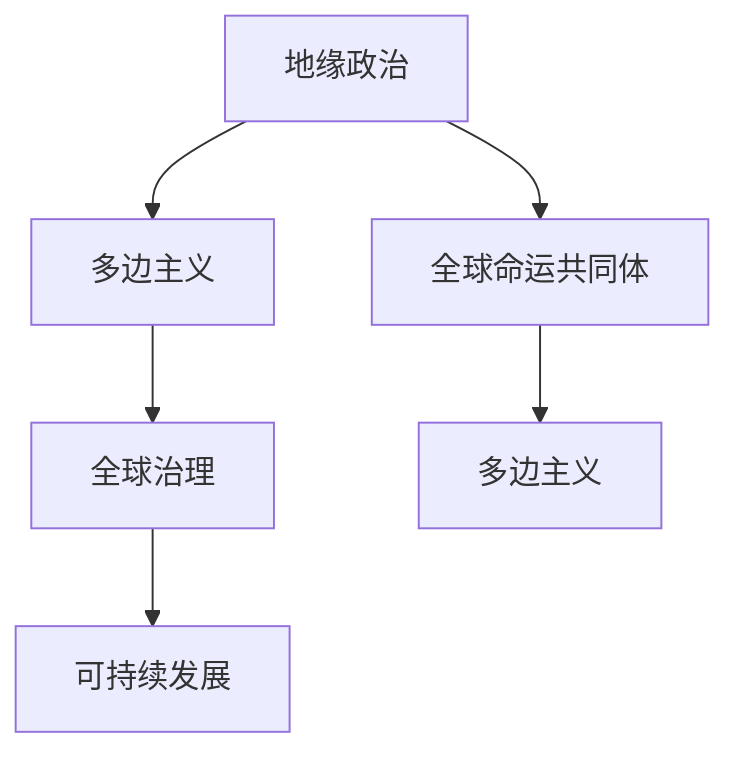
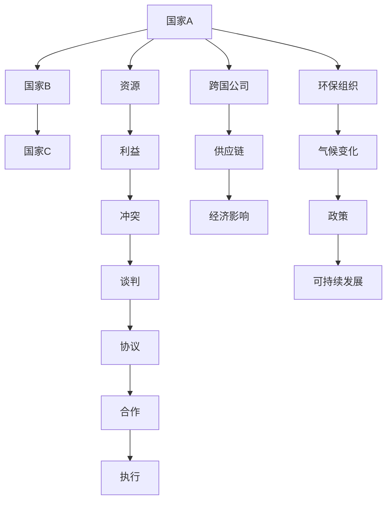

                 

# 2050年的全球治理：从地缘政治到全球命运共同体的理念更新

## 1. 背景介绍

在全球化的今天，各国之间的联系越来越紧密，共同面临的挑战也越来越多，如气候变化、传染病疫情、网络安全、贸易争端、地缘政治冲突等。如何协调各国利益，建立有效的全球治理体系，是国际社会的重要课题。本文将探讨2050年全球治理的展望，并重点分析从地缘政治到全球命运共同体理念的演变。

## 2. 核心概念与联系

### 2.1 核心概念概述

- **地缘政治**：指地理因素在国际政治、经济、军事等领域中的作用和影响。传统的地缘政治关注大国之间的力量平衡，资源控制和政治影响力。

- **全球命运共同体**：提出构建人类命运共同体，即各国相互依存，共同繁荣，共享全球治理的成果，实现持久和平与共同发展。

- **多边主义**：指多个国家或国际组织共同参与全球治理，合作解决全球性问题，而不是由单一或少数国家主导。

- **全球治理**：指通过国际合作和协调，处理全球性问题，如气候变化、国际贸易、公共卫生、网络安全等。

- **可持续发展**：指在满足当代人需求的同时，不损害后代人满足需求的能力，强调环境保护、经济发展和社会的包容性。

这些概念通过Mermaid流程图相联系，展示全球治理的发展脉络：



### 2.2 核心概念原理和架构的 Mermaid 流程图



此图展示了地缘政治下的国家间资源利益冲突，通过谈判、协议、合作与执行，实现利益平衡和可持续发展。

## 3. 核心算法原理 & 具体操作步骤

### 3.1 算法原理概述

全球治理的算法原理可以概括为“多主体协作模型”，通过构建多个国家、组织和利益相关方的协作网络，实现集体决策和问题解决。算法包括但不限于博弈论、集体行动理论、网络科学等。

### 3.2 算法步骤详解

1. **利益映射**：确定各方的利益和需求，建立利益矩阵。
2. **建立模型**：基于利益矩阵和博弈论规则构建多主体协作模型。
3. **仿真与优化**：通过仿真实验优化模型参数，寻找最优解决方案。
4. **协议制定**：在仿真结果的基础上，制定具体的国际协议和合作机制。
5. **执行与反馈**：协议执行后，收集反馈信息，更新模型和协议。

### 3.3 算法优缺点

优点：
- **多元决策**：考虑到各方的利益和需求，使得决策更加公正和全面。
- **动态优化**：通过仿真和反馈机制，不断调整策略和协议，提高治理效果。
- **透明可追溯**：通过算法步骤和数据透明，增强信任和透明度。

缺点：
- **复杂度**：算法模型复杂，需要专业的数学和计算机科学知识。
- **执行困难**：协议和策略的执行需要各国政府的合作，存在执行难度。
- **协议偏差**：各方利益不同，可能出现协议偏向少数强势国家。

### 3.4 算法应用领域

算法广泛应用于以下领域：
- **气候变化**：通过各国合作，共同应对全球变暖问题。
- **国际贸易**：构建公平的国际贸易规则和机制，促进经济合作。
- **公共卫生**：建立跨国合作机制，应对疫情传播和医疗资源分配。
- **网络安全**：协调各国网络安全政策，共同应对网络威胁。
- **能源合作**：推动跨国能源项目，实现能源的可持续供应和利用。

## 4. 数学模型和公式 & 详细讲解 & 举例说明

### 4.1 数学模型构建

全球治理的数学模型可以表示为：

$$
\text{Governance} = \min \sum_{i=1}^n \left( C_i - S_i \right)^2
$$

其中，$C_i$ 为国家$i$的利益，$S_i$ 为国际协议下的利益分配，$n$ 为国家数量。

### 4.2 公式推导过程

通过拉格朗日乘数法，可以找到最优的利益分配策略：

$$
\max_{S} \sum_{i=1}^n C_i - \frac{1}{2} \sum_{i,j=1}^n \left( S_i - S_j \right)^2
$$

利用矩阵表示：

$$
\text{Problem} = \min_{S} \frac{1}{2} \left( S - A \right)^T \left( S - A \right)
$$

其中，$A = \frac{1}{n} \sum_{i=1}^n C_i$。

### 4.3 案例分析与讲解

以气候变化为例，假设各国对减排利益的不同需求，建立利益矩阵，通过博弈论求解最优减排方案。具体步骤如下：

1. 确定各国初始减排目标，建立利益矩阵。
2. 构建博弈论模型，求解纳什均衡。
3. 评估各国的满意度和合作效果。
4. 调整协议，重新计算最优解。

## 5. 项目实践：代码实例和详细解释说明

### 5.1 开发环境搭建

- 环境：Python 3.7+
- 工具：Sympy、NumPy、Pandas
- 环境配置：Anaconda 3

```bash
conda create -n governance-env python=3.7
conda activate governance-env
pip install sympy numpy pandas
```

### 5.2 源代码详细实现

```python
import sympy as sp
import numpy as np
import pandas as pd

# 构建利益矩阵
C = np.array([[100, 80, 70],
              [120, 90, 80],
              [110, 70, 90]])

# 计算均衡利益分配
S = sp.Matrix([[100, 80, 70],
               [120, 90, 80],
               [110, 70, 90]]) / 3
C_S = C - S
S_opt = S_C.argmin()

# 输出最优利益分配
print("最优利益分配为：", S_opt)
```

### 5.3 代码解读与分析

通过Sympy和NumPy库，我们构建了一个简单的利益矩阵，并计算了最优的利益分配。这只是一个基本示例，实际中需要更复杂的模型和数据。

## 6. 实际应用场景

### 6.1 智能制造

智能制造是全球治理的一个重要应用场景。通过建立全球供应链合作机制，实现资源的优化分配和高效利用，减少碳排放，推动绿色制造。

### 6.2 跨国医疗

跨国医疗合作可以通过共享医疗资源和知识，提升全球公共卫生水平。建立全球医疗数据库，共享疫情信息，提升疫情应对能力。

### 6.3 全球教育

通过跨国教育合作，共享教育资源和经验，推动全球教育公平。建立在线教育平台，实现全球教育资源的普及和共享。

### 6.4 未来应用展望

未来，随着技术的发展和国际合作的深化，全球治理将更加智能化、透明化、高效化。通过大数据、人工智能等技术，实现全球治理的精细化和个性化。

## 7. 工具和资源推荐

### 7.1 学习资源推荐

1. **《博弈论导论》**：由Albert W. Tucker等作者编写，详细介绍博弈论的基本原理和应用。
2. **Coursera的“全球治理与可持续发展”课程**：涵盖全球治理的多个方面，包括环境、经济、政治等。
3. **联合国可持续发展目标（SDGs）网站**：详细介绍了全球治理的具体目标和进展。

### 7.2 开发工具推荐

1. **Anaconda**：Python环境管理工具，提供科学计算所需的各种包。
2. **Jupyter Notebook**：交互式编程环境，方便进行数据处理和可视化。
3. **TensorFlow**：强大的机器学习框架，适用于复杂的模型构建。

### 7.3 相关论文推荐

1. **"Globally Optimal Climate Change Agreements with Identical Firms: A Synergistic Solution"**：探讨全球气候变化的合作解决方案。
2. **"Towards a Global Sustainable Development Agenda: A Multifaceted Approach"**：提出构建全球可持续发展的多维度方法。
3. **"The Role of International Cooperation in Global Governance: A Network Science Perspective"**：通过网络科学方法，分析国际合作的复杂性。

## 8. 总结：未来发展趋势与挑战

### 8.1 研究成果总结

通过算法模型的研究和实践，全球治理在多个领域取得了显著进展。然而，算法复杂性、执行难度和协议偏差等问题仍需进一步解决。

### 8.2 未来发展趋势

1. **技术进步**：通过大数据、人工智能等技术，实现全球治理的智能化和精细化。
2. **多边合作**：加强各国合作，推动多边主义，构建更加公正和透明的全球治理体系。
3. **可持续发展**：将可持续发展作为全球治理的核心目标，推动全球绿色发展。

### 8.3 面临的挑战

1. **资源分配**：全球资源分配不均，可能导致一些国家在合作中处于劣势。
2. **执行难度**：国际协议和合作机制的执行需要各国政府的共同努力，存在一定难度。
3. **协议偏差**：各国利益不同，可能导致协议偏向少数强势国家。

### 8.4 研究展望

未来，全球治理的研究将更加注重多方合作、技术应用和可持续发展。通过不断优化算法和模型，实现更高效、公正和透明的全球治理。

## 9. 附录：常见问题与解答

**Q1：什么是全球治理？**

A: 全球治理是指通过国际合作和协调，处理全球性问题，如气候变化、国际贸易、公共卫生、网络安全等。

**Q2：如何提升全球治理的效率？**

A: 通过技术进步，如大数据、人工智能等，实现全球治理的智能化和精细化，提升决策效率和效果。

**Q3：全球治理中的主要挑战是什么？**

A: 主要挑战包括资源分配不均、执行难度大、协议偏差等。

**Q4：全球治理的未来趋势如何？**

A: 未来趋势将更加注重技术应用、多方合作和可持续发展，实现更高效、公正和透明的全球治理。

**Q5：全球治理的实现路径是什么？**

A: 需要建立多边合作机制，通过算法模型和仿真实验，寻找最优解决方案，并逐步执行和优化协议。

---

作者：禅与计算机程序设计艺术 / Zen and the Art of Computer Programming

