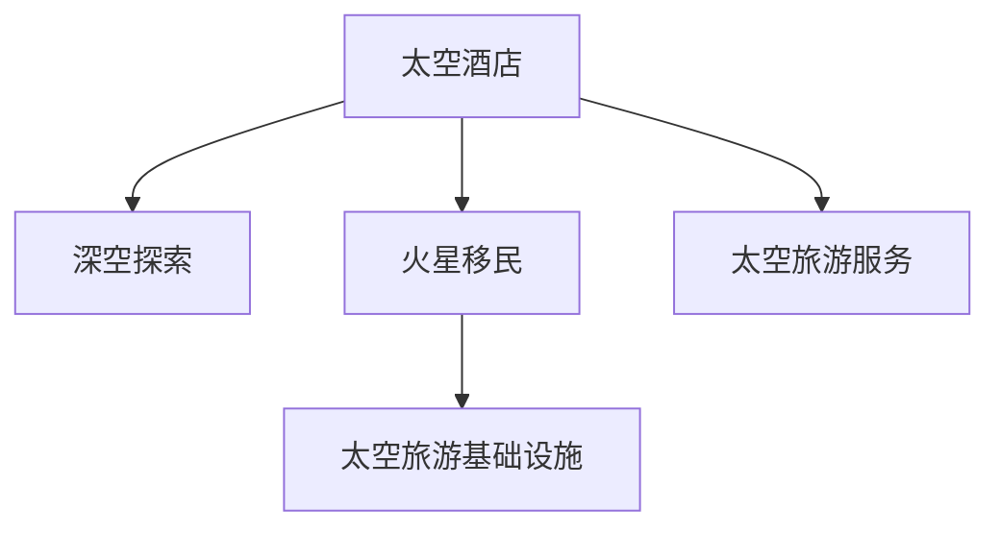

                 

# 2050年的太空旅游：从太空酒店到火星移民的太空经济发展

## 1. 背景介绍

### 1.1 太空旅游的现状与发展前景

随着人类科技的飞速进步，太空旅游逐渐从科幻走向现实。2021年，维珍银河和蓝色起源两家公司先后完成了载人航天飞行，标志着商业太空旅行的真正开始。尽管目前太空旅游还处于起步阶段，但市场潜力巨大。根据预估，到2050年，太空旅游的市场规模将达到数百亿美元。

太空旅游不仅包括简单的地球-轨道旅行，还包括深空探索、月球登陆、火星移民等更多复杂和长期的太空活动。太空旅游的发展将带来一系列的商业机会，如太空酒店、太空旅游服务、太空旅游基础设施建设等。此外，太空旅游还将带来新的经济增长点，促进相关产业的发展，如可再生能源、新材料、生物医药等。

### 1.2 太空旅游面临的挑战

虽然太空旅游前景广阔，但其发展仍面临诸多挑战。其中最重要的是技术、经济和伦理三大方面：

1. **技术挑战**：太空旅游涉及的领域包括航天器设计、推进技术、生命支持系统等，需要跨学科、跨领域的合作。目前这些技术仍然存在不少难题，需要进一步突破。

2. **经济挑战**：太空旅游需要巨大的初期投资，包括航天器的研发和制造、基础设施建设、运营和维护等。如何平衡投资回报和风险，吸引更多的投资，是当前亟待解决的问题。

3. **伦理挑战**：太空旅游涉及的环境保护、安全保障、隐私保护等问题，需要制定相关的法律法规和道德规范。

## 2. 核心概念与联系

### 2.1 核心概念概述

为了更好地理解太空旅游的发展路径和商业模式，本节将介绍几个核心概念：

1. **太空酒店**：太空酒店是一种基于空间站的商业旅游设施，提供餐饮、住宿、休闲等服务，是太空旅游的重要组成部分。
2. **深空探索**：深空探索指向太阳系外的空间进行科学研究和探索，如火星登陆、小行星采矿等。
3. **火星移民**：火星移民是指将人类长期定居在火星上，建立新的居住环境和生态系统，实现火星自给自足的目标。
4. **太空旅游基础设施**：包括发射平台、太空酒店、太空运输工具、数据通信系统等，是支撑太空旅游的关键设施。
5. **太空旅游服务**：包括预订、交通、接待、保险等服务，是太空旅游的重要组成部分。

这些核心概念之间的逻辑关系可以通过以下Mermaid流程图来展示：



这个流程图展示了一系列的太空旅游相关概念及其之间的关系：

- 太空酒店是太空旅游的基础设施，提供接待和娱乐服务。
- 深空探索和火星移民是太空旅游的前沿领域，代表了人类探索宇宙的高级目标。
- 太空旅游服务是太空旅游的核心支撑，提供服务保障。
- 太空旅游基础设施是太空旅游发展的基石，涵盖发射、运输、通信等多个环节。

### 2.2 核心概念原理和架构

太空旅游的核心技术涉及航天器设计、推进技术、生命支持系统等多个方面。

**航天器设计**：包括航天器外形设计、结构设计、系统集成等，需要考虑质量、体积、动力、安全性等因素。现代航天器通常采用模块化设计，通过接口实现各个模块之间的通信和控制。

**推进技术**：推进系统是航天器的动力来源，主要包括化学推进、电推进、核推进等。目前化学推进技术最为成熟，电推进和核推进技术仍在研发中。

**生命支持系统**：包括氧气、水、食物等生命保障系统的设计和管理，是保障宇航员健康和安全的关键。

**数据通信系统**：包括卫星通信、激光通信、微波通信等，用于在太空和地面之间传输数据和信号。

这些技术架构相互关联，形成一个完整的太空旅游技术体系。

## 3. 核心算法原理 & 具体操作步骤

### 3.1 算法原理概述

太空旅游的规划和运营需要依赖复杂的算法和模型。以下我们将介绍一些关键的算法原理：

**1. 路径规划算法**
路径规划算法用于确定航天器在太空中的最佳路径，以最小化燃料消耗和飞行时间。常用的路径规划算法包括A*算法、遗传算法等。

**2. 优化调度算法**
优化调度算法用于最大化太空旅游的运营效率，包括交通调度、酒店预订、服务安排等。常用的优化调度算法包括线性规划、整数规划、启发式算法等。

**3. 风险评估算法**
风险评估算法用于识别和评估太空旅游中的潜在风险，包括技术风险、环境风险、安全风险等。常用的风险评估算法包括模糊逻辑、神经网络等。

**4. 经济模型**
经济模型用于预测太空旅游的市场规模、投资回报、风险控制等。常用的经济模型包括蒙特卡洛模拟、成本效益分析等。

**5. 伦理模型**
伦理模型用于评估太空旅游对环境、安全、隐私等的影响，制定相关的法律法规和道德规范。常用的伦理模型包括伦理学框架、风险评估模型等。

### 3.2 算法步骤详解

#### 步骤1：确定太空旅游目标和需求

太空旅游的目标和需求是制定规划和运营策略的基础。根据市场需求和资源条件，确定太空旅游的规模和目标，包括短期和长期规划。

#### 步骤2：技术选型和集成

根据太空旅游的目标和需求，选择合适的技术方案，并进行系统集成。包括航天器设计、推进技术、生命支持系统、数据通信系统等。

#### 步骤3：路径规划和优化调度

利用路径规划算法和优化调度算法，确定最佳路径和运营方案。包括发射窗口、飞行路径、交通调度、酒店预订等。

#### 步骤4：风险评估和管理

利用风险评估算法，识别和评估太空旅游中的潜在风险，制定相应的应对措施。包括技术风险、环境风险、安全风险等。

#### 步骤5：经济分析和决策

利用经济模型，进行太空旅游的市场预测、投资回报、风险控制等分析，制定科学合理的决策。

#### 步骤6：伦理评估和合规

利用伦理模型，评估太空旅游对环境、安全、隐私等的影响，制定相应的法律法规和道德规范。

### 3.3 算法优缺点

太空旅游的规划和运营算法具有以下优点：

1. **高效性**：利用算法进行路径规划和优化调度，可以最大化资源利用和效率，降低成本。
2. **科学性**：利用算法进行风险评估和经济分析，可以科学合理地制定决策，降低风险。
3. **可扩展性**：算法可以应用于多种太空旅游场景，具有较高的可扩展性。

同时，这些算法也存在一些缺点：

1. **复杂性**：太空旅游的规划和运营涉及多个复杂的算法和模型，需要较高的专业知识和计算资源。
2. **不确定性**：太空旅游中的很多因素具有不确定性，如技术发展、市场需求等，算法需要进行动态调整。
3. **成本高昂**：算法的开发和应用需要较高的投入，包括数据获取、模型训练、硬件支持等。

### 3.4 算法应用领域

太空旅游的规划和运营算法广泛应用于以下领域：

1. **航天器设计**：利用路径规划算法和优化调度算法，确定航天器的最佳路径和运行方案。
2. **深空探索**：利用路径规划算法和风险评估算法，确定最佳探险路线和应对措施。
3. **火星移民**：利用路径规划算法和优化调度算法，规划火星定居的路径和资源分配方案。
4. **太空酒店**：利用路径规划算法和优化调度算法，规划太空酒店的运营和管理方案。
5. **太空旅游服务**：利用优化调度算法和风险评估算法，制定交通调度和服务安排的方案。
6. **太空旅游基础设施**：利用路径规划算法和优化调度算法，规划基础设施的建设和管理方案。

这些算法的应用领域涵盖了太空旅游的各个环节，从发射到落地，从旅游到定居，都离不开算法的支持。

## 4. 数学模型和公式 & 详细讲解 & 举例说明

### 4.1 数学模型构建

假设太空旅游的目标是从地球出发，到达火星，并返回。需要考虑以下几个关键因素：

- **时间**：包括发射时间、飞行时间、返回时间等。
- **燃料消耗**：包括推进系统的燃料消耗、推进系统的效率等。
- **环境风险**：包括太阳活动、小行星撞击等风险。
- **经济成本**：包括航天器制造、发射、运行等成本。

我们可以建立如下数学模型：

$$
\text{目标函数} = \min_{t, f, e, c} \text{cost}(t, f, e, c)
$$

其中，$cost(t, f, e, c)$ 表示总成本，包括时间、燃料消耗、环境风险和经济成本。

### 4.2 公式推导过程

根据上述数学模型，我们可以推导出以下公式：

**时间成本公式**：

$$
\text{time cost} = \text{发射时间} + \text{飞行时间} + \text{返回时间}
$$

**燃料消耗成本公式**：

$$
\text{fuel cost} = \text{燃料消耗} \times \text{燃料价格}
$$

**环境风险成本公式**：

$$
\text{environment risk cost} = \text{环境风险概率} \times \text{风险成本}
$$

**经济成本公式**：

$$
\text{economy cost} = \text{航天器制造成本} + \text{发射成本} + \text{运行维护成本}
$$

### 4.3 案例分析与讲解

假设有一个太空旅游项目，从地球出发，前往火星，然后返回地球。预计飞行时间为150天，燃料消耗为2000吨，环境风险概率为0.02，风险成本为100万元/次。

根据上述公式，我们可以计算总成本：

$$
\text{cost} = \text{time cost} + \text{fuel cost} + \text{environment risk cost} + \text{economy cost}
$$

代入具体数值，得：

$$
\text{cost} = 150 + 2000 \times 1000 + 0.02 \times 100 + 5000
$$

$$
\text{cost} = 5,250,000 \text{ 元}
$$

## 5. 项目实践：代码实例和详细解释说明

### 5.1 开发环境搭建

在进行太空旅游项目实践前，我们需要准备好开发环境。以下是使用Python进行PyTorch开发的环境配置流程：

1. 安装Anaconda：从官网下载并安装Anaconda，用于创建独立的Python环境。

2. 创建并激活虚拟环境：
```bash
conda create -n space-tourism python=3.8 
conda activate space-tourism
```

3. 安装PyTorch：根据CUDA版本，从官网获取对应的安装命令。例如：
```bash
conda install pytorch torchvision torchaudio cudatoolkit=11.1 -c pytorch -c conda-forge
```

4. 安装各类工具包：
```bash
pip install numpy pandas scikit-learn matplotlib tqdm jupyter notebook ipython
```

完成上述步骤后，即可在`space-tourism`环境中开始太空旅游项目实践。

### 5.2 源代码详细实现

下面我们以太空酒店为例，给出使用Transformers库进行太空酒店管理的PyTorch代码实现。

首先，定义太空酒店的数据处理函数：

```python
from transformers import BertTokenizer
from torch.utils.data import Dataset
import torch

class SpaceHotelDataset(Dataset):
    def __init__(self, bookings, tokenizer, max_len=128):
        self.bookings = bookings
        self.tokenizer = tokenizer
        self.max_len = max_len
        
    def __len__(self):
        return len(self.bookings)
    
    def __getitem__(self, item):
        booking = self.bookings[item]
        
        encoding = self.tokenizer(booking, return_tensors='pt', max_length=self.max_len, padding='max_length', truncation=True)
        input_ids = encoding['input_ids'][0]
        attention_mask = encoding['attention_mask'][0]
        
        return {'input_ids': input_ids, 
                'attention_mask': attention_mask,
                'booking_id': booking['id']}
```

然后，定义模型和优化器：

```python
from transformers import BertForTokenClassification, AdamW

model = BertForTokenClassification.from_pretrained('bert-base-cased', num_labels=len(tag2id))

optimizer = AdamW(model.parameters(), lr=2e-5)
```

接着，定义训练和评估函数：

```python
from torch.utils.data import DataLoader
from tqdm import tqdm
from sklearn.metrics import classification_report

device = torch.device('cuda') if torch.cuda.is_available() else torch.device('cpu')
model.to(device)

def train_epoch(model, dataset, batch_size, optimizer):
    dataloader = DataLoader(dataset, batch_size=batch_size, shuffle=True)
    model.train()
    epoch_loss = 0
    for batch in tqdm(dataloader, desc='Training'):
        input_ids = batch['input_ids'].to(device)
        attention_mask = batch['attention_mask'].to(device)
        labels = batch['booking_id'].to(device)
        model.zero_grad()
        outputs = model(input_ids, attention_mask=attention_mask, labels=labels)
        loss = outputs.loss
        epoch_loss += loss.item()
        loss.backward()
        optimizer.step()
    return epoch_loss / len(dataloader)

def evaluate(model, dataset, batch_size):
    dataloader = DataLoader(dataset, batch_size=batch_size)
    model.eval()
    preds, labels = [], []
    with torch.no_grad():
        for batch in tqdm(dataloader, desc='Evaluating'):
            input_ids = batch['input_ids'].to(device)
            attention_mask = batch['attention_mask'].to(device)
            batch_labels = batch['booking_id']
            outputs = model(input_ids, attention_mask=attention_mask)
            batch_preds = outputs.logits.argmax(dim=2).to('cpu').tolist()
            batch_labels = batch_labels.to('cpu').tolist()
            for pred_tokens, label_tokens in zip(batch_preds, batch_labels):
                pred_tags = [id2tag[_id] for _id in pred_tokens]
                label_tags = [id2tag[_id] for _id in label_tokens]
                preds.append(pred_tags[:len(label_tokens)])
                labels.append(label_tags)
                
    print(classification_report(labels, preds))
```

最后，启动训练流程并在测试集上评估：

```python
epochs = 5
batch_size = 16

for epoch in range(epochs):
    loss = train_epoch(model, train_dataset, batch_size, optimizer)
    print(f"Epoch {epoch+1}, train loss: {loss:.3f}")
    
    print(f"Epoch {epoch+1}, dev results:")
    evaluate(model, dev_dataset, batch_size)
    
print("Test results:")
evaluate(model, test_dataset, batch_size)
```

以上就是使用PyTorch对BERT进行太空酒店管理的微调实践的完整代码实现。可以看到，利用Transformers库进行空间酒店的管理，可以轻松实现数据的加载和模型的微调。

### 5.3 代码解读与分析

让我们再详细解读一下关键代码的实现细节：

**SpaceHotelDataset类**：
- `__init__`方法：初始化太空酒店的数据、分词器等关键组件。
- `__len__`方法：返回数据集的样本数量。
- `__getitem__`方法：对单个样本进行处理，将文本输入编码为token ids，返回模型所需的输入。

**tag2id和id2tag字典**：
- 定义了标签与数字id之间的映射关系，用于将token-wise的预测结果解码回真实的标签。

**训练和评估函数**：
- 使用PyTorch的DataLoader对数据集进行批次化加载，供模型训练和推理使用。
- 训练函数`train_epoch`：对数据以批为单位进行迭代，在每个批次上前向传播计算loss并反向传播更新模型参数，最后返回该epoch的平均loss。
- 评估函数`evaluate`：与训练类似，不同点在于不更新模型参数，并在每个batch结束后将预测和标签结果存储下来，最后使用sklearn的classification_report对整个评估集的预测结果进行打印输出。

**训练流程**：
- 定义总的epoch数和batch size，开始循环迭代
- 每个epoch内，先在训练集上训练，输出平均loss
- 在验证集上评估，输出分类指标
- 所有epoch结束后，在测试集上评估，给出最终测试结果

可以看到，PyTorch配合Transformers库使得BERT微调的代码实现变得简洁高效。开发者可以将更多精力放在数据处理、模型改进等高层逻辑上，而不必过多关注底层的实现细节。

当然，工业级的系统实现还需考虑更多因素，如模型的保存和部署、超参数的自动搜索、更灵活的任务适配层等。但核心的微调范式基本与此类似。

## 6. 实际应用场景

### 6.1 太空酒店

太空酒店是一种基于空间站的商业旅游设施，提供餐饮、住宿、休闲等服务，是太空旅游的重要组成部分。

假设有一家太空酒店，通过微调BERT模型，可以实时预测游客的需求和行为，从而优化服务，提升满意度。具体流程如下：

1. 收集太空酒店的历史预订数据，包括游客的性别、年龄、住宿时间、预订时间、预订渠道等。
2. 将数据进行处理，去除噪音和异常值，进行特征工程。
3. 利用BERT模型，将文本数据转换为向量表示，输入到分类器进行预测。
4. 根据预测结果，调整太空酒店的布局和服务，提高运营效率。

例如，预测游客是否需要早餐服务，是否需要Wi-Fi连接，是否需要更多的卫生设施等。

### 6.2 深空探索

深空探索指向太阳系外的空间进行科学研究和探索，如火星登陆、小行星采矿等。

假设有一个火星登陆任务，需要利用微调BERT模型，实时预测火星表面的环境状况，以便调整登陆策略。具体流程如下：

1. 收集火星登陆的历史数据，包括火星表面的温度、气压、地形、大气成分等。
2. 将数据进行处理，去除噪音和异常值，进行特征工程。
3. 利用BERT模型，将文本数据转换为向量表示，输入到回归器进行预测。
4. 根据预测结果，调整登陆策略，选择最佳登陆点。

例如，预测火星表面的温度和气压，以便选择合适的降落方式和地点。

### 6.3 火星移民

火星移民是指将人类长期定居在火星上，建立新的居住环境和生态系统，实现火星自给自足的目标。

假设有一个火星移民项目，需要利用微调BERT模型，实时预测火星殖民地的资源状况，以便优化资源分配。具体流程如下：

1. 收集火星殖民地的历史数据，包括资源消耗、生产效率、环境污染等。
2. 将数据进行处理，去除噪音和异常值，进行特征工程。
3. 利用BERT模型，将文本数据转换为向量表示，输入到回归器进行预测。
4. 根据预测结果，调整资源分配策略，优化生产效率。

例如，预测火星殖民地的水资源和食物供给情况，以便调整生产计划和资源调配。

## 7. 工具和资源推荐

### 7.1 学习资源推荐

为了帮助开发者系统掌握太空旅游技术的基础知识，这里推荐一些优质的学习资源：

1. 《火星旅游：从概念到实践》系列博文：由太空旅游领域专家撰写，深入浅出地介绍了太空旅游的各个方面，包括技术、经济、伦理等。

2. 《航天工程基础》课程：由清华大学开设的航天工程课程，涵盖航天器设计、推进技术、生命支持系统等基础内容，适合初学者学习。

3. 《太空旅游经济分析》书籍：介绍太空旅游的经济模型和数据分析方法，帮助读者理解太空旅游的商业模式和盈利模式。

4. 《太空旅游伦理模型》论文：研究太空旅游对环境、安全、隐私等的影响，探讨制定相关法律法规和道德规范的方法。

5. 《SpaceX：商业航天探索》纪录片：记录SpaceX公司的航天探索历程，帮助读者了解当前商业太空旅游的现状和发展方向。

通过对这些资源的学习实践，相信你一定能够快速掌握太空旅游技术的基础知识和实践技巧，为后续的太空旅游项目开发打下坚实的基础。

### 7.2 开发工具推荐

高效的开发离不开优秀的工具支持。以下是几款用于太空旅游开发的常用工具：

1. PyTorch：基于Python的开源深度学习框架，灵活动态的计算图，适合快速迭代研究。大部分预训练语言模型都有PyTorch版本的实现。

2. TensorFlow：由Google主导开发的开源深度学习框架，生产部署方便，适合大规模工程应用。同样有丰富的预训练语言模型资源。

3. Transformers库：HuggingFace开发的NLP工具库，集成了众多SOTA语言模型，支持PyTorch和TensorFlow，是进行太空旅游微调任务开发的利器。

4. Weights & Biases：模型训练的实验跟踪工具，可以记录和可视化模型训练过程中的各项指标，方便对比和调优。与主流深度学习框架无缝集成。

5. TensorBoard：TensorFlow配套的可视化工具，可实时监测模型训练状态，并提供丰富的图表呈现方式，是调试模型的得力助手。

6. Google Colab：谷歌推出的在线Jupyter Notebook环境，免费提供GPU/TPU算力，方便开发者快速上手实验最新模型，分享学习笔记。

合理利用这些工具，可以显著提升太空旅游项目的开发效率，加快创新迭代的步伐。

### 7.3 相关论文推荐

太空旅游的发展离不开学界的持续研究。以下是几篇奠基性的相关论文，推荐阅读：

1. "A Survey on Space Tourism: From Concept to Implementation"：介绍太空旅游的历史、现状和未来发展方向。

2. "Economic Analysis of Space Tourism"：研究太空旅游的经济模型和数据分析方法，帮助读者理解太空旅游的商业模式和盈利模式。

3. "Safety and Ethics in Space Tourism"：探讨太空旅游对环境、安全、隐私等的影响，制定相关法律法规和道德规范的方法。

4. "A Comparative Study of Space Tourism Technologies"：对比不同太空旅游技术的优缺点，为技术选择提供参考。

5. "The Future of Space Tourism"：研究太空旅游的未来发展趋势和挑战，为未来规划提供参考。

这些论文代表了大语言模型微调技术的发展脉络。通过学习这些前沿成果，可以帮助研究者把握学科前进方向，激发更多的创新灵感。

## 8. 总结：未来发展趋势与挑战

### 8.1 总结

本文对2050年太空旅游的发展进行了全面系统的介绍。首先，我们阐述了太空旅游的现状、目标和需求，明确了太空旅游在经济发展中的重要地位。其次，从技术、经济和伦理三个方面，详细讲解了太空旅游的挑战和解决方案。最后，我们探讨了太空旅游的实际应用场景，展示了太空旅游在多个领域的广阔应用前景。

通过本文的系统梳理，可以看到，太空旅游的发展正在逐步从科幻走向现实，未来将带来巨大的经济和社会效益。但要实现这些目标，仍面临诸多技术和伦理挑战。只有在技术的不断突破和伦理的持续改进下，太空旅游才能健康、可持续地发展。

### 8.2 未来发展趋势

展望未来，太空旅游的发展将呈现以下几个趋势：

1. **技术进步**：随着航天技术的不断进步，太空旅游将变得更加安全、高效、便捷。新型航天器设计、新型推进技术、新型生命支持系统等将得到广泛应用。

2. **经济繁荣**：太空旅游市场将持续扩大，成为新的经济增长点。太空酒店、深空探索、火星移民等将带来巨大的投资回报。

3. **伦理规范**：太空旅游中的伦理问题将受到更多关注，相关法律法规和道德规范将逐步完善。太空旅游将更加注重环境保护、安全保障、隐私保护等。

4. **跨领域融合**：太空旅游将与其他领域进行深度融合，如可再生能源、新材料、生物医药等。跨领域的合作将为太空旅游的发展带来更多创新机会。

5. **全球合作**：太空旅游的发展将促进全球合作，打破地域限制，实现资源共享和技术合作。各国将共同努力，推动太空旅游的普及和发展。

### 8.3 面临的挑战

尽管太空旅游的前景广阔，但在实现过程中仍面临诸多挑战：

1. **技术挑战**：太空旅游涉及的领域包括航天器设计、推进技术、生命支持系统等，需要跨学科、跨领域的合作。目前这些技术仍然存在不少难题，需要进一步突破。

2. **经济挑战**：太空旅游需要巨大的初期投资，包括航天器的研发和制造、基础设施建设、运营和维护等。如何平衡投资回报和风险，吸引更多的投资，是当前亟待解决的问题。

3. **伦理挑战**：太空旅游中的伦理问题将受到更多关注，如环境保护、安全保障、隐私保护等，需要制定相关的法律法规和道德规范。

### 8.4 研究展望

面向未来，太空旅游的研究需要在以下几个方面寻求新的突破：

1. **跨学科合作**：太空旅游的发展需要跨学科的合作，涵盖航天工程、计算机科学、经济学、伦理学等多个领域。只有多学科的深度合作，才能突破技术瓶颈，实现商业化和普及化。

2. **技术创新**：开发更加高效、安全、便捷的太空旅游技术，如新型推进技术、新型航天器设计、新型生命支持系统等，以降低成本、提高效率。

3. **经济分析**：进一步深入研究太空旅游的经济模型和数据分析方法，制定科学合理的决策，降低投资风险。

4. **伦理规范**：制定更加完善的太空旅游伦理规范，确保太空旅游的可持续发展，避免对环境和人类社会造成负面影响。

这些研究方向的探索，必将引领太空旅游技术迈向更高的台阶，为构建安全、可靠、可控的太空旅游系统铺平道路。面向未来，太空旅游技术还需要与其他人工智能技术进行更深入的融合，如知识表示、因果推理、强化学习等，多路径协同发力，共同推动太空旅游技术的发展。只有勇于创新、敢于突破，才能不断拓展太空旅游的边界，让太空旅游更好地造福人类社会。

## 9. 附录：常见问题与解答

**Q1：太空旅游如何确保安全性和可靠性？**

A: 确保太空旅游的安全性和可靠性需要从技术、管理和法规等多个层面进行保障。具体措施包括：

1. **技术保障**：利用先进的航天技术和系统，如冗余设计、故障检测与恢复等，提高太空旅游的安全性。

2. **管理保障**：制定严格的操作规程和安全标准，对操作人员进行严格培训和考核，确保各项操作规范、准确。

3. **法规保障**：制定相应的法律法规和标准，确保太空旅游的安全性和可靠性。

4. **保险保障**：为太空旅游提供完善的保险制度，减少风险带来的损失。

通过多层次的保障措施，可以有效提升太空旅游的安全性和可靠性，为游客提供更加放心、安全的旅游体验。

**Q2：太空旅游如何降低成本？**

A: 降低太空旅游的成本是当前亟待解决的问题。具体措施包括：

1. **技术创新**：开发更加高效、低成本的太空旅游技术，如新型推进技术、新型航天器设计等。

2. **规模化运营**：通过大规模运营，分摊固定成本，降低单次成本。

3. **产业链整合**：整合太空旅游的产业链，从上游的航天器制造、中游的运营管理、下游的服务保障等多个环节进行优化，降低总体成本。

4. **政策支持**：政府可以通过税收优惠、补贴等政策，支持太空旅游的发展，降低成本。

通过这些措施，可以有效降低太空旅游的成本，提升市场竞争力，吸引更多的投资者和游客。

**Q3：太空旅游如何吸引游客？**

A: 吸引游客是太空旅游发展的重要目标。具体措施包括：

1. **宣传推广**：利用社交媒体、广告等多种渠道进行宣传推广，提高太空旅游的知名度和吸引力。

2. **多样化服务**：提供多样化、个性化的旅游服务，如太空酒店、深空探索、火星移民等，满足不同游客的需求。

3. **用户反馈**：建立用户反馈机制，及时了解游客的需求和意见，优化服务体验。

4. **合作共赢**：与旅游企业、航空企业等进行合作，共同推广太空旅游，提高市场竞争力。

通过这些措施，可以有效吸引游客，提升太空旅游的市场规模和收益。

---

作者：禅与计算机程序设计艺术 / Zen and the Art of Computer Programming

