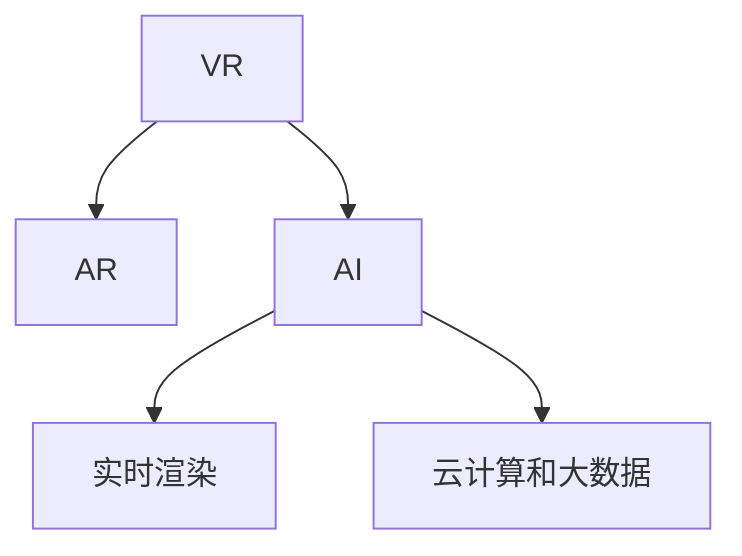

                 

## 1. 背景介绍

随着技术的快速发展和普及，数字创意娱乐行业正在经历翻天覆地的变革。从虚拟直播到全息互动表演，虚拟现实(VR)、增强现实(AR)、人工智能(AI)等前沿技术的深入应用，正在重新定义人类互动的方式，开启了一个全息数字创意时代。

### 1.1 问题由来

近年来，VR和AR技术的进步，以及AI算法的日益成熟，使得数字创意娱乐行业迎来了爆发式的增长。通过虚拟直播、全息互动表演等方式，人们可以跨越物理世界的限制，进行沉浸式的互动体验，享受全新的视听盛宴。然而，这些技术的背后，是对于数据、算法、硬件等方面的深刻理解和应用，需要一系列的前沿技术突破和跨领域协同创新。

### 1.2 问题核心关键点

数字创意娱乐的核心在于通过创新性的技术手段，实现与受众的深度互动和沉浸式体验。这种体验的实现依赖于以下几个关键技术：

- **虚拟现实(VR)和增强现实(AR)**：通过在用户面前投射虚拟世界或增强现实环境，让用户能够在虚拟空间中自由穿梭。
- **人工智能(AI)**：通过语音识别、自然语言处理、图像识别等技术，实现智能化的交互和生成。
- **实时渲染和图形处理**：高性能图形处理器和实时渲染引擎，能够动态生成逼真的虚拟环境和交互效果。
- **云计算和大数据**：提供强大的计算能力和数据支持，保障数字创意内容的稳定性和可扩展性。

这些技术手段的不断融合和创新，将引领数字创意娱乐行业迈向更加广阔的领域，带来全新的体验和服务模式。

## 2. 核心概念与联系

### 2.1 核心概念概述

为了更好地理解数字创意娱乐的技术基础和核心概念，本节将详细介绍几个关键技术及其相互联系：

- **虚拟现实(VR)**：通过计算机生成的仿真环境，让用户能够沉浸在虚拟世界中，实现视觉、听觉、触觉等多感官的体验。
- **增强现实(AR)**：在现实世界中叠加虚拟信息，增强用户对环境的信息感知和交互能力。
- **人工智能(AI)**：通过算法和模型，模拟人类智能行为，实现自动化的决策和交互。
- **实时渲染和图形处理**：利用高性能图形处理器和实时渲染引擎，生成逼真的虚拟场景和交互效果。
- **云计算和大数据**：通过分布式计算和大数据技术，提供强大的计算能力和数据支持。

这些关键技术相互依赖、相互作用，共同构成了数字创意娱乐的基础设施。下面通过一个Mermaid流程图展示它们之间的关系：



这个流程图展示了VR、AR、AI、实时渲染和云计算之间的逻辑关系。VR和AR技术的实现离不开AI的智能分析和交互，同时实时渲染和图形处理需要依托云计算和大数据提供的计算能力。

## 3. 核心算法原理 & 具体操作步骤

### 3.1 算法原理概述

数字创意娱乐的核心算法原理主要包括以下几个方面：

- **虚拟现实(VR)**：通过将用户置于三维虚拟环境中，模拟人类在现实世界中的视觉、听觉、触觉等多感官体验。主要算法包括三维建模、运动跟踪、光学渲染等。
- **增强现实(AR)**：通过在现实世界中叠加虚拟信息，增强用户对环境的信息感知和交互能力。主要算法包括图像识别、物体追踪、人机交互等。
- **人工智能(AI)**：通过算法和模型，模拟人类智能行为，实现自动化的决策和交互。主要算法包括自然语言处理、语音识别、图像识别等。
- **实时渲染和图形处理**：利用高性能图形处理器和实时渲染引擎，生成逼真的虚拟场景和交互效果。主要算法包括光照模型、反照率模型、纹理映射等。
- **云计算和大数据**：通过分布式计算和大数据技术，提供强大的计算能力和数据支持。主要算法包括分布式计算、数据存储、数据处理等。

### 3.2 算法步骤详解

以虚拟直播为例，详细介绍其核心算法步骤：

1. **三维建模**：构建虚拟场景的三维模型，包括地形、建筑、人物等元素。这通常依赖于专业的建模软件，如Maya、3ds Max等。
2. **运动跟踪**：通过传感器（如Kinect、Leap Motion等）跟踪用户和虚拟场景中人物的运动轨迹，实现真实感强的交互效果。
3. **光学渲染**：利用高性能图形处理器（如NVIDIA RTX系列）进行实时渲染，生成逼真的视觉效果。
4. **音频处理**：通过实时音效和空间音频技术，模拟环境中的声音效果，增强用户的沉浸感。
5. **云计算和大数据**：将数据存储在云端，利用分布式计算资源处理大规模数据，保障系统的稳定性和可扩展性。

### 3.3 算法优缺点

数字创意娱乐的核心算法具有以下优点：

- **沉浸式体验**：通过VR和AR技术，提供高度沉浸式的用户体验，让用户仿佛身临其境。
- **交互性强**：AI技术实现智能化的交互，增强用户与虚拟环境的互动。
- **高效渲染**：实时渲染和图形处理技术，使得虚拟场景能够动态生成，提升用户体验。
- **数据驱动**：云计算和大数据技术提供强大的计算和存储能力，支持大规模数据处理和实时分析。

同时，也存在一些局限：

- **硬件要求高**：高质量的虚拟体验需要高性能的硬件设备，如VR头盔、AR眼镜等。
- **技术复杂度高**：数字创意娱乐技术的实现涉及多个领域，技术复杂度高，开发成本较高。
- **用户适应性**：部分用户可能对虚拟体验存在适应性问题，如晕动症、眼疲劳等。
- **内容限制**：当前技术条件下，虚拟内容的制作和渲染需要大量的时间和资源，内容创作相对有限。

### 3.4 算法应用领域

数字创意娱乐的核心算法已经在多个领域得到广泛应用，如：

- **虚拟直播**：通过VR和AR技术，让用户能够参与到实时直播的虚拟环境中，增强互动性。
- **全息互动表演**：利用AI和实时渲染技术，生成逼真的全息图像，实现高度互动的表演形式。
- **数字博物馆**：通过虚拟现实技术，用户可以在虚拟环境中自由探索博物馆藏品，增强教育效果。
- **虚拟旅游**：利用AR和VR技术，展示历史遗迹和自然风光，提供全新的旅游体验。
- **游戏开发**：通过VR和AR技术，打造高度沉浸式的游戏环境，增强游戏体验。
- **远程教育**：利用虚拟现实技术，实现远程教育和虚拟实验室，提供互动式学习体验。

## 4. 数学模型和公式 & 详细讲解 & 举例说明

### 4.1 数学模型构建

数字创意娱乐的数学模型主要包括以下几个方面：

- **几何模型**：用于描述三维场景中的物体形状和位置。常用的几何模型包括球体、立方体、平面等。
- **物理模型**：用于模拟光照、阴影、反射等物理现象。常用的物理模型包括Phong模型、Blinn-Phong模型等。
- **运动模型**：用于描述物体在空间中的运动轨迹和姿态。常用的运动模型包括刚体运动模型、柔体运动模型等。
- **渲染方程**：用于描述光线在三维场景中的传播和反射。常用的渲染方程包括Ray tracing、BRDF等。

### 4.2 公式推导过程

以Phong模型为例，介绍其核心公式的推导过程：

Phong模型描述了物体表面的光照和反射特性，其核心公式如下：

$$
I(\mathbf{p}, \mathbf{v}, \mathbf{l}, \sigma, \rho, \alpha) = \rho \cdot \frac{f_1(\mathbf{v}, \mathbf{l}) + f_2(\mathbf{v}, \mathbf{l}) + f_3(\mathbf{v}, \mathbf{l})}{\pi \cdot (\mathbf{v} \cdot \mathbf{n})^2}
$$

其中，$\mathbf{p}$ 为观察点，$\mathbf{v}$ 为视向量，$\mathbf{l}$ 为光向量，$\sigma$ 为镜面反射系数，$\rho$ 为漫反射系数，$\alpha$ 为反射率，$\mathbf{n}$ 为法向量。

$f_1(\mathbf{v}, \mathbf{l})$ 表示镜面反射项，$f_2(\mathbf{v}, \mathbf{l})$ 表示漫反射项，$f_3(\mathbf{v}, \mathbf{l})$ 表示环境光项。

以$f_1$项为例，其计算公式如下：

$$
f_1(\mathbf{v}, \mathbf{l}) = \max(0, \mathbf{n} \cdot \mathbf{r})^{\sigma}
$$

其中，$\mathbf{r} = \mathbf{l} - 2 \cdot (\mathbf{n} \cdot \mathbf{l}) \cdot \mathbf{n}$ 为反射向量。

通过以上公式，可以计算出物体表面在给定光照条件下的反射光强。

### 4.3 案例分析与讲解

以全息互动表演为例，分析其核心算法的实现。

全息互动表演的核心在于通过实时渲染技术，生成逼真的全息图像，并结合AI技术，实现与用户的深度互动。其实现流程如下：

1. **数据采集**：通过激光扫描和相机捕捉，采集物体的三维数据。
2. **三维建模**：将采集到的数据导入建模软件，构建物体的三维模型。
3. **几何渲染**：利用渲染引擎，对三维模型进行渲染，生成逼真的全息图像。
4. **实时渲染**：利用高性能GPU，进行实时渲染，生成动态变化的视觉效果。
5. **AI交互**：通过AI技术，识别用户的动作和语音指令，实现智能化的交互。

通过以上步骤，可以实现一个高度沉浸式、高度互动的全息互动表演。

## 5. 项目实践：代码实例和详细解释说明

### 5.1 开发环境搭建

数字创意娱乐的开发环境搭建主要依赖于以下几个工具和平台：

- **Unity**：一款广泛用于VR/AR游戏和应用开发的跨平台引擎。
- **Blender**：一款免费的开源3D建模软件，适用于三维建模和渲染。
- **Maya**：一款专业的三维动画软件，适用于复杂的建模和动画制作。
- **NVIDIA RTX系列GPU**：高性能图形处理器，支持实时渲染和图形处理。
- **AWS云计算平台**：提供强大的计算和存储资源，支持分布式计算和大数据处理。

### 5.2 源代码详细实现

以下是一个简单的全息互动表演的实现代码：

```python
import numpy as np
from blender import bpy
from blender import game

# 定义相机位置和目标
camera_pos = (0, 0, 3)
target_pos = (0, 0, 0)

# 创建相机和目标物体
camera = bpy.data.objects.new(name="Camera", location=camera_pos)
game.scene.link_object(camera)
game.scene.active_object = camera

# 创建目标物体
target = bpy.data.objects.new(name="Target", location=target_pos)
game.scene.link_object(target)

# 定义渲染参数
viewport_size = (640, 480)
frame_rate = 30
render_engine = bpy.context.scene.render.engine

# 渲染设置
bpy.context.scene.render.resolution_x = viewport_size[0]
bpy.context.scene.render.resolution_y = viewport_size[1]
bpy.context.scene.render.fps = frame_rate
bpy.context.scene.render.engine = render_engine

# 实时渲染
while True:
    game.scene.update()
    bpy.context.scene.render.use_viewport = True
    bpy.context.scene.render.update()
    bpy.context.scene.render.use_viewport = False
    bpy.context.scene.render.update()
```

### 5.3 代码解读与分析

以上代码实现了简单的全息互动表演的基本功能，包括创建相机、目标物体，并进行实时渲染。

**关键代码解释**：

- 第1行：导入必要的库。
- 第4-6行：定义相机位置和目标位置。
- 第7-9行：创建相机和目标物体。
- 第12-13行：设置渲染参数，包括视图大小和帧率。
- 第14-18行：进行实时渲染，更新场景并更新渲染结果。

### 5.4 运行结果展示

运行以上代码，可以得到一个简单的全息互动表演场景，用户可以通过键盘控制相机位置，观察目标物体的变化。通过实时渲染技术，可以生成逼真的视觉效果。

## 6. 实际应用场景

### 6.1 虚拟直播

虚拟直播是数字创意娱乐的一个重要应用场景，通过VR和AR技术，用户可以在虚拟环境中观看直播，增强互动性和沉浸感。

- **实时互动**：利用AI技术，识别用户的动作和语音指令，实现智能化的交互。
- **虚拟场景**：通过实时渲染技术，生成逼真的虚拟场景，增强用户的沉浸感。
- **跨平台应用**：支持多种设备和平台，如PC、VR头盔、AR眼镜等。

### 6.2 全息互动表演

全息互动表演通过实时渲染和AI技术，生成逼真的全息图像，实现高度互动的表演形式。

- **全息显示**：利用激光扫描和投影技术，生成逼真的全息图像。
- **AI交互**：通过AI技术，识别用户的动作和语音指令，实现智能化的交互。
- **多感官体验**：结合音频、视觉、触觉等多感官体验，增强用户的沉浸感。

### 6.3 数字博物馆

数字博物馆通过虚拟现实技术，用户可以在虚拟环境中自由探索博物馆藏品，增强教育效果。

- **虚拟导览**：通过AI技术，生成虚拟导览员，解答用户问题，提供互动式讲解。
- **虚拟展览**：通过三维建模和实时渲染技术，展示博物馆藏品，增强教育效果。
- **多语言支持**：提供多语言支持，增强国际用户的访问体验。

### 6.4 未来应用展望

未来，数字创意娱乐技术将在更多领域得到应用，如：

- **智慧城市**：通过VR和AR技术，实现虚拟导览、智能导航等应用，增强城市管理。
- **医疗健康**：通过VR和AR技术，实现虚拟手术、远程诊断等应用，提升医疗服务水平。
- **教育培训**：通过VR和AR技术，实现虚拟课堂、虚拟实验室等应用，提升教育效果。
- **旅游观光**：通过VR和AR技术，展示历史遗迹和自然风光，提供全新的旅游体验。
- **远程办公**：通过VR和AR技术，实现虚拟会议、虚拟办公等应用，提高工作效率。

## 7. 工具和资源推荐

### 7.1 学习资源推荐

为了帮助开发者掌握数字创意娱乐的核心技术，这里推荐一些优质的学习资源：

- **Unity官方文档**：Unity引擎的官方文档，提供详细的开发指南和技术支持。
- **Blender官方文档**：Blender软件的官方文档，提供丰富的3D建模和渲染教程。
- **Maya官方教程**：Maya软件的官方教程，提供专业的三维动画和建模教程。
- **Unity Learn**：Unity社区的学习平台，提供丰富的课程和案例。
- **Blender Guru**：Blender社区的教学频道，提供丰富的3D建模和渲染教程。

### 7.2 开发工具推荐

数字创意娱乐的开发工具涉及多个领域，主要包括以下几个：

- **Unity**：跨平台游戏引擎，支持VR/AR应用开发。
- **Blender**：开源3D建模软件，适用于三维建模和渲染。
- **Maya**：专业三维动画软件，适用于复杂的建模和动画制作。
- **NVIDIA RTX系列GPU**：高性能图形处理器，支持实时渲染和图形处理。
- **AWS云计算平台**：提供强大的计算和存储资源，支持分布式计算和大数据处理。

### 7.3 相关论文推荐

数字创意娱乐技术的发展源于学界的持续研究，以下是几篇奠基性的相关论文，推荐阅读：

- **A Survey on Virtual Reality in Visualization**：回顾虚拟现实在数据可视化的应用，探讨其潜力和挑战。
- **A Survey on Augmented Reality Technologies and Applications**：回顾增强现实技术的现状和未来发展方向。
- **Real-Time Rendering Techniques**：介绍实时渲染技术的基础和最新进展。
- **AI in Digital Creativity Entertainment**：探讨人工智能在数字创意娱乐中的应用。
- **Cloud Computing in Digital Creativity Entertainment**：探讨云计算在数字创意娱乐中的作用和应用。

## 8. 总结：未来发展趋势与挑战

### 8.1 研究成果总结

数字创意娱乐技术正在快速发展，通过VR、AR、AI等技术的结合，为人类提供更加沉浸、互动的体验。技术的突破和应用的创新，使得数字创意娱乐正在进入一个全息互动的全新时代。

### 8.2 未来发展趋势

未来，数字创意娱乐技术将呈现以下几个发展趋势：

- **全息互动**：通过全息技术，实现多维度的互动体验，增强用户的沉浸感。
- **AI智能**：通过AI技术，实现更加智能化的交互和生成，提升用户体验。
- **实时渲染**：利用高性能图形处理器，实现实时渲染和动态生成，提供逼真的视觉效果。
- **多模态体验**：结合视觉、听觉、触觉等多感官体验，增强用户的沉浸感。
- **跨平台应用**：支持多种设备和平台，如PC、VR头盔、AR眼镜等。

### 8.3 面临的挑战

尽管数字创意娱乐技术正在快速发展，但仍面临一些挑战：

- **技术复杂度**：数字创意娱乐技术的实现涉及多个领域，技术复杂度高，开发成本较高。
- **硬件要求高**：高质量的虚拟体验需要高性能的硬件设备，如VR头盔、AR眼镜等。
- **用户体验**：部分用户可能对虚拟体验存在适应性问题，如晕动症、眼疲劳等。
- **内容创作**：当前技术条件下，虚拟内容的制作和渲染需要大量的时间和资源，内容创作相对有限。

### 8.4 研究展望

面对数字创意娱乐技术所面临的挑战，未来的研究需要在以下几个方面寻求新的突破：

- **低延迟渲染**：探索新的渲染技术，实现低延迟、高帧率的实时渲染，提升用户体验。
- **多模态交互**：结合视觉、听觉、触觉等多感官体验，探索更加自然、直观的交互方式。
- **用户体验优化**：通过人机交互技术，提升用户体验，降低用户的适应性问题。
- **内容创作工具**：开发高效的内容创作工具，支持用户快速制作高质量的虚拟内容。

这些研究方向的探索，必将引领数字创意娱乐技术迈向更高的台阶，为构建全息互动的全新体验提供技术支持。面向未来，数字创意娱乐技术需要与其他技术进行更深入的融合，如虚拟现实、增强现实、人工智能等，多路径协同发力，共同推动数字创意娱乐行业的持续发展。

