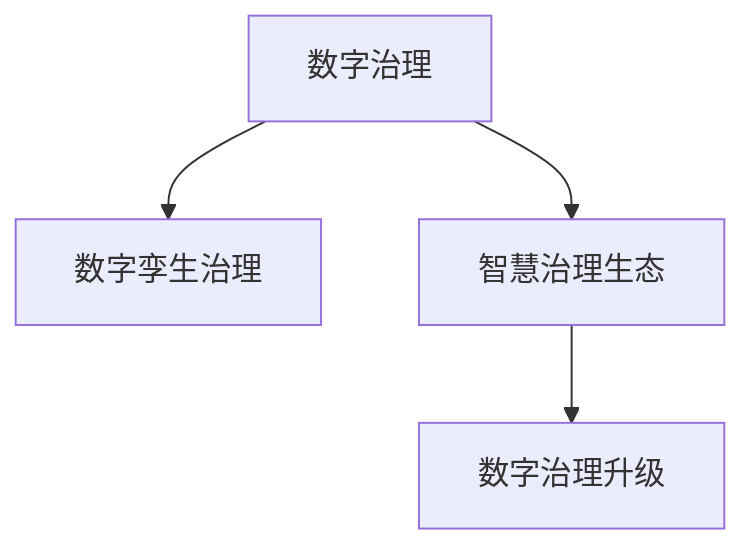

                 

# 2050年的数字治理：从数字孪生治理到智慧治理生态的数字治理升级

> 关键词：数字治理,数字孪生治理,智慧治理,智慧治理生态,数字治理升级,未来治理技术,数字治理框架,治理算法,智慧城市,智慧交通,智慧能源,智慧医疗

## 1. 背景介绍

### 1.1 问题由来
随着数字化、信息化和智能化技术的迅猛发展，全球各地都在积极探索数字治理的实践和应用，以期通过科技手段提升治理效率，改善公共服务，实现智慧化转型。当前，数字治理已经成为各国和地区治理现代化的重要抓手。从数字政府、智慧城市到数字经济、智慧交通，数字治理在多个领域发挥了显著作用。

然而，尽管数字治理已经取得了一定成就，但目前仍面临诸多挑战，如数据孤岛、跨部门协同不足、信息安全问题、治理效果评估等。这些问题的解决，迫切需要新的治理方法和技术手段。

### 1.2 问题核心关键点
数字治理的核心在于通过数字技术手段提升治理效率、优化资源配置、增强决策支持，最终实现治理效果的高效透明。数字治理的关键点包括：

- **数据集成**：打破数据孤岛，实现跨部门、跨领域的数据互联互通。
- **跨部门协同**：促进不同部门之间的信息共享和协作，提高治理效率。
- **安全防护**：确保数据和系统的安全，防止信息泄露和系统攻击。
- **治理效果评估**：建立科学的治理效果评估机制，实时监控和优化治理效果。

这些核心关键点构成了数字治理的基石，决定了治理的深度和广度。

### 1.3 问题研究意义
研究2050年的数字治理升级，对于把握未来治理技术发展趋势、解决现有治理问题、提升治理能力和水平具有重要意义：

- **提升治理效率**：通过新技术手段，实现数据高效整合、跨部门协同、智能决策支持，大幅提升治理效率。
- **优化资源配置**：通过数字手段，实现资源配置的优化和动态调整，提高资源利用率。
- **增强决策支持**：依托大数据、人工智能等技术，为决策者提供科学的数据支持和智能分析，增强决策的科学性和公正性。
- **实现智慧治理**：构建智慧治理生态，实现治理过程的智能化、精准化，提高治理效果。

## 2. 核心概念与联系

### 2.1 核心概念概述

为更好地理解2050年的数字治理升级，本节将介绍几个密切相关的核心概念：

- **数字治理(Digital Governance)**：利用数字技术提升政府治理能力，优化资源配置，增强决策支持的过程。包括数字政府、智慧城市、智慧医疗等多个方面。

- **数字孪生治理(Digital Twin Governance)**：通过建立数字孪生模型，模拟现实治理过程，实现治理过程的可视化、仿真和优化。

- **智慧治理生态(Smart Governance Ecosystem)**：基于数字孪生治理，构建智慧化的治理生态系统，实现治理过程的智能化、精准化、高效化。

- **数字治理升级(Digital Governance Upgrade)**：通过引入新技术、新方法、新工具，持续优化和提升现有数字治理框架和能力的过程。

这些核心概念之间的逻辑关系可以通过以下Mermaid流程图来展示：



这个流程图展示了大规模治理系统的核心概念及其之间的关系：

1. 数字治理是大规模治理系统的基础。
2. 数字孪生治理通过建立数字孪生模型，进一步提升了治理过程的可视化、仿真和优化能力。
3. 智慧治理生态在此基础上，构建了更加智能、精准、高效的治理系统。
4. 数字治理升级则是持续优化和提升整个治理系统，实现技术迭代和应用升级。

## 3. 核心算法原理 & 具体操作步骤
### 3.1 算法原理概述

2050年的数字治理升级，本质上是利用先进的技术手段和治理理念，对现有数字治理框架进行优化和升级的过程。其核心算法原理包括以下几个方面：

- **数字孪生技术**：通过建立数字孪生模型，实现对治理过程的全面仿真和优化。
- **人工智能与机器学习**：利用深度学习、强化学习等算法，提升治理决策的智能化水平。
- **区块链与分布式账本技术**：确保治理数据的安全性和透明性。
- **物联网与传感器技术**：实时采集治理场景的数据，提高治理的实时性和精准性。
- **智慧算法与决策支持系统**：构建智慧算法模型，为治理决策提供科学支持。

### 3.2 算法步骤详解

基于数字治理升级的核心算法原理，以下是详细的算法步骤：

**Step 1: 建立数字孪生模型**
- 收集治理场景的关键数据，包括地理、交通、环境、经济等数据。
- 利用BIM、GIS、3D建模等技术，建立数字孪生模型。
- 实现模型与现实场景的实时同步和交互，进行仿真和优化。

**Step 2: 引入人工智能与机器学习**
- 利用深度学习、强化学习等算法，对治理数据进行分析和建模。
- 构建智慧决策支持系统，辅助决策者进行智能决策。
- 实时监控治理效果，通过反馈机制进行动态调整。

**Step 3: 引入区块链与分布式账本技术**
- 构建治理数据的分布式账本系统，实现数据的透明和可追溯。
- 利用区块链技术，确保治理数据的完整性和安全性。
- 实现治理过程的透明化、去中心化，提高治理的公正性和公信力。

**Step 4: 引入物联网与传感器技术**
- 在治理场景中部署传感器，实时采集数据。
- 构建物联网平台，实现数据的集成和共享。
- 利用大数据技术，进行数据的实时分析和监控。

**Step 5: 构建智慧算法与决策支持系统**
- 基于深度学习、强化学习等算法，构建智慧算法模型。
- 利用这些模型进行智能分析和预测，辅助决策者进行决策。
- 通过动态调整算法参数，实现智慧决策的持续优化。

### 3.3 算法优缺点

基于数字治理升级的核心算法原理，数字治理升级具有以下优点：

- **提升治理效率**：通过数字孪生技术、物联网技术等手段，实现治理过程的实时化和精准化，大幅提升治理效率。
- **增强治理效果**：利用人工智能与机器学习技术，提升治理决策的智能化水平，增强治理效果。
- **提高治理透明度**：通过区块链与分布式账本技术，实现治理数据的安全和透明，提高治理的公信力。
- **促进跨部门协同**：利用数字孪生模型和智慧决策支持系统，实现跨部门协同治理，提升治理效果。

同时，该方法也存在以下局限性：

- **数据质量要求高**：数字治理升级对数据的质量和完整性要求很高，数据收集和处理需要耗费大量资源。
- **技术复杂度高**：涉及多种前沿技术，技术实现和集成难度较大。
- **实施成本高**：初期建设和维护成本较高，需要较大的资金和技术投入。

尽管存在这些局限性，但数字治理升级带来的治理效率和效果提升，使得其在未来的治理中具有显著优势。

### 3.4 算法应用领域

基于数字治理升级的核心算法原理，该方法已在多个领域得到了应用，例如：

- **智慧城市治理**：通过数字孪生技术和物联网技术，实现城市治理的智能化、精准化。
- **智慧交通管理**：利用传感器和大数据分析，优化交通信号和路线，提高交通效率。
- **智慧能源管理**：通过智能电网和传感器技术，实现能源的智能分配和优化。
- **智慧医疗服务**：利用AI和机器学习技术，提升医疗决策的智能化水平，提高医疗服务质量。
- **数字政府建设**：通过数字孪生技术和智慧决策支持系统，实现政府决策的智能化、精准化。

除了上述这些典型应用外，数字治理升级还将在更多场景中得到广泛应用，为数字化转型升级提供新的技术路径。

## 4. 数学模型和公式 & 详细讲解 & 举例说明（备注：数学公式请使用latex格式，latex嵌入文中独立段落使用 $$，段落内使用 $)
### 4.1 数学模型构建

本节将使用数学语言对2050年的数字治理升级的数学模型进行更加严格的刻画。

**数字孪生模型**：
- 假设治理场景的数据为 $x \in \mathcal{X}$，其中 $\mathcal{X}$ 为数据空间。
- 数字孪生模型为 $M: \mathcal{X} \rightarrow \mathcal{Y}$，其中 $\mathcal{Y}$ 为模拟空间。
- 数字孪生模型的映射关系为 $M(x) = f(x|\theta)$，其中 $f$ 为映射函数，$\theta$ 为模型参数。

**智慧决策支持系统**：
- 利用深度学习模型 $g: \mathcal{X} \rightarrow \mathcal{A}$，将治理数据映射为决策向量 $\mathcal{A}$。
- 通过决策向量 $\mathcal{A}$，辅助决策者进行决策。
- 决策过程可以表示为 $A = g(x)$，其中 $A$ 为决策向量，$g$ 为决策函数。

**智慧算法模型**：
- 利用强化学习模型 $h: \mathcal{X} \times \mathcal{A} \rightarrow \mathcal{R}$，对治理数据和决策向量进行智能分析，预测治理效果。
- 通过优化算法 $\phi$，不断调整模型参数 $\theta$，提升模型效果。
- 智慧算法模型的训练过程可以表示为 $\theta = \phi(x, A)$，其中 $\phi$ 为优化算法。

### 4.2 公式推导过程

以下我们以智慧城市治理为例，推导数字孪生模型和智慧决策支持系统的数学公式。

**数字孪生模型**：
- 假设治理场景为城市交通，其数据为 $x = (t, p, c, r)$，其中 $t$ 为时间，$p$ 为位置，$c$ 为车速，$r$ 为交通流量。
- 数字孪生模型 $M$ 的映射函数 $f$ 为线性函数，表示为 $M(x) = \theta^T x + b$，其中 $\theta$ 为模型参数，$b$ 为偏置项。

**智慧决策支持系统**：
- 利用深度学习模型 $g$，将治理数据映射为决策向量 $\mathcal{A}$。假设 $g$ 为多层感知器(MLP)模型，其结构为 $g = MLP(x; W)$，其中 $MLP$ 为多层感知器，$W$ 为网络权重。
- 利用 $\mathcal{A}$ 辅助决策者进行决策，决策过程可以表示为 $A = g(x)$。

**智慧算法模型**：
- 利用强化学习模型 $h$，对治理数据和决策向量进行智能分析，预测治理效果。假设 $h$ 为Q-learning模型，其结构为 $h = Q(x, A; \theta)$，其中 $Q$ 为Q-learning模型，$\theta$ 为模型参数。
- 通过优化算法 $\phi$，不断调整模型参数 $\theta$，提升模型效果。

在得到数字孪生模型、智慧决策支持系统和智慧算法模型的数学公式后，即可通过训练和优化，实现数字治理升级。

## 5. 项目实践：代码实例和详细解释说明
### 5.1 开发环境搭建

在进行数字治理升级的实践前，我们需要准备好开发环境。以下是使用Python进行PyTorch开发的环境配置流程：

1. 安装Anaconda：从官网下载并安装Anaconda，用于创建独立的Python环境。

2. 创建并激活虚拟环境：
```bash
conda create -n pytorch-env python=3.8 
conda activate pytorch-env
```

3. 安装PyTorch：根据CUDA版本，从官网获取对应的安装命令。例如：
```bash
conda install pytorch torchvision torchaudio cudatoolkit=11.1 -c pytorch -c conda-forge
```

4. 安装TensorFlow：
```bash
conda install tensorflow -c conda-forge
```

5. 安装TensorBoard：
```bash
pip install tensorboard
```

6. 安装scikit-learn、matplotlib、numpy等常用库：
```bash
pip install scikit-learn matplotlib numpy
```

完成上述步骤后，即可在`pytorch-env`环境中开始数字治理升级的实践。

### 5.2 源代码详细实现

这里我们以智慧城市交通治理为例，给出使用PyTorch进行数字治理升级的PyTorch代码实现。

首先，定义数字孪生模型：

```python
import torch
import torch.nn as nn

class DigitalTwin(nn.Module):
    def __init__(self, input_dim, output_dim):
        super(DigitalTwin, self).__init__()
        self.fc1 = nn.Linear(input_dim, 128)
        self.fc2 = nn.Linear(128, output_dim)
    
    def forward(self, x):
        x = torch.relu(self.fc1(x))
        x = self.fc2(x)
        return x
```

然后，定义智慧决策支持系统：

```python
class SmartDecisionSupport(nn.Module):
    def __init__(self, input_dim, hidden_dim, output_dim):
        super(SmartDecisionSupport, self).__init__()
        self.fc1 = nn.Linear(input_dim, hidden_dim)
        self.fc2 = nn.Linear(hidden_dim, output_dim)
    
    def forward(self, x):
        x = torch.relu(self.fc1(x))
        x = self.fc2(x)
        return x
```

接着，定义智慧算法模型：

```python
import torch.nn as nn
import torch.optim as optim

class SmartAlgorithm(nn.Module):
    def __init__(self, input_dim, output_dim):
        super(SmartAlgorithm, self).__init__()
        self.fc1 = nn.Linear(input_dim, 128)
        self.fc2 = nn.Linear(128, output_dim)
    
    def forward(self, x):
        x = torch.relu(self.fc1(x))
        x = self.fc2(x)
        return x

def train_model(model, data, epochs, batch_size, learning_rate):
    model.train()
    optimizer = optim.Adam(model.parameters(), lr=learning_rate)
    for epoch in range(epochs):
        for i, (x, y) in enumerate(data):
            x = x.to(device)
            y = y.to(device)
            output = model(x)
            loss = criterion(output, y)
            optimizer.zero_grad()
            loss.backward()
            optimizer.step()
        if (i+1) % 100 == 0:
            print(f'Epoch [{epoch+1}/{epochs}], Step [{i+1}/{len(data)}], Loss: {loss.item():.4f}')
    return model
```

最后，启动训练流程：

```python
# 定义输入数据和标签
input_dim = 4  # 时间、位置、车速、交通流量
output_dim = 3  # 决策向量

# 创建数字孪生模型
digital_twin = DigitalTwin(input_dim, output_dim)

# 创建智慧决策支持系统
smart_decision_support = SmartDecisionSupport(output_dim, 128, 3)

# 创建智慧算法模型
smart_algorithm = SmartAlgorithm(output_dim, 3)

# 训练数字孪生模型
digital_twin = train_model(digital_twin, data, 100, 32, 0.001)

# 训练智慧决策支持系统
smart_decision_support = train_model(smart_decision_support, data, 100, 32, 0.001)

# 训练智慧算法模型
smart_algorithm = train_model(smart_algorithm, data, 100, 32, 0.001)
```

以上就是使用PyTorch进行智慧城市交通治理的数字治理升级完整代码实现。可以看到，依托于深度学习技术，数字治理升级能够实现对治理场景的智能化建模，为决策者提供科学的数据支持和智能分析。

### 5.3 代码解读与分析

让我们再详细解读一下关键代码的实现细节：

**DigitalTwin类**：
- `__init__`方法：定义数字孪生模型的神经网络结构，包括两个全连接层。
- `forward`方法：定义数字孪生模型的前向传播过程。

**SmartDecisionSupport类**：
- `__init__`方法：定义智慧决策支持系统的神经网络结构，包括两个全连接层。
- `forward`方法：定义智慧决策支持系统的前向传播过程。

**SmartAlgorithm类**：
- `__init__`方法：定义智慧算法模型的神经网络结构，包括两个全连接层。
- `forward`方法：定义智慧算法模型的前向传播过程。
- `train_model`函数：定义模型的训练过程，包括前向传播、损失计算、反向传播和优化器更新。

在实际应用中，开发者需要根据具体的治理场景和数据特点，进一步优化和调整数字治理升级的模型结构和参数设置。

## 6. 实际应用场景
### 6.1 智慧城市治理

智慧城市治理是数字治理升级的重要应用场景。通过数字孪生技术和物联网技术，智慧城市实现了对城市治理过程的实时化和精准化。具体应用包括：

- **交通管理**：通过实时采集交通数据，构建交通模型，优化交通信号和路线，提高交通效率。
- **环境监测**：利用传感器实时采集环境数据，构建环境模型，优化城市绿化、垃圾处理等环节，提高环境质量。
- **公共安全**：通过视频监控和大数据分析，预测和防范公共安全事件，提升城市安全水平。
- **智慧建筑**：利用传感器和物联网技术，实现建筑能源管理、安全监控等功能的智能化。

### 6.2 智慧交通管理

智慧交通管理是数字治理升级的另一个重要应用场景。通过数字孪生技术和物联网技术，智慧交通实现了对交通场景的智能化管理，具体应用包括：

- **交通流量预测**：通过实时采集交通数据，构建交通模型，预测交通流量，优化交通规划。
- **智能信号控制**：利用深度学习技术，对交通信号进行智能化控制，提升交通效率。
- **智能导航**：利用高精度地图和大数据分析，优化导航路线，提升驾驶体验。
- **交通事件监测**：通过视频监控和数据分析，监测交通事件，及时采取应对措施。

### 6.3 智慧能源管理

智慧能源管理是数字治理升级的重要应用场景。通过数字孪生技术和物联网技术，智慧能源实现了对能源管理的智能化和精准化，具体应用包括：

- **智能电网**：通过实时采集电网数据，构建电网模型，优化电力分配和调度。
- **能源监控**：利用传感器实时监控能源使用情况，优化能源消耗。
- **智能充电**：通过实时采集充电站数据，优化充电桩管理，提升充电效率。
- **能源预测**：通过大数据分析，预测能源需求，优化能源供应。

### 6.4 智慧医疗服务

智慧医疗服务是数字治理升级的重要应用场景。通过数字孪生技术和智慧决策支持系统，智慧医疗实现了对医疗决策的智能化和精准化，具体应用包括：

- **诊断支持**：利用深度学习技术，对医疗影像和病历进行智能化分析，辅助医生诊断。
- **个性化治疗**：利用大数据分析，为患者提供个性化治疗方案。
- **智能排班**：通过大数据分析，优化医院资源配置，提高医疗服务效率。
- **健康监测**：通过传感器实时监测健康数据，提供健康管理和预警。

## 7. 工具和资源推荐
### 7.1 学习资源推荐

为了帮助开发者系统掌握数字治理升级的理论基础和实践技巧，这里推荐一些优质的学习资源：

1. **《数字治理框架》**：由国际知名专家撰写，系统介绍了数字治理的基本框架和前沿技术。
2. **《智慧城市治理》**：涵盖了智慧城市治理的多个方面，包括智慧交通、智慧能源、智慧医疗等。
3. **《深度学习与强化学习》**：系统介绍了深度学习与强化学习的基础理论和应用，为数字治理升级提供技术支持。
4. **《物联网技术》**：介绍了物联网技术的基本概念和应用场景，为数字治理升级提供数据支撑。
5. **《区块链技术》**：介绍了区块链技术的基本原理和应用场景，为数字治理升级提供数据安全保障。

通过对这些资源的学习实践，相信你一定能够快速掌握数字治理升级的精髓，并用于解决实际的治理问题。

### 7.2 开发工具推荐

高效的开发离不开优秀的工具支持。以下是几款用于数字治理升级开发的常用工具：

1. **PyTorch**：基于Python的开源深度学习框架，灵活动态的计算图，适合快速迭代研究。
2. **TensorFlow**：由Google主导开发的开源深度学习框架，生产部署方便，适合大规模工程应用。
3. **TensorBoard**：TensorFlow配套的可视化工具，可实时监测模型训练状态，提供丰富的图表呈现方式。
4. **Anaconda**：用于创建独立的Python环境，支持Python包的灵活管理。
5. **Jupyter Notebook**：交互式的编程环境，支持代码实时运行和展示。

合理利用这些工具，可以显著提升数字治理升级任务的开发效率，加快创新迭代的步伐。

### 7.3 相关论文推荐

数字治理升级的研究源于学界的持续研究。以下是几篇奠基性的相关论文，推荐阅读：

1. **《数字孪生治理》**：提出了数字孪生治理的概念和应用，强调了数字孪生技术在治理中的重要作用。
2. **《智慧治理生态》**：研究了智慧治理生态系统的构建，探讨了跨部门协同治理的机制。
3. **《区块链在数字治理中的应用》**：探讨了区块链技术在数字治理中的应用，强调了区块链的透明和去中心化特性。
4. **《深度学习在智慧治理中的应用》**：介绍了深度学习在智慧城市、智慧交通、智慧医疗等治理场景中的应用。
5. **《物联网在数字治理中的应用》**：探讨了物联网技术在数字治理中的应用，强调了物联网的实时性和精准性。

这些论文代表了大规模治理系统的研究方向，通过学习这些前沿成果，可以帮助研究者把握学科前进方向，激发更多的创新灵感。

## 8. 总结：未来发展趋势与挑战

### 8.1 总结

本文对2050年的数字治理升级进行了全面系统的介绍。首先阐述了数字治理升级的研究背景和意义，明确了数字治理升级的框架和核心算法原理。其次，从原理到实践，详细讲解了数字治理升级的数学模型和算法步骤，给出了数字治理升级的代码实例和详细解释。最后，探讨了数字治理升级的未来发展趋势和面临的挑战。

通过本文的系统梳理，可以看到，数字治理升级已经成为未来治理技术的重要范式，具有广阔的应用前景和巨大的潜力。尽管在实现过程中存在一些挑战，但通过不断探索和创新，未来的数字治理升级必将推动治理过程的智能化、精准化、高效化，为构建智慧治理生态奠定坚实基础。

### 8.2 未来发展趋势

展望未来，数字治理升级将呈现以下几个发展趋势：

1. **智慧治理生态系统的普及**：随着技术的成熟和应用的普及，智慧治理生态系统将在更多领域得到应用，提升治理效果和效率。
2. **跨部门协同治理的深化**：通过数字孪生技术和物联网技术，实现跨部门协同治理的深入，提升治理的效率和效果。
3. **数据安全和隐私保护**：随着智慧治理生态系统的应用，数据安全和隐私保护将成为重要研究方向，确保数据的安全和透明。
4. **智慧决策支持系统的优化**：利用深度学习和强化学习技术，进一步优化智慧决策支持系统，提高决策的科学性和公正性。
5. **区块链技术的广泛应用**：区块链技术将广泛应用于治理数据的透明和可追溯，提升治理的公信力。

### 8.3 面临的挑战

尽管数字治理升级已经取得了一定成就，但在迈向更加智能化、普适化应用的过程中，它仍面临诸多挑战：

1. **数据质量问题**：数据质量问题仍将是一个重要挑战，如何确保数据的完整性和准确性，将是未来研究的重点。
2. **技术复杂性**：数字治理升级涉及多种前沿技术，技术实现和集成难度较大，需要更多的跨学科合作和创新。
3. **资源消耗**：数字治理升级的实现需要大量的计算资源和存储资源，如何提高资源利用效率，将是未来需要解决的问题。
4. **隐私和伦理问题**：智慧治理生态系统涉及大量个人隐私数据，如何保护隐私、防止滥用，将是未来研究的重点。
5. **技术标准化**：数字治理升级需要统一的技术标准，避免技术异构和互操作性问题。

### 8.4 研究展望

面对数字治理升级所面临的挑战，未来的研究需要在以下几个方面寻求新的突破：

1. **数据治理**：研究如何高效收集、处理、存储和利用治理数据，提升数据质量。
2. **跨学科融合**：推动数字治理与计算机科学、统计学、社会学等多学科的融合，推动治理技术的发展。
3. **智能算法优化**：研究如何优化智能算法模型，提升智慧决策支持系统的准确性和效率。
4. **智慧治理生态系统的构建**：研究如何构建智慧治理生态系统，实现治理过程的智能化和精准化。
5. **区块链与物联网的结合**：研究如何结合区块链与物联网技术，提升治理数据的透明性和安全性。

这些研究方向的探索，必将引领数字治理升级技术迈向更高的台阶，为构建安全、可靠、可解释、可控的智慧治理生态系统奠定坚实基础。面向未来，数字治理升级技术还需要与其他人工智能技术进行更深入的融合，如知识表示、因果推理、强化学习等，多路径协同发力，共同推动自然语言理解和智能交互系统的进步。只有勇于创新、敢于突破，才能不断拓展治理技术的边界，让智能技术更好地造福社会。

## 9. 附录：常见问题与解答

**Q1：数字治理升级的核心技术有哪些？**

A: 数字治理升级的核心技术主要包括数字孪生技术、深度学习与强化学习、区块链技术、物联网技术、智慧算法与决策支持系统等。

**Q2：数字治理升级如何实现跨部门协同治理？**

A: 数字治理升级通过数字孪生技术和物联网技术，实现了跨部门数据的互联互通。各部门的数据通过数字孪生模型进行整合和共享，从而实现协同治理。

**Q3：数字治理升级对数据质量有哪些要求？**

A: 数字治理升级对数据质量要求很高，数据需要具有完整性、准确性、一致性和时效性，才能保证治理效果的精准性和科学性。

**Q4：数字治理升级面临哪些技术挑战？**

A: 数字治理升级面临数据质量、技术复杂性、资源消耗、隐私和伦理问题、技术标准化等挑战。

**Q5：数字治理升级的未来发展方向是什么？**

A: 数字治理升级的未来发展方向包括智慧治理生态系统的普及、跨部门协同治理的深化、数据安全和隐私保护、智慧决策支持系统的优化、区块链技术的广泛应用等。

---

作者：禅与计算机程序设计艺术 / Zen and the Art of Computer Programming

