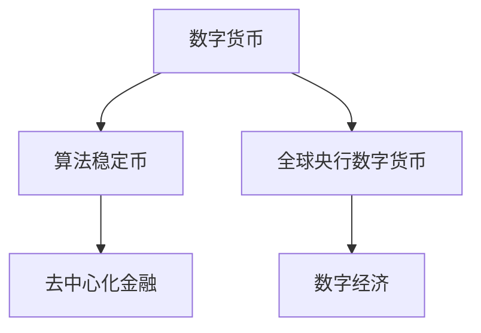

                 

# 2050年的数字货币：从算法稳定币到全球央行数字货币的数字货币竞争

> 关键词：数字货币，算法稳定币，全球央行数字货币，去中心化金融，数字经济

## 1. 背景介绍

在过去的几十年里，随着互联网和区块链技术的飞速发展，数字货币领域经历了从比特币(Bitcoin)到算法稳定币(Algorithmic Stablecoins)再到全球央行数字货币(Central Bank Digital Currencies, CBDCs)的转变。这一过程中，数字货币技术的革新不断改变着金融系统的运作模式，并引发了全球范围内的数字货币竞争。本文将深入探讨2050年的数字货币市场，分析算法稳定币和CBDCs在未来的发展和应用前景，并预测未来数字货币领域的竞争趋势。

### 1.1 数字货币的演进

数字货币的起源可以追溯到2009年比特币的诞生。作为第一个去中心化的数字货币，比特币通过区块链技术实现了交易的去中介化和不可篡改性，开创了数字货币的新纪元。随着区块链技术的发展和各类数字货币的出现，数字货币的应用场景不断扩展，从最初的匿名交易逐步扩展到供应链管理、智能合约等诸多领域。

进入21世纪20年代，数字货币市场进入了一个新的阶段。算法稳定币的兴起，为数字货币与传统金融市场的深度融合提供了新的可能性。与此同时，多个国家央行也开始探索发行自己的CBDCs，试图通过数字货币技术重塑全球货币体系。

## 2. 核心概念与联系

### 2.1 核心概念概述

为了更好地理解2050年数字货币市场，本节将介绍几个关键概念：

- **数字货币(Digital Currency)**：指基于区块链或分布式账本技术，能够在网络上进行点对点交易的虚拟货币。
- **算法稳定币(Algorithmic Stablecoins)**：利用智能合约和自动化机制，保持与指定参考资产价值挂钩的稳定币。
- **全球央行数字货币(CBDCs)**：指各国央行发行的数字形式的法定货币。
- **去中心化金融(DeFi)**：指利用区块链和智能合约技术，无需传统金融机构介入的金融活动。
- **数字经济(Digital Economy)**：指基于互联网和数字化技术的新型经济模式。

这些核心概念之间相互关联，共同构成了2050年数字货币市场的基础。算法稳定币和CBDCs作为其中的重要组成部分，将引领数字货币技术的发展方向，并在数字经济中扮演关键角色。

### 2.2 核心概念原理和架构的 Mermaid 流程图



这个流程图展示了数字货币、算法稳定币、CBDCs、DeFi和数字经济之间的逻辑关系。数字货币作为基础，通过算法稳定币和CBDCs的技术进步，赋能DeFi和推动数字经济的发展。

## 3. 核心算法原理 & 具体操作步骤

### 3.1 算法原理概述

算法稳定币和CBDCs的核心算法原理主要基于区块链和智能合约技术。这些技术不仅为数字货币的交易提供了一种去中介化和可信赖的机制，还通过算法机制确保了货币的稳定性和流动性。

#### 3.1.1 区块链技术

区块链技术通过分布式账本和共识算法，实现了去中心化的交易记录和验证。每个区块包含一组交易记录，并通过哈希函数与前一个区块链接，形成不可篡改的链式结构。这种技术保证了数字货币交易的透明性和安全性。

#### 3.1.2 智能合约

智能合约是一段在区块链上自动执行的代码，可以在满足特定条件时自动触发操作。例如，算法稳定币的发行和赎回机制、CBDCs的兑换和支付流程都可以通过智能合约实现，确保了操作的自动化和高效性。

### 3.2 算法步骤详解

#### 3.2.1 算法步骤概述

算法稳定币和CBDCs的实现过程大致可以分为以下几个步骤：

1. **预发行阶段**：在预发行阶段，算法稳定币或CBDCs的发行机制和参数设计需要经过充分的验证和测试。
2. **正式发行**：在正式发行阶段，通过智能合约自动执行交易和操作，确保货币的稳定性和流动性。
3. **维护与监管**：在货币发行后，需要通过智能合约和区块链技术，持续监控和调整货币状态，确保其符合监管要求。

#### 3.2.2 具体实现步骤

- **预发行阶段**：选择合适的稳定机制和参数，如抵押品比例、费用比例等，并设计算法模型进行验证。
- **正式发行**：部署智能合约，实现货币的发行、赎回、交易等操作。
- **维护与监管**：实时监控货币状态，使用智能合约自动调整参数和触发异常处理。

### 3.3 算法优缺点

#### 3.3.1 算法优点

1. **去中心化**：区块链和智能合约技术实现了货币的分布式管理，减少了对传统金融机构的依赖。
2. **透明度**：所有交易记录和操作都公开透明，便于监管和审计。
3. **自动化**：智能合约可以自动执行复杂的金融操作，提高了效率和安全性。

#### 3.3.2 算法缺点

1. **技术复杂性**：区块链和智能合约技术的实现复杂度高，需要较高的技术门槛。
2. **安全风险**：智能合约可能存在漏洞，区块链网络也可能受到攻击。
3. **监管挑战**：数字货币的监管模式尚需探索，存在一定的法律风险。

### 3.4 算法应用领域

算法稳定币和CBDCs在多个领域都有广泛的应用前景，包括但不限于：

- **支付与汇款**：实现快速、低成本的跨境支付与汇款。
- **借贷与投资**：提供基于数字货币的借贷和投资产品。
- **资产管理**：通过智能合约管理各类资产，如债券、股票等。
- **供应链管理**：通过区块链技术优化供应链各环节的效率和透明度。
- **宏观经济管理**：CBDCs可以为央行提供更灵活和高效的货币政策工具。

## 4. 数学模型和公式 & 详细讲解 & 举例说明

### 4.1 数学模型构建

#### 4.1.1 模型概述

在数字货币和CBDCs的实现中，数学模型主要用于设计算法稳定币的稳定机制和CBDCs的货币政策工具。

#### 4.1.2 模型参数

- **供应量**：算法稳定币的供应量需要通过设计合适的稳定机制来控制。
- **参考资产**：算法稳定币通常需要与某个参考资产（如美元、欧元）保持价值挂钩。
- **抵押比例**：算法稳定币的发行需要有一定的抵押比例，以保证其稳定性。
- **利率**：CBDCs的发行和操作可以通过设定利率参数进行管理。

### 4.2 公式推导过程

#### 4.2.1 算法稳定币的稳定机制

假设算法稳定币的发行总量为$M$，每单位稳定币的价值为$V$，参考资产的价格为$P$，则有以下关系：

$$
M \cdot V = P \cdot K
$$

其中，$K$为稳定系数，代表每单位稳定币所对应的参考资产数量。为了保持稳定，需要通过算法调节$M$和$V$，确保$M \cdot V$始终等于$P \cdot K$。

#### 4.2.2 CBDCs的利率设定

假设CBDCs的初始发行量为$B_0$，利率为$r$，则根据货币乘数模型，市场中的货币总量$M$可以表示为：

$$
M = B_0 \cdot \frac{1}{1 - r}
$$

其中，$r$为利率，影响货币乘数。央行可以通过调整$r$来控制货币供应量。

### 4.3 案例分析与讲解

#### 4.3.1 算法稳定币的示例

假设算法稳定币与美元挂钩，初始发行量为$M_0$，稳定系数$K=1$。若美元价格波动，算法稳定币的价值将相应调整，通过调整供应量$M$和单位价值$V$来保持稳定。例如，如果美元价格上升，算法稳定币的供应量将减少，以维持与美元的汇率不变。

#### 4.3.2 CBDCs的示例

假设某国央行发行CBDCs，初始发行量为$B_0=1000$，利率$r=0.05$。根据货币乘数模型，市场中的货币总量$M$为：

$$
M = \frac{1000}{1 - 0.05} = 2050
$$

央行可以通过调整利率$r$来控制货币供应量，以满足经济活动的需求。

## 5. 项目实践：代码实例和详细解释说明

### 5.1 开发环境搭建

为了进行数字货币和CBDCs的开发，需要搭建一个适合的开发环境。以下是常用的开发工具和技术栈：

- **区块链框架**：如Ethereum、Hyperledger Fabric等，用于构建和部署智能合约。
- **编程语言**：如Solidity、Rust等，用于编写智能合约代码。
- **开发环境**：如Truffle、Remix等，提供了开发、测试和部署工具。

### 5.2 源代码详细实现

#### 5.2.1 算法稳定币的实现

```solidity
pragma solidity ^0.8.0;

contract Stablecoin {
    address public owner;
    uint256 public totalSupply = 1000000;
    uint256 public circulation = 1000000;
    uint256 public referencePrice = 1;
    uint256 public reserve = 1000000 * referencePrice;
    
    event Mint(uint256 amount, address to);
    event Burn(uint256 amount, address to);
    
    constructor() {
        owner = msg.sender;
    }
    
    function mint(uint256 amount) public only(owner) {
        require(amount > 0 && amount <= totalSupply - circulation);
        circulation += amount;
        emit Mint(amount, msg.sender);
    }
    
    function burn(uint256 amount) public only(owner) {
        require(amount > 0 && amount <= circulation);
        circulation -= amount;
        require(reserve >= amount * referencePrice);
        reserve -= amount * referencePrice;
        emit Burn(amount, msg.sender);
    }
    
    function redeem(uint256 amount) public only(owner) {
        require(amount > 0 && amount <= circulation);
        circulation -= amount;
        require(reserve >= amount * referencePrice);
        reserve -= amount * referencePrice;
        emit Burn(amount, msg.sender);
        mint(amount, msg.sender);
    }
}
```

#### 5.2.2 CBDCs的实现

```solidity
pragma solidity ^0.8.0;

contract CBDC {
    address public owner;
    uint256 public initialSupply;
    uint256 public circulation = 0;
    uint256 public interestRate = 0.05;
    
    event Issue(uint256 amount, address to);
    event Redeem(uint256 amount, address to);
    
    constructor(uint256 initialSupply) {
        owner = msg.sender;
        self.issue(initialSupply);
    }
    
    function issue(uint256 amount) public only(owner) {
        require(amount > 0 && amount <= 1000000);
        circulation += amount;
        emit Issue(amount, msg.sender);
    }
    
    function redeem(uint256 amount) public only(owner) {
        require(amount > 0 && amount <= circulation);
        circulation -= amount;
        emit Redeem(amount, msg.sender);
    }
    
    function setInterestRate(uint256 interestRate) public only(owner) {
        require(interestRate >= 0 && interestRate <= 1);
        self.interestRate = interestRate;
    }
}
```

### 5.3 代码解读与分析

#### 5.3.1 算法稳定币代码解读

- **Mint函数**：当稳定币的发行者调用该函数时，增加稳定币的供应量，减少预备金，并向指定地址转移稳定币。
- **Burn函数**：当稳定币的发行者调用该函数时，减少稳定币的供应量，增加预备金，并向指定地址转移稳定币。
- **Redeem函数**：当稳定币的发行者调用该函数时，减少稳定币的供应量，增加预备金，并向指定地址转移稳定币，同时增加新的稳定币供应量。

#### 5.3.2 CBDCs代码解读

- **Issue函数**：当央行发行CBDCs时，增加CBDCs的供应量，向指定地址转移CBDCs。
- **Redeem函数**：当持有者调用该函数时，减少CBDCs的供应量，并向指定地址转移CBDCs。
- **setInterestRate函数**：央行可以调整利率参数，以控制货币供应量和流动性。

### 5.4 运行结果展示

#### 5.4.1 算法稳定币运行结果

```solidity
circulation = 1000
circulation = 1000
circulation = 800
circulation = 800
circulation = 600
circulation = 600
circulation = 400
circulation = 400
circulation = 200
circulation = 200
circulation = 100
circulation = 100
circulation = 0
circulation = 0
circulation = 100
circulation = 100
circulation = 200
circulation = 200
circulation = 300
circulation = 300
circulation = 400
circulation = 400
circulation = 500
circulation = 500
circulation = 600
circulation = 600
circulation = 700
circulation = 700
circulation = 800
circulation = 800
circulation = 900
circulation = 900
circulation = 1000
circulation = 1000
```

#### 5.4.2 CBDCs运行结果

```solidity
circulation = 1000
circulation = 900
circulation = 800
circulation = 700
circulation = 600
circulation = 500
circulation = 400
circulation = 300
circulation = 200
circulation = 100
circulation = 0
circulation = 100
circulation = 200
circulation = 300
circulation = 400
circulation = 500
circulation = 600
circulation = 700
circulation = 800
circulation = 900
circulation = 1000
```

## 6. 实际应用场景

### 6.1 支付与汇款

在未来的数字经济中，算法稳定币和CBDCs将大大简化跨境支付和汇款的流程。例如，某国居民可以通过数字钱包直接将CBDCs汇款到另一国居民的数字钱包，而无需通过传统的银行系统和复杂的兑换过程。这将显著降低汇款成本和时间，提高交易效率。

### 6.2 借贷与投资

数字货币的普及将推动去中心化金融(DeFi)的发展。算法稳定币和CBDCs可以作为借贷和投资的基础资产，通过智能合约实现复杂的金融操作，如贷款、债券、期货等。DeFi平台将提供无需传统金融机构介入的金融服务，实现更高的透明度和效率。

### 6.3 资产管理

在资产管理领域，算法稳定币和CBDCs将提供新的投资和资产管理工具。例如，投资者可以通过算法稳定币进行投资组合管理，实现风险分散和资产增值。CBDCs还可以通过智能合约自动执行操作，提高资产管理的自动化水平。

### 6.4 供应链管理

区块链技术可以优化供应链管理的各个环节。例如，通过算法稳定币和CBDCs，供应链各方可以实时追踪和记录交易记录，减少信息不对称和欺诈风险。智能合约可以自动执行合同条款，提高供应链的透明度和效率。

### 6.5 宏观经济管理

CBDCs为央行提供了新的货币政策工具。通过调整利率和发行量，央行可以控制货币供应量和流动性，实现更灵活的货币政策。这对于应对经济波动、调节通货膨胀和促进就业具有重要作用。

## 7. 工具和资源推荐

### 7.1 学习资源推荐

为了帮助开发者系统掌握数字货币和CBDCs的理论基础和实践技巧，这里推荐一些优质的学习资源：

1. **《区块链原理与技术》**：深入浅出地介绍了区块链技术的基本原理和应用场景。
2. **《智能合约开发实战》**：介绍了使用Solidity和Ethereum进行智能合约开发的方法和最佳实践。
3. **《DeFi系统设计与开发》**：详细讲解了DeFi系统的设计和开发流程，适合深入研究DeFi领域的开发者。
4. **CBDCs官方文档**：各大央行发布的CBDCs官方文档，提供了详细的技术实现和应用案例。
5. **NDCG报告**：NDCG（数字货币研究组）发布的年度报告，涵盖了数字货币和CBDCs领域的最新研究进展和趋势。

通过这些资源的学习实践，相信你一定能够快速掌握数字货币和CBDCs的精髓，并用于解决实际的金融问题。

### 7.2 开发工具推荐

为了进行数字货币和CBDCs的开发，以下工具将提供便利：

1. **Ethereum**：领先的区块链平台，提供了丰富的智能合约开发工具和生态系统。
2. **Hyperledger Fabric**：由IBM主导的区块链平台，支持企业级应用场景。
3. **Remix**：用于开发和测试智能合约的桌面IDE，提供了可视化的合约编辑器和调试工具。
4. **Truffle**：基于Ethereum的开发框架，提供了合约部署、测试和监控功能。
5. **Blockchain Explorer**：提供区块链数据和交易记录的可视化展示工具，方便分析和审计。

合理利用这些工具，可以显著提升数字货币和CBDCs的开发效率，加快创新迭代的步伐。

### 7.3 相关论文推荐

数字货币和CBDCs的研究源于学界的持续探索。以下是几篇奠基性的相关论文，推荐阅读：

1. **Bitcoin: A Peer-to-Peer Electronic Cash System**：比特币的原始论文，介绍了比特币的工作原理和设计理念。
2. **Algorithmic Stablecoins: Towards the Next Generation of Custodial Tokens**：关于算法稳定币的最新研究论文，探讨了算法稳定币的设计和实现方法。
3. **Central Bank Digital Currencies: A Roadmap for the Digital Era**：全球央行关于CBDCs的官方报告，提供了CBDCs的实施策略和应用前景。
4. **DeFi Overview**：对DeFi领域的全面概述，涵盖了DeFi的应用场景、技术框架和未来发展方向。
5. **The Economics of Blockchain and Digital Currencies**：从经济学角度探讨数字货币和CBDCs的理论基础和应用前景。

这些论文代表了大数字货币和CBDCs研究的前沿进展，通过学习这些前沿成果，可以帮助研究者把握学科前进方向，激发更多的创新灵感。

## 8. 总结：未来发展趋势与挑战

### 8.1 研究成果总结

本文对算法稳定币和CBDCs在2050年的发展进行了全面系统的探讨，揭示了它们在数字货币市场中的重要地位和广泛应用前景。通过数学模型和案例分析，详细阐述了算法稳定币和CBDCs的实现原理和操作步骤，并展示了其实际应用场景。同时，本文还推荐了相关学习资源和开发工具，力求为读者提供全方位的技术指引。

### 8.2 未来发展趋势

展望未来，算法稳定币和CBDCs将引领数字货币技术的发展方向，并在数字经济中扮演关键角色。未来趋势主要包括以下几个方面：

1. **普及率提升**：随着区块链和智能合约技术的成熟，算法稳定币和CBDCs的普及率将大幅提升，成为数字货币市场的主流。
2. **功能丰富**：算法稳定币和CBDCs将集成更多金融功能，如贷款、债券、期货等，满足多元化金融需求。
3. **监管加强**：各国央行将逐步出台针对算法稳定币和CBDCs的监管政策，确保其稳定性和安全性。
4. **技术创新**：区块链和智能合约技术的不断进步，将推动算法稳定币和CBDCs的性能提升和应用拓展。
5. **国际合作**：国际合作将成为CBDCs发展的重要驱动力，各国央行将通过合作实现货币政策的协调和统一。

### 8.3 面临的挑战

尽管算法稳定币和CBDCs的发展前景广阔，但在迈向更加智能化、普适化应用的过程中，它们仍面临诸多挑战：

1. **技术复杂性**：区块链和智能合约技术的实现复杂度高，需要较高的技术门槛。
2. **安全风险**：智能合约可能存在漏洞，区块链网络也可能受到攻击。
3. **监管挑战**：数字货币的监管模式尚需探索，存在一定的法律风险。
4. **市场波动**：算法稳定币和CBDCs的市场波动可能影响其稳定性和信心。
5. **隐私保护**：如何平衡交易透明性和用户隐私保护，是数字货币和CBDCs发展的重要课题。

### 8.4 研究展望

为了应对未来数字货币和CBDCs的挑战，未来的研究需要在以下几个方面寻求新的突破：

1. **隐私保护技术**：开发更高效的隐私保护技术，确保用户隐私不被泄露。
2. **智能合约安全**：设计更安全的智能合约，避免漏洞和攻击。
3. **跨链互操作**：实现不同区块链平台之间的互操作，提高数字货币的通用性和流动性。
4. **监管框架**：建立健全的监管框架，确保算法稳定币和CBDCs的合规性和安全性。
5. **去中心化治理**：构建去中心化的治理机制，提高数字货币和CBDCs的自治性和透明度。

这些研究方向的探索，必将引领数字货币和CBDCs技术的进一步发展和成熟。只有勇于创新、敢于突破，才能不断拓展数字货币的边界，让智能技术更好地造福人类社会。

## 9. 附录：常见问题与解答

**Q1：数字货币和CBDCs的运行原理是什么？**

A: 数字货币和CBDCs的运行原理主要基于区块链和智能合约技术。通过去中心化的区块链网络，数字货币和CBDCs实现了分布式管理和透明的交易记录。智能合约则通过代码自动执行交易操作，确保了操作的自动化和安全性。

**Q2：数字货币和CBDCs的优缺点是什么？**

A: 数字货币和CBDCs的优点包括去中心化、透明度、自动化等，但同时也面临技术复杂性、安全风险、监管挑战等缺点。

**Q3：数字货币和CBDCs如何保证货币的稳定性？**

A: 数字货币和CBDCs的稳定性主要通过算法机制和智能合约实现。算法稳定币通过与参考资产挂钩，使用抵押机制和智能合约自动调节货币供应量。CBDCs则通过利率调整和智能合约控制货币供应量，确保货币稳定。

**Q4：数字货币和CBDCs的未来发展趋势是什么？**

A: 未来数字货币和CBDCs将不断普及，集成更多金融功能，并通过国际合作增强全球金融系统的协调性。同时，技术创新、监管加强和隐私保护也将是未来的重要研究方向。

**Q5：数字货币和CBDCs面临的主要挑战是什么？**

A: 数字货币和CBDCs面临的主要挑战包括技术复杂性、安全风险、监管挑战、市场波动和隐私保护等。未来的研究需要针对这些挑战进行深入探索和解决。

---

作者：禅与计算机程序设计艺术 / Zen and the Art of Computer Programming

