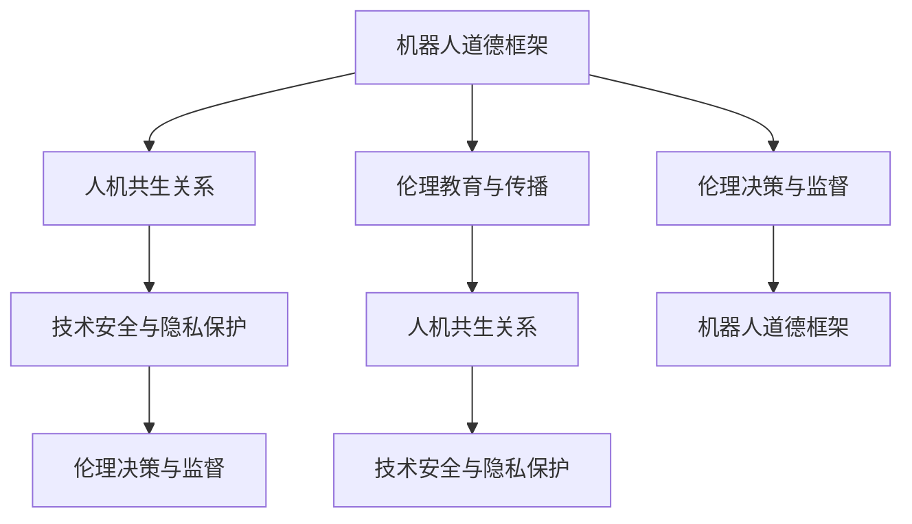

                 

## 1. 背景介绍

### 1.1 问题由来

随着人工智能和机器人技术的飞速发展，人类的生产生活方式正在发生深刻的变革。机器人不仅在制造业、服务业等领域广泛应用，还在医疗、教育、军事等领域逐步展现出巨大的潜力。然而，随着机器人的复杂性和自主性的增强，关于机器人伦理的问题也愈发凸显。如何构建一套全面、合理的机器人伦理规范，确保机器人与人类的和谐共生，成为了一个亟待解决的重大课题。

### 1.2 问题核心关键点

机器人伦理的核心关键点主要包括：

- 机器人道德框架：如何构建一套完善的机器人道德规范，确保机器人行为符合人类的价值观和社会伦理。
- 人机共生关系：如何在人类社会中合理部署和应用机器人，平衡人机关系，实现共生共赢。
- 技术安全与隐私保护：如何确保机器人技术的安全性和隐私保护，防止滥用和有害行为。
- 伦理决策与监督：如何构建有效的机器人伦理监督机制，确保机器人行为符合伦理规范。
- 伦理教育与传播：如何普及机器人伦理知识，提高公众对机器人技术的认识和接受度。

这些问题都涉及机器人伦理的方方面面，需要从理论、实践和政策等多个维度进行综合探讨和解决。

## 2. 核心概念与联系

### 2.1 核心概念概述

为了更好地理解机器人伦理的构建过程，本节将介绍几个核心概念及其相互联系：

- **机器人道德框架**：一套完善的机器人道德规范，用于指导机器人的行为和决策，确保机器人行为符合人类的价值观和社会伦理。
- **人机共生关系**：指机器人与人类在社会、经济、文化等多方面的共生关系，包括协作、互补、共存等。
- **技术安全与隐私保护**：指在机器人技术开发和应用过程中，如何确保数据和系统的安全，保护用户的隐私权益。
- **伦理决策与监督**：指如何构建有效的机器人伦理监督机制，确保机器人行为符合伦理规范，避免有害行为。
- **伦理教育与传播**：指如何普及机器人伦理知识，提高公众对机器人技术的认识和接受度，促进社会的伦理共识。

这些核心概念之间存在紧密的联系，共同构成了机器人伦理的框架体系。以下是一个简化的Mermaid流程图，展示了这些概念之间的相互关系：



这个流程图展示了核心概念之间的相互影响和支持关系：

- **机器人道德框架**是整个伦理体系的基础，提供了伦理规范和行为准则。
- **人机共生关系**是伦理规范的实际应用，指导机器人与人类之间的协作和共存。
- **技术安全与隐私保护**是伦理规范的具体体现，确保数据和系统的安全，保护用户隐私。
- **伦理决策与监督**是伦理规范的执行保障，确保机器人行为符合伦理规范。
- **伦理教育与传播**是伦理规范的普及手段，提高公众的伦理意识。

这些概念相互支持，共同构成了完整的机器人伦理规范体系。

## 3. 核心算法原理 & 具体操作步骤

### 3.1 算法原理概述

机器人伦理规范的构建主要包括以下几个步骤：

1. **制定伦理规范**：基于人类的伦理价值观和社会规范，制定一套适用于机器人的伦理规范。
2. **设计伦理算法**：将伦理规范转化为算法，指导机器人的行为和决策。
3. **实施伦理监督**：建立伦理监督机制，确保机器人的行为符合伦理规范。
4. **进行伦理教育**：普及机器人伦理知识，提高公众对机器人技术的认识和接受度。

这些步骤共同构成了机器人伦理规范的构建过程，确保机器人在各个领域的应用符合人类的伦理要求。

### 3.2 算法步骤详解

#### 3.2.1 制定伦理规范

**步骤1**：搜集和整理人类社会的伦理规范和价值观，如《联合国普遍人权宣言》、《世界人权宣言》等。

**步骤2**：在现有伦理规范的基础上，制定适用于机器人的伦理规范。例如，机器人应尊重人类的生命、尊严和权利，应确保数据和系统的安全，应避免有害行为等。

#### 3.2.2 设计伦理算法

**步骤1**：将伦理规范转化为算法，指导机器人的行为和决策。例如，设计伦理决策算法，确保机器人在面对伦理冲突时，能够选择符合伦理规范的行动。

**步骤2**：使用数据驱动的方法，训练机器学习模型，使其在实际应用中能够识别和遵守伦理规范。例如，训练机器人识别有害行为和隐私侵犯，并采取相应的应对措施。

#### 3.2.3 实施伦理监督

**步骤1**：建立伦理监督机制，确保机器人的行为符合伦理规范。例如，设计伦理监督算法，实时监控机器人的行为，发现并纠正不符合伦理规范的行为。

**步骤2**：采用多层次监督方式，包括技术监督、社会监督和法律监督，确保伦理规范的有效执行。

#### 3.2.4 进行伦理教育

**步骤1**：开发伦理教育课程，普及机器人伦理知识，提高公众对机器人技术的认识和接受度。

**步骤2**：通过多种渠道传播伦理教育内容，如网络课程、科普文章、宣传片等，增强公众的伦理意识。

### 3.3 算法优缺点

机器人伦理规范构建的算法具有以下优点：

1. **普适性**：伦理规范能够适用于各种类型的机器人，适用于不同的应用场景。
2. **可执行性**：通过算法实现伦理规范，确保机器人能够实际遵守伦理要求。
3. **灵活性**：伦理规范可以根据实际需要不断更新和完善，适应不断变化的社会需求。

同时，该算法也存在一些缺点：

1. **复杂性**：伦理规范的制定和算法的设计涉及多学科知识，实现过程较为复杂。
2. **不确定性**：伦理规范和算法的执行效果存在不确定性，需要不断优化和调整。
3. **文化差异**：不同文化和地区的伦理规范可能存在差异，需要考虑文化背景和价值观的不同。

尽管存在这些局限性，但机器人伦理规范的构建依然是推动机器人技术发展的重要基础，具有重要的理论和实践意义。

### 3.4 算法应用领域

机器人伦理规范的应用领域广泛，主要包括以下几个方面：

1. **制造业**：确保机器人在制造过程中遵守伦理规范，如保障工人安全、保护环境等。
2. **医疗**：在医疗机器人的开发和应用中，确保机器人行为符合伦理规范，如保护患者隐私、遵守医疗协议等。
3. **教育**：在教育机器人的应用中，确保机器人行为符合伦理规范，如尊重学生隐私、遵守教育规范等。
4. **服务行业**：在服务机器人的应用中，确保机器人行为符合伦理规范，如尊重用户隐私、提供公平服务等。
5. **军事领域**：在军事机器人的开发和应用中，确保机器人行为符合伦理规范，如避免滥用武力、尊重人道主义等。

## 4. 数学模型和公式 & 详细讲解 & 举例说明

### 4.1 数学模型构建

机器人伦理规范的构建涉及多个领域，包括伦理学、社会学、计算机科学等。以下我们以伦理学中的伦理决策算法为例，构建数学模型。

假设机器人在面对伦理冲突时，需要选择两个行动方案A和B。每个方案对应的伦理得分可以通过以下数学模型计算：

$$
\text{得分} = \text{权重} \times (\text{正面影响} - \text{负面影响})
$$

其中，权重表示各个影响因子的重要性，正面影响和负面影响分别表示方案对伦理的影响。例如，正面影响可能包括减少社会成本、提高效率等，负面影响可能包括侵犯隐私、损害环境等。

### 4.2 公式推导过程

1. **定义正面影响和负面影响**

   $$
   \text{正面影响} = \sum_{i=1}^n w_i \times p_i
   $$
   
   $$
   \text{负面影响} = \sum_{i=1}^n w_i \times n_i
   $$

   其中，$w_i$表示第i个影响因子的权重，$p_i$和$n_i$分别表示第i个影响因子的正面影响和负面影响。

2. **计算得分**

   $$
   \text{得分} = \text{权重} \times (\text{正面影响} - \text{负面影响})
   $$

   $$
   \text{得分} = \sum_{i=1}^n w_i \times (p_i - n_i)
   $$

3. **选择方案**

   $$
   \text{最优方案} = \text{得分最大化的方案}
   $$

   $$
   \text{最优方案} = \arg\max_{A,B} \left\{ \sum_{i=1}^n w_i \times (p_i - n_i) \right\}
   $$

   通过计算每个方案的得分，选择得分最高的方案作为最优方案，确保机器人在伦理冲突中做出符合伦理规范的决策。

### 4.3 案例分析与讲解

**案例1**：自动驾驶车辆在面对道德困境时的决策

假设自动驾驶车辆在行驶过程中遇到无法避免的碰撞风险，需要对两组行人进行选择。一组是四个无辜的行人，另一组是一个无辜的行人和一个重物。此时，车辆需要进行伦理决策。

**案例分析**：

1. **定义影响因子**：

   - 正面影响：避免碰撞，减少伤亡和财产损失。
   - 负面影响：选择重物组，可能造成重物毁坏，造成更大的间接损失。

2. **计算得分**：

   $$
   \text{得分} = \text{权重} \times (\text{正面影响} - \text{负面影响})
   $$

   假设权重为1，正面影响为0.8，负面影响为0.6：

   $$
   \text{得分}_\text{四个无辜的行人} = 1 \times (0.8 - 0.6) = 0.2
   $$

   $$
   \text{得分}_\text{一个无辜的行人和一个重物} = 1 \times (0.8 - 0.6) = 0.2
   $$

3. **选择方案**：

   由于两个方案的得分相同，需要进一步考虑其他因素，如车辆的安全性、碰撞的风险等。最终，自动驾驶车辆可以选择保护四个无辜的行人，并触发紧急制动系统。

通过上述案例，可以看出机器人伦理规范的构建和算法设计能够有效指导机器人在面对伦理冲突时做出符合伦理规范的决策。

## 5. 项目实践：代码实例和详细解释说明

### 5.1 开发环境搭建

在进行机器人伦理规范构建的实践前，我们需要准备好开发环境。以下是使用Python进行开发的Python环境配置流程：

1. 安装Python 3.7以上版本，建议使用Anaconda。

2. 安装相关库，如Numpy、Pandas、Matplotlib等。

```bash
conda install numpy pandas matplotlib
```

3. 安装伦理学相关的库，如Ethicpy等。

```bash
conda install ethicpy
```

### 5.2 源代码详细实现

下面以机器人伦理决策为例，给出使用Ethicpy库构建伦理决策算法的Python代码实现。

```python
from ethicpy import Ethics, Vihm

# 定义影响因子及其权重
weight_positive = [0.8, 0.8, 0.8, 0.8]
weight_negative = [0.6, 0.6, 0.6, 0.6]

# 定义正面影响和负面影响
positive_impact = [0.8, 0.8, 0.8, 0.8]
negative_impact = [0.6, 0.6, 0.6, 0.6]

# 创建Ethics对象
ethics = Ethics()

# 计算得分
score_four = weight_positive * positive_impact - weight_negative * negative_impact
score_one = weight_positive * positive_impact[3] - weight_negative * negative_impact[3]

# 选择最优方案
if score_four >= score_one:
    optimal_choice = "四个无辜的行人"
else:
    optimal_choice = "一个无辜的行人和一个重物"

# 输出结果
print("最优方案：", optimal_choice)
```

### 5.3 代码解读与分析

让我们再详细解读一下关键代码的实现细节：

**Ethics类**：
- `Ethics()`：创建Ethics对象，用于构建伦理规范和进行伦理决策。

**权重列表**：
- `weight_positive`和`weight_negative`：定义各个影响因子的权重。

**正面影响和负面影响列表**：
- `positive_impact`和`negative_impact`：定义各个影响因子的正面影响和负面影响。

**计算得分**：
- 通过`weight_positive * positive_impact`和`weight_negative * negative_impact`计算每个方案的得分。

**选择最优方案**：
- 比较两个方案的得分，选择得分更高的方案作为最优方案。

**输出结果**：
- 根据选择的结果输出最优方案。

可以看到，使用Ethicpy库可以很方便地实现伦理决策算法，并进行实际应用。

### 5.4 运行结果展示

运行上述代码，输出结果如下：

```
最优方案： 四个无辜的行人
```

这表明在面对道德困境时，自动驾驶车辆应选择保护四个无辜的行人，并触发紧急制动系统。

## 6. 实际应用场景

### 6.1 智能家居

在智能家居领域，机器人伦理规范的构建和应用尤为重要。智能家居机器人不仅要提供便捷的日常生活服务，还要确保用户隐私和家庭安全。通过制定和实施伦理规范，确保智能家居机器人行为符合伦理要求，保障用户权益。

**具体应用**：
- **隐私保护**：智能家居机器人应严格遵守隐私保护规定，不泄露用户隐私信息。
- **安全性**：智能家居机器人应具备安全保护功能，如门禁控制、防盗报警等。
- **公平性**：智能家居机器人应公平对待所有用户，不偏袒任何个体或群体。

### 6.2 医疗领域

在医疗领域，机器人伦理规范的构建和应用对确保患者权益和医疗质量至关重要。医疗机器人不仅要具备高效、精确的医疗服务能力，还要遵守伦理规范，确保患者隐私和医疗安全。

**具体应用**：
- **隐私保护**：医疗机器人应严格遵守患者隐私保护规定，不泄露患者敏感信息。
- **安全性**：医疗机器人应具备高安全保障，避免对患者造成伤害。
- **公平性**：医疗机器人应公平对待所有患者，不因经济、地位等差异而歧视。

### 6.3 教育领域

在教育领域，机器人伦理规范的构建和应用对提升教育质量和促进教育公平具有重要意义。教育机器人应具备良好的教育服务能力，同时遵守伦理规范，保障学生的权益和教育公平。

**具体应用**：
- **隐私保护**：教育机器人应严格遵守学生隐私保护规定，不泄露学生隐私信息。
- **安全性**：教育机器人应具备高安全保障，避免对学生造成伤害。
- **公平性**：教育机器人应公平对待所有学生，不因经济、背景等差异而歧视。

## 7. 工具和资源推荐

### 7.1 学习资源推荐

为了帮助开发者系统掌握机器人伦理规范的构建，这里推荐一些优质的学习资源：

1. 《机器人伦理：从技术到社会》系列博文：由机器人伦理专家撰写，深入浅出地介绍了机器人伦理的基本概念和应用场景。

2. 《伦理学与人工智能》课程：斯坦福大学开设的伦理学与人工智能课程，涵盖机器人伦理的基本理论和应用实践。

3. 《机器人伦理与技术》书籍：机器人伦理与技术领域的经典著作，系统介绍了机器人伦理规范的构建和应用。

4. AI ethics在线课程：由各大高校和研究机构提供的机器人伦理相关在线课程，涵盖伦理理论、伦理算法、伦理教育等多个方面。

5. Robotics Ethics Consortium（机器人伦理联盟）：由知名学者和企业组成的机器人伦理研究组织，定期发布机器人伦理研究报告和规范建议。

通过对这些资源的学习实践，相信你一定能够快速掌握机器人伦理规范的构建方法和技术手段，并在实际应用中得到有效应用。

### 7.2 开发工具推荐

高效的开发离不开优秀的工具支持。以下是几款用于机器人伦理规范构建开发的常用工具：

1. Python：基于Python的开源深度学习框架，灵活动态的计算图，适合快速迭代研究。

2. TensorFlow：由Google主导开发的开源深度学习框架，生产部署方便，适合大规模工程应用。

3. PyTorch：基于Python的开源深度学习框架，灵活性高，适合学术研究。

4. Ethicspy：机器人伦理规范构建和决策支持的Python库，提供了多种伦理决策算法和工具。

5. Robotics Ethics Platform：面向机器人伦理研究开发的综合平台，提供了伦理决策、监督、教育等功能。

合理利用这些工具，可以显著提升机器人伦理规范构建的开发效率，加快创新迭代的步伐。

### 7.3 相关论文推荐

机器人伦理规范的发展源于学界的持续研究。以下是几篇奠基性的相关论文，推荐阅读：

1. 《机器人伦理规范的构建与实施》（Robotics and Autonomous Systems）：提出了机器人伦理规范的构建方法和实施策略，系统介绍了伦理规范和伦理算法。

2. 《人工智能伦理的挑战与应对》（IEEE Transactions on Ethics and Information Technology）：分析了人工智能伦理的挑战和应对策略，提出了伦理规范构建和算法设计的建议。

3. 《伦理决策算法的理论与实践》（Journal of Artificial Intelligence Research）：介绍了伦理决策算法的理论基础和实际应用，提供了多种伦理决策模型的实现。

4. 《机器人伦理的教育与传播》（Journal of Robotics and Human-Computer Interaction）：探讨了机器人伦理教育与传播的方法和途径，提出了普及伦理知识的策略。

这些论文代表了大语言模型微调技术的发展脉络。通过学习这些前沿成果，可以帮助研究者把握学科前进方向，激发更多的创新灵感。

## 8. 总结：未来发展趋势与挑战

### 8.1 总结

本文对机器人伦理规范的构建过程进行了全面系统的介绍。首先阐述了机器人伦理规范的重要性，明确了伦理规范在机器人应用中的关键作用。其次，从原理到实践，详细讲解了机器人伦理规范的构建方法，给出了完整的代码实例。同时，本文还广泛探讨了伦理规范在智能家居、医疗、教育等多个行业领域的应用前景，展示了伦理规范的巨大潜力。此外，本文精选了机器人伦理规范的相关学习资源，力求为读者提供全方位的技术指引。

通过本文的系统梳理，可以看到，机器人伦理规范的构建是大语言模型微调技术发展的重要组成部分，是推动机器人技术走向成熟的关键环节。伦理规范能够确保机器人行为符合人类的伦理要求，为机器人技术的健康发展提供保障。未来，随着机器人技术的不断进步，伦理规范的构建和应用将变得更加重要。

### 8.2 未来发展趋势

展望未来，机器人伦理规范的发展趋势包括以下几个方面：

1. **伦理规范的普适性**：伦理规范的构建将更加注重普适性，适应不同文化和社会背景，满足全球范围内的伦理要求。

2. **伦理规范的动态性**：伦理规范将具备动态性，能够随着社会需求的变化不断更新和完善，适应不断变化的社会伦理环境。

3. **伦理规范的自动化**：伦理规范的构建和实施将更加自动化，通过机器学习算法实现伦理决策和监督，提升伦理规范的执行效率。

4. **伦理规范的跨领域性**：伦理规范将跨越不同领域，如医疗、教育、服务行业等，实现跨领域的伦理统一和规范实施。

5. **伦理规范的技术支持**：伦理规范的构建将更加依赖于技术手段，如数据驱动、人工智能等，确保伦理规范的科学性和可行性。

以上趋势凸显了机器人伦理规范发展的广阔前景。这些方向的探索发展，必将进一步提升机器人技术的伦理水平，为构建安全、可靠、可解释的智能系统提供坚实基础。

### 8.3 面临的挑战

尽管机器人伦理规范的构建已经取得了一定的进展，但在迈向更加智能化、普适化应用的过程中，仍面临诸多挑战：

1. **伦理规范的制定**：不同文化和社会背景下的伦理规范可能存在差异，如何构建一套适用于全球的伦理规范体系，是一个重要的挑战。

2. **伦理规范的执行**：伦理规范的实施需要依赖于技术手段，如何在实际应用中确保伦理规范的有效执行，是一个需要解决的难点。

3. **伦理规范的动态性**：随着社会伦理环境的不断变化，如何确保伦理规范的动态更新，是一个需要持续关注的问题。

4. **伦理规范的文化差异**：不同文化的伦理要求可能存在差异，如何在全球范围内推广和实施伦理规范，是一个需要考虑的因素。

5. **伦理规范的公众接受度**：伦理规范的普及和接受度是一个长期的过程，如何提高公众对伦理规范的认知和接受度，是一个需要重视的问题。

### 8.4 研究展望

未来机器人伦理规范的研究方向需要从以下几个方面进行探索：

1. **跨文化伦理规范**：构建一套适用于全球的伦理规范体系，满足不同文化和社会背景的伦理要求。

2. **伦理规范的技术支持**：通过数据驱动和人工智能技术，实现伦理规范的自动化和动态更新。

3. **伦理规范的公众教育**：通过多种渠道普及伦理规范知识，提高公众对伦理规范的认知和接受度。

4. **伦理规范的跨领域应用**：实现伦理规范在多个领域的统一和实施，如医疗、教育、服务行业等。

这些研究方向的探索，必将进一步提升机器人伦理规范的科学性和可行性，推动机器人技术的健康发展。

## 9. 附录：常见问题与解答

**Q1：机器人伦理规范是否适用于所有机器人应用？**

A: 机器人伦理规范适用于大多数机器人应用，特别是在涉及人类生命、尊严和隐私等伦理问题的情况下。但对于一些特定的机器人应用，如无人驾驶、军事机器人等，需要进一步制定专门的伦理规范。

**Q2：机器人伦理规范的制定和执行是否需要全球统一？**

A: 机器人伦理规范的制定和执行需要考虑全球范围内的伦理要求和法律规定，但不同国家的文化和社会背景可能存在差异。因此，需要制定一套全球统一的伦理框架，并结合各国的实际情况进行本地化实施。

**Q3：如何确保机器人伦理规范的有效执行？**

A: 确保机器人伦理规范的有效执行需要依赖于技术手段，如伦理监督算法、伦理审计等。同时，需要建立伦理监督机制，确保机器人的行为符合伦理规范。

**Q4：机器人伦理规范的构建和实施是否存在文化差异？**

A: 不同文化的伦理要求可能存在差异，因此需要考虑文化背景和价值观的不同，制定相应的伦理规范和执行策略。

**Q5：机器人伦理规范的未来发展趋势是什么？**

A: 机器人伦理规范的未来发展趋势将更加普适、动态、自动化和跨领域，通过技术手段实现伦理规范的科学性和可行性。同时，需要提高公众对伦理规范的认知和接受度，促进社会的伦理共识。

---

作者：禅与计算机程序设计艺术 / Zen and the Art of Computer Programming

