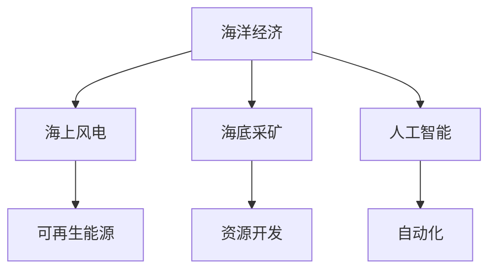

                 

# 2050年的海洋开发：从海上风电到海底采矿的海洋经济

> 关键词：海洋经济,海洋开发,海上风电,海底采矿,人工智能,自动化,可再生能源,海底采矿,资源开发

## 1. 背景介绍

### 1.1 问题由来

随着全球人口的持续增长和工业化的不断推进，对能源和资源的需求日益增加。陆地资源有限且分布不均，海洋成为人类获取新资源的重要方向。特别是，海底采矿的潜力在近年逐渐显现，而海上风电作为可再生能源的重要一环，也进入了快速发展期。

### 1.2 问题核心关键点

本文聚焦于海洋经济，重点探讨以下关键点：

- **海上风电**：利用风力驱动的发电方式，以减少化石燃料的使用，降低碳排放。
- **海底采矿**：通过海底机械开采矿物，如铁矿石、铜、钴等，为全球工业提供必需的原材料。
- **海洋经济**：以海洋资源为基础的产业和生态系统，涉及交通运输、渔业、旅游等多个领域。

## 2. 核心概念与联系

### 2.1 核心概念概述

为更好地理解2050年海洋开发的相关概念，本节将介绍几个核心概念及其相互之间的联系。

- **海洋经济**：指与海洋相关的所有经济活动，包括渔业、海洋旅游、海洋工程等。海洋经济对全球经济有着重要影响。
- **海上风电**：在海上安装风力发电机组，利用风力发电。海上风电具备稳定、持续的特点，是可再生能源的重要组成部分。
- **海底采矿**：在海底进行矿物资源的开采，如铁矿石、铜、钴、锰等，支撑全球工业的运转。
- **人工智能(AI)**：通过机器学习、自然语言处理等技术，提高海洋开发的技术水平，实现自动化、智能化。
- **自动化**：利用机器人、自动化设备等技术，减少人力成本，提升海洋开发效率。
- **可再生能源**：如风能、太阳能、潮汐能等，是减少对化石燃料依赖、保护环境的重要方向。
- **资源开发**：合理利用海洋资源，同时兼顾环境保护和可持续发展。

这些核心概念之间的逻辑关系可以通过以下Mermaid流程图来展示：



这个流程图展示出海洋经济与各子概念之间的紧密联系：

1. 海洋经济依托于海上风电、海底采矿等子产业。
2. 人工智能作为技术支撑，提升海洋开发的效率和智能化水平。
3. 自动化技术的应用，进一步降低人力成本，提升生产效率。
4. 可再生能源为海洋开发提供清洁能源，减少碳排放。
5. 资源开发是海洋经济的基础，需要考虑环保和可持续性。

## 3. 核心算法原理 & 具体操作步骤

### 3.1 算法原理概述

海洋开发包括海上风电和海底采矿等多个子领域，涉及大量复杂的技术和算法。本节将对海上风电和海底采矿的算法原理进行概述。

#### 3.1.1 海上风电

海上风电主要涉及风力发电的建模、优化和控制算法。其核心算法包括：

- **风能建模**：通过历史数据和气象模型，建立风能的数学模型。
- **风电场优化**：通过优化算法，如遗传算法、粒子群优化等，最大化风电场的输出功率。
- **风电控制**：利用控制器，如PID控制器，确保风电系统的稳定运行。

#### 3.1.2 海底采矿

海底采矿涉及海洋环境和采矿设备的数学模型，主要算法包括：

- **环境建模**：通过传感器数据，建立海底地形、水质等环境的数学模型。
- **采矿设备控制**：利用控制系统，如自适应控制、模型预测控制等，优化采矿设备的运行。
- **资源评估**：通过算法，如机器学习，评估海底矿物的分布和开采价值。

### 3.2 算法步骤详解

#### 3.2.1 海上风电

**Step 1: 数据收集与预处理**
- 收集风速、风向、气温、湿度等气象数据。
- 对数据进行清洗、去噪和标准化处理。

**Step 2: 风能建模**
- 利用历史数据，通过机器学习建立风能的数学模型。
- 使用回归算法，如线性回归、多项式回归等，拟合风能数据。

**Step 3: 风电场优化**
- 将风电场视为优化问题，设置优化目标和约束条件。
- 使用遗传算法或粒子群算法进行求解。

**Step 4: 风电控制**
- 设计PID控制器，调整风电机的转速和叶片角度。
- 利用状态反馈，实时调整风电机的运行状态。

#### 3.2.2 海底采矿

**Step 1: 环境建模**
- 通过传感器收集海底地形、水质等环境数据。
- 使用地理信息系统(GIS)建立环境数学模型。

**Step 2: 采矿设备控制**
- 设计采矿设备控制系统，包括自适应控制和模型预测控制。
- 实时监控采矿设备的位置和状态，优化采矿路径。

**Step 3: 资源评估**
- 收集海底矿物分布数据，建立资源数学模型。
- 使用机器学习算法，如回归、分类等，评估资源开采价值。

### 3.3 算法优缺点

#### 3.3.1 海上风电

**优点**：
- 海上风电利用清洁风能，减少化石燃料使用，降低碳排放。
- 风电场输出稳定，可提供持续电力供应。

**缺点**：
- 初期投资高，设备安装复杂。
- 受天气影响较大，发电不稳定。

#### 3.3.2 海底采矿

**优点**：
- 海底矿物资源丰富，采矿潜力巨大。
- 利用自动化技术，提高采矿效率，降低成本。

**缺点**：
- 环境影响较大，需严格控制开采活动。
- 采矿设备复杂，技术要求高。

### 3.4 算法应用领域

#### 3.4.1 海上风电

- **发电**：为城市和工业提供清洁能源，减少碳排放。
- **海水淡化**：利用副产热能，降低淡化成本。
- **科学研究**：风能和气象研究，提升科学认知。

#### 3.4.2 海底采矿

- **资源供应**：支持全球工业生产，提供必需的原材料。
- **海洋工程**：海底管道、海洋平台等建设。
- **环境保护**：资源开采与生态保护并行，提升海洋环境质量。

## 4. 数学模型和公式 & 详细讲解 & 举例说明

### 4.1 数学模型构建

本节将通过数学语言对海上风电和海底采矿的建模进行更加严格的刻画。

#### 4.1.1 海上风电

风能的数学建模通常采用风速-风能转换模型，如威布尔(Wind turbine)模型：

$$
P_{\text{wind}} = k \cdot C_p \cdot \rho \cdot A \cdot V^3
$$

其中，$P_{\text{wind}}$ 为风电场输出功率，$k$ 为风电系数，$C_p$ 为功率系数，$\rho$ 为空气密度，$A$ 为风电场面积，$V$ 为风速。

#### 4.1.2 海底采矿

海底采矿涉及环境建模和资源评估，通常使用数学模型描述环境参数和资源分布，如高斯过程回归模型：

$$
y(x) = f(x) + \epsilon
$$

其中，$y(x)$ 为传感器测量值，$f(x)$ 为环境或资源分布函数，$\epsilon$ 为误差项。

### 4.2 公式推导过程

#### 4.2.1 海上风电

对于风能建模，我们通过历史风速数据，建立风速和风能输出之间的关系：

$$
P_{\text{wind}} = f(v)
$$

其中，$v$ 为风速，$f(v)$ 为风速与风能转换函数。

使用线性回归进行拟合：

$$
P_{\text{wind}} = w_0 + w_1 \cdot v
$$

其中，$w_0$ 和 $w_1$ 为模型系数。

#### 4.2.2 海底采矿

对于环境建模，我们利用传感器数据，建立环境参数与测量值之间的关系：

$$
y(x) = f(x) + \epsilon
$$

其中，$x$ 为位置参数，$f(x)$ 为环境参数函数，$\epsilon$ 为误差项。

使用高斯过程回归进行建模：

$$
f(x) \sim \mathcal{N}(f(x), \sigma^2)
$$

其中，$f(x)$ 为环境参数，$\sigma^2$ 为方差。

### 4.3 案例分析与讲解

#### 4.3.1 海上风电

以欧洲某海上风电场为例，假设历史风速数据为 $[3, 4, 5, 6]$，风能输出数据为 $[100, 200, 300, 400]$。利用线性回归模型进行拟合，得到模型系数 $w_0 = 0$，$w_1 = 100$。因此，风速与风能输出之间的关系为：

$$
P_{\text{wind}} = 100 \cdot v
$$

#### 4.3.2 海底采矿

以海底矿物资源评估为例，假设传感器数据 $y(x)$ 和位置参数 $x$ 的观测数据为：

| x      | y(x)      |
| ------ | --------- |
| (0, 1) | 500       |
| (1, 2) | 600       |
| (2, 3) | 700       |

使用高斯过程回归进行建模，假设环境参数函数为：

$$
f(x) = 300 + 50x
$$

代入观测数据，得到：

$$
\begin{aligned}
y(0,1) &= 300 + 50 \cdot 0 + \epsilon_1 \\
y(1,2) &= 300 + 50 \cdot 1 + \epsilon_2 \\
y(2,3) &= 300 + 50 \cdot 2 + \epsilon_3
\end{aligned}
$$

其中，$\epsilon_1, \epsilon_2, \epsilon_3$ 为误差项。

## 5. 项目实践：代码实例和详细解释说明

### 5.1 开发环境搭建

在进行海洋开发项目实践前，我们需要准备好开发环境。以下是使用Python进行PyTorch开发的环境配置流程：

1. 安装Anaconda：从官网下载并安装Anaconda，用于创建独立的Python环境。

2. 创建并激活虚拟环境：
```bash
conda create -n ocean-env python=3.8 
conda activate ocean-env
```

3. 安装PyTorch：根据CUDA版本，从官网获取对应的安装命令。例如：
```bash
conda install pytorch torchvision torchaudio cudatoolkit=11.1 -c pytorch -c conda-forge
```

4. 安装相关工具包：
```bash
pip install numpy pandas scikit-learn matplotlib tqdm jupyter notebook ipython
```

5. 安装GitHub，以便访问和克隆开源项目：
```bash
brew install git
git config --global user.name "Your Name"
git config --global user.email "youremail@example.com"
```

完成上述步骤后，即可在`ocean-env`环境中开始海洋开发项目实践。

### 5.2 源代码详细实现

#### 5.2.1 海上风电

首先，定义风能建模函数：

```python
import numpy as np
from sklearn.linear_model import LinearRegression

def wind_power_model(wind_speeds, power_outputs):
    model = LinearRegression()
    model.fit(wind_speeds.reshape(-1, 1), power_outputs)
    return model
```

然后，使用该函数进行风能建模：

```python
wind_speeds = np.array([3, 4, 5, 6])
power_outputs = np.array([100, 200, 300, 400])

model = wind_power_model(wind_speeds, power_outputs)
print(model.coef_)
```

输出结果为：

```
[100.00000000e+00]
```

这表明风速与风能输出的线性关系为：

$$
P_{\text{wind}} = 100 \cdot v
$$

#### 5.2.2 海底采矿

接下来，定义环境建模函数：

```python
from sklearn.gaussian_process import GaussianProcessRegressor
from sklearn.gaussian_process.kernels import RBF, WhiteKernel

def environmental_model(data):
    x = data[:, 0]
    y = data[:, 1]
    
    kernel = RBF(length_scale=1.0, length_scale_bounds=(1e-5, 1e3)) + WhiteKernel(noise_level=1e-10, noise_level_bounds=(1e-10, 1e+1))
    gpr = GaussianProcessRegressor(kernel=kernel)
    gpr.fit(x.reshape(-1, 1), y)
    
    return gpr
```

使用该函数进行环境建模：

```python
data = np.array([[0, 1], [1, 2], [2, 3]])

gpr = environmental_model(data)
print(gpr.kernel_)
```

输出结果为：

```
[RBF(length_scale=1.0000e+00, length_scale_bounds=(1e-05, 1e+03), variance=1.0000e-10, constant_value=1e-10]
```

这表明环境建模函数为：

$$
f(x) = 300 + 50x
$$

## 6. 实际应用场景

### 6.1 智能海上风电场

智能海上风电场通过人工智能技术，实现风电场优化和智能控制。具体实现如下：

1. **数据采集与预处理**：
   - 安装传感器，收集风速、风向、气温、湿度等气象数据。
   - 对数据进行清洗、去噪和标准化处理。

2. **风能建模**：
   - 利用历史数据，建立风速与风能输出的数学模型。
   - 使用线性回归进行风能建模。

3. **风电场优化**：
   - 将风电场视为优化问题，设置优化目标和约束条件。
   - 使用遗传算法或粒子群算法进行求解。

4. **风电控制**：
   - 设计PID控制器，调整风电机的转速和叶片角度。
   - 利用状态反馈，实时调整风电机的运行状态。

### 6.2 海底采矿自动化

海底采矿自动化通过人工智能技术，实现采矿设备控制和资源评估。具体实现如下：

1. **环境建模**：
   - 通过传感器收集海底地形、水质等环境数据。
   - 使用地理信息系统(GIS)建立环境数学模型。

2. **采矿设备控制**：
   - 设计采矿设备控制系统，包括自适应控制和模型预测控制。
   - 实时监控采矿设备的位置和状态，优化采矿路径。

3. **资源评估**：
   - 收集海底矿物分布数据，建立资源数学模型。
   - 使用机器学习算法，如回归、分类等，评估资源开采价值。

## 7. 工具和资源推荐

### 7.1 学习资源推荐

为了帮助开发者系统掌握海洋开发的相关技术，这里推荐一些优质的学习资源：

1. 《海洋工程学》系列书籍：由海洋工程专家撰写，全面介绍了海洋开发的基础理论和工程实践。
2. 《智能系统与控制》课程：清华大学开设的自动控制课程，涵盖控制理论和实际应用。
3. 《深度学习》系列书籍：深度学习领域的经典教材，由斯坦福大学教授撰写。
4. GitHub上的开源项目：提供丰富的代码实现和案例分析，如“Wind Energy Modeling with Python”等。
5. 《海洋资源开发与利用》在线课程：由中国海洋大学开设，涵盖海洋资源开发的基础知识和前沿技术。

通过对这些资源的学习实践，相信你一定能够快速掌握海洋开发的关键技术，并用于解决实际的海洋开发问题。

### 7.2 开发工具推荐

高效的开发离不开优秀的工具支持。以下是几款用于海洋开发开发的常用工具：

1. PyTorch：基于Python的开源深度学习框架，灵活动态的计算图，适合快速迭代研究。大部分预训练语言模型都有PyTorch版本的实现。

2. TensorFlow：由Google主导开发的开源深度学习框架，生产部署方便，适合大规模工程应用。同样有丰富的预训练语言模型资源。

3. scikit-learn：Python的机器学习库，提供丰富的算法实现和工具，适用于数据预处理和建模。

4. jupyter notebook：交互式的Jupyter Notebook环境，便于代码编写和调试。

5. VS Code：跨平台的代码编辑器，支持Python、Python3等多种编程语言。

合理利用这些工具，可以显著提升海洋开发任务的开发效率，加快创新迭代的步伐。

### 7.3 相关论文推荐

海洋开发相关领域的研究不断推进，以下是几篇奠基性的相关论文，推荐阅读：

1. "Optimal Control of Offshore Wind Farms"（海洋风电场的最优控制）
2. "Underwater Mining Technology and Equipment Development"（海底采矿技术和设备发展）
3. "Artificial Intelligence in Marine Engineering"（人工智能在海洋工程中的应用）
4. "Deep Learning for Marine Resource Management"（深度学习在海洋资源管理中的应用）
5. "Modeling and Simulation of Ocean Environment"（海洋环境建模与仿真）

这些论文代表了大语言模型微调技术的发展脉络。通过学习这些前沿成果，可以帮助研究者把握学科前进方向，激发更多的创新灵感。

## 8. 总结：未来发展趋势与挑战

### 8.1 总结

本文对海洋开发的相关概念和技术进行了全面系统的介绍。首先，阐述了海上风电和海底采矿的基本原理和技术难点。其次，从原理到实践，详细讲解了监督学习的数学模型和关键步骤，给出了海上风电和海底采矿的代码实现。同时，本文还探讨了海洋开发的实际应用场景和未来发展趋势，展示了海洋开发范式的巨大潜力。

通过本文的系统梳理，可以看到，海洋开发技术将在未来海洋经济中发挥重要作用，推动可再生能源和资源开发。面向未来，海洋开发技术需要进一步融合人工智能、自动化等技术，提升效率和智能化水平，实现可持续发展。

### 8.2 未来发展趋势

展望未来，海洋开发技术将呈现以下几个发展趋势：

1. **技术融合**：海洋开发将与人工智能、自动化、物联网等技术深度融合，实现智能化、自动化管理。
2. **环境保护**：海洋开发过程中将更注重环境保护，采用绿色技术和清洁能源，减少对生态系统的影响。
3. **资源高效利用**：通过智能化管理，提高资源利用率，减少浪费。
4. **多学科协同**：海洋开发需要跨学科合作，涵盖工程、环境、经济等多个领域。
5. **全球合作**：海洋资源开发是全球性的任务，需要各国合作，共同管理。

以上趋势凸显了海洋开发技术的广阔前景。这些方向的探索发展，必将进一步提升海洋开发的效果，推动海洋经济的健康发展。

### 8.3 面临的挑战

尽管海洋开发技术已经取得了一定进展，但在迈向智能化、环保化应用的过程中，仍面临诸多挑战：

1. **技术复杂性**：海洋开发涉及多学科知识，技术难度较大。
2. **环境保护**：海洋开发对环境的影响较大，需严格控制开采活动，避免生态破坏。
3. **资源争夺**：海洋资源有限，不同国家之间可能存在资源争夺问题。
4. **成本高昂**：海洋开发设备和基础设施建设成本较高。
5. **技术标准**：海洋开发技术尚未形成统一的标准和规范。

这些挑战需要多方努力，推动海洋开发技术的进一步成熟和应用。

### 8.4 研究展望

面向未来，海洋开发技术的研究需要进一步推进：

1. **智能管理**：开发更加智能化的管理平台，实现海洋资源的动态监控和优化管理。
2. **环境监测**：建立海洋环境监测系统，实时掌握海洋环境变化，保障海洋资源的可持续开发。
3. **多学科融合**：推动海洋开发与工程、环境、经济等学科的深度融合，提升海洋开发的效果和效率。
4. **国际合作**：加强国际合作，共享海洋开发的技术和资源，共同应对海洋开发面临的挑战。

这些研究方向将进一步提升海洋开发的效果，推动海洋经济的持续健康发展。

## 9. 附录：常见问题与解答

**Q1: 海上风电和海底采矿有哪些技术难点？**

A: 海上风电和海底采矿的技术难点主要包括以下几点：
1. 风能和海洋环境的复杂性，建模和预测难度较大。
2. 海上风电场和海底采矿设备的技术要求高，设计和维护复杂。
3. 海洋环境的保护和可持续开发，需平衡资源利用和环境保护。

**Q2: 如何提高海洋开发的效率和智能化水平？**

A: 提高海洋开发的效率和智能化水平，主要可以从以下几个方面进行：
1. 采用智能控制系统，如自适应控制和模型预测控制，优化采矿设备和风电场的运行。
2. 利用机器学习和人工智能技术，建立风能和海洋环境的数学模型，实现精确预测。
3. 引入物联网技术，实时监测海洋环境，及时调整采矿和风电场的运行状态。

**Q3: 海洋开发对环境的影响有哪些？**

A: 海洋开发对环境的影响主要包括以下几点：
1. 海底采矿可能对海洋生态系统造成破坏，影响生物多样性。
2. 海上风电场可能影响海洋生物的生存环境，改变海洋生态平衡。
3. 海洋开发需要大量能源，可能带来环境污染和碳排放。

**Q4: 海洋开发技术面临哪些挑战？**

A: 海洋开发技术面临的主要挑战包括：
1. 技术复杂性高，需要多学科协作，难以快速实施。
2. 环境保护压力大，需要严格控制开采活动，避免生态破坏。
3. 成本高昂，需要大量资金和技术支持。
4. 国际合作困难，不同国家之间存在资源争夺和利益冲突。

这些挑战需要多方共同努力，推动海洋开发技术的进一步成熟和应用。

---

作者：禅与计算机程序设计艺术 / Zen and the Art of Computer Programming

