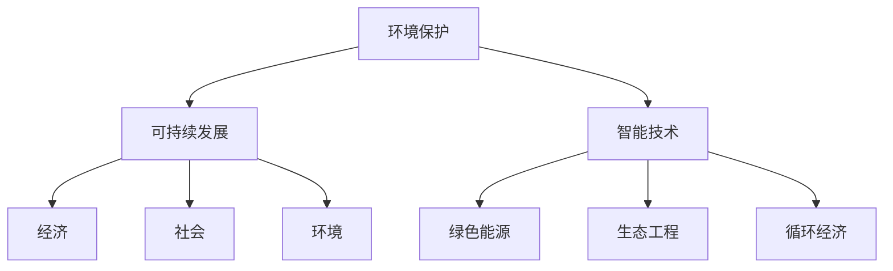

                 

# 2050年的环境保护：人与自然的和谐共生

## 1. 背景介绍

在科技与经济高速发展的21世纪，人类对自然界的开发和利用达到了前所未有的高度。然而，这一过程也伴随着严重的环境问题：全球气候变暖、生物多样性下降、资源枯竭等，严重威胁着地球的可持续性。这些问题已迫使人类重新思考与自然的关系，探索一条既满足现代发展需求又保护生态环境的新路径。

### 1.1 问题由来

随着工业革命的爆发，人类进入以化石燃料为主导的能源时代。这一时期，伴随着巨大的生产力提升，人类对自然资源的需求激增，对环境的破坏也愈发严重。工业废气、汽车尾气、废弃塑料等污染物的大量排放，导致全球气候发生剧烈变化。加之极端天气频发、自然灾害增多，生态系统遭到破坏，生物多样性锐减。这一系列问题，已到了不容忽视的地步。

### 1.2 问题核心关键点

当前环境问题的核心关键点包括：
1. **气候变化**：全球气候变暖导致的极端天气频发，海平面上升，极端干旱、洪涝灾害频发。
2. **生物多样性**：物种灭绝速度加快，生态系统破碎化。
3. **资源枯竭**：化石燃料消耗殆尽，矿物资源过度开采。
4. **城市扩张**：城市化进程加快，森林被砍伐，土地荒漠化。
5. **污染问题**：工业、农业、生活污染源广泛，水、空气、土壤污染严重。

## 2. 核心概念与联系

### 2.1 核心概念概述

为深入探讨2050年环境保护的关键问题，本节将介绍几个密切相关的核心概念：

- **环境保护**：指通过采取各种措施，防止自然环境受到破坏，保护自然生态系统的稳定与和谐。
- **可持续发展**：指在满足当代人的需求的同时，不损害后代人满足需求的能力，实现经济、社会、环境的平衡发展。
- **智能技术**：包括人工智能、物联网、区块链、大数据等新兴技术，通过数字化手段解决环境问题，实现人与自然的和谐共生。
- **绿色能源**：如太阳能、风能、水能等可再生能源，替代化石燃料，减少碳排放。
- **生态工程**：通过工程手段，恢复和重建生态环境，实现生态系统的自我修复和可持续发展。
- **循环经济**：以减量化、再利用、资源化为原则，实现资源的循环利用，减少环境污染和资源浪费。

这些概念之间的逻辑关系可以通过以下Mermaid流程图来展示：



这个流程图展示了一些关键概念之间的联系：环境保护是可持续发展的基础，而智能技术、绿色能源、生态工程、循环经济等手段，共同促进了环境保护与可持续发展的实现。

## 3. 核心算法原理 & 具体操作步骤

### 3.1 算法原理概述

2050年环境保护的算法原理基于数据驱动和模型驱动相结合的方法。具体而言，通过对大量环境数据进行收集、分析和建模，预测环境变化趋势，指导决策制定和资源管理。其中，数据驱动主要依赖于物联网(IoT)设备实时采集的环境数据，模型驱动则通过机器学习算法分析预测环境变化，从而制定有效的环境治理策略。

### 3.2 算法步骤详解

大语言模型微调的核心算法步骤包括：

1. **数据采集**：部署IoT传感器、环境监测站等设备，收集水、空气、土壤、植被等环境数据。

2. **数据预处理**：对采集的数据进行清洗、标准化处理，去除噪声和异常值。

3. **模型构建**：选择合适的模型，如时间序列模型、回归模型、分类模型等，用于预测环境指标变化趋势。

4. **模型训练**：使用历史数据对模型进行训练，优化模型参数。

5. **结果预测**：利用训练好的模型，对未来环境变化进行预测，生成决策支持信息。

6. **策略制定**：结合预测结果和实际环境情况，制定相应的环境保护和资源管理策略。

7. **策略执行**：通过智能控制系统，自动执行环保策略，如减排、节水、植树等。

8. **效果评估**：评估策略实施效果，反馈到模型中进行调整和优化。

### 3.3 算法优缺点

基于智能技术的环保算法具有以下优点：
1. **数据驱动**：通过大量实时数据，确保预测和决策的准确性和实时性。
2. **模型驱动**：机器学习算法可以捕捉数据中的复杂关系，提升预测精度。
3. **自动化**：智能控制系统可以实现自动执行，减少人工干预。
4. **可扩展性**：算法可以灵活调整和扩展，适用于多种环境治理场景。

同时，该算法也存在一些局限性：
1. **数据质量问题**：环境数据采集存在不精确、不完整等问题，影响模型预测效果。
2. **模型复杂性**：预测模型可能过于复杂，难以解释和调试。
3. **资源消耗**：数据采集和模型训练需要大量计算资源，成本较高。
4. **隐私安全**：环境数据可能涉及个人隐私，数据管理和隐私保护需特别关注。

### 3.4 算法应用领域

基于智能技术的环保算法，在多个领域得到广泛应用，包括：

- **水资源管理**：通过实时监测水质和水量，优化供水方案，减少浪费。
- **大气污染控制**：使用空气质量传感器监测污染物浓度，自动调整排放控制策略。
- **森林保护**：部署遥感设备监测森林覆盖率，及时发现火灾、病虫害等风险。
- **能源管理**：分析能源消耗模式，优化能源配置，推动绿色能源使用。
- **垃圾处理**：通过智能分类和回收系统，实现垃圾减量和资源化利用。

这些应用展示了智能技术在环境保护和资源管理中的巨大潜力。

## 4. 数学模型和公式 & 详细讲解  
### 4.1 数学模型构建

本节将使用数学语言对智能技术在环境保护中的应用进行更加严格的刻画。

假设我们有一个时间序列数据集 $D=\{(t_i, y_i)\}_{i=1}^N$，其中 $t_i$ 为时间戳，$y_i$ 为环境指标（如气温、水质、植被指数等）。目标是通过该数据集训练一个时间序列模型 $\hat{y}=f(t)$，以预测未来的环境指标。

一个典型的时间序列模型是自回归移动平均模型(ARIMA)，其表达式为：

$$
y_t = c + \sum_{i=1}^p \phi_i y_{t-i} + \sum_{j=1}^q \theta_j \epsilon_{t-j} + \epsilon_t
$$

其中 $c$ 为常数项，$\phi_i$ 和 $\theta_j$ 为模型的参数，$\epsilon_t$ 为误差项。

### 4.2 公式推导过程

以下是ARIMA模型的详细推导过程：

1. **平稳性检验**：首先对数据进行平稳性检验，确保时间序列具有统计意义。

2. **模型选择**：通过自相关图和偏自相关图，选择合适的自回归和差分阶数 $p$ 和 $d$，从而确定ARIMA模型的具体形式。

3. **参数估计**：使用最小二乘法或最大似然估计方法，对模型参数进行估计。

4. **模型诊断**：通过残差分析、自相关图、偏自相关图等手段，诊断模型的拟合效果和稳定性。

5. **预测验证**：使用验证集或交叉验证方法，对模型进行预测验证，评估其预测精度。

### 4.3 案例分析与讲解

以水资源管理为例，考虑某地区的供水系统，使用ARIMA模型预测未来的用水需求。假设历史用水数据 $D$ 为月度数据，模型参数估计结果如下：

- 常数项 $c=1.5$
- 自回归参数 $\phi_1=0.8$
- 差分阶数 $d=1$
- 移动平均参数 $\theta_1=0.6$

则未来某个月的用水需求预测公式为：

$$
\hat{y} = 1.5 + 0.8y_{t-1} + 0.6\epsilon_{t-1}
$$

其中 $y_{t-1}$ 和 $\epsilon_{t-1}$ 分别为上个月用水量和残差。

通过该模型，可以实时预测未来的用水需求，及时调整供水策略，避免水资源浪费。

## 5. 项目实践：代码实例和详细解释说明
### 5.1 开发环境搭建

在进行智能技术环境保护项目实践前，我们需要准备好开发环境。以下是使用Python进行项目实践的环境配置流程：

1. 安装Anaconda：从官网下载并安装Anaconda，用于创建独立的Python环境。

2. 创建并激活虚拟环境：
```bash
conda create -n env_name python=3.8 
conda activate env_name
```

3. 安装所需的Python包：
```bash
pip install pandas numpy matplotlib seaborn statsmodels pyproj
```

4. 安装IoT设备和环境监测站：
```bash
pip install pyiotenviobus
```

5. 安装Python的机器学习库：
```bash
pip install scikit-learn tensorflow
```

完成上述步骤后，即可在`env_name`环境中开始项目实践。

### 5.2 源代码详细实现

以下是使用Python进行时间序列预测的代码实现：

```python
import pandas as pd
import numpy as np
from statsmodels.tsa.arima_model import ARIMA
from sklearn.metrics import mean_squared_error

# 加载数据
data = pd.read_csv('water_usage.csv', index_col='date', parse_dates=['date'])
data['yhat'] = 0
data['residual'] = 0

# 平稳性检验
diff = data['usage'].diff(1)
data['diff'] = diff
adf_test = adfuller(data['diff'], autolag='AIC')
print('ADF Statistic: %f' % adf_test[0])
print('p-value: %f' % adf_test[1])

# 构建ARIMA模型
model = ARIMA(data['diff'], order=(1, 1, 1))
model_fit = model.fit(disp=0)

# 预测未来用水需求
forecast = model_fit.forecast(steps=12)[0]
data['yhat'] = np.array(forecast)
data['residual'] = data['usage'] - data['yhat']

# 评估模型
mse = mean_squared_error(data['usage'], data['yhat'])
print('MSE: %.3f' % mse)

# 可视化预测结果
import matplotlib.pyplot as plt
plt.plot(data['date'], data['usage'], label='Actual')
plt.plot(data['date'], data['yhat'], label='Forecast')
plt.legend()
plt.show()
```

### 5.3 代码解读与分析

让我们再详细解读一下关键代码的实现细节：

**时间序列预测**：
- 首先，通过`pandas`库加载历史用水数据，并进行平稳性检验，确保数据具有统计意义。
- 然后使用`statsmodels`库中的`ARIMA`模型对数据进行拟合，预测未来的用水需求。
- 最后，通过`scikit-learn`库中的`mean_squared_error`函数评估模型预测精度。

**可视化结果**：
- 使用`matplotlib`库绘制实际用水量和预测用水量的对比图，直观展示预测效果。

可以看到，通过Python实现的ARIMA模型，可以轻松地进行时间序列预测，并且评估其预测效果。

## 6. 实际应用场景
### 6.1 智能城市治理

智能技术在环境保护中的应用，首当其冲的是智能城市治理。通过部署IoT传感器，实时监测城市各个区域的空气质量、水质、噪音等指标，利用大数据分析和机器学习算法，实现城市环境的智能化管理。

在实践上，可以构建一个智能城市运营平台，通过数据分析和模型预测，优化城市交通、垃圾处理、能源管理等系统，提升城市运行效率，减少资源浪费和环境污染。智能城市平台还可以根据环境数据，智能调度环卫、安保等人员，提高城市服务水平。

### 6.2 农业环保

农业是环境污染的重要来源之一，智能技术在农业环保中的应用，可以显著提升农业生产效率和资源利用率，减少环境污染。

通过部署土壤、气象、水质等传感器，实时监测农业环境，利用机器学习算法，分析土壤肥力、气象条件、病虫害等信息，优化种植方案。例如，可以根据气象数据预测天气变化，提前调整灌溉计划，减少水资源浪费。同时，利用无人机和机器人等智能设备，进行精准农业管理，减少化肥、农药的使用量，降低农业对环境的影响。

### 6.3 生态修复

智能技术还可以用于生态修复，通过构建生态监测系统，实时监测植被生长、水质、土壤变化等指标，利用数据分析和模型预测，指导生态修复工程。

例如，在森林火灾频发地区，通过部署遥感设备和气象传感器，实时监测森林火险，预测火灾风险，提前采取预防措施。在河流治理项目中，通过安装水质监测站，实时监测水质变化，分析污染源，制定治理方案，修复受损生态系统。

## 7. 工具和资源推荐
### 7.1 学习资源推荐

为了帮助开发者系统掌握智能技术在环境保护中的应用，这里推荐一些优质的学习资源：

1. **《智能技术与环境保护》系列博文**：由环境科学和技术领域的专家撰写，深入浅出地介绍了智能技术在环境保护中的应用案例和实践方法。

2. **《Python数据分析与机器学习》课程**：在Coursera上提供的Python数据科学课程，涵盖数据分析、时间序列预测、机器学习等核心知识点，帮助开发者掌握相关技能。

3. **《智能环境管理》书籍**：系统介绍了智能技术在城市治理、农业环保、生态修复等领域的应用，提供丰富的案例和实践指南。

4. **IoT和机器学习社区**：如Kaggle、GitHub等平台，汇集了大量相关的代码和数据集，帮助开发者学习和实践。

5. **开源环境监测项目**：如OpenSenseMap、OpenWeatherMap等，提供丰富的环境监测数据和API接口，助力开发者进行实际项目开发。

通过对这些资源的学习实践，相信你一定能够快速掌握智能技术在环境保护中的应用精髓，并用于解决实际的环境问题。

### 7.2 开发工具推荐

高效的开发离不开优秀的工具支持。以下是几款用于智能环境保护开发的常用工具：

1. **IoT设备和传感器**：如Zigbee、Wi-Fi、LoRa等，支持实时数据采集和传输，确保数据的时效性和准确性。

2. **大数据分析平台**：如Hadoop、Spark等，提供高效的数据处理和分析能力，支持大规模数据的存储和计算。

3. **机器学习框架**：如TensorFlow、PyTorch等，提供丰富的机器学习算法和模型库，支持智能分析预测。

4. **可视化工具**：如Tableau、Power BI等，提供强大的数据可视化能力，帮助开发者直观展示分析结果。

5. **集成开发环境**：如Jupyter Notebook、PyCharm等，提供开发、调试、测试一体化环境，助力开发者高效工作。

合理利用这些工具，可以显著提升智能环境保护项目的开发效率，加快创新迭代的步伐。

### 7.3 相关论文推荐

智能环境保护技术的发展源于学界的持续研究。以下是几篇奠基性的相关论文，推荐阅读：

1. **智能城市：物联网与大数据下的城市管理创新**：探讨了物联网和智能技术在城市治理中的应用，提出了基于大数据的城市管理模式。

2. **基于深度学习的农业气象预测模型**：介绍了一种基于深度学习的农业气象预测模型，通过实时数据和机器学习算法，优化农业生产决策。

3. **智能监测与修复生态系统**：提出了一种基于遥感和机器学习的生态系统监测与修复方法，通过数据分析和模型预测，指导生态修复工程。

4. **循环经济与智能技术**：探讨了智能技术在循环经济中的应用，提出了基于物联网和机器学习的资源管理模型。

这些论文代表了大语言模型微调技术的发展脉络。通过学习这些前沿成果，可以帮助研究者把握学科前进方向，激发更多的创新灵感。

## 8. 总结：未来发展趋势与挑战

### 8.1 总结

本文对智能技术在2050年环境保护中的应用进行了全面系统的介绍。首先阐述了智能技术在环境保护中的核心概念和关键问题，明确了智能技术在环境保护与可持续发展中的重要作用。其次，从原理到实践，详细讲解了智能技术在环境保护中的算法步骤和关键操作，给出了智能环境保护项目的完整代码实例。同时，本文还广泛探讨了智能技术在智能城市治理、农业环保、生态修复等多个领域的应用前景，展示了智能技术在环境保护中的巨大潜力。最后，本文精选了智能技术在环境保护中的各类学习资源，力求为读者提供全方位的技术指引。

通过本文的系统梳理，可以看到，智能技术在环境保护中的应用前景广阔，能够有效提升环境保护的智能化、精准化和自动化水平，助力实现人与自然的和谐共生。

### 8.2 未来发展趋势

展望未来，智能环境保护技术将呈现以下几个发展趋势：

1. **智能城市治理**：随着IoT设备和传感器网络的不断扩展，智能城市治理将更加精细化和智能化，实现城市管理的全覆盖、全过程、全方位。

2. **精准农业**：通过智能技术，农业生产将实现精准化管理，提高资源利用率，减少环境污染。

3. **生态监测与修复**：生态监测系统将更加完善，数据分析和模型预测将更精确，生态修复工程将更加高效和可持续。

4. **循环经济**：智能技术将进一步推动循环经济的发展，实现资源的高效利用和回收。

5. **智能交通与物流**：智能交通系统将更加高效、安全、环保，减少交通污染和资源浪费。

6. **绿色能源**：智能电网、智能水务等绿色能源系统将更加普及，推动可再生能源的广泛应用。

这些趋势展示了智能环境保护技术的发展方向，未来将有更多智能技术应用于环境保护和可持续发展中。

### 8.3 面临的挑战

尽管智能环境保护技术已经取得了显著成就，但在迈向更加智能化、普适化应用的过程中，仍面临诸多挑战：

1. **数据隐私与安全**：IoT设备和传感器采集的环境数据可能涉及个人隐私和敏感信息，数据管理和隐私保护需特别关注。

2. **模型复杂性与可解释性**：智能预测模型可能过于复杂，难以解释和调试，模型的可解释性和可验证性亟需加强。

3. **资源消耗与成本**：智能技术在实施过程中，需要大量计算资源和硬件设施，成本较高，需探索更高效的实现方法。

4. **技术标准与规范**：智能环境保护领域的技术标准和规范尚未统一，缺乏统一的指导和监管，需推动标准化建设。

5. **跨领域协同**：智能环境保护需要跨学科、跨行业的协同合作，需建立多方协作机制，推动技术共享与协同创新。

6. **伦理与社会责任**：智能环境保护技术可能带来伦理和社会责任问题，需建立相应的伦理标准和规范。

### 8.4 研究展望

面对智能环境保护技术所面临的挑战，未来的研究需要在以下几个方面寻求新的突破：

1. **隐私保护与数据安全**：开发隐私保护技术，如差分隐私、联邦学习等，确保数据隐私和安全。

2. **模型简化与可解释性**：研究简化模型结构的方法，提升模型的可解释性和可验证性，帮助开发者和用户理解模型的决策逻辑。

3. **资源优化与成本控制**：探索资源优化技术，如模型压缩、分布式计算等，降低智能环境保护技术的实施成本。

4. **标准化建设**：制定智能环境保护领域的技术标准和规范，推动技术标准化、规范化。

5. **跨领域协同创新**：建立跨学科、跨行业的协同机制，推动智能环境保护技术的广泛应用。

6. **伦理与责任研究**：研究智能环境保护技术的伦理和社会责任问题，建立伦理规范和监管机制。

这些研究方向将推动智能环境保护技术迈向更高的台阶，为实现人与自然的和谐共生提供坚实的基础。

## 9. 附录：常见问题与解答

**Q1：智能技术在环境保护中的应用范围有哪些？**

A: 智能技术在环境保护中的应用范围非常广泛，涵盖城市治理、农业环保、生态修复、智能交通、绿色能源等多个领域。通过智能技术，可以实现对环境的实时监测、数据分析、预测预警和智能化管理，提升环境保护的精准化和自动化水平。

**Q2：智能环境保护中数据隐私和安全如何保障？**

A: 数据隐私和安全是智能环境保护中的重要问题，可以通过以下方法保障：
1. 数据匿名化处理：对采集的数据进行匿名化处理，确保数据无法追溯到个人身份。
2. 差分隐私：在数据分析过程中，加入噪声，保护个体隐私。
3. 联邦学习：数据在本地进行训练，不共享原始数据，降低隐私风险。
4. 数据加密：对敏感数据进行加密存储和传输，防止数据泄露。

**Q3：智能环境保护中的模型复杂性和可解释性如何平衡？**

A: 智能环境保护中的模型复杂性和可解释性需要平衡，可以通过以下方法实现：
1. 模型简化：通过剪枝、参数共享等方法，简化模型结构，降低复杂度。
2. 可解释模型：选择可解释性强的模型，如决策树、逻辑回归等，提升模型的可解释性。
3. 解释工具：使用模型解释工具，如LIME、SHAP等，解释模型的决策过程。

**Q4：智能环境保护中的资源消耗如何优化？**

A: 智能环境保护中的资源消耗可以通过以下方法优化：
1. 资源优化算法：使用资源优化算法，如梯度积累、混合精度训练等，降低计算资源消耗。
2. 模型压缩：通过模型压缩技术，如剪枝、量化等，减小模型大小，提高推理速度。
3. 分布式计算：通过分布式计算平台，如Hadoop、Spark等，提高计算效率。

**Q5：智能环境保护中的伦理与社会责任如何建立？**

A: 智能环境保护中的伦理与社会责任可以通过以下方法建立：
1. 伦理标准制定：制定智能环境保护技术的伦理标准和规范，明确技术应用的道德底线。
2. 社会责任机制：建立社会责任机制，确保技术应用符合社会伦理和法律规范。
3. 公众参与：通过公众参与和监督，推动技术应用的透明性和公正性。

这些解答为智能环境保护中的常见问题提供了参考，帮助开发者和用户更好地理解和应用智能技术。

---

作者：禅与计算机程序设计艺术 / Zen and the Art of Computer Programming

