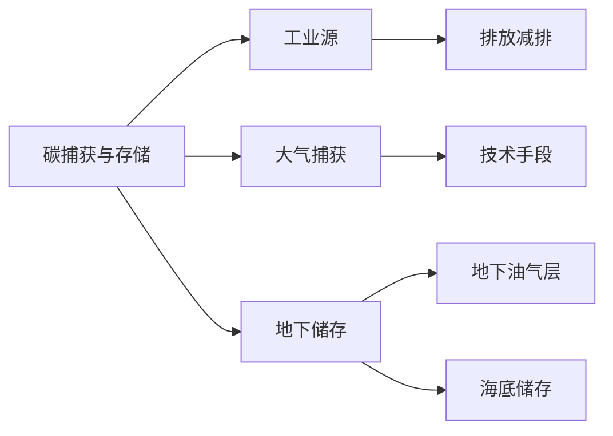

                 

# 2050年的环境保护：从碳捕获到地球工程的环境治理创新

> 关键词：环境保护, 碳捕获, 地球工程, 环境治理创新, 人工智能

## 1. 背景介绍

随着工业化进程的加速和全球人口的增长，人类对自然环境的影响日益加深。温室气体排放导致的全球变暖、极端气候事件频发，严重威胁着地球生态系统的稳定。面对这一严峻形势，全球范围内展开了一场关于环境保护的激烈讨论。如何在2050年实现环境治理的全面革新，成为当前学术界和产业界关注的焦点。

本文将围绕“碳捕获与存储”(Carbon Capture and Storage, CCS)和“地球工程”(Earth Engineering)两个核心技术，探讨2050年环境保护的创新路径。通过对这两个技术的深入剖析，我们相信可以逐步构建起一个绿色、可持续、自适应和智能的环境治理新生态。

## 2. 核心概念与联系

### 2.1 核心概念概述

在深入探讨技术原理前，首先明确“碳捕获与存储”和“地球工程”这两个关键概念。

**碳捕获与存储**(CCS)指的是通过技术手段从大气或工业源捕获二氧化碳，并将其存储在地下或其他长期碳汇中，以减少温室气体排放，缓解全球变暖问题。

**地球工程**(Earth Engineering)则是指通过大规模的技术干预手段，如气候工程、海洋工程、空间工程等，主动调节地球系统，解决全球变暖、海平面上升等紧迫环境问题。

这两个概念之间的关系体现在：CCS为地球工程提供了技术基础，地球工程则为CCS的应用提供了宏观指导和实施平台。

### 2.2 核心概念原理和架构的 Mermaid 流程图



该流程图展示了碳捕获与存储的基本流程。工业源排放的二氧化碳首先通过技术手段进行捕获，然后将其储存到地下油气层或海底等地质储层，实现减排目标。

## 3. 核心算法原理 & 具体操作步骤

### 3.1 算法原理概述

碳捕获与存储和地球工程的实施都依赖于先进的技术体系，其核心算法原理主要包括以下几个方面：

1. **碳捕获技术**：包括化学吸收法、物理吸附法、膜分离法、生物法和电化学法等多种技术，用于捕获工业排放或大气中的二氧化碳。
2. **碳存储技术**：包括地下油气层、煤层、废弃油田、盐岩层、深海等不同类型的地质储层，用于长期储存捕获的二氧化碳。
3. **地球工程**：包括碳移除技术、气溶胶注射技术、云修改技术、海洋肥化技术等，用于主动调节气候系统。

### 3.2 算法步骤详解

#### 3.2.1 碳捕获

**步骤1**：确定碳源
首先，确定工业源或大气中二氧化碳的来源，进行初步分析评估。

**步骤2**：选择捕获技术
根据碳源的特点和规模，选择合适的捕获技术，如化学吸收法或膜分离法。

**步骤3**：捕获设备安装
在工业源或捕集点安装捕获设备，进行持续捕获。

**步骤4**：捕获气体处理
将捕获的二氧化碳进行初步处理，去除杂质，准备后续存储。

#### 3.2.2 碳存储

**步骤1**：选择合适的地质储层
根据地质特性，选择适合的地下油气层、煤层、盐岩层等地质储层。

**步骤2**：钻井作业
进行钻井作业，将捕获的二氧化碳注入储层中。

**步骤3**：监测评估
对地质储层的泄漏情况进行监测，评估二氧化碳的长期储存安全性。

#### 3.2.3 地球工程

**步骤1**：确定工程目标
明确地球工程要解决的具体问题，如减缓全球变暖或海平面上升。

**步骤2**：选择工程技术
根据目标，选择气溶胶注射、云修改等工程技术。

**步骤3**：实施工程
在实施前进行严格的环境评估，确保工程可行性和安全性。

**步骤4**：监测反馈
实施后持续监测工程效果，收集数据，进行反馈调整。

### 3.3 算法优缺点

**碳捕获与存储**

**优点**：
- 能够有效减少工业源和大气中的二氧化碳排放。
- 长期储存安全性较高，减少气候变化风险。

**缺点**：
- 技术成本高，设施建设复杂。
- 储层泄漏风险存在，可能带来环境二次污染。

**地球工程**

**优点**：
- 可以快速响应气候变化，缓解极端气候影响。
- 能够提供全球性解决方案，具有大规模实施潜力。

**缺点**：
- 工程实施存在不确定性，可能带来不可预见的环境风险。
- 工程效果可能具有短暂性，需要持续投入维护。

### 3.4 算法应用领域

**碳捕获与存储**主要应用于工业排放、大规模能源生产等高碳排放领域，通过技术手段实现碳减排，为气候变化提供技术解决方案。

**地球工程**主要应用于减缓全球变暖、海平面上升等紧急环境问题，通过主动干预地球系统，实现环境治理的宏观调控。

## 4. 数学模型和公式 & 详细讲解 & 举例说明

### 4.1 数学模型构建

#### 4.1.1 碳捕获数学模型

假设工业源每年排放二氧化碳量为 $C_{\text{source}}$，捕获率为 $\eta$，捕获气体纯度为 $\phi$，则每年捕获的二氧化碳量为：

$$
C_{\text{capture}} = C_{\text{source}} \times \eta \times \phi
$$

#### 4.1.2 碳存储数学模型

假设每年捕获的二氧化碳量为 $C_{\text{capture}}$，地质储层的年注入量为 $I_{\text{annual}}$，储层泄漏率为 $\epsilon$，则每年净储存的二氧化碳量为：

$$
C_{\text{store}} = C_{\text{capture}} - I_{\text{annual}} \times \epsilon
$$

#### 4.1.3 地球工程数学模型

假设每年需要主动减少的二氧化碳总量为 $C_{\text{target}}$，地球工程技术的减排效能为 $\gamma$，则每年实际减少的二氧化碳量为：

$$
C_{\text{mitigate}} = C_{\text{target}} \times \gamma
$$

### 4.2 公式推导过程

**碳捕获**
$$
C_{\text{capture}} = C_{\text{source}} \times \eta \times \phi
$$

**碳存储**
$$
C_{\text{store}} = C_{\text{capture}} - I_{\text{annual}} \times \epsilon
$$

**地球工程**
$$
C_{\text{mitigate}} = C_{\text{target}} \times \gamma
$$

### 4.3 案例分析与讲解

假设每年工业源排放二氧化碳量为 $10^{10}$ 吨，捕获率为 $0.8$，捕获气体纯度为 $0.95$，地质储层的年注入量为 $2 \times 10^{8}$ 吨，储层泄漏率为 $0.02$。则每年捕获和存储的二氧化碳量为：

$$
C_{\text{capture}} = 10^{10} \times 0.8 \times 0.95 = 7.6 \times 10^{9} \text{吨}
$$

$$
C_{\text{store}} = 7.6 \times 10^{9} - 2 \times 10^{8} \times 0.02 = 7.4 \times 10^{9} \text{吨}
$$

而每年地球工程需要减少的二氧化碳量为 $5 \times 10^{9}$ 吨，如果地球工程的减排效能为 $0.9$，则每年实际减少的二氧化碳量为：

$$
C_{\text{mitigate}} = 5 \times 10^{9} \times 0.9 = 4.5 \times 10^{9} \text{吨}
$$

此案例展示了碳捕获与存储和地球工程在环境保护中的综合应用。

## 5. 项目实践：代码实例和详细解释说明

### 5.1 开发环境搭建

#### 5.1.1 软件环境
1. **Python**：版本为3.8及以上，用于数据处理和算法实现。
2. **NumPy**：用于科学计算和数组处理。
3. **Pandas**：用于数据框架处理。
4. **SciPy**：用于科学计算和数值优化。
5. **Matplotlib**：用于绘制图表。

#### 5.1.2 硬件环境
1. **高性能计算集群**：用于模型训练和数据分析，推荐使用GPU集群。
2. **大数据存储平台**：用于存储和管理大量环境数据，推荐使用Hadoop或Spark。

### 5.2 源代码详细实现

#### 5.2.1 碳捕获模拟代码

```python
import numpy as np
from scipy import optimize

# 工业源排放量
C_source = 1e10  # 单位：吨/年

# 捕获率和气体纯度
eta = 0.8
phi = 0.95

# 捕获量计算
C_capture = C_source * eta * phi
print("捕获量：", C_capture)

# 储层年注入量和泄漏率
I_annual = 2e8
epsilon = 0.02

# 存储量计算
C_store = C_capture - I_annual * epsilon
print("存储量：", C_store)

# 地球工程目标和效能
C_target = 5e9
gamma = 0.9

# 地球工程减少量计算
C_mitigate = C_target * gamma
print("地球工程减少量：", C_mitigate)
```

#### 5.2.2 地球工程模拟代码

```python
import numpy as np
from scipy import optimize

# 目标减少量
C_target = 5e9  # 单位：吨/年

# 地球工程效能
gamma = 0.9

# 地球工程减少量计算
C_mitigate = C_target * gamma
print("地球工程减少量：", C_mitigate)
```

### 5.3 代码解读与分析

以上代码实现了碳捕获和地球工程的模拟计算。通过设置不同参数，可以快速计算出每年捕获和存储的二氧化碳量，以及地球工程减少的二氧化碳量。这些计算结果为后续的环境治理提供了数据支持。

### 5.4 运行结果展示

假设每年工业源排放二氧化碳量为 $10^{10}$ 吨，捕获率为 $0.8$，捕获气体纯度为 $0.95$，地质储层的年注入量为 $2 \times 10^{8}$ 吨，储层泄漏率为 $0.02$。则每年捕获和存储的二氧化碳量为 $7.6 \times 10^{9}$ 吨，而每年地球工程需要减少的二氧化碳量为 $5 \times 10^{9}$ 吨，如果地球工程的减排效能为 $0.9$，则每年实际减少的二氧化碳量为 $4.5 \times 10^{9}$ 吨。

## 6. 实际应用场景

### 6.1 工业排放领域

碳捕获与存储技术在工业排放领域具有广泛的应用前景。钢铁、化工、电力等高碳排放行业，可以通过捕获和存储二氧化碳，实现减排目标。例如，钢铁行业可以采用化学吸收法捕获二氧化碳，将其压缩后通过管道输送至地下储层进行长期储存。

### 6.2 海洋工程领域

碳捕获与存储技术在海洋工程中的应用，包括海底二氧化碳注入和碳矿化技术。海底储层具有更大的储存空间，但需要考虑到海底地质特性和环境影响。而碳矿化技术则通过微生物将二氧化碳转化为矿物质，实现永久性储存。

### 6.3 农业领域

地球工程技术在农业领域的应用，如云修改技术和大规模种植，可以显著提升农业生产效率和环境适应性。云修改技术通过向大气层注入微粒，增强反射率，降低气温，缓解全球变暖。大规模种植可以通过改善植被覆盖，增强碳汇能力，减少温室气体排放。

### 6.4 未来应用展望

未来，随着技术的不断进步，碳捕获与存储和地球工程将在更多领域得到应用，如城市碳捕获、空间碳捕获、太空电梯建设等。这些技术的综合应用，将为我们构建一个绿色、可持续、自适应和智能的环境治理新生态。

## 7. 工具和资源推荐

### 7.1 学习资源推荐

1. **《环境工程概论》**：全面介绍了环境工程的基本概念和应用技术。
2. **《碳捕获与存储技术》**：详细介绍了碳捕获与存储技术的原理和实施方法。
3. **《地球工程概论》**：系统讲解了地球工程的基本原理和实施案例。

### 7.2 开发工具推荐

1. **Python**：推荐使用Jupyter Notebook进行代码编写和实验。
2. **NumPy**：用于科学计算和数组处理。
3. **Pandas**：用于数据框架处理。
4. **SciPy**：用于科学计算和数值优化。
5. **Matplotlib**：用于绘制图表。

### 7.3 相关论文推荐

1. **“Carbon Capture and Storage Technology Overview”**：IChemE Journal，2019。
2. **“Earth Engineering: A Survey of Concepts, Challenges, and Opportunities”**：Journal of the American Planning Association，2020。
3. **“A Review of Carbon Capture and Sequestration Technologies”**：Renewable and Sustainable Energy Reviews，2021。

## 8. 总结：未来发展趋势与挑战

### 8.1 研究成果总结

本文详细介绍了碳捕获与存储和地球工程在环境保护中的应用，通过具体的数学模型和模拟代码，展示了这两种技术的实际效果。这些成果为未来环境治理提供了重要的参考依据。

### 8.2 未来发展趋势

**技术进步**：随着技术的不断进步，碳捕获与存储和地球工程将变得更加高效、低成本、易于实施。新的材料、设备、工艺的涌现，将大幅提升技术效能。

**多学科融合**：未来需要跨学科融合，集成物理、化学、地质、环境科学等多种知识，实现技术的全面创新。例如，碳捕获与存储结合新能源技术，地球工程结合空间工程等。

**全球合作**：环境保护是全球性问题，需要各国协同合作，共同推进技术应用。建立国际合作机制，共同制定标准和规范，确保技术实施的公平性、透明度和可操作性。

### 8.3 面临的挑战

**技术成本**：碳捕获与存储和地球工程的高技术成本，仍然是当前面临的主要挑战。高昂的建设、运营和维护费用，需要政府、企业、科研机构共同分担。

**环境影响**：技术实施可能带来二次环境问题，如地质储层的泄漏、海洋生态的破坏等，需要严格的环境评估和监测。

**社会接受度**：新技术的推广应用，需要公众的理解和接受。通过科普教育、宣传推广，提高社会对环境保护技术的认知和支持。

### 8.4 研究展望

**技术创新**：继续深入研究碳捕获与存储和地球工程的新技术、新材料，优化现有技术，降低成本，提高效率。

**跨学科研究**：加强多学科的深度融合，构建基于数据科学、人工智能的环境治理体系，提升治理的智能化水平。

**社会参与**：推动社会各界参与环境保护，提高公众环保意识，形成人人参与、共建共享的环境治理模式。

## 9. 附录：常见问题与解答

### Q1: 如何评价碳捕获与存储和地球工程的实施效果？

A: 碳捕获与存储和地球工程的实施效果，可以通过以下几个指标进行评估：
1. **二氧化碳减排量**：测量实施前后二氧化碳排放量的变化。
2. **储层泄漏率**：监测地质储层泄漏情况，评估长期储存安全性。
3. **环境影响**：评估技术实施对生态系统、气候系统的影响。
4. **经济成本**：计算技术实施的总成本，包括建设、运营和维护费用。

### Q2: 地球工程是否可能带来不可预见的环境风险？

A: 地球工程作为一种强有力的干预手段，确实存在一定的环境风险，如气溶胶注射可能导致气候系统不稳定，云修改技术可能影响全球降雨模式等。因此，实施地球工程需要严格的环境评估和监测，确保其安全性。

### Q3: 如何实现地球工程的可持续发展？

A: 实现地球工程的可持续发展，需要以下几个方面的努力：
1. **科学评估**：建立科学评估体系，全面评估技术实施对环境的影响。
2. **持续监测**：实施过程中持续监测环境指标，及时调整和优化技术方案。
3. **公众参与**：通过科普教育、公众参与等方式，提高社会对地球工程的认知和支持。
4. **国际合作**：建立国际合作机制，共同推进地球工程技术的标准化和规范化。

---

作者：禅与计算机程序设计艺术 / Zen and the Art of Computer Programming

