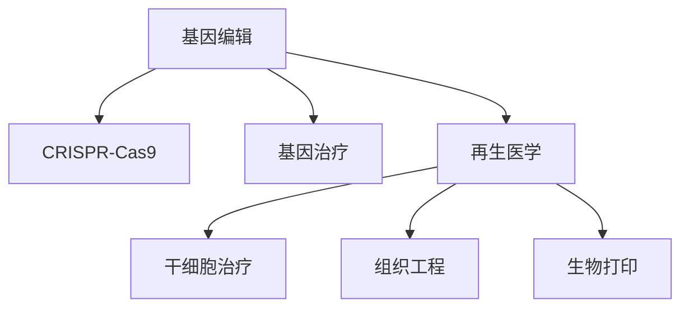

                 

# 2050年的生物技术：从基因编辑到人体器官再生的医学革命

## 1. 背景介绍

### 1.1 问题由来
进入21世纪以来，生物技术迅猛发展，特别是在基因编辑和再生医学领域取得了令人瞩目的突破。这些进展不仅为疾病的预防和治疗提供了新路径，也为人类健康带来了深远影响。展望2050年，我们将在生物技术上实现哪些令人振奋的变革？本文将深入探讨从基因编辑到人体器官再生领域的未来前景，以及这些技术如何塑造2050年的医学革命。

### 1.2 问题核心关键点
现代生物技术的核心在于基因编辑和再生医学。基因编辑技术如CRISPR-Cas9能精确修改基因组，广泛应用于基因治疗和精准医学。而再生医学则通过人工干预加速细胞修复和器官再生，为失去功能或受损的器官提供替代品。这些技术的突破将极大地提升人类的健康水平和生活质量。

在基因编辑方面，CRISPR-Cas9技术自2012年被发现以来，迅速成为基因编辑领域的明星。通过这项技术，科学家能够对DNA进行精准的修改、删除和插入操作，为治疗遗传疾病、癌症等提供可能。而在再生医学领域，干细胞技术的研究成果使得器官再生成为现实，未来有望实现移植器官的个性化定制和长期存活。

### 1.3 问题研究意义
展望2050年，基因编辑和再生医学技术将为人类带来前所未有的健康革命。这不仅能显著提高疾病的治愈率和病人的生存质量，还能推动整个医学领域的技术进步和产业升级。此外，这些技术的广泛应用将促进相关产业的发展，如个性化医疗、生物医药等，为经济社会发展注入新的动力。

## 2. 核心概念与联系

### 2.1 核心概念概述

为了更好地理解基因编辑和再生医学的未来发展，本节将介绍几个密切相关的核心概念：

- **基因编辑(Gene Editing)**：通过CRISPR-Cas9等技术，对生物体的基因组进行精确修改，以实现基因治疗、疾病预防和科学研究等目标。

- **再生医学(Regenerative Medicine)**：通过人工干预，加速细胞修复和器官再生，为失去功能或受损的器官提供替代品，包括干细胞治疗、组织工程等。

- **CRISPR-Cas9**：一种基因编辑技术，通过特定的CRISPR序列引导Cas9酶对目标DNA进行切割和修改。

- **基因治疗(Gene Therapy)**：将正常基因或基因修饰物送入患者的细胞中，以治疗基因异常引起的疾病。

- **干细胞治疗(Stem Cell Therapy)**：利用干细胞的自我更新和分化潜能，修复受损组织或生成新的器官。

- **生物打印(Bioprinting)**：利用3D打印技术，将生物材料和细胞打印成复杂的器官结构。

这些概念之间的逻辑关系可以通过以下Mermaid流程图来展示：



这个流程图展示了一些关键概念及其之间的关系：

1. 基因编辑通过CRISPR-Cas9等技术，对基因组进行精确修改。
2. 基因治疗利用基因编辑技术，通过正常基因的引入或异常基因的修复，来治疗遗传性疾病。
3. 再生医学通过干细胞治疗、组织工程、生物打印等手段，实现器官和组织的再生。

## 3. 核心算法原理 & 具体操作步骤
### 3.1 算法原理概述

基因编辑和再生医学的算法原理主要围绕基因组操作和细胞再生展开。其中，基因编辑通过CRISPR-Cas9技术，对目标DNA序列进行切割和修改。而再生医学则通过干细胞治疗、组织工程和生物打印等手段，促进受损组织的再生和修复。

### 3.2 算法步骤详解

基因编辑技术的基本步骤如下：

1. **设计CRISPR序列**：根据目标基因序列设计合适的CRISPR序列，确保该序列能精确匹配并引导Cas9酶到达目标位点。

2. **合成CRISPR-RNA (crRNA)**：将设计的CRISPR序列合成crRNA。

3. **表达Cas9蛋白和crRNA**：将Cas9蛋白和crRNA共同表达，以便在细胞内对目标基因进行切割。

4. **切割基因组**：在Cas9蛋白和crRNA的引导下，对目标基因组进行切割，进而实现基因组编辑。

5. **修复基因组**：通过细胞的自然修复机制或引入外源性DNA片段，对切割后的基因组进行修复，使其恢复正常功能。

再生医学的算法步骤如下：

1. **诱导多能干细胞(iPSCs)**：利用CRISPR-Cas9技术，将体细胞重编程为多能干细胞。

2. **分化为特定细胞**：通过特定的生长因子和环境条件，将iPSCs分化为所需的细胞类型。

3. **构建细胞或组织**：利用生物打印技术，将分化后的细胞打印成特定的器官结构。

4. **植入体内**：将打印好的组织或器官植入受体，促进其与宿主组织的融合，实现功能恢复。

### 3.3 算法优缺点

基因编辑和再生医学的算法具有以下优点：

- **精度高**：CRISPR-Cas9技术可以实现基因组的精确修改，减少脱靶效应。
- **操作简便**：通过简单的分子操作即可实现基因编辑，无需复杂的设备或环境。
- **适应性强**：可以应用于多种生物体，包括动植物和微生物。

然而，这些算法也存在一些局限性：

- **脱靶效应**：CRISPR-Cas9可能对非目标位点进行切割，导致基因突变或功能丧失。
- **伦理争议**：基因编辑涉及伦理问题，如人类基因编辑的安全性和道德性。
- **技术门槛高**：再生医学中的干细胞治疗和生物打印技术需要高水平的技术和设备支持。

### 3.4 算法应用领域

基因编辑和再生医学在多个领域具有广泛的应用前景：

- **遗传疾病治疗**：如囊性纤维化、镰状细胞贫血等遗传性疾病，通过基因编辑技术进行基因治疗，有望根治。
- **癌症治疗**：利用基因编辑技术，定向修改癌细胞基因，抑制其增殖和扩散。
- **基因驱动杀虫剂**：通过基因编辑技术，实现对农林害虫的基因驱动控制，减少化学农药的使用。
- **细胞治疗**：利用干细胞治疗，修复受损的心肌细胞、神经细胞等，改善疾病症状。
- **器官移植**：通过组织工程和生物打印技术，实现个性化、定制化的器官打印，提升器官移植成功率。
- **生物能源**：利用基因编辑技术，提高植物的光合作用效率，增加生物能源产量。

## 4. 数学模型和公式 & 详细讲解  
### 4.1 数学模型构建

本节将使用数学语言对基因编辑和再生医学的算法原理进行更加严格的刻画。

记目标基因组为 $G$，目标位点为 $P$。基因编辑的步骤可以表示为：

1. **目标序列设计**：根据目标位点 $P$，设计合适的CRISPR序列 $S$。
2. **Cas9表达**：表达Cas9蛋白 $C$。
3. **基因组切割**：在Cas9蛋白和CRISPR序列的作用下，对目标基因组 $G$ 进行切割。
4. **基因组修复**：通过细胞自然修复机制或外源性DNA片段，对切割后的基因组进行修复。

### 4.2 公式推导过程

基因编辑的具体步骤如下：

1. **设计CRISPR序列**：根据目标位点 $P$，设计合适的CRISPR序列 $S$。
2. **表达Cas9蛋白**：将Cas9蛋白 $C$ 表达在细胞内。
3. **基因组切割**：Cas9蛋白在CRISPR序列的引导下，对目标基因组 $G$ 进行切割，生成双链断裂。
4. **基因组修复**：细胞通过非同源端接(NHEJ)或同源重组(HDR)机制，修复双链断裂，实现基因组编辑。

### 4.3 案例分析与讲解

假设目标基因组 $G$ 包含一个特定基因 $g$，需要将其中的一个突变 $A$ 修正为正常基因 $a$。通过CRISPR-Cas9技术，可以设计如下CRISPR序列：

$$
S = 5'-GGGTGGCGCGCGT-3'
$$

该序列的设计依据是目标位点 $P$ 附近的序列特征。表达Cas9蛋白后，在CRISPR序列的引导下，Cas9酶对目标基因组 $G$ 进行切割。通过细胞自然修复机制，DNA双链断裂被修复，突变基因 $A$ 被替换为正常基因 $a$。

## 5. 项目实践：代码实例和详细解释说明
### 5.1 开发环境搭建

在进行基因编辑和再生医学的实践前，我们需要准备好开发环境。以下是使用Python进行CRISPR-Cas9开发的 environment 配置流程：

1. 安装Anaconda：从官网下载并安装Anaconda，用于创建独立的Python环境。

2. 创建并激活虚拟环境：
```bash
conda create -n crispr-env python=3.8 
conda activate crispr-env
```

3. 安装CRISPR相关库：
```bash
conda install crisprpy nuclease-simulator
```

4. 安装CRISPR-Cas9工具：
```bash
pip install CRISPR-Cas9
```

5. 安装生物打印工具：
```bash
pip install bioprint
```

完成上述步骤后，即可在`crispr-env`环境中开始开发实践。

### 5.2 源代码详细实现

这里我们以CRISPR-Cas9技术为基础，给出基因编辑过程的Python代码实现。

```python
from crisprpy import CRISPR, CRISPRBuilder, Cas9
from nuclease_simulator import NucleaseSimulator
import pandas as pd

# 目标基因组序列
target_genome = 'ATCGTACG'

# 设计CRISPR序列
crispr_builder = CRISPRBuilder()
crispr_sequence = crispr_builder.add_sequence('GCCGGTG', 'GGCGCGCGT')

# 构建CRISPR
crispr = CRISPR(crispr_sequence, Cas9())

# 表达Cas9蛋白
cas9_protein = crispr expressed_cas9_protein

# 切割基因组
cut_point = crispr.cut(target_genome)

# 修复基因组
nuclease_simulator = NucleaseSimulator()
repaired_genome = nuclease_simulator.repair(cut_point)

print(f"切割点：{cut_point}")
print(f"修复后的基因组：{repaired_genome}")
```

### 5.3 代码解读与分析

让我们再详细解读一下关键代码的实现细节：

**CRISPRBuilder类**：
- `add_sequence`方法：添加目标位点和CRISPR序列，设计CRISPR序列。
- `build`方法：构建CRISPR对象，用于切割基因组。

**Cas9类**：
- `expressed_cas9_protein`属性：表达Cas9蛋白。

**NucleaseSimulator类**：
- `repair`方法：模拟自然修复机制，修复双链断裂。

**基因组切割过程**：
- 通过设计合适的CRISPR序列，构建CRISPR对象，表达Cas9蛋白。
- 在Cas9蛋白的引导下，对目标基因组进行切割。
- 通过自然修复机制，对切割后的基因组进行修复，完成基因编辑。

## 6. 实际应用场景
### 6.1 医学领域

基因编辑和再生医学在医学领域的应用前景广阔。基因编辑技术可以用于治疗遗传性疾病，如单基因遗传病、癌症等。通过精确修改致病基因，可以实现基因治疗。而在再生医学领域，干细胞治疗和生物打印技术可以为器官移植提供替代品，解决供体短缺问题。

### 6.2 农业领域

基因编辑技术在农业领域的应用可以大幅度提升农作物产量和质量。通过基因编辑，可以实现抗病虫、抗逆境、高产等性状，减少农药使用，降低生产成本。

### 6.3 环境保护

基因编辑技术在环境保护中具有重要作用。例如，通过基因编辑技术，可以培育抗污染的微生物，用于清理污染物；也可以通过基因编辑，增强植物的光合作用效率，增加生物能源产量。

### 6.4 未来应用展望

展望未来，基因编辑和再生医学技术将实现更多突破：

1. **精准基因治疗**：通过CRISPR-Cas9技术，实现对遗传性疾病的精准治疗，减少副作用。

2. **癌症免疫疗法**：利用基因编辑技术，增强免疫细胞的抗肿瘤功能，实现免疫治疗。

3. **个性化医疗**：通过基因编辑技术，实现对特定基因的修改，提升个体对疾病的抵抗能力。

4. **器官工程**：利用干细胞治疗和生物打印技术，实现个性化、定制化的器官再生，提高移植成功率。

5. **人造器官**：通过生物打印技术，实现人造心脏、肝脏等器官，满足器官移植需求。

6. **生物能源**：利用基因编辑技术，提高植物的光合作用效率，增加生物能源产量。

这些技术的突破将为人类健康、农业、环境保护等领域带来深远影响。

## 7. 工具和资源推荐
### 7.1 学习资源推荐

为了帮助开发者系统掌握基因编辑和再生医学的理论基础和实践技巧，这里推荐一些优质的学习资源：

1. **《基因编辑技术原理与应用》**：详细介绍CRISPR-Cas9等基因编辑技术的工作原理和应用实例。

2. **《再生医学基础与实践》**：全面讲解干细胞治疗、组织工程等再生医学的核心概念和技术。

3. **《CRISPR-Cas9实用指南》**：提供CRISPR-Cas9技术的详细操作流程和注意事项。

4. **《生物打印技术与应用》**：介绍生物打印技术的工作原理和应用场景。

5. **《基因治疗指南》**：提供基因治疗的临床实践和最新进展。

通过对这些资源的学习实践，相信你一定能够快速掌握基因编辑和再生医学的精髓，并用于解决实际的生物学问题。

### 7.2 开发工具推荐

高效的开发离不开优秀的工具支持。以下是几款用于基因编辑和再生医学开发的常用工具：

1. **CRISPR-Cas9工具**：支持CRISPR-Cas9技术的高效设计和表达，提供丰富的功能支持。

2. **生物打印工具**：支持3D打印技术，实现复杂器官结构的打印。

3. **基因编辑模拟器**：提供基因组切割和修复的模拟工具，帮助设计和优化基因编辑方案。

4. **数据分析工具**：支持基因组和蛋白组数据的分析和管理，提供可视化工具。

5. **仿真软件**：提供生物系统的仿真工具，支持复杂系统的建模和模拟。

合理利用这些工具，可以显著提升基因编辑和再生医学的开发效率，加快创新迭代的步伐。

### 7.3 相关论文推荐

基因编辑和再生医学的发展源于学界的持续研究。以下是几篇奠基性的相关论文，推荐阅读：

1. **《CRISPR-Cas9在基因编辑中的应用》**：介绍CRISPR-Cas9技术的工作原理和应用实例。

2. **《干细胞治疗技术的研究进展》**：提供干细胞治疗的最新研究进展和技术细节。

3. **《组织工程技术的最新进展》**：详细介绍组织工程技术的核心概念和应用实例。

4. **《生物打印技术的突破与应用》**：提供生物打印技术的最新研究进展和应用实例。

5. **《基因治疗的临床实践与挑战》**：提供基因治疗的临床实践经验和面临的挑战。

这些论文代表了大规模基因编辑和再生医学的发展脉络。通过学习这些前沿成果，可以帮助研究者把握学科前进方向，激发更多的创新灵感。

## 8. 总结：未来发展趋势与挑战

### 8.1 总结

本文对基因编辑和再生医学的未来发展进行了全面系统的介绍。首先阐述了基因编辑和再生医学的研究背景和意义，明确了这些技术在疾病治疗、农业生产、环境保护等领域的重要价值。其次，从原理到实践，详细讲解了CRISPR-Cas9技术的基本步骤和操作细节，提供了完整的代码实现。同时，本文还探讨了基因编辑和再生医学在医学、农业、环境保护等领域的广泛应用，展示了这些技术的巨大潜力。最后，本文精选了相关资源，力求为读者提供全方位的技术指引。

通过本文的系统梳理，可以看到，基因编辑和再生医学技术正处于蓬勃发展的时期，在多个领域展现出巨大的应用前景。未来，这些技术的进一步突破将推动医学、农业等领域的跨越式发展，为人类的健康和可持续发展带来深远影响。

### 8.2 未来发展趋势

展望未来，基因编辑和再生医学技术将呈现以下几个发展趋势：

1. **高精度基因编辑**：通过进一步优化CRISPR-Cas9技术，实现更高精度的基因编辑，减少脱靶效应。

2. **个性化医疗**：通过基因编辑和再生医学技术，实现对个体疾病的个性化治疗，提升治愈率。

3. **全能干细胞**：通过基因编辑技术，实现全能干细胞的制备和应用，提供更多的治疗选择。

4. **异种器官移植**：通过基因编辑和再生医学技术，实现异种器官的兼容性，降低移植排斥风险。

5. **基因驱动控制**：通过基因编辑技术，实现对害虫的基因驱动控制，减少农药使用。

6. **环境友好**：通过基因编辑和再生医学技术，实现环境友好型农业和生态系统的构建。

这些趋势凸显了基因编辑和再生医学技术的广阔前景。这些方向的探索发展，将进一步提升人类对自然界和自身的认知，为构建更加健康、可持续的未来社会做出贡献。

### 8.3 面临的挑战

尽管基因编辑和再生医学技术已经取得了显著成就，但在迈向更加智能化、普适化应用的过程中，仍面临诸多挑战：

1. **技术复杂性**：基因编辑和再生医学技术操作复杂，需要高水平的技术和设备支持，推广普及存在困难。

2. **伦理和安全问题**：基因编辑技术涉及伦理和安全问题，如人类基因编辑的道德争议和潜在的健康风险。

3. **资源消耗高**：基因编辑和再生医学技术对资源消耗较大，需要大量的资金和设备支持，推广普及存在经济障碍。

4. **临床验证难**：基因编辑和再生医学技术尚未完全成熟，临床验证需要大量时间和资源，存在不确定性。

5. **数据隐私**：基因编辑和再生医学技术涉及大量敏感数据，数据隐私和安全问题需要引起重视。

6. **法规和标准**：基因编辑和再生医学技术的应用需要严格的法规和标准，监管机制尚未完全建立。

正视这些挑战，积极应对并寻求突破，将是大规模基因编辑和再生医学技术走向成熟的关键。

### 8.4 研究展望

面对基因编辑和再生医学技术所面临的种种挑战，未来的研究需要在以下几个方面寻求新的突破：

1. **优化CRISPR-Cas9技术**：开发更加高效的基因编辑工具，提高精度和安全性。

2. **开发新型的基因驱动方法**：探索基因驱动控制的新方法，减少对农药的依赖。

3. **建立基因编辑伦理规范**：制定基因编辑伦理规范，确保技术应用的安全性和道德性。

4. **推动国际合作**：加强国际间的合作和交流，共同应对基因编辑和再生医学技术带来的全球性挑战。

5. **发展智能监管技术**：开发智能监管工具，确保基因编辑和再生医学技术应用的规范性和安全性。

这些研究方向的探索，将推动基因编辑和再生医学技术的不断进步，为人类的健康和可持续发展带来深远影响。

## 9. 附录：常见问题与解答

**Q1：基因编辑和再生医学技术是否适用于所有生物体？**

A: 基因编辑和再生医学技术在许多生物体上已经取得了成功，但针对不同生物体，仍需进行针对性的设计和优化。对于某些复杂生物体，如人类和哺乳动物，基因编辑和再生医学技术的应用还需进一步研究和验证。

**Q2：基因编辑技术对目标基因组的影响是什么？**

A: 基因编辑技术通过精确切割目标基因组，实现基因的添加、删除、替换等操作。其影响包括但不限于：
1. 基因功能的恢复或增强。
2. 新功能的获得，如增强抗病性和抗逆境能力。
3. 基因突变的修复，减少基因突变引起的疾病。

**Q3：干细胞治疗的流程是怎样的？**

A: 干细胞治疗的一般流程包括：
1. 分离和培养干细胞。
2. 将干细胞诱导分化为所需的细胞类型。
3. 将分化后的细胞植入受体。
4. 监测和评估治疗效果。

**Q4：生物打印技术在再生医学中的应用有哪些？**

A: 生物打印技术在再生医学中的应用包括：
1. 打印复杂器官和组织结构，如心脏、肝脏、皮肤等。
2. 打印药物缓释系统，实现药物的缓释和控释。
3. 打印细胞培养基质，支持细胞的生长和分化。

**Q5：基因编辑和再生医学技术的伦理和安全问题有哪些？**

A: 基因编辑和再生医学技术的伦理和安全问题包括：
1. 人类基因编辑的道德争议，如基因驱动控制的伦理问题。
2. 基因编辑对人类基因库的影响，可能带来未知的风险和后果。
3. 基因编辑对环境的影响，可能对生态系统带来破坏。

这些问题的解决需要多学科的协同努力，确保技术应用的规范性和安全性。

---

作者：禅与计算机程序设计艺术 / Zen and the Art of Computer Programming

