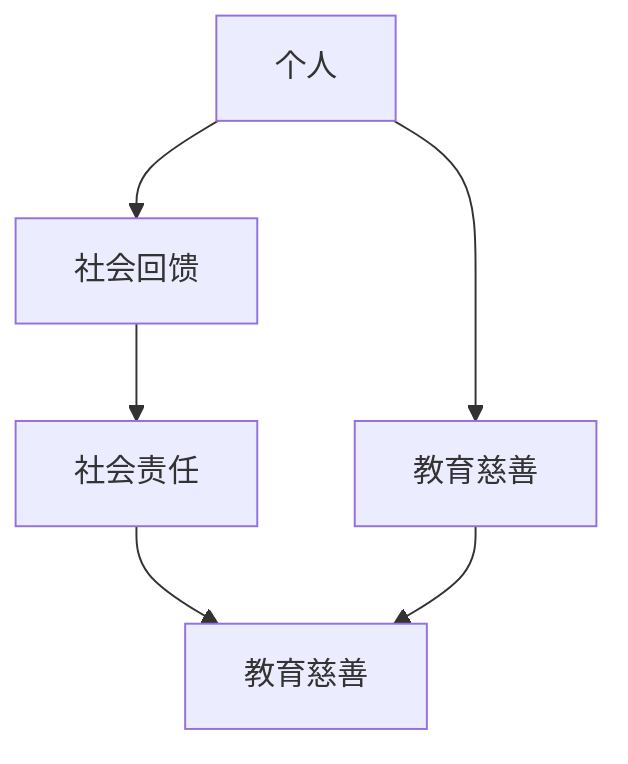

                 

# 建立个人奖学金或基金：回馈社会提升形象

> 关键词：个人奖学金,基金,社会回馈,形象提升,教育慈善,社会责任

## 1. 背景介绍

### 1.1 问题由来
随着科技的飞速发展，个人在各行各业中取得了显著的成就，同时也积累了丰富的财富。如何合理使用这些资源，回馈社会，提升自身形象，成为了越来越多成功人士关注的焦点。个人奖学金和基金就是其中一种行之有效的社会回馈方式。

### 1.2 问题核心关键点
个人奖学金和基金是一种将个人财富用于公益事业的公益行为，旨在帮助有需求的学生或项目获得资助，支持教育、科研、文化、慈善等领域的可持续发展。通过建立个人奖学金或基金，个人可以借助公益事业展示社会责任感，提升个人品牌形象，产生正面的社会影响。

### 1.3 问题研究意义
建立个人奖学金或基金具有以下重要意义：
1. **支持教育发展**：资助贫困、优秀学生或科研人员，推动知识的普及和创新。
2. **提升社会责任**：通过公益行为展示个人社会责任感，提升个人社会形象。
3. **促进慈善事业**：为公益组织提供资金支持，推动慈善事业的发展。
4. **增强商业影响力**：有助于提升企业品牌形象，增强商业影响力。
5. **激发社会正能量**：激发更多企业、个人参与社会公益事业，形成良好的社会风尚。

## 2. 核心概念与联系

### 2.1 核心概念概述

为更好地理解个人奖学金或基金的建立流程，本节将介绍几个密切相关的核心概念：

- **个人奖学金**：指由个人或企业设立的资助项目，旨在支持教育领域的学习、科研或技能培训。
- **基金**：指将资金汇集起来，用于特定公益事业的运作方式。
- **社会回馈**：指个人或企业将财富、知识、技能等资源用于公益事业，回馈社会，提升个人或企业的社会形象。
- **教育慈善**：指个人或企业通过资助教育项目，支持教育事业的发展，推动社会进步。
- **社会责任**：指个人或企业在追求经济效益的同时，应承担一定的社会责任，促进社会公平和谐。

这些核心概念之间的逻辑关系可以通过以下Mermaid流程图来展示：



这个流程图展示了个体与教育慈善、社会回馈、社会责任之间的关系：

1. 个人通过教育慈善，支持教育事业的发展。
2. 个人通过社会回馈，展示社会责任感，提升自身形象。
3. 社会责任是教育慈善和社会回馈的基础，推动个体和企业的公益行为。

## 3. 核心算法原理 & 具体操作步骤
### 3.1 算法原理概述

建立个人奖学金或基金的基本流程涉及以下几个关键步骤：

1. **设立基金会**：选择基金会类型，了解相关法规和税务要求，成立基金会。
2. **制定基金章程**：明确基金的宗旨、运作方式、资金来源和使用方向等。
3. **选择受助对象**：根据基金会的宗旨和目标，选择合适的受助对象，如贫困学生、优秀科研人员等。
4. **制定资助计划**：确定资助金额、资助方式、资助期限等，并进行评估和审核。
5. **执行资助计划**：按照计划进行资助，定期报告资助情况，监督资金使用。

### 3.2 算法步骤详解

以下我们详细介绍建立个人奖学金或基金的具体操作步骤：

**Step 1: 准备基金会设立**
- **选择基金会类型**：选择公募或私募基金会，根据自身需求和法规要求选择合适的类型。
- **了解法规要求**：咨询专业律师，了解成立基金会的相关法规和税务要求。
- **准备注册资料**：准备注册所需的法律文件，包括基金会章程、董事会成员名单、办公场所等。

**Step 2: 制定基金章程**
- **明确宗旨**：明确基金会的宗旨和目标，如支持教育、科研、文化等领域的可持续发展。
- **规定运作方式**：确定基金会的运作方式，包括资金管理、项目执行、评估和审计等。
- **规定资金使用**：明确资金的使用方向，如资助对象、资助标准、资助期限等。

**Step 3: 选择受助对象**
- **明确资助对象**：根据基金会的宗旨，确定资助对象，如贫困学生、优秀科研人员等。
- **评估受助对象**：建立评估体系，对受助对象进行资质和需求评估。
- **确定资助金额**：根据受助对象的需求和基金会的能力，确定资助金额。

**Step 4: 制定资助计划**
- **设计资助方式**：确定资助方式，如一次性资助、分期资助、奖学金等。
- **确定资助期限**：明确资助期限，如短期资助、长期资助等。
- **建立监管机制**：建立监管机制，确保资金使用的透明度和公正性。

**Step 5: 执行资助计划**
- **实施资助**：按照资助计划，实施资助，支付资助款项。
- **定期报告**：定期报告资助情况，包括资助对象、资助金额、资金使用情况等。
- **评估效果**：对资助效果进行评估，调整资助策略，优化资助计划。

### 3.3 算法优缺点

建立个人奖学金或基金具有以下优点：
1. **支持教育发展**：资助贫困、优秀学生或科研人员，推动知识的普及和创新。
2. **提升社会责任**：通过公益行为展示社会责任感，提升个人社会形象。
3. **促进慈善事业**：为公益组织提供资金支持，推动慈善事业的发展。
4. **增强商业影响力**：有助于提升企业品牌形象，增强商业影响力。
5. **激发社会正能量**：激发更多企业、个人参与社会公益事业，形成良好的社会风尚。

同时，该方法也存在一定的局限性：
1. **资金限制**：个人或企业财力有限，基金规模可能较小。
2. **管理难度**：基金会运作需要专业知识和管理经验，资金管理、项目执行、评估等较为复杂。
3. **法律责任**：基金会的运营需要遵守相关法规，存在法律风险。
4. **社会认知度**：初期社会认知度较低，需要时间和努力提升。

尽管存在这些局限性，但就目前而言，建立个人奖学金或基金仍然是大规模财富回馈社会的重要方式，具有广泛的社会影响力和积极的公益价值。

### 3.4 算法应用领域

建立个人奖学金或基金的应用领域非常广泛，涵盖了教育、科研、文化、慈善等多个领域。例如：

- **教育领域**：设立专项奖学金，资助贫困学生、优秀学生、教师等，推动教育公平。
- **科研领域**：设立科研基金，资助科研项目和科研人员，推动科学创新。
- **文化领域**：设立文化基金，资助文化保护、艺术创作等项目，传承和推广文化。
- **慈善领域**：设立公益基金，资助社区服务、环保项目等，推动社会公益事业发展。

这些领域通过个人奖学金或基金的支持，不仅有助于推动各自领域的可持续发展，还能够提升个人或企业的社会影响力，赢得社会的广泛认可。

## 4. 数学模型和公式 & 详细讲解 & 举例说明
### 4.1 数学模型构建

建立一个简单的资助计划模型，可以采用以下数学模型：

假设基金会的总资金为 $F$，资助期限为 $T$，每年资助金额为 $A$，资助对象数量为 $N$，每个资助对象获得的资助金额为 $a$。

则模型可以表示为：

$$
F = \sum_{i=1}^N a_i = Na
$$

在实际操作中，还需要考虑资助金额的调整和资助对象的评估，因此模型需要进一步细化。

### 4.2 公式推导过程

根据上述模型，我们进行以下公式推导：

$$
F = Na
$$

从上述公式可以看出，总资金 $F$ 等于资助对象数量 $N$ 乘以每个资助对象获得的资助金额 $a$。

### 4.3 案例分析与讲解

以某企业设立的“青年创业基金”为例，该基金总金额为 1000 万美元，资助期限为 5 年，每年资助金额为 100 万美元，资助对象数量为 10 名创业者，每个创业者获得 10 万美元的资助。

该模型的具体计算如下：

$$
F = 10 \times 100 = 1000 \, \text{万美元}
$$

即该基金总金额为 1000 万美元，资助期限为 5 年，每年资助金额为 100 万美元，资助对象数量为 10 名创业者，每个创业者获得 10 万美元的资助。

## 5. 项目实践：代码实例和详细解释说明
### 5.1 开发环境搭建

在进行基金设立的实践前，我们需要准备好开发环境。以下是使用Python进行项目管理的环境配置流程：

1. **安装Python**：从官网下载并安装Python 3.x版本，确保安装时选择包含所需的库和工具。

2. **安装Jupyter Notebook**：从官网下载并安装Jupyter Notebook，用于撰写和执行代码。

3. **安装相关库**：安装必要的Python库，如Pandas、NumPy、SciPy等，用于数据处理和计算。

4. **创建虚拟环境**：使用 `virtualenv` 工具创建虚拟环境，确保不同项目之间的库隔离。

完成上述步骤后，即可在虚拟环境中开始基金设立的开发工作。

### 5.2 源代码详细实现

以下是一个简单的基金设立模型的代码实现：

```python
import pandas as pd

# 假设基金总金额和资助期限
total_fund = 10000000
years = 5

# 假设每年资助金额和资助对象数量
annual_fund = 1000000
num_students = 10

# 计算每个资助对象的资助金额
per_student_fund = total_fund / (annual_fund * years)

# 输出每个资助对象的资助金额
print(f"每个资助对象的资助金额为：{per_student_fund} 美元")
```

### 5.3 代码解读与分析

让我们再详细解读一下关键代码的实现细节：

**创建虚拟环境**：
- 使用 `virtualenv` 创建虚拟环境，确保不同项目之间的库隔离，避免库冲突。

**安装相关库**：
- 安装必要的Python库，如Pandas、NumPy、SciPy等，用于数据处理和计算。

**基金设立模型**：
- 定义基金的总金额、资助期限、每年资助金额和资助对象数量。
- 计算每个资助对象的资助金额，并输出结果。

以上代码实现了基金设立的简单数学模型，通过计算每个资助对象的资助金额，可以了解基金的具体资助情况。

## 6. 实际应用场景
### 6.1 教育领域

个人或企业可以通过设立教育基金，资助贫困学生、优秀学生和教师等，推动教育公平。例如，某科技公司设立的“青年科技奖学金”，用于资助优秀青年科技人才，推动科技创新。

### 6.2 科研领域

在科研领域，个人或企业可以通过设立科研基金，资助科研项目和科研人员，推动科学创新。例如，某医药公司设立的“生命科学基金”，用于资助生命科学领域的科研项目和优秀科研人员。

### 6.3 文化领域

文化领域的个人或企业可以通过设立文化基金，资助文化保护、艺术创作等项目，传承和推广文化。例如，某艺术基金会设立的“艺术创新基金”，用于资助艺术创作和表演，推动艺术创新。

### 6.4 慈善领域

慈善领域的个人或企业可以通过设立公益基金，资助社区服务、环保项目等，推动社会公益事业发展。例如，某企业家设立的“环保基金”，用于资助环保项目和环保教育，提升公众环保意识。

## 7. 工具和资源推荐
### 7.1 学习资源推荐

为了帮助个人或企业系统掌握基金设立的理论基础和实践技巧，这里推荐一些优质的学习资源：

1. **《基金会管理与运营》**：是一本系统介绍基金会管理与运营的书籍，涵盖基金会的设立、资金管理、项目执行、评估和审计等各方面内容。

2. **《慈善事业管理》**：是一本关于慈善事业管理的书籍，详细介绍慈善事业的运作模式、社会影响和政策法规。

3. **基金会中心**：是一个提供基金会设立、运营和监管信息的网站，涵盖相关法规、税务政策和案例分析等。

4. **慈善总会**：是一个全国性的慈善组织，提供慈善事业的支持和咨询服务，帮助企业和个人设立和运营基金会。

5. **Giving What Works**：是一个提供慈善项目评估和最佳实践的组织，帮助企业和个人优化慈善项目的效果。

通过对这些资源的学习实践，相信个人或企业一定能够系统掌握基金设立的理论基础和实践技巧，顺利开展公益事业。

### 7.2 开发工具推荐

高效的开发离不开优秀的工具支持。以下是几款用于基金设立开发的常用工具：

1. **Jupyter Notebook**：一个用于撰写和执行代码的交互式开发环境，支持Python等语言，适合进行数据分析和模型计算。

2. **Pandas**：一个强大的数据分析库，支持数据清洗、处理和分析，适合进行基金设立模型的计算。

3. **NumPy**：一个高效的数值计算库，支持数组运算、线性代数和随机数生成等，适合进行基金设立模型的计算。

4. **SciPy**：一个科学计算库，支持数学运算、统计分析和优化计算等，适合进行基金设立模型的计算。

5. **Excel**：一个常用的电子表格软件，适合进行基金设立的简单计算和报表制作。

合理利用这些工具，可以显著提升基金设立的开发效率，加快创新迭代的步伐。

### 7.3 相关论文推荐

个人或企业基金设立的研究源于学界的持续研究。以下是几篇奠基性的相关论文，推荐阅读：

1. **《慈善基金会的运作与效率》**：研究慈善基金会的运作模式和效率问题，提供基金设立和运营的最佳实践。

2. **《教育基金会的社会影响》**：探讨教育基金会对学生和学校的影响，评估教育基金会的社会价值。

3. **《科研基金会的成功因素》**：分析科研基金会的成功因素，提出基金设立和运营的策略建议。

4. **《文化基金会的文化影响》**：研究文化基金会对文化和艺术的影响，评估文化基金会的社会价值。

5. **《企业基金会的企业社会责任》**：探讨企业基金会对企业社会责任的影响，提出企业基金会的设立和运营建议。

这些论文代表了大基金设立和运营的研究方向，通过学习这些前沿成果，可以帮助个人或企业系统掌握基金设立的理论基础和实践技巧，顺利开展公益事业。

## 8. 总结：未来发展趋势与挑战

### 8.1 总结

本文对建立个人奖学金或基金的流程进行了全面系统的介绍。首先阐述了基金设立的基本流程和重要意义，明确了基金在教育、科研、文化、慈善等领域的应用价值。其次，从原理到实践，详细讲解了基金设立的数学模型和关键步骤，给出了基金设立任务开发的完整代码实例。同时，本文还广泛探讨了基金设立在教育、科研、文化、慈善等多个行业领域的应用前景，展示了基金设立的广泛应用价值。

通过本文的系统梳理，可以看到，基金设立不仅有助于推动公益事业的发展，还能够提升个人或企业的社会影响力，赢得社会的广泛认可。未来，随着社会公益事业的不断进步和创新，基金设立将成为社会责任和品牌形象提升的重要手段。

### 8.2 未来发展趋势

展望未来，基金设立和运营将呈现以下几个发展趋势：

1. **规模化发展**：随着经济的发展和公益意识的增强，基金规模将不断扩大，覆盖更多领域和人群。
2. **精细化管理**：基金管理将越来越注重精细化、透明化，提高资金使用效率和项目执行效果。
3. **多元化应用**：基金设立和运营将更多地结合科技手段，如大数据、人工智能等，提升基金的效果和可持续性。
4. **全球化合作**：基金设立将更多地开展国际合作，推动全球公益事业的发展。
5. **多领域融合**：基金设立将更多地与其他公益事业结合，形成跨领域、跨行业的协同效应。

以上趋势凸显了基金设立和运营的广阔前景。这些方向的探索发展，必将进一步提升基金的社会影响力和公益价值，为社会进步贡献力量。

### 8.3 面临的挑战

尽管基金设立和运营已经取得了一定的成果，但在迈向更加智能化、普适化应用的过程中，它仍面临着诸多挑战：

1. **资金筹集**：基金筹集资金的方式有限，可能难以满足大规模基金的需求。如何拓展资金来源，吸引更多社会资本，是一个重要的挑战。
2. **项目评估**：基金项目评估的标准和方法较为复杂，需要专业知识和经验。如何建立科学的评估体系，提高项目的执行效果，是一个重要的课题。
3. **社会信任**：基金的社会信任度较低，需要建立健全的监管机制，确保资金使用的透明度和公正性。
4. **法律合规**：基金设立和运营需要遵守相关法规和政策，需要专业律师和法律顾问的支持。如何确保基金的合法合规，避免法律风险，是一个重要的挑战。
5. **国际合作**：基金设立和运营需要开展国际合作，不同国家和地区的法律、文化和习俗差异较大，需要具备跨文化交流和协调的能力。

这些挑战需要基金设立和运营者不断努力，通过创新和实践，克服难点，提升基金的效率和效果。

### 8.4 研究展望

面向未来，基金设立和运营的研究需要在以下几个方面寻求新的突破：

1. **资金筹集机制**：探索多样化的资金筹集机制，如众筹、慈善信托、社会责任投资等，拓展基金的资金来源。
2. **项目评估模型**：研究科学的基金项目评估模型和方法，提高项目的执行效果和可持续性。
3. **透明度和公开性**：建立健全的基金监管机制，提高资金使用的透明度和公开性，增强社会信任度。
4. **科技应用**：引入大数据、人工智能等科技手段，提高基金设立和运营的效率和效果。
5. **国际合作**：加强与国际公益组织的合作，推动全球公益事业的发展。

这些研究方向的探索，必将引领基金设立和运营技术的不断进步，推动社会公益事业的持续发展。只有勇于创新、敢于突破，才能不断拓展基金的边界，让公益事业更好地造福社会。

## 9. 附录：常见问题与解答

**Q1：设立基金会的第一步是什么？**

A: 设立基金会的第一步是选择基金会类型，了解相关法规和税务要求，准备注册所需的文件和资料。

**Q2：如何确保基金会的资金使用透明？**

A: 建立健全的基金监管机制，定期发布资金使用报告，接受社会监督。可以引入第三方审计机构进行审计，确保资金使用的透明和公正。

**Q3：基金设立需要哪些基本要素？**

A: 基金设立需要明确基金的宗旨和目标，确定基金的资金来源和使用方向，制定详细的资助计划，建立监管机制，确保资金使用的透明和公正。

**Q4：如何评估基金项目的效果？**

A: 建立科学的基金项目评估体系，包括项目目标、资金使用、受益群体等方面的评估，定期进行评估和报告，确保项目的效果和可持续性。

**Q5：如何拓展基金会的资金来源？**

A: 可以采用众筹、慈善信托、社会责任投资等多样化资金筹集机制，吸引更多社会资本，支持基金会的运作。

这些问题的解答，可以帮助个人或企业在设立基金会的实践中更好地应对各种挑战，确保基金会的顺利运营。

---

作者：禅与计算机程序设计艺术 / Zen and the Art of Computer Programming

