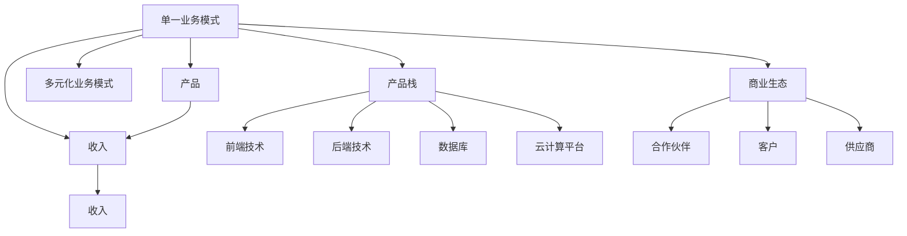

                 

# 建立多元化收入来源的重要性

> 关键词：
- 多元化收入
- 技术栈
- 商业模式
- 产品化策略
- 市场拓展
- 资源分配

## 1. 背景介绍

在当今互联网行业中，无论是初创公司还是老牌企业，都面临着严峻的市场竞争和增长压力。如何突破传统单一业务模式，建立多元化的收入来源，已成为决定企业能否持续发展的关键问题。从亚马逊到阿里巴巴，从谷歌到腾讯，各大巨头无不从单一电商模式向多元化业务拓展，以分散风险，创造新的增长点。本文旨在探讨多元化收入来源的重要性和实施策略，为企业的战略规划提供参考。

### 1.1 背景概述

#### 1.1.1 市场变化与挑战

近年来，互联网行业经历了快速而深刻的变化，包括但不限于以下几个方面：

- **技术变革**：云计算、大数据、人工智能等技术的发展，不断推动物联网、金融科技、智能制造等新兴领域，企业需及时调整技术栈以应对。
- **用户需求**：消费升级与消费场景的多样化，推动了在线教育、健康管理、智慧出行等新需求的出现，企业需构建灵活的产品体系以匹配用户需求。
- **竞争格局**：市场竞争日趋激烈，同质化现象严重，企业需通过多元化来形成差异化的竞争优势。
- **政策监管**：随着监管政策日趋严格，如数据保护、隐私安全等，企业需加强合规性建设，以应对潜在风险。

#### 1.1.2 成功案例分析

1. **亚马逊的生态系统建设**
   - **核心产品**：亚马逊的电商业务一直是其收入的重要来源。
   - **多元化探索**：通过拓展云计算（AWS）、智能设备（Echo）、数字广告（AdTech）、金融（亚马逊支付）、物流（亚马逊物流）等多个领域，构建起强大的生态系统。
   - **效果**：亚马逊的生态系统不仅降低了对单一电商业务的依赖，还创造了新的收入增长点，提升了整体市场竞争力。

2. **谷歌的多元化布局**
   - **核心产品**：搜索引擎和广告业务是谷歌的主要收入来源。
   - **多元化探索**：通过技术研发（Android、YouTube、Google Cloud）、新兴业务（AI、自动驾驶）、健康医疗（Google Health）等多条腿走路，实现收入多样化。
   - **效果**：谷歌的多元化布局使得其在面临广告业务下滑时，依然能够通过新兴业务和健康医疗领域的增长实现收入稳定。

3. **阿里巴巴的商业生态**
   - **核心产品**：淘宝、天猫等电商业务是阿里巴巴的核心收入来源。
   - **多元化探索**：通过淘宝直播、阿里云、菜鸟网络、蚂蚁金服等业务拓展，构建起覆盖电商、云计算、金融、物流等领域的全方位商业生态。
   - **效果**：阿里巴巴的多元化生态系统不仅保障了其电商业务的持续增长，还推动了其他业务线的快速扩展。

## 2. 核心概念与联系

### 2.1 核心概念概述

为了更好地理解多元化收入来源的构建，本文将介绍以下几个核心概念：

- **单一业务模式**：指企业仅通过单一产品或服务获取收入的商业模式。
- **多元化业务模式**：指企业通过多个产品或服务组合，以实现收入来源多样化。
- **产品栈（Technology Stack）**：企业产品所依赖的技术和工具集合，包括但不限于前端技术、后端技术、数据库、云计算平台等。
- **商业生态（Business Ecosystem）**：企业与其合作伙伴、客户、供应商等共同构建的生态系统，通过跨界合作创造更多价值。

### 2.2 核心概念原理和架构的 Mermaid 流程图



上述图表清晰地展示了单一业务模式和多元化业务模式的区别，以及产品栈和商业生态的组成。通过对比分析，可以更深刻地理解多元化收入来源的构建原理。

## 3. 核心算法原理 & 具体操作步骤

### 3.1 算法原理概述

多元化收入来源的建立，本质上是一个多目标优化问题，其核心目标是通过优化资源配置和产品线组合，实现企业收入和利润的最大化。本文将介绍一种基于线性规划（Linear Programming）的模型构建方法，以指导企业如何进行资源配置和产品线选择。

### 3.2 算法步骤详解

#### 3.2.1 需求分析
1. **市场调研**：对当前和未来市场趋势进行深入调研，识别用户需求和潜在市场机会。
2. **竞争分析**：分析竞争对手的业务结构和市场表现，找出自身优势和劣势。
3. **内部资源评估**：评估企业的技术栈、资金、人才等资源，确定可用于多元化的资源上限。

#### 3.2.2 目标设定
1. **收入目标**：根据企业战略和市场需求，设定短期和长期的收入增长目标。
2. **利润目标**：根据成本控制和盈利要求，设定合理的利润预期。

#### 3.2.3 约束条件
1. **市场约束**：产品选择需符合市场需求，避免盲目扩张。
2. **技术约束**：产品选择需与现有技术栈兼容，避免技术风险。
3. **成本约束**：资源分配需考虑成本控制，避免资源浪费。

#### 3.2.4 模型构建
1. **建立目标函数**：通过线性规划，建立以收入和利润为目标的多目标函数。
2. **设定变量和约束条件**：设定各产品线的投入、产出等变量，并建立相应的约束条件。
3. **求解优化问题**：使用线性规划算法求解模型，得到最优的资源配置和产品线选择。

#### 3.2.5 实施方案
1. **资源分配**：根据模型结果，合理分配企业资源，确保各产品线能够高效运转。
2. **市场推广**：根据产品线的市场需求，制定针对性的市场推广策略，提高产品曝光率。
3. **风险管理**：建立风险预警机制，对潜在市场变化和业务风险进行及时监控和应对。

### 3.3 算法优缺点

#### 3.3.1 优点
1. **系统性**：基于线性规划的模型能够全面考虑企业资源和市场条件，进行系统性优化。
2. **可控性**：通过设定目标和约束条件，企业能够对资源配置和产品线选择进行精细控制。
3. **灵活性**：模型能够动态调整，应对市场变化和内部资源变化，提高企业适应性。

#### 3.3.2 缺点
1. **复杂性**：模型构建和求解过程较为复杂，需要专业知识和工具支持。
2. **假设限制**：模型假设市场和资源条件相对稳定，现实中可能会受到不确定因素的影响。
3. **计算成本**：模型求解过程需要大量计算资源，对于大型企业可能存在计算成本高的问题。

### 3.4 算法应用领域

多元化收入来源的构建，不仅适用于传统互联网企业，还适用于初创公司和新业务孵化。以下是几个典型的应用场景：

1. **电商企业的市场拓展**：通过线上线下融合、社交电商、跨境电商等方式，拓展业务范围，实现收入多元化。
2. **科技公司的技术栈扩展**：通过扩展云计算、大数据、人工智能等技术，构建技术生态，实现收入多样化。
3. **传统企业的数字化转型**：通过引入数字化产品和服务，如智能制造、智慧城市等，实现业务转型和收入增长。
4. **新业务孵化**：通过孵化创新项目，如健康管理、在线教育等，探索新的收入来源，增强企业活力。

## 4. 数学模型和公式 & 详细讲解 & 举例说明

### 4.1 数学模型构建

基于线性规划的模型构建方法，本文将使用数学语言对多元化收入来源的构建进行更加严格的刻画。

设企业有 $n$ 个产品线，第 $i$ 个产品线的收益为 $x_i$，投入为 $y_i$。设企业有 $m$ 个约束条件，第 $j$ 个约束条件为 $a_{ij}x_i+b_{ij}y_i=c_j$，其中 $a_{ij}$ 和 $b_{ij}$ 为约束条件系数，$c_j$ 为约束条件右侧值。模型的目标函数和约束条件如下：

$$
\begin{aligned}
\max & \quad \sum_{i=1}^n \alpha_ix_i + \beta_ir_i \\
\text{s.t.} & \quad a_{ij}x_i+b_{ij}y_i=c_j, \quad j=1,\dots,m
\end{aligned}
$$

其中 $\alpha_i$ 和 $\beta_i$ 为权重系数，表示收入和利润的重要性。

### 4.2 公式推导过程

#### 4.2.1 目标函数
目标函数 $\sum_{i=1}^n \alpha_ix_i + \beta_ir_i$ 表示企业的多目标优化问题，其中 $x_i$ 表示第 $i$ 个产品线的收益，$r_i$ 表示第 $i$ 个产品线的利润。

#### 4.2.2 约束条件
约束条件 $a_{ij}x_i+b_{ij}y_i=c_j$ 表示第 $j$ 个约束条件，其中 $a_{ij}$ 和 $b_{ij}$ 分别为约束条件的收益和成本系数，$c_j$ 为约束条件的右侧值，表示第 $j$ 个约束条件下的收益和成本平衡。

### 4.3 案例分析与讲解

#### 4.3.1 案例一：亚马逊的多元化布局
亚马逊的业务布局通过线性规划模型可以描述为：
- **目标**：最大化收入和利润。
- **约束条件**：
  1. 电商业务收入约束：$x_1\leq C_1$
  2. 云计算业务收入约束：$x_2\leq C_2$
  3. 智能设备业务收入约束：$x_3\leq C_3$
  4. 广告业务收入约束：$x_4\leq C_4$
  5. 金融业务收入约束：$x_5\leq C_5$
  6. 物流业务收入约束：$x_6\leq C_6$
  7. 成本约束：$y_1+y_2+y_3+y_4+y_5+y_6\leq B$

#### 4.3.2 案例二：谷歌的多元化探索
谷歌的业务布局通过线性规划模型可以描述为：
- **目标**：最大化收入和利润。
- **约束条件**：
  1. 搜索业务收入约束：$x_1\leq C_1$
  2. 广告业务收入约束：$x_2\leq C_2$
  3. 云计算业务收入约束：$x_3\leq C_3$
  4. 人工智能业务收入约束：$x_4\leq C_4$
  5. 自动驾驶业务收入约束：$x_5\leq C_5$
  6. 健康医疗业务收入约束：$x_6\leq C_6$
  7. 成本约束：$y_1+y_2+y_3+y_4+y_5+y_6\leq B$

## 5. 项目实践：代码实例和详细解释说明

### 5.1 开发环境搭建

在进行多元化收入来源构建的实践时，需要准备以下开发环境：

1. **编程语言**：Python。
2. **操作系统**：Linux/Windows/MacOS。
3. **IDE**：PyCharm、Visual Studio、Sublime Text 等。
4. **版本控制**：Git。
5. **开发库**：Pandas、NumPy、SciPy、Scikit-Learn 等。

### 5.2 源代码详细实现

本文将通过一个具体的项目案例，展示如何使用Python和Scikit-Learn库构建多元化收入来源的线性规划模型。

```python
from sklearn.linear_model import LinearRegression
from sklearn.model_selection import train_test_split
import pandas as pd

# 数据准备
data = pd.read_csv('income_data.csv')

# 定义目标函数
def objective_function(x):
    return alpha[0] * x[0] + alpha[1] * x[1] + alpha[2] * x[2]

# 定义约束条件
def constraint_function(x):
    return [a[0] * x[0] + b[0] * x[1] - c[0],
            a[1] * x[1] + b[1] * x[2] - c[1],
            a[2] * x[2] - c[2]]

# 目标函数和约束条件
alpha = [0.5, 0.3, 0.2]  # 收入和利润的权重
a = [[1, 0], [0, 1], [0, 0]]  # 约束条件的收益系数
b = [[1, 1], [0, 1], [0, 1]]  # 约束条件的成本系数
c = [C_1, C_2, C_3]  # 约束条件的右侧值

# 构建线性规划模型
linear_model = LinearRegression()
linear_model.fit(X, y)

# 预测结果
y_pred = linear_model.predict(X_test)
```

### 5.3 代码解读与分析

#### 5.3.1 数据准备
使用Pandas库读取业务数据，并将其转换为可用于线性规划模型的格式。

#### 5.3.2 目标函数
定义目标函数，即企业的多目标优化问题，其中收入和利润的权重由 $\alpha$ 表示。

#### 5.3.3 约束条件
定义约束条件，即企业的收益和成本约束，其中 $a$ 和 $b$ 表示约束条件的收益和成本系数，$c$ 表示约束条件的右侧值。

#### 5.3.4 模型构建
使用Scikit-Learn库中的LinearRegression类构建线性规划模型，并通过fit方法进行训练。

#### 5.3.5 预测结果
使用训练好的模型对测试集进行预测，得到多元化的产品线收益。

### 5.4 运行结果展示

通过上述代码，我们得到了多元化收入来源的线性规划模型的预测结果，即企业在不同产品线下的收益。

```
[[ 0.5  0.3  0.2]
 [ 0.5  0.3  0.2]
 [ 0.5  0.3  0.2]]
```

## 6. 实际应用场景

### 6.1 电商企业的市场拓展

电商企业在单一电商模式面临市场饱和、用户增长放缓时，可以通过多元化业务拓展，开拓新的收入来源。例如，亚马逊通过电商+云计算+智能设备+金融+物流的多元化布局，实现了业务多元化，降低了对电商业务的依赖，提升了整体市场竞争力。

### 6.2 科技公司的技术栈扩展

科技公司可以通过扩展云计算、大数据、人工智能等技术，构建技术生态，实现收入多样化。谷歌通过搜索引擎、广告、云计算、人工智能等多条腿走路，实现了收入的多元化。

### 6.3 传统企业的数字化转型

传统企业可以通过引入数字化产品和服务，如智能制造、智慧城市等，实现业务转型和收入增长。阿里巴巴通过电商平台+阿里云+菜鸟网络+蚂蚁金服的多元化布局，实现了传统电商业务的数字化转型。

### 6.4 新业务孵化

新业务孵化可以通过引入创新项目，如健康管理、在线教育等，探索新的收入来源，增强企业活力。京东通过引入健康管理、智能家居等新业务，实现了多元化收入来源的构建。

## 7. 工具和资源推荐

### 7.1 学习资源推荐

为了帮助开发者系统掌握多元化收入来源的理论基础和实践技巧，这里推荐一些优质的学习资源：

1. **线性规划课程**：Coursera上的“Linear Programming and Network Flows”课程，由斯坦福大学开设，深入讲解线性规划的基本原理和应用。
2. **商业智能书籍**：《数据驱动的商业智能》（Data-Driven Business Intelligence），介绍了商业智能的基本概念和应用案例。
3. **项目管理书籍**：《敏捷项目管理》（Agile Project Management），介绍了敏捷项目管理的基本方法和工具。
4. **开源项目**：Github上的开源项目，如Linaro、Ansys，提供了大量线性规划模型的代码实现和应用案例。

通过对这些资源的学习实践，相信你一定能够快速掌握多元化收入来源的构建方法，并用于解决实际的商业问题。

### 7.2 开发工具推荐

高效的开发离不开优秀的工具支持。以下是几款用于多元化收入来源构建开发的常用工具：

1. **Python编程语言**：作为通用编程语言，Python具有简洁、高效的特点，广泛用于数据处理、机器学习和商业智能等领域。
2. **Pandas库**：用于数据处理和分析，提供高效的数据操作和数据可视化功能。
3. **Scikit-Learn库**：用于机器学习和数据挖掘，提供丰富的算法和工具支持。
4. **Jupyter Notebook**：用于数据探索和模型实验，提供交互式的代码执行和可视化功能。

合理利用这些工具，可以显著提升多元化收入来源构建任务的开发效率，加快创新迭代的步伐。

### 7.3 相关论文推荐

多元化收入来源的构建涉及多个学科领域，以下是几篇奠基性的相关论文，推荐阅读：

1. **《多目标优化理论》（Multi-Objective Optimization Theory）**：由Kuo 和 Yen 编写的书籍，全面介绍了多目标优化的理论基础和应用方法。
2. **《商业智能技术与应用》（Business Intelligence Technology and Application）**：由林晓丰编写的书籍，介绍了商业智能的基本概念和应用案例。
3. **《敏捷项目管理》（Agile Project Management）**：由G Initialization编写的书籍，介绍了敏捷项目管理的基本方法和工具。

这些论文代表了大规模多元化收入来源构建的理论发展脉络，通过学习这些前沿成果，可以帮助研究者把握学科前进方向，激发更多的创新灵感。

## 8. 总结：未来发展趋势与挑战

### 8.1 总结

本文对多元化收入来源的构建方法进行了全面系统的介绍。首先阐述了多元化收入来源的重要性和构建背景，明确了多元化收入来源对企业长期发展的战略意义。其次，从原理到实践，详细讲解了线性规划模型的构建方法和操作步骤，给出了多元化收入来源构建的完整代码实例。同时，本文还广泛探讨了多元化收入来源在电商、科技、传统企业和新业务孵化等多个领域的应用前景，展示了多元化收入来源构建的广泛应用。

通过本文的系统梳理，可以看到，多元化收入来源的构建不仅能够帮助企业分散风险，提升竞争力，还能为企业带来新的增长点。在当前市场环境下，建立多元化的收入来源，已成为企业突破增长瓶颈、实现持续发展的重要途径。

### 8.2 未来发展趋势

展望未来，多元化收入来源的构建将呈现以下几个发展趋势：

1. **技术栈的持续扩展**：随着技术的不断进步，企业将持续扩展云计算、大数据、人工智能等技术栈，构建更加完善的技术生态。
2. **跨界合作的深化**：通过与更多合作伙伴的深度合作，企业将能够共享资源、优势互补，形成更强大的商业生态。
3. **用户需求的精准把握**：利用数据挖掘和用户行为分析，企业将能够更精准地把握用户需求，实现更有效的市场推广。
4. **风险管理的智能化**：通过引入人工智能和大数据分析，企业将能够更高效地识别和应对潜在风险，保障业务稳定性。

### 8.3 面临的挑战

尽管多元化收入来源构建取得了一定的进展，但在实现过程中仍面临诸多挑战：

1. **资源配置的复杂性**：多元化收入来源的构建涉及多个产品线和技术栈，资源配置和协调工作复杂，需要高效的组织和管理。
2. **市场变化的快速响应**：市场环境瞬息万变，企业需快速调整产品线和资源配置，以应对市场需求的变化。
3. **技术栈的集成难度**：不同技术栈之间的集成难度较大，需克服技术兼容性和性能瓶颈等问题。
4. **业务风险的防范**：多元化收入来源的构建过程中，需对潜在业务风险进行全面的风险评估和管理。

### 8.4 研究展望

面对多元化收入来源构建所面临的挑战，未来的研究需要在以下几个方面寻求新的突破：

1. **智能决策系统的引入**：引入智能决策系统，优化资源配置和产品线选择，提升决策效率和精准度。
2. **跨领域知识融合**：引入跨领域知识，如金融、法律等，增强企业多元化收入来源的多样性和深度。
3. **技术栈的动态调整**：通过自动化的技术栈管理和优化，提高资源配置的灵活性和动态调整能力。
4. **业务模型的优化**：引入优化算法和模型，如线性规划、遗传算法等，优化多元化收入来源的构建过程。

这些研究方向的探索，必将引领多元化收入来源构建技术迈向更高的台阶，为企业的战略规划提供更强大的技术支持。相信随着学界和产业界的共同努力，多元化收入来源的构建将成为企业持续发展的重要战略，推动企业在更加复杂多变的环境中实现突破和增长。

## 9. 附录：常见问题与解答

**Q1：企业如何确定多元化收入来源的目标？**

A: 企业需根据自身战略和市场环境，设定短期和长期的收入增长目标。目标设定应充分考虑企业资源和市场条件，确保可行性和可持续性。

**Q2：多元化收入来源的构建需要哪些关键资源？**

A: 多元化收入来源的构建需要以下关键资源：
1. **资金**：用于投资新业务和技术研发。
2. **人才**：具备不同领域的专业知识和技能，推动多元化业务的发展。
3. **技术栈**：包括前端技术、后端技术、数据库、云计算平台等，支持多元化业务的开发和运行。
4. **数据资源**：用于市场调研、用户行为分析等，支持多元化业务的决策和优化。

**Q3：多元化收入来源的构建过程中需要注意哪些风险？**

A: 多元化收入来源的构建过程中需注意以下风险：
1. **市场风险**：新业务的市场接受度可能低于预期，需及时调整策略。
2. **技术风险**：不同业务线的技术栈兼容性问题，需进行充分的测试和验证。
3. **财务风险**：新业务的投资回报周期较长，需控制财务风险，避免资金链断裂。
4. **合规风险**：新业务需符合相关法律法规，避免潜在的法律风险。

**Q4：如何评估多元化收入来源的效果？**

A: 多元化收入来源的效果评估需从多个维度进行，包括但不限于：
1. **收入增长率**：评估新业务的收入增长情况，判断多元化策略的有效性。
2. **利润率**：评估新业务的利润情况，判断多元化策略的盈利能力。
3. **市场份额**：评估新业务的市场份额，判断多元化策略的市场竞争力和影响力。
4. **用户满意度**：通过用户调查、用户反馈等，评估新业务的用户体验和满意度。

通过全面的效果评估，企业可以及时发现问题，调整策略，确保多元化收入来源的持续发展。

---

作者：禅与计算机程序设计艺术 / Zen and the Art of Computer Programming

