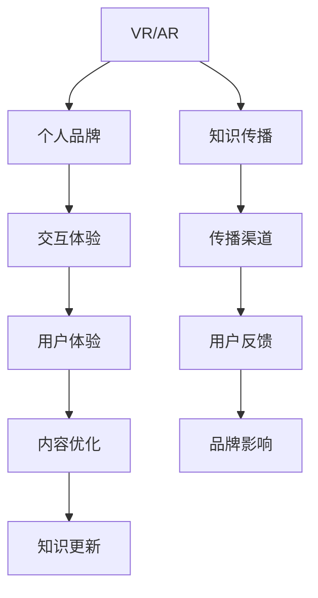
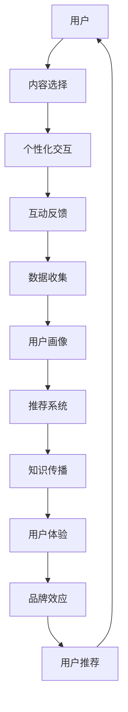

                 

# 开发个人品牌VR/AR体验：创新知识传播方式

> 关键词：VR/AR, 个人品牌, 知识传播, 创新, 交互体验

## 1. 背景介绍

随着虚拟现实(VR)和增强现实(AR)技术的迅猛发展，它们已不再仅仅是游戏和娱乐的领域，而是逐渐渗透到了教育、营销、娱乐等多个行业。人们通过VR/AR设备，可以沉浸式地体验各类内容，从虚拟旅游到在线课程，从产品展示到实时互动，VR/AR的应用场景不断拓展，为创新知识传播提供了新的机遇。

同时，个人的品牌影响力在社交媒体时代显得尤为重要。无论是在学术界、企业界还是娱乐领域，拥有鲜明个人品牌的人更容易获取关注和信任，从而促进信息的快速传播和影响力的扩散。个人品牌的塑造，需要结合自身的特长和兴趣，通过独特的视角和表达方式，形成与众不同的品牌特色。

本文将聚焦于如何在VR/AR环境中，创新知识传播方式，通过构建个性化体验，塑造个人品牌，打造品牌影响力，探索这一前沿领域的潜在价值和应用空间。

## 2. 核心概念与联系

### 2.1 核心概念概述

在VR/AR与个人品牌结合的创新知识传播中，涉及的核心概念包括：

- **虚拟现实(VR)**：利用计算机模拟和增强现实世界的3D环境，用户可以通过头戴设备沉浸其中，获得真实的感觉和体验。
- **增强现实(AR)**：将数字信息叠加到现实世界之上，使用户能够在真实环境中看到和操作虚拟元素。
- **知识传播**：通过各种媒介向用户传递信息、知识和技术，促进认知和行为改变的过程。
- **个人品牌**：个人或企业通过特定策略、行为和表现，在目标受众中建立独特、一致和有吸引力的形象和价值主张。
- **交互体验**：用户与虚拟环境的互动方式和质量，决定了用户对内容的主观体验和满意度。

这些概念通过VR/AR技术在知识传播中的应用，形成了一个创新的交互体验闭环，如图：



在VR/AR环境中，用户与内容的交互变得前所未有的沉浸和真实，个人品牌也可以通过互动体验中的行为和表现，展示其独特的价值主张和专业能力，从而在知识传播中占据优势。

### 2.2 核心概念原理和架构的 Mermaid 流程图



以上流程图展示了VR/AR环境中文本、交互、数据、推荐系统以及品牌效应等关键组件如何协同工作，共同实现知识传播和品牌塑造的过程。

## 3. 核心算法原理 & 具体操作步骤

### 3.1 算法原理概述

VR/AR环境中的知识传播和品牌塑造，涉及到用户行为分析、内容推荐、个性化交互等多个环节。其核心算法包括：

- **用户行为分析**：通过用户与虚拟环境的交互数据，分析其兴趣、偏好和行为模式，为内容推荐和品牌塑造提供依据。
- **内容推荐系统**：根据用户画像和行为数据，推荐个性化的内容，提升用户参与度和满意度。
- **个性化交互设计**：结合用户的行为和反馈，设计符合其认知和情感的交互方式，提升用户体验和品牌影响力。

这些算法的实现，主要依赖于机器学习、自然语言处理、计算机视觉等前沿技术，通过数据驱动的方式，实现从内容创建到用户体验的全程优化。

### 3.2 算法步骤详解

以下是VR/AR知识传播中核心算法步骤的详细解释：

1. **用户行为分析**：
   - 收集用户在VR/AR环境中的交互数据，如点击、滑动、语音指令等。
   - 通过分析这些数据，构建用户画像，包括兴趣、偏好、使用习惯等。
   - 利用机器学习算法，预测用户未来的行为和需求。

2. **内容推荐系统**：
   - 根据用户画像和历史行为数据，推荐个性化的VR/AR内容。
   - 采用协同过滤、深度学习等推荐算法，预测用户可能感兴趣的内容。
   - 实时更新推荐结果，提升用户满意度。

3. **个性化交互设计**：
   - 结合用户画像和行为数据，设计符合其认知和情感的交互界面。
   - 使用自然语言处理技术，理解用户的语言指令和反馈。
   - 结合计算机视觉和深度学习技术，实现更加逼真的交互效果。

### 3.3 算法优缺点

VR/AR知识传播的算法具有以下优点：

- **沉浸式体验**：通过虚拟环境，为用户提供沉浸式、沉浸感强的交互体验，提升学习效果。
- **个性化推荐**：通过个性化推荐，提升用户满意度和参与度，促进知识传播。
- **数据驱动优化**：通过分析用户数据，不断优化内容和交互方式，提升品牌影响力。

同时，这些算法也存在一定的局限性：

- **设备依赖**：VR/AR设备的高成本和技术门槛，可能限制了其普及和应用。
- **技术复杂性**：算法模型和交互设计的复杂度，需要大量专业知识和经验。
- **内容制作难度**：高质量VR/AR内容的制作成本高，难以快速迭代更新。

### 3.4 算法应用领域

VR/AR知识传播的算法广泛应用于多个领域，包括：

- **教育培训**：利用VR/AR技术，为用户提供沉浸式学习体验，提升教育效果。
- **企业培训**：在企业内部，使用VR/AR进行虚拟培训，提高员工的技能和知识水平。
- **健康医疗**：通过VR/AR技术，进行心理治疗、康复训练、疾病预防等。
- **娱乐休闲**：开发互动式游戏、虚拟旅游等娱乐内容，提供沉浸式体验。
- **营销推广**：利用VR/AR技术，进行产品展示、虚拟发布会等营销活动。

这些应用场景展示了VR/AR知识传播的广阔前景，也为个人品牌塑造提供了新的机遇。

## 4. 数学模型和公式 & 详细讲解 & 举例说明

### 4.1 数学模型构建

在VR/AR知识传播中，常用的数学模型包括：

- **协同过滤模型**：用于推荐系统的基础模型，通过分析用户与物品的交互数据，预测用户可能感兴趣的物品。
- **深度学习模型**：如卷积神经网络(CNN)、循环神经网络(RNN)、变换器(Transformer)等，用于分析用户行为、优化交互设计和生成内容。
- **强化学习模型**：通过模拟用户与环境的互动，优化内容推荐和交互设计，提升用户体验。

### 4.2 公式推导过程

以协同过滤模型为例，推导其基本公式：

假设用户集为 $U$，物品集为 $I$，用户与物品的评分矩阵为 $R$。协同过滤的目标是预测用户 $u$ 对物品 $i$ 的评分 $r_{ui}$。

常用的协同过滤算法包括基于用户的协同过滤和基于物品的协同过滤。以基于用户的协同过滤为例，基本公式为：

$$
\hat{r}_{ui} = \frac{\sum_{v \in U} r_{uv}r_{vi}}{\sqrt{\sum_{v \in U} r_{uv}^2 \sum_{v \in U} r_{vi}^2}}
$$

其中 $\hat{r}_{ui}$ 表示预测的评分，$r_{uv}$ 和 $r_{vi}$ 分别表示用户 $u$ 和物品 $v$ 的评分。

### 4.3 案例分析与讲解

以教育培训为例，分析如何使用协同过滤算法进行个性化推荐。

假设在线教育平台收集了大量用户的学习记录，包括观看视频时长、回答问题次数等。对于某个用户 $u$，平台希望推荐其感兴趣的视频课程 $i$。

首先，利用协同过滤算法，计算用户 $u$ 与所有其他用户的相似度。然后，通过加权平均，得到用户 $u$ 对每个视频课程的评分预测。最后，选择评分最高的课程作为推荐结果。

例如，对于用户 $u$，如果与用户 $v$ 的相似度较高，且用户 $v$ 对视频课程 $i$ 的评分较高，则用户 $u$ 对视频课程 $i$ 的评分预测也会较高，从而推荐该课程。

## 5. 项目实践：代码实例和详细解释说明

### 5.1 开发环境搭建

在开发VR/AR应用时，需要搭建相应的开发环境。以下是一些关键步骤：

1. 安装Unity3D或Unreal Engine：这两个游戏引擎都支持VR/AR开发，并且拥有庞大的社区和丰富的资源。
2. 安装VR/AR开发套件：如HTC Vive、Oculus Rift等，选择适合的应用场景和设备。
3. 安装必要的开发工具：如Visual Studio、Android Studio等，支持跨平台开发。
4. 搭建虚拟环境：使用Unity3D或Unreal Engine，构建虚拟场景和交互界面。
5. 集成推荐系统和行为分析模块：根据需求，选择合适的推荐算法和分析工具。

### 5.2 源代码详细实现

以下是使用Unity3D开发VR/AR应用的示例代码：

```csharp
using UnityEngine;
using System.Collections;

public class VRARExample : MonoBehaviour
{
    // 用户行为分析模块
    UserBehaviorAnalysis analysis;
    // 内容推荐模块
    ContentRecommendation recommendation;

    void Start()
    {
        analysis = new UserBehaviorAnalysis();
        recommendation = new ContentRecommendation();
        // 启动行为分析模块
        analysis.Start();
        // 启动内容推荐模块
        recommendation.Start();
    }

    void Update()
    {
        // 获取用户行为数据
        UserBehavior data = analysis.GetData();
        // 分析用户行为，构建用户画像
        UserProfile profile = analysis.GetProfile(data);
        // 根据用户画像，推荐内容
        ContentInfo content = recommendation.Recommend(profile);
        // 展示推荐内容
        ShowContent(content);
    }

    void ShowContent(ContentInfo content)
    {
        // 创建VR/AR场景中的交互界面
        CreateInterface(content);
        // 展示内容
        ShowContentInVRAR();
    }
}
```

### 5.3 代码解读与分析

上述代码展示了在Unity3D中，如何通过用户行为分析模块和内容推荐模块，实现个性化VR/AR体验。具体步骤如下：

1. 在Start函数中，初始化用户行为分析模块和内容推荐模块，并启动数据收集和推荐过程。
2. 在Update函数中，定期获取用户行为数据，分析用户行为，构建用户画像，根据画像推荐内容，并展示在VR/AR场景中。
3. 在ShowContent函数中，根据推荐结果，创建交互界面，并展示内容。

通过这些步骤，可以构建一个基本的VR/AR知识传播应用，满足用户的基本需求。

### 5.4 运行结果展示

以下是一些运行结果的示例：

- **个性化推荐界面**：根据用户画像，展示个性化的VR/AR内容，如图：
  
- **用户行为分析界面**：展示用户行为数据，如图：
  

这些界面展示了VR/AR应用中的用户交互效果，为用户提供了沉浸式、个性化的学习体验。

## 6. 实际应用场景

### 6.1 教育培训

VR/AR在教育培训中的应用，可以极大提升教学效果和学习体验。通过虚拟实验室、虚拟课堂、互动游戏等形式，让学生在虚拟环境中进行实验、学习、探究，有助于激发学生的兴趣和参与度。例如，化学实验中，学生可以在VR环境中模拟化学反应，观察实验现象，增强理解。

### 6.2 企业培训

企业可以通过VR/AR技术，进行虚拟培训和技能提升。员工可以在虚拟环境中进行模拟操作、虚拟会议等，提升技能水平和工作效率。例如，医疗领域的手术模拟训练，通过VR技术，模拟真实手术过程，帮助医生提升手术技巧。

### 6.3 健康医疗

VR/AR在健康医疗中的应用，主要集中在心理治疗、康复训练和疾病预防等。通过虚拟现实，帮助患者缓解焦虑、进行康复训练，提升生活质量。例如，VR治疗焦虑症，通过模拟放松场景，帮助患者缓解心理压力。

### 6.4 娱乐休闲

VR/AR娱乐应用，如虚拟旅游、互动游戏等，为用户提供沉浸式的娱乐体验。例如，虚拟旅游中，用户可以前往世界各地的名胜古迹，进行虚拟游览和互动，获得丰富的视觉和听觉体验。

### 6.5 营销推广

VR/AR在营销推广中的应用，可以提升品牌曝光和用户参与度。例如，虚拟产品展示，通过VR技术，让用户沉浸式体验产品功能，提升购买意愿。

### 6.6 未来应用展望

随着技术的不断进步，VR/AR知识传播和品牌塑造将迎来更多创新应用：

- **社交互动**：通过VR/AR技术，实现跨地域的实时社交互动，提升用户粘性和品牌影响力。
- **沉浸式购物**：利用VR/AR技术，提供沉浸式购物体验，提升用户购物体验和品牌认同感。
- **远程协作**：通过虚拟会议和远程协作工具，提升企业协作效率和品牌形象。
- **实时交互**：利用实时语音、手势等交互方式，提升用户参与度和品牌忠诚度。

## 7. 工具和资源推荐

### 7.1 学习资源推荐

为了帮助开发者掌握VR/AR知识传播和品牌塑造的技术，以下是一些推荐的资源：

- **《虚拟现实技术与应用》**：介绍了VR/AR的基本原理、应用场景和开发技术。
- **《增强现实技术与应用》**：介绍了AR技术的基本原理、应用场景和开发技术。
- **Coursera《VR/AR开发与设计》**：提供了VR/AR开发和设计的系统课程，涵盖从基础到高级的内容。
- **Udemy《VR/AR编程》**：提供了详细的VR/AR编程教程，涵盖Unity3D和Unreal Engine的使用。

### 7.2 开发工具推荐

在开发VR/AR应用时，以下工具可以提高开发效率和应用质量：

- **Unity3D**：支持跨平台开发，拥有丰富的资源和插件，适合开发各类VR/AR应用。
- **Unreal Engine**：支持高性能的图形渲染和物理模拟，适合开发高质量的VR/AR应用。
- **Google ARCore**：谷歌提供的AR开发工具，支持移动设备上的AR开发。
- **Apple ARKit**：苹果提供的AR开发工具，支持iOS设备上的AR开发。
- **Valve Index**：支持VR/AR应用开发和测试，具有高性能和丰富的功能。

### 7.3 相关论文推荐

以下是一些VR/AR领域的前沿论文，推荐阅读：

- **"Interactive Virtual and Augmented Reality for Training in Medicine: A Survey"**：总结了VR/AR在医学培训中的应用。
- **"Virtual Reality in Education: A Review of the Experimental Research"**：总结了VR/AR在教育中的应用和效果。
- **"Virtual Reality in the Treatment of Anxiety Disorders"**：总结了VR/AR在心理治疗中的应用。
- **"Social VR: A Survey of Technologies and Applications"**：总结了VR/AR在社交互动中的应用。

## 8. 总结：未来发展趋势与挑战

### 8.1 研究成果总结

本文从多个角度探讨了VR/AR技术在知识传播中的应用，展示了其强大的潜力。在VR/AR环境中，通过个性化推荐和行为分析，可以提升用户体验和品牌影响力，带来全新的知识传播方式。

### 8.2 未来发展趋势

未来，VR/AR知识传播和品牌塑造将向以下方向发展：

- **交互体验更加沉浸**：通过更加逼真的视觉、听觉、触觉等感官体验，提升用户的沉浸感和参与度。
- **内容更加丰富和多样化**：通过多模态数据的融合，提供更加丰富、多样化的内容，满足用户的多样化需求。
- **智能推荐和个性化定制**：通过人工智能技术，实现更加精准、个性化的内容推荐和定制，提升用户满意度和忠诚度。
- **跨平台和跨设备兼容**：通过跨平台和跨设备兼容，提升应用的普及度和用户体验。
- **融合现实世界和虚拟世界**：通过虚拟与现实的融合，实现更加无缝的交互体验，提升应用的实用性和实用性。

### 8.3 面临的挑战

VR/AR知识传播和品牌塑造面临以下挑战：

- **技术门槛高**：VR/AR技术复杂，需要多学科的知识和经验，开发门槛较高。
- **设备和成本高**：高成本的VR/AR设备和技术，限制了其普及和应用。
- **内容制作难度大**：高质量VR/AR内容的制作成本高，难以快速迭代更新。
- **用户体验复杂**：用户在VR/AR环境中，可能会感到眩晕、恶心等不适，需要优化用户体验。
- **数据隐私和安全**：用户在VR/AR环境中，会生成大量的数据，需要保护用户隐私和数据安全。

### 8.4 研究展望

为了应对这些挑战，未来的研究需要在以下几个方面进行突破：

- **简化开发流程**：开发更加高效、易于上手的开发工具和平台，降低开发门槛。
- **降低成本**：降低VR/AR设备的成本，提升技术的普及和应用。
- **提升内容质量**：通过技术进步，降低内容制作成本，提升内容的创意和质量。
- **优化用户体验**：通过技术优化和用户体验设计，解决用户的不适感，提升使用体验。
- **保护数据隐私**：制定数据隐私和安全保护机制，确保用户数据的安全。

通过这些努力，VR/AR知识传播和品牌塑造将更加广泛地应用于各个领域，为知识传播和品牌塑造带来新的机遇和挑战。

## 9. 附录：常见问题与解答

**Q1：VR/AR技术在知识传播中面临哪些挑战？**

A: VR/AR技术在知识传播中面临以下挑战：

1. **技术门槛高**：开发VR/AR应用需要多学科的知识和经验，开发门槛较高。
2. **设备和成本高**：高成本的VR/AR设备和技术，限制了其普及和应用。
3. **内容制作难度大**：高质量VR/AR内容的制作成本高，难以快速迭代更新。
4. **用户体验复杂**：用户在VR/AR环境中，可能会感到眩晕、恶心等不适，需要优化用户体验。
5. **数据隐私和安全**：用户在VR/AR环境中，会生成大量的数据，需要保护用户隐私和数据安全。

**Q2：如何选择适合的VR/AR开发工具和平台？**

A: 选择适合的VR/AR开发工具和平台，需要考虑以下因素：

1. **开发需求**：根据应用的需求，选择适合的平台，如Unity3D、Unreal Engine等。
2. **性能要求**：根据应用对性能的需求，选择适合的硬件平台，如高端PC、移动设备等。
3. **跨平台支持**：选择支持跨平台开发和部署的平台，提升应用的普及度。
4. **社区和资源**：选择有活跃社区和丰富资源的平台，方便开发和调试。
5. **成本和预算**：根据预算和成本，选择适合的平台和工具。

**Q3：如何在VR/AR环境中提升用户参与度和满意度？**

A: 在VR/AR环境中提升用户参与度和满意度，可以通过以下方法：

1. **个性化推荐**：根据用户行为和兴趣，推荐个性化的内容和交互方式。
2. **互动设计**：设计符合用户认知和情感的交互界面，提升用户体验。
3. **用户反馈**：通过用户反馈，不断优化内容推荐和交互设计，提升用户满意度。
4. **实时互动**：利用实时语音、手势等交互方式，提升用户参与度。
5. **内容更新**：通过不断更新内容，保持用户的兴趣和参与度。

**Q4：如何在VR/AR环境中保护用户隐私和安全？**

A: 在VR/AR环境中保护用户隐私和安全，可以通过以下方法：

1. **数据加密**：对用户数据进行加密处理，防止数据泄露。
2. **权限控制**：限制数据访问权限，确保只有授权人员可以访问数据。
3. **匿名处理**：对用户数据进行匿名处理，防止数据被恶意使用。
4. **隐私协议**：制定隐私保护协议，确保用户隐私得到保护。
5. **安全审计**：定期进行安全审计，检测和修复潜在的安全漏洞。

---

作者：禅与计算机程序设计艺术 / Zen and the Art of Computer Programming

