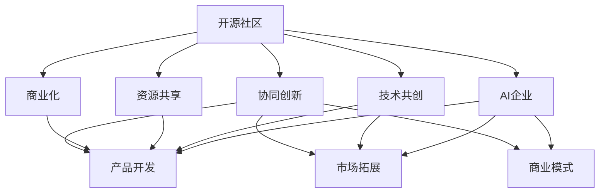

                 

# 开源社区与AI企业的互动:共创、共享和共赢

## 1. 背景介绍

### 1.1 问题由来
随着人工智能(AI)技术的不断进步，开源社区在AI领域的地位日益凸显。从深度学习、计算机视觉、自然语言处理(NLP)到机器学习、大数据等领域，开源项目已经成为了推动AI技术发展的核心力量。然而，AI企业的成长同样重要，它们不仅需要借助开源技术的力量，同时也需要在商业化的道路上不断探索和创新。

这种趋势下，开源社区与AI企业的互动变得越来越频繁，两者之间的合作模式也在不断演变。这种互动不仅帮助开源项目得到更广泛的应用，同时也加速了AI企业的技术创新和商业化进程。

### 1.2 问题核心关键点
在开源社区与AI企业的互动中，以下几个核心关键点尤为值得关注：

- **共创**：开源社区和AI企业共同开发和完善技术，实现技术的迭代升级。
- **共享**：开源社区和AI企业共享资源和知识，推动技术的普及和应用。
- **共赢**：开源社区和AI企业通过合作，实现技术、资源、市场等多方面的共赢。

这种互动不仅提升了技术的发展速度和应用效果，也使得AI企业的商业化过程更加顺利，推动了AI技术的产业化进程。

## 2. 核心概念与联系

### 2.1 核心概念概述

为更好地理解开源社区与AI企业的互动过程，本节将介绍几个密切相关的核心概念：

- **开源社区**：由志同道合的技术爱好者组成的群体，通过开源软件的方式共享技术资源和研究成果，推动技术进步和应用普及。
- **AI企业**：专注于人工智能技术开发和商业化的企业，通过产品和服务的形式，将AI技术应用于各行各业。
- **技术共创**：开源社区与AI企业共同参与技术的开发和完善过程。
- **资源共享**：开源社区和AI企业共享技术文档、代码库、研究成果等，促进技术的传播和应用。
- **商业化**：AI企业将开源技术商业化，应用于实际产品和项目中，推动技术的市场化应用。
- **协同创新**：开源社区和AI企业通过合作，实现技术、市场、商业模式的创新。

这些概念之间的关系可以通过以下Mermaid流程图来展示：



这个流程图展示了他者之间的核心概念及其相互关系：

1. 开源社区与AI企业共同参与技术共创。
2. 共享资源和知识，实现技术扩散。
3. 将技术应用于实际产品中，推动商业化。
4. 通过合作，实现技术、市场、商业模式的创新。

这些概念共同构成了开源社区与AI企业互动的框架，使得两者能够有效协同，共同推进AI技术的发展和应用。

## 3. 核心算法原理 & 具体操作步骤
### 3.1 算法原理概述

开源社区与AI企业的互动，本质上是一种跨组织的技术共创和资源共享过程。其核心思想是：将开源社区的技术优势与AI企业的商业化能力结合起来，实现技术的共同发展和市场应用的协同推进。

具体来说，开源社区提供算法、模型、代码等技术资源，AI企业则提供商业化平台、市场需求、资金支持等资源。通过这种合作模式，开源社区能够获得更多的应用场景和反馈信息，加速技术迭代；AI企业则能够在技术成熟的基础上快速推出产品，缩短商业化周期。

### 3.2 算法步骤详解

基于开源社区与AI企业的互动，通常包括以下几个关键步骤：

**Step 1: 技术共创与合作**
- 开源社区与AI企业选择合适的技术项目，成立联合团队，共同参与技术开发。
- 确定技术目标和需求，制定详细的开发计划和时间表。
- 定期举行联合会议，分享进展，解决技术难题。

**Step 2: 资源共享与整合**
- 开源社区和AI企业共享技术文档、代码库、研究成果等，建立知识共享平台。
- 开源社区提供技术框架和工具，AI企业提供数据集和应用场景。
- 共同优化算法模型，进行测试和验证。

**Step 3: 产品开发与推广**
- AI企业将共同开发的技术应用于实际产品中，设计产品原型和功能需求。
- 开源社区提供技术支持和改进建议，参与产品测试和优化。
- 产品上线后，开源社区和AI企业共同推广，提升用户认知和市场影响力。

**Step 4: 市场反馈与迭代**
- 收集用户反馈和市场数据，分析产品性能和用户体验。
- 开源社区与AI企业共同改进技术，实现产品迭代升级。
- 循环上述步骤，实现技术、产品和市场的持续优化。

### 3.3 算法优缺点

开源社区与AI企业的互动具有以下优点：

1. 加速技术迭代。开源社区和AI企业共同参与技术开发，能够更快地解决技术难题，实现技术迭代升级。
2. 提升市场应用效果。AI企业的商业化能力和开源社区的技术优势相结合，能够推出更符合市场需求的产品，提升用户体验。
3. 促进资源共享。共享资源和知识，有助于技术快速传播和应用，减少资源浪费。
4. 推动商业模式创新。通过合作，探索新的商业模式，推动AI技术的市场化和产业化。

同时，这种互动也存在一些局限性：

1. 沟通协调成本高。跨组织的合作需要协调各方利益，存在沟通困难和进度不一致的问题。
2. 知识产权风险。共享资源和知识过程中可能存在知识产权纠纷，需要事先明确权属关系。
3. 依赖性强。技术共创和资源共享的深度依赖可能导致双方关系紧张，影响合作效果。

尽管存在这些局限性，但总体来说，开源社区与AI企业的互动对技术发展和社会进步具有积极意义，能够共同推动AI技术的进步和应用。

### 3.4 算法应用领域

开源社区与AI企业的互动，已经在多个领域得到了广泛应用，例如：

- **深度学习**：开源社区的深度学习框架如TensorFlow、PyTorch等，与AI企业的商业化平台如Google AI Hub、Amazon SageMaker等结合，推动了深度学习技术的快速应用和普及。
- **计算机视觉**：开源社区的计算机视觉框架如OpenCV、Darknet等，与AI企业的图像识别平台如Microsoft Azure、IBM Watson等结合，推动了图像识别和处理技术的进步。
- **自然语言处理**：开源社区的自然语言处理工具如NLTK、SpaCy等，与AI企业的NLP应用如Google Dialogflow、IBM Watson Assistant等结合，推动了NLP技术在实际场景中的应用。
- **机器学习**：开源社区的机器学习算法如Scikit-learn、XGBoost等，与AI企业的机器学习平台如Microsoft Azure ML、Amazon SageMaker等结合，推动了机器学习技术的商业化应用。
- **大数据**：开源社区的大数据技术如Apache Hadoop、Spark等，与AI企业的大数据平台如Google BigQuery、AWS EMR等结合，推动了大数据技术的市场应用。

除了上述这些经典领域，开源社区与AI企业的互动还在更多新兴领域得到应用，如可解释性AI、联邦学习、AI伦理等，为AI技术的进一步发展提供了新的动力。

## 4. 数学模型和公式 & 详细讲解
### 4.1 数学模型构建

为了更好地理解开源社区与AI企业的互动过程，本节将使用数学语言对合作机制进行更加严格的刻画。

设开源社区提供的技术资源为 $S$，AI企业提供的数据和应用场景为 $D$，合作的产出为 $P$。合作过程中的资源投入、技术开发、市场推广等过程可以用以下数学模型表示：

$$
P = f(S, D)
$$

其中 $f$ 表示合作函数，描述开源社区和AI企业如何通过协同工作产生技术产出。

### 4.2 公式推导过程

在上述数学模型中，$f$ 函数的定义需要考虑多个因素：

1. **技术共创**：开源社区和AI企业共同参与技术开发，可以表示为 $S \rightarrow T$，其中 $T$ 表示技术输出。
2. **资源共享**：开源社区和AI企业共享资源，可以表示为 $D \rightarrow R$，其中 $R$ 表示资源输出。
3. **产品开发**：将技术应用于产品开发，可以表示为 $T \rightarrow P$。
4. **市场推广**：将产品推向市场，可以表示为 $P \rightarrow M$，其中 $M$ 表示市场输出。

基于以上因素，合作函数 $f$ 可以进一步分解为：

$$
f(S, D) = g(T, R) \cdot h(T, M)
$$

其中 $g$ 表示技术共创和资源共享的合作函数，$h$ 表示产品开发和市场推广的合作函数。

### 4.3 案例分析与讲解

以下以一个具体的案例来进一步说明开源社区与AI企业的互动过程：

- **项目背景**：开源社区与某AI企业合作开发一款图像识别应用。
- **技术共创**：开源社区提供深度学习框架和预训练模型，AI企业提供数据集和应用场景。
- **资源共享**：开源社区提供技术文档和代码库，AI企业提供数据集和用户反馈。
- **产品开发**：将技术应用于产品开发，设计产品原型和功能需求。
- **市场推广**：将产品推向市场，进行市场推广和用户反馈收集。

这种合作模式下，开源社区和AI企业各自发挥优势，共同推进技术开发和产品应用，实现了技术的快速迭代和市场推广，提升了产品的竞争力和用户体验。

## 5. 项目实践：代码实例和详细解释说明
### 5.1 开发环境搭建

在进行开源社区与AI企业互动的实践前，我们需要准备好开发环境。以下是使用Python进行PyTorch开发的环境配置流程：

1. 安装Anaconda：从官网下载并安装Anaconda，用于创建独立的Python环境。

2. 创建并激活虚拟环境：
```bash
conda create -n pytorch-env python=3.8 
conda activate pytorch-env
```

3. 安装PyTorch：根据CUDA版本，从官网获取对应的安装命令。例如：
```bash
conda install pytorch torchvision torchaudio cudatoolkit=11.1 -c pytorch -c conda-forge
```

4. 安装Transformers库：
```bash
pip install transformers
```

5. 安装各类工具包：
```bash
pip install numpy pandas scikit-learn matplotlib tqdm jupyter notebook ipython
```

完成上述步骤后，即可在`pytorch-env`环境中开始互动实践。

### 5.2 源代码详细实现

这里我们以深度学习框架TensorFlow和开源项目TensorFlow Hub为例，说明开源社区与AI企业的互动实践。

首先，定义TensorFlow Hub的API接口：

```python
import tensorflow as tf
import tensorflow_hub as hub

class MyModule(tf.Module):
    def __init__(self):
        super(MyModule, self).__init__()
        self.dense_layer = tf.keras.layers.Dense(64, activation='relu')
        self.output_layer = tf.keras.layers.Dense(10)
        
    def __call__(self, inputs):
        x = self.dense_layer(inputs)
        return self.output_layer(x)
```

然后，定义AI企业的商业化平台：

```python
from flask import Flask, request, jsonify

app = Flask(__name__)

@app.route('/predict', methods=['POST'])
def predict():
    data = request.json
    inputs = tf.convert_to_tensor(data['inputs'])
    outputs = my_module(inputs)
    return jsonify({'outputs': outputs.numpy().tolist()})
```

接下来，建立TensorFlow Hub和AI企业的互动：

```python
# 加载TensorFlow Hub模块
hub.load('https://tfhub.dev/google/bert_en_uncased_L-12_H-768_A-12/1', input_shape=(128, 512))

# 调用TensorFlow Hub API进行预测
inputs = tf.zeros([128, 512])
outputs = hub.load('https://tfhub.dev/google/bert_en_uncased_L-12_H-768_A-12/1')(inputs)
```

最后，在商业化平台上集成TensorFlow Hub的API：

```python
# 集成TensorFlow Hub模块
my_module.add_keras_layer(tf.keras.layers.Lambda(lambda x: hub.load('https://tfhub.dev/google/bert_en_uncased_L-12_H-768_A-12/1')(x)))

# 在商业化平台上调用TensorFlow Hub API
app.run(host='0.0.0.0', port=5000)
```

以上就是使用TensorFlow和TensorFlow Hub进行开源社区与AI企业互动实践的完整代码实现。可以看到，TensorFlow Hub提供了丰富的预训练模块，AI企业可以快速集成并部署，提供高质量的商业化服务。

### 5.3 代码解读与分析

让我们再详细解读一下关键代码的实现细节：

**MyModule类**：
- 定义了一个简单的神经网络模型，包括两个全连接层。

**Flask应用程序**：
- 创建一个Flask应用程序，定义了预测API。
- 在API中接收输入数据，调用模型进行预测，返回预测结果。

**TensorFlow Hub集成**：
- 使用TensorFlow Hub加载预训练模型，并将其集成到神经网络中。
- 在AI企业商业化平台上调用TensorFlow Hub API，提供预测服务。

**商业化平台**：
- 将模型部署到Web服务器上，提供RESTful API服务。
- 使用Flask框架处理HTTP请求，调用TensorFlow Hub API进行预测。

可以看到，通过TensorFlow Hub和Flask等工具，开源社区与AI企业能够高效地协同工作，共同开发和推广深度学习应用，实现技术的快速迭代和市场化应用。

## 6. 实际应用场景
### 6.1 智慧医疗

开源社区与AI企业的互动在智慧医疗领域具有重要的应用前景。传统医疗系统中，数据分散、知识碎片化的问题较为严重，难以实现有效的数据整合和知识共享。通过开源社区与AI企业的合作，可以实现数据的集中管理和智能分析，提升医疗服务的智能化水平。

具体来说，开源社区可以提供数据管理和分析工具，如Apache Spark、Hadoop等，AI企业则提供智能诊断和决策支持系统，如IBM Watson Health、Google Health等。通过合作，可以实现医疗数据的集中存储和管理，利用深度学习技术进行智能诊断和预测，提升医疗服务的精准度和效率。

### 6.2 智能制造

开源社区与AI企业的互动在智能制造领域也有着广泛的应用。传统制造系统中，数据采集、设备监控、生产调度的自动化水平较低，难以实现高效的智能制造。通过开源社区与AI企业的合作，可以实现数据的高效采集和处理，提升智能制造的自动化和智能化水平。

具体来说，开源社区可以提供数据采集和处理工具，如Apache Kafka、Spark Streaming等，AI企业则提供智能调度系统，如Siemens MindSphere、GE Predix等。通过合作，可以实现数据的集中采集和处理，利用深度学习技术进行生产调度和优化，提升制造系统的智能化水平。

### 6.3 金融科技

开源社区与AI企业的互动在金融科技领域同样具有重要意义。金融科技是AI技术应用的重要领域之一，涉及到风险管理、客户服务、交易策略等多个方面。通过开源社区与AI企业的合作，可以实现金融数据的集中管理和智能分析，提升金融服务的智能化水平。

具体来说，开源社区可以提供数据管理和分析工具，如Apache Cassandra、Hadoop等，AI企业则提供智能决策系统，如RapidMiner、Alteryx等。通过合作，可以实现金融数据的集中存储和管理，利用深度学习技术进行风险管理和客户服务，提升金融服务的智能化水平。

## 7. 工具和资源推荐
### 7.1 学习资源推荐

为了帮助开发者系统掌握开源社区与AI企业的互动机制，这里推荐一些优质的学习资源：

1. TensorFlow官方文档：详细介绍了TensorFlow的使用方法和API接口，是学习TensorFlow的必备资料。
2. TensorFlow Hub官方文档：介绍了TensorFlow Hub的使用方法和集成技巧，是学习TensorFlow Hub的必备资料。
3. PyTorch官方文档：详细介绍了PyTorch的使用方法和API接口，是学习PyTorch的必备资料。
4. PyTorch Hub官方文档：介绍了PyTorch Hub的使用方法和集成技巧，是学习PyTorch Hub的必备资料。
5. Flask官方文档：详细介绍了Flask的使用方法和API接口，是学习Flask的必备资料。
6. Flask Web Development: By Example：一本深入浅出介绍Flask的书籍，适合初学者入门。

通过对这些资源的学习实践，相信你一定能够快速掌握开源社区与AI企业的互动机制，并用于解决实际的AI问题。

### 7.2 开发工具推荐

高效的开发离不开优秀的工具支持。以下是几款用于开源社区与AI企业互动开发的常用工具：

1. TensorFlow：基于Python的开源深度学习框架，灵活动态的计算图，适合快速迭代研究。
2. PyTorch：基于Python的开源深度学习框架，动态计算图，适合快速迭代研究。
3. TensorFlow Hub：Google开发的TensorFlow模块库，集成了大量预训练模型，方便快速集成。
4. PyTorch Hub：Facebook开发的PyTorch模块库，集成了大量预训练模型，方便快速集成。
5. Flask：Python的Web框架，用于构建API接口，方便数据交换和共享。
6. Docker：容器化技术，方便部署和管理多模块应用，提升系统稳定性。

合理利用这些工具，可以显著提升开源社区与AI企业互动的开发效率，加快创新迭代的步伐。

### 7.3 相关论文推荐

开源社区与AI企业的互动源于学界的持续研究。以下是几篇奠基性的相关论文，推荐阅读：

1. TensorFlow: A System for Large-Scale Machine Learning：介绍TensorFlow的架构和设计，展示了TensorFlow在深度学习中的应用。
2. TensorFlow Hub: A Library of Transferable Learning Models：介绍TensorFlow Hub的使用方法和集成技巧，展示了TensorFlow Hub在预训练模型中的应用。
3. PyTorch: An Open Source Machine Learning Library：介绍PyTorch的架构和设计，展示了PyTorch在深度学习中的应用。
4. PyTorch Hub: A Library of Pretrained Models：介绍PyTorch Hub的使用方法和集成技巧，展示了PyTorch Hub在预训练模型中的应用。
5. Deep Learning for Health: A Survey of the State of the Art：介绍了深度学习在医疗领域的应用，展示了开源社区与AI企业在智慧医疗中的互动。
6. Smart Manufacturing with Internet of Things (IoT)：介绍智能制造领域的应用，展示了开源社区与AI企业在智能制造中的互动。
7. Financial Technology: The Future of Money？：介绍金融科技领域的应用，展示了开源社区与AI企业在金融科技中的互动。

这些论文代表了大语言模型微调技术的发展脉络。通过学习这些前沿成果，可以帮助研究者把握学科前进方向，激发更多的创新灵感。

## 8. 总结：未来发展趋势与挑战
### 8.1 总结

本文对开源社区与AI企业的互动机制进行了全面系统的介绍。首先阐述了开源社区与AI企业在互动过程中共创、共享、共赢的核心价值，明确了互动在技术发展、市场应用和商业模式创新中的重要作用。其次，从原理到实践，详细讲解了开源社区与AI企业的互动机制，给出了互动任务开发的完整代码实例。同时，本文还广泛探讨了互动机制在智慧医疗、智能制造、金融科技等多个领域的应用前景，展示了互动机制的巨大潜力。

通过本文的系统梳理，可以看到，开源社区与AI企业的互动对技术发展和社会进步具有积极意义，能够共同推动AI技术的进步和应用。未来，伴随开源社区和AI企业的持续合作，这种互动模式将得到进一步深化，推动AI技术的产业化进程。

### 8.2 未来发展趋势

展望未来，开源社区与AI企业的互动将呈现以下几个发展趋势：

1. **技术融合加深**：开源社区和AI企业将更深入地融合技术资源，实现技术共创和资源共享，推动技术的快速迭代。
2. **市场应用拓展**：互动机制将更多地应用于实际产品和项目中，提升技术的应用效果和市场价值。
3. **商业模式创新**：通过合作，探索新的商业模式，推动AI技术的市场化和产业化。
4. **多模态数据融合**：开源社区与AI企业将更多地融合视觉、语音、文本等多模态数据，提升技术的应用效果和智能化水平。
5. **知识共享平台**：建立更加灵活、开放的知识共享平台，促进技术的传播和应用。

以上趋势凸显了开源社区与AI企业互动的广阔前景，能够共同推动AI技术的进步和应用。这些方向的探索发展，必将进一步提升AI技术的性能和应用范围，为技术的发展和社会进步提供新的动力。

### 8.3 面临的挑战

尽管开源社区与AI企业的互动已经取得了显著成效，但在迈向更加智能化、普适化应用的过程中，仍然面临一些挑战：

1. **知识产权保护**：开源社区和AI企业需要明确权属关系，避免知识产权纠纷。
2. **资源协调难度**：跨组织的合作需要协调各方利益，存在沟通困难和进度不一致的问题。
3. **技术对接复杂**：不同的技术框架和API接口需要对接，存在兼容性问题。
4. **数据安全和隐私**：开源社区和AI企业需要保护数据安全和隐私，避免数据泄露和滥用。
5. **商业化风险**：合作项目需要考虑市场风险，确保技术应用的经济效益。

尽管存在这些挑战，但总体来说，开源社区与AI企业的互动对技术发展和社会进步具有积极意义，能够共同推动AI技术的进步和应用。通过技术合作，双方能够实现资源共享、技术共创，共同推动技术的进步和应用，实现共赢。

### 8.4 研究展望

面对开源社区与AI企业互动所面临的挑战，未来的研究需要在以下几个方面寻求新的突破：

1. **技术融合框架**：探索更加灵活、高效的技术融合框架，实现跨技术框架和API接口的快速对接。
2. **知识共享机制**：建立更加灵活、开放的知识共享机制，促进技术的传播和应用。
3. **知识产权保护**：完善知识产权保护机制，确保合作双方在技术开发和应用中的合法权益。
4. **数据安全和隐私**：建立数据安全和隐私保护机制，确保数据的安全和隐私。
5. **商业模式创新**：探索新的商业模式，推动AI技术的市场化和产业化。

这些研究方向的探索，必将引领开源社区与AI企业互动向更高的台阶，为技术的发展和应用提供新的动力。通过不断优化技术融合、知识共享、知识产权保护、数据安全和商业模式等方面的机制，开源社区与AI企业将能够更好地协同工作，共同推动AI技术的进步和应用。

## 9. 附录：常见问题与解答
----------------------------------------------------------------
**Q1: 开源社区与AI企业的互动是否适用于所有AI项目？**

A: 开源社区与AI企业的互动主要适用于技术基础较为成熟、市场应用前景广阔的AI项目。对于初创项目或者需要高度定制化的项目，可能需要单独开发技术。

**Q2: 开源社区和AI企业如何选择合适的合作项目？**

A: 开源社区和AI企业应选择技术难度适中、市场需求明确的项目进行合作。可以通过市场调研、技术评估等方式选择最适合的合作项目。

**Q3: 如何降低开源社区和AI企业的沟通成本？**

A: 建立定期的沟通机制，如周会、月会等，确保合作双方及时了解进展和问题。同时，使用统一的协作工具，如Jira、Trello等，便于任务管理和进度跟踪。

**Q4: 开源社区与AI企业如何保护知识产权？**

A: 通过签署合作协议，明确权属关系和技术使用规范。在合作过程中，遵循开源协议和商业协议，确保双方合法权益得到保护。

**Q5: 开源社区与AI企业如何确保数据安全和隐私？**

A: 建立数据安全和隐私保护机制，如数据加密、访问控制、审计日志等，确保数据的安全和隐私。同时，签署数据使用协议，确保数据使用的合规性。

**Q6: 开源社区与AI企业如何推动技术商业化？**

A: 通过合作开发、联合推广等方式，将技术应用于实际产品和项目中。同时，建立市场推广和销售渠道，确保技术的市场化应用。

这些问答帮助读者更好地理解开源社区与AI企业的互动机制，并指导实际应用中的关键决策。通过持续优化合作模式和机制，开源社区与AI企业将能够更好地协同工作，共同推动AI技术的进步和应用。

