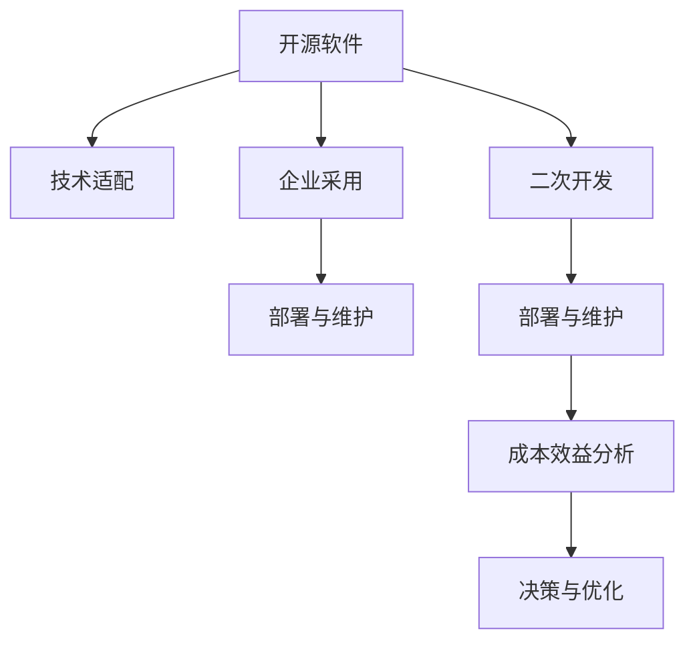

                 

# 开源项目的企业采用：创造商业机会

## 1. 背景介绍

### 1.1 问题由来

近年来，开源软件在企业中的应用越来越广泛，被视为降低IT成本、提高开发效率、加速产品迭代的重要手段。然而，开源软件并非适合所有企业，如何选择合适的开源项目并成功引入企业内部，是开源企业采用过程中亟待解决的关键问题。

### 1.2 问题核心关键点

开源项目的成功引入，不仅依赖于其技术成熟度和社区活跃度，更需要结合企业的实际需求和应用场景。以下是开源项目在企业采用的过程中需要重点关注的几个关键点：

- **技术适配性**：开源项目是否能够满足企业的核心需求和业务痛点。
- **社区支持度**：项目的活跃度和社区反馈是否充足，能否快速解决使用中遇到的问题。
- **企业适配性**：开源项目是否足够灵活，是否需要进行二次开发或定制化适配。
- **成本效益**：引入开源项目需要投入的资源和时间成本，与预期收益是否匹配。
- **安全与合规性**：开源项目的安全性如何，是否符合企业的安全合规要求。

### 1.3 问题研究意义

开源项目的成功引入和持续采用，对企业信息化建设、技术创新、成本控制等方面具有重要意义：

- **降低IT成本**：开源项目通常比商业软件成本更低，且后期维护成本可控，可大大降低企业的IT支出。
- **提升开发效率**：开源项目提供了丰富的工具和库，可加速开发速度，缩短产品上市时间。
- **增强技术创新**：开源社区汇聚了大量技术精英，企业可以通过参与开源贡献，快速积累技术实力。
- **促进协作与分享**：开源项目鼓励社区协作，有助于企业内部不同团队之间的技术交流与合作。

## 2. 核心概念与联系

### 2.1 核心概念概述

为更好地理解开源项目的企业采用过程，本节将介绍几个关键概念：

- **开源软件**：指采用开放源代码许可证授权的软件，源代码公开，任何人可自由修改、分享、使用。
- **企业采用**：指将开源软件引入企业内部，结合企业实际需求和应用场景，进行定制化开发和部署的过程。
- **技术适配**：指对开源项目进行必要的功能增强和业务适配，使其满足企业需求。
- **二次开发**：指在开源项目基础上进行进一步定制化开发，增加企业特定的功能。
- **成本效益分析**：指对引入开源项目所产生的成本与预期收益进行综合评估，确保投入产出比合理。

### 2.2 核心概念原理和架构的 Mermaid 流程图



这个流程图展示了开源项目企业采用的核心流程和关键步骤：

1. **开源软件**：企业选择开源软件，并结合自身需求进行功能增强。
2. **技术适配**：对开源软件进行定制化开发，以适应企业内部的业务场景。
3. **二次开发**：基于开源软件进行进一步定制，添加企业特定的功能。
4. **企业采用**：将定制后的开源软件部署到企业内部，并纳入日常开发流程。
5. **部署与维护**：定期更新和维护开源软件，确保其稳定运行。
6. **成本效益分析**：评估开源项目的成本与收益，决定是否继续采用。
7. **决策与优化**：根据分析结果，优化采用策略，以获得最佳效果。

## 3. 核心算法原理 & 具体操作步骤

### 3.1 算法原理概述

企业采用开源项目的过程，本质上是一种技术适配与二次开发的过程。其核心思想是：结合企业实际需求和应用场景，对开源项目进行定制化开发和适配，使其能够满足企业的业务需求。

形式化地，假设开源软件为 $S$，企业需求为 $D$。通过技术适配和二次开发，最终得到符合企业需求的软件 $S'$。则企业采用的优化目标为：

$$
S' = \mathop{\arg\min}_{S} \text{cost}(S, D) + \text{benefit}(S', D)
$$

其中 $\text{cost}(S, D)$ 为适配和二次开发的成本，$\text{benefit}(S', D)$ 为满足企业需求的收益。通过优化适配过程，最小化成本和最大化收益，达到最佳的企业采用效果。

### 3.2 算法步骤详解

开源项目的企业采用一般包括以下几个关键步骤：

**Step 1: 需求分析与评估**

- 收集企业内部业务需求和技术痛点，形成需求文档。
- 评估开源项目的技术成熟度、社区活跃度和应用案例，确定备选开源项目。

**Step 2: 技术适配与二次开发**

- 根据需求文档，对开源项目进行功能增强和适配。
- 在开源项目基础上进行二次开发，添加企业特定的功能。
- 通过持续集成和持续部署工具（CI/CD），自动化构建和测试定制化软件。

**Step 3: 部署与维护**

- 在企业内部部署定制化软件，并进行初始化配置。
- 建立持续维护机制，定期更新开源项目和二次开发的功能。
- 监控软件性能和稳定性，及时解决运行中遇到的问题。

**Step 4: 成本效益分析**

- 收集项目开发和维护的各项成本，包括人力、硬件、软件等。
- 评估软件带来的收益，包括提高效率、降低成本、增强技术能力等。
- 根据成本与收益分析，决定是否继续采用开源项目，并优化采用策略。

**Step 5: 持续优化与反馈**

- 定期收集企业反馈，评估采用效果。
- 根据反馈调整技术适配和二次开发策略，提升软件性能和稳定性。
- 参与开源社区贡献，获取最新的技术更新和优化建议。

以上是开源项目企业采用的通用流程。在实际应用中，还需要根据具体项目和企业的特点，对各个环节进行优化设计，以确保最终采用效果。

### 3.3 算法优缺点

开源项目的企业采用方法具有以下优点：

- **成本效益高**：开源项目通常具有成本低、效益高的特点，能够为企业节省大量IT支出。
- **灵活性高**：开源软件社区活跃，能够快速响应企业需求变化，提供灵活的技术适配和二次开发支持。
- **技术创新强**：开源社区汇聚了大量技术精英，企业可以通过参与贡献，快速积累技术实力。
- **可扩展性强**：开源软件架构灵活，易于进行功能扩展和二次开发。

同时，该方法也存在一定的局限性：

- **质量不稳定**：开源项目的质量依赖于社区贡献，可能存在不稳定的风险。
- **技术复杂度高**：定制化开发需要一定的技术基础和开发经验，难度较大。
- **依赖外部社区**：开源项目的维护和更新依赖于社区，可能存在响应延迟的问题。
- **知识产权风险**：开源项目的许可证可能存在限制，影响企业知识产权保护。

尽管存在这些局限性，但就目前而言，开源项目的企业采用仍是一种高效、低成本的技术选择。未来相关研究的重点在于如何进一步提升开源项目的稳定性和可维护性，提高企业采用过程中的风险控制能力。

### 3.4 算法应用领域

开源项目的成功采用，已经被广泛应用于多个领域，例如：

- **云计算**：如OpenStack、Kubernetes等开源云计算平台，通过二次开发满足企业特定的云服务需求。
- **数据库**：如MySQL、PostgreSQL等开源数据库，通过定制化开发和适配，提供高效的数据存储和查询能力。
- **大数据**：如Apache Hadoop、Spark等开源大数据平台，通过二次开发实现数据分析、处理和可视化功能。
- **人工智能**：如TensorFlow、PyTorch等开源AI框架，通过定制化开发实现企业特定的机器学习应用。
- **开发框架**：如Spring、Django等开源开发框架，通过适配实现快速搭建企业级应用系统。

除了上述这些经典应用外，开源项目的企业采用也被创新性地应用到更多场景中，如微服务架构、DevOps、容器化部署等，为企业的数字化转型提供了新的技术路径。

## 4. 数学模型和公式 & 详细讲解 & 举例说明

### 4.1 数学模型构建

本节将使用数学语言对开源项目的企业采用过程进行更加严格的刻画。

记企业需求为 $D=\{d_1, d_2, ..., d_n\}$，开源项目为 $S$，定制化后的软件为 $S'$。定义适配和二次开发的总成本为 $C(S, D)$，定制化软件带来的收益为 $B(S', D)$。则企业采用的优化目标为：

$$
S' = \mathop{\arg\min}_{S} C(S, D) + B(S', D)
$$

在实践中，我们通常使用基于梯度的优化算法（如SGD、Adam等）来近似求解上述最优化问题。设 $\eta$ 为学习率，$\lambda$ 为正则化系数，则参数的更新公式为：

$$
S \leftarrow S - \eta \nabla_{S}C(S, D) - \eta\lambda S
$$

其中 $\nabla_{S}C(S, D)$ 为适配和二次开发成本对开源项目 $S$ 的梯度，可通过反向传播算法高效计算。

### 4.2 公式推导过程

以下我们以云服务管理平台为例，推导适配成本和二次开发收益的计算公式。

假设企业需要管理多个云服务实例，云服务实例的监控和运维成本为 $C_{instance} \times \text{num\_instance}$。适配开源云平台 $S$ 的监控和运维成本为 $C_{adapt}(S)$。在 $S$ 基础上进行二次开发，添加企业特定的功能模块，成本为 $C_{develop}(S, D)$。则总成本 $C(S, D)$ 可表示为：

$$
C(S, D) = C_{instance} \times \text{num\_instance} + C_{adapt}(S) + C_{develop}(S, D)
$$

根据云服务实例的监控和运维收益 $B_{instance}$，定制化监控和运维收益 $B_{adapt}$ 和二次开发带来的附加收益 $B_{develop}$，定制化软件带来的总收益 $B(S', D)$ 可表示为：

$$
B(S', D) = B_{instance} \times \text{num\_instance} + B_{adapt}(S) + B_{develop}(S', D)
$$

通过上述公式，可以计算出企业在采用 $S'$ 时需要投入的总成本和获得的总收益。通过最小化成本和最大化收益，找到最优的开源项目和适配方案。

### 4.3 案例分析与讲解

以下我们以MySQL数据库为例，分析其在企业采用的过程和收益。

假设企业需要处理大量用户数据，原始MySQL数据库的并发处理能力为 $C_{original}$，迁移后数据库的并发处理能力为 $C_{new}$。迁移和适配的总成本为 $C_{migration} + C_{adapt}$。迁移后数据库带来的收益为 $B_{new}$。则企业采用的优化目标为：

$$
S' = \mathop{\arg\min}_{S} (C_{migration} + C_{adapt}) + B_{new} - C_{original}
$$

其中 $B_{new} - C_{original}$ 表示迁移后数据库带来的净收益。通过计算总成本和净收益，可以评估MySQL数据库在企业采用过程中是否值得投入。

## 5. 项目实践：代码实例和详细解释说明

### 5.1 开发环境搭建

在进行开源项目的企业采用实践前，我们需要准备好开发环境。以下是使用Python进行Jenkins CI/CD开发的环境配置流程：

1. 安装Jenkins：从官网下载并安装Jenkins，用于自动化构建和测试。

2. 配置Jenkins：创建Jenkins主目录和多个从目录，配置所需插件和环境变量。

3. 安装Git版本控制：从官网下载安装Git，并配置Jenkins自动拉取Git仓库。

4. 安装相关工具：安装Python、Java、Maven等常用工具，配置Jenkins环境。

5. 配置Jenkins pipeline：编写Jenkins pipeline脚本，自动化执行构建、测试、部署等任务。

完成上述步骤后，即可在Jenkins上运行定制化软件的持续集成和持续部署。

### 5.2 源代码详细实现

这里我们以Jenkins为例，展示使用Jenkins pipeline自动化构建和部署开源项目的流程。

首先，定义Jenkins pipeline脚本：

```groovy
pipeline {
    agent any
    stages {
        stage('构建') {
            steps {
                withGit('https://github.com/jenkinsci/jenkins.git', 'jenkins')
                sh 'mvn clean install'
            }
        }
        stage('测试') {
            steps {
                sh 'mvn test'
            }
        }
        stage('部署') {
            steps {
                withGit('https://github.com/jenkinsci/jenkins.git', 'jenkins')
                sh 'mvn install'
            }
        }
    }
}
```

然后，在Jenkins上配置pipeline脚本，并指定项目路径和所需环境：

```
pipeline {
    agent any
    stages {
        stage('构建') {
            steps {
                withGit('https://github.com/jenkinsci/jenkins.git', 'jenkins')
                sh 'mvn clean install'
            }
        }
        stage('测试') {
            steps {
                sh 'mvn test'
            }
        }
        stage('部署') {
            steps {
                withGit('https://github.com/jenkinsci/jenkins.git', 'jenkins')
                sh 'mvn install'
            }
        }
    }
}
```

最后，在Jenkins上运行pipeline，即可自动化执行构建、测试和部署任务。

### 5.3 代码解读与分析

让我们再详细解读一下关键代码的实现细节：

**pipeline脚本**：
- `pipeline`：Jenkins pipeline的顶层标签，表示这是一个pipeline脚本。
- `agent any`：指定使用的构建代理，此处使用任意构建代理。
- `stages`：定义pipeline的构建阶段，分为构建、测试、部署等。
- `steps`：在各个阶段执行的具体构建、测试、部署命令。

**Jenkins环境配置**：
- 安装Jenkins：从官网下载安装Jenkins，并启动Jenkins服务。
- 创建Jenkins主目录和从目录：创建主目录和多个从目录，用于存放不同的项目文件和环境配置。
- 配置Git版本控制：安装Git，并配置Jenkins自动拉取Git仓库，方便自动构建和部署。
- 安装相关工具：安装Python、Java、Maven等常用工具，配置Jenkins环境变量，确保所有构建和部署任务能够顺利运行。

通过上述代码，Jenkins可以自动化执行开源项目的构建、测试和部署任务，大大提高了企业采用开源项目的效率。

当然，工业级的系统实现还需考虑更多因素，如代码质量控制、版本管理、自动化测试、持续集成等。但核心的企业采用流程基本与此类似。

## 6. 实际应用场景

### 6.1 智慧金融

智慧金融是企业采用开源项目的重要应用场景之一。传统金融业务流程复杂，需要大量的系统集成和数据处理。开源项目在金融领域的应用，可以显著提升金融机构的效率和竞争力。

在实践中，金融机构可以通过采用OpenStack、Kubernetes等开源云平台，快速构建和管理云服务基础设施。同时，采用MySQL、PostgreSQL等开源数据库，实现高效的数据存储和查询功能。通过二次开发，添加金融领域特有的业务功能和风控机制，能够更好地满足金融业务的需求。

### 6.2 智慧医疗

智慧医疗是开源项目企业采用的另一重要领域。医疗行业的IT系统复杂，需求变化快，开源项目提供了灵活的开发和部署环境。

在实践中，医疗机构可以通过采用OpenEHR、FHIR等开源医疗信息系统，实现电子病历管理、患者数据共享等功能。同时，采用OpenCV、TensorFlow等开源AI平台，进行疾病诊断、图像识别等医疗应用。通过二次开发，添加医院特有的医疗功能，如医生助手、远程会诊等，能够显著提升医疗服务的效率和质量。

### 6.3 智慧教育

智慧教育是开源项目企业采用的新兴领域。教育行业的IT系统更新快，需求变化多，开源项目提供了快速迭代的能力。

在实践中，教育机构可以通过采用OpenStack、Kubernetes等开源云平台，构建和管理教育云平台。同时，采用MySQL、PostgreSQL等开源数据库，实现学生数据管理、在线教学等功能。通过二次开发，添加教育领域特有的功能，如在线测验、智能评估等，能够提升教学质量和学生的学习体验。

### 6.4 未来应用展望

随着开源项目和企业需求的不断演变，未来在更多领域将有新的应用场景涌现，以下是几个可能的未来应用方向：

- **智慧城市**：智慧城市需要大量物联网设备数据处理和分析，开源项目提供了灵活的开发和部署环境。通过采用OpenTSDB、InfluxDB等开源时序数据库，实现城市数据的实时监控和分析。同时，采用Apache Kafka、Apache Storm等开源流处理平台，实现实时数据处理和分析。
- **智慧农业**：农业领域对传感器数据的处理和分析需求大，开源项目提供了灵活的开发和部署环境。通过采用OpenTSDB、InfluxDB等开源时序数据库，实现农业数据的实时监控和分析。同时，采用Apache Kafka、Apache Storm等开源流处理平台，实现实时数据处理和分析。
- **智慧零售**：零售领域对电商系统、供应链管理系统的需求高，开源项目提供了灵活的开发和部署环境。通过采用OpenStack、Kubernetes等开源云平台，构建和管理零售云平台。同时，采用MySQL、PostgreSQL等开源数据库，实现电商数据管理和供应链管理。

以上应用方向展示了开源项目在各领域的潜力和应用前景，未来随着技术的发展和企业需求的不断变化，开源项目的企业采用将会更加广泛和深入。

## 7. 工具和资源推荐

### 7.1 学习资源推荐

为了帮助开发者系统掌握开源项目的企业采用技术，这里推荐一些优质的学习资源：

1. **《Jenkins Pipeline：构建持续集成与持续部署的实战指南》**：这本书详细介绍了Jenkins Pipeline的使用方法和最佳实践，是Jenkins初学者和进阶者的必备书籍。
2. **《开源项目管理：实践与工具》**：这本书介绍了开源项目管理和使用的多种工具和方法，如Git、Jenkins、Docker等，适合企业IT人员学习。
3. **《开源软件设计原则》**：这本书介绍了开源软件的架构设计原则和最佳实践，是开发开源项目的参考指南。
4. **《OpenStack部署与实战》**：这本书介绍了OpenStack的部署和应用案例，适合企业IT人员学习。
5. **《Kubernetes实战：快速构建和部署容器化应用》**：这本书介绍了Kubernetes的部署和应用案例，适合企业IT人员学习。

通过这些资源的学习实践，相信你一定能够快速掌握开源项目的企业采用技术，并用于解决实际的IT问题。

### 7.2 开发工具推荐

高效的开发离不开优秀的工具支持。以下是几款用于开源项目企业采用的常用工具：

1. **Git**：版本控制工具，用于管理代码版本和团队协作。
2. **Jenkins**：持续集成和持续部署工具，用于自动化构建、测试和部署。
3. **Maven**：项目构建工具，用于自动化打包和部署。
4. **JIRA**：项目管理工具，用于需求管理和任务跟踪。
5. **Confluence**：知识管理工具，用于文档管理和团队协作。
6. **SonarQube**：代码质量管理工具，用于代码检查和漏洞扫描。

合理利用这些工具，可以显著提升开源项目企业采用的开发效率，加快创新迭代的步伐。

### 7.3 相关论文推荐

开源项目和企业采用的研究源于学界的持续研究。以下是几篇奠基性的相关论文，推荐阅读：

1. **《Jenkins Pipeline：构建持续集成与持续部署的实战指南》**：由Jenkins社区专家撰写，详细介绍了Jenkins Pipeline的使用方法和最佳实践。
2. **《开源软件设计原则》**：由开源社区知名专家撰写，介绍了开源软件的架构设计原则和最佳实践。
3. **《OpenStack部署与实战》**：由OpenStack社区专家撰写，介绍了OpenStack的部署和应用案例。
4. **《Kubernetes实战：快速构建和部署容器化应用》**：由Kubernetes社区专家撰写，介绍了Kubernetes的部署和应用案例。
5. **《Jenkins Pipeline：构建持续集成与持续部署的实战指南》**：由Jenkins社区专家撰写，详细介绍了Jenkins Pipeline的使用方法和最佳实践。

这些论文代表了大规模企业采用开源项目的研究方向，通过学习这些前沿成果，可以帮助研究者把握学科前进方向，激发更多的创新灵感。

## 8. 总结：未来发展趋势与挑战

### 8.1 研究成果总结

本文对开源项目的企业采用方法进行了全面系统的介绍。首先阐述了开源项目和企业采用的研究背景和意义，明确了企业采用开源项目在成本、效率、技术创新等方面的优势。其次，从原理到实践，详细讲解了企业采用开源项目的过程，给出了具体的代码实例和操作流程。同时，本文还广泛探讨了开源项目在多个行业领域的应用前景，展示了开源项目企业采用的广阔潜力和应用前景。

通过本文的系统梳理，可以看到，开源项目的企业采用方法已经在多个领域得到成功应用，推动了企业的数字化转型和智能化升级。未来，伴随开源社区的持续发展和企业需求的不断变化，开源项目的企业采用必将在更多领域得到应用，为企业的数字化转型注入新的动力。

### 8.2 未来发展趋势

展望未来，开源项目的企业采用将呈现以下几个发展趋势：

1. **开放性增强**：开源项目的企业采用将更加注重开放性，鼓励企业参与开源社区贡献，促进技术的持续演进和创新。
2. **灵活性提高**：开源项目的企业采用将更加灵活，支持多种开源平台和架构，适应企业的业务需求变化。
3. **可扩展性提升**：开源项目的企业采用将更加可扩展，支持企业内部的系统集成和功能扩展，实现一体化的解决方案。
4. **成本效益优化**：开源项目的企业采用将更加注重成本效益，通过定制化开发和适配，实现低成本高效益的解决方案。
5. **安全性保障**：开源项目的企业采用将更加注重安全性，通过社区审查和安全加固，保障企业数据和系统的安全。

以上趋势凸显了开源项目企业采用的广阔前景。这些方向的探索发展，必将进一步提升企业采用开源项目的质量和效果，为企业的数字化转型和智能化升级提供新的技术路径。

### 8.3 面临的挑战

尽管开源项目的企业采用已经取得了瞩目成就，但在迈向更加智能化、普适化应用的过程中，它仍面临着诸多挑战：

1. **质量控制难度高**：开源项目的质量依赖于社区贡献，可能存在不稳定的风险。如何提高开源项目质量，确保企业采用效果，还需要更多研究和实践。
2. **适配难度大**：开源项目的适配需要一定的技术基础和开发经验，难度较大。如何降低企业采用开源项目的门槛，促进更广泛的应用，还需要更多创新。
3. **依赖外部社区**：开源项目的维护和更新依赖于社区，可能存在响应延迟的问题。如何增强开源项目的主动性和稳定性，减少对社区的依赖，还需要更多探索。
4. **知识产权风险**：开源项目的许可证可能存在限制，影响企业知识产权保护。如何合理规避开源项目的知识产权风险，确保企业采用过程中的合法合规，还需要更多法律保障。

尽管存在这些挑战，但开源项目的企业采用方法仍然具有广阔的应用前景，未来相关研究的重点在于如何进一步提升开源项目的质量和可维护性，提高企业采用过程中的风险控制能力。

### 8.4 研究展望

面对开源项目企业采用所面临的挑战，未来的研究需要在以下几个方面寻求新的突破：

1. **质量控制机制优化**：引入更多社区审查和测试机制，提高开源项目的质量保证。通过持续集成和持续交付，确保企业采用开源项目的稳定性和可靠性。
2. **适配工具优化**：开发更多适配工具和平台，降低企业采用开源项目的门槛。通过自动化工具和平台，实现快速、高效的适配过程。
3. **主动社区贡献**：鼓励企业参与开源社区贡献，提升开源项目的主动性和稳定性。通过社区贡献和反馈，不断优化开源项目的性能和功能。
4. **知识产权保护**：合理规避开源项目的知识产权风险，确保企业采用过程中的合法合规。通过技术手段和法律保障，保护企业采用开源项目的权益。

这些研究方向的探索，必将引领开源项目的企业采用技术迈向更高的台阶，为构建安全、可靠、可扩展的智能系统铺平道路。面向未来，开源项目的企业采用技术还需要与其他人工智能技术进行更深入的融合，如大数据、人工智能、云计算等，多路径协同发力，共同推动企业的数字化转型和智能化升级。

## 9. 附录：常见问题与解答

**Q1：企业采用开源项目时如何选择合适的项目？**

A: 选择合适的开源项目需要考虑多个因素：

1. **技术成熟度**：选择技术成熟、社区活跃的开源项目，确保项目的稳定性和可靠性。
2. **社区支持度**：选择有大量贡献者和活跃社区的开源项目，确保能够及时解决使用中的问题。
3. **业务适配性**：选择与企业需求高度契合的开源项目，确保能够满足企业特定的业务需求。
4. **成本效益**：评估项目的开发和维护成本，确保投入产出比合理。

综合考虑这些因素，可以帮助企业选择最适合的开源项目。

**Q2：企业采用开源项目时需要注意哪些问题？**

A: 企业采用开源项目需要注意以下几个问题：

1. **质量控制**：开源项目的质量依赖于社区贡献，可能存在不稳定的风险。需要引入更多的社区审查和测试机制，确保项目的稳定性和可靠性。
2. **适配难度**：开源项目的适配需要一定的技术基础和开发经验，难度较大。需要开发更多的适配工具和平台，降低企业采用开源项目的门槛。
3. **依赖外部社区**：开源项目的维护和更新依赖于社区，可能存在响应延迟的问题。需要增强开源项目的主动性和稳定性，减少对社区的依赖。
4. **知识产权风险**：开源项目的许可证可能存在限制，影响企业知识产权保护。需要合理规避开源项目的知识产权风险，确保企业采用过程中的合法合规。

合理处理这些问题，可以最大限度地发挥开源项目的优势，提升企业采用效果。

**Q3：企业采用开源项目时如何进行二次开发？**

A: 企业采用开源项目时进行二次开发需要注意以下几个步骤：

1. **需求分析**：收集企业内部的业务需求和技术痛点，形成需求文档。
2. **功能增强**：对开源项目进行必要的功能增强，添加企业特定的功能。
3. **二次开发**：在开源项目基础上进行二次开发，添加企业特有的功能。
4. **测试与部署**：通过持续集成和持续部署工具，自动化构建和测试定制化软件。

通过以上步骤，可以顺利完成二次开发，实现企业特定的功能需求。

---

作者：禅与计算机程序设计艺术 / Zen and the Art of Computer Programming

