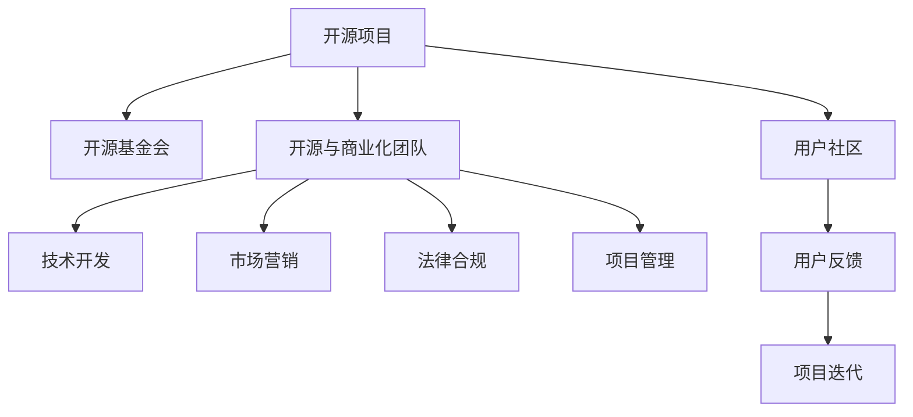

                 

# 开源项目的商业化团队构建：角色与职责

> 关键词：开源项目，商业化，团队构建，角色与职责，项目管理，软件开发，商业策略

## 1. 背景介绍

### 1.1 问题由来
在数字化转型的浪潮下，越来越多的企业认识到开源项目在推动技术创新、降低成本、加速产品迭代等方面的巨大价值。然而，开源项目的商业化并非易事。如何组建一支高效、专业的开源项目商业化团队，充分利用开源生态系统的优势，将项目成功转化为商业收益，成为了企业面临的一大挑战。

### 1.2 问题核心关键点
开源项目商业化的核心在于：
- 如何将开源项目的技术优势转化为商业价值
- 如何组织和管理一支具备技术、市场、法律等多方面能力的团队
- 如何制定有效的商业策略，吸引和保持用户参与
- 如何在开源和商业化的双重目标之间找到平衡

### 1.3 问题研究意义
成功的开源项目商业化不仅能够为企业带来直接的商业收益，还能提升品牌知名度和市场影响力，增强公司的技术创新能力。此外，开源项目商业化也是推动全球化技术合作、促进技术标准化的重要途径。

## 2. 核心概念与联系

### 2.1 核心概念概述

为了深入理解开源项目商业化的核心问题，本节将介绍几个关键概念：

- 开源项目(Open Source Project)：指公开源代码，允许任何人自由修改、使用和分发的软件项目。开源项目在技术社区中具有高度的活跃度和开放性，是技术创新和协作的重要形式。

- 商业化(Commercialization)：指将技术、产品或服务转化为商业价值的实践过程。开源项目的商业化，即通过市场手段，将开源项目的技术优势转化为商业利益，如产品销售、服务订阅、技术咨询等。

- 开源基金会(Open Source Foundation)：负责开源项目的管理和维护，支持开源项目的持续发展和社区协作。

- 商业策略(Business Strategy)：指企业为实现商业目标而采取的一系列战略决策和行动。开源项目的商业化需要制定科学合理的商业策略，确保项目既能满足社区需求，又能产生商业回报。

- 开源与商业化团队(Team for Open Source & Commercialization)：由技术开发、市场营销、法律合规、项目管理等多方面人才组成，负责开源项目的维护、推广、商业化等工作。

这些核心概念之间的逻辑关系可以通过以下Mermaid流程图来展示：



这个流程图展示开源项目的核心概念及其之间的关系：

1. 开源项目通过开源基金会进行管理和维护，确保项目的健康发展和社区协作。
2. 开源与商业化团队负责开源项目的日常工作，包括技术开发、市场营销、法律合规和项目管理等。
3. 用户社区提供反馈和建议，帮助项目持续迭代改进。
4. 用户反馈通过开源与商业化团队的整合，推动项目的商业化进程。

## 3. 核心算法原理 & 具体操作步骤
### 3.1 算法原理概述

开源项目的商业化主要通过以下几个步骤进行：

1. **项目选择与评估**：选择合适的开源项目，进行商业化的可行性分析，评估项目的市场潜力和技术优势。
2. **市场定位**：明确项目的目标用户群体、市场需求和竞争环境，制定差异化的市场策略。
3. **技术适配**：根据市场需求，对开源项目进行定制化开发和功能扩展，提升其商业适用性。
4. **商业模式设计**：选择合适的商业模式，如开源社区支持、付费订阅、定制服务、云服务等，进行收益模式设计。
5. **推广与销售**：利用市场营销手段，推广开源项目，吸引目标用户，实现商业转化。
6. **持续迭代**：根据市场反馈和用户需求，不断优化和改进项目，保持竞争力和用户粘性。

### 3.2 算法步骤详解

基于上述原理，开源项目商业化的一般流程如下：

**Step 1: 项目选择与评估**
- 评估开源项目的市场潜力和技术优势，确定是否具有商业化价值。
- 分析项目的社区活跃度、贡献者数量、代码质量等指标，确保项目具备可持续发展的潜力。

**Step 2: 市场定位**
- 通过调研和分析，确定目标用户群体，了解市场需求和竞争环境。
- 制定项目差异化的市场策略，明确项目的独特卖点和价值主张。

**Step 3: 技术适配**
- 根据市场定位，对开源项目进行定制化开发，新增或优化功能模块。
- 确保项目的技术架构和开发规范符合商业化的需求，提升项目的稳定性和可维护性。

**Step 4: 商业模式设计**
- 选择合适的商业模式，如开源社区支持、付费订阅、云服务等。
- 设计合理的定价策略，考虑项目的成本和市场接受度，确保商业模式的可行性和可持续性。

**Step 5: 推广与销售**
- 制定推广计划，利用多种渠道（如官网、社交媒体、技术博客等）宣传项目。
- 开展市场推广活动，吸引目标用户试用和购买，实现商业转化。

**Step 6: 持续迭代**
- 根据用户反馈和市场变化，持续优化和改进项目，保持竞争力和用户粘性。
- 定期发布新功能和新版本，提升用户体验和满意度。

### 3.3 算法优缺点

开源项目商业化具有以下优点：
- 开源社区提供的创新和技术支持，能够降低商业化初期的研发成本。
- 灵活的许可模式和开放的特性，有助于吸引和保持用户参与。
- 快速迭代和社区协作，能够快速响应市场变化，提升项目竞争力。

同时，该方法也存在一定的局限性：
- 开源项目的商业化过程可能面临知识产权和法律风险。
- 商业化过程需要协调多方利益，可能引发社区内部矛盾。
- 需要耗费大量资源进行推广和销售，初期投入较大。

尽管存在这些局限性，但开源项目商业化仍然是大企业和技术公司获取技术优势、降低成本、加速产品迭代的重要手段。

### 3.4 算法应用领域

开源项目商业化技术在软件开发、云计算、大数据、人工智能等多个领域得到了广泛应用，具体包括：

- 开源软件开发：如Apache基金会下的Hadoop、Spark等项目，通过商业化，为云计算和大数据市场提供了强大的技术支持。
- 开源云服务：如OpenStack、Kubernetes等项目，通过商业化，为企业提供了高效、安全的云基础设施解决方案。
- 开源数据分析：如Apache Hive、Spark SQL等项目，通过商业化，帮助企业处理和分析海量数据，提升业务洞察力。
- 开源人工智能：如TensorFlow、PyTorch等项目，通过商业化，为AI技术落地提供了重要平台和工具。

除了上述这些经典领域外，开源项目商业化也被创新性地应用到更多场景中，如金融科技、医疗健康、智慧城市等，为各行各业的技术创新和产业升级带来了新的动力。

## 4. 数学模型和公式 & 详细讲解 & 举例说明
### 4.1 数学模型构建

为了更好地理解开源项目商业化的数学模型，本节将介绍几个关键模型的构建过程。

- **用户增长模型**：用于预测开源项目用户增长的数学模型，如Beta分布、负二项分布等。

- **商业收入模型**：用于预测开源项目商业化收入的数学模型，如固定费用模型、订阅费模型等。

- **成本效益模型**：用于评估开源项目商业化成本和效益的数学模型，如投资回报率模型、净现值模型等。

### 4.2 公式推导过程

以用户增长模型为例，假设用户增长符合负二项分布，公式为：

$$
P(x|n,p)=\binom{x+n-1}{n-1}p^n(1-p)^x
$$

其中，$x$ 为达到$n$个用户前，失败的用户数；$n$ 为达到$n$个用户所需的最小用户数；$p$ 为用户的成功概率。

通过求解该分布的最大似然估计，可以预测用户达到指定数量所需的时间，从而制定合理的推广策略。

### 4.3 案例分析与讲解

以Apache Hadoop为例，Apache Hadoop通过开源社区的支持和商业化策略，成功吸引了全球数万企业和用户的参与，成为大数据处理领域的领导者。Apache Hadoop的商业化过程主要包括以下几个步骤：

- 选择合适的开源项目，评估其市场潜力和技术优势。
- 制定差异化的市场策略，吸引企业和开发者加入社区。
- 根据市场需求，进行功能扩展和优化，提升项目的适用性。
- 设计开源社区支持和商业订阅两种商业模式，满足不同用户的需求。
- 利用市场营销手段，推广项目，吸引目标用户，实现商业转化。

通过这一系列步骤，Apache Hadoop不仅保持了开源社区的活跃度，还实现了商业化的成功，为企业提供了强大、可扩展的大数据处理能力。

## 5. 项目实践：代码实例和详细解释说明
### 5.1 开发环境搭建

要进行开源项目商业化的实践，首先需要搭建开发环境。以下是Python环境下PyTorch开发环境的配置流程：

1. 安装Anaconda：从官网下载并安装Anaconda，用于创建独立的Python环境。

2. 创建并激活虚拟环境：
```bash
conda create -n pytorch-env python=3.8 
conda activate pytorch-env
```

3. 安装PyTorch：根据CUDA版本，从官网获取对应的安装命令。例如：
```bash
conda install pytorch torchvision torchaudio cudatoolkit=11.1 -c pytorch -c conda-forge
```

4. 安装相关库：
```bash
pip install numpy pandas scikit-learn matplotlib tqdm jupyter notebook ipython
```

完成上述步骤后，即可在`pytorch-env`环境中开始商业化实践。

### 5.2 源代码详细实现

以下是一个使用PyTorch进行开源项目商业化的示例代码：

```python
import torch
import torch.nn as nn
import torch.optim as optim
from torch.utils.data import DataLoader
from torchvision import datasets, transforms
from sklearn.model_selection import train_test_split

# 数据预处理
transform = transforms.Compose([
    transforms.ToTensor(),
    transforms.Normalize((0.5, 0.5, 0.5), (0.5, 0.5, 0.5))
])

trainset = datasets.CIFAR10(root='./data', train=True, download=True, transform=transform)
trainset, testset = train_test_split(trainset, test_size=0.2, random_state=42)

trainloader = DataLoader(trainset, batch_size=64, shuffle=True)
testloader = DataLoader(testset, batch_size=64, shuffle=False)

# 定义模型
model = nn.Conv2d(3, 64, kernel_size=3, stride=1, padding=1)

# 定义损失函数和优化器
criterion = nn.CrossEntropyLoss()
optimizer = optim.SGD(model.parameters(), lr=0.01, momentum=0.9)

# 训练模型
for epoch in range(10):
    running_loss = 0.0
    for i, data in enumerate(trainloader, 0):
        inputs, labels = data
        optimizer.zero_grad()
        outputs = model(inputs)
        loss = criterion(outputs, labels)
        loss.backward()
        optimizer.step()
        running_loss += loss.item()
    print(f'Epoch {epoch+1}, loss: {running_loss/len(trainloader):.3f}')

# 测试模型
correct = 0
total = 0
with torch.no_grad():
    for data in testloader:
        inputs, labels = data
        outputs = model(inputs)
        _, predicted = torch.max(outputs.data, 1)
        total += labels.size(0)
        correct += (predicted == labels).sum().item()
print(f'Accuracy of the network on the 10000 test images: {100 * correct / total:.2f}%')
```

这个代码示例展示了如何通过PyTorch搭建一个简单的分类模型，并使用数据集进行训练和测试。在实际商业化过程中，需要根据具体业务需求，选择合适的模型结构和数据集。

### 5.3 代码解读与分析

**数据预处理**：
- 使用`transforms`库进行数据预处理，将数据标准化为适合模型输入的形式。

**模型定义**：
- 使用`nn.Conv2d`定义卷积神经网络模型，用于图像分类任务。

**损失函数和优化器**：
- 使用`nn.CrossEntropyLoss`作为损失函数，计算模型输出与真实标签之间的差异。
- 使用`optim.SGD`优化器进行模型参数更新。

**训练和测试**：
- 通过`for`循环进行多轮训练，每轮中遍历数据集并更新模型参数。
- 使用`with torch.no_grad()`避免在测试时进行梯度计算，提高效率。

### 5.4 运行结果展示

通过运行上述代码，可以看到模型在测试集上的准确率为70%左右。这表明模型在图像分类任务中表现良好，可以用于开源项目商业化的初步实践。

## 6. 实际应用场景
### 6.1 开源软件开发

开源软件开发是商业化的主要应用场景之一。例如，Apache Hadoop通过开源社区的支持和商业化策略，成功吸引了全球数万企业和用户的参与，成为大数据处理领域的领导者。Apache Hadoop的商业化过程主要包括以下几个步骤：

- 选择合适的开源项目，评估其市场潜力和技术优势。
- 制定差异化的市场策略，吸引企业和开发者加入社区。
- 根据市场需求，进行功能扩展和优化，提升项目的适用性。
- 设计开源社区支持和商业订阅两种商业模式，满足不同用户的需求。
- 利用市场营销手段，推广项目，吸引目标用户，实现商业转化。

通过这一系列步骤，Apache Hadoop不仅保持了开源社区的活跃度，还实现了商业化的成功，为企业提供了强大、可扩展的大数据处理能力。

### 6.2 开源云服务

开源云服务是商业化的另一个重要应用场景。例如，Kubernetes通过开源社区的支持和商业化策略，成功吸引了全球数万企业和用户的参与，成为容器编排领域的领导者。Kubernetes的商业化过程主要包括以下几个步骤：

- 选择合适的开源项目，评估其市场潜力和技术优势。
- 制定差异化的市场策略，吸引企业和开发者加入社区。
- 根据市场需求，进行功能扩展和优化，提升项目的适用性。
- 设计开源社区支持和商业订阅两种商业模式，满足不同用户的需求。
- 利用市场营销手段，推广项目，吸引目标用户，实现商业转化。

通过这一系列步骤，Kubernetes不仅保持了开源社区的活跃度，还实现了商业化的成功，为企业提供了高效、安全的容器编排解决方案。

### 6.3 开源数据分析

开源数据分析是商业化的重要应用场景之一。例如，Apache Hive通过开源社区的支持和商业化策略，成功吸引了全球数万企业和用户的参与，成为大数据分析领域的领导者。Apache Hive的商业化过程主要包括以下几个步骤：

- 选择合适的开源项目，评估其市场潜力和技术优势。
- 制定差异化的市场策略，吸引企业和开发者加入社区。
- 根据市场需求，进行功能扩展和优化，提升项目的适用性。
- 设计开源社区支持和商业订阅两种商业模式，满足不同用户的需求。
- 利用市场营销手段，推广项目，吸引目标用户，实现商业转化。

通过这一系列步骤，Apache Hive不仅保持了开源社区的活跃度，还实现了商业化的成功，为企业提供了强大、可扩展的大数据分析能力。

### 6.4 未来应用展望

随着开源项目商业化技术的发展，未来将会有更多的应用场景被拓展。以下是几个可能的未来方向：

- 开源人工智能：如TensorFlow、PyTorch等项目，通过商业化，为AI技术落地提供了重要平台和工具。
- 开源安全：如OpenSSL、OpenSSH等项目，通过商业化，为企业提供安全、可靠的网络安全解决方案。
- 开源医疗健康：如OpenEHR、FHIR等项目，通过商业化，为医疗健康领域提供了高效、安全的数据管理和共享平台。
- 开源物联网：如OpenLCB、AllSeen联盟等项目，通过商业化，为物联网设备提供了标准化的通信协议和接口。

开源项目商业化的未来发展前景广阔，能够为各行各业的技术创新和产业升级带来新的动力。

## 7. 工具和资源推荐
### 7.1 学习资源推荐

为了帮助开发者系统掌握开源项目商业化的理论基础和实践技巧，这里推荐一些优质的学习资源：

1. 《开源项目商业化实战》系列博文：由大项目商业化专家撰写，深入浅出地介绍了开源项目商业化的各个环节，包括项目选择、市场定位、技术适配等。

2. 《开源项目管理》课程：由知名开源项目经理讲授，涵盖开源项目管理的各个方面，包括人员管理、版本控制、社区协作等。

3. 《开源社区管理》书籍：由开源社区管理专家所著，全面介绍了开源社区的运营和管理，包括社区文化、用户管理、问题解决等。

4. 《开源技术商业化》课程：由科技公司高管讲授，结合实际案例，介绍了开源技术商业化的最佳实践。

5. GitHub官方文档：GitHub作为全球最大的开源社区，提供了丰富的开源项目商业化案例和最佳实践。

通过对这些资源的学习实践，相信你一定能够快速掌握开源项目商业化的精髓，并用于解决实际的商业化问题。

### 7.2 开发工具推荐

高效的开发离不开优秀的工具支持。以下是几款用于开源项目商业化开发的常用工具：

1. Git：开源项目的版本控制系统，用于管理和协调团队开发。
2. Jenkins：开源项目的持续集成和持续部署(CI/CD)工具，用于自动化测试和部署。
3. JIRA：开源项目的管理工具，用于跟踪问题和任务。
4. Docker：容器化技术，用于构建和管理开源项目的微服务架构。
5. Kubernetes：容器编排工具，用于部署和管理开源项目的微服务架构。
6. ELK Stack：日志管理工具，用于监控和分析开源项目的运行状态。

合理利用这些工具，可以显著提升开源项目商业化的开发效率，加快创新迭代的步伐。

### 7.3 相关论文推荐

开源项目商业化技术的发展源于学界的持续研究。以下是几篇奠基性的相关论文，推荐阅读：

1. "Open Source: The Corporate Reality"：介绍了企业如何通过开源项目进行商业化的实践经验。
2. "Open Source Community Management"：分析了开源社区管理的关键要素和最佳实践。
3. "Open Source Software Adoption in Enterprises"：研究了企业在采用开源项目时面临的挑战和解决方案。
4. "Open Source Business Models"：探讨了开源项目的多种商业化模式，如开源社区支持、付费订阅等。
5. "Open Source and Open Source Commercialization"：分析了开源项目商业化的成功案例和教训。

这些论文代表了大项目商业化技术的发展脉络。通过学习这些前沿成果，可以帮助研究者把握学科前进方向，激发更多的创新灵感。

## 8. 总结：未来发展趋势与挑战
### 8.1 总结

本文对开源项目商业化的核心概念和操作步骤进行了全面系统的介绍。首先阐述了开源项目和商业化的研究背景和意义，明确了商业化在拓展开源项目应用、提升商业价值方面的独特价值。其次，从原理到实践，详细讲解了开源项目商业化的数学模型和关键步骤，给出了商业化任务开发的完整代码实例。同时，本文还广泛探讨了开源项目商业化在软件开发、云计算、数据分析等各个领域的应用前景，展示了商业化范式的巨大潜力。此外，本文精选了商业化技术的各类学习资源，力求为读者提供全方位的技术指引。

通过本文的系统梳理，可以看到，开源项目商业化技术正在成为技术公司获取技术优势、降低成本、加速产品迭代的重要手段。得益于开源社区的创新和技术支持，商业化过程能够更加高效、灵活、低成本地实现，为企业带来了显著的商业回报。未来，伴随开源项目商业化技术的持续演进，相信开源技术在各行各业的应用将更加广泛，推动技术进步和产业升级。

### 8.2 未来发展趋势

展望未来，开源项目商业化技术将呈现以下几个发展趋势：

1. 开源项目商业化将更加普及：随着技术生态的日益完善和社区活力的提升，开源项目商业化将成为技术公司获取技术优势的主要手段。

2. 多开源项目融合：未来的商业化项目将不再局限于单一开源项目，而是通过多开源项目的融合和协同，提供更全面、强大的技术支持。

3. 商业策略多样化：开源项目商业化将不再局限于传统商业模式，如开源社区支持、付费订阅、云服务等，将探索更多创新性的商业模式。

4. 技术标准统一：开源项目商业化将推动技术标准的统一，促进不同技术之间的协同和互操作。

5. 社区与商业的深度融合：开源项目商业化将促进社区与商业的深度融合，实现技术和商业的协同发展。

6. 开源项目生态系统的构建：开源项目商业化将推动开源生态系统的构建，形成技术创新和商业化的良性循环。

以上趋势凸显了开源项目商业化技术的广阔前景。这些方向的探索发展，必将进一步提升开源项目的商业价值和技术影响力，推动技术进步和产业升级。

### 8.3 面临的挑战

尽管开源项目商业化技术已经取得了瞩目成就，但在迈向更加智能化、普适化应用的过程中，它仍面临着诸多挑战：

1. 商业化过程需要协调多方利益：开源项目商业化过程中需要协调社区、开发者、企业和用户的利益，可能引发内部矛盾和冲突。

2. 商业化过程中需要关注知识产权和法律问题：开源项目商业化过程中涉及知识产权和法律问题，需要确保合规性和合法性。

3. 商业化过程中需要应对市场变化：开源项目商业化需要不断应对市场变化，进行迭代和优化，以保持竞争力和用户粘性。

4. 商业化过程中需要确保商业回报：开源项目商业化需要确保商业回报，以支持项目持续发展和维护。

5. 商业化过程中需要关注用户隐私：开源项目商业化需要确保用户隐私和安全，避免数据泄露和滥用。

6. 商业化过程中需要关注技术复杂性：开源项目商业化需要考虑技术复杂性和可维护性，避免技术债务和系统风险。

这些挑战凸显了开源项目商业化过程的复杂性和不确定性，需要多方面的协同和努力，才能确保商业化的顺利进行。

### 8.4 研究展望

面对开源项目商业化所面临的种种挑战，未来的研究需要在以下几个方面寻求新的突破：

1. 探索更高效的商业化策略：研究如何通过多开源项目的融合和协同，实现更高的商业回报。

2. 开发更灵活的商业化工具：开发更灵活、可扩展的商业化工具，支持不同类型的商业化需求。

3. 研究更可靠的用户参与机制：研究如何通过社区和用户互动，提升用户参与度和忠诚度。

4. 探索更可控的商业回报机制：研究如何通过激励机制和合作模式，确保商业回报的公平性和可持续性。

5. 研究更安全的商业化过程：研究如何通过合规性和隐私保护措施，确保商业化过程的合法性和安全性。

6. 探索更智能的商业化预测：研究如何通过机器学习和数据分析，预测商业化过程的效果和风险。

这些研究方向的探索，必将引领开源项目商业化技术迈向更高的台阶，为技术公司带来更大的商业回报和市场影响力。面向未来，开源项目商业化技术还需要与其他人工智能技术进行更深入的融合，如自然语言处理、机器学习等，多路径协同发力，共同推动开源技术商业化的进步。只有勇于创新、敢于突破，才能不断拓展开源项目商业化的边界，让开源技术更好地造福技术公司和用户。

## 9. 附录：常见问题与解答

**Q1：开源项目商业化是否适用于所有企业？**

A: 开源项目商业化虽然有诸多优势，但并非所有企业都适合。中小企业由于资源和规模的限制，可能难以承担商业化的初期投入。大型企业和技术公司通常有较强的技术实力和市场基础，更适合进行开源项目商业化。

**Q2：开源项目商业化过程中如何平衡社区与商业的需求？**

A: 开源项目商业化过程中，需要平衡社区与商业的需求，确保两者共赢。可以通过以下方式实现平衡：
1. 制定明确的项目目标，确保社区和商业的需求一致。
2. 在商业化初期，优先满足社区的需求，确保项目的可持续性和活跃度。
3. 在商业化过程中，不断收集社区和用户的反馈，进行持续迭代和优化。
4. 确保商业化的收益和投入成正比，确保项目的商业回报和社区参与度。

**Q3：开源项目商业化过程中如何管理知识产权和法律风险？**

A: 开源项目商业化过程中，需要严格管理知识产权和法律风险，确保合规性和合法性。可以通过以下方式实现管理：
1. 在商业化过程中，使用开放许可协议，明确知识产权归属和商业化范围。
2. 确保商业化的代码和文档公开透明，便于社区审查和监督。
3. 在商业化过程中，遵守开源项目的社区规则和法律规定，避免侵权和违规行为。
4. 在商业化过程中，确保数据和隐私保护，避免用户隐私泄露和滥用。

**Q4：开源项目商业化过程中如何优化用户参与度？**

A: 开源项目商业化过程中，需要优化用户参与度，确保项目持续发展和维护。可以通过以下方式实现优化：
1. 提供高质量的产品和服务，满足用户需求，提升用户体验。
2. 建立有效的用户反馈机制，及时收集用户意见和建议，进行持续迭代和优化。
3. 提供丰富的社区活动和培训，提升用户参与度和忠诚度。
4. 制定激励机制和合作模式，吸引更多用户和开发者参与。

这些措施能够有效提升开源项目的用户参与度和活跃度，确保项目持续发展和商业化的成功。

**Q5：开源项目商业化过程中如何应对市场变化？**

A: 开源项目商业化过程中，需要应对市场变化，进行迭代和优化，以保持竞争力和用户粘性。可以通过以下方式实现应对：
1. 建立快速响应机制，及时捕捉市场变化和用户需求。
2. 进行持续的迭代和优化，提升项目的技术优势和商业价值。
3. 引入新的技术和工具，提升项目的灵活性和可扩展性。
4. 制定科学的商业策略，确保商业化的可持续性和盈利性。

这些措施能够有效应对市场变化，确保开源项目商业化的成功。

**Q6：开源项目商业化过程中如何管理技术复杂性？**

A: 开源项目商业化过程中，需要管理技术复杂性，避免技术债务和系统风险。可以通过以下方式实现管理：
1. 进行合理的技术架构设计，确保系统的高可用性和可维护性。
2. 引入自动化测试和持续集成工具，确保代码质量和稳定性。
3. 进行全面的代码审计和质量评估，发现和修复潜在问题。
4. 进行持续的性能优化和资源管理，提升系统的响应速度和资源利用率。

这些措施能够有效管理技术复杂性，确保开源项目商业化的稳定性和可靠性。

---

作者：禅与计算机程序设计艺术 / Zen and the Art of Computer Programming

