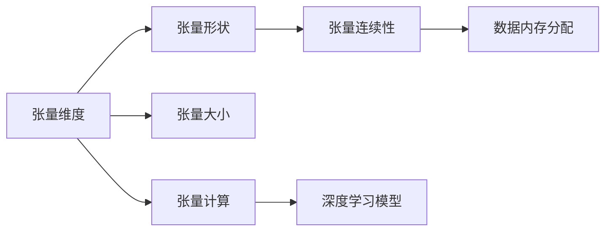

                 

# 张量形状和连续性：深度学习的基础

深度学习，作为人工智能领域的前沿技术，已经广泛应用于图像识别、自然语言处理、语音识别等多个领域。而张量形状和连续性，则是深度学习中最为基础的理论概念，深刻影响着模型的构建与优化。本文将从理论到实践，系统地介绍张量形状和连续性的核心原理，并结合实际案例进行详细讲解。

## 1. 背景介绍

深度学习模型本质上是一类以神经网络为基础的非线性模型。神经网络通过大量层级化的节点（神经元）对输入数据进行非线性变换，最终输出预测结果。在这个过程中，数据通常以张量的形式表示，从而方便模型进行高效的数学运算。

深度学习的核心是模型参数的训练。通过反向传播算法，模型能够自动学习输入和输出之间的映射关系，使得模型能够对未知数据进行准确的预测。为了更好地理解这一过程，我们需要深入理解张量形状和连续性的基本概念，这是深度学习的基础所在。

## 2. 核心概念与联系

### 2.1 核心概念概述

在深度学习中，张量（Tensor）是用于表示多维数组的基本数据结构。张量可以理解为一个包含数值元素的多维数组，其维度通常用`(n,d)`表示，其中`n`表示张量中元素的个数，`d`表示张量的一维维度。

- **张量维度**：张量的维度是其最重要的属性之一。通常用`dim`表示，如`dim=2`表示张量为二维数组。
- **张量形状**：指张量中元素的组织结构，通常用`(shape)`表示，如`shape=(128,32,32)`表示张量为三维数组，其中`128`为元素个数，`32`为两个维度的大小。
- **张量连续性**：指张量中元素在内存中的连续存储方式，通常用`contiguous`表示。

### 2.2 核心概念原理和架构的 Mermaid 流程图



这张流程图展示了张量维度、张量形状、张量连续性之间的关系和作用。其中，张量维度决定张量的大小，张量形状决定张量的组织结构，而张量连续性决定张量在内存中的存储方式，进而影响张量的计算效率。

### 2.3 张量维度与张量形状的关系

张量维度决定了张量的大小，即张量中元素的个数。张量形状则描述了张量中元素的组织结构。通常，张量形状与张量维度的关系可以用以下公式表示：

$$
\text{形状} = (n_1, n_2, \cdots, n_d)
$$

其中`n_1, n_2, ..., n_d`分别为每个维度的大小。例如，一个大小为128的二维张量可以表示为`shape=(128, 1)`。

## 3. 核心算法原理 & 具体操作步骤

### 3.1 算法原理概述

深度学习模型中的计算通常以张量为单位。为了高效地进行张量计算，需要理解张量形状和连续性的基本原理。

在深度学习中，张量的维度通常被映射到模型的层级结构中。例如，一个二维张量可以被映射到模型的卷积层，而一个三维张量可以被映射到模型的卷积层。张量形状则决定了张量在层级结构中的组织方式，从而影响模型的计算效率。

### 3.2 算法步骤详解

深度学习模型中的张量计算通常遵循以下步骤：

1. **定义张量**：首先定义张量的维度和形状。例如，`torch.zeros(3, 3)`表示一个大小为`3x3`的张量。
2. **数据初始化**：初始化张量的值。例如，`torch.randn(2, 3)`表示一个大小为`2x3`的张量，其中的元素为随机数。
3. **张量变换**：通过一系列的张量变换操作，对张量进行线性变换或非线性变换。例如，`torch.matmul(a, b)`表示两个张量的矩阵乘法。
4. **损失计算**：通过计算损失函数，评估模型的性能。例如，`torch.nn.CrossEntropyLoss()`表示计算交叉熵损失。
5. **反向传播**：通过反向传播算法，计算模型的梯度，更新模型参数。例如，`torch.no_grad()`表示关闭梯度计算。

### 3.3 算法优缺点

张量形状和连续性作为深度学习的基础概念，具有以下优点：

- **高效性**：张量形状和连续性可以优化内存分配和计算过程，提高模型的计算效率。
- **灵活性**：张量形状和连续性可以灵活处理不同维度的数据，适应各种深度学习模型。
- **可解释性**：张量形状和连续性使得模型的计算过程透明化，便于理解和调试。

同时，张量形状和连续性也存在一些局限性：

- **复杂性**：对于高维张量的计算，可能存在计算瓶颈，影响模型的训练效率。
- **资源消耗**：高维张量的存储和计算需要大量内存和计算资源，可能造成硬件资源不足。
- **算法复杂度**：对于复杂的张量变换操作，可能需要更高级的数学和算法知识。

### 3.4 算法应用领域

张量形状和连续性在深度学习中具有广泛的应用，特别是在以下领域：

- **计算机视觉**：卷积神经网络（CNN）中的卷积层通常处理三维张量，张量形状和连续性决定了卷积操作的效率。
- **自然语言处理**：循环神经网络（RNN）和变换器（Transformer）等模型中，张量形状和连续性决定了时间序列数据的处理方式。
- **语音识别**：深度学习模型在处理语音信号时，通常使用一维张量表示，张量形状和连续性决定了模型对时间序列数据的处理能力。

## 4. 数学模型和公式 & 详细讲解 & 举例说明

### 4.1 数学模型构建

在深度学习中，张量形状和连续性通常以数学公式的形式表达。以下是一个简单的张量乘法的数学模型：

$$
A \times B = \{(a_{ij} \times b_{ij})\}_{1 \leq i \leq m, 1 \leq j \leq n}
$$

其中，`A`和`B`为两个张量，`a_{ij}`和`b_{ij}`分别为`A`和`B`中第`i`行第`j`列的元素。

### 4.2 公式推导过程

张量乘法的公式推导过程如下：

1. **定义张量维度**：假设`A`的大小为`(m,n)`，`B`的大小为`(n,p)`。
2. **定义张量形状**：假设`A`的形状为`(m,n)`，`B`的形状为`(n,p)`。
3. **定义张量连续性**：假设`A`和`B`均为连续张量。
4. **计算乘积**：根据张量形状，计算乘积的元素值。

### 4.3 案例分析与讲解

以下是一个具体的张量乘法案例：

```python
import torch

# 定义张量A和B
A = torch.randn(2, 3)
B = torch.randn(3, 4)

# 计算乘积
C = torch.matmul(A, B)

# 打印结果
print(C.shape)  # 输出 (2, 4)
```

在这个例子中，张量`A`的大小为`2x3`，张量`B`的大小为`3x4`。通过矩阵乘法，计算出乘积`C`的大小为`2x4`。

## 5. 项目实践：代码实例和详细解释说明

### 5.1 开发环境搭建

在深度学习中，开发环境搭建是必不可少的环节。以下是一个典型的深度学习开发环境搭建步骤：

1. **安装Python**：确保Python版本为3.6以上，并配置好环境变量。
2. **安装PyTorch**：通过pip安装PyTorch，并确保GPU支持。
3. **安装TensorFlow**：通过pip安装TensorFlow，并确保GPU支持。
4. **安装NumPy**：通过pip安装NumPy，用于进行基本的数学运算。

### 5.2 源代码详细实现

以下是一个简单的深度学习模型代码实现：

```python
import torch
import torch.nn as nn
import torch.optim as optim

# 定义模型结构
class Net(nn.Module):
    def __init__(self):
        super(Net, self).__init__()
        self.fc1 = nn.Linear(784, 256)
        self.fc2 = nn.Linear(256, 10)
    
    def forward(self, x):
        x = x.view(-1, 784)
        x = torch.relu(self.fc1(x))
        x = self.fc2(x)
        return x

# 加载数据集
train_data = torchvision.datasets.MNIST(root='./data', train=True, transform=transforms.ToTensor(), download=True)
train_loader = torch.utils.data.DataLoader(train_data, batch_size=64, shuffle=True)

# 定义损失函数和优化器
criterion = nn.CrossEntropyLoss()
optimizer = optim.SGD(net.parameters(), lr=0.01, momentum=0.9)

# 训练模型
for epoch in range(10):
    for i, (images, labels) in enumerate(train_loader):
        # 前向传播
        outputs = net(images)
        loss = criterion(outputs, labels)
        
        # 反向传播
        optimizer.zero_grad()
        loss.backward()
        optimizer.step()
        
        # 输出日志
        if (i+1) % 100 == 0:
            print(f'Epoch [{epoch+1}/{10}], Step [{i+1}/{len(train_loader)}], Loss: {loss.item():.4f}')
```

在这个例子中，我们定义了一个简单的神经网络模型，用于对手写数字进行分类。通过加载MNIST数据集，使用SGD优化器进行训练，输出训练日志。

### 5.3 代码解读与分析

在这个例子中，我们使用了PyTorch库来定义和训练神经网络模型。具体步骤如下：

- **定义模型结构**：使用`nn.Linear`定义线性层，用于计算模型的中间特征。
- **加载数据集**：使用`torchvision.datasets.MNIST`加载MNIST数据集，并使用`DataLoader`进行数据批处理。
- **定义损失函数和优化器**：使用`nn.CrossEntropyLoss`定义交叉熵损失函数，使用`optim.SGD`定义随机梯度下降优化器。
- **训练模型**：在每个epoch内，对每个batch的数据进行前向传播和反向传播，更新模型参数。

## 6. 实际应用场景

### 6.1 计算机视觉

在计算机视觉中，张量形状和连续性是卷积神经网络（CNN）的基础。CNN通过卷积层、池化层、全连接层等层级结构，对输入图像进行特征提取和分类。张量形状和连续性决定了卷积层的输入输出形状，从而影响模型的计算效率。

### 6.2 自然语言处理

在自然语言处理中，循环神经网络（RNN）和变换器（Transformer）等模型通常使用一维张量表示时间序列数据。张量形状和连续性决定了模型对时间序列数据的处理方式，从而影响模型的性能。

### 6.3 语音识别

在语音识别中，深度学习模型通常使用一维张量表示音频信号。张量形状和连续性决定了模型对时间序列数据的处理能力，从而影响模型的识别精度。

## 7. 工具和资源推荐

### 7.1 学习资源推荐

为了深入理解张量形状和连续性的原理，推荐以下学习资源：

- **《深度学习》书籍**：Ian Goodfellow、Yoshua Bengio、Aaron Courville合著的经典教材，全面介绍了深度学习的理论基础和实践技巧。
- **《TensorFlow官方文档》**：Google开发的深度学习框架，提供了丰富的学习资源和样例代码。
- **《PyTorch官方文档》**：Facebook开发的深度学习框架，提供了详细的API文档和实践指南。

### 7.2 开发工具推荐

以下是一些常用的深度学习开发工具：

- **PyTorch**：由Facebook开发的深度学习框架，提供高效的张量计算和模型训练功能。
- **TensorFlow**：由Google开发的深度学习框架，支持分布式计算和模型部署。
- **Keras**：基于TensorFlow和Theano等底层框架的高级API，提供简单易用的模型构建和训练功能。

### 7.3 相关论文推荐

以下是一些关于张量形状和连续性的经典论文：

- **《ImageNet Classification with Deep Convolutional Neural Networks》**：Alex Krizhevsky等人在ICML 2012年发表的论文，提出使用CNN进行大规模图像分类。
- **《Deep Residual Learning for Image Recognition》**：Kaiming He等人发表在CVPR 2016年的论文，提出使用残差网络提高深度学习模型的性能。
- **《Attention Is All You Need》**：Ashish Vaswani等人在NeurIPS 2017年发表的论文，提出使用Transformer进行自然语言处理任务。

## 8. 总结：未来发展趋势与挑战

### 8.1 研究成果总结

张量形状和连续性作为深度学习的基础概念，已经被广泛应用于各种深度学习模型中。其高效性、灵活性和可解释性使得深度学习模型能够处理各种复杂的数据和任务。

### 8.2 未来发展趋势

未来，深度学习领域将在以下几个方面取得新的突破：

- **模型复杂度**：随着硬件资源的提升，深度学习模型的规模将不断增大，模型复杂度将进一步提升。
- **模型效率**：随着优化算法和计算图优化技术的发展，深度学习模型的训练和推理效率将不断提高。
- **模型可解释性**：随着可解释性技术的不断发展，深度学习模型的决策过程将更加透明和可理解。

### 8.3 面临的挑战

尽管深度学习在各个领域取得了显著的进展，但仍然面临一些挑战：

- **计算资源需求高**：深度学习模型的计算资源需求高，需要高性能的GPU和TPU等硬件设备。
- **数据标注成本高**：深度学习模型需要大量的标注数据，而标注数据的获取和标注成本较高。
- **模型泛化能力差**：深度学习模型在面对新的数据时，泛化能力较弱，需要更多的数据和更复杂的模型结构。

### 8.4 研究展望

未来，深度学习领域需要在以下几个方面进行更多的探索：

- **模型压缩**：通过模型压缩技术，减小模型规模，降低计算资源需求。
- **自动化标注**：利用无监督学习和半监督学习技术，减少对标注数据的依赖。
- **模型集成**：通过模型集成技术，提高模型的泛化能力和稳定性。

## 9. 附录：常见问题与解答

### Q1: 张量形状和连续性如何影响模型的计算效率？

**A:** 张量形状和连续性直接影响模型的计算效率。对于高维张量的计算，如果张量形状合理，连续性良好，计算效率将更高。例如，连续的张量可以更高效地进行内存分配和计算，而非连续的张量则需要更多的内存和计算资源。

### Q2: 如何优化张量的内存分配和计算？

**A:** 优化张量的内存分配和计算，主要可以通过以下方法实现：

- **数据加载和预处理**：合理地进行数据加载和预处理，减少不必要的内存占用。
- **张量分解**：将高维张量分解为多个低维张量，减少计算量。
- **张量优化器**：使用张量优化器进行计算图优化，提高计算效率。

### Q3: 如何提高深度学习模型的泛化能力？

**A:** 提高深度学习模型的泛化能力，主要可以通过以下方法实现：

- **增加数据量**：通过增加数据量，提高模型的泛化能力。
- **数据增强**：利用数据增强技术，生成更多的训练样本。
- **模型集成**：通过模型集成技术，提高模型的泛化能力和鲁棒性。

### Q4: 如何提高深度学习模型的可解释性？

**A:** 提高深度学习模型的可解释性，主要可以通过以下方法实现：

- **特征可视化**：利用特征可视化技术，展示模型的输入和输出特征。
- **模型解释器**：使用模型解释器，解释模型的决策过程。
- **因果分析**：利用因果分析技术，理解模型的因果关系。

---

作者：禅与计算机程序设计艺术 / Zen and the Art of Computer Programming

