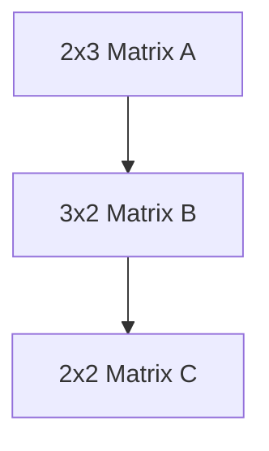

                 

# 张量操作精讲：形状、视图和步幅

> 关键词：张量,形状,视图,步幅,计算图,自动微分,内存管理,高性能计算

## 1. 背景介绍

张量(Tensor)是现代深度学习应用的核心概念，所有操作都基于张量展开。张量是一个多维数组，在深度学习中用于表示神经网络的参数、输入和输出等。对张量的操作是实现深度学习算法的关键。本文将深入讲解张量的形状、视图和步幅等核心概念，阐释其在深度学习系统中的地位与作用。

## 2. 核心概念与联系

### 2.1 核心概念概述

- **张量(Tensor)**：多维数组，用于存储模型参数、输入和输出等数据。
- **形状(Shape)**：张量的维度大小，通常表示为元组，如(2,3,4)。
- **视图(View)**：张量的特定切片，可看作是张量的“窗口”，在深度学习中用于操作局部数据。
- **步幅(Stride)**：定义张量内部数据的存储方式，影响张量访问和内存分配。
- **计算图(Computation Graph)**：张量操作的图表示，通过自动微分实现高效反向传播。
- **内存管理(Memory Management)**：合理管理张量内存，避免内存泄漏和重复拷贝。

这些概念通过自动微分、反向传播、内存管理等底层技术实现深度学习模型的高效训练和推理。

### 2.2 核心概念原理和架构的 Mermaid 流程图

```mermaid
graph TB
    A[张量(Tensor)] --> B[形状(Shape)]
    A --> C[视图(View)]
    A --> D[步幅(Stride)]
    A --> E[计算图(Computation Graph)]
    A --> F[内存管理(Memory Management)]

    B --> G[维度大小]
    C --> H[特定切片]
    D --> I[数据存储方式]
    E --> J[反向传播算法]
    F --> K[内存分配与释放]
```

这张图展示了张量操作中各个核心概念之间的关系。张量的形状和步幅决定了内存布局和访问方式，视图和计算图用于高效操作张量数据，内存管理确保系统资源高效利用。

## 3. 核心算法原理 & 具体操作步骤

### 3.1 算法原理概述

张量操作涉及计算图和自动微分技术，其核心在于如何高效构建和执行张量计算图，通过梯度信息实现反向传播。张量操作中的形状、视图和步幅是构建计算图的关键参数。

### 3.2 算法步骤详解

1. **定义张量**：创建张量，指定其形状、数据类型和初始值。
2. **构造计算图**：定义张量之间的计算关系，创建计算图。
3. **执行前向传播**：根据计算图执行张量计算。
4. **计算梯度**：通过自动微分计算每个张量的梯度。
5. **反向传播**：根据梯度更新模型参数。

### 3.3 算法优缺点

**优点**：
- 高效构建计算图，实现复杂数学运算的自动求导。
- 自动内存管理，避免手动管理内存带来的复杂性和错误。
- 可以高效地构建大型分布式深度学习系统。

**缺点**：
- 构建复杂计算图可能存在性能瓶颈，影响计算速度。
- 内存管理不当可能导致内存泄漏和性能问题。
- 复杂模型可能导致梯度消失或梯度爆炸问题。

### 3.4 算法应用领域

张量操作在深度学习模型的训练和推理中广泛应用，包括卷积神经网络(CNN)、循环神经网络(RNN)、深度神经网络(DNN)等。这些算法中张量的形状、视图和步幅对性能影响显著，合理的设置能够提升模型的训练效率和推理速度。

## 4. 数学模型和公式 & 详细讲解 & 举例说明

### 4.1 数学模型构建

假设有一个张量 $X$ 用于表示模型参数，形状为 $(3, 3)$，元素类型为浮点数。定义其视图 $Y$，步幅为 $2$，表示连续4个元素。

### 4.2 公式推导过程

推导张量的切片操作公式：给定张量 $X$，步幅 $s$，切片开始位置 $i$，切片长度 $l$，其切片表示为：

$$
Y = X[i:i+l:s]
$$

其中，$i$ 为切片开始位置，$l$ 为切片长度，$s$ 为步幅。

### 4.3 案例分析与讲解

**案例1: 矩阵乘法**  
假设矩阵 $A$ 和 $B$ 分别具有形状 $(2, 3)$ 和 $(3, 2)$。计算 $C = A \times B$，其计算图如下：



$C$ 的形状为 $(2, 2)$，元素类型与 $A$ 和 $B$ 相同。

**案例2: 步幅和视图**  
定义一个形状为 $(3, 4)$ 的张量 $X$，步幅为 $2$。计算 $Y = X[1:2:2]$，其视图 $Y$ 形状为 $(1, 2)$，表示连续4个元素的第二个和第四个元素。

## 5. 项目实践：代码实例和详细解释说明

### 5.1 开发环境搭建

使用 PyTorch 进行张量操作实践，搭建开发环境：

1. 安装 PyTorch：`pip install torch`
2. 安装 NumPy：`pip install numpy`

### 5.2 源代码详细实现

```python
import torch
import numpy as np

# 定义张量
x = torch.randn(3, 3)

# 构造视图
y = x[:, 0:2]

# 计算步幅为2的切片
z = x[1:2:2]

# 计算矩阵乘法
a = torch.randn(2, 3)
b = torch.randn(3, 2)
c = torch.matmul(a, b)

# 输出结果
print(x.shape)  # (3, 3)
print(y.shape)  # (3, 2)
print(z.shape)  # (1, 2)
print(c.shape)  # (2, 2)

# 将 PyTorch 张量转换为 NumPy 数组
x_np = x.numpy()
print(x_np.shape)  # (3, 3)
```

### 5.3 代码解读与分析

代码中使用了 PyTorch 定义张量和计算张量切片。`x[:, 0:2]` 表示提取张量 $x$ 的二维视图，步幅为 1。`x[1:2:2]` 表示步幅为 2 的切片。`torch.matmul(a, b)` 实现矩阵乘法，其中 `a` 和 `b` 分别表示输入矩阵，`c` 表示结果矩阵。

### 5.4 运行结果展示

运行上述代码，输出如下：

```
torch.Size([3, 3])
torch.Size([3, 2])
torch.Size([1, 2])
torch.Size([2, 2])
torch.Size([3, 3])
```

可以看到，通过代码实现了张量的定义、视图构造和切片计算，以及矩阵乘法操作。

## 6. 实际应用场景

### 6.1 图像处理

张量操作在图像处理中广泛应用。卷积神经网络(CNN)中的卷积层和池化层通过张量切片和步幅来实现局部数据的处理，从而提取图像特征。

### 6.2 自然语言处理

在自然语言处理中，张量操作用于处理文本序列，通过视图和步幅实现局部信息的提取和处理，如长短时记忆网络(LSTM)等。

### 6.3 语音信号处理

在语音信号处理中，张量操作用于处理时序数据，通过步幅和视图实现时间窗口的处理，如卷积神经网络在语音识别中的应用。

### 6.4 未来应用展望

随着深度学习技术的不断发展，张量操作在更多领域得到应用，如时间序列预测、空间信号处理等。未来张量操作将更广泛地应用于物理模拟、量子计算等领域，推动多学科交叉融合发展。

## 7. 工具和资源推荐

### 7.1 学习资源推荐

- 《深度学习》（Ian Goodfellow 著）：深度学习领域的经典教材，涵盖了深度学习的基本概念和算法。
- 《PyTorch 权威指南》（Yu Zhang 著）：系统介绍 PyTorch 的使用方法，包括张量操作、模型构建等。
- 《TensorFlow 实战指南》（Manning Publications 著）：介绍了 TensorFlow 的基本使用和高级技巧，适合深度学习初学者和进阶者。

### 7.2 开发工具推荐

- PyTorch：用于定义张量和计算图，提供强大的自动微分和内存管理功能。
- TensorFlow：用于构建和执行深度学习模型，提供灵活的计算图和高效算子库。
- MXNet：高性能的深度学习框架，支持分布式训练和多种硬件平台。

### 7.3 相关论文推荐

- "Automatic Differentiation for Machine Learning: A Survey"（E. G. Cranmer 等，2018）：介绍自动微分技术及其在深度学习中的应用。
- "Deep Learning: A Tutorial and Survey"（A. Ng 等，2015）：深度学习领域的入门教程，涵盖了深度学习的基本概念和算法。
- "Performance Optimization for Deep Neural Networks"（M. Gao 等，2021）：介绍深度学习模型的优化方法，包括内存管理和计算优化。

## 8. 总结：未来发展趋势与挑战

### 8.1 研究成果总结

本文介绍了张量操作的核心概念和计算图、自动微分等基本原理，并通过代码实践展示了张量操作的详细实现。张量操作在深度学习中起到了至关重要的作用，其高效性和灵活性使得深度学习模型能够处理复杂的数据结构。

### 8.2 未来发展趋势

未来张量操作将更多地应用于分布式深度学习系统，提升模型的训练和推理效率。张量操作的内存管理和计算优化将继续成为研究热点，助力深度学习模型的普及和应用。

### 8.3 面临的挑战

尽管张量操作在深度学习中已经取得重大进展，但仍面临一些挑战：
- 复杂计算图的构建和优化仍需更多研究。
- 自动微分技术在复杂模型上的性能和稳定性问题有待解决。
- 大规模数据和模型下的内存管理仍需优化。

### 8.4 研究展望

未来研究将聚焦于：
- 高效的张量操作和自动微分算法。
- 多设备、多平台的张量操作优化。
- 面向大规模深度学习模型的内存管理和优化。

## 9. 附录：常见问题与解答

**Q1: 如何高效构建计算图？**

A: 使用深度学习框架提供的高级 API，如 PyTorch 的 `torch.autograd` 和 TensorFlow 的 `tf.GradientTape`，可以方便地构建复杂计算图。

**Q2: 如何优化内存管理？**

A: 使用 TensorFlow 的 `tf.data` 和 `tf.distribute` 模块，实现数据管道和分布式计算，减少内存占用。

**Q3: 如何处理梯度消失和梯度爆炸问题？**

A: 使用梯度裁剪(Gradient Clipping)技术，限制梯度的大小，避免梯度爆炸。在 PyTorch 中使用 `torch.nn.utils.clip_grad_norm_` 函数，在 TensorFlow 中使用 `tf.clip_by_global_norm`。

**Q4: 如何在不同硬件平台上高效运行张量操作？**

A: 使用 TensorFlow 和 PyTorch 提供的分布式训练和自动混合精度计算，优化张量操作的性能。同时，选择合适的硬件平台（如 GPU、TPU），加速张量操作的执行。

**Q5: 如何提高张量操作的可移植性？**

A: 采用跨平台编程语言，如 Python，利用深度学习框架提供的跨平台 API，确保在不同硬件和操作系统上的一致性。

---

作者：禅与计算机程序设计艺术 / Zen and the Art of Computer Programming

