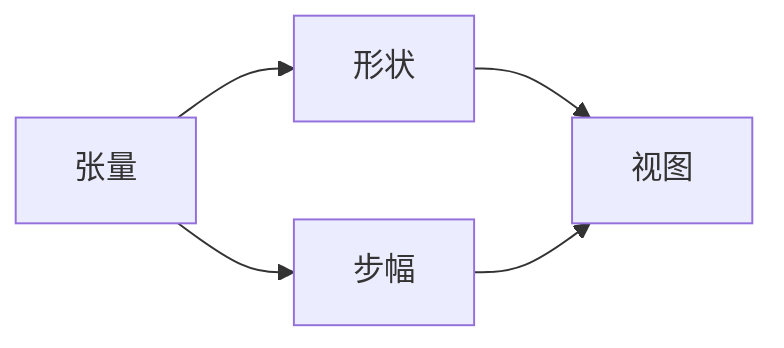

                 

# 张量操作精讲：形状、视图和步幅

> 关键词：张量,形状,视图,步幅,张量操作,PyTorch,Numpy,多维数组

## 1. 背景介绍

### 1.1 问题由来

张量（Tensor）是深度学习领域最重要的数据结构之一，它能够灵活地表示多维数组，为神经网络提供高效的计算接口。无论是用于深度学习框架，如PyTorch和TensorFlow，还是用于科学计算库，如Numpy和SciPy，张量的操作都是不可或缺的核心部分。

对于刚刚接触深度学习的开发者来说，张量的基本概念和操作常常是入门的一个巨大障碍。本博文旨在对张量的基本概念，尤其是其形状、视图和步幅等相关概念进行详细解析，并通过具体的代码实例来展示如何在实际项目中灵活应用这些概念。

### 1.2 问题核心关键点

张量操作是深度学习领域的基础，掌握了张量操作的精髓，不仅能够提升模型训练的效率，还能够深入理解深度学习框架的底层实现原理。本博文将重点介绍张量的形状、视图和步幅等关键概念，并结合具体的数学公式和代码实例进行详细讲解。

## 2. 核心概念与联系

### 2.1 核心概念概述

在进行张量操作前，首先需要理解以下几个关键概念：

- **张量（Tensor）**：一种N维数组，可以表示成 $T_{i_1,i_2,...,i_n}$ 的形式，其中 $i_1,i_2,...,i_n$ 分别表示张量在各个维度上的索引。

- **形状（Shape）**：张量的大小，通常表示为元组 $(n_1,n_2,...,n_k)$，其中 $n_1,n_2,...,n_k$ 分别表示张量在每个维度上的大小。

- **视图（View）**：两个或多个张量具有相同的形状和数据内容时，它们被认为拥有相同的视图。例如，两个张量可以通过相同的索引切片得到，即使它们的内存地址不同，它们也共享同一份数据。

- **步幅（Stride）**：张量的步幅描述了元素在内存中的存储方式。步幅通常表示为元组 $(s_1,s_2,...,s_k)$，其中 $s_1,s_2,...,s_k$ 分别表示张量在每个维度上的步幅。

### 2.2 核心概念原理和架构的 Mermaid 流程图



这个简单的流程图示意图说明了张量、形状、视图和步幅之间的联系。从左到右，张量的形状、视图和步幅共同决定了其存储方式和计算方式，从而影响其操作效率。

## 3. 核心算法原理 & 具体操作步骤

### 3.1 算法原理概述

张量的操作包括数据的索引、切片、拼接、转置等，这些操作都需要依赖张量的形状、视图和步幅等概念。理解和掌握这些概念，对于实现高效的张量操作至关重要。

### 3.2 算法步骤详解

以下将详细介绍如何使用形状、视图和步幅来操作张量，并以具体的代码实例进行展示。

#### 3.2.1 创建张量

在Python中，使用NumPy和PyTorch创建张量的基本方式如下：

```python
import numpy as np
import torch

# 使用NumPy创建张量
np_tensor = np.arange(12).reshape(2, 3, 2)
print(np_tensor)

# 使用PyTorch创建张量
torch_tensor = torch.tensor(np_tensor)
print(torch_tensor)
```

这里创建了一个大小为 $(2, 3, 2)$ 的张量，每个元素从 $0$ 开始递增，形状和数值与NumPy创建的张量相同。

#### 3.2.2 获取张量的形状和步幅

获取张量的形状和步幅是操作张量的第一步：

```python
# 获取NumPy张量的形状和步幅
np_shape = np_tensor.shape
np_strides = np_tensor.strides

# 获取PyTorch张量的形状和步幅
torch_shape = torch_tensor.size()
torch_strides = torch_tensor.strides()
```

在这里，使用 `shape` 和 `size` 获取张量的形状，使用 `strides` 和 `strides()` 获取张量的步幅。

#### 3.2.3 索引和切片操作

张量的索引和切片操作可以根据形状和步幅计算出具体的位置和值：

```python
# 使用NumPy进行索引和切片
print(np_tensor[0, 1, :])
print(np_tensor[:, 1, :])

# 使用PyTorch进行索引和切片
print(torch_tensor[:, 1, :])
print(torch_tensor[:, :, 1])
```

在这里，通过索引和切片获取张量的特定维度或行，结果与NumPy相同。

#### 3.2.4 视图和切片的联系

张量的切片操作可以产生视图，这意味着即使更改了切片后的张量，原始张量的值也会改变：

```python
# 使用NumPy创建视图
np_view = np_tensor[:, 1, :]
np_view[0, 0] = 100
print(np_tensor)

# 使用PyTorch创建视图
torch_view = torch_tensor[:, :, 1]
torch_view[0, 0] = 100
print(torch_tensor)
```

在这里，通过切片创建视图，然后修改视图中的元素，发现原始张量的对应元素也随之修改。

#### 3.2.5 步幅的计算和更新

步幅的计算可以通过形状和切片步幅计算得到，而步幅的更新也会影响切片的结果：

```python
# 计算步幅
np_strides = np_tensor.strides

# 更新步幅
np_view = np_tensor[:, 1, :]
np_view[0, 0] = 100
print(np_view)
print(np_strides)
```

在这里，通过计算和更新步幅，发现步幅的改变会影响视图中的元素。

### 3.3 算法优缺点

使用形状、视图和步幅进行张量操作有其优点，但也存在一些缺点：

#### 优点

- **灵活性高**：通过步幅和视图，可以实现多种多样的切片和修改操作。
- **性能高效**：合理设置步幅和形状可以显著提升计算和内存操作效率。
- **易于理解**：这些概念直观且易于理解，有助于初学者快速上手。

#### 缺点

- **计算复杂**：步幅的计算和更新相对复杂，容易出现错误。
- **内存占用大**：视图的使用可能会导致内存占用过大。
- **不够通用**：某些复杂的张量操作，如随机采样，可能无法直接通过形状、视图和步幅来实现。

### 3.4 算法应用领域

张量的形状、视图和步幅等概念，不仅在深度学习和科学计算中有广泛应用，也在图像处理、信号处理、信号处理等领域有重要应用。例如，在图像处理中，可以使用步幅来实现图像的裁剪、旋转和缩放等操作；在信号处理中，可以使用视图来实现信号的切片和重采样。

## 4. 数学模型和公式 & 详细讲解 & 举例说明

### 4.1 数学模型构建

张量的数学模型可以通过多维数组的形式来表示。例如，一个二维张量可以表示为：

$$
T = \begin{bmatrix}
a_{11} & a_{12} & a_{13} \\
a_{21} & a_{22} & a_{23} \\
a_{31} & a_{32} & a_{33}
\end{bmatrix}
$$

其中，$a_{ij}$ 表示张量在行和列上的索引值。

### 4.2 公式推导过程

假设有一个大小为 $(3,4,5)$ 的张量 $T$，其步幅为 $(s_1,s_2,s_3)$，则 $T$ 在索引 $(i,j,k)$ 上的值可以通过以下公式计算：

$$
T_{i,j,k} = T_{0,0,0} + (i\times s_1 + j\times s_2 + k\times s_3)
$$

其中，$T_{0,0,0}$ 表示张量在索引 $(0,0,0)$ 上的值。

### 4.3 案例分析与讲解

以一个具体的张量操作为例，假设有一个大小为 $(2,3,4)$ 的张量 $T$，其步幅为 $(s_1,s_2,s_3)$，我们希望计算 $T$ 在索引 $(1,2,3)$ 上的值：

$$
T_{1,2,3} = T_{0,0,0} + (1\times s_1 + 2\times s_2 + 3\times s_3)
$$

在实际应用中，张量的操作可以通过库函数实现，如NumPy的 `np.take` 和 `np.reshape`，以及PyTorch的 `torch.index_select` 和 `torch.reshape`。

## 5. 项目实践：代码实例和详细解释说明

### 5.1 开发环境搭建

在进行张量操作之前，需要安装NumPy和PyTorch等库。可以使用以下命令进行安装：

```bash
pip install numpy torch torchvision torchaudio
```

### 5.2 源代码详细实现

以下是一个使用NumPy和PyTorch进行张量操作的具体代码实现：

```python
import numpy as np
import torch

# 创建张量
np_tensor = np.arange(12).reshape(2, 3, 2)
torch_tensor = torch.tensor(np_tensor)

# 获取形状和步幅
np_shape = np_tensor.shape
np_strides = np_tensor.strides
torch_shape = torch_tensor.size()
torch_strides = torch_tensor.strides()

# 索引和切片
np_view = np_tensor[:, 1, :]
torch_view = torch_tensor[:, :, 1]

# 步幅的计算和更新
np_strides = np_view.strides
np_view[0, 0] = 100
print(np_view)
print(np_strides)
```

### 5.3 代码解读与分析

以上代码展示了如何使用NumPy和PyTorch进行张量的创建、形状和步幅的获取、视图和切片的创建以及步幅的计算和更新。通过这些操作，可以灵活地对张量进行各种形式的修改和计算。

## 6. 实际应用场景

### 6.1 机器学习

张量操作在机器学习中广泛应用，尤其是在深度学习模型训练中。例如，在卷积神经网络中，使用卷积操作实现特征提取时，就需要使用张量的步幅和形状来计算卷积核在输入张量上的移动步长和输出张量的形状。

### 6.2 图像处理

在图像处理中，张量的形状、视图和步幅可以用于实现图像的裁剪、旋转和缩放等操作。例如，使用卷积层进行图像特征提取时，卷积核的步幅和形状决定了其在输入图像上的滑动步长和输出特征图的大小。

### 6.3 自然语言处理

在自然语言处理中，张量的形状和步幅可以用于实现文本的切片和拼接操作。例如，在文本分类任务中，使用张量表示文本和标签的序列，并使用步幅和形状计算模型在不同位置上的输出。

## 7. 工具和资源推荐

### 7.1 学习资源推荐

为了深入理解张量的操作，以下是一些推荐的资源：

- 《深度学习入门之张量篇》：详细介绍了张量的基本概念和操作，适合初学者入门。
- 《Python数值计算基础》：讲解了NumPy和PyTorch库的使用方法，适合Python开发者学习。
- 《Numpy科学计算》：深入讲解了NumPy库的高级特性和应用实例，适合想要深入学习NumPy的开发者。

### 7.2 开发工具推荐

以下是一些常用的开发工具，可用于辅助张量操作的实践：

- Jupyter Notebook：开源的交互式编程环境，适合进行张量操作的实验和调试。
- PyCharm：流行的Python IDE，支持NumPy和PyTorch库的集成开发。
- Visual Studio Code：轻量级的代码编辑器，支持Python和NumPy的开发。

### 7.3 相关论文推荐

以下是一些关于张量操作的经典论文，推荐阅读：

- 《The Elements of Computing Systems》：介绍了多维数组和张量的基本概念，适合入门学习。
- 《NumPy: the fundamental package for scientific computing with Python》：讲解了NumPy库的使用方法，适合学习NumPy的开发者。
- 《Parallel and Sequential Tensor Operations for Deep Neural Networks》：探讨了张量操作的并行化实现方法，适合研究高性能计算的开发者。

## 8. 总结：未来发展趋势与挑战

### 8.1 研究成果总结

本博文详细介绍了张量的形状、视图和步幅等关键概念，并通过具体的代码实例展示了如何灵活应用这些概念进行张量操作。这些概念在深度学习和科学计算中有着广泛的应用，对理解深度学习模型的底层实现具有重要意义。

### 8.2 未来发展趋势

未来，随着深度学习技术的不断发展，张量操作将变得更加复杂和多样化。以下是一些可能的趋势：

- **分布式计算**：在大规模数据集和复杂模型训练中，分布式张量操作将变得更加重要。
- **异构计算**：异构计算技术的发展将使张量操作在不同类型的硬件上运行更加高效。
- **自适应张量**：自适应张量可以根据不同的数据和任务自动调整形状和步幅，提高计算效率。
- **可解释性张量**：为解决深度学习模型的可解释性问题，张量操作将更加注重结果的可解释性。

### 8.3 面临的挑战

尽管张量操作已经广泛应用于深度学习中，但也面临着一些挑战：

- **计算复杂度**：大规模张量操作可能需要大量的计算资源和时间。
- **内存管理**：张量操作需要合理管理内存，避免内存泄漏和溢出。
- **代码复用性**：张量操作代码的复用性需要得到提高，避免重复编写相似的代码。
- **多语言支持**：当前的张量操作主要在Python中实现，需要支持更多编程语言。

### 8.4 研究展望

未来，张量操作的研究将集中在以下几个方面：

- **分布式张量操作**：研究分布式计算环境下的张量操作，提高计算效率。
- **可解释性张量**：开发更加可解释的张量操作，解决深度学习模型的可解释性问题。
- **自适应张量**：研究自适应张量操作，提高计算效率和模型性能。
- **跨平台张量**：实现跨平台张量操作，支持更多的编程语言和硬件平台。

通过这些研究方向，张量操作将变得更加高效、灵活和可解释，更好地支持深度学习和科学计算的发展。

## 9. 附录：常见问题与解答

### Q1: 如何理解张量的步幅？

A: 张量的步幅是指元素在内存中的存储方式。在二维张量中，步幅描述了元素在行和列方向上的移动步长。例如，步幅为 $(1,2)$ 表示在行方向上移动一个元素，在列方向上移动两个元素。

### Q2: 为什么使用视图而不是直接修改原始张量？

A: 视图与原始张量共享同一份数据，可以直接修改视图中的元素而无需修改原始张量。这样可以避免不必要的内存复制，提高计算效率。

### Q3: 张量的形状和步幅如何影响计算效率？

A: 张量的形状决定了计算的复杂度，步幅决定了元素的存储方式，从而影响内存的访问速度。合理设置步幅和形状可以提高计算效率和内存访问速度。

### Q4: 如何理解张量的切片操作？

A: 张量的切片操作可以通过索引和步幅计算出具体的位置和值。例如，对于大小为 $(3,4,5)$ 的张量，切片操作 $(1,2,3)$ 表示在索引 $(1,2,3)$ 上的元素。

### Q5: 如何使用NumPy和PyTorch进行张量操作？

A: 使用NumPy和PyTorch库，可以方便地进行张量的创建、形状和步幅的获取、视图和切片的创建等操作。具体代码可以查阅相关文档和教程。

---

作者：禅与计算机程序设计艺术 / Zen and the Art of Computer Programming

