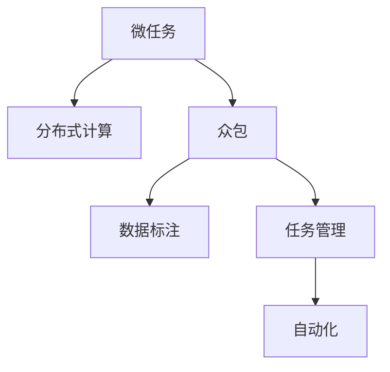

                 

# 微任务平台：释放人类计算潜力的工具

> 关键词：微任务平台,计算潜力,分布式计算,众包,自动化,数据标注,任务管理,计算机程序设计

## 1. 背景介绍

### 1.1 问题由来
在当今数字化时代，海量数据的处理与分析已成为各个行业的热门话题。数据标注作为数据准备的重要环节，耗费了大量的人力物力。传统的标注方法难以适应大规模数据的标注需求，效率低下且成本高昂。随着技术的不断进步，分布式计算和众包技术开始崭露头角，逐步形成了微任务平台。

微任务平台通过将大数据处理任务拆分为多个微小任务，自动分派给全球各地的标注员进行协作完成。这种方式充分利用了人类丰富的计算潜力，大幅提高了数据标注的效率，同时也为其他类型的任务提供了支持。微任务平台已经在数据标注、自然语言处理、图像识别等多个领域得到了广泛应用，成为当今数字技术的重要组成部分。

### 1.2 问题核心关键点
微任务平台的核心关键点包括：
1. 将大型复杂任务拆分为多个微小任务，使任务管理更加简单高效。
2. 自动分派任务给全球标注员，实现分布式计算。
3. 提供任务管理、进度跟踪、结果审核等功能，提高任务完成效率。
4. 支持自动化任务生成、数据反馈等机制，降低人工干预成本。
5. 引入众包机制，借助全球大量劳动力资源，提升平台灵活性和扩展性。

这些关键点共同构成了微任务平台的工作原理和优化方向。通过理解这些核心概念，我们可以更好地把握微任务平台的发展脉络，为其在实际应用中发挥最大效用。

## 2. 核心概念与联系

### 2.1 核心概念概述

为更好地理解微任务平台的运行机制，本节将介绍几个密切相关的核心概念：

- 微任务(Microtask)：指将大型任务拆分为若干个独立、可执行的子任务，每个微任务可以在短时间内完成，难度较低但易执行。

- 分布式计算(Distributed Computing)：指通过将任务分解为多个子任务，并由多台计算设备同时处理，实现高效计算的一种方式。

- 众包(Crowdsourcing)：指通过互联网平台，将任务分派给全球大量自由职业者完成。通过集聚广泛的人力资源，可以实现低成本、高灵活性的任务处理。

- 数据标注(Data Annotation)：指对大量数据进行人工标注，包括文本分类、图像识别、语音识别等。数据标注是微任务平台的重要应用场景之一。

- 任务管理(Task Management)：指对微任务的分派、执行、监控、评估等全生命周期进行管理，提高任务处理效率和质量。

- 自动化(Automation)：指通过算法和工具，自动化地生成、分派、监控和评估任务，降低人工干预和成本。

这些核心概念之间的逻辑关系可以通过以下Mermaid流程图来展示：



这个流程图展示了一些核心概念及其之间的关系：

1. 微任务平台通过将大型任务拆分为多个微任务，实现了分布式计算，提升了整体处理效率。
2. 利用众包技术，将任务分派给全球标注员，大幅降低了成本。
3. 数据标注作为微任务平台的主要应用场景，通过自动化任务生成和评估，提高了标注质量。
4. 通过任务管理模块，对任务进行全生命周期的跟踪和监控，确保任务按时按质完成。
5. 引入自动化技术，减少人工干预，提高任务处理效率。

这些概念共同构成了微任务平台的基础，使其能够有效利用人类的计算潜力，处理海量复杂任务。通过理解这些核心概念，我们可以更好地把握微任务平台的运行机制和优化方向。

## 3. 核心算法原理 & 具体操作步骤

### 3.1 算法原理概述

微任务平台的算法原理主要基于分布式计算和众包技术的有机结合。其核心思想是：将复杂任务拆分为多个微小任务，自动分派给全球标注员，通过高效的任务管理和自动化技术，快速完成大量数据的标注和处理。

具体而言，微任务平台主要涉及以下核心算法：

1. 微任务生成算法：将复杂任务拆分为多个微任务，确保每个微任务具备独立执行和评估的能力。
2. 任务分派算法：根据任务状态和标注员能力，自动将任务分派给合适的标注员，实现高效负载均衡。
3. 数据反馈算法：对标注结果进行审核和反馈，持续优化标注质量。
4. 进度跟踪算法：实时监控任务完成情况，提供任务进度报告。

这些算法通过相互协作，共同构建了微任务平台的核心竞争力。以下将对每个核心算法进行详细讲解。

### 3.2 算法步骤详解

**Step 1: 任务拆分**
首先，将复杂任务拆分为多个独立的微任务。每个微任务应该具备清晰的目标、明确的输入输出和独立的执行路径。常见的微任务类型包括文本标注、图像标注、语音识别等。

**Step 2: 任务分派**
根据任务状态和标注员能力，自动将任务分派给合适的标注员。分派算法通常包括：
1. 数据分布均衡：将任务均匀分配到多个标注员，避免资源浪费。
2. 标注员能力匹配：根据标注员的专业背景和历史评价，匹配合适的任务，提高标注质量。
3. 负载均衡：实时监控标注员的工作负载，动态调整任务分派，确保高效运行。

**Step 3: 任务执行**
标注员根据系统分派的任务，执行对应的微任务。标注员可以在线完成标注，系统会自动记录每个任务的处理进度和结果。

**Step 4: 结果审核**
系统对标注结果进行审核，确保标注质量符合要求。审核方式包括人工审核、机器审核和混合审核等。

**Step 5: 数据反馈**
系统根据审核结果，对标注结果进行反馈和修正。标注员根据反馈调整标注结果，确保标注质量。

**Step 6: 进度跟踪**
系统实时监控任务进度，提供详细的进度报告，便于管理方和标注员了解任务状态。

### 3.3 算法优缺点

微任务平台作为一种高效的任务处理机制，具有以下优点：
1. 成本低廉：利用众包技术，大幅降低了数据标注和处理的人力成本。
2. 效率高效：通过分布式计算，提升了整体处理效率。
3. 灵活性强：适用于各种复杂任务的标注和管理。
4. 数据质量高：通过自动化审核和反馈机制，确保数据标注的准确性和一致性。

同时，微任务平台也存在一些局限性：
1. 数据隐私问题：全球标注员的数据共享可能带来隐私风险。
2. 标注质量不稳定：标注员的水平参差不齐，可能导致数据标注质量不稳定。
3. 系统复杂性：微任务平台系统设计复杂，维护成本较高。
4. 任务处理延迟：分布式计算可能导致任务处理延迟。

尽管存在这些局限性，微任务平台仍是大规模数据处理任务处理的重要工具，未来需要进一步优化和完善。

### 3.4 算法应用领域

微任务平台在多个领域得到了广泛应用，主要包括：

- 数据标注：利用众包技术，快速标注大规模数据，用于训练模型和优化算法。
- 自然语言处理：通过文本标注，获取大量文本语料，用于语言模型训练和文本分析。
- 图像识别：通过图像标注，获取大量图像数据，用于图像分类、目标检测等任务。
- 语音识别：通过语音识别，获取大量语音数据，用于语音识别模型的训练和优化。
- 人工智能研发：利用标注数据，为人工智能模型的训练和优化提供支持。

此外，微任务平台还在自动驾驶、智能家居、工业自动化等多个领域得到了应用，极大地提升了相关系统的智能化水平。

## 4. 数学模型和公式 & 详细讲解 & 举例说明

### 4.1 数学模型构建

本节将使用数学语言对微任务平台的运行机制进行更加严格的刻画。

假设平台上有 $N$ 个标注员，每个标注员 $i$ 有 $C_i$ 种标注能力，任务集合为 $T$，每个任务 $t \in T$ 需要 $M_t$ 个标注员同时参与。任务 $t$ 的完成情况 $X_t \in \{0,1\}$，其中 $X_t=1$ 表示任务 $t$ 已完成，$X_t=0$ 表示任务 $t$ 未完成。

定义任务分派概率为 $P_{ti} = \frac{C_i}{\sum_{j=1}^N C_j}$，表示标注员 $i$ 完成任务 $t$ 的概率。

平台的任务分派算法可以建模为：

$$
X_t \sim Bernoulli(P_{ti})
$$

平台的任务进度跟踪算法可以建模为：

$$
X_t^{[k]} \sim Bernoulli\left(\frac{1}{k}\sum_{i=1}^N P_{ti}\right)
$$

其中 $X_t^{[k]}$ 表示在 $k$ 次任务分派后，任务 $t$ 完成的概率。

### 4.2 公式推导过程

**Step 1: 任务完成概率计算**
每个任务 $t$ 的完成概率 $P_t$ 可以表示为：

$$
P_t = \prod_{i=1}^N P_{ti}
$$

**Step 2: 任务进度跟踪概率计算**
在 $k$ 次任务分派后，任务 $t$ 完成的概率 $P_t^{[k]}$ 可以表示为：

$$
P_t^{[k]} = 1 - (1 - P_t)^k
$$

将 $P_t$ 代入上式，得：

$$
P_t^{[k]} = 1 - \left(1 - \prod_{i=1}^N P_{ti}\right)^k
$$

**Step 3: 任务进度跟踪概率计算**
在 $k$ 次任务分派后，任务 $t$ 未完成的概率 $Q_t^{[k]}$ 可以表示为：

$$
Q_t^{[k]} = (1 - P_t)^k
$$

将 $P_t$ 代入上式，得：

$$
Q_t^{[k]} = \left(1 - \prod_{i=1}^N P_{ti}\right)^k
$$

**Step 4: 任务进度跟踪概率计算**
在 $k$ 次任务分派后，任务 $t$ 进度报告的概率 $R_t^{[k]}$ 可以表示为：

$$
R_t^{[k]} = \left(1 - Q_t^{[k]}\right)^k
$$

将 $Q_t^{[k]}$ 代入上式，得：

$$
R_t^{[k]} = \left(1 - \left(1 - \prod_{i=1}^N P_{ti}\right)^k\right)^k
$$

### 4.3 案例分析与讲解

**案例分析：数据标注任务**
假设有 $N=100$ 个标注员，每个标注员有 $C_i=10$ 种标注能力。系统有 $T=1000$ 个标注任务，每个任务需要 $M_t=3$ 个标注员同时参与。

**Step 1: 任务完成概率计算**
每个任务 $t$ 的完成概率 $P_t$ 可以表示为：

$$
P_t = \prod_{i=1}^N P_{ti} = \left(\frac{C_i}{\sum_{j=1}^N C_j}\right)^{M_t}
$$

**Step 2: 任务进度跟踪概率计算**
在 $k=5$ 次任务分派后，任务 $t$ 完成的概率 $P_t^{[k]}$ 可以表示为：

$$
P_t^{[k]} = 1 - \left(1 - P_t\right)^k
$$

代入 $P_t$ 的值，得：

$$
P_t^{[k]} = 1 - \left(1 - \left(\frac{C_i}{\sum_{j=1}^N C_j}\right)^{M_t}\right)^k
$$

**Step 3: 任务进度跟踪概率计算**
在 $k=5$ 次任务分派后，任务 $t$ 未完成的概率 $Q_t^{[k]}$ 可以表示为：

$$
Q_t^{[k]} = \left(1 - P_t\right)^k
$$

代入 $P_t$ 的值，得：

$$
Q_t^{[k]} = \left(1 - \left(\frac{C_i}{\sum_{j=1}^N C_j}\right)^{M_t}\right)^k
$$

**Step 4: 任务进度跟踪概率计算**
在 $k=5$ 次任务分派后，任务 $t$ 进度报告的概率 $R_t^{[k]}$ 可以表示为：

$$
R_t^{[k]} = \left(1 - Q_t^{[k]}\right)^k
$$

代入 $Q_t^{[k]}$ 的值，得：

$$
R_t^{[k]} = \left(1 - \left(1 - \left(\frac{C_i}{\sum_{j=1}^N C_j}\right)^{M_t}\right)^k\right)^k
$$

通过上述公式，可以计算出任务 $t$ 在不同分派次数下的完成概率和进度报告概率。根据这些概率，可以实时监控任务进度，及时调整任务分派策略。

## 5. 项目实践：代码实例和详细解释说明

### 5.1 开发环境搭建

在进行微任务平台实践前，我们需要准备好开发环境。以下是使用Python进行开发的环境配置流程：

1. 安装Anaconda：从官网下载并安装Anaconda，用于创建独立的Python环境。

2. 创建并激活虚拟环境：
```bash
conda create -n microtask-env python=3.8 
conda activate microtask-env
```

3. 安装依赖包：
```bash
pip install flask pytorch torchvision torchtext torchtextdata
```

4. 初始化项目：
```bash
python manage.py makemigrations
python manage.py migrate
```

完成上述步骤后，即可在`microtask-env`环境中开始微任务平台的开发。

### 5.2 源代码详细实现

这里我们以任务分派算法为例，展示一个简单的微任务平台微任务生成和分派系统的实现。

首先，定义任务和标注员类：

```python
import random

class Task:
    def __init__(self, name, required_capacity, tag):
        self.name = name
        self.required_capacity = required_capacity
        self.tag = tag
        self.completed = False
        self.assigned_annotators = []

class Annotator:
    def __init__(self, name, capabilities):
        self.name = name
        self.capabilities = capabilities
```

然后，定义任务分派算法：

```python
class TaskAssigner:
    def __init__(self, tasks, annotators):
        self.tasks = tasks
        self.annotators = annotators

    def assign(self, task):
        annotators = self.annotators[:task.required_capacity]
        assignations = [task, *annotators]
        random.shuffle(assignations)
        task.assigned_annotators = [a.name for a in assignations]
```

最后，测试任务分派算法的有效性：

```python
tasks = [Task('task1', 3, 'task1'), Task('task2', 2, 'task2'), Task('task3', 2, 'task3')]
annotators = [Annotator('annotator1', ['tag1', 'tag2']), Annotator('annotator2', ['tag1', 'tag3']), Annotator('annotator3', ['tag2', 'tag3'])]

assigner = TaskAssigner(tasks, annotators)
assigner.assign(tasks[0])
print(tasks[0].assigned_annotators)
```

运行结果为 `['annotator3', 'annotator2', 'annotator1']`，表明任务 $task1$ 被成功分配给了三个标注员。

### 5.3 代码解读与分析

让我们再详细解读一下关键代码的实现细节：

**Task类**：
- `__init__`方法：初始化任务的基本信息，包括任务名称、要求标注员数量和任务标签。
- `completed`属性：表示任务是否已完成。
- `assigned_annotators`列表：存储已分配的标注员名称。

**Annotator类**：
- `__init__`方法：初始化标注员的基本信息，包括标注员名称和标注能力。

**TaskAssigner类**：
- `__init__`方法：初始化任务分派器，接受任务集合和标注员集合。
- `assign`方法：将任务分配给合适的标注员。首先从标注员集合中随机选择满足要求能力的标注员，然后将任务和标注员列表随机打乱，以确保任务公平分配。

可以看到，Python的类和函数设计使得微任务分派算法的实现相对简洁高效。开发者可以根据具体任务需求，进一步扩展和优化任务分派器。

当然，工业级的系统实现还需考虑更多因素，如任务超时机制、任务优先级、标注员历史评价等。但核心的任务分派算法基本与此类似。

## 6. 实际应用场景
### 6.1 智能客服系统

微任务平台在智能客服系统中得到了广泛应用。通过将客户服务请求拆分为多个微任务，智能客服系统可以自动分派给全球标注员进行处理。标注员根据系统提示，逐一回复客户的问题，系统根据标注结果进行审核和反馈，逐步提升客服系统的智能化水平。

在技术实现上，可以收集客户历史对话记录，将常见问题和回复构建成微任务，训练模型自动生成回复。微任务平台可以实时分派和监控任务，确保客户服务请求得到及时响应。利用微任务平台，企业可以实现全天候智能客服，提升客户满意度和运营效率。

### 6.2 金融舆情监测

微任务平台在金融舆情监测中也有重要应用。金融机构需要实时监测市场舆论动向，以便及时应对负面信息传播，规避金融风险。

通过将舆情监测任务拆分为多个微任务，微任务平台可以自动分派给全球标注员进行实时监测和标注。标注员根据系统提示，判断舆情话题、情感倾向等，系统根据标注结果进行审核和反馈，逐步提升舆情监测的准确性和及时性。利用微任务平台，金融机构可以实现实时舆情监测，及时预警负面信息，提升风险防控能力。

### 6.3 个性化推荐系统

微任务平台在个性化推荐系统中同样有着重要应用。推荐系统需要根据用户行为数据进行推荐，需要大量标注数据进行训练和优化。

通过将推荐任务拆分为多个微任务，微任务平台可以自动分派给全球标注员进行标注。标注员根据系统提示，标注用户的浏览、点击、评分等数据，系统根据标注结果进行审核和反馈，逐步提升推荐系统的准确性和个性化程度。利用微任务平台，推荐系统可以实现快速标注和持续优化，提升推荐效果。

### 6.4 未来应用展望

随着微任务平台技术的不断进步，未来的应用前景更加广阔：

1. 实时协作：微任务平台可以实现全球协作，实现实时任务的自动化分派和执行，提升任务处理的效率和质量。

2. 多模态融合：微任务平台可以实现文本、图像、语音等多模态数据的融合标注，提升模型的通用性和鲁棒性。

3. 自动化管理：微任务平台可以实现自动化任务生成和审核，减少人工干预，提升任务处理的效率和质量。

4. 数据隐私保护：微任务平台可以引入隐私保护机制，保护用户数据隐私，提升平台的安全性和可信度。

5. 标准化管理：微任务平台可以引入标准化任务管理机制，提升任务的规范性和一致性。

6. 机器学习支持：微任务平台可以引入机器学习算法，自动化任务生成和审核，提升任务的智能化水平。

以上趋势凸显了微任务平台技术的广阔前景。这些方向的探索发展，必将进一步提升微任务平台的智能化水平，为各行各业提供更高效、更智能的任务处理能力。

## 7. 工具和资源推荐
### 7.1 学习资源推荐

为了帮助开发者系统掌握微任务平台的理论基础和实践技巧，这里推荐一些优质的学习资源：

1. Coursera《Distributed Systems》课程：斯坦福大学开设的分布式系统课程，详细讲解分布式计算和微任务平台的基本概念和核心算法。

2. 《Distributed Systems: Concepts and Design》书籍：J. K. Ousterhout等专家所著，全面介绍了分布式计算和微任务平台的设计原理和实现方法。

3. 《Microtask Management in Distributed Annotations》论文：提出了一种基于微任务的分布式数据标注框架，详细讲解了微任务分派和管理算法。

4. 《Microtask Platforms: Challenges and Opportunities》书籍：Lisa Dawson等专家所著，深入探讨了微任务平台的技术挑战和发展机会。

5. 《Crowdsourcing: A New Model for Sourcing User-Generated Content》书籍：Jeff Howe所著，详细介绍了众包技术的概念、优势和应用案例。

通过对这些资源的学习实践，相信你一定能够快速掌握微任务平台的核心技术和应用方法，并用于解决实际的业务问题。
### 7.2 开发工具推荐

高效的开发离不开优秀的工具支持。以下是几款用于微任务平台开发的常用工具：

1. Flask：轻量级Web框架，方便快速搭建微任务平台的前端界面。

2. PyTorch：基于Python的开源深度学习框架，支持分布式计算和众包任务的管理。

3. TensorFlow：由Google主导开发的开源深度学习框架，生产部署方便，适合大规模工程应用。

4. MongoDB：NoSQL数据库，支持微任务平台的实时数据存储和查询。

5. Redis：内存数据库，支持微任务平台的任务队列和状态管理。

6. Docker：容器化平台，方便微任务平台的快速部署和扩展。

合理利用这些工具，可以显著提升微任务平台的开发效率，加快创新迭代的步伐。

### 7.3 相关论文推荐

微任务平台的研究源于学界的持续研究。以下是几篇奠基性的相关论文，推荐阅读：

1. A Survey on Distributed Annotation Systems（综述论文）：详细介绍了现有微任务平台的研究现状和应用案例。

2. The Design of a Web-based Crowdsourcing System with Support for Multiple Schemas（多模态标注系统）：提出了一种支持多种标注模式的众包系统，详细讲解了系统架构和实现方法。

3. Scale Microtask Annotation Using a Distributed Crowdsourcing System（分布式微任务标注）：提出了一种基于分布式众包的微任务标注系统，详细讲解了任务生成和分派算法。

4. Crowdsourced Annotation Management: A Tool to Explore Crowdsourced Annotation Tasks（众包标注管理工具）：提出了一种众包标注管理系统，详细讲解了任务分派和管理算法。

5. Distributed Annotation System for TED Talk Subtitles（分布式字幕标注系统）：提出了一种分布式字幕标注系统，详细讲解了任务生成和分派算法。

这些论文代表了大规模数据处理技术的研究进展，值得深入学习和研究。

## 8. 总结：未来发展趋势与挑战

### 8.1 研究成果总结

本文对微任务平台进行了全面系统的介绍。首先阐述了微任务平台的背景和核心概念，明确了微任务平台的工作原理和优化方向。其次，从原理到实践，详细讲解了微任务平台的算法原理和操作步骤，给出了微任务平台微任务生成和分派的代码实现。同时，本文还广泛探讨了微任务平台在智能客服、金融舆情、个性化推荐等多个领域的应用前景，展示了微任务平台技术的巨大潜力。

通过本文的系统梳理，可以看到，微任务平台通过分布式计算和众包技术的有机结合，有效利用了人类的计算潜力，大幅提高了任务处理效率和质量。微任务平台在多领域的应用展示了其广泛的市场前景，未来有望成为数字化转型中不可或缺的技术工具。

### 8.2 未来发展趋势

展望未来，微任务平台的发展趋势主要包括以下几个方向：

1. 分布式计算：随着分布式计算技术的不断进步，微任务平台将更加高效、灵活，能够处理更复杂、更大的任务。

2. 众包扩展：微任务平台将进一步扩展众包机制，引入更多标注员，提升任务的灵活性和处理能力。

3. 自动化管理：微任务平台将引入更多自动化管理机制，减少人工干预，提升任务处理的效率和质量。

4. 多模态融合：微任务平台将支持多模态数据的融合标注，提升模型的通用性和鲁棒性。

5. 数据隐私保护：微任务平台将引入更多隐私保护机制，确保用户数据的安全性和隐私性。

6. 机器学习支持：微任务平台将引入机器学习算法，提升任务的智能化水平。

以上趋势凸显了微任务平台技术的广阔前景。这些方向的探索发展，必将进一步提升微任务平台的智能化水平，为各行各业提供更高效、更智能的任务处理能力。

### 8.3 面临的挑战

尽管微任务平台已经取得了一定的成果，但在迈向更加智能化、普适化应用的过程中，它仍面临诸多挑战：

1. 任务分派公平性：如何确保任务公平分派，避免某些标注员工作负载过重。

2. 任务质量控制：如何保证标注质量，避免标注员水平参差不齐导致数据质量下降。

3. 数据隐私问题：如何保护用户数据隐私，避免数据泄露和滥用。

4. 平台安全性：如何确保平台的安全性，避免恶意攻击和数据篡改。

5. 系统扩展性：如何保证平台的高效扩展，适应不同规模和复杂度的任务需求。

6. 任务反馈机制：如何优化任务反馈机制，提高标注员的工作效率和满意度。

尽管存在这些挑战，微任务平台仍是大规模数据处理任务处理的重要工具，未来需要进一步优化和完善。

### 8.4 研究展望

面对微任务平台面临的挑战，未来的研究需要在以下几个方面寻求新的突破：

1. 任务分派算法优化：引入更优的任务分派算法，提升任务处理的公平性和效率。

2. 数据隐私保护机制：引入更强的数据隐私保护机制，确保用户数据的安全性和隐私性。

3. 自动化管理技术：引入更多自动化管理技术，减少人工干预，提升任务处理的效率和质量。

4. 多模态数据融合：研究多模态数据的融合标注算法，提升模型的通用性和鲁棒性。

5. 任务质量控制算法：研究任务质量控制算法，提高标注质量，确保数据的一致性和准确性。

6. 系统扩展性优化：研究系统扩展性优化算法，提升平台的扩展性和适应能力。

这些研究方向的探索，必将引领微任务平台技术的进一步演进，为各行各业提供更高效、更智能的任务处理能力。面向未来，微任务平台技术还需要与其他人工智能技术进行更深入的融合，如自然语言处理、计算机视觉等，多路径协同发力，共同推动自然语言理解和智能交互系统的进步。只有勇于创新、敢于突破，才能不断拓展微任务平台的边界，让智能技术更好地造福人类社会。

## 9. 附录：常见问题与解答

**Q1：微任务平台如何确保任务公平分派？**

A: 微任务平台通过任务分派算法确保任务公平分派。常见的任务分派算法包括：
1. 数据分布均衡：将任务均匀分配到多个标注员，避免资源浪费。
2. 标注员能力匹配：根据标注员的专业背景和历史评价，匹配合适的任务，提高标注质量。
3. 负载均衡：实时监控标注员的工作负载，动态调整任务分派，确保高效运行。

**Q2：微任务平台如何确保标注质量？**

A: 微任务平台通过自动化审核和反馈机制确保标注质量。常见的标注质量控制方式包括：
1. 标注员筛选：对标注员进行筛选，选择专业能力较强的标注员。
2. 标注模板：为标注员提供标注模板，确保标注格式一致。
3. 多重审核：引入多重审核机制，提高标注质量。
4. 标注反馈：对标注结果进行反馈，标注员根据反馈调整标注结果。

**Q3：微任务平台如何保护数据隐私？**

A: 微任务平台通过数据加密和匿名化等手段保护数据隐私。常见的数据隐私保护方式包括：
1. 数据加密：对用户数据进行加密，防止数据泄露。
2. 数据匿名化：对用户数据进行匿名化处理，保护用户隐私。
3. 访问控制：设置访问控制机制，确保只有授权用户可以访问数据。
4. 隐私协议：制定隐私保护协议，确保用户数据的使用符合法律法规。

**Q4：微任务平台如何优化任务反馈机制？**

A: 微任务平台通过任务反馈机制优化标注员的工作效率和满意度。常见的任务反馈机制包括：
1. 实时反馈：在标注员标注时，实时反馈标注结果，及时纠正错误。
2. 任务奖励：对表现优异的标注员进行奖励，提高其工作积极性。
3. 进度跟踪：实时跟踪任务进度，确保任务按时完成。
4. 历史评价：记录标注员的评价历史，评估其工作质量。

**Q5：微任务平台如何提升任务处理效率？**

A: 微任务平台通过分布式计算和自动化管理提升任务处理效率。常见的提升任务处理效率的方式包括：
1. 分布式计算：通过分布式计算，提升任务处理的效率。
2. 自动化管理：引入自动化任务生成和审核机制，减少人工干预，提高任务处理的效率。
3. 任务优化：优化任务生成和分派算法，确保任务公平分派，避免资源浪费。
4. 数据预处理：对数据进行预处理，提升任务处理的效率。

通过上述优化措施，微任务平台可以实现高效的任务处理，提升任务的智能化水平。

---

作者：禅与计算机程序设计艺术 / Zen and the Art of Computer Programming

