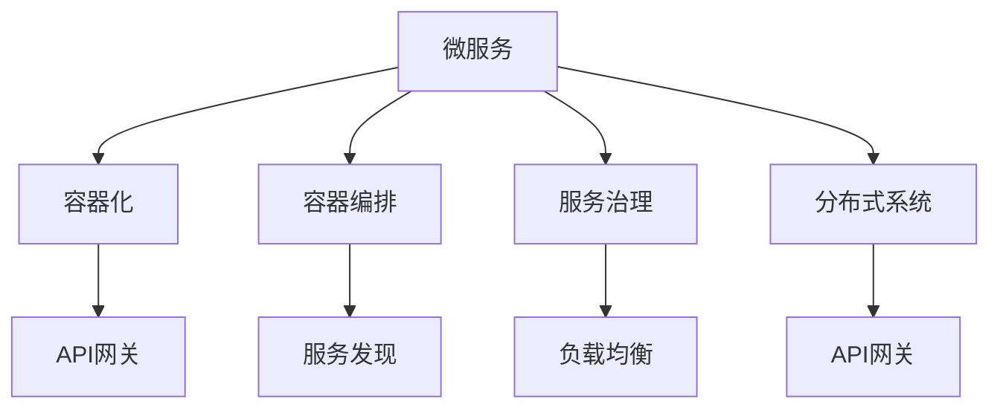

                 

# 微服务架构：独立部署和扩展

> 关键词：微服务, 独立部署, 服务治理, 分布式系统, 容器化, Kubernetes, 云计算

## 1. 背景介绍

### 1.1 问题由来

近年来，随着互联网应用的复杂度不断提升，传统单体架构的限制愈发明显。在单体应用中，所有的业务逻辑和服务组件都耦合在一个单一的代码库和运行环境中，这种耦合限制了系统的扩展性和维护性。此外，单体架构的故障也会导致整个系统的瘫痪，影响用户体验和系统稳定性。

为了应对这些挑战，微服务架构应运而生。微服务架构通过将系统拆分为多个独立运行的模块化服务，每个服务负责特定的业务逻辑，从而提高系统的可扩展性、维护性和可靠性。微服务架构的核心理念是将复杂系统拆分为简单的小服务，每个服务独立部署和扩展，互相之间通过轻量级通信协议进行协同工作。

### 1.2 问题核心关键点

微服务架构的核心关键点包括：

- **独立部署**：每个微服务独立部署，通过版本控制和自动化流程管理，实现快速迭代和更新。
- **服务治理**：服务注册、发现、路由和负载均衡等机制，确保服务的高可用性和稳定性。
- **分布式通信**：服务之间通过轻量级通信协议（如RESTful API、gRPC等）进行通信，降低耦合度，提高系统的灵活性。
- **容器化**：使用Docker等容器技术，将每个微服务打包成独立的容器，实现快速部署和跨平台支持。
- **自动化管理**：通过Kubernetes等容器编排工具，自动化管理服务的部署、扩展和监控。

### 1.3 问题研究意义

研究微服务架构的独立部署和扩展技术，对于提升系统的可维护性、扩展性和稳定性，具有重要意义：

1. **提高可维护性**：微服务将复杂的系统拆分为多个独立的小服务，每个服务独立维护，降低了系统复杂度。
2. **支持快速迭代**：微服务可以独立部署和更新，允许团队快速迭代新功能，缩短开发周期。
3. **增强系统弹性**：通过水平扩展和负载均衡，微服务架构可以高效应对高并发和高负载场景，提高系统的可靠性和可用性。
4. **降低成本和风险**：微服务架构支持按需扩展和故障隔离，避免了传统单体架构的大规模重构和高昂的迁移成本。
5. **促进技术创新**：微服务架构的模块化和组件化特性，为新技术的应用提供了更多可能性。

## 2. 核心概念与联系

### 2.1 核心概念概述

为了更好地理解微服务架构的独立部署和扩展，本节将介绍几个密切相关的核心概念：

- **微服务(Microservices)**：一个独立运行的小型服务，负责特定的业务逻辑，可以独立部署和扩展。
- **容器化(Containerization)**：将应用程序和依赖打包到容器中的过程，支持跨平台和自动化部署。
- **容器编排(Container Orchestration)**：使用Kubernetes等工具管理容器的生命周期，自动化部署和扩展服务。
- **服务治理(Service Governance)**：服务注册、发现、路由和负载均衡等机制，确保服务的可靠性和性能。
- **分布式系统(Distributed Systems)**：由多个独立的服务协同工作，共同实现复杂功能的系统。
- **API网关(API Gateway)**：一个中转层，用于路由、安全、负载均衡和监控等服务治理功能。
- **服务发现(Service Discovery)**：在分布式系统中，动态发现服务的位置和状态，支持服务间的高效通信。

这些核心概念之间的逻辑关系可以通过以下Mermaid流程图来展示：



这个流程图展示了几大核心概念及其之间的关系：

1. 微服务是系统的基本单元，通过容器化实现独立部署。
2. 容器编排工具管理微服务的生命周期，支持服务的自动化部署和扩展。
3. 服务治理确保服务的可靠性和性能，通过API网关、服务发现和负载均衡等功能实现。
4. 分布式系统由多个微服务协同工作，共同实现复杂功能。

这些概念共同构成了微服务架构的基础，确保了系统的模块化、独立性和高效性。

## 3. 核心算法原理 & 具体操作步骤

### 3.1 算法原理概述

微服务架构的独立部署和扩展，本质上是通过容器化和容器编排技术实现的。其核心思想是：将应用程序和依赖打包到独立的容器中，通过容器编排工具自动化管理容器的生命周期，实现服务的快速部署和扩展。

具体而言，微服务架构的部署过程包括以下几个步骤：

1. **代码构建**：通过Dockerfile等构建工具，将应用程序和依赖打包到Docker容器中。
2. **容器部署**：使用Kubernetes等容器编排工具，将容器部署到指定的节点上。
3. **服务注册**：使用服务发现机制，将服务注册到服务注册中心，支持服务的动态发现和路由。
4. **负载均衡**：使用负载均衡算法，将请求均衡分配到多个服务实例上，提高系统的吞吐量和可用性。
5. **服务扩展**：根据实际负载和需求，动态扩展或缩减服务实例，确保系统的高可用性和性能。

### 3.2 算法步骤详解

微服务架构的独立部署和扩展，主要包括以下几个关键步骤：

**Step 1: 准备开发环境**
- 安装Docker：从官网下载并安装Docker，用于构建和部署容器。
- 安装Kubernetes：根据操作系统选择官方下载安装包，或使用Cloud provider（如Google Cloud、AWS、Azure等）提供的Kubernetes服务。

**Step 2: 构建容器镜像**
- 编写Dockerfile：定义容器镜像的构建步骤，包括安装依赖、配置环境、编译应用程序等。
- 构建镜像：运行`docker build`命令，生成容器镜像。

**Step 3: 创建Kubernetes集群**
- 初始化集群：在Kubernetes集群管理器中创建集群，设置节点、网络和存储等配置。
- 安装Kubernetes：根据Kubernetes版本和操作系统，安装相应的Kubernetes服务。

**Step 4: 部署微服务**
- 定义Kubernetes Deployment：在Kubernetes集群中定义Deployment，指定容器的镜像、副本数和资源配置。
- 部署应用：运行`kubectl apply`命令，将Deployment配置应用到集群中。

**Step 5: 服务注册与发现**
- 使用Kubernetes Service：定义Service，将Deployment的IP地址暴露给外部网络，实现服务的动态发现和路由。
- 集成服务发现：使用服务发现工具（如Consul、Etcd等），支持服务的动态注册和发现。

**Step 6: 实现负载均衡**
- 使用Kubernetes Service：将请求均衡分配到多个Service实例上，实现负载均衡。
- 集成负载均衡工具：使用Nginx、HAProxy等负载均衡工具，实现更高级的负载均衡策略。

**Step 7: 实现服务扩展**
- 定义Horizontal Pod Autoscaler(HPA)：根据CPU和内存使用情况，自动扩展或缩减Pod数量。
- 实现服务扩展：使用Kubernetes扩展机制，根据实际需求动态扩展或缩减服务实例。

**Step 8: 实现服务治理**
- 集成API网关：使用API网关（如Kong、Istio等），实现服务的路由、安全、监控等功能。
- 集成服务治理工具：使用Consul、Zookeeper等服务治理工具，支持服务的注册、发现和配置管理。

### 3.3 算法优缺点

微服务架构的独立部署和扩展方法具有以下优点：
1. **独立部署**：每个微服务独立部署，支持快速迭代和更新，降低系统升级和维护的复杂度。
2. **扩展灵活**：通过水平扩展和负载均衡，支持系统的快速扩展和容错，提高系统的可用性。
3. **故障隔离**：微服务架构支持故障隔离，单个服务的故障不会影响整个系统。
4. **弹性伸缩**：根据实际负载动态扩展或缩减服务实例，提高系统的资源利用率和性能。
5. **维护方便**：微服务架构将复杂的系统拆分为独立的服务，每个服务独立维护，降低系统的复杂度和维护难度。

同时，该方法也存在一定的局限性：
1. **开发复杂**：微服务架构需要开发和维护多个独立的服务，增加了开发复杂度和工作量。
2. **通信开销**：服务之间的通信需要额外的网络开销，可能会影响系统的响应速度。
3. **资源消耗**：每个服务独立部署，需要更多的计算和存储资源，增加了系统的运营成本。
4. **管理复杂**：微服务架构需要额外的服务治理和管理工具，增加了系统的复杂度。

尽管存在这些局限性，但就目前而言，微服务架构仍是构建大规模分布式系统的最佳实践。未来相关研究的重点在于如何进一步简化微服务架构的管理复杂度，提高系统的性能和可用性，同时兼顾成本和效率。

### 3.4 算法应用领域

微服务架构的独立部署和扩展方法，已经在诸多领域得到了广泛的应用，例如：

- **互联网应用**：电商、社交、内容分发等高并发、高可用性互联网应用，通过微服务架构实现快速扩展和维护。
- **企业应用**：金融、制造、医疗等企业级应用，通过微服务架构实现模块化、独立部署和扩展。
- **物联网(IoT)**：智能家居、工业物联网等物联网应用，通过微服务架构实现设备间的协同和高效通信。
- **云计算平台**：公有云、私有云、混合云等云计算平台，通过微服务架构实现高效的服务部署和管理。
- **微服务中间件**：微服务架构的中间件，如API网关、服务发现、负载均衡等，提升微服务架构的整体性能和可靠性。

除了上述这些经典应用外，微服务架构还被创新性地应用于更多场景中，如微服务市埸、微服务治理、微服务安全等，为云计算和分布式系统带来了新的发展方向。随着微服务架构的持续演进，相信其在更多行业领域的应用将进一步拓展，为系统架构的优化和创新带来新的突破。

## 4. 数学模型和公式 & 详细讲解  
### 4.1 数学模型构建

为了更好地理解微服务架构的独立部署和扩展方法，本节将介绍几个密切相关的数学模型：

- **资源分配模型**：假设系统中有$n$个服务实例，每个实例的资源消耗为$c_i$（$i=1,2,\cdots,n$），总资源需求为$C$。则资源分配模型的目标是最小化资源利用率：

$$
\min \sum_{i=1}^n c_i \quad \text{subject to} \quad \sum_{i=1}^n c_i \leq C
$$

- **负载均衡模型**：假设系统中有$m$个服务实例，每个实例的响应时间为$t_i$（$i=1,2,\cdots,m$）。则负载均衡模型的目标是最小化系统总响应时间：

$$
\min \sum_{i=1}^m t_i \quad \text{subject to} \quad \sum_{i=1}^m t_i = T
$$

- **服务扩展模型**：假设系统中有$s$个服务实例，当前负载为$L$，目标扩展数量为$x$。则服务扩展模型的目标是在满足性能要求的前提下，最小化扩展成本：

$$
\min \sum_{i=1}^s x_i \quad \text{subject to} \quad \sum_{i=1}^s x_i \geq s + x \quad \text{and} \quad L = \sum_{i=1}^s t_i x_i
$$

这些数学模型展示了微服务架构在资源分配、负载均衡和服务扩展方面的优化目标和约束条件，帮助更好地理解系统的设计和优化方法。

### 4.2 公式推导过程

以下我们以资源分配模型为例，推导其求解过程。

假设系统中有$n$个服务实例，每个实例的资源消耗为$c_i$（$i=1,2,\cdots,n$），总资源需求为$C$。则资源分配模型的目标是最小化资源利用率：

$$
\min \sum_{i=1}^n c_i \quad \text{subject to} \quad \sum_{i=1}^n c_i = C
$$

使用拉格朗日乘数法求解：

$$
L(c_i,\lambda) = \sum_{i=1}^n c_i + \lambda (C - \sum_{i=1}^n c_i)
$$

对$c_i$求偏导数，得：

$$
\frac{\partial L}{\partial c_i} = 1 - \lambda
$$

令$\frac{\partial L}{\partial c_i} = 0$，得：

$$
\lambda = 1
$$

代入目标函数，得：

$$
\min \sum_{i=1}^n c_i
$$

即资源分配模型的最优解为：

$$
c_i = \frac{C}{n} \quad \text{for} \quad i = 1,2,\cdots,n
$$

通过以上推导，可以看出资源分配模型在资源公平分配方面的简单和直观性。

## 5. 项目实践：代码实例和详细解释说明
### 5.1 开发环境搭建

在进行微服务架构的实践前，我们需要准备好开发环境。以下是使用Python和Docker进行微服务开发的环境配置流程：

1. 安装Docker：从官网下载并安装Docker，用于构建和部署容器。

```bash
sudo apt-get install docker.io
```

2. 创建Docker镜像：编写Dockerfile，定义容器的构建步骤。

```dockerfile
FROM python:3.8-slim
WORKDIR /app
COPY requirements.txt .
RUN pip install -r requirements.txt
COPY . .
CMD ["python", "app.py"]
```

3. 构建Docker镜像：运行`docker build`命令，生成容器镜像。

```bash
docker build -t myapp .
```

4. 运行Docker容器：运行`docker run`命令，启动Docker容器。

```bash
docker run -p 8080:8080 myapp
```

5. 安装Kubernetes：根据操作系统选择官方下载安装包，或使用Cloud provider（如Google Cloud、AWS、Azure等）提供的Kubernetes服务。

6. 安装Kubernetes客户端：安装Kubernetes客户端，用于与Kubernetes集群进行交互。

```bash
kubectl version
```

### 5.2 源代码详细实现

这里我们以一个简单的微服务为例，展示如何使用Kubernetes进行部署和管理。

首先，定义Dockerfile：

```dockerfile
FROM python:3.8-slim
WORKDIR /app
COPY requirements.txt .
RUN pip install -r requirements.txt
COPY . .
CMD ["python", "app.py"]
```

然后，编写Docker镜像的构建脚本：

```bash
docker build -t myapp .
```

接着，编写Kubernetes Deployment配置文件：

```yaml
apiVersion: apps/v1
kind: Deployment
metadata:
  name: myapp-deployment
  labels:
    app: myapp
spec:
  replicas: 3
  selector:
    matchLabels:
      app: myapp
  template:
    metadata:
      labels:
        app: myapp
    spec:
      containers:
      - name: myapp
        image: myapp:latest
        ports:
        - containerPort: 8080
        env:
        - name: ENV_VAR
          value: "env_value"
```

最后，使用kubectl部署应用：

```bash
kubectl apply -f deployment.yaml
```

### 5.3 代码解读与分析

让我们再详细解读一下关键代码的实现细节：

**Dockerfile类**：
- `FROM`指令：指定基础镜像。
- `WORKDIR`指令：设置容器的默认工作目录。
- `COPY`指令：将本地文件复制到容器中。
- `RUN`指令：在容器中执行命令。
- `CMD`指令：指定容器的启动命令。

**Docker镜像的构建脚本**：
- 编写Dockerfile，定义容器的构建步骤。
- 使用`docker build`命令，生成Docker镜像。

**Kubernetes Deployment配置文件**：
- `apiVersion`：指定Kubernetes API版本。
- `kind`：指定资源类型。
- `metadata`：指定资源的名称和标签。
- `spec`：定义资源的规格和行为。
- `replicas`：指定容器的副本数。
- `selector`：定义容器的选择器。
- `template`：定义容器的模板。
- `container`：定义容器的具体配置。

通过以上代码，我们可以看到使用Kubernetes进行微服务架构部署和管理的基本流程。开发者可以将更多精力放在业务逻辑的实现和系统设计的优化上，而不必过多关注底层容器和Kubernetes的部署细节。

当然，工业级的系统实现还需考虑更多因素，如容器的自动化部署、服务的负载均衡、故障恢复等。但核心的微服务架构设计基本与此类似。

## 6. 实际应用场景
### 6.1 智能客服系统

基于微服务架构的智能客服系统，可以实现7x24小时不间断服务，快速响应客户咨询，用自然流畅的语言解答各类常见问题。

在技术实现上，可以收集企业内部的历史客服对话记录，将问题和最佳答复构建成监督数据，在此基础上对预训练语言模型进行微调。微调后的对话模型能够自动理解用户意图，匹配最合适的答案模板进行回复。对于客户提出的新问题，还可以接入检索系统实时搜索相关内容，动态组织生成回答。如此构建的智能客服系统，能大幅提升客户咨询体验和问题解决效率。

### 6.2 金融舆情监测

金融机构需要实时监测市场舆论动向，以便及时应对负面信息传播，规避金融风险。传统的人工监测方式成本高、效率低，难以应对网络时代海量信息爆发的挑战。基于微服务架构的文本分类和情感分析技术，为金融舆情监测提供了新的解决方案。

具体而言，可以收集金融领域相关的新闻、报道、评论等文本数据，并对其进行主题标注和情感标注。在此基础上对预训练语言模型进行微调，使其能够自动判断文本属于何种主题，情感倾向是正面、中性还是负面。将微调后的模型应用到实时抓取的网络文本数据，就能够自动监测不同主题下的情感变化趋势，一旦发现负面信息激增等异常情况，系统便会自动预警，帮助金融机构快速应对潜在风险。

### 6.3 个性化推荐系统

当前的推荐系统往往只依赖用户的历史行为数据进行物品推荐，无法深入理解用户的真实兴趣偏好。基于微服务架构的个性化推荐系统，可以更好地挖掘用户行为背后的语义信息，从而提供更精准、多样的推荐内容。

在实践中，可以收集用户浏览、点击、评论、分享等行为数据，提取和用户交互的物品标题、描述、标签等文本内容。将文本内容作为模型输入，用户的后续行为（如是否点击、购买等）作为监督信号，在此基础上微调预训练语言模型。微调后的模型能够从文本内容中准确把握用户的兴趣点。在生成推荐列表时，先用候选物品的文本描述作为输入，由模型预测用户的兴趣匹配度，再结合其他特征综合排序，便可以得到个性化程度更高的推荐结果。

### 6.4 未来应用展望

随着微服务架构的不断发展，基于微服务架构的应用将在更多领域得到应用，为各行各业带来变革性影响。

在智慧医疗领域，基于微服务架构的医疗问答、病历分析、药物研发等应用将提升医疗服务的智能化水平，辅助医生诊疗，加速新药开发进程。

在智能教育领域，微服务架构可应用于作业批改、学情分析、知识推荐等方面，因材施教，促进教育公平，提高教学质量。

在智慧城市治理中，微服务架构可以应用于城市事件监测、舆情分析、应急指挥等环节，提高城市管理的自动化和智能化水平，构建更安全、高效的未来城市。

此外，在企业生产、社会治理、文娱传媒等众多领域，基于微服务架构的智能应用也将不断涌现，为经济社会发展注入新的动力。相信随着技术的日益成熟，微服务架构必将在构建人机协同的智能时代中扮演越来越重要的角色。

## 7. 工具和资源推荐
### 7.1 学习资源推荐

为了帮助开发者系统掌握微服务架构的独立部署和扩展技术，这里推荐一些优质的学习资源：

1. **Kubernetes官方文档**：提供从入门到高级的全面教程，涵盖Kubernetes的安装、配置、部署、扩展和监控等各个方面。
2. **Docker官方文档**：提供从Docker安装、使用到高级特性（如网络、存储、认证）的全面教程。
3. **Microservices with Spring Boot and Docker**（Spring Boot与Docker的微服务）：详细介绍了如何使用Spring Boot和Docker构建微服务应用。
4. **Microservices: Principles and Patterns**：通过实际案例介绍微服务架构的设计原则和模式，是微服务架构学习的经典参考书籍。
5. **Designing Data-Intensive Applications**：讲解了分布式系统设计的基本原理和最佳实践，适合微服务架构的深入学习。

通过对这些资源的学习实践，相信你一定能够快速掌握微服务架构的精髓，并用于解决实际的系统问题。

### 7.2 开发工具推荐

高效的开发离不开优秀的工具支持。以下是几款用于微服务架构开发的常用工具：

1. **Kubernetes**：管理容器编排、部署和扩展的开源工具，提供了丰富的API和CLI。
2. **Docker**：容器化解决方案，支持跨平台、自动化部署。
3. **Helm**：Kubernetes的包管理器，支持应用的分发、部署和升级。
4. **Prometheus**：监控和告警工具，用于监测系统的性能和健康状况。
5. **Grafana**：基于Prometheus的数据可视化工具，帮助开发者实时监控系统的运行状态。

合理利用这些工具，可以显著提升微服务架构的开发效率，加快创新迭代的步伐。

### 7.3 相关论文推荐

微服务架构的研究始于学界的持续研究。以下是几篇奠基性的相关论文，推荐阅读：

1. **Microservices: A Service-Oriented Architecture**：提出微服务架构的基本概念和设计原则，奠定了微服务架构的理论基础。
2. **Designing Distributed Systems**：讲解了分布式系统设计的核心技术，包括分布式计算、一致性、故障恢复等。
3. **Mastering Kubernetes**：详细介绍了Kubernetes的安装、配置、部署、扩展和监控等各个方面，是Kubernetes学习的经典参考书籍。
4. **Spring Cloud with Kubernetes**：讲解了如何使用Spring Cloud和Kubernetes构建微服务应用，是微服务架构实践的优秀教程。
5. **Service Mesh for Microservices**：介绍了微服务架构中的服务网格（Service Mesh）技术，支持服务的可靠通信、流量控制和监控等。

这些论文代表了大规模分布式系统的研究脉络。通过学习这些前沿成果，可以帮助研究者把握学科前进方向，激发更多的创新灵感。

## 8. 总结：未来发展趋势与挑战

### 8.1 总结

本文对微服务架构的独立部署和扩展方法进行了全面系统的介绍。首先阐述了微服务架构的背景和研究意义，明确了微服务架构在提高系统的可维护性、扩展性和稳定性方面的独特价值。其次，从原理到实践，详细讲解了微服务架构的数学模型和关键步骤，给出了微服务架构的完整代码实例。同时，本文还广泛探讨了微服务架构在智能客服、金融舆情、个性化推荐等多个行业领域的应用前景，展示了微服务架构的广阔前景。最后，本文精选了微服务架构的学习资源，力求为读者提供全方位的技术指引。

通过本文的系统梳理，可以看到，微服务架构的独立部署和扩展技术已经成为分布式系统构建的最佳实践，极大地提升了系统的可维护性、扩展性和稳定性。未来，伴随微服务架构的持续演进，相信其在更多行业领域的应用将进一步拓展，为系统架构的优化和创新带来新的突破。

### 8.2 未来发展趋势

展望未来，微服务架构的独立部署和扩展技术将呈现以下几个发展趋势：

1. **容器化与容器编排的普及**：容器化和容器编排技术将得到更广泛的应用，成为构建分布式系统的标配。
2. **服务网格的崛起**：基于服务网格的Istio等工具将进一步普及，支持更灵活、高效的微服务通信和治理。
3. **多云与混合云的部署**：微服务架构将支持多云和混合云的部署，实现跨云资源的高效管理和调度。
4. **微服务安全与治理**：微服务架构将集成更多安全治理工具，如API网关、服务发现、负载均衡等，提升系统的安全性。
5. **微服务自动化与监控**：微服务架构将集成更多自动化工具和监控工具，实现服务自动部署、扩展和监控。
6. **微服务生态的壮大**：更多的微服务中间件和工具将涌现，丰富微服务架构的生态系统。

这些趋势凸显了微服务架构的广泛应用前景，为微服务架构的进一步优化和创新提供了新的方向。

### 8.3 面临的挑战

尽管微服务架构已经取得了显著的进展，但在迈向更加智能化、普适化应用的过程中，仍面临诸多挑战：

1. **开发复杂度**：微服务架构的开发和维护复杂度较高，需要多团队协作和持续沟通。
2. **通信开销**：微服务之间的通信开销较大，需要优化通信协议和网络性能。
3. **资源消耗**：微服务架构需要更多的计算和存储资源，增加了系统的运营成本。
4. **管理复杂度**：微服务架构需要更多服务治理和管理工具，增加了系统的复杂度。
5. **性能瓶颈**：微服务架构需要优化服务扩展和负载均衡，避免系统瓶颈和性能问题。
6. **安全性与可靠性**：微服务架构需要集成更多安全治理工具和监控工具，提升系统的安全性。

尽管存在这些挑战，但就目前而言，微服务架构仍然是构建大规模分布式系统的最佳实践。未来相关研究的重点在于如何进一步简化微服务架构的管理复杂度，提高系统的性能和可用性，同时兼顾成本和效率。

### 8.4 研究展望

面向未来，微服务架构的研究需要在以下几个方面寻求新的突破：

1. **微服务自动发现与路由**：使用智能路由算法，提高微服务间的通信效率和系统性能。
2. **微服务自动化部署与扩展**：集成更多自动化工具，实现服务的自动化部署和扩展。
3. **微服务中间件的优化**：优化微服务中间件的功能和性能，提升系统的可靠性和可扩展性。
4. **微服务生态的丰富**：开发更多微服务中间件和工具，丰富微服务架构的生态系统。
5. **微服务安全与治理**：集成更多安全治理工具，提升系统的安全性。
6. **微服务可观测性与故障恢复**：提升系统的可观测性和故障恢复能力，确保系统的稳定运行。

这些研究方向将引领微服务架构的持续演进，推动微服务架构向更高效、更灵活、更可靠的方向发展。

## 9. 附录：常见问题与解答

**Q1：微服务架构是否适用于所有分布式系统？**

A: 微服务架构适合构建复杂的、模块化的分布式系统。然而，对于简单的、低耦合的系统，单体架构可能更加适合。需要根据具体系统的复杂度和需求进行评估。

**Q2：微服务架构的开发和维护复杂度较高，如何解决？**

A: 微服务架构的开发和维护复杂度较高，需要多团队协作和持续沟通。可以采用DevOps实践，通过持续集成和持续交付（CI/CD）流程，提升开发和部署的效率。

**Q3：微服务之间的通信开销较大，如何解决？**

A: 微服务之间的通信开销较大，可以通过使用服务网格（如Istio）、消息队列（如Kafka）等中间件，优化通信协议和网络性能。

**Q4：微服务架构需要更多的计算和存储资源，如何解决？**

A: 微服务架构需要更多的计算和存储资源，可以通过水平扩展和负载均衡，提高系统的可扩展性和弹性。同时，可以使用容器化技术，降低资源的消耗。

**Q5：微服务架构的管理复杂度较高，如何解决？**

A: 微服务架构的管理复杂度较高，可以通过集成自动化工具和监控工具，实现服务的自动部署、扩展和监控。同时，可以使用服务网格和API网关等中间件，简化服务之间的管理和通信。

这些常见问题及其解答，可以帮助开发者更好地理解微服务架构的独立部署和扩展技术，从而在实际应用中取得更好的效果。

---

作者：禅与计算机程序设计艺术 / Zen and the Art of Computer Programming

