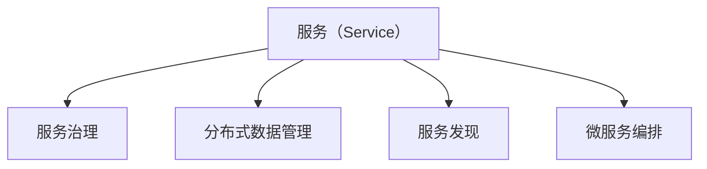

                 

# 微服务架构：解耦与扩展性的艺术

## 1. 背景介绍

### 1.1 问题由来

在过去的几十年里，随着信息技术的发展和互联网的普及，企业对软件系统的需求日益多样化，规模不断扩大，传统单体架构已经难以满足复杂和快速变化的业务需求。在这样一个背景下，微服务架构应运而生，成为云计算和分布式系统领域的重要发展方向。

微服务架构通过将大型应用拆分成一系列小型服务，使得每个服务独立运行、开发和部署，从而实现高内聚、低耦合的设计目标。微服务之间通过轻量级通信机制进行通信，可以更灵活地进行扩展和维护。

微服务架构最早由 Martin Fowler 在 2014 年的博客文章中提出，并迅速在业界引起了广泛关注。近年来，随着容器技术、服务网格、DevOps 等技术的发展，微服务架构的实现成本和运维复杂度得到了显著降低，进一步推动了其在大型企业的广泛应用。

### 1.2 问题核心关键点

微服务架构的核心思想是通过将大型应用拆分成多个小型服务，实现独立开发、独立部署、独立运行和独立扩展。这种设计思想不仅适用于大型企业应用，也可以应用于中小型创业公司，具有显著的灵活性和可扩展性。

微服务架构的核心概念包括：

- **服务拆分（Service Splitting）**：将大型应用拆分成多个小型服务，每个服务完成独立的业务逻辑。
- **服务自治（Service Autonomy）**：每个服务独立运行、独立部署、独立维护，不依赖其他服务。
- **通信协议（Communication Protocol）**：服务之间通过轻量级通信协议进行交互，如 HTTP/REST、gRPC 等。
- **分布式协调（Distributed Coordination）**：通过分布式协调机制（如 ZooKeeper、etcd、Consul 等）实现服务注册、服务发现和负载均衡。
- **容错设计（Fault Tolerance）**：通过服务治理、数据一致性控制等技术，确保微服务架构的健壮性和可靠性。
- **持续交付（Continuous Delivery）**：通过自动化工具和流程（如 CI/CD、DevOps 等），实现快速迭代和持续交付。

微服务架构的关键价值在于其高内聚、低耦合的特点，使得系统具备更好的灵活性、可扩展性和可维护性。同时，微服务架构也存在一定的复杂性和挑战，如服务间通信、数据一致性控制等。

## 2. 核心概念与联系

### 2.1 核心概念概述

为了更好地理解微服务架构的核心概念和原理，本节将介绍几个关键概念及其相互关系。

- **服务（Service）**：微服务架构的核心单元，独立运行、独立维护的小型应用。
- **服务治理（Service Governance）**：通过服务注册、服务发现、负载均衡等机制，实现服务的动态管理和调优。
- **分布式数据管理（Distributed Data Management）**：在微服务架构中，数据往往跨越多个服务，通过分布式数据库、分布式事务等技术进行管理。
- **服务发现（Service Discovery）**：在微服务架构中，服务之间的调用关系和依赖关系相对复杂，需要通过服务发现机制进行动态管理。
- **微服务编排（Microservice Orchestration）**：通过编排工具或编排平台，实现微服务之间的调用关系管理和业务流程编排。

这些概念之间的逻辑关系可以通过以下 Mermaid 流程图来展示：



这个流程图展示了大规模微服务架构的关键组件及其之间的关系：

1. 每个服务通过服务治理机制实现自治。
2. 数据管理通过分布式数据库和分布式事务等技术进行支持。
3. 服务之间的调用关系和服务发现机制实现动态管理。
4. 微服务编排工具或平台实现服务之间的业务流程编排。

这些组件共同构成了微服务架构的核心基础设施，使得系统具备更好的灵活性、可扩展性和可维护性。

## 3. 核心算法原理 & 具体操作步骤
### 3.1 算法原理概述

微服务架构的核心算法原理是基于服务拆分和自治的设计思想。通过将大型应用拆分成多个小型服务，每个服务独立运行、独立维护，从而实现高内聚、低耦合的设计目标。具体来说，微服务架构的算法原理包括以下几个方面：

- **服务拆分（Service Splitting）**：将大型应用按照业务逻辑进行拆分，每个服务负责独立的业务逻辑和数据管理。
- **服务自治（Service Autonomy）**：每个服务独立运行、独立部署、独立维护，不依赖其他服务。
- **轻量级通信协议（Lightweight Communication Protocol）**：通过轻量级通信协议实现服务之间的通信，如 HTTP/REST、gRPC 等。
- **服务发现（Service Discovery）**：通过服务发现机制实现服务的动态管理和调优，如 ZooKeeper、etcd、Consul 等。
- **分布式事务（Distributed Transactions）**：通过分布式事务控制，确保数据一致性和服务可靠性。
- **服务编排（Microservice Orchestration）**：通过编排工具或平台，实现服务之间的业务流程编排。

### 3.2 算法步骤详解

微服务架构的实施步骤一般包括以下几个关键步骤：

**Step 1: 设计服务边界**
- 根据业务需求和系统架构，设计服务边界，将大型应用拆分成多个小型服务。
- 每个服务需要明确其业务逻辑和数据管理范围，避免服务间过度的依赖和耦合。

**Step 2: 选择通信协议**
- 根据服务间的通信需求和系统架构，选择适合的通信协议，如 HTTP/REST、gRPC 等。
- 确保通信协议具有高可靠性、低延迟和易扩展的特点。

**Step 3: 实现服务治理**
- 实现服务注册、服务发现和负载均衡等机制，确保服务动态管理和调优。
- 选择合适的服务治理工具，如 ZooKeeper、etcd、Consul 等，实现服务的动态注册和发现。

**Step 4: 实现数据管理**
- 实现分布式数据库和分布式事务等技术，确保数据一致性和服务可靠性。
- 选择合适的分布式数据库和分布式事务控制方案，确保数据一致性和服务可靠性。

**Step 5: 实现编排工具**
- 实现微服务编排工具或平台，实现服务之间的业务流程编排。
- 选择合适的编排工具或平台，实现服务之间的编排和调度。

**Step 6: 部署和运维**
- 部署服务到生产环境，进行自动化部署和持续交付。
- 实现自动化运维和监控，确保服务的稳定性和可靠性。

### 3.3 算法优缺点

微服务架构的优点包括：

- **高内聚、低耦合**：每个服务独立运行、独立维护，具有高内聚、低耦合的特点，便于独立开发和独立部署。
- **灵活性高**：服务之间通过轻量级通信协议进行通信，可以灵活扩展和修改。
- **可扩展性高**：服务可以独立部署和独立扩展，可以更灵活地应对业务需求的变化。
- **可维护性高**：每个服务独立维护，便于故障定位和问题排查。

微服务架构的缺点包括：

- **复杂性高**：服务间通信和数据一致性控制相对复杂，需要更多的技术手段和工具支持。
- **运维难度大**：服务数量增多后，运维复杂度增加，需要更多的运维人员和工具支持。
- **性能损耗**：服务间通信和数据一致性控制会带来一定的性能损耗，需要优化和调优。

### 3.4 算法应用领域

微服务架构广泛应用于各种类型的企业应用中，包括金融、电商、医疗、教育等。具体应用领域包括：

- **金融行业**：用于交易系统、风控系统、支付系统等，实现高可用、高可靠的系统架构。
- **电商行业**：用于订单系统、库存系统、推荐系统等，实现灵活扩展和快速迭代。
- **医疗行业**：用于电子病历、医疗影像、远程医疗等，实现高效协作和数据共享。
- **教育行业**：用于在线教育、知识图谱、智能推荐等，实现个性化教育和知识服务。

## 4. 数学模型和公式 & 详细讲解 & 举例说明
### 4.1 数学模型构建

微服务架构的数学模型可以抽象为一个图（Graph），其中每个服务节点表示一个服务，节点间的边表示服务间的通信关系。服务之间的通信关系可以通过通信协议和服务发现机制进行描述。

设 $G=(V,E)$ 表示微服务架构的图模型，其中 $V$ 表示服务节点集，$E$ 表示服务间的通信边集。假设服务 $i$ 到服务 $j$ 的通信边权重为 $w_{ij}$，则通信关系可以表示为矩阵 $W$。

### 4.2 公式推导过程

设 $G=(V,E)$ 表示微服务架构的图模型，其中 $V$ 表示服务节点集，$E$ 表示服务间的通信边集。假设服务 $i$ 到服务 $j$ 的通信边权重为 $w_{ij}$，则通信关系可以表示为矩阵 $W$。

设 $X$ 表示服务的状态向量，其中 $x_i$ 表示服务 $i$ 的状态。则微服务架构的状态演化方程可以表示为：

$$
X_{t+1} = f(X_t, W)
$$

其中 $f$ 表示服务状态演化函数，$X_t$ 和 $X_{t+1}$ 分别表示服务在时间 $t$ 和 $t+1$ 的状态。服务状态演化函数可以表示为：

$$
X_{t+1} = A \cdot X_t + B \cdot X_t \cdot W
$$

其中 $A$ 表示服务状态演化矩阵，$B$ 表示服务间通信矩阵，$X_t$ 表示服务在时间 $t$ 的状态。服务间通信矩阵可以表示为：

$$
B = \begin{bmatrix}
0 & w_{1j} & 0 & \ldots & 0 \\
w_{i1} & 0 & w_{i2} & \ldots & 0 \\
0 & w_{i3} & 0 & \ldots & 0 \\
\vdots & \vdots & \vdots & \ddots & \vdots \\
0 & 0 & 0 & \ldots & 0
\end{bmatrix}
$$

### 4.3 案例分析与讲解

以金融行业的应用为例，设 $G=(V,E)$ 表示金融系统的微服务架构，其中 $V$ 表示服务节点集，$E$ 表示服务间的通信边集。假设服务 $i$ 到服务 $j$ 的通信边权重为 $w_{ij}$，则通信关系可以表示为矩阵 $W$。

设 $X$ 表示服务的状态向量，其中 $x_i$ 表示服务 $i$ 的状态。假设服务 $i$ 的状态演化方程可以表示为：

$$
X_{t+1} = f(X_t, W)
$$

其中 $f$ 表示服务状态演化函数，$X_t$ 和 $X_{t+1}$ 分别表示服务在时间 $t$ 和 $t+1$ 的状态。假设服务间通信矩阵可以表示为：

$$
B = \begin{bmatrix}
0 & w_{1j} & 0 & \ldots & 0 \\
w_{i1} & 0 & w_{i2} & \ldots & 0 \\
0 & w_{i3} & 0 & \ldots & 0 \\
\vdots & \vdots & \vdots & \ddots & \vdots \\
0 & 0 & 0 & \ldots & 0
\end{bmatrix}
$$

服务状态演化方程可以进一步表示为：

$$
X_{t+1} = A \cdot X_t + B \cdot X_t \cdot W
$$

假设 $A$ 表示服务状态演化矩阵，$B$ 表示服务间通信矩阵，$X_t$ 表示服务在时间 $t$ 的状态，则服务间通信矩阵可以表示为：

$$
B = \begin{bmatrix}
0 & w_{1j} & 0 & \ldots & 0 \\
w_{i1} & 0 & w_{i2} & \ldots & 0 \\
0 & w_{i3} & 0 & \ldots & 0 \\
\vdots & \vdots & \vdots & \ddots & \vdots \\
0 & 0 & 0 & \ldots & 0
\end{bmatrix}
$$

假设 $A$ 表示服务状态演化矩阵，$B$ 表示服务间通信矩阵，$X_t$ 表示服务在时间 $t$ 的状态，则服务间通信矩阵可以表示为：

$$
B = \begin{bmatrix}
0 & w_{1j} & 0 & \ldots & 0 \\
w_{i1} & 0 & w_{i2} & \ldots & 0 \\
0 & w_{i3} & 0 & \ldots & 0 \\
\vdots & \vdots & \vdots & \ddots & \vdots \\
0 & 0 & 0 & \ldots & 0
\end{bmatrix}
$$

通过上述分析，可以看出微服务架构的状态演化方程可以表示为：

$$
X_{t+1} = A \cdot X_t + B \cdot X_t \cdot W
$$

其中 $A$ 表示服务状态演化矩阵，$B$ 表示服务间通信矩阵，$X_t$ 表示服务在时间 $t$ 的状态。

## 5. 项目实践：代码实例和详细解释说明
### 5.1 开发环境搭建

在进行微服务架构开发前，我们需要准备好开发环境。以下是使用Java开发微服务架构的环境配置流程：

1. 安装JDK：从官网下载并安装Java Development Kit，用于编写Java程序。
2. 安装Maven：从官网下载并安装Maven，用于构建和管理Java项目。
3. 安装Spring Boot：从官网下载并安装Spring Boot，用于快速开发微服务架构。

完成上述步骤后，即可在本地机器上开始微服务架构的开发。

### 5.2 源代码详细实现

下面以金融行业的应用为例，给出使用Spring Boot构建微服务架构的Java代码实现。

首先，定义服务边界：

```java
package com.example.service;

import org.springframework.stereotype.Service;

@Service
public class AccountService {
    // 业务逻辑代码
}
```

然后，定义通信协议：

```java
package com.example.service;

import org.springframework.web.bind.annotation.GetMapping;
import org.springframework.web.bind.annotation.RequestParam;
import org.springframework.web.bind.annotation.RestController;

@RestController
public class PaymentService {
    @GetMapping("/payment")
    public String payment(@RequestParam String account) {
        // 调用AccountService进行支付操作
        return "Payment successful for account: " + account;
    }
}
```

接着，实现服务治理：

```java
package com.example.service;

import org.springframework.boot.SpringApplication;
import org.springframework.boot.autoconfigure.SpringBootApplication;
import org.springframework.cloud.netflix.eureka.EnableEurekaClient;
import org.springframework.cloud.netflix.eureka.EnableEurekaServer;

@SpringBootApplication
@EnableEurekaClient
@EnableEurekaServer
public class AccountServiceApplication {
    public static void main(String[] args) {
        SpringApplication.run(AccountServiceApplication.class, args);
    }
}
```

最后，启动服务并测试：

```java
package com.example.service;

import org.springframework.boot.SpringApplication;
import org.springframework.boot.autoconfigure.SpringBootApplication;
import org.springframework.cloud.netflix.eureka.EnableEurekaClient;
import org.springframework.cloud.netflix.eureka.EnableEurekaServer;

@SpringBootApplication
@EnableEurekaClient
@EnableEurekaServer
public class PaymentServiceApplication {
    public static void main(String[] args) {
        SpringApplication.run(PaymentServiceApplication.class, args);
    }
}
```

以上就是使用Spring Boot构建微服务架构的完整代码实现。可以看到，通过Spring Boot的快速开发和自动化配置功能，微服务架构的开发变得简洁高效。

### 5.3 代码解读与分析

让我们再详细解读一下关键代码的实现细节：

**AccountService类**：
- 定义了AccountService类，负责处理账户相关的业务逻辑。

**PaymentService类**：
- 定义了PaymentService类，使用Spring MVC注解进行RESTful风格的API开发，调用AccountService进行支付操作。

**AccountServiceApplication类**：
- 定义了微服务架构的入口类，使用Spring Boot的自动配置功能实现服务注册和发现。

**PaymentServiceApplication类**：
- 定义了另一个微服务架构的入口类，使用Spring Boot的自动配置功能实现服务注册和发现。

可以看到，Spring Boot的快速开发和自动化配置功能使得微服务架构的开发变得非常便捷。开发者可以将更多精力放在业务逻辑和算法实现上，而不必过多关注底层框架和工具的配置。

当然，工业级的系统实现还需考虑更多因素，如服务间的通信协议、数据一致性控制、服务治理等。但核心的微服务架构开发流程与上述示例类似。

## 6. 实际应用场景
### 6.1 智能客服系统

基于微服务架构的智能客服系统，可以提供更高效、更个性化的客户服务。传统的客服系统需要配备大量人力，高峰期响应缓慢，且一致性和专业性难以保证。而基于微服务架构的智能客服系统，可以通过分布式部署和弹性调度，实现7x24小时不间断服务，快速响应客户咨询，用自然流畅的语言解答各类常见问题。

在技术实现上，可以拆分客服系统为多个独立的服务，如用户登录服务、聊天服务、问题解答服务等。每个服务独立运行、独立维护，可以灵活应对不同的客户需求。通过服务发现和负载均衡机制，系统可以快速响应并分配请求，确保客户服务的高效性和稳定性。

### 6.2 金融舆情监测

金融行业对数据安全和实时性要求极高，传统的集中式架构难以满足需求。基于微服务架构的金融舆情监测系统，可以通过分布式部署和负载均衡机制，实现数据的实时采集和分析，及时发现舆情风险。

具体而言，可以将金融舆情监测系统拆分为数据采集服务、数据存储服务、数据分析服务等。数据采集服务负责实时采集网络数据，数据存储服务负责数据的高效存储和管理，数据分析服务负责数据的分析和预测。通过服务间通信和数据一致性控制机制，系统可以实时监测舆情变化，自动触发预警和报警，确保金融风险的有效控制。

### 6.3 个性化推荐系统

个性化推荐系统需要根据用户的兴趣和行为，推荐合适的商品或内容。传统的推荐系统往往只依赖用户的历史行为数据进行推荐，难以深入理解用户的真实兴趣偏好。基于微服务架构的推荐系统，可以更好地利用外部数据源和专家知识，实现更全面、更准确的推荐。

具体而言，可以将推荐系统拆分为用户行为分析服务、商品推荐服务、内容推荐服务等。用户行为分析服务负责处理用户的历史行为数据，商品推荐服务负责根据商品属性和用户兴趣推荐商品，内容推荐服务负责根据用户兴趣推荐相关内容。通过服务间通信和数据一致性控制机制，系统可以实现动态推荐和实时更新，提升推荐效果和用户体验。

### 6.4 未来应用展望

随着微服务架构的不断发展，未来其在各个领域的应用将更加广泛，带来更多创新和突破。

在智慧医疗领域，基于微服务架构的医疗信息系统可以实现高效协作和数据共享，提高医疗服务的智能化水平，辅助医生诊疗，加速新药开发进程。

在智能教育领域，基于微服务架构的在线教育平台可以实现灵活扩展和快速迭代，因材施教，促进教育公平，提高教学质量。

在智慧城市治理中，基于微服务架构的城市管理平台可以实现高效调度和资源优化，提高城市管理的自动化和智能化水平，构建更安全、高效的未来城市。

此外，在企业生产、社会治理、文娱传媒等众多领域，基于微服务架构的人工智能应用也将不断涌现，为传统行业数字化转型升级提供新的技术路径。相信随着微服务架构的不断演进，其在各个领域的应用将更加广泛，推动人工智能技术的深入落地。

## 7. 工具和资源推荐
### 7.1 学习资源推荐

为了帮助开发者系统掌握微服务架构的理论基础和实践技巧，这里推荐一些优质的学习资源：

1. 《微服务架构：从零到一》系列博文：由微服务架构专家撰写，深入浅出地介绍了微服务架构的基本概念、设计原则和实现方法。

2. Spring Cloud官方文档：Spring Cloud是微服务架构的优秀实践，官方文档提供了丰富的示例和实战指南，适合系统学习和参考。

3.《微服务：构建下一代企业应用架构》书籍：阿里技术专家所著，全面介绍了微服务架构的设计原则和实践方法，适合深度学习。

4. Kubernetes官方文档：Kubernetes是微服务架构的重要支撑，官方文档提供了完整的部署和运维指南，适合系统学习和实践。

5. 《Spring Boot实战》书籍：Spring Boot是微服务架构的快速开发工具，适合快速上手和实践。

通过对这些资源的学习实践，相信你一定能够系统掌握微服务架构的理论基础和实践技巧，并用于解决实际的业务问题。

### 7.2 开发工具推荐

高效的开发离不开优秀的工具支持。以下是几款用于微服务架构开发的常用工具：

1. Spring Boot：基于Spring框架的快速开发工具，适用于微服务架构的快速开发和自动化配置。

2. Kubernetes：开源的容器编排系统，适用于微服务架构的分布式部署和弹性调度。

3. Docker：开源的容器化技术，适用于微服务架构的应用打包和部署。

4. GitLab CI/CD：基于Git的自动化持续集成和持续部署工具，适用于微服务架构的自动化构建和部署。

5. Prometheus：开源的监控系统，适用于微服务架构的服务监控和告警。

6. Grafana：开源的可视化仪表盘系统，适用于微服务架构的监控和数据分析。

合理利用这些工具，可以显著提升微服务架构的开发效率，加快创新迭代的步伐。

### 7.3 相关论文推荐

微服务架构的不断发展得益于学界的持续研究。以下是几篇奠基性的相关论文，推荐阅读：

1. Design Patterns: Elements of Reusable Object-Oriented Software（设计模式：可重用面向对象软件的设计模式）：Gang of Four所著，介绍了面向对象设计的经典模式，包括微服务架构的设计模式。

2. Microservices: A service-oriented architecture and composition: A design pattern for distributed systems（微服务：面向服务的架构和组成：分布式系统的设计模式）：Martin Fowler所著，介绍了微服务架构的基本概念和设计模式。

3. Microservices: A systematic literature review and research agenda（微服务：系统性文献综述和研究计划）：Vishal Mohan等所著，对微服务架构的研究现状和未来方向进行了综述。

这些论文代表了大规模微服务架构的发展脉络。通过学习这些前沿成果，可以帮助研究者把握学科前进方向，激发更多的创新灵感。

## 8. 总结：未来发展趋势与挑战
### 8.1 总结

本文对微服务架构的核心概念和实践方法进行了全面系统的介绍。首先阐述了微服务架构的设计思想和核心价值，明确了服务拆分和自治的设计目标。其次，从原理到实践，详细讲解了微服务架构的算法原理和具体操作步骤，给出了微服务架构的完整代码实现。同时，本文还探讨了微服务架构在多个行业领域的应用前景，展示了微服务架构的广阔前景。

通过本文的系统梳理，可以看到，微服务架构通过将大型应用拆分成多个小型服务，实现高内聚、低耦合的设计目标，具备更好的灵活性、可扩展性和可维护性。未来，伴随微服务架构的不断发展，其在各个领域的应用将更加广泛，带来更多创新和突破。

### 8.2 未来发展趋势

展望未来，微服务架构的发展将呈现以下几个趋势：

1. **自动化和DevOps**：随着DevOps文化和工具的不断普及，微服务架构的自动化部署和持续交付将成为常态。自动化工具和流程可以显著提升开发和运维效率。

2. **容器化与Kubernetes**：容器技术如Docker和Kubernetes的广泛应用，使得微服务架构的部署和运维变得更加便捷和高效。

3. **服务网格（Service Mesh）**：服务网格如Istio、Consul Connect等，可以显著简化微服务间的通信和数据一致性控制，提升系统的稳定性和可靠性。

4. **分布式事务与数据库管理**：分布式数据库和分布式事务技术的发展，使得微服务架构的业务逻辑和数据管理更加高效和可靠。

5. **微服务编排与自动化**：微服务编排工具和服务自动化平台的发展，可以显著简化微服务之间的业务流程编排和调度。

6. **持续学习和自适应**：微服务架构可以通过持续学习和自适应机制，不断提高系统的适应性和鲁棒性。

这些趋势凸显了微服务架构的高效性、可扩展性和可维护性，推动微服务架构向更加智能和自适应的方向发展。

### 8.3 面临的挑战

尽管微服务架构已经取得了广泛应用，但在实际落地过程中，仍面临诸多挑战：

1. **服务间通信复杂性**：微服务架构的服务间通信复杂性较高，需要选择合适的通信协议和服务发现机制。

2. **数据一致性控制**：微服务架构的数据一致性控制相对复杂，需要选择合适的分布式数据库和分布式事务控制方案。

3. **运维复杂性**：微服务架构的运维复杂性较高，需要更多的运维人员和工具支持。

4. **性能损耗**：微服务架构的通信和数据一致性控制会带来一定的性能损耗，需要优化和调优。

5. **安全性问题**：微服务架构的服务调用和数据传输面临一定的安全风险，需要加强安全防护措施。

6. **资源管理**：微服务架构的资源管理复杂性较高，需要合理配置和优化资源。

### 8.4 研究展望

面对微服务架构面临的挑战，未来的研究需要在以下几个方面寻求新的突破：

1. **简化服务间通信**：通过服务网格等技术，简化微服务间的通信和数据一致性控制，提升系统的稳定性和可靠性。

2. **提升数据一致性控制**：通过分布式数据库和分布式事务技术，提升微服务架构的数据一致性控制能力。

3. **优化运维工具**：开发更高效的自动化运维工具和流程，提升微服务架构的运维效率和稳定性。

4. **性能优化**：通过优化通信协议和服务发现机制，降低微服务架构的性能损耗。

5. **加强安全性**：通过加密、认证等手段，提升微服务架构的安全性和可靠性。

6. **优化资源管理**：通过容器化技术和Kubernetes，优化微服务架构的资源管理，提升资源利用率。

这些研究方向的研究成果，将进一步推动微服务架构的发展，提升系统的性能和可靠性。

## 9. 附录：常见问题与解答

**Q1: 微服务架构中的服务间通信方式有哪些？**

A: 微服务架构中的服务间通信方式主要包括两种：

1. **RESTful API**：通过HTTP/REST协议进行服务调用，适用于微服务架构中轻量级通信场景。
2. **gRPC**：通过gRPC协议进行服务调用，适用于微服务架构中高性能和低延迟场景。

**Q2: 微服务架构中的分布式数据库有哪些？**

A: 微服务架构中的分布式数据库主要有两种：

1. **关系型数据库**：如MySQL、PostgreSQL、Oracle等，适用于数据结构清晰、关系明确的应用场景。
2. **NoSQL数据库**：如MongoDB、Cassandra、Redis等，适用于数据结构复杂、需要高并发和高可扩展性的应用场景。

**Q3: 微服务架构中的服务治理工具有哪些？**

A: 微服务架构中的服务治理工具主要有以下几种：

1. **ZooKeeper**：开源的分布式协调工具，适用于微服务架构中的服务注册和发现。
2. **etcd**：开源的分布式键值存储系统，适用于微服务架构中的服务注册和发现。
3. **Consul**：开源的服务发现和配置工具，适用于微服务架构中的服务注册和发现。

**Q4: 微服务架构中的持续集成和持续交付工具有哪些？**

A: 微服务架构中的持续集成和持续交付工具主要有以下几种：

1. **Jenkins**：开源的持续集成工具，适用于微服务架构中的自动化构建和测试。
2. **GitLab CI/CD**：基于Git的自动化持续集成和持续交付工具，适用于微服务架构中的自动化构建和部署。
3. **Travis CI**：基于Git的持续集成工具，适用于微服务架构中的自动化构建和测试。

**Q5: 微服务架构中的自动化运维工具有哪些？**

A: 微服务架构中的自动化运维工具主要有以下几种：

1. **Prometheus**：开源的监控系统，适用于微服务架构中的服务监控和告警。
2. **Grafana**：开源的可视化仪表盘系统，适用于微服务架构中的监控和数据分析。
3. **ELK Stack**：由Elasticsearch、Logstash和Kibana组成的数据分析平台，适用于微服务架构中的日志管理和数据分析。

通过以上资源的深入学习和实践，相信你一定能够系统掌握微服务架构的理论基础和实践技巧，并用于解决实际的业务问题。

---

作者：禅与计算机程序设计艺术 / Zen and the Art of Computer Programming

