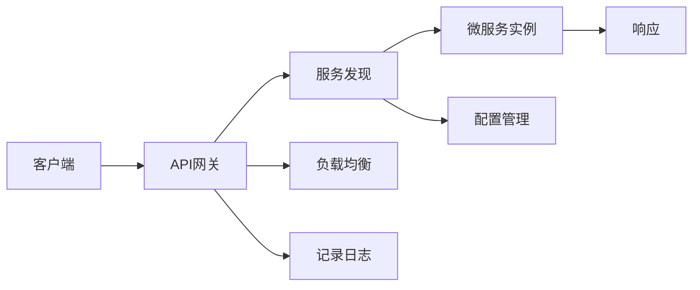

                 

# 微服务架构：设计、部署和管理

> 关键词：微服务,架构设计,容器化,DevOps,可观察性,云原生

## 1. 背景介绍

在当今互联网应用的不断发展中，微服务架构已成为企业应用程序开发的主流趋势。它通过将应用程序拆分为多个小而独立的模块（微服务），使开发、部署、扩展和管理变得更加灵活和高效。随着云计算和容器化技术的兴起，微服务架构正在不断演进，从最初的小规模应用逐步扩展到大型企业级系统。本文将深入探讨微服务架构的设计、部署和管理，旨在帮助读者全面理解微服务架构的原理和实践。

## 2. 核心概念与联系

### 2.1 核心概念概述

微服务架构是一种面向服务的架构风格，将应用程序拆分成一组小的、独立的服务，每个服务运行在独立的进程中，并使用轻量级机制进行通信。每个微服务负责特定的业务能力，并且可以独立部署、扩展和修改。

- **微服务**：微服务是微服务架构的基本组成单元，负责独立的业务功能。每个微服务通常是一个独立的进程，运行在自己的进程空间内，通过网络进行通信。
- **API网关**：负责将客户端请求路由到相应的微服务，同时对请求进行过滤、负载均衡、安全控制等。
- **服务发现**：用于管理微服务的注册和发现，确保各个服务能够动态地发现和调用其他服务。
- **配置管理**：用于管理微服务的配置，包括环境变量、外部配置文件等，使得微服务在不同环境中能够正常运行。
- **服务实例**：每个微服务实例是一个独立的进程，可以承载多个请求。
- **负载均衡**：用于分发请求到多个服务实例，以实现高可用性和扩展性。

这些核心概念通过一个Mermaid流程图进行可视化：



### 2.2 核心概念原理和架构的 Mermaid 流程图


## 3. 核心算法原理 & 具体操作步骤

### 3.1 算法原理概述

微服务架构的设计和部署是基于服务拆分、自治、分布式和自愈的原则进行的。每个微服务实例是一个独立的进程，运行在容器化环境中，通过网络进行通信。微服务架构的核心思想是将应用程序拆分为多个小而独立的服务，每个服务负责具体的业务功能，可以独立部署、扩展和修改，从而提高了系统的灵活性、可维护性和扩展性。

### 3.2 算法步骤详解

微服务架构的设计和部署主要包括以下几个步骤：

1. **服务拆分**：将应用程序划分为多个小而独立的服务，每个服务负责具体的业务功能。
2. **服务编排**：定义服务间的调用关系和依赖关系，确保服务之间的通信和服务之间的协调。
3. **容器化**：将每个微服务实例容器化，以便于部署和管理。
4. **服务发现**：实现微服务的注册和发现机制，确保各个服务能够动态地发现和调用其他服务。
5. **负载均衡**：实现请求的分发和负载均衡，确保系统的稳定性和扩展性。
6. **配置管理**：实现微服务的配置管理，确保微服务在不同环境中能够正常运行。
7. **日志记录和监控**：实现日志记录和监控，确保系统的可观察性和故障排查能力。

### 3.3 算法优缺点

**优点**：

- 灵活性：每个微服务可以独立部署、扩展和修改，提高了系统的灵活性和可维护性。
- 可扩展性：微服务架构可以动态扩展，通过增加或减少服务实例来应对负载变化。
- 高可用性：通过负载均衡和故障转移机制，微服务架构可以提高系统的可用性和容错性。
- 独立性：每个微服务实例是一个独立的进程，可以独立地进行开发、测试和部署。

**缺点**：

- 复杂性：微服务架构的设计和部署相对复杂，需要考虑多个服务的协作和协调。
- 网络开销：微服务架构通过网络进行通信，可能会增加网络开销和延迟。
- 安全性：微服务架构中各个服务之间的通信可能存在安全风险，需要进行严格的安全控制。

### 3.4 算法应用领域

微服务架构广泛应用于各种类型的企业级系统，如金融、电商、社交网络、物流等。它适用于需要高灵活性、高扩展性和高可用性的系统，能够满足不断变化的业务需求和用户需求。

## 4. 数学模型和公式 & 详细讲解 & 举例说明

### 4.1 数学模型构建

微服务架构的数学模型主要包括以下几个方面：

- **服务拆分模型**：将应用程序划分为多个服务，每个服务对应一个数学模型，描述其输入、输出和状态。
- **服务编排模型**：定义服务间的调用关系和依赖关系，确保服务之间的协作和协调。
- **负载均衡模型**：定义请求的分发策略，确保请求能够均衡地分配到各个服务实例。
- **配置管理模型**：定义微服务的配置，包括环境变量、外部配置文件等。

### 4.2 公式推导过程

以服务拆分模型为例，假设一个应用程序包含两个服务A和B，每个服务都有一个数学模型，用于描述其输入、输出和状态。服务A的数学模型为：

$$
y_A = f_A(x_A)
$$

服务B的数学模型为：

$$
y_B = f_B(x_B)
$$

其中，$x_A$ 和 $x_B$ 分别表示服务A和服务B的输入，$y_A$ 和 $y_B$ 分别表示服务A和服务B的输出。服务之间的调用关系可以表示为：

$$
y_A = g_A(x_A, y_B)
$$

其中，$g_A$ 表示服务A的调用函数，用于将服务A的输入和调用服务B的输出作为其输入。服务编排模型可以表示为：

$$
y_A = h_A(x_A, y_B)
$$

其中，$h_A$ 表示服务A的服务编排函数，用于将服务A的输入和调用服务B的输出作为其输入。

### 4.3 案例分析与讲解

假设有一个电商平台的订单管理系统，包含订单处理服务、支付服务、物流服务等多个微服务。订单处理服务用于处理订单信息，支付服务用于处理支付信息，物流服务用于处理物流信息。订单处理服务的数学模型可以表示为：

$$
y_{orders} = f_{orders}(x_{orders}, y_{payment}, y_{logistics})
$$

其中，$x_{orders}$ 表示订单信息，$y_{payment}$ 表示支付信息，$y_{logistics}$ 表示物流信息。支付服务的数学模型可以表示为：

$$
y_{payment} = f_{payment}(x_{payment}, y_{orders})
$$

其中，$x_{payment}$ 表示支付信息，$y_{orders}$ 表示订单信息。物流服务的数学模型可以表示为：

$$
y_{logistics} = f_{logistics}(x_{logistics}, y_{payment})
$$

其中，$x_{logistics}$ 表示物流信息，$y_{payment}$ 表示支付信息。

## 5. 项目实践：代码实例和详细解释说明

### 5.1 开发环境搭建

微服务架构的开发和部署通常需要以下工具和环境：

- **Docker**：用于容器化微服务实例。
- **Kubernetes**：用于管理和调度微服务实例。
- **Jenkins**：用于持续集成和自动化构建微服务。
- **ELK Stack**：用于日志记录和监控。
- **Prometheus**：用于监控微服务实例的性能和状态。

### 5.2 源代码详细实现

以下是一个使用Spring Cloud和Spring Boot实现的微服务架构示例：

```java
@RestController
@RequestMapping("/orders")
public class OrderController {
    
    @Autowired
    private OrderService orderService;
    
    @GetMapping("/{orderId}")
    public Order getOrderById(@PathVariable Long orderId) {
        return orderService.getOrderById(orderId);
    }
    
    @PostMapping
    public Order createOrder(@RequestBody Order order) {
        return orderService.createOrder(order);
    }
    
}
```

### 5.3 代码解读与分析

该示例代码实现了订单处理服务的API接口，使用Spring Cloud和Spring Boot框架进行微服务架构的开发和部署。

### 5.4 运行结果展示

在运行上述代码后，可以通过RESTful API接口进行订单信息的创建和查询，确保订单管理系统能够正常运行。

## 6. 实际应用场景

### 6.1 金融服务

金融服务是微服务架构的重要应用领域之一。通过微服务架构，金融服务可以实现高可用性、高扩展性和高安全性。例如，银行可以通过微服务架构实现贷款审批、风险评估、客户服务等。

### 6.2 电商零售

电商零售是微服务架构的典型应用场景。电商企业可以通过微服务架构实现商品管理、订单处理、支付服务、物流服务等。

### 6.3 物流系统

物流系统是微服务架构的另一个重要应用领域。物流公司可以通过微服务架构实现货物追踪、配送路线规划、库存管理等服务。

### 6.4 未来应用展望

微服务架构的未来发展趋势包括：

- **云原生**：微服务架构将更加深入地融入云原生环境，利用容器化、服务网格、声明式API等技术，实现更高的可扩展性和灵活性。
- **DevOps**：微服务架构将更加强调DevOps文化，通过持续集成、持续部署、自动化测试等技术，提高开发效率和系统可靠性。
- **可观察性**：微服务架构将更加注重系统的可观察性，通过日志记录、监控和告警等手段，提升系统的可运维性和故障诊断能力。

## 7. 工具和资源推荐

### 7.1 学习资源推荐

- **《微服务架构设计与实现》**：一本介绍微服务架构设计、实现和管理的经典书籍，适合初学者和有经验的开发者阅读。
- **《Spring Cloud for Netflix》**：介绍Spring Cloud和Netflix生态系统中的微服务架构，适合了解Spring Cloud的开发者阅读。
- **《Docker实战》**：一本介绍Docker容器技术的实用书籍，适合希望深入了解容器化的开发者阅读。

### 7.2 开发工具推荐

- **Spring Cloud**：一个开源的微服务架构框架，支持基于Spring Boot的应用程序开发和部署。
- **Docker**：一个开源的容器化平台，支持应用程序的快速部署和管理。
- **Kubernetes**：一个开源的容器编排平台，支持大规模微服务的部署和管理。
- **Jenkins**：一个开源的持续集成和持续部署工具，支持微服务的自动化构建和部署。

### 7.3 相关论文推荐

- **《微服务架构：设计、构建和部署》**：一篇介绍微服务架构设计、构建和部署的论文，适合了解微服务架构的开发者阅读。
- **《云原生微服务架构》**：一篇介绍云原生微服务架构的论文，适合了解微服务架构在云环境下的应用和优化。

## 8. 总结：未来发展趋势与挑战

### 8.1 研究成果总结

微服务架构在现代软件开发中扮演着越来越重要的角色。通过将应用程序拆分为多个小而独立的服务，微服务架构提高了系统的灵活性、可扩展性和可维护性。微服务架构的实现基于容器化、服务编排、负载均衡、配置管理、日志记录和监控等技术。

### 8.2 未来发展趋势

微服务架构的未来发展趋势包括云原生、DevOps、可观察性等。云原生技术将更加深入地融入微服务架构中，提升系统的可扩展性和灵活性。DevOps文化将更加强调持续集成、持续部署和自动化测试，提高开发效率和系统可靠性。可观察性技术将更加注重系统的日志记录、监控和告警，提升系统的可运维性和故障诊断能力。

### 8.3 面临的挑战

微服务架构在设计和部署过程中面临诸多挑战，包括复杂性、网络开销、安全性等。为应对这些挑战，需要采取有效的措施，如简化服务拆分、优化网络通信、加强安全控制等。

### 8.4 研究展望

未来的研究需要在以下几个方面进行探索：

- **简化服务拆分**：通过更加灵活和高效的服务拆分方法，提高微服务架构的可维护性和可扩展性。
- **优化网络通信**：通过优化网络通信和负载均衡，减少微服务架构的网络开销和延迟。
- **加强安全控制**：通过加强安全控制和加密技术，提高微服务架构的安全性和可靠性。

## 9. 附录：常见问题与解答

**Q1：微服务架构是否适用于所有类型的应用程序？**

A: 微服务架构适用于需要高灵活性、高扩展性和高可用性的应用程序。对于小型应用程序，微服务架构可能过于复杂和繁琐，可以考虑单体架构。

**Q2：微服务架构和单体架构相比，有哪些优缺点？**

A: 微服务架构的优点包括高灵活性、高扩展性和高可用性。缺点包括复杂性、网络开销和安全风险等。单体架构的优点包括简单性、低开销和低复杂性。缺点包括扩展性差、维护困难和故障传递等。

**Q3：微服务架构的负载均衡如何实现？**

A: 微服务架构的负载均衡可以通过负载均衡器（如Nginx、HAProxy等）实现。负载均衡器将请求均衡地分配到各个微服务实例，以实现高可用性和扩展性。

**Q4：微服务架构如何实现配置管理？**

A: 微服务架构的配置管理可以通过配置中心（如Spring Cloud Config）实现。配置中心集中管理微服务的配置，确保微服务在不同环境中能够正常运行。

**Q5：微服务架构的日志记录和监控如何实现？**

A: 微服务架构的日志记录和监控可以通过ELK Stack和Prometheus等工具实现。ELK Stack用于日志记录和聚合，Prometheus用于监控微服务实例的性能和状态。

---

作者：禅与计算机程序设计艺术 / Zen and the Art of Computer Programming

