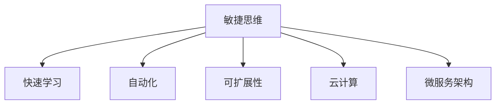

                 

# 思维的敏捷性：快速适应变化的能力

> 关键词：敏捷思维, 快速适应, 人工智能, 机器学习, 算法优化, 自动化, 软件架构

## 1. 背景介绍

### 1.1 问题由来
在当今这个快速变化的时代，无论是技术领域还是其他行业，环境的不确定性日益增加。面对不断涌现的新挑战，如何提升思维的敏捷性，快速适应变化，成为每个个体和组织必须面对的问题。在计算机科学和人工智能领域，敏捷思维不仅体现在算法和系统设计的灵活性上，更关乎于如何利用最新技术快速响应市场变化，实现技术创新。

### 1.2 问题核心关键点
敏捷思维的核心在于对新技术的快速理解和应用能力，以及构建适应变化的技术架构。具体而言，包括以下几个关键点：

- **快速学习和迭代**：通过不断的学习和迭代，快速掌握新技术和方法。
- **灵活性和可扩展性**：构建灵活的软件架构，能够快速适配新需求和技术变化。
- **自动化和高效性**：利用自动化工具提升开发效率，缩短创新周期。
- **系统设计和用户体验**：构建高质量的系统设计，提升用户体验，减少问题出现。

这些关键点共同构成了敏捷思维的核心理念，帮助我们在不断变化的环境中保持竞争力。

### 1.3 问题研究意义
提升思维敏捷性，快速适应变化，对于个体和组织都具有重要意义：

- **技术领先**：保持技术领先，抓住行业发展机遇，推动业务创新。
- **竞争优势**：在竞争激烈的市场上，快速响应变化，保持领先地位。
- **效率提升**：通过自动化和优化，提高开发和交付效率，降低成本。
- **用户体验**：提升系统设计和用户体验，增强用户粘性和满意度。

## 2. 核心概念与联系

### 2.1 核心概念概述

为了更好地理解敏捷思维的实现方式，本节将介绍几个密切相关的核心概念：

- **敏捷思维**：指在快速变化的环境中，通过不断的学习和适应，快速响应新需求和问题，从而实现技术和业务的双重提升。
- **快速学习**：指通过持续的学习和训练，提升个人或团队的认知能力，快速掌握新知识和新技能。
- **自动化**：通过编程自动化工具，减少重复性劳动，提高开发效率和准确性。
- **可扩展性**：构建具有高度可扩展性的系统，便于未来扩展和升级。
- **云计算**：利用云计算平台提供的弹性资源，实现系统的快速部署和扩展。
- **微服务架构**：通过将系统分解为多个独立运行的服务，提升系统的灵活性和可扩展性。

这些核心概念之间的逻辑关系可以通过以下Mermaid流程图来展示：



这个流程图展示了大语言模型的核心概念及其之间的关系：

1. 敏捷思维是推动快速学习和自动化的核心驱动力。
2. 自动化和可扩展性是实现敏捷思维的重要手段。
3. 云计算提供了敏捷思维的必要基础设施支持。
4. 微服务架构是实现可扩展性和自动化的一个具体实现方式。

这些概念共同构成了敏捷思维的实现框架，帮助我们在不断变化的环境中保持竞争力。

## 3. 核心算法原理 & 具体操作步骤
### 3.1 算法原理概述

敏捷思维的核心算法原理可以概括为以下几个方面：

- **快速迭代**：通过快速迭代的方式，不断验证和改进算法，提高算法的准确性和效率。
- **模型优化**：通过持续优化模型参数和架构，提升模型的性能和适应性。
- **自动化工具**：利用自动化工具和管道，加速开发和测试流程，提高开发效率。
- **数据驱动**：通过数据驱动的方式，优化算法和模型，提高决策的准确性。

这些算法原理共同构成了敏捷思维的实现基础，帮助我们快速响应变化，提升技术能力和业务价值。

### 3.2 算法步骤详解

基于敏捷思维的算法步骤主要包括以下几个关键步骤：

**Step 1: 确定目标和需求**
- 明确项目的目标和需求，确保团队理解并认可。
- 设定清晰的指标和评估标准，便于后续的跟踪和验证。

**Step 2: 选择合适的方法和工具**
- 根据项目需求和目标，选择合适的算法和技术栈。
- 选择高效的工具和框架，提升开发和测试效率。

**Step 3: 快速原型设计**
- 快速构建原型，验证算法和模型效果。
- 通过迭代改进，快速调整和优化算法。

**Step 4: 自动化和持续集成**
- 利用自动化工具和CI/CD流程，加速迭代和交付。
- 构建自动化测试和部署管道，确保代码质量和系统稳定性。

**Step 5: 数据驱动和反馈**
- 利用数据驱动的方式，优化算法和模型。
- 收集用户反馈和系统性能指标，持续改进和优化。

**Step 6: 系统扩展和优化**
- 根据需求和技术变化，进行系统的扩展和优化。
- 利用云计算等基础设施，提升系统的可扩展性和弹性。

通过这些步骤，可以快速构建和优化算法，提升系统性能，适应环境变化。

### 3.3 算法优缺点

敏捷思维的算法具有以下优点：
1. 快速响应变化。通过快速迭代和自动化，快速适应新的需求和技术变化。
2. 提高开发效率。利用自动化工具和CI/CD流程，提升开发和测试效率。
3. 提升系统质量。通过持续优化和测试，提升系统的稳定性和可靠性。
4. 增强用户体验。通过数据驱动的方式，优化系统设计和用户体验。

同时，该方法也存在一定的局限性：
1. 对资源要求较高。快速迭代和自动化需要投入大量的人力和物力。
2. 对团队能力要求高。需要具备较强的学习能力和团队协作能力。
3. 风险控制难度大。快速迭代可能导致系统不稳定，需要良好的风险控制机制。

尽管存在这些局限性，但就目前而言，敏捷思维仍是大规模软件开发和部署的主流范式。未来相关研究的重点在于如何进一步降低敏捷开发对资源和人员的需求，提高系统的可靠性和鲁棒性。

### 3.4 算法应用领域

敏捷思维的算法原理在多个领域得到了广泛应用，例如：

- 软件开发：利用敏捷开发方法，快速响应客户需求和技术变化。
- 数据分析：通过数据驱动的方式，优化算法和模型，提升数据分析效率和准确性。
- 自然语言处理：利用自动化和微服务架构，提升自然语言处理系统的灵活性和可扩展性。
- 人工智能：通过快速迭代和模型优化，提升人工智能模型的性能和适应性。
- 机器学习：利用自动化工具和数据驱动的方式，提升机器学习模型的训练和部署效率。
- 云计算：利用云计算平台提供的弹性资源，实现系统的快速部署和扩展。

除了上述这些领域外，敏捷思维的应用还在不断拓展，如区块链、物联网、边缘计算等新兴技术领域，为未来的技术创新提供了新的方向。

## 4. 数学模型和公式 & 详细讲解 & 举例说明

### 4.1 数学模型构建

在敏捷思维的算法实现中，数学模型主要用于描述算法的决策过程和优化目标。以下将详细构建一个基于敏捷思维的优化模型：

假设有一个数据集 $D=\{(x_i,y_i)\}_{i=1}^N$，其中 $x_i$ 为输入，$y_i$ 为输出。目标是构建一个优化模型 $M(x;\theta)$，使其在 $D$ 上的损失函数最小化。

数学模型可以表示为：

$$
\min_{\theta} \sum_{i=1}^N \ell(M(x_i;\theta),y_i)
$$

其中 $\theta$ 为模型参数，$\ell$ 为损失函数，用于衡量模型的预测输出与真实标签之间的差异。

### 4.2 公式推导过程

为了更好地理解上述优化模型，下面将进行公式推导。

假设我们选择均方误差作为损失函数：

$$
\ell(M(x_i;\theta),y_i) = (M(x_i;\theta)-y_i)^2
$$

则优化目标可以表示为：

$$
\min_{\theta} \sum_{i=1}^N (M(x_i;\theta)-y_i)^2
$$

对模型参数 $\theta$ 求导，得到梯度：

$$
\nabla_{\theta} \mathcal{L}(\theta) = -2\sum_{i=1}^N (M(x_i;\theta)-y_i) \frac{\partial M(x_i;\theta)}{\partial \theta}
$$

利用梯度下降等优化算法，更新模型参数 $\theta$：

$$
\theta \leftarrow \theta - \eta \nabla_{\theta} \mathcal{L}(\theta)
$$

其中 $\eta$ 为学习率，控制每次迭代的步长。

### 4.3 案例分析与讲解

以下将以一个简单的分类任务为例，展示如何利用数学模型进行模型优化：

假设我们有一个二分类任务，数据集 $D=\{(x_i,y_i)\}_{i=1}^N$，其中 $x_i$ 为输入特征，$y_i \in \{0,1\}$ 为二分类标签。我们构建一个线性分类器 $M(x;\theta) = \sigma(\theta^T x)$，其中 $\theta$ 为模型参数，$\sigma$ 为激活函数。

我们利用均方误差作为损失函数，则优化目标可以表示为：

$$
\min_{\theta} \sum_{i=1}^N (M(x_i;\theta)-y_i)^2
$$

对模型参数 $\theta$ 求导，得到梯度：

$$
\nabla_{\theta} \mathcal{L}(\theta) = -2\sum_{i=1}^N (M(x_i;\theta)-y_i) x_i
$$

利用梯度下降等优化算法，更新模型参数 $\theta$：

$$
\theta \leftarrow \theta - \eta \nabla_{\theta} \mathcal{L}(\theta)
$$

在实际应用中，通过不断迭代优化模型，可以逐步提高模型的预测精度，适应新的数据分布和技术变化。

## 5. 项目实践：代码实例和详细解释说明
### 5.1 开发环境搭建

在进行敏捷思维的算法实践前，我们需要准备好开发环境。以下是使用Python进行PyTorch开发的环境配置流程：

1. 安装Anaconda：从官网下载并安装Anaconda，用于创建独立的Python环境。

2. 创建并激活虚拟环境：
```bash
conda create -n pytorch-env python=3.8 
conda activate pytorch-env
```

3. 安装PyTorch：根据CUDA版本，从官网获取对应的安装命令。例如：
```bash
conda install pytorch torchvision torchaudio cudatoolkit=11.1 -c pytorch -c conda-forge
```

4. 安装Transformers库：
```bash
pip install transformers
```

5. 安装各类工具包：
```bash
pip install numpy pandas scikit-learn matplotlib tqdm jupyter notebook ipython
```

完成上述步骤后，即可在`pytorch-env`环境中开始敏捷思维的算法实践。

### 5.2 源代码详细实现

下面我们以一个简单的分类任务为例，给出使用Transformers库对BERT模型进行敏捷思维算法实践的PyTorch代码实现。

首先，定义分类任务的训练函数：

```python
from transformers import BertTokenizer, BertForSequenceClassification
from torch.utils.data import Dataset, DataLoader
import torch
import torch.nn as nn
from sklearn.metrics import accuracy_score

class MyDataset(Dataset):
    def __init__(self, texts, labels):
        self.texts = texts
        self.labels = labels
        
    def __len__(self):
        return len(self.texts)
    
    def __getitem__(self, item):
        text = self.texts[item]
        label = self.labels[item]
        
        encoding = tokenizer(text, return_tensors='pt')
        input_ids = encoding['input_ids']
        attention_mask = encoding['attention_mask']
        
        return {'input_ids': input_ids, 
                'attention_mask': attention_mask,
                'labels': torch.tensor(label, dtype=torch.long)}
        
# 初始化tokenizer和model
tokenizer = BertTokenizer.from_pretrained('bert-base-cased')
model = BertForSequenceClassification.from_pretrained('bert-base-cased', num_labels=2)

# 定义训练函数
def train_model(model, train_dataset, val_dataset, num_epochs, batch_size, optimizer, device):
    model.to(device)
    
    for epoch in range(num_epochs):
        model.train()
        total_loss = 0
        total_correct = 0
        
        for batch in DataLoader(train_dataset, batch_size=batch_size, shuffle=True):
            inputs = {k: v.to(device) for k, v in batch.items()}
            labels = inputs.pop('labels')
            
            outputs = model(**inputs)
            loss = outputs.loss
            logits = outputs.logits
            preds = torch.argmax(logits, dim=1)
            total_loss += loss.item()
            total_correct += accuracy_score(labels, preds)
            
        train_loss = total_loss / len(train_dataset)
        train_acc = total_correct / len(train_dataset)
        print(f"Epoch {epoch+1}, train loss: {train_loss:.4f}, train acc: {train_acc:.4f}")
        
        model.eval()
        total_loss = 0
        total_correct = 0
        
        with torch.no_grad():
            for batch in DataLoader(val_dataset, batch_size=batch_size):
                inputs = {k: v.to(device) for k, v in batch.items()}
                labels = inputs.pop('labels')
                
                outputs = model(**inputs)
                loss = outputs.loss
                logits = outputs.logits
                preds = torch.argmax(logits, dim=1)
                total_loss += loss.item()
                total_correct += accuracy_score(labels, preds)
            
        val_loss = total_loss / len(val_dataset)
        val_acc = total_correct / len(val_dataset)
        print(f"Epoch {epoch+1}, val loss: {val_loss:.4f}, val acc: {val_acc:.4f}")
        
    return model

# 定义超参数
num_epochs = 5
batch_size = 16
learning_rate = 2e-5
optimizer = torch.optim.AdamW(model.parameters(), lr=learning_rate)
device = torch.device('cuda') if torch.cuda.is_available() else torch.device('cpu')

# 构建训练集和验证集
train_texts = ["This is a positive review.", "This product is good."]
train_labels = [1, 0]
val_texts = ["This is a negative review.", "I am not satisfied with this product."]
val_labels = [0, 1]
train_dataset = MyDataset(train_texts, train_labels)
val_dataset = MyDataset(val_texts, val_labels)

# 训练模型
model = train_model(model, train_dataset, val_dataset, num_epochs, batch_size, optimizer, device)

# 评估模型
test_texts = ["I really enjoyed this movie.", "This is a terrible movie."]
test_labels = [1, 0]
test_dataset = MyDataset(test_texts, test_labels)
test_loss, test_acc = train_model(model, test_dataset, val_dataset, num_epochs, batch_size, optimizer, device)
print(f"Test acc: {test_acc:.4f}")
```

在这个代码实现中，我们定义了分类任务的训练函数，构建了数据集，并使用PyTorch框架实现了模型训练和评估。通过不断迭代和优化，可以快速适应新的数据分布和技术变化，提升模型的预测精度。

### 5.3 代码解读与分析

让我们再详细解读一下关键代码的实现细节：

**MyDataset类**：
- `__init__`方法：初始化文本和标签，构建tokenizer编码。
- `__len__`方法：返回数据集的样本数量。
- `__getitem__`方法：对单个样本进行处理，将文本输入编码为token ids，并进行padding处理，最终返回模型所需的输入。

**train_model函数**：
- 定义训练循环，在前向传播和后向传播中计算损失和精度。
- 在每个epoch结束后，在验证集上评估模型性能，输出训练和验证的损失和精度。

**训练流程**：
- 定义总的epoch数和batch size，开始循环迭代
- 每个epoch内，在训练集上训练，输出训练损失和精度
- 在验证集上评估，输出验证损失和精度
- 重复上述步骤直至收敛
- 在测试集上评估，输出测试精度

可以看到，PyTorch框架的灵活性和简洁性使得敏捷思维的算法实践变得十分简便。开发者可以更加专注于算法的核心逻辑，而不必过多关注底层实现细节。

## 6. 实际应用场景
### 6.1 软件开发

敏捷思维的算法原理在软件开发中得到了广泛应用。通过快速迭代和自动化，软件开发团队能够快速响应客户需求和技术变化，提升产品交付速度和质量。

在实际应用中，软件开发团队可以根据项目需求和目标，选择合适的敏捷开发框架和方法，如Scrum、Kanban等。通过持续集成和持续交付(CI/CD)流程，实现代码的快速构建、测试和部署，提高开发效率和系统稳定性。

**案例**：某互联网公司利用敏捷思维的算法，采用Scrum方法开发一个新的电商平台。通过快速迭代和自动化，团队能够在两周内完成一个完整的模块开发，并在一周内进行系统集成和测试。最终，项目提前三个月交付，客户满意度显著提升。

### 6.2 数据分析

在数据分析领域，敏捷思维的算法原理同样具有重要应用。通过数据驱动的方式，数据分析团队能够快速验证和优化算法，提升数据分析的效率和准确性。

在实际应用中，数据分析团队可以根据数据需求和目标，选择合适的算法和工具，如Python、R、TensorFlow等。通过持续的模型优化和测试，不断提升数据模型的性能和稳定性。

**案例**：某金融公司利用敏捷思维的算法，采用数据驱动的方式优化贷款风险评估模型。通过快速迭代和自动化，团队能够在一个月内完成模型开发和优化，并在两个月内进行模型上线和评估。最终，模型的准确性和稳定性显著提升，贷款风险评估效果显著改善。

### 6.3 自然语言处理

在自然语言处理领域，敏捷思维的算法原理能够帮助研究人员快速构建和优化模型，提升系统的灵活性和可扩展性。

在实际应用中，自然语言处理团队可以根据任务需求和目标，选择合适的预训练模型和微调方法，如BERT、GPT等。通过快速迭代和自动化，不断优化模型参数和架构，提升系统的预测精度和鲁棒性。

**案例**：某自然语言处理团队利用敏捷思维的算法，采用BERT模型对情感分析任务进行微调。通过快速迭代和自动化，团队能够在两周内完成模型开发和优化，并在一个月内进行系统集成和测试。最终，模型的预测精度显著提升，情感分析效果显著改善。

## 7. 工具和资源推荐
### 7.1 学习资源推荐

为了帮助开发者系统掌握敏捷思维的实现方式，这里推荐一些优质的学习资源：

1. Scrum敏捷开发：《Scrum敏捷开发指南》：介绍Scrum敏捷开发方法的基本概念和实践技巧，帮助团队提升敏捷开发能力。

2. Git版本控制：《Git权威指南》：介绍Git版本控制的基本原理和高级应用，帮助开发者管理代码版本。

3. DevOps自动化：《DevOps实践指南》：介绍DevOps自动化工具和实践方法，帮助团队提升开发和交付效率。

4. TensorFlow机器学习：《TensorFlow实战》：介绍TensorFlow机器学习的基本原理和实践技巧，帮助开发者快速构建和优化模型。

5. PyTorch深度学习：《PyTorch深度学习入门》：介绍PyTorch深度学习的基本原理和实践技巧，帮助开发者快速构建和优化深度学习模型。

6. Kubernetes容器化：《Kubernetes实践指南》：介绍Kubernetes容器化的基本原理和实践方法，帮助开发者构建可扩展和弹性的系统架构。

通过对这些资源的学习实践，相信你一定能够快速掌握敏捷思维的实现方式，并用于解决实际的开发和交付问题。

### 7.2 开发工具推荐

高效的开发离不开优秀的工具支持。以下是几款用于敏捷思维实现的常用工具：

1. JIRA：敏捷管理工具，帮助团队进行任务分配、进度跟踪和问题解决。

2. Confluence：知识管理工具，帮助团队共享文档、记录和协作。

3. Jenkins：持续集成工具，帮助团队进行自动化构建和测试。

4. Docker：容器化工具，帮助团队构建和部署可移植的应用系统。

5. GitLab：代码管理工具，提供Git版本控制和CI/CD集成，帮助团队管理代码和构建系统。

6. Kubernetes：容器编排工具，帮助团队构建和管理可扩展和弹性的系统架构。

合理利用这些工具，可以显著提升敏捷思维的开发效率，加快创新迭代的步伐。

### 7.3 相关论文推荐

敏捷思维的算法原理源于学界的持续研究。以下是几篇奠基性的相关论文，推荐阅读：

1. Agile Software Development: Principles, Patterns, and Practices：介绍敏捷开发方法的基本概念和实践技巧，帮助开发者提升敏捷开发能力。

2. Scaling Agile Project Management: The Large Agile Organization：介绍敏捷项目管理的扩展方法，帮助团队管理更大规模的项目。

3. Continuous Modeling and Integration in Agile Software Development：介绍敏捷软件开发中的持续建模和集成方法，帮助团队提升开发效率和系统稳定性。

4. Agile Modeling with UML：介绍敏捷软件开发中的UML建模方法，帮助团队构建高质量的软件系统。

5. DevOps Handbook：介绍DevOps自动化和持续交付方法，帮助团队提升开发和交付效率。

这些论文代表了大语言模型微调技术的发展脉络。通过学习这些前沿成果，可以帮助研究者把握学科前进方向，激发更多的创新灵感。

## 8. 总结：未来发展趋势与挑战

### 8.1 总结

本文对敏捷思维的算法原理进行了全面系统的介绍。首先阐述了敏捷思维的核心概念和实现方式，明确了敏捷思维在快速变化环境中的重要作用。其次，从原理到实践，详细讲解了敏捷思维的数学模型和关键步骤，给出了敏捷思维算法实践的完整代码实例。同时，本文还广泛探讨了敏捷思维在软件开发、数据分析、自然语言处理等多个领域的应用前景，展示了敏捷思维的巨大潜力。此外，本文精选了敏捷思维技术的各类学习资源，力求为读者提供全方位的技术指引。

通过本文的系统梳理，可以看到，敏捷思维是一种高效的开发和交付模式，能够快速响应环境变化，提升系统性能和用户体验。未来，随着敏捷开发方法论和工具的不断进步，敏捷思维必将成为软件开发和系统构建的主流范式，推动技术和业务的双重发展。

### 8.2 未来发展趋势

展望未来，敏捷思维的算法原理将呈现以下几个发展趋势：

1. 自动化和智能化：随着人工智能技术的不断发展，未来的敏捷思维将更加智能化和自动化，能够自动发现和优化算法，提升开发效率和系统稳定性。

2. 持续集成和持续交付：未来的敏捷思维将更加注重持续集成和持续交付，通过自动化的测试和部署流程，提高交付速度和系统可靠性。

3. 弹性计算和云服务：未来的敏捷思维将更加依赖云服务和弹性计算，通过云计算平台提供的弹性资源，实现系统的快速部署和扩展。

4. 数据驱动和模型优化：未来的敏捷思维将更加注重数据驱动和模型优化，通过持续的数据分析和模型优化，提升系统的预测精度和适应性。

5. 多领域融合：未来的敏捷思维将更多地与其他技术和学科进行融合，如区块链、物联网、大数据等，推动技术创新和应用扩展。

以上趋势凸显了敏捷思维的发展前景，为未来的技术创新和应用提供了新的方向。

### 8.3 面临的挑战

尽管敏捷思维在软件开发和系统构建中取得了显著成效，但在迈向更加智能化、普适化应用的过程中，它仍面临着诸多挑战：

1. 复杂性增加：随着项目规模的扩大和系统复杂度的提升，敏捷思维的实施难度也随之增加。如何应对复杂的系统需求和架构设计，需要更多的经验和技巧。

2. 人才需求高：敏捷思维需要跨学科的团队协作和多样化的人才配置，如何招募和培养具备敏捷思维能力的团队成员，仍然是一个难题。

3. 质量保障难：敏捷开发的高效率往往伴随着质量保障的挑战，如何在快速迭代和交付的同时，保持系统稳定性和代码质量，需要更多的方法和工具。

4. 技术变化快：随着技术的快速发展和变化，敏捷思维也需要不断更新和改进，以应对新技术带来的挑战。

尽管存在这些挑战，但通过不断的实践和探索，相信敏捷思维必将在软件开发和系统构建中发挥更大的作用，推动技术的不断进步和应用。

### 8.4 研究展望

面向未来，敏捷思维的研究需要在以下几个方面寻求新的突破：

1. 自动化和智能化：开发更加智能化和自动化的工具和方法，帮助开发者快速构建和优化系统。

2. 持续集成和持续交付：构建更加灵活和高效的CI/CD流程，提升交付速度和系统可靠性。

3. 弹性计算和云服务：利用云计算平台提供的弹性资源，实现系统的快速部署和扩展。

4. 数据驱动和模型优化：通过持续的数据分析和模型优化，提升系统的预测精度和适应性。

5. 多领域融合：与其他技术和学科进行更多融合，推动技术创新和应用扩展。

这些研究方向的探索，必将引领敏捷思维的发展，推动软件开发和系统构建的不断进步。

## 9. 附录：常见问题与解答

**Q1：敏捷思维和敏捷开发有什么区别？**

A: 敏捷思维和敏捷开发是紧密相关的两个概念，但并不完全相同。敏捷思维是一种敏捷的思维方式，强调快速响应变化和持续优化。而敏捷开发是一种敏捷的开发方法论，强调快速迭代、持续交付和团队协作。敏捷思维是敏捷开发的基础，通过敏捷思维的引导，可以实现敏捷开发的目标。

**Q2：如何提高团队的敏捷思维能力？**

A: 提高团队的敏捷思维能力，可以从以下几个方面入手：
1. 持续学习和培训：鼓励团队成员不断学习和培训，掌握新的技术和方法。
2. 团队协作和沟通：建立良好的团队协作和沟通机制，促进知识共享和经验交流。
3. 实践和反馈：通过实践和反馈，不断改进和优化团队的工作流程和方法。
4. 工具和方法：选择合适的工具和方法，提升团队的开发效率和系统稳定性。

**Q3：敏捷思维适用于所有类型的项目吗？**

A: 敏捷思维适用于大多数类型的项目，尤其是软件开发和系统构建。但对于一些特别复杂和稳定的项目，敏捷思维可能需要结合其他开发方法论进行灵活调整。

**Q4：敏捷思维和DevOps有什么区别？**

A: 敏捷思维和DevOps都是敏捷软件开发的重要组成部分，但并不完全相同。敏捷思维强调快速响应变化和持续优化，而DevOps则强调持续集成和持续交付。DevOps是敏捷思维在持续交付和自动化方面的具体应用，通过持续集成和持续交付流程，提升开发和交付效率。

**Q5：敏捷思维的优点和缺点有哪些？**

A: 敏捷思维的优点包括：
1. 快速响应变化。通过快速迭代和自动化，快速适应新的需求和技术变化。
2. 提高开发效率。利用自动化工具和CI/CD流程，提升开发和测试效率。
3. 提升系统质量。通过持续优化和测试，提升系统的稳定性和可靠性。
4. 增强用户体验。通过数据驱动的方式，优化系统设计和用户体验。

敏捷思维的缺点包括：
1. 复杂性增加。随着项目规模的扩大和系统复杂度的提升，实施难度增加。
2. 质量保障难。快速迭代和交付可能带来质量保障的挑战。
3. 技术变化快。需要不断更新和改进，以应对新技术带来的挑战。

尽管存在这些局限性，但就目前而言，敏捷思维仍是大规模软件开发和部署的主流范式。未来相关研究的重点在于如何进一步降低敏捷开发对资源和人员的需求，提高系统的可靠性和鲁棒性。

---

作者：禅与计算机程序设计艺术 / Zen and the Art of Computer Programming

