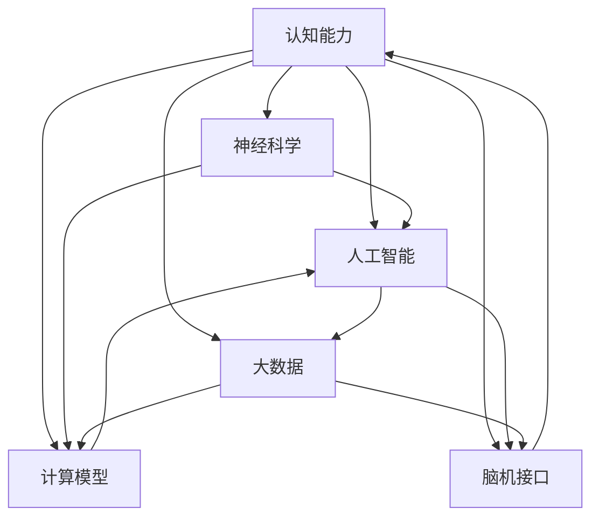

                 

# 思维训练：提升认知能力的实践方法

> 关键词：认知能力,思维训练,神经科学,人工智能,深度学习,大数据,计算模型,脑机接口,实践方法

## 1. 背景介绍

### 1.1 问题由来
认知能力的提升一直是人类社会发展的重要推动力之一。无论是科学研究、艺术创作还是技术创新，优秀的认知能力都是成功的关键因素。然而，在现代社会，由于信息爆炸和高速发展的科技，人们对认知能力的需求变得前所未有的高。传统的认知训练方法，如阅读、做题等，已无法满足日益增长的需求。因此，如何高效、科学地提升认知能力，成为了一个亟待解决的问题。

近年来，随着人工智能和大数据技术的发展，越来越多的科研人员开始探索利用计算机技术来提升认知能力。这些研究涵盖了神经科学、认知科学、人工智能等多个领域，从科学原理到实践应用，均取得了显著进展。本文旨在总结这些研究成果，并提出一些基于神经科学原理的实践方法，为提升认知能力提供新的思路。

### 1.2 问题核心关键点
提升认知能力的方法多种多样，但目前主流的范式可归纳为以下几类：

1. **基于神经科学原理的认知训练**：利用神经科学原理，设计特定的训练任务，通过神经网络模型或计算模型来提升认知能力。

2. **大数据驱动的认知分析**：通过收集、分析大量的认知数据，利用大数据技术从中挖掘出有价值的认知规律和提升方法。

3. **人工智能与认知科学的结合**：将人工智能算法与认知科学知识相结合，设计和开发能够提升认知能力的智能系统。

4. **脑机接口技术的创新**：利用脑机接口技术，直接作用于人脑，实现对人脑认知能力的增强。

这些方法各有优缺点，但共同的目标是通过科学和技术手段提升人类认知能力。

## 2. 核心概念与联系

### 2.1 核心概念概述

在进行认知能力提升的探讨前，首先介绍几个核心概念及其相互关系：

- **认知能力**：指人类大脑处理信息的能力，包括感知、记忆、理解、学习、思维、推理等多个方面。

- **神经科学**：研究大脑神经元之间如何传递信息、处理信息的科学，对认知能力提升具有重要指导意义。

- **人工智能**：利用计算机算法和模型，模拟人类智能行为，包括感知、学习、推理等。

- **深度学习**：一种基于神经网络的人工智能方法，能够从大量数据中学习复杂的特征和模式。

- **大数据**：指需要新处理模式来分析、管理的超出传统数据库软件处理能力的数据集，可用于认知规律的挖掘。

- **计算模型**：利用数学模型和计算机算法，模拟人脑认知过程，提升认知能力。

- **脑机接口**：通过计算机技术实现大脑与外部设备之间的直接交互，提升认知能力的直接手段。

这些概念之间的逻辑关系可以通过以下Mermaid流程图来展示：



这个流程图展示出认知能力的提升涉及到多个领域的知识和技术，神经科学为认知训练提供理论基础，人工智能和大数据技术用于挖掘认知规律，计算模型用于模拟和优化认知过程，脑机接口提供直接的认知提升手段。

## 3. 核心算法原理 & 具体操作步骤

### 3.1 算法原理概述

提升认知能力的核心算法原理主要包括神经网络模型和大数据技术。这些技术通过模拟人脑处理信息的过程，从大量的数据中提取和优化认知特征，最终提升认知能力。

- **神经网络模型**：利用神经网络模型，通过大量数据训练，模拟人脑处理信息的过程。常见的模型包括卷积神经网络(CNN)、循环神经网络(RNN)、长短期记忆网络(LSTM)等。

- **大数据技术**：利用大数据技术，从海量的数据中提取认知规律，优化认知训练方案。常见的技术包括数据挖掘、机器学习、深度学习等。

### 3.2 算法步骤详解

基于神经网络模型和大数据技术的认知能力提升步骤通常包括以下几个关键环节：

**Step 1: 数据准备**
- 收集和标注相关的认知数据，如认知测试数据、学习行为数据、脑电信号数据等。
- 数据预处理，包括数据清洗、特征提取、归一化等。

**Step 2: 模型设计**
- 选择合适的神经网络模型，如CNN、RNN、LSTM等。
- 设计合适的神经网络结构，如输入层、隐藏层、输出层等。
- 确定损失函数、优化器、学习率等超参数。

**Step 3: 模型训练**
- 使用神经网络模型对标注数据进行训练，最小化损失函数。
- 使用优化器更新模型参数，如Adam、SGD等。
- 设置合适的学习率和迭代次数。

**Step 4: 模型评估**
- 使用测试数据评估模型性能，如准确率、召回率、F1值等。
- 进行超参数调整，优化模型性能。

**Step 5: 模型应用**
- 将训练好的模型应用于实际认知训练中，如认知测试、学习辅导等。
- 实时监测用户表现，根据反馈调整训练方案。

### 3.3 算法优缺点

基于神经网络模型和大数据技术的认知能力提升方法具有以下优点：

1. **高效性**：利用计算机处理大量数据的能力，可以快速提升认知能力。
2. **可扩展性**：可以在大规模数据集上进行训练，提升模型的泛化能力。
3. **科学性**：基于神经科学原理设计训练任务，具有较高的科学依据。

然而，这些方法也存在一些缺点：

1. **数据依赖**：需要大量的标注数据进行训练，数据获取和标注成本较高。
2. **计算资源需求**：需要高性能的计算资源进行模型训练，计算成本较高。
3. **模型复杂性**：神经网络模型结构复杂，难以理解和解释。
4. **实时性**：由于模型复杂，实时性可能不如传统的认知训练方法。

尽管存在这些局限性，但基于神经网络模型和大数据技术的认知能力提升方法仍然是目前最为先进和有效的手段之一。

### 3.4 算法应用领域

基于神经网络模型和大数据技术的认知能力提升方法，已经在多个领域得到了广泛应用，例如：

- **教育领域**：利用认知模型进行学习行为分析，提供个性化学习建议。
- **医疗领域**：利用脑电信号分析进行认知障碍的诊断和治疗。
- **游戏领域**：设计认知训练游戏，提升用户认知能力。
- **企业培训**：利用认知模型进行员工培训效果评估，优化培训方案。

## 4. 数学模型和公式 & 详细讲解 & 举例说明

### 4.1 数学模型构建

本节将使用数学语言对基于神经网络模型和大数据技术的认知能力提升过程进行更加严格的刻画。

假设我们的目标是通过认知模型提升用户的阅读理解能力。我们可以将阅读理解任务定义为：给定一段文本，预测用户对文本的理解程度。这是一个多标签分类问题，可以使用神经网络模型进行训练。

定义输入为文本的词向量表示，输出为理解程度的概率分布。则认知模型的目标是最小化以下损失函数：

$$
\mathcal{L}(\theta) = -\sum_{i=1}^N \log \hat{p}_{i}(y_i)
$$

其中 $y_i$ 为真实标签，$\hat{p}_{i}$ 为模型预测的概率分布。

### 4.2 公式推导过程

以下我们以多标签分类问题为例，推导认知模型的损失函数及其梯度的计算公式。

假设模型在输入 $x$ 上的输出为 $\hat{y}=M_{\theta}(x) \in [0,1]$，表示用户对文本的理解程度。真实标签 $y \in \{0,1\}$。则多标签分类交叉熵损失函数定义为：

$$
\ell(M_{\theta}(x),y) = -\sum_{i=1}^k y_i\log \hat{y}_i
$$

将其代入经验风险公式，得：

$$
\mathcal{L}(\theta) = -\frac{1}{N}\sum_{i=1}^N \sum_{j=1}^k y_{ij}\log \hat{y}_{ij}
$$

根据链式法则，损失函数对参数 $\theta_k$ 的梯度为：

$$
\frac{\partial \mathcal{L}(\theta)}{\partial \theta_k} = -\frac{1}{N}\sum_{i=1}^N \sum_{j=1}^k \frac{y_{ij}}{\hat{y}_{ij}} \frac{\partial \hat{y}_{ij}}{\partial \theta_k}
$$

其中 $\frac{\partial \hat{y}_{ij}}{\partial \theta_k}$ 可进一步递归展开，利用自动微分技术完成计算。

在得到损失函数的梯度后，即可带入参数更新公式，完成模型的迭代优化。重复上述过程直至收敛，最终得到适应认知任务的最优模型参数 $\theta^*$。

## 5. 项目实践：代码实例和详细解释说明

### 5.1 开发环境搭建

在进行认知能力提升的实践前，我们需要准备好开发环境。以下是使用Python进行TensorFlow开发的环境配置流程：

1. 安装Anaconda：从官网下载并安装Anaconda，用于创建独立的Python环境。

2. 创建并激活虚拟环境：
```bash
conda create -n tf-env python=3.8 
conda activate tf-env
```

3. 安装TensorFlow：根据CUDA版本，从官网获取对应的安装命令。例如：
```bash
conda install tensorflow==2.6 -c conda-forge
```

4. 安装必要的库：
```bash
pip install numpy pandas scikit-learn tensorflow-hub
```

5. 安装数据预处理库：
```bash
pip install tensorflow-io
```

完成上述步骤后，即可在`tf-env`环境中开始认知能力提升的实践。

### 5.2 源代码详细实现

下面我们以阅读理解任务为例，给出使用TensorFlow进行认知模型训练的代码实现。

首先，定义数据集和数据预处理函数：

```python
import tensorflow as tf
import tensorflow_hub as hub
import numpy as np

# 加载数据集
train_data = tf.data.TFRecordDataset('train.tfrecord')
test_data = tf.data.TFRecordDataset('test.tfrecord')

# 定义特征解析函数
def parse_fn(filename, label_key='label', is_training=True):
    def parse(example):
        features = tf.io.parse_single_example(
            example, features={
                'input': tf.io.FixedLenFeature([None], tf.string),
                'label': tf.io.FixedLenFeature([], tf.int64),
            })
        if is_training:
            features['input'] = tf.strings.split(features['input'], sep=' ')
            features['label'] = tf.where(tf.equal(features['label'], 1))
        return features
    return parse

# 数据预处理
train_preprocess = tf.data.Dataset.list_files('train.tfrecord').map(parse_fn(True))
test_preprocess = tf.data.Dataset.list_files('test.tfrecord').map(parse_fn(False))
```

然后，定义模型和优化器：

```python
# 定义模型结构
model = tf.keras.Sequential([
    tf.keras.layers.Embedding(input_dim=1000, output_dim=128),
    tf.keras.layers.LSTM(128, return_sequences=True),
    tf.keras.layers.LSTM(128),
    tf.keras.layers.Dense(128, activation='relu'),
    tf.keras.layers.Dense(10, activation='softmax')
])

# 定义优化器
optimizer = tf.keras.optimizers.Adam(learning_rate=0.001)
```

接着，定义训练和评估函数：

```python
# 训练函数
def train_epoch(model, dataset, batch_size, optimizer):
    dataloader = dataset.batch(batch_size).shuffle(10000)
    model.compile(optimizer=optimizer, loss='sparse_categorical_crossentropy', metrics=['accuracy'])
    model.fit(dataloader, epochs=10)

# 评估函数
def evaluate(model, dataset, batch_size):
    dataloader = dataset.batch(batch_size)
    model.evaluate(dataloader)
```

最后，启动训练流程并在测试集上评估：

```python
epochs = 10
batch_size = 128

for epoch in range(epochs):
    train_epoch(model, train_preprocess, batch_size, optimizer)
    print(f'Epoch {epoch+1}')
    
evaluate(model, test_preprocess, batch_size)
```

以上就是使用TensorFlow进行阅读理解任务认知模型训练的完整代码实现。可以看到，通过TensorFlow的强大封装，我们可以用相对简洁的代码完成认知模型的训练。

### 5.3 代码解读与分析

让我们再详细解读一下关键代码的实现细节：

**数据预处理函数**：
- 定义了`parse_fn`函数，用于解析TFRecord格式的数据集，将输入文本和标签转换为模型所需的张量格式。
- 对于训练集，将输入文本按空格分割成单词列表，将标签转换为二进制形式。
- 对于测试集，直接返回原始的输入文本和标签。

**模型结构**：
- 定义了一个包含嵌入层、两个LSTM层和两个全连接层的神经网络模型。
- 使用ReLU激活函数和softmax输出层，适合多标签分类任务。

**训练和评估函数**：
- `train_epoch`函数使用`fit`方法进行模型训练，每个epoch将数据集随机打乱并分批次输入模型。
- `evaluate`函数使用`evaluate`方法评估模型性能，输出准确率等指标。

**训练流程**：
- 定义总的epoch数和batch size，开始循环迭代
- 每个epoch内，先在训练集上训练，输出epoch序号
- 在测试集上评估，输出评估结果

可以看到，TensorFlow的高级API使得认知模型的训练和评估变得简单高效。开发者可以将更多精力放在数据处理、模型改进等高层逻辑上，而不必过多关注底层的实现细节。

当然，工业级的系统实现还需考虑更多因素，如模型的保存和部署、超参数的自动搜索、更灵活的任务适配层等。但核心的认知模型训练流程基本与此类似。

## 6. 实际应用场景

### 6.1 教育领域

基于认知模型的智能教育系统可以极大地提升教育效果，为学生提供个性化的学习建议。通过收集学生的学习行为数据，认知模型能够分析学生的学习兴趣和能力，推荐最适合的学习内容和练习题目。

例如，一个基于认知模型的智能英语学习系统，可以分析学生阅读理解能力的强弱，推荐适合难度的阅读材料。通过实时监测学生的阅读行为，系统能够调整推荐内容，确保学生始终处于挑战和掌握之间，不断提升阅读理解能力。

### 6.2 医疗领域

在医疗领域，认知模型可以用于分析和诊断患者的认知状态。通过收集患者的大脑电信号、行为数据等，认知模型能够预测患者的认知障碍和认知功能损伤。

例如，一个基于认知模型的认知障碍诊断系统，可以分析患者的大脑电信号，识别出认知障碍的类型和程度。通过与标准诊断结果对比，系统能够提供精准的诊断建议，辅助医生进行诊断和治疗。

### 6.3 企业培训

在企业培训中，认知模型可以用于评估培训效果，优化培训方案。通过收集员工的培训行为数据，认知模型能够分析员工的认知提升情况，推荐适合的培训内容和方式。

例如，一个基于认知模型的员工培训效果评估系统，可以分析员工的认知测试成绩，识别出认知提升的瓶颈和薄弱环节。通过实时监测员工的培训行为，系统能够调整培训方案，确保培训效果最大化。

### 6.4 游戏领域

在电子游戏领域，认知模型可以用于设计认知训练游戏，提升玩家的认知能力。通过收集玩家的游戏行为数据，认知模型能够分析玩家的认知水平，推荐适合的训练任务。

例如，一个基于认知模型的认知训练游戏，可以分析玩家的游戏水平，推荐适合的训练任务。通过实时监测玩家的游戏行为，系统能够调整训练难度，确保玩家始终处于挑战和掌握之间，不断提升认知能力。

## 7. 工具和资源推荐

### 7.1 学习资源推荐

为了帮助开发者系统掌握认知能力提升的理论基础和实践技巧，这里推荐一些优质的学习资源：

1. 《Deep Learning for NLP》系列博文：由自然语言处理领域的专家撰写，深入浅出地介绍了深度学习在认知能力提升中的应用。

2. 《Human-AI Collaboration in Education》课程：斯坦福大学开设的教育技术课程，探讨了人工智能在教育中的应用，包括认知能力提升。

3. 《Cognitive Science and Machine Learning》书籍：由认知科学和机器学习领域的专家合著，全面介绍了认知科学与机器学习的交叉应用。

4. TensorFlow官方文档：TensorFlow的官方文档，提供了丰富的认知模型训练样例代码，是上手实践的必备资料。

5. TensorFlow Hub：TensorFlow的模型库，集成了大量预训练的认知模型，方便快速开发认知能力提升应用。

通过对这些资源的学习实践，相信你一定能够快速掌握认知能力提升的精髓，并用于解决实际的认知问题。

### 7.2 开发工具推荐

高效的开发离不开优秀的工具支持。以下是几款用于认知能力提升开发的常用工具：

1. TensorFlow：基于Python的开源深度学习框架，适合快速迭代研究。

2. PyTorch：基于Python的开源深度学习框架，适合快速开发和实验。

3. TensorFlow Hub：TensorFlow的模型库，集成了大量预训练的认知模型，方便快速开发认知能力提升应用。

4. Jupyter Notebook：开源的交互式编程环境，方便实验和共享代码。

5. Google Colab：谷歌推出的在线Jupyter Notebook环境，免费提供GPU算力，方便快速实验。

合理利用这些工具，可以显著提升认知能力提升任务的开发效率，加快创新迭代的步伐。

### 7.3 相关论文推荐

认知能力提升的研究源于学界的持续研究。以下是几篇奠基性的相关论文，推荐阅读：

1. "Deep Learning for Natural Language Processing"：论文介绍了深度学习在自然语言处理中的应用，包括认知能力提升。

2. "Cognitive Assistive Systems"：论文探讨了认知辅助系统在教育、医疗等领域的应用，提供了认知能力提升的最新研究进展。

3. "Human-AI Collaboration in Education"：论文介绍了人工智能在教育中的应用，包括认知能力提升的实际案例。

4. "Cognitive Science and Machine Learning"：论文探讨了认知科学与机器学习的交叉应用，提供了认知能力提升的理论基础和实践方法。

这些论文代表了大语言模型微调技术的发展脉络。通过学习这些前沿成果，可以帮助研究者把握学科前进方向，激发更多的创新灵感。

## 8. 总结：未来发展趋势与挑战

### 8.1 总结

本文对基于神经网络模型和大数据技术的认知能力提升方法进行了全面系统的介绍。首先阐述了认知能力提升的背景和重要性，明确了基于神经科学原理的训练范式和应用前景。其次，从原理到实践，详细讲解了认知模型的数学模型和训练步骤，给出了认知能力提升的代码实例。同时，本文还广泛探讨了认知能力提升在教育、医疗、企业培训等领域的应用前景，展示了认知能力提升技术的巨大潜力。此外，本文精选了认知能力提升的学习资源，力求为读者提供全方位的技术指引。

通过本文的系统梳理，可以看到，基于神经网络模型和大数据技术的认知能力提升方法正在成为认知科学和人工智能领域的最新范式，极大地拓展了认知训练的边界，催生了更多的落地场景。受益于神经科学原理和大数据技术的协同发展，认知能力提升技术必将在多个领域大放异彩，为人类认知智能的进化带来深远影响。

### 8.2 未来发展趋势

展望未来，认知能力提升技术将呈现以下几个发展趋势：

1. **多模态认知训练**：将认知能力提升方法拓展到多模态数据，如视觉、听觉等，实现全面的认知训练。

2. **个性化认知训练**：利用大数据技术，分析用户的认知特征，提供个性化的认知训练方案。

3. **实时认知监测**：利用物联网技术，实时监测用户的认知状态，提供即时反馈和调整。

4. **认知增强设备的普及**：基于脑机接口技术的认知增强设备将逐步普及，提升用户的认知能力。

5. **跨领域认知应用**：将认知能力提升方法应用于更多领域，如游戏、娱乐、工业等。

6. **认知科学的深化**：随着认知科学的不断进步，将有更多的科学成果应用于认知能力提升技术中。

以上趋势凸显了认知能力提升技术的广阔前景。这些方向的探索发展，必将进一步提升人类认知能力，为认知科学的进步和社会的发展带来深远影响。

### 8.3 面临的挑战

尽管认知能力提升技术已经取得了显著进展，但在迈向更加智能化、普适化应用的过程中，它仍面临着诸多挑战：

1. **数据隐私和安全**：收集和使用大量用户数据，如何保护用户隐私和数据安全是一大挑战。

2. **模型解释性不足**：深度学习模型通常缺乏解释性，难以理解其内部工作机制和决策逻辑。

3. **算法复杂性高**：深度学习模型结构复杂，训练和部署成本较高。

4. **计算资源需求高**：大规模深度学习模型需要高性能的计算资源，限制了认知能力提升技术的普及。

5. **跨领域应用难度大**：将认知能力提升技术应用于不同领域，需要针对性的优化和调整。

6. **用户接受度低**：认知能力提升技术需要用户的积极参与和配合，用户接受度低将影响其应用效果。

尽管存在这些挑战，但认知能力提升技术仍然具有巨大的应用潜力和研究价值。通过不断的技术创新和应用实践，这些挑战终将一一被克服，认知能力提升技术必将在更广泛的领域得到应用。

### 8.4 未来突破

面对认知能力提升技术面临的种种挑战，未来的研究需要在以下几个方面寻求新的突破：

1. **改进模型解释性**：开发更加透明和可解释的认知模型，使用户能够理解和信任其决策过程。

2. **优化计算资源**：通过模型压缩、量化加速等技术，降低计算资源需求，提高模型的可扩展性。

3. **增强用户参与**：设计更加有趣和互动的认知训练内容，提升用户参与度和兴趣。

4. **保护数据隐私**：利用联邦学习等技术，保护用户隐私和数据安全。

5. **拓展应用领域**：将认知能力提升技术应用于更多领域，如工业、农业、娱乐等。

6. **深化科学理解**：进一步深化对认知过程的科学理解，开发更加科学和有效的认知训练方法。

这些研究方向的探索，必将引领认知能力提升技术迈向更高的台阶，为构建更加智能和人性化的认知系统铺平道路。面向未来，认知能力提升技术还需要与其他人工智能技术进行更深入的融合，如知识表示、因果推理、强化学习等，多路径协同发力，共同推动认知科学和人工智能的发展。只有勇于创新、敢于突破，才能不断拓展认知能力提升技术的边界，让智能技术更好地造福人类社会。

## 9. 附录：常见问题与解答

**Q1：认知能力提升方法适用于所有认知任务吗？**

A: 认知能力提升方法适用于大部分认知任务，但对于一些需要特定领域知识和技能的任务，如医学、法律等，仅仅依靠通用认知训练方法可能无法取得理想效果。此时需要在特定领域语料上进一步预训练，再进行认知训练，才能获得理想效果。此外，对于一些需要高精度和高可靠性的任务，如医疗诊断、金融预测等，认知能力提升方法也需要针对性的改进优化。

**Q2：认知能力提升过程中如何选择合适的训练数据？**

A: 选择合适的训练数据是认知能力提升的关键环节。一般来说，训练数据需要具有以下几个特点：
1. 多样性：覆盖不同的认知任务和认知水平，有助于模型泛化。
2. 质量：数据需要标注准确，避免噪音数据干扰。
3. 规模：数据量需要足够大，以训练出性能较好的模型。
4. 实时性：对于实时应用，需要快速获取和处理数据。
5. 隐私性：数据收集和使用过程中需要保护用户隐私。

选择合适的训练数据，并对其进行适当的预处理和标注，可以有效提升模型的性能和泛化能力。

**Q3：认知能力提升方法在不同领域的应用效果如何？**

A: 认知能力提升方法在不同领域的应用效果各异，取决于具体任务和数据特点。例如，在教育领域，认知模型可以显著提升学生的学习效果；在医疗领域，认知模型可以辅助医生进行认知障碍的诊断和治疗；在游戏领域，认知模型可以设计出认知训练游戏，提升玩家的认知能力。

**Q4：认知能力提升技术在企业培训中的应用效果如何？**

A: 在企业培训中，认知能力提升技术可以显著提升员工的培训效果和绩效。通过收集员工的培训行为数据，认知模型能够分析员工的认知提升情况，推荐适合的培训内容和方式。例如，一个基于认知模型的员工培训效果评估系统，可以分析员工的认知测试成绩，识别出认知提升的瓶颈和薄弱环节，并根据结果调整培训方案。

**Q5：认知能力提升技术在教育领域的应用效果如何？**

A: 在教育领域，认知能力提升技术可以显著提升学生的学习效果和兴趣。通过收集学生的学习行为数据，认知模型能够分析学生的学习兴趣和能力，推荐最适合的学习内容和练习题目。例如，一个基于认知模型的智能英语学习系统，可以分析学生的阅读理解能力，推荐适合难度的阅读材料，并通过实时监测学生的阅读行为，调整推荐内容，确保学生始终处于挑战和掌握之间，不断提升阅读理解能力。

---

作者：禅与计算机程序设计艺术 / Zen and the Art of Computer Programming

